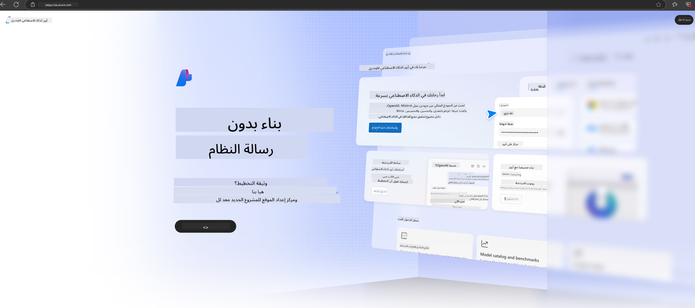

<!--
CO_OP_TRANSLATOR_METADATA:
{
  "original_hash": "3a1e48b628022485aac989c9f733e792",
  "translation_date": "2025-07-17T05:18:55+00:00",
  "source_file": "md/02.QuickStart/AzureAIFoundry_QuickStart.md",
  "language_code": "ar"
}
-->
# **استخدام Phi-3 في Azure AI Foundry**

مع تطور الذكاء الاصطناعي التوليدي، نأمل في استخدام منصة موحدة لإدارة نماذج اللغة الكبيرة (LLM) ونماذج اللغة الصغيرة (SLM)، ودمج بيانات المؤسسات، وعمليات الضبط الدقيق/RAG، وتقييم مختلف الأعمال بعد دمج LLM وSLM، وغيرها، بحيث يمكن لتطبيقات الذكاء الاصطناعي التوليدي أن تُنفذ بشكل أذكى. [Azure AI Foundry](https://ai.azure.com) هي منصة تطبيقات ذكاء اصطناعي توليدي على مستوى المؤسسات.

مع Azure AI Foundry، يمكنك تقييم استجابات نماذج اللغة الكبيرة (LLM) وتنظيم مكونات تطبيقات المطالبات باستخدام prompt flow لأداء أفضل. تسهل المنصة التوسع لتحويل إثبات المفاهيم إلى إنتاج كامل بسهولة. كما تدعم المراقبة المستمرة والتحسين لتحقيق نجاح طويل الأمد.

يمكننا نشر نموذج Phi-3 بسرعة على Azure AI Foundry عبر خطوات بسيطة، ثم استخدام Azure AI Foundry لإكمال أعمال Playground/Chat، والضبط الدقيق، والتقييم المتعلقة بـ Phi-3.

## **1. التحضير**

إذا كان لديك بالفعل [Azure Developer CLI](https://learn.microsoft.com/azure/developer/azure-developer-cli/overview?WT.mc_id=aiml-138114-kinfeylo) مثبتًا على جهازك، فإن استخدام هذا القالب بسيط جدًا عبر تشغيل هذا الأمر في مجلد جديد.

## الإنشاء اليدوي

إنشاء مشروع ومركز في Microsoft Azure AI Foundry هو طريقة رائعة لتنظيم وإدارة أعمال الذكاء الاصطناعي الخاصة بك. إليك دليل خطوة بخطوة للبدء:

### إنشاء مشروع في Azure AI Foundry

1. **اذهب إلى Azure AI Foundry**: سجّل الدخول إلى بوابة Azure AI Foundry.
2. **إنشاء مشروع**:
   - إذا كنت داخل مشروع، اختر "Azure AI Foundry" من أعلى يسار الصفحة للعودة إلى الصفحة الرئيسية.
   - اختر "+ Create project".
   - أدخل اسمًا للمشروع.
   - إذا كان لديك مركز، سيتم اختياره تلقائيًا. إذا كان لديك حق الوصول لأكثر من مركز، يمكنك اختيار مركز مختلف من القائمة المنسدلة. إذا أردت إنشاء مركز جديد، اختر "Create new hub" وادخل اسمًا له.
   - اختر "Create".

### إنشاء مركز في Azure AI Foundry

1. **اذهب إلى Azure AI Foundry**: سجّل الدخول بحساب Azure الخاص بك.
2. **إنشاء مركز**:
   - اختر مركز الإدارة من القائمة اليسرى.
   - اختر "All resources"، ثم السهم المنسدل بجانب "+ New project" واختر "+ New hub".
   - في مربع الحوار "Create a new hub"، أدخل اسمًا لمركزك (مثلاً contoso-hub) وعدّل الحقول الأخرى حسب الرغبة.
   - اختر "Next"، راجع المعلومات، ثم اختر "Create".

لمزيد من التعليمات التفصيلية، يمكنك الرجوع إلى [توثيق مايكروسوفت الرسمي](https://learn.microsoft.com/azure/ai-studio/how-to/create-projects).

بعد الإنشاء بنجاح، يمكنك الوصول إلى الاستوديو الذي أنشأته عبر [ai.azure.com](https://ai.azure.com/)

يمكن أن يكون هناك عدة مشاريع في AI Foundry واحد. أنشئ مشروعًا في AI Foundry للتحضير.

أنشئ Azure AI Foundry [QuickStarts](https://learn.microsoft.com/azure/ai-studio/quickstarts/get-started-code)

## **2. نشر نموذج Phi في Azure AI Foundry**

انقر على خيار Explore الخاص بالمشروع للدخول إلى كتالوج النماذج واختر Phi-3

اختر Phi-3-mini-4k-instruct

انقر على 'Deploy' لنشر نموذج Phi-3-mini-4k-instruct

> [!NOTE]
>
> يمكنك اختيار قوة الحوسبة عند النشر

## **3. دردشة Playground مع Phi في Azure AI Foundry**

اذهب إلى صفحة النشر، اختر Playground، وتحدث مع Phi-3 في Azure AI Foundry

## **4. نشر النموذج من Azure AI Foundry**

لنشر نموذج من كتالوج نماذج Azure، يمكنك اتباع الخطوات التالية:

- سجّل الدخول إلى Azure AI Foundry.
- اختر النموذج الذي تريد نشره من كتالوج نماذج Azure AI Foundry.
- في صفحة تفاصيل النموذج، اختر Deploy ثم اختر Serverless API مع Azure AI Content Safety.
- اختر المشروع الذي تريد نشر نماذجك فيه. لاستخدام خدمة Serverless API، يجب أن يكون مساحة العمل ضمن منطقة East US 2 أو Sweden Central. يمكنك تخصيص اسم النشر.
- في معالج النشر، اختر Pricing and terms للاطلاع على الأسعار وشروط الاستخدام.
- اختر Deploy. انتظر حتى يكتمل النشر ويتم توجيهك إلى صفحة النشرات.
- اختر Open in playground لبدء التفاعل مع النموذج.
- يمكنك العودة إلى صفحة النشرات، اختيار النشر، وتدوين عنوان URL الخاص بالنقطة النهائية (Target URL) والمفتاح السري (Secret Key) الذي يمكنك استخدامه لاستدعاء النشر وتوليد النتائج.
- يمكنك دائمًا العثور على تفاصيل النقطة النهائية، وعنوان URL، ومفاتيح الوصول من خلال الانتقال إلى تبويب Build واختيار Deployments من قسم Components.

> [!NOTE]
> يرجى ملاحظة أنه يجب أن يكون لحسابك أذونات دور Azure AI Developer على مجموعة الموارد لتنفيذ هذه الخطوات.

## **5. استخدام Phi API في Azure AI Foundry**

يمكنك الوصول إلى https://{Your project name}.region.inference.ml.azure.com/swagger.json عبر طلب GET من Postman ودمجه مع المفتاح (Key) للتعرف على الواجهات المتاحة.

يمكنك الحصول على معلمات الطلب بسهولة، وكذلك معلمات الاستجابة.

**إخلاء المسؤولية**:  
تمت ترجمة هذا المستند باستخدام خدمة الترجمة الآلية [Co-op Translator](https://github.com/Azure/co-op-translator). بينما نسعى لتحقيق الدقة، يرجى العلم أن الترجمات الآلية قد تحتوي على أخطاء أو عدم دقة. يجب اعتبار المستند الأصلي بلغته الأصلية المصدر الموثوق به. للمعلومات الهامة، يُنصح بالاعتماد على الترجمة البشرية المهنية. نحن غير مسؤولين عن أي سوء فهم أو تفسير ناتج عن استخدام هذه الترجمة.