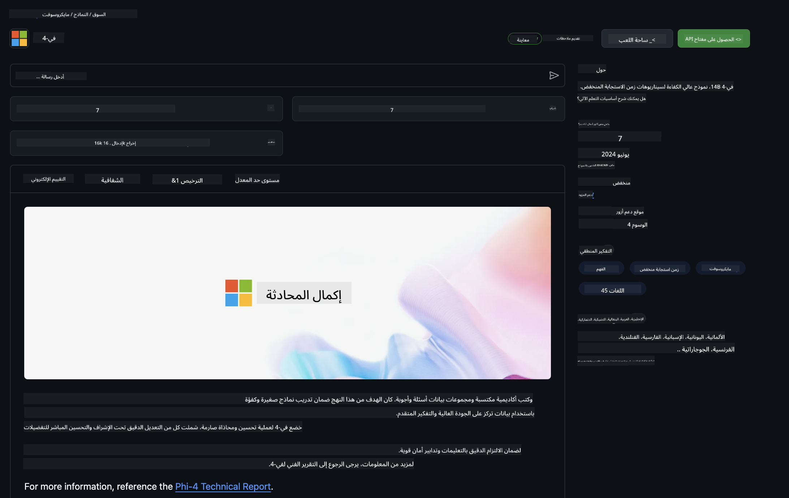

<!--
CO_OP_TRANSLATOR_METADATA:
{
  "original_hash": "5113634b77370af6790f9697d5d7de90",
  "translation_date": "2025-05-07T10:19:14+00:00",
  "source_file": "md/02.QuickStart/GitHubModel_QuickStart.md",
  "language_code": "ar"
}
-->
## نماذج GitHub - بيتا عامة محدودة

مرحبًا بك في [GitHub Models](https://github.com/marketplace/models)! لقد أعددنا كل شيء وجاهز لك لاستكشاف نماذج الذكاء الاصطناعي المستضافة على Azure AI.


لمزيد من المعلومات حول النماذج المتوفرة على GitHub Models، اطلع على [GitHub Model Marketplace](https://github.com/marketplace/models)

## النماذج المتوفرة

كل نموذج له مساحة مخصصة للتجربة وكود أمثلة


### نماذج Phi-3 في كتالوج GitHub Model

[Phi-3-Medium-128k-Instruct](https://github.com/marketplace/models/azureml/Phi-3-medium-128k-instruct)

[Phi-3-medium-4k-instruct](https://github.com/marketplace/models/azureml/Phi-3-medium-4k-instruct)

[Phi-3-mini-128k-instruct](https://github.com/marketplace/models/azureml/Phi-3-mini-128k-instruct)

[Phi-3-mini-4k-instruct](https://github.com/marketplace/models/azureml/Phi-3-mini-4k-instruct)

[Phi-3-small-128k-instruct](https://github.com/marketplace/models/azureml/Phi-3-small-128k-instruct)

[Phi-3-small-8k-instruct](https://github.com/marketplace/models/azureml/Phi-3-small-8k-instruct)

## البدء

هناك بعض الأمثلة الأساسية جاهزة لتشغيلها. يمكنك العثور عليها في مجلد العينات. إذا أردت الانتقال مباشرة إلى لغتك المفضلة، يمكنك العثور على الأمثلة في اللغات التالية:

- Python  
- JavaScript  
- cURL  

هناك أيضًا بيئة Codespaces مخصصة لتشغيل العينات والنماذج.


## كود العينة

فيما يلي مقاطع كود لأمثلة استخدام مختلفة. لمزيد من المعلومات حول Azure AI Inference SDK، راجع التوثيق الكامل والعينات.

## الإعداد

1. أنشئ رمز وصول شخصي  
لا تحتاج إلى منح أي أذونات للرمز. لاحظ أن الرمز سيتم إرساله إلى خدمة مايكروسوفت.

لاستخدام مقاطع الكود أدناه، أنشئ متغير بيئة لتعيين رمزك كمفتاح لكود العميل.

إذا كنت تستخدم bash:  
```
export GITHUB_TOKEN="<your-github-token-goes-here>"
```  
إذا كنت تستخدم powershell:  

```
$Env:GITHUB_TOKEN="<your-github-token-goes-here>"
```  

إذا كنت تستخدم موجه أوامر ويندوز:  

```
set GITHUB_TOKEN=<your-github-token-goes-here>
```  

## مثال Python

### تثبيت التبعيات  
ثبت Azure AI Inference SDK باستخدام pip (يتطلب: Python >=3.8):

```
pip install azure-ai-inference
```  
### تشغيل مثال كود أساسي

هذا المثال يوضح استدعاءً بسيطًا لواجهة برمجة تطبيقات إكمال الدردشة. يستخدم نقطة النهاية الخاصة بنموذج الذكاء الاصطناعي على GitHub ورمز GitHub الخاص بك. الاستدعاء متزامن.

```
import os
from azure.ai.inference import ChatCompletionsClient
from azure.ai.inference.models import SystemMessage, UserMessage
from azure.core.credentials import AzureKeyCredential

endpoint = "https://models.inference.ai.azure.com"
# Replace Model_Name 
model_name = "Phi-3-small-8k-instruct"
token = os.environ["GITHUB_TOKEN"]

client = ChatCompletionsClient(
    endpoint=endpoint,
    credential=AzureKeyCredential(token),
)

response = client.complete(
    messages=[
        SystemMessage(content="You are a helpful assistant."),
        UserMessage(content="What is the capital of France?"),
    ],
    model=model_name,
    temperature=1.,
    max_tokens=1000,
    top_p=1.
)

print(response.choices[0].message.content)
```  

### إجراء محادثة متعددة الأدوار

يوضح هذا المثال محادثة متعددة الأدوار مع واجهة برمجة تطبيقات إكمال الدردشة. عند استخدام النموذج لتطبيق دردشة، ستحتاج إلى إدارة سجل المحادثة وإرسال أحدث الرسائل إلى النموذج.

```
import os
from azure.ai.inference import ChatCompletionsClient
from azure.ai.inference.models import AssistantMessage, SystemMessage, UserMessage
from azure.core.credentials import AzureKeyCredential

token = os.environ["GITHUB_TOKEN"]
endpoint = "https://models.inference.ai.azure.com"
# Replace Model_Name
model_name = "Phi-3-small-8k-instruct"

client = ChatCompletionsClient(
    endpoint=endpoint,
    credential=AzureKeyCredential(token),
)

messages = [
    SystemMessage(content="You are a helpful assistant."),
    UserMessage(content="What is the capital of France?"),
    AssistantMessage(content="The capital of France is Paris."),
    UserMessage(content="What about Spain?"),
]

response = client.complete(messages=messages, model=model_name)

print(response.choices[0].message.content)
```  

### بث المخرجات

لتحسين تجربة المستخدم، سترغب في بث استجابة النموذج بحيث يظهر أول رمز بسرعة وتتجنب الانتظار الطويل للردود.

```
import os
from azure.ai.inference import ChatCompletionsClient
from azure.ai.inference.models import SystemMessage, UserMessage
from azure.core.credentials import AzureKeyCredential

token = os.environ["GITHUB_TOKEN"]
endpoint = "https://models.inference.ai.azure.com"
# Replace Model_Name
model_name = "Phi-3-small-8k-instruct"

client = ChatCompletionsClient(
    endpoint=endpoint,
    credential=AzureKeyCredential(token),
)

response = client.complete(
    stream=True,
    messages=[
        SystemMessage(content="You are a helpful assistant."),
        UserMessage(content="Give me 5 good reasons why I should exercise every day."),
    ],
    model=model_name,
)

for update in response:
    if update.choices:
        print(update.choices[0].delta.content or "", end="")

client.close()
```  
## JavaScript

### تثبيت التبعيات

ثبت Node.js.

انسخ الأسطر التالية واحفظها في ملف package.json داخل مجلدك.

```
{
  "type": "module",
  "dependencies": {
    "@azure-rest/ai-inference": "latest",
    "@azure/core-auth": "latest",
    "@azure/core-sse": "latest"
  }
}
```

ملاحظة: @azure/core-sse مطلوب فقط عند بث استجابات إكمال الدردشة.

افتح نافذة طرفية في هذا المجلد وشغل npm install.

لكل مقطع كود أدناه، انسخ المحتوى إلى ملف sample.js وشغله باستخدام node sample.js.

### تشغيل مثال كود أساسي

هذا المثال يوضح استدعاءً بسيطًا لواجهة برمجة تطبيقات إكمال الدردشة. يستخدم نقطة النهاية الخاصة بنموذج الذكاء الاصطناعي على GitHub ورمز GitHub الخاص بك. الاستدعاء متزامن.

```
import ModelClient from "@azure-rest/ai-inference";
import { AzureKeyCredential } from "@azure/core-auth";

const token = process.env["GITHUB_TOKEN"];
const endpoint = "https://models.inference.ai.azure.com";
// Update your modelname
const modelName = "Phi-3-small-8k-instruct";

export async function main() {

  const client = new ModelClient(endpoint, new AzureKeyCredential(token));

  const response = await client.path("/chat/completions").post({
    body: {
      messages: [
        { role:"system", content: "You are a helpful assistant." },
        { role:"user", content: "What is the capital of France?" }
      ],
      model: modelName,
      temperature: 1.,
      max_tokens: 1000,
      top_p: 1.
    }
  });

  if (response.status !== "200") {
    throw response.body.error;
  }
  console.log(response.body.choices[0].message.content);
}

main().catch((err) => {
  console.error("The sample encountered an error:", err);
});
```  

### إجراء محادثة متعددة الأدوار

يوضح هذا المثال محادثة متعددة الأدوار مع واجهة برمجة تطبيقات إكمال الدردشة. عند استخدام النموذج لتطبيق دردشة، ستحتاج إلى إدارة سجل المحادثة وإرسال أحدث الرسائل إلى النموذج.

```
import ModelClient from "@azure-rest/ai-inference";
import { AzureKeyCredential } from "@azure/core-auth";

const token = process.env["GITHUB_TOKEN"];
const endpoint = "https://models.inference.ai.azure.com";
// Update your modelname
const modelName = "Phi-3-small-8k-instruct";

export async function main() {

  const client = new ModelClient(endpoint, new AzureKeyCredential(token));

  const response = await client.path("/chat/completions").post({
    body: {
      messages: [
        { role: "system", content: "You are a helpful assistant." },
        { role: "user", content: "What is the capital of France?" },
        { role: "assistant", content: "The capital of France is Paris." },
        { role: "user", content: "What about Spain?" },
      ],
      model: modelName,
    }
  });

  if (response.status !== "200") {
    throw response.body.error;
  }

  for (const choice of response.body.choices) {
    console.log(choice.message.content);
  }
}

main().catch((err) => {
  console.error("The sample encountered an error:", err);
});
```  

### بث المخرجات  
لتحسين تجربة المستخدم، سترغب في بث استجابة النموذج بحيث يظهر أول رمز بسرعة وتتجنب الانتظار الطويل للردود.

```
import ModelClient from "@azure-rest/ai-inference";
import { AzureKeyCredential } from "@azure/core-auth";
import { createSseStream } from "@azure/core-sse";

const token = process.env["GITHUB_TOKEN"];
const endpoint = "https://models.inference.ai.azure.com";
// Update your modelname
const modelName = "Phi-3-small-8k-instruct";

export async function main() {

  const client = new ModelClient(endpoint, new AzureKeyCredential(token));

  const response = await client.path("/chat/completions").post({
    body: {
      messages: [
        { role: "system", content: "You are a helpful assistant." },
        { role: "user", content: "Give me 5 good reasons why I should exercise every day." },
      ],
      model: modelName,
      stream: true
    }
  }).asNodeStream();

  const stream = response.body;
  if (!stream) {
    throw new Error("The response stream is undefined");
  }

  if (response.status !== "200") {
    stream.destroy();
    throw new Error(`Failed to get chat completions, http operation failed with ${response.status} code`);
  }

  const sseStream = createSseStream(stream);

  for await (const event of sseStream) {
    if (event.data === "[DONE]") {
      return;
    }
    for (const choice of (JSON.parse(event.data)).choices) {
        process.stdout.write(choice.delta?.content ?? ``);
    }
  }
}

main().catch((err) => {
  console.error("The sample encountered an error:", err);
});
```  

## REST

### تشغيل مثال كود أساسي

الصق التالي في shell:

```
curl -X POST "https://models.inference.ai.azure.com/chat/completions" \
    -H "Content-Type: application/json" \
    -H "Authorization: Bearer $GITHUB_TOKEN" \
    -d '{
        "messages": [
            {
                "role": "system",
                "content": "You are a helpful assistant."
            },
            {
                "role": "user",
                "content": "What is the capital of France?"
            }
        ],
        "model": "Phi-3-small-8k-instruct"
    }'
```  
### إجراء محادثة متعددة الأدوار

اتصل بواجهة برمجة تطبيقات إكمال الدردشة ومرر سجل المحادثة:

```
curl -X POST "https://models.inference.ai.azure.com/chat/completions" \
    -H "Content-Type: application/json" \
    -H "Authorization: Bearer $GITHUB_TOKEN" \
    -d '{
        "messages": [
            {
                "role": "system",
                "content": "You are a helpful assistant."
            },
            {
                "role": "user",
                "content": "What is the capital of France?"
            },
            {
                "role": "assistant",
                "content": "The capital of France is Paris."
            },
            {
                "role": "user",
                "content": "What about Spain?"
            }
        ],
        "model": "Phi-3-small-8k-instruct"
    }'
```  
### بث المخرجات

هذا مثال على استدعاء نقطة النهاية وبث الاستجابة.

```
curl -X POST "https://models.inference.ai.azure.com/chat/completions" \
    -H "Content-Type: application/json" \
    -H "Authorization: Bearer $GITHUB_TOKEN" \
    -d '{
        "messages": [
            {
                "role": "system",
                "content": "You are a helpful assistant."
            },
            {
                "role": "user",
                "content": "Give me 5 good reasons why I should exercise every day."
            }
        ],
        "stream": true,
        "model": "Phi-3-small-8k-instruct"
    }'
```  

## الاستخدام المجاني وحدود المعدل لنماذج GitHub



[حدود المعدل لمساحة التجربة والاستخدام المجاني للواجهة البرمجية](https://docs.github.com/en/github-models/prototyping-with-ai-models#rate-limits) تهدف إلى مساعدتك على تجربة النماذج ونمذجة تطبيق الذكاء الاصطناعي الخاص بك. لاستخدام يتجاوز هذه الحدود، ولتوسيع تطبيقك، يجب أن توفر موارد من حساب Azure، وتوثق من هناك بدلاً من رمز الوصول الشخصي لـ GitHub. لا تحتاج إلى تغيير أي شيء آخر في الكود الخاص بك. استخدم هذا الرابط لاكتشاف كيفية تجاوز حدود المستوى المجاني في Azure AI.

### الإفصاحات

تذكر عند التفاعل مع نموذج أنك تجرب الذكاء الاصطناعي، لذلك قد تحدث أخطاء في المحتوى.

الميزة تخضع لحدود مختلفة (بما في ذلك الطلبات في الدقيقة، الطلبات في اليوم، الرموز في الطلب، والطلبات المتزامنة) وليست مصممة لحالات الاستخدام الإنتاجي.

نماذج GitHub تستخدم Azure AI Content Safety. لا يمكن تعطيل هذه الفلاتر كجزء من تجربة GitHub Models. إذا قررت استخدام النماذج عبر خدمة مدفوعة، يرجى تكوين فلاتر المحتوى لتلبية متطلباتك.

هذه الخدمة تخضع لشروط GitHub للإصدار التجريبي.

**إخلاء المسؤولية**:  
تمت ترجمة هذا المستند باستخدام خدمة الترجمة الآلية [Co-op Translator](https://github.com/Azure/co-op-translator). بينما نسعى جاهدين للدقة، يرجى العلم أن الترجمات الآلية قد تحتوي على أخطاء أو عدم دقة. يجب اعتبار المستند الأصلي بلغته الأصلية المصدر الموثوق به. بالنسبة للمعلومات الحساسة، يُنصح بالترجمة المهنية البشرية. نحن غير مسؤولين عن أي سوء فهم أو تفسير خاطئ ناتج عن استخدام هذه الترجمة.