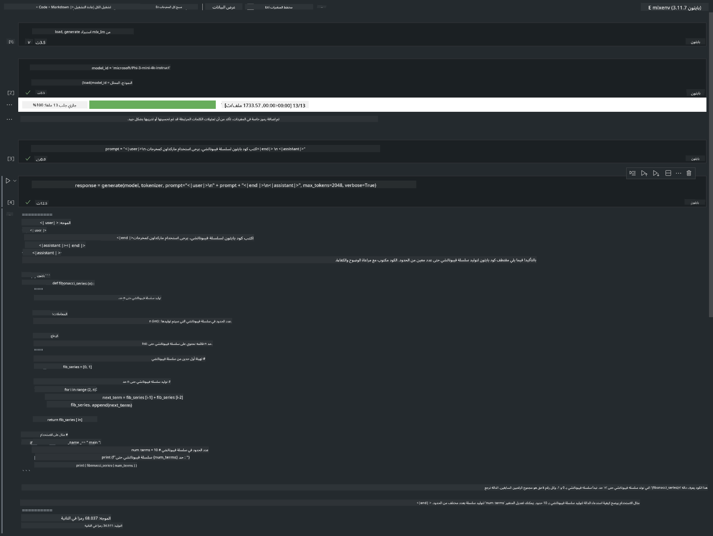

<!--
CO_OP_TRANSLATOR_METADATA:
{
  "original_hash": "dcb656f3d206fc4968e236deec5d4384",
  "translation_date": "2025-07-17T10:03:41+00:00",
  "source_file": "md/03.FineTuning/03.Inference/MLX_Inference.md",
  "language_code": "ar"
}
-->
# **استدلال Phi-3 باستخدام إطار عمل Apple MLX**

## **ما هو إطار عمل MLX**

MLX هو إطار عمل للمصفوفات مخصص لأبحاث التعلم الآلي على شرائح Apple، مقدم من أبحاث التعلم الآلي في Apple.

تم تصميم MLX بواسطة باحثي التعلم الآلي من أجل باحثي التعلم الآلي. يهدف الإطار إلى أن يكون سهل الاستخدام، لكنه في الوقت نفسه فعال لتدريب ونشر النماذج. تصميم الإطار نفسه بسيط من الناحية المفاهيمية. نهدف إلى تسهيل توسيع وتحسين MLX للباحثين بهدف استكشاف أفكار جديدة بسرعة.

يمكن تسريع نماذج LLMs على أجهزة Apple Silicon من خلال MLX، ويمكن تشغيل النماذج محليًا بسهولة كبيرة.

## **استخدام MLX لاستدلال Phi-3-mini**

### **1. إعداد بيئة MLX الخاصة بك**

1. Python 3.11.x  
2. تثبيت مكتبة MLX

```bash

pip install mlx-lm

```

### **2. تشغيل Phi-3-mini في الطرفية باستخدام MLX**

```bash

python -m mlx_lm.generate --model microsoft/Phi-3-mini-4k-instruct --max-token 2048 --prompt  "<|user|>\nCan you introduce yourself<|end|>\n<|assistant|>"

```

النتيجة (بيئتي هي Apple M1 Max، 64GB) هي


### **3. تحويل Phi-3-mini إلى كميات باستخدام MLX في الطرفية**

```bash

python -m mlx_lm.convert --hf-path microsoft/Phi-3-mini-4k-instruct

```

***ملاحظة：*** يمكن تحويل النموذج إلى كميات عبر mlx_lm.convert، والكمية الافتراضية هي INT4. في هذا المثال، يتم تحويل Phi-3-mini إلى INT4.

يمكن تحويل النموذج إلى كميات عبر mlx_lm.convert، والكمية الافتراضية هي INT4. هذا المثال يوضح تحويل Phi-3-mini إلى INT4. بعد التحويل، سيتم تخزينه في الدليل الافتراضي ./mlx_model

يمكننا اختبار النموذج المحول باستخدام MLX من الطرفية

```bash

python -m mlx_lm.generate --model ./mlx_model/ --max-token 2048 --prompt  "<|user|>\nCan you introduce yourself<|end|>\n<|assistant|>"

```

النتيجة هي


### **4. تشغيل Phi-3-mini باستخدام MLX في Jupyter Notebook**



***ملاحظة:*** يرجى قراءة هذا المثال [اضغط على هذا الرابط](../../../../../code/03.Inference/MLX/MLX_DEMO.ipynb)

## **المصادر**

1. تعرّف على إطار عمل Apple MLX [https://ml-explore.github.io](https://ml-explore.github.io/mlx/build/html/index.html)

2. مستودع Apple MLX على GitHub [https://github.com/ml-explore](https://github.com/ml-explore)

**إخلاء المسؤولية**:  
تمت ترجمة هذا المستند باستخدام خدمة الترجمة الآلية [Co-op Translator](https://github.com/Azure/co-op-translator). بينما نسعى لتحقيق الدقة، يرجى العلم أن الترجمات الآلية قد تحتوي على أخطاء أو عدم دقة. يجب اعتبار المستند الأصلي بلغته الأصلية المصدر الموثوق به. للمعلومات الهامة، يُنصح بالاعتماد على الترجمة البشرية المهنية. نحن غير مسؤولين عن أي سوء فهم أو تفسير ناتج عن استخدام هذه الترجمة.