# ضبط نموذج Phi-3 بدقة باستخدام Azure AI Foundry

دعونا نستعرض كيفية ضبط نموذج اللغة Phi-3 Mini من مايكروسوفت باستخدام Azure AI Foundry. يتيح الضبط الدقيق تكييف Phi-3 Mini لمهام محددة، مما يجعله أكثر قوة وفهمًا للسياق.

## اعتبارات

- **القدرات:** ما هي النماذج التي يمكن ضبطها بدقة؟ وما الذي يمكن للنموذج الأساسي أن يُضبط عليه؟
- **التكلفة:** ما هو نموذج التسعير للضبط الدقيق؟
- **قابلية التخصيص:** إلى أي مدى يمكنني تعديل النموذج الأساسي – وبأي طرق؟
- **الراحة:** كيف يتم الضبط الدقيق فعليًا – هل أحتاج لكتابة كود مخصص؟ هل أحتاج إلى توفير موارد حوسبة خاصة بي؟
- **السلامة:** النماذج المضبوطة بدقة قد تحمل مخاطر تتعلق بالسلامة – هل هناك ضوابط لحمايتي من الأضرار غير المقصودة؟

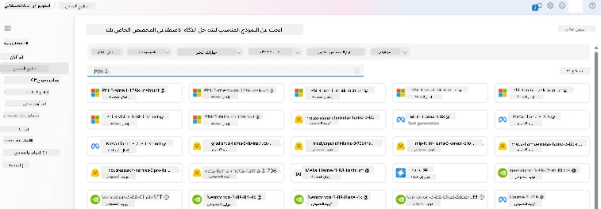

## التحضير للضبط الدقيق

### المتطلبات الأساسية

> [!NOTE]
> بالنسبة لنماذج عائلة Phi-3، فإن عرض الضبط الدقيق بنظام الدفع حسب الاستخدام متاح فقط مع المراكز التي تم إنشاؤها في مناطق **East US 2**.

- اشتراك في Azure. إذا لم يكن لديك اشتراك، قم بإنشاء [حساب Azure مدفوع](https://azure.microsoft.com/pricing/purchase-options/pay-as-you-go) للبدء.

- مشروع [AI Foundry](https://ai.azure.com?WT.mc_id=aiml-138114-kinfeylo).
- يتم استخدام ضوابط الوصول القائمة على الدور في Azure (Azure RBAC) لمنح الوصول إلى العمليات في Azure AI Foundry. لتنفيذ الخطوات في هذا المقال، يجب أن يكون حساب المستخدم الخاص بك معينًا بدور __Azure AI Developer__ على مجموعة الموارد.

### تسجيل مزود الاشتراك

تحقق من تسجيل الاشتراك لمزود الموارد `Microsoft.Network`.

1. سجّل الدخول إلى [بوابة Azure](https://portal.azure.com).
1. اختر **الاشتراكات** من القائمة اليسرى.
1. اختر الاشتراك الذي تريد استخدامه.
1. اختر **إعدادات مشروع AI** > **مزودو الموارد** من القائمة اليسرى.
1. تأكد من وجود **Microsoft.Network** في قائمة مزودي الموارد، وإذا لم يكن موجودًا، أضفه.

### تحضير البيانات

قم بتحضير بيانات التدريب والتحقق لضبط النموذج. تتكون مجموعات بيانات التدريب والتحقق من أمثلة إدخال وإخراج توضح كيف تريد أن يعمل النموذج.

تأكد من أن جميع أمثلة التدريب تتبع التنسيق المتوقع للاستدلال. لضبط النماذج بفعالية، احرص على وجود مجموعة بيانات متوازنة ومتنوعة.

يشمل ذلك الحفاظ على توازن البيانات، واحتواء سيناريوهات مختلفة، وتنقيح بيانات التدريب بشكل دوري لتتوافق مع التوقعات الواقعية، مما يؤدي إلى استجابات نموذج أكثر دقة وتوازنًا.

تتطلب أنواع النماذج المختلفة تنسيقات مختلفة لبيانات التدريب.

### إكمال المحادثة

يجب أن تكون بيانات التدريب والتحقق التي تستخدمها **بتنسيق JSON Lines (JSONL)**. بالنسبة لـ `Phi-3-mini-128k-instruct` يجب أن يكون مجموعة بيانات الضبط الدقيق بتنسيق المحادثة المستخدم في واجهة برمجة تطبيقات إكمال المحادثة.

### مثال على تنسيق الملف

```json
    {"messages": [{"role": "system", "content": "You are an Xbox customer support agent whose primary goal is to help users with issues they are experiencing with their Xbox devices. You are friendly and concise. You only provide factual answers to queries, and do not provide answers that are not related to Xbox."}, {"role": "user", "content": "Is Xbox better than PlayStation?"}, {"role": "assistant", "content": "I apologize, but I cannot provide personal opinions. My primary job is to assist you with any issues related to your Xbox device. Do you have any Xbox-related issues that need addressing?"}]}
    {"messages": [{"role": "system", "content": "You are an Xbox customer support agent whose primary goal is to help users with issues they are experiencing with their Xbox devices. You are friendly and concise. You only provide factual answers to queries, and do not provide answers that are not related to Xbox."}, {"role": "user", "content": "Can I play PC games on my Xbox?"}, {"role": "assistant", "content": "While Xbox consoles don't natively support PC games, they can play an array of Xbox games, many of which are also available on PC. Can I assist you with finding games compatible with your Xbox device?"}]}
    {"messages": [{"role": "system", "content": "You are an Xbox customer support agent whose primary goal is to help users with issues they are experiencing with their Xbox devices. You are friendly and concise. You only provide factual answers to queries, and do not provide answers that are not related to Xbox."}, {"role": "user", "content": "I'm having trouble connecting my Xbox to the Wi-Fi."}, {"role": "assistant", "content": "No worries, let's go through the network settings on your Xbox. Can you please tell me what happens when you try to connect it to the Wi-Fi?"}]}
```

نوع الملف المدعوم هو JSON Lines. يتم رفع الملفات إلى مخزن البيانات الافتراضي وتكون متاحة في مشروعك.

## ضبط نموذج Phi-3 بدقة باستخدام Azure AI Foundry

يتيح Azure AI Foundry تخصيص نماذج اللغة الكبيرة لمجموعات بياناتك الشخصية من خلال عملية تعرف بالضبط الدقيق. يوفر الضبط الدقيق قيمة كبيرة من خلال تمكين التخصيص والتحسين لمهام وتطبيقات محددة. يؤدي ذلك إلى تحسين الأداء، وكفاءة التكلفة، وتقليل زمن الاستجابة، وإخراج مخصص.

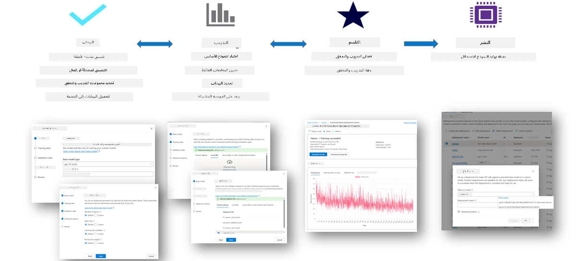

### إنشاء مشروع جديد

1. سجّل الدخول إلى [Azure AI Foundry](https://ai.azure.com).

1. اختر **+مشروع جديد** لإنشاء مشروع جديد في Azure AI Foundry.

    

1. قم بالمهام التالية:

    - اسم **مركز المشروع**. يجب أن يكون قيمة فريدة.
    - اختر **المركز** الذي تريد استخدامه (أنشئ مركزًا جديدًا إذا لزم الأمر).

    

1. قم بالمهام التالية لإنشاء مركز جديد:

    - أدخل **اسم المركز**. يجب أن يكون قيمة فريدة.
    - اختر اشتراك Azure الخاص بك.
    - اختر **مجموعة الموارد** التي تريد استخدامها (أنشئ مجموعة جديدة إذا لزم الأمر).
    - اختر **الموقع** الذي ترغب في استخدامه.
    - اختر **ربط خدمات Azure AI** التي تريد استخدامها (أنشئ واحدة جديدة إذا لزم الأمر).
    - اختر **ربط Azure AI Search** ثم **تخطي الربط**.

    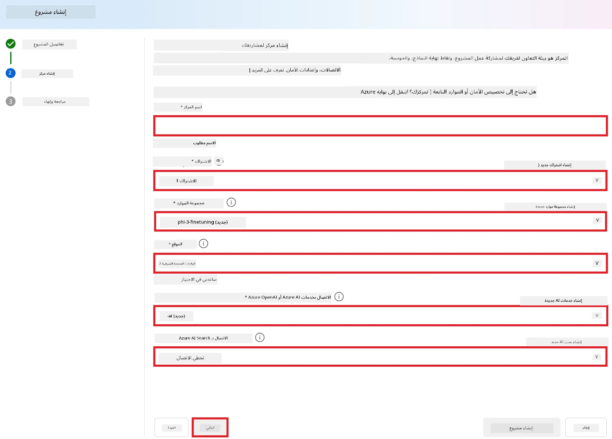

1. اختر **التالي**.
1. اختر **إنشاء مشروع**.

### تحضير البيانات

قبل الضبط الدقيق، اجمع أو أنشئ مجموعة بيانات ذات صلة بمهمتك، مثل تعليمات المحادثة، أزواج الأسئلة والأجوبة، أو أي بيانات نصية أخرى ذات صلة. قم بتنظيف هذه البيانات ومعالجتها مسبقًا بإزالة الضوضاء، ومعالجة القيم المفقودة، وتقسيم النص إلى وحدات.

### ضبط نماذج Phi-3 في Azure AI Foundry

> [!NOTE]
> يتم دعم الضبط الدقيق لنماذج Phi-3 حاليًا في المشاريع الموجودة في منطقة East US 2.

1. اختر **كتالوج النماذج** من القائمة الجانبية اليسرى.

1. اكتب *phi-3* في **شريط البحث** واختر نموذج phi-3 الذي ترغب في استخدامه.

    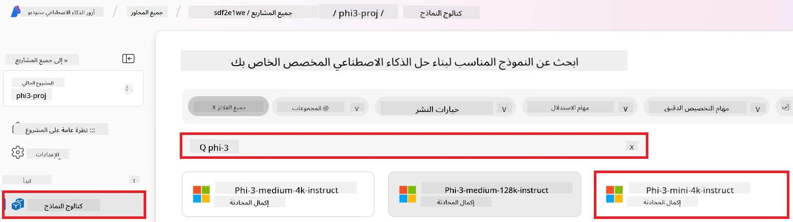

1. اختر **ضبط دقيق**.

    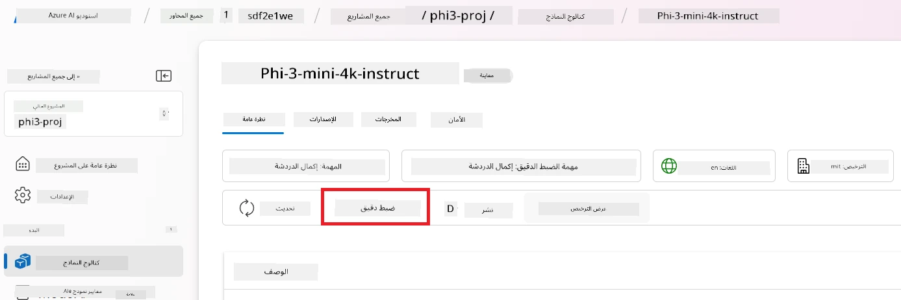

1. أدخل **اسم النموذج المضبوط**.

    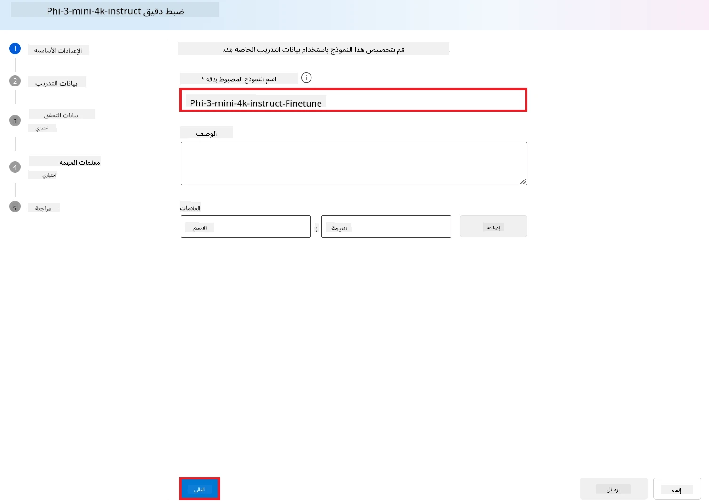

1. اختر **التالي**.

1. قم بالمهام التالية:

    - اختر **نوع المهمة** إلى **إكمال المحادثة**.
    - اختر **بيانات التدريب** التي تريد استخدامها. يمكنك رفعها من خلال بيانات Azure AI Foundry أو من بيئتك المحلية.

    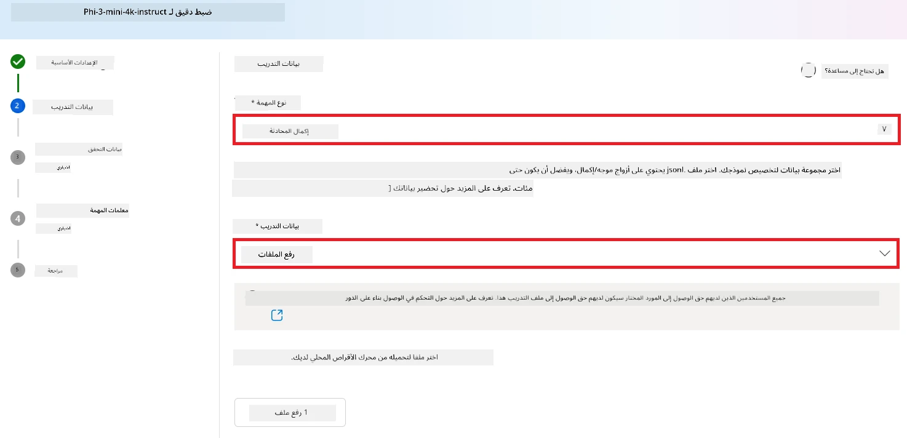

1. اختر **التالي**.

1. ارفع **بيانات التحقق** التي تريد استخدامها، أو يمكنك اختيار **التقسيم التلقائي لبيانات التدريب**.

    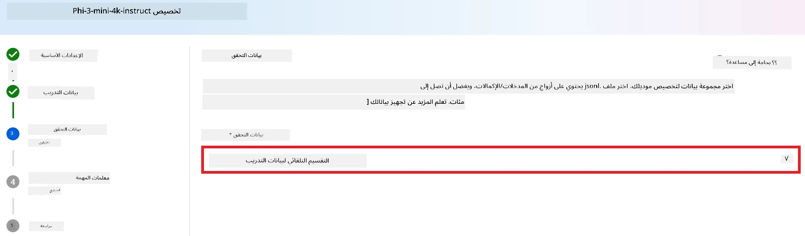

1. اختر **التالي**.

1. قم بالمهام التالية:

    - اختر **مضاعف حجم الدُفعة** الذي تريد استخدامه.
    - اختر **معدل التعلم** الذي تريد استخدامه.
    - اختر **عدد العصور (Epochs)** التي تريد استخدامها.

    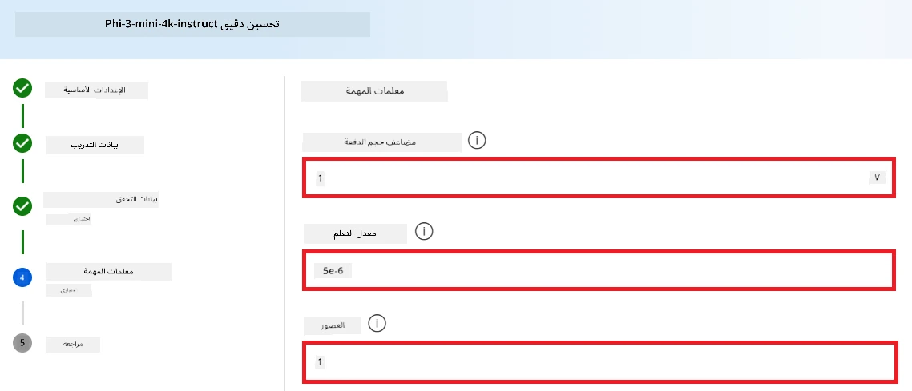

1. اختر **إرسال** لبدء عملية الضبط الدقيق.

    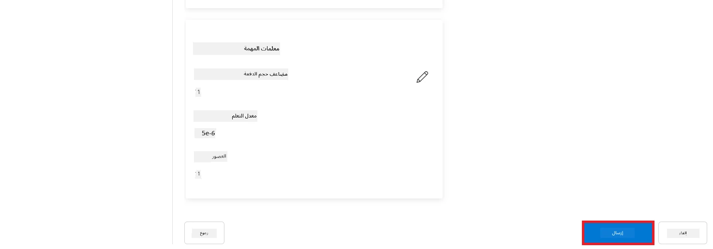

1. بمجرد الانتهاء من ضبط النموذج، ستظهر الحالة على أنها **مكتمل**، كما هو موضح في الصورة أدناه. يمكنك الآن نشر النموذج واستخدامه في تطبيقك الخاص، أو في بيئة اللعب، أو في تدفق المطالبات. لمزيد من المعلومات، راجع [كيفية نشر عائلة نماذج Phi-3 الصغيرة باستخدام Azure AI Foundry](https://learn.microsoft.com/azure/ai-studio/how-to/deploy-models-phi-3?tabs=phi-3-5&pivots=programming-language-python).

    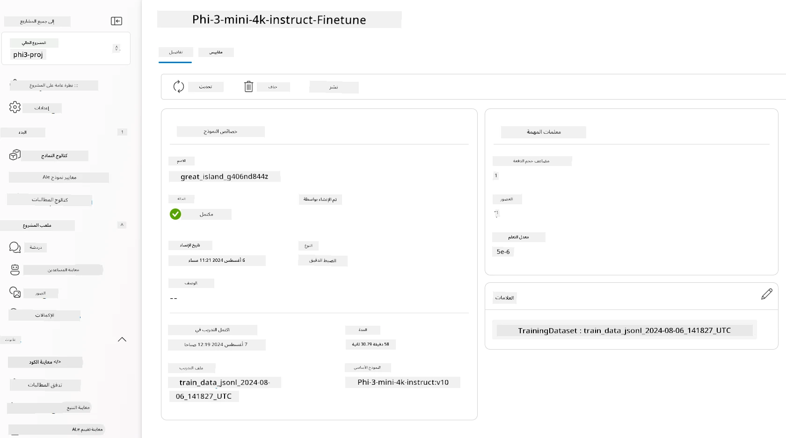

> [!NOTE]
> لمزيد من المعلومات التفصيلية حول ضبط Phi-3، يرجى زيارة [ضبط نماذج Phi-3 في Azure AI Foundry](https://learn.microsoft.com/azure/ai-studio/how-to/fine-tune-phi-3?tabs=phi-3-mini).

## تنظيف النماذج المضبوطة

يمكنك حذف نموذج مضبوط من قائمة نماذج الضبط الدقيق في [Azure AI Foundry](https://ai.azure.com) أو من صفحة تفاصيل النموذج. اختر النموذج المضبوط الذي تريد حذفه من صفحة الضبط الدقيق، ثم اختر زر الحذف لحذف النموذج.

> [!NOTE]
> لا يمكنك حذف نموذج مخصص إذا كان لديه نشر قائم. يجب عليك أولاً حذف نشر النموذج قبل أن تتمكن من حذف النموذج المخصص.

## التكلفة والحصص

### اعتبارات التكلفة والحصص لنماذج Phi-3 المضبوطة كخدمة

نماذج Phi المضبوطة كخدمة مقدمة من مايكروسوفت ومتكاملة مع Azure AI Foundry للاستخدام. يمكنك الاطلاع على التسعير عند [نشر](https://learn.microsoft.com/azure/ai-studio/how-to/deploy-models-phi-3?tabs=phi-3-5&pivots=programming-language-python) أو ضبط النماذج ضمن تبويب التسعير والشروط في معالج النشر.

## تصفية المحتوى

النماذج المنشورة كخدمة بنظام الدفع حسب الاستخدام محمية بواسطة Azure AI Content Safety. عند النشر على نقاط نهاية الوقت الحقيقي، يمكنك اختيار تعطيل هذه الميزة. مع تمكين أمان المحتوى في Azure AI، يمر كل من المطالبة والإكمال عبر مجموعة من نماذج التصنيف التي تهدف إلى اكتشاف ومنع إخراج المحتوى الضار. يكتشف نظام تصفية المحتوى ويتخذ إجراءات على فئات محددة من المحتوى الضار المحتمل في كل من المطالبات المدخلة والإكمالات الناتجة. تعرف على المزيد حول [Azure AI Content Safety](https://learn.microsoft.com/azure/ai-studio/concepts/content-filtering).

**إعدادات الضبط الدقيق**

المعلمات الفائقة: حدد المعلمات الفائقة مثل معدل التعلم، حجم الدُفعة، وعدد عصور التدريب.

**دالة الخسارة**

اختر دالة خسارة مناسبة لمهمتك (مثل: cross-entropy).

**المحسن**

اختر محسنًا (مثل: Adam) لتحديثات التدرج أثناء التدريب.

**عملية الضبط الدقيق**

- تحميل النموذج المدرب مسبقًا: تحميل نقطة التحقق الخاصة بـ Phi-3 Mini.
- إضافة طبقات مخصصة: أضف طبقات خاصة بالمهمة (مثل رأس التصنيف لتعليمات المحادثة).

**تدريب النموذج**  
اضبط النموذج باستخدام مجموعة البيانات التي أعددتها. راقب تقدم التدريب وعدل المعلمات الفائقة حسب الحاجة.

**التقييم والتحقق**

مجموعة التحقق: قسم بياناتك إلى مجموعات تدريب وتحقق.

**تقييم الأداء**

استخدم مقاييس مثل الدقة، F1-score، أو التعقيد (perplexity) لتقييم أداء النموذج.

## حفظ النموذج المضبوط

**نقطة التحقق**  
احفظ نقطة التحقق للنموذج المضبوط لاستخدامها مستقبلاً.

## النشر

- النشر كخدمة ويب: انشر نموذجك المضبوط كخدمة ويب في Azure AI Foundry.
- اختبار نقطة النهاية: أرسل استعلامات اختبار إلى نقطة النهاية المنشورة للتحقق من عملها.

## التكرار والتحسين

كرر العملية: إذا لم يكن الأداء مرضيًا، قم بالتكرار عن طريق تعديل المعلمات الفائقة، إضافة المزيد من البيانات، أو الضبط الدقيق لعدد أكبر من العصور.

## المراقبة والتنقيح

راقب سلوك النموذج باستمرار وقم بتنقيحه حسب الحاجة.

## التخصيص والتوسيع

المهام المخصصة: يمكن ضبط Phi-3 Mini لمهام متنوعة تتجاوز تعليمات المحادثة. استكشف استخدامات أخرى!  
التجربة: جرب هياكل مختلفة، تركيبات طبقات، وتقنيات لتحسين الأداء.

> [!NOTE]
> الضبط الدقيق هو عملية تكرارية. جرب، تعلم، وكيّف نموذجك لتحقيق أفضل النتائج لمهمتك الخاصة!

**إخلاء المسؤولية**:  
تمت ترجمة هذا المستند باستخدام خدمة الترجمة الآلية [Co-op Translator](https://github.com/Azure/co-op-translator). بينما نسعى لتحقيق الدقة، يرجى العلم أن الترجمات الآلية قد تحتوي على أخطاء أو عدم دقة. يجب اعتبار المستند الأصلي بلغته الأصلية المصدر الموثوق به. للمعلومات الهامة، يُنصح بالاعتماد على الترجمة البشرية المهنية. نحن غير مسؤولين عن أي سوء فهم أو تفسير ناتج عن استخدام هذه الترجمة.