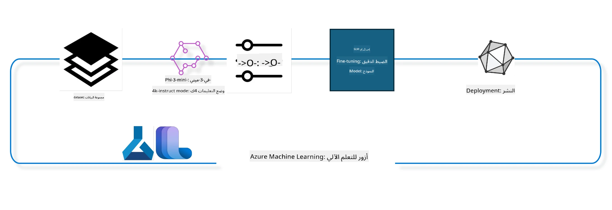

## كيفية استخدام مكونات إكمال الدردشة من سجل نظام Azure ML لضبط نموذج دقيق

في هذا المثال سنقوم بضبط دقيق لنموذج Phi-3-mini-4k-instruct لإكمال محادثة بين شخصين باستخدام مجموعة بيانات ultrachat_200k.



سيظهر لك المثال كيفية إجراء الضبط الدقيق باستخدام Azure ML SDK و Python ثم نشر النموذج المضبوط دقيقًا إلى نقطة نهاية عبر الإنترنت للاستدلال في الوقت الحقيقي.

### بيانات التدريب

سنستخدم مجموعة بيانات ultrachat_200k. هذه نسخة مُرشحة بشكل كبير من مجموعة بيانات UltraChat واُستخدمت لتدريب Zephyr-7B-β، وهو نموذج دردشة متطور بحجم 7 مليار.

### النموذج

سنستخدم نموذج Phi-3-mini-4k-instruct لنعرض كيف يمكن للمستخدم ضبط نموذج لمهمة إكمال الدردشة. إذا فتحت هذا الدفتر من بطاقة نموذج معينة، تذكر أن تستبدل اسم النموذج المحدد.

### المهام

- اختيار نموذج لضبطه دقيقًا.
- اختيار واستكشاف بيانات التدريب.
- تهيئة مهمة الضبط الدقيق.
- تشغيل مهمة الضبط الدقيق.
- مراجعة مقاييس التدريب والتقييم.
- تسجيل النموذج المضبوط دقيقًا.
- نشر النموذج المضبوط دقيقًا للاستدلال في الوقت الحقيقي.
- تنظيف الموارد.

## 1. إعداد المتطلبات المسبقة

- تثبيت التبعيات
- الاتصال بمساحة عمل AzureML. تعلّم المزيد في إعداد مصادقة SDK. استبدل <WORKSPACE_NAME> و <RESOURCE_GROUP> و <SUBSCRIPTION_ID> أدناه.
- الاتصال بسجل نظام AzureML
- تعيين اسم تجربة اختياري
- التحقق من وجود أو إنشاء حوسبة.

> [!NOTE]
> المتطلبات: يمكن أن تحتوي عقدة GPU واحدة على عدة بطاقات GPU. على سبيل المثال، في عقدة واحدة من Standard_NC24rs_v3 هناك 4 بطاقات NVIDIA V100 GPUs بينما في Standard_NC12s_v3 هناك 2 بطاقات NVIDIA V100 GPUs. ارجع إلى الوثائق لهذه المعلومات. يتم تعيين عدد بطاقات GPU في العقدة في المتغير gpus_per_node أدناه. تعيين هذه القيمة بشكل صحيح سيضمن استخدام جميع وحدات GPU في العقدة. يمكن العثور على SKUs الموصى بها للحوسبة باستخدام GPU هنا وهنا.

### مكتبات بايثون

قم بتثبيت التبعيات بتشغيل الخلية أدناه. هذه ليست خطوة اختيارية إذا كنت تعمل في بيئة جديدة.

```bash
pip install azure-ai-ml
pip install azure-identity
pip install datasets==2.9.0
pip install mlflow
pip install azureml-mlflow
```

### التفاعل مع Azure ML

1. يُستخدم هذا السكربت الخاص ببايثون للتفاعل مع خدمة تعلم الآلة من مايكروسوفت Azure (Azure ML). فيما يلي ملخص لما يقوم به:

    - يستورد الوحدات الضرورية من الحزم azure.ai.ml، azure.identity، و azure.ai.ml.entities. كما يستورد وحدة time.

    - يحاول المصادقة باستخدام DefaultAzureCredential()، التي توفر تجربة مصادقة مبسطة لبدء تطوير التطبيقات التي تعمل في سحابة Azure بسرعة. إذا فشل الأمر، يتم الرجوع إلى InteractiveBrowserCredential() التي توفر نافذة تسجيل دخول تفاعلية.

    - يحاول بعد ذلك إنشاء مثيل MLClient باستخدام طريقة from_config التي تقرأ الإعدادات من ملف الإعداد الافتراضي (config.json). إذا فشل ذلك، ينشئ مثيل MLClient بتوفير subscription_id وresource_group_name وworkspace_name يدويًا.

    - ينشئ مثيل MLClient آخر، هذه المرة لسجل Azure ML المسمى "azureml". هذا السجل هو حيث تُخزن النماذج وأنابيب الضبط الدقيق وبيئات العمل.

    - يحدد اسم التجربة experiment_name ليكون "chat_completion_Phi-3-mini-4k-instruct".

    - يولد طابع زمني فريد بتحويل الوقت الحالي (بالثواني منذ epoch كعدد عشري) إلى عدد صحيح ثم إلى سلسلة نصية. يمكن استخدام هذا الطابع الزمني لإنشاء أسماء وإصدارات فريدة.

    ```python
    # استيراد الوحدات الضرورية من Azure ML وAzure Identity
    from azure.ai.ml import MLClient
    from azure.identity import (
        DefaultAzureCredential,
        InteractiveBrowserCredential,
    )
    from azure.ai.ml.entities import AmlCompute
    import time  # استيراد وحدة الوقت
    
    # محاولة المصادقة باستخدام DefaultAzureCredential
    try:
        credential = DefaultAzureCredential()
        credential.get_token("https://management.azure.com/.default")
    except Exception as ex:  # إذا فشلت DefaultAzureCredential، استخدم InteractiveBrowserCredential
        credential = InteractiveBrowserCredential()
    
    # محاولة إنشاء مثيل MLClient باستخدام ملف التكوين الافتراضي
    try:
        workspace_ml_client = MLClient.from_config(credential=credential)
    except:  # إذا فشل ذلك، أنشئ مثيل MLClient عن طريق توفير التفاصيل يدوياً
        workspace_ml_client = MLClient(
            credential,
            subscription_id="<SUBSCRIPTION_ID>",
            resource_group_name="<RESOURCE_GROUP>",
            workspace_name="<WORKSPACE_NAME>",
        )
    
    # إنشاء مثيل MLClient آخر لسجل Azure ML باسم "azureml"
    # هذا السجل هو المكان الذي تُخزن فيه النماذج وأنابيب التخصيص والبيئات
    registry_ml_client = MLClient(credential, registry_name="azureml")
    
    # تعيين اسم التجربة
    experiment_name = "chat_completion_Phi-3-mini-4k-instruct"
    
    # إنشاء طابع زمني فريد يمكن استخدامه للأسماء والإصدارات التي تحتاج إلى التفرد
    timestamp = str(int(time.time()))
    ```

## 2. اختيار نموذج أساس لضبطه دقيقًا

1. Phi-3-mini-4k-instruct هو نموذج مفتوح بحجم 3.8 مليار معاملات، خفيف الوزن، ومتطور يعتمد على مجموعات البيانات المستخدمة لنموذج Phi-2. ينتمي النموذج لعائلة نماذج Phi-3، والنسخة Mini تأتي بنوعين 4K و 128K وهو طول السياق (بعدد التوكنات) التي يمكنه دعمها. نحتاج لضبط النموذج للغرض المحدد الذي نرغب باستخدامه له. يمكنك تصفح هذه النماذج في كتالوج النماذج في AzureML Studio، مع ترشيح حسب مهمة إكمال الدردشة. في هذا المثال، نستخدم نموذج Phi-3-mini-4k-instruct. إذا فتحت هذا الدفتر لنموذج مختلف، استبدل اسم النموذج والنسخة حسب الحاجة.

> [!NOTE]
> الخاصية model id للنموذج. سيتم تمريرها كمدخل لمهمة الضبط الدقيق. وهي متاحة أيضًا كحقل Asset ID في صفحة تفاصيل النموذج في كتالوج النماذج في AzureML Studio.

2. هذا السكربت الخاص ببايثون يتفاعل مع خدمة تعلم الآلة من مايكروسوفت Azure ML. فيما يلي تفصيل لما يقوم به:

    - يعين model_name إلى "Phi-3-mini-4k-instruct".

    - يستخدم طريقة get من خاصية models لكائن registry_ml_client لاسترجاع أحدث إصدار من النموذج بالاسم المحدد من سجل Azure ML. تستدعى get بوسيطين: اسم النموذج وتسمية تحدد استرجاع أحدث نسخة من النموذج.

    - يطبع رسالة على وحدة التحكم توضح اسم النموذج، نسخه، ومعرفه الذي سيُستخدم للضبط الدقيق. تُستخدم دالة format للسلسلة لإدخال الاسم، النسخة، والمعرف في الرسالة. تُعطى هذه القيم من خصائص كائن foundation_model.

    ```python
    # تعيين اسم النموذج
    model_name = "Phi-3-mini-4k-instruct"
    
    # احصل على أحدث إصدار من النموذج من سجل Azure ML
    foundation_model = registry_ml_client.models.get(model_name, label="latest")
    
    # طباعة اسم النموذج والإصدار والمعرف
    # هذه المعلومات مفيدة للتتبع وتصحيح الأخطاء
    print(
        "\n\nUsing model name: {0}, version: {1}, id: {2} for fine tuning".format(
            foundation_model.name, foundation_model.version, foundation_model.id
        )
    )
    ```

## 3. إنشاء حوسبة لاستخدامها مع المهمة

تعمل مهمة الضبط الدقيق فقط مع حوسبة GPU. حجم الحوسبة يعتمد على حجم النموذج وفي أغلب الحالات يصبح من الصعب اختيار الحوسبة الصحيحة للمهمة. في هذه الخلية، نرشد المستخدم لاختيار الحوسبة المناسبة.

> [!NOTE]
> الحواسب المدرجة أدناه تعمل بأكثر الإعدادات تحسيناً. أي تغييرات في الإعدادات قد تؤدي إلى خطأ Cuda Out Of Memory. في مثل هذه الحالات، حاول ترقية الحوسبة إلى حجم أكبر.

> [!NOTE]
> عند اختيار compute_cluster_size أدناه، تأكد من توفر الحوسبة في مجموعة الموارد الخاصة بك. إذا لم تتوفر حوسبة معينة يمكنك طلب الحصول على وصول إلى موارد الحوسبة.

### التحقق من دعم النموذج للضبط الدقيق

1. هذا السكربت الخاص ببايثون يتفاعل مع نموذج Azure ML. إليك تفصيل ما يقوم به:

    - يستورد وحدة ast، التي توفر وظائف لمعالجة شجر قواعد تركيب اللغة المجردة في بايثون.

    - يتحقق إذا كان كائن foundation_model (يمثل نموذجًا في Azure ML) يحتوي على وسم اسمه finetune_compute_allow_list. الأوسمة في Azure ML هي أزواج مفتاح-قيمة يمكنك إنشاؤها واستخدامها لترشيح وترتيب النماذج.

    - إذا وسم finetune_compute_allow_list موجود، يستخدم الدالة ast.literal_eval لتحليل نص الوسم بأمان إلى قائمة بايثون. ثم تعين هذه القائمة لمتغير computes_allow_list. بعد ذلك يطبع رسالة توضح ضرورة إنشاء حوسبة من القائمة.

    - إذا وسم finetune_compute_allow_list غير موجود، يعين computes_allow_list إلى None ويطبع رسالة توضح أن الوسم ليس من بين أوسمة النموذج.

    - باختصار، يفحص السكربت وجود وسم معين في بيانات النموذج الوصفية، يحول قيمة الوسم إلى قائمة إذا وجدت، ويوفر تغذية راجعة للمستخدم.

    ```python
    # استيراد وحدة ast، التي توفر دوال لمعالجة أشجار قواعد النحو التجريدية في بايثون
    import ast
    
    # التحقق مما إذا كانت علامة 'finetune_compute_allow_list' موجودة في علامات النموذج
    if "finetune_compute_allow_list" in foundation_model.tags:
        # إذا كانت العلامة موجودة، استخدم ast.literal_eval لتحليل قيمة العلامة بأمان (سلسلة نصية) إلى قائمة بايثون
        computes_allow_list = ast.literal_eval(
            foundation_model.tags["finetune_compute_allow_list"]
        )  # تحويل النص إلى قائمة بايثون
        # طباعة رسالة تشير إلى أنه يجب إنشاء حساب من القائمة
        print(f"Please create a compute from the above list - {computes_allow_list}")
    else:
        # إذا لم تكن العلامة موجودة، اضبط computes_allow_list على None
        computes_allow_list = None
        # طباعة رسالة تشير إلى أن العلامة 'finetune_compute_allow_list' ليست جزءًا من علامات النموذج
        print("`finetune_compute_allow_list` is not part of model tags")
    ```

### التحقق من حالة مثيل الحوسبة

1. هذا السكربت الخاص ببايثون يتفاعل مع خدمة Azure ML ويجري عدة فحوصات على مثيل حوسبة. إليك تفصيل ما يقوم به:

    - يحاول استرجاع مثيل الحوسبة بالاسم المخزن في compute_cluster من مساحة عمل Azure ML. إذا كانت حالة توفير المثيل "failed"، يرفع استثناء ValueError.

    - يتحقق إذا كانت computes_allow_list ليست None. إذا لم تكن كذلك، يحول جميع أحجام الحوسبة في القائمة إلى أحرف صغيرة ويتفقد إذا كان حجم مثيل الحوسبة الحالي ضمن القائمة. إذا لم يكن كذلك، يرفع استثناء ValueError.

    - إذا كانت computes_allow_list None، يتحقق إذا كان حجم مثيل الحوسبة ضمن قائمة أحجام VM غير المدعومة لوحدات GPU. إذا كان كذلك، يرفع استثناء ValueError.

    - يسترجع قائمة بكل أحجام الحوسبة المتاحة في مساحة العمل. ثم يتصفح هذه القائمة، ولكل حجم يتحقق إذا كان اسمه يطابق حجم المثيل الحالي. إذا كان كذلك، يسترجع عدد وحدات GPU لذلك الحجم ويعين gpu_count_found إلى True.

    - إذا كانت gpu_count_found True، يطبع عدد وحدات GPU في المثيل. إذا كانت False، يرفع استثناء ValueError.

    - باختصار، ينفذ السكربت عدة فحوصات على مثيل حوسبة في مساحة عمل Azure ML، بما في ذلك حالة توفير المثيل، حجمه مقارنة بقائمة سماح أو قائمة حظر، وعدد وحدات GPU التي يمتلكها.
    
    ```python
    # طباعة رسالة الاستثناء
    print(e)
    # رفع ValueError إذا لم يكن حجم الحوسبة متاحًا في مساحة العمل
    raise ValueError(
        f"WARNING! Compute size {compute_cluster_size} not available in workspace"
    )
    
    # استرداد مثيل الحوسبة من مساحة عمل Azure ML
    compute = workspace_ml_client.compute.get(compute_cluster)
    # التحقق مما إذا كانت حالة التوفير لمثيل الحوسبة هي "فشل"
    if compute.provisioning_state.lower() == "failed":
        # رفع ValueError إذا كانت حالة التوفير هي "فشل"
        raise ValueError(
            f"Provisioning failed, Compute '{compute_cluster}' is in failed state. "
            f"please try creating a different compute"
        )
    
    # التحقق مما إذا كانت computes_allow_list ليست None
    if computes_allow_list is not None:
        # تحويل جميع أحجام الحوسبة في computes_allow_list إلى أحرف صغيرة
        computes_allow_list_lower_case = [x.lower() for x in computes_allow_list]
        # التحقق مما إذا كان حجم مثيل الحوسبة موجودًا في computes_allow_list_lower_case
        if compute.size.lower() not in computes_allow_list_lower_case:
            # رفع ValueError إذا لم يكن حجم مثيل الحوسبة موجودًا في computes_allow_list_lower_case
            raise ValueError(
                f"VM size {compute.size} is not in the allow-listed computes for finetuning"
            )
    else:
        # تعريف قائمة بأحجام VM الخاصة بـ GPU غير المدعومة
        unsupported_gpu_vm_list = [
            "standard_nc6",
            "standard_nc12",
            "standard_nc24",
            "standard_nc24r",
        ]
        # التحقق مما إذا كان حجم مثيل الحوسبة موجودًا في unsupported_gpu_vm_list
        if compute.size.lower() in unsupported_gpu_vm_list:
            # رفع ValueError إذا كان حجم مثيل الحوسبة موجودًا في unsupported_gpu_vm_list
            raise ValueError(
                f"VM size {compute.size} is currently not supported for finetuning"
            )
    
    # تهيئة علم للتحقق مما إذا تم العثور على عدد وحدات معالجة الرسوميات في مثيل الحوسبة
    gpu_count_found = False
    # استرداد قائمة بجميع أحجام الحوسبة المتاحة في مساحة العمل
    workspace_compute_sku_list = workspace_ml_client.compute.list_sizes()
    available_sku_sizes = []
    # التكرار عبر قائمة أحجام الحوسبة المتاحة
    for compute_sku in workspace_compute_sku_list:
        available_sku_sizes.append(compute_sku.name)
        # التحقق مما إذا كان اسم حجم الحوسبة يطابق حجم مثيل الحوسبة
        if compute_sku.name.lower() == compute.size.lower():
            # إذا كان كذلك، استرداد عدد وحدات معالجة الرسوميات لذلك الحجم وتعيين gpu_count_found إلى True
            gpus_per_node = compute_sku.gpus
            gpu_count_found = True
    # إذا كانت gpu_count_found صحيحة، طباعة عدد وحدات معالجة الرسوميات في مثيل الحوسبة
    if gpu_count_found:
        print(f"Number of GPU's in compute {compute.size}: {gpus_per_node}")
    else:
        # إذا كانت gpu_count_found خاطئة، رفع ValueError
        raise ValueError(
            f"Number of GPU's in compute {compute.size} not found. Available skus are: {available_sku_sizes}."
            f"This should not happen. Please check the selected compute cluster: {compute_cluster} and try again."
        )
    ```

## 4. اختيار مجموعة البيانات لضبط النموذج دقيقًا

1. نستخدم مجموعة بيانات ultrachat_200k. تتضمن أربع تقسيمات مناسبة للضبط الدقيق تحت الإشراف (sft).
تصنيف التوليد (gen). عدد الأمثلة لكل تقسيم موضح كالتالي:

    ```bash
    train_sft test_sft  train_gen  test_gen
    207865  23110  256032  28304
    ```

1. الخلايا التالية تعرض تحضير بيانات أساسي للضبط الدقيق:

### عرض بعض صفوف البيانات

نرغب أن يعمل هذا المثال بسرعة، لذا بسبب train_sft و test_sft ملفات تحتوي على 5% من الصفوف المقطعة مسبقًا. هذا يعني أن النموذج المضبوط دقيقًا سيكون بدقة أقل، لذا لا ينبغي استخدامه في العالم الحقيقي.
يُستخدم download-dataset.py لتحميل مجموعة بيانات ultrachat_200k وتحويلها إلى تنسيق يمكن لمكون خط ضبط الدقة استهلاكه. ونظرًا لكبر حجم مجموعة البيانات، فنحن هنا لدينا جزء فقط منها.

1. تشغيل السكربت أدناه يقوم فقط بتنزيل 5% من البيانات. يمكن زيادة ذلك بتغيير معامل dataset_split_pc للنسبة المرغوبة.

> [!NOTE]
> بعض نماذج اللغة لها رموز لغات مختلفة وبالتالي يجب أن تعكس أسماء الأعمدة في مجموعة البيانات نفس الشيء.

1. هذا مثال على شكل البيانات

تُخزن مجموعة بيانات إكمال الدردشة بصيغة باركيت مع كل إدخال يستخدم المخطط التالي:

    - هذه وثيقة JSON (JavaScript Object Notation)، وهي صيغة تبادل بيانات شائعة. ليست كودًا قابلًا للتنفيذ، بل طريقة لتخزين ونقل البيانات. فيما يلي تفصيل هيكلي:

    - "prompt": تعني بشكل نصي مهمة أو سؤال موجه للمساعد الذكي.

    - "messages": تحتوي على مصفوفة من الكائنات. كل كائن يمثل رسالة في محادثة بين المستخدم والمساعد الذكي. كل كائن رسالة يحتوي على مفتاحين:

    - "content": نص الرسالة.
    - "role": دور المرسل، يمكن أن يكون "user" أو "assistant".
    - "prompt_id": معرف فريد للمطالبة.

1. في هذه الوثيقة JSON المحددة، تمثل محادثة حيث يطلب المستخدم من المساعد الذكي إنشاء بطل لقصة ديستوبية. يرد المساعد، ثم يطلب المستخدم المزيد من التفاصيل. يوافق المساعد على تقديم التفاصيل. كل المحادثة مرتبطة بمعرف مطالبة معين.

    ```python
    {
        // The task or question posed to an AI assistant
        "prompt": "Create a fully-developed protagonist who is challenged to survive within a dystopian society under the rule of a tyrant. ...",
        
        // An array of objects, each representing a message in a conversation between a user and an AI assistant
        "messages":[
            {
                // The content of the user's message
                "content": "Create a fully-developed protagonist who is challenged to survive within a dystopian society under the rule of a tyrant. ...",
                // The role of the entity that sent the message
                "role": "user"
            },
            {
                // The content of the assistant's message
                "content": "Name: Ava\n\n Ava was just 16 years old when the world as she knew it came crashing down. The government had collapsed, leaving behind a chaotic and lawless society. ...",
                // The role of the entity that sent the message
                "role": "assistant"
            },
            {
                // The content of the user's message
                "content": "Wow, Ava's story is so intense and inspiring! Can you provide me with more details.  ...",
                // The role of the entity that sent the message
                "role": "user"
            }, 
            {
                // The content of the assistant's message
                "content": "Certainly! ....",
                // The role of the entity that sent the message
                "role": "assistant"
            }
        ],
        
        // A unique identifier for the prompt
        "prompt_id": "d938b65dfe31f05f80eb8572964c6673eddbd68eff3db6bd234d7f1e3b86c2af"
    }
    ```

### تحميل البيانات

1. يُستخدم هذا السكربت الخاص ببايثون لتحميل مجموعة بيانات باستخدام سكربت مساعد باسم download-dataset.py. فيما يلي تفصيل ما يقوم به:

    - يستورد وحدة os التي توفر طريقة محمولة لاستخدام وظائف نظام التشغيل.

    - يستخدم الدالة os.system لتشغيل سكربت download-dataset.py في الصدفة مع وسيطات سطر الأوامر. المعطيات تحدد مجموعة البيانات المراد تحميلها (HuggingFaceH4/ultrachat_200k)، الدليل للمكان الذي ستُحفظ فيه (ultrachat_200k_dataset)، والنسبة المئوية للتقسيم (5). تعيد os.system حالة الخروج من الأمر المنفذ؛ تُخزن الحالة في متغير exit_status.

    - يتحقق إذا كانت exit_status ليست 0. في أنظمة تشغيل شبيهة بـ Unix، الحالة 0 تعني نجاح الأمر، وأي رقم آخر يعني خطأ. إذا لم تكن 0، يرفع استثناء مع رسالة خطأ بتحميل مجموعة البيانات.

    - باختصار، يشغل السكربت أمرًا لتحميل مجموعة بيانات عبر سكربت مساعد، ويرفع استثناء إذا فشل الأمر.
    
    ```python
    # استيراد وحدة os، التي توفر وسيلة لاستخدام الوظائف المعتمدة على نظام التشغيل
    import os
    
    # استخدام دالة os.system لتشغيل سكريبت download-dataset.py في الصَدَفة مع وسائط محددة عبر سطر الأوامر
    # الوسائط تحدد مجموعة البيانات التي سيتم تنزيلها (HuggingFaceH4/ultrachat_200k)، والمجلد الذي سيتم التنزيل إليه (ultrachat_200k_dataset)، ونسبة تقسيم مجموعة البيانات (5)
    # دالة os.system تُرجع حالة الخروج للأمر الذي نفذته؛ تُخزن هذه الحالة في متغير exit_status
    exit_status = os.system(
        "python ./download-dataset.py --dataset HuggingFaceH4/ultrachat_200k --download_dir ultrachat_200k_dataset --dataset_split_pc 5"
    )
    
    # تحقق مما إذا كانت قيمة exit_status ليست 0
    # في أنظمة التشغيل الشبيهة بـ Unix، عادةً ما تشير حالة الخروج 0 إلى نجاح الأمر، في حين أن أي رقم آخر يشير إلى حدوث خطأ
    # إذا كانت قيمة exit_status ليست 0، قم بإطلاق استثناء مع رسالة تشير إلى حدوث خطأ أثناء تنزيل مجموعة البيانات
    if exit_status != 0:
        raise Exception("Error downloading dataset")
    ```

### تحميل البيانات في إطار بيانات (DataFrame)

1. هذا السكربت الخاص ببايثون يحمل ملف JSON Lines إلى إطار بيانات pandas ويعرض أول 5 صفوف. فيما يلي تفصيل ما يقوم به:

    - يستورد مكتبة pandas، وهي مكتبة قوية لمعالجة وتحليل البيانات.

    - يضبط الحد الأقصى لعرض الأعمدة في خيارات عرض pandas إلى 0. هذا يعني أن النص الكامل لكل عمود سيُعرض بدون اقتطاع عند طباعة إطار البيانات.
    - يستخدم دالة pd.read_json لتحميل الملف train_sft.jsonl من مجلد ultrachat_200k_dataset إلى DataFrame. الوسيط lines=True يشير إلى أن الملف بتنسيق JSON Lines، حيث كل سطر هو كائن JSON منفصل.

    - يستخدم دالة head لعرض أول 5 صفوف من DataFrame. إذا كان عدد الصفوف أقل من 5، فسيعرضها جميعًا.

    - باختصار، يقوم هذا السكربت بتحميل ملف JSON Lines إلى DataFrame ويعرض أول 5 صفوف مع النص الكامل للأعمدة.
    
    ```python
    # استيراد مكتبة pandas، وهي مكتبة قوية لمعالجة وتحليل البيانات
    import pandas as pd
    
    # ضبط الحد الأقصى لعرض الأعمدة في خيارات عرض pandas إلى 0
    # هذا يعني أن النص الكامل لكل عمود سيتم عرضه بدون اقتطاع عند طباعة DataFrame
    pd.set_option("display.max_colwidth", 0)
    
    # استخدام دالة pd.read_json لتحميل ملف train_sft.jsonl من مجلد ultrachat_200k_dataset إلى DataFrame
    # المعامل lines=True يشير إلى أن الملف بصيغة JSON Lines، حيث كل سطر هو كائن JSON منفصل
    df = pd.read_json("./ultrachat_200k_dataset/train_sft.jsonl", lines=True)
    
    # استخدام طريقة head لعرض أول 5 صفوف من DataFrame
    # إذا كان DataFrame يحتوي على أقل من 5 صفوف، فسيتم عرضها جميعاً
    df.head()
    ```

## 5. إرسال مهمة التخصيص الدقيق باستخدام النموذج والبيانات كمدخلات

أنشئ المهمة التي تستخدم مكون خط أنابيب إكمال الدردشة. تعرف على المزيد حول جميع المعلمات المدعومة للتخصيص الدقيق.

### تحديد معلمات التخصيص الدقيق

1. يمكن تجميع معلمات التخصيص الدقيق إلى فئتين - معلمات التدريب، ومعلمات التحسين

1. تحدد معلمات التدريب جوانب التدريب مثل -

    - المحسن، وجدول الجدولة المراد استخدامه
    - المقياس المراد تحسينه في التخصيص الدقيق
    - عدد خطوات التدريب وحجم الدُفعة وما إلى ذلك
    - تساعد معلمات التحسين في تحسين ذاكرة GPU والاستخدام الفعّال لموارد الحوسبة.

1. أدناه بعض المعلمات التي تنتمي لهذه الفئة. تختلف معلمات التحسين لكل نموذج ويتم تغليفها مع النموذج للتعامل مع هذه الاختلافات.

    - تمكين deepspeed و LoRA
    - تمكين التدريب بالدقة المختلطة
    - تمكين التدريب متعدد العقد

> [!NOTE]
> قد يؤدي التخصيص الدقيق الخاضع للإشراف إلى فقدان المحاذاة أو النسيان الكارثي. نوصي بالتحقق من هذه المشكلة وتشغيل مرحلة المحاذاة بعد التخصيص الدقيق.

### معلمات التخصيص الدقيق

1. يقوم هذا السكربت بلغة بايثون بإعداد معلمات لتخصيص نموذج تعلم آلي دقيقًا. إليك تفصيل لما يفعله:

    - يعين معلمات التدريب الافتراضية مثل عدد حقب التدريب، أحجام الدُفعات للتدريب والتقييم، معدل التعلم، ونوع جدول معدل التعلم.

    - يعين معلمات التحسين الافتراضية مثل ما إذا سيتم تطبيق Layer-wise Relevance Propagation (LoRa) و DeepSpeed، ومرحلة DeepSpeed.

    - يجمع معلمات التدريب والتحسين في قاموس واحد يسمى finetune_parameters.

    - يتحقق مما إذا كان foundation_model يحتوي على معلمات افتراضية خاصة بالنموذج. إذا كان كذلك، يطبع رسالة تحذير ويحدث قاموس finetune_parameters بهذه القيم الافتراضية الخاصة بالنموذج. تستخدم الدالة ast.literal_eval لتحويل القيم الافتراضية من نص إلى قاموس بايثون.

    - يطبع مجموعة المعلمات النهائية للتخصيص الدقيق التي ستُستخدم في التنفيذ.

    - خلاصة القول، هذا السكربت يقوم بإعداد وعرض معلمات التخصيص الدقيق لنموذج تعلم آلي، مع القدرة على تجاوز المعلمات الافتراضية بمعلمات خاصة بالنموذج.

    ```python
    # تعيين معلمات التدريب الافتراضية مثل عدد الحقبات التدريبية، أحجام الدُفعات للتدريب والتقييم، معدل التعلم، ونوع مبرمج معدل التعلم
    training_parameters = dict(
        num_train_epochs=3,
        per_device_train_batch_size=1,
        per_device_eval_batch_size=1,
        learning_rate=5e-6,
        lr_scheduler_type="cosine",
    )
    
    # تعيين معلمات التحسين الافتراضية مثل ما إذا كان سيتم تطبيق تبيان الأهمية طبقة بطبقة (LoRa) وDeepSpeed، ومرحلة DeepSpeed
    optimization_parameters = dict(
        apply_lora="true",
        apply_deepspeed="true",
        deepspeed_stage=2,
    )
    
    # دمج معلمات التدريب والتحسين في قاموس واحد يُسمى finetune_parameters
    finetune_parameters = {**training_parameters, **optimization_parameters}
    
    # التحقق مما إذا كان لنموذج الأساس أي معلمات افتراضية خاصة بالنموذج
    # إذا كان كذلك، طباعة رسالة تحذير وتحديث قاموس finetune_parameters بهذه الافتراضات الخاصة بالنموذج
    # تُستخدم دالة ast.literal_eval لتحويل الافتراضات الخاصة بالنموذج من سلسلة نصية إلى قاموس بايثون
    if "model_specific_defaults" in foundation_model.tags:
        print("Warning! Model specific defaults exist. The defaults could be overridden.")
        finetune_parameters.update(
            ast.literal_eval(  # تحويل السلسلة النصية إلى قاموس بايثون
                foundation_model.tags["model_specific_defaults"]
            )
        )
    
    # طباعة مجموعة المعلمات النهائية لضبط النمو الدقيق التي سيتم استخدامها في التشغيل
    print(
        f"The following finetune parameters are going to be set for the run: {finetune_parameters}"
    )
    ```

### خط أنابيب التدريب

1. هذا السكربت بلغة بايثون يعرف دالة لتوليد اسم عرض لخط أنابيب تدريب التعلم الآلي، ثم يستدعي هذه الدالة لتوليد وطباعه اسم العرض. إليك تفصيل لما يفعله:

1. تم تعريف الدالة get_pipeline_display_name. هذه الدالة تولد اسم عرض استنادًا إلى معلمات مختلفة متعلقة بخط أنابيب التدريب.

1. داخل الدالة، يحسب حجم الدُفعة الكلي بضرب حجم الدُفعة لكل جهاز، عدد خطوات تراكم التدرج، عدد وحدات GPU لكل عقدة، وعدد العقد المستخدمة في التخصيص الدقيق.

1. يسترجع معلمات أخرى متعددة مثل نوع جدول معدل التعلم، ما إذا تم تطبيق DeepSpeed، مرحلة DeepSpeed، ما إذا تم تطبيق Layer-wise Relevance Propagation (LoRa)، حد عدد نقاط التحقق المحفوظة للنموذج، والطول الأقصى للتسلسل.

1. ينشئ سلسلة نصية تشمل جميع هذه المعلمات مفصولة بشرطات. إذا تم تطبيق DeepSpeed أو LoRa، تشتمل السلسلة على "ds" متبوعًا بمرحلة DeepSpeed، أو "lora" على التوالي. وإذا لم يتم تطبيقها، فتتضمن "nods" أو "nolora" على التوالي.

1. تعيد الدالة هذه السلسلة النصية التي تعمل كاسم عرض لخط أنابيب التدريب.

1. بعد تعريف الدالة، يتم استدعاؤها لتوليد اسم العرض، ثم يتم طباعته.

1. خلاصة القول، هذا السكربت يقوم بتوليد اسم عرض لخط أنابيب تدريب تعلم آلي استنادًا إلى معلمات مختلفة، ثم يطبع هذا الاسم.

    ```python
    # تعريف دالة لتوليد اسم عرض لخط أنابيب التدريب
    def get_pipeline_display_name():
        # حساب الحجم الإجمالي للحزمة بضرب حجم الحزمة لكل جهاز، وعدد خطوات تراكم التدرج، وعدد وحدات معالجة الرسومات لكل عقدة، وعدد العقد المستخدمة للتدريب الدقيق
        batch_size = (
            int(finetune_parameters.get("per_device_train_batch_size", 1))
            * int(finetune_parameters.get("gradient_accumulation_steps", 1))
            * int(gpus_per_node)
            * int(finetune_parameters.get("num_nodes_finetune", 1))
        )
        # استرجاع نوع جدول تنظيم معدل التعلم
        scheduler = finetune_parameters.get("lr_scheduler_type", "linear")
        # استرجاع ما إذا كان DeepSpeed مطبقًا
        deepspeed = finetune_parameters.get("apply_deepspeed", "false")
        # استرجاع مرحلة DeepSpeed
        ds_stage = finetune_parameters.get("deepspeed_stage", "2")
        # إذا تم تطبيق DeepSpeed، تضمين "ds" متبوعًا بمرحلة DeepSpeed في اسم العرض؛ إذا لم يكن كذلك، تضمين "nods"
        if deepspeed == "true":
            ds_string = f"ds{ds_stage}"
        else:
            ds_string = "nods"
        # استرجاع ما إذا كان طبقة انتشار الصلة (LoRa) مطبقة
        lora = finetune_parameters.get("apply_lora", "false")
        # إذا تم تطبيق LoRa، تضمين "lora" في اسم العرض؛ إذا لم يكن كذلك، تضمين "nolora"
        if lora == "true":
            lora_string = "lora"
        else:
            lora_string = "nolora"
        # استرجاع الحد الأقصى لعدد نقاط التحقق من النموذج التي يجب الاحتفاظ بها
        save_limit = finetune_parameters.get("save_total_limit", -1)
        # استرجاع الطول الأقصى للتسلسل
        seq_len = finetune_parameters.get("max_seq_length", -1)
        # بناء اسم العرض بربط كل هذه المعلمات مفصولة بشرطات
        return (
            model_name
            + "-"
            + "ultrachat"
            + "-"
            + f"bs{batch_size}"
            + "-"
            + f"{scheduler}"
            + "-"
            + ds_string
            + "-"
            + lora_string
            + f"-save_limit{save_limit}"
            + f"-seqlen{seq_len}"
        )
    
    # استدعاء الدالة لتوليد اسم العرض
    pipeline_display_name = get_pipeline_display_name()
    # طباعة اسم العرض
    print(f"Display name used for the run: {pipeline_display_name}")
    ```

### تكوين خط الأنابيب

هذا السكربت بلغة بايثون يعرف ويجهز خط أنابيب تعلم آلي باستخدام Azure Machine Learning SDK. إليك تفصيل لما يفعله:

1. يستورد الوحدات اللازمة من Azure AI ML SDK.

1. يجلب مكون خط أنابيب باسم "chat_completion_pipeline" من السجل.

1. يعرف مهمة خط أنابيب باستخدام الديكور `@pipeline` والدالة `create_pipeline`. تم تعيين اسم خط الأنابيب إلى `pipeline_display_name`.

1. داخل دالة `create_pipeline`، يقوم بتهيئة المكون المسحوب مع معلمات متنوعة، تشمل مسار النموذج، مجموعات الحوسبة لمراحل مختلفة، تقسيمات البيانات للتدريب والاختبار، عدد وحدات GPU المستخدمة في التخصيص الدقيق، ومعلمات تخصيص دقيقة أخرى.

1. يربط ناتج مهمة التخصيص الدقيق بناتج مهمة خط الأنابيب لتمكين تسجيل النموذج المخصص بسهولة، وهو ضروري لنشر النموذج إلى نقطة نهاية على الإنترنت أو دفعة.

1. ينشئ نسخة من خط الأنابيب باستدعاء دالة `create_pipeline`.

1. يضبط إعداد `force_rerun` لخط الأنابيب إلى True، مما يعني عدم استخدام نتائج مخزنة من مهام سابقة.

1. يضبط إعداد `continue_on_step_failure` لخط الأنابيب إلى False، مما يعني أن الخط سيتوقف إذا فشل أي خطوة.

1. خلاصة القول، هذا السكربت يعرف ويجهز خط أنابيب تعلم آلي لمهمة إكمال الدردشة باستخدام Azure Machine Learning SDK.

    ```python
    # استيراد الوحدات اللازمة من مجموعة أدوات Azure AI ML
    from azure.ai.ml.dsl import pipeline
    from azure.ai.ml import Input
    
    # جلب مكون خط الأنابيب المسمى "chat_completion_pipeline" من السجل
    pipeline_component_func = registry_ml_client.components.get(
        name="chat_completion_pipeline", label="latest"
    )
    
    # تعريف وظيفة خط الأنابيب باستخدام مزين @pipeline ودالة create_pipeline
    # تم تعيين اسم خط الأنابيب إلى pipeline_display_name
    @pipeline(name=pipeline_display_name)
    def create_pipeline():
        # تهيئة مكون خط الأنابيب المستخرج مع معلمات مختلفة
        # هذه تشمل مسار النموذج، مجموعات الحوسبة لمراحل مختلفة، تقسيمات البيانات للتدريب والاختبار، عدد وحدات معالجة الرسومات المستخدمة في التعديل الدقيق، ومعلمات التعديل الدقيق الأخرى
        chat_completion_pipeline = pipeline_component_func(
            mlflow_model_path=foundation_model.id,
            compute_model_import=compute_cluster,
            compute_preprocess=compute_cluster,
            compute_finetune=compute_cluster,
            compute_model_evaluation=compute_cluster,
            # تعيين تقسيمات مجموعة البيانات إلى المعلمات
            train_file_path=Input(
                type="uri_file", path="./ultrachat_200k_dataset/train_sft.jsonl"
            ),
            test_file_path=Input(
                type="uri_file", path="./ultrachat_200k_dataset/test_sft.jsonl"
            ),
            # إعدادات التدريب
            number_of_gpu_to_use_finetuning=gpus_per_node,  # تعيينها إلى عدد وحدات معالجة الرسومات المتاحة في الحوسبة
            **finetune_parameters
        )
        return {
            # تعيين مخرجات وظيفة التعديل الدقيق إلى مخرجات وظيفة خط الأنابيب
            # يتم ذلك حتى نتمكن من تسجيل النموذج المعدل بدقة بسهولة
            # تسجيل النموذج مطلوب لنشر النموذج في نقطة نهاية عبر الإنترنت أو معالجة دفعات
            "trained_model": chat_completion_pipeline.outputs.mlflow_model_folder
        }
    
    # إنشاء نسخة من خط الأنابيب من خلال استدعاء دالة create_pipeline
    pipeline_object = create_pipeline()
    
    # عدم استخدام النتائج المخبأة من الوظائف السابقة
    pipeline_object.settings.force_rerun = True
    
    # تعيين المتابعة عند فشل خطوة إلى False
    # هذا يعني أن خط الأنابيب سيتوقف إذا فشلت أي خطوة
    pipeline_object.settings.continue_on_step_failure = False
    ```

### إرسال المهمة

1. هذا السكربت بلغة بايثون يرسل مهمة خط أنابيب تعلم آلي إلى مساحة عمل Azure Machine Learning ثم ينتظر إكمال المهمة. إليك تفصيل لما يفعله:

    - يستدعي طريقة create_or_update لكائن jobs في workspace_ml_client لإرسال مهمة خط الأنابيب. يتم تحديد خط الأنابيب المطلوب تشغيله بـ pipeline_object، والتجربة التي تُجرى فيها المهمة بـ experiment_name.

    - ثم يستدعي الطريقة stream لكائن jobs في workspace_ml_client للانتظار حتى تكتمل مهمة خط الأنابيب. المهمة المراد انتظارها محددة بواسطة السمة name لكائن pipeline_job.

    - خلاصة القول، هذا السكربت يرسل مهمة خط أنابيب تعلم آلي إلى مساحة عمل Azure Machine Learning، ثم ينتظر اكتمال المهمة.

    ```python
    # إرسال مهمة الخط الأنبوبي إلى مساحة عمل Azure للتعلم الآلي
    # يتم تحديد الخط الأنبوبي الذي سيتم تشغيله بواسطة pipeline_object
    # التجربة التي يتم تشغيل المهمة ضمنها محددة بواسطة experiment_name
    pipeline_job = workspace_ml_client.jobs.create_or_update(
        pipeline_object, experiment_name=experiment_name
    )
    
    # الانتظار حتى تنتهي مهمة الخط الأنبوبي
    # المهمة التي يجب الانتظار لها محددة بواسطة الخاصية name في كائن pipeline_job
    workspace_ml_client.jobs.stream(pipeline_job.name)
    ```

## 6. تسجيل النموذج المُخصص مع مساحة العمل

سنسجل النموذج من ناتج مهمة التخصيص الدقيق. هذا سيتتبع السلالة بين النموذج المُخصص ومهمة التخصيص الدقيق. مهمة التخصيص الدقيق بدورها تتتبع السلالة إلى نموذج الأساس، والبيانات، وكود التدريب.

### تسجيل نموذج التعلم الآلي

1. هذا السكربت بلغة بايثون يقوم بتسجيل نموذج تعلم آلي تم تدريبه في خط أنابيب Azure Machine Learning. إليك تفصيل لما يفعله:

    - يستورد الوحدات اللازمة من Azure AI ML SDK.

    - يتحقق من وجود الناتج trained_model من مهمة خط الأنابيب باستدعاء طريقة get لكائن jobs في workspace_ml_client والوصول إلى خاصية outputs.

    - يبني مسار إلى النموذج المدرب عبر تنسيق سلسلة نصية باستخدام اسم مهمة خط الأنابيب واسم المخرج ("trained_model").

    - يعرف اسمًا للنموذج المخصص بإضافة "-ultrachat-200k" إلى اسم النموذج الأصلي واستبدال أي شرطات مائلة بشرطات ناقصة.

    - يستعد لتسجيل النموذج بإنشاء كائن Model مع معلمات مختلفة، تشمل مسار النموذج، نوع النموذج (نموذج MLflow)، الاسم والإصدار، ووصف النموذج.

    - يسجل النموذج باستدعاء create_or_update لكائن models في workspace_ml_client مع كائن Model كوسيطة.

    - يطبع النموذج المسجل.

1. خلاصة القول، هذا السكربت يقوم بتسجيل نموذج تعلم آلي تم تدريبه في خط أنابيب Azure Machine Learning.
    
    ```python
    # استيراد الوحدات الضرورية من مجموعة أدوات Azure AI ML
    from azure.ai.ml.entities import Model
    from azure.ai.ml.constants import AssetTypes
    
    # التحقق مما إذا كان ناتج `trained_model` متاحًا من وظيفة الخط الأنبوبي
    print("pipeline job outputs: ", workspace_ml_client.jobs.get(pipeline_job.name).outputs)
    
    # بناء مسار إلى النموذج المدرب عن طريق تنسيق سلسلة باسم وظيفة الخط الأنبوبي واسم الناتج ("trained_model")
    model_path_from_job = "azureml://jobs/{0}/outputs/{1}".format(
        pipeline_job.name, "trained_model"
    )
    
    # تحديد اسم للنموذج المحسن بإضافة "-ultrachat-200k" إلى اسم النموذج الأصلي واستبدال أي شرطات مائلة بشرطات عادية
    finetuned_model_name = model_name + "-ultrachat-200k"
    finetuned_model_name = finetuned_model_name.replace("/", "-")
    
    print("path to register model: ", model_path_from_job)
    
    # التحضير لتسجيل النموذج بإنشاء كائن Model مع عدة معايير
    # تشمل هذه المسار إلى النموذج، نوع النموذج (نموذج MLflow)، اسم وإصدار النموذج، ووصف للنموذج
    prepare_to_register_model = Model(
        path=model_path_from_job,
        type=AssetTypes.MLFLOW_MODEL,
        name=finetuned_model_name,
        version=timestamp,  # استخدام الطابع الزمني كنسخة لتجنب تعارض الإصدارات
        description=model_name + " fine tuned model for ultrachat 200k chat-completion",
    )
    
    print("prepare to register model: \n", prepare_to_register_model)
    
    # تسجيل النموذج من خلال استدعاء طريقة create_or_update لكائن النماذج في workspace_ml_client مع كائن Model كوسيط
    registered_model = workspace_ml_client.models.create_or_update(
        prepare_to_register_model
    )
    
    # طباعة النموذج المسجل
    print("registered model: \n", registered_model)
    ```

## 7. نشر النموذج المُخصص إلى نقطة نهاية على الإنترنت

توفر نقاط النهاية على الإنترنت واجهة REST دائمة يمكن استخدامها للاندماج مع التطبيقات التي تحتاج لاستخدام النموذج.

### إدارة نقطة النهاية

1. هذا السكربت بلغة بايثون ينشئ نقطة نهاية على الإنترنت مُدارة في Azure Machine Learning لنموذج مسجل. إليك تفصيل لما يفعله:

    - يستورد الوحدات اللازمة من Azure AI ML SDK.

    - يحدد اسمًا فريدًا لنقطة النهاية على الإنترنت بإضافة طابع زمني إلى السلسلة "ultrachat-completion-".

    - يستعد لإنشاء نقطة النهاية بإنشاء كائن ManagedOnlineEndpoint مع معلمات مختلفة، تشمل اسم النقطة، وصفها، ونمط المصادقة ("key").

    - ينشئ نقطة النهاية على الإنترنت باستدعاء طريقة begin_create_or_update لكائن workspace_ml_client باستخدام كائن ManagedOnlineEndpoint، ثم ينتظر إتمام العملية بواسطة wait.

1. خلاصة القول، هذا السكربت ينشئ نقطة نهاية مُدارة على الإنترنت في Azure Machine Learning لنموذج مسجل.

    ```python
    # استيراد الوحدات الضرورية من SDK الخاص بـ Azure AI ML
    from azure.ai.ml.entities import (
        ManagedOnlineEndpoint,
        ManagedOnlineDeployment,
        ProbeSettings,
        OnlineRequestSettings,
    )
    
    # تحديد اسم فريد لنقطة النهاية عبر الإنترنت عن طريق إضافة الطابع الزمني إلى السلسلة "ultrachat-completion-"
    online_endpoint_name = "ultrachat-completion-" + timestamp
    
    # الاستعداد لإنشاء نقطة النهاية عبر الإنترنت بإنشاء كائن ManagedOnlineEndpoint مع معلمات مختلفة
    # هذه تشمل اسم نقطة النهاية، وصف نقطة النهاية، ووضع المصادقة ("key")
    endpoint = ManagedOnlineEndpoint(
        name=online_endpoint_name,
        description="Online endpoint for "
        + registered_model.name
        + ", fine tuned model for ultrachat-200k-chat-completion",
        auth_mode="key",
    )
    
    # إنشاء نقطة النهاية عبر الإنترنت عن طريق استدعاء طريقة begin_create_or_update من workspace_ml_client مع كائن ManagedOnlineEndpoint كوسيط
    # ثم الانتظار حتى تكتمل عملية الإنشاء عن طريق استدعاء طريقة wait
    workspace_ml_client.begin_create_or_update(endpoint).wait()
    ```

> [!NOTE]
> يمكنك العثور هنا على قائمة SKU المدعومة للنشر - [Managed online endpoints SKU list](https://learn.microsoft.com/azure/machine-learning/reference-managed-online-endpoints-vm-sku-list)

### نشر نموذج التعلم الآلي

1. هذا السكربت بلغة بايثون ينشر نموذج تعلم آلي مسجل إلى نقطة نهاية مُدارة على الإنترنت في Azure Machine Learning. إليك تفصيل لما يفعله:

    - يستورد وحدة ast، التي توفر دوال لمعالجة شجر قواعد بايثون المجردة.

    - يضبط نوع المثيل للنشر إلى "Standard_NC6s_v3".

    - يتحقق مما إذا كانت العلامة inference_compute_allow_list موجودة في نموذج الأساس. إذا كانت موجودة، يحول قيمة العلامة من نص إلى قائمة بايثون ويعينها إلى inference_computes_allow_list. إذا لم تكن، يعين القيمة إلى None.

    - يتحقق مما إذا كان نوع المثيل المحدد موجودًا في قائمة السماح. إذا لم يكن كذلك، يطبع رسالة تطلب من المستخدم اختيار نوع مثيل من القائمة المسموح بها.

    - يستعد لإنشاء النشر بإنشاء كائن ManagedOnlineDeployment مع معلمات مختلفة، تشمل اسم النشر، اسم نقطة النهاية، معرّف النموذج، نوع المثيل والعدد، إعدادات فحص الحيوية، وإعدادات الطلب.

    - ينشئ النشر باستدعاء begin_create_or_update لكائن workspace_ml_client مع كائن ManagedOnlineDeployment كوسيطة، ثم ينتظر إتمام العملية بواسطة wait.

    - يضبط حركة المرور للنقطة النهاية لتوجيه 100% من الحركة إلى النشر "demo".

    - يحدث نقطة النهاية باستدعاء begin_create_or_update مع كائن endpoint في workspace_ml_client، ثم ينتظر إتمام التحديث بواسطة result.

1. خلاصة القول، هذا السكربت يقوم بنشر نموذج تعلم آلي مسجل إلى نقطة نهاية مُدارة على الإنترنت في Azure Machine Learning.

    ```python
    # استيراد وحدة ast التي توفر دوال لمعالجة أشجار تراكيب لغة بايثون المجردة
    import ast
    
    # تعيين نوع المثيل للنشر
    instance_type = "Standard_NC6s_v3"
    
    # التحقق مما إذا كانت العلامة `inference_compute_allow_list` موجودة في نموذج الأساس
    if "inference_compute_allow_list" in foundation_model.tags:
        # إذا كان موجودًا، تحويل قيمة العلامة من سلسلة نصية إلى قائمة بايثون وتعيينها إلى `inference_computes_allow_list`
        inference_computes_allow_list = ast.literal_eval(
            foundation_model.tags["inference_compute_allow_list"]
        )
        print(f"Please create a compute from the above list - {computes_allow_list}")
    else:
        # إذا لم تكن موجودة، تعيين `inference_computes_allow_list` إلى `None`
        inference_computes_allow_list = None
        print("`inference_compute_allow_list` is not part of model tags")
    
    # التحقق مما إذا كان نوع المثيل المحدد موجودًا في قائمة السماح
    if (
        inference_computes_allow_list is not None
        and instance_type not in inference_computes_allow_list
    ):
        print(
            f"`instance_type` is not in the allow listed compute. Please select a value from {inference_computes_allow_list}"
        )
    
    # الاستعداد لإنشاء النشر بإنشاء كائن `ManagedOnlineDeployment` مع معلمات متعددة
    demo_deployment = ManagedOnlineDeployment(
        name="demo",
        endpoint_name=online_endpoint_name,
        model=registered_model.id,
        instance_type=instance_type,
        instance_count=1,
        liveness_probe=ProbeSettings(initial_delay=600),
        request_settings=OnlineRequestSettings(request_timeout_ms=90000),
    )
    
    # إنشاء النشر عن طريق استدعاء أسلوب `begin_create_or_update` لكائن `workspace_ml_client` مع تمرير كائن `ManagedOnlineDeployment` كوسيط
    # ثم الانتظار حتى تكتمل عملية الإنشاء عن طريق استدعاء أسلوب `wait`
    workspace_ml_client.online_deployments.begin_create_or_update(demo_deployment).wait()
    
    # تعيين حركة مرور نقطة النهاية لتوجيه 100% من الحركة إلى النشر "demo"
    endpoint.traffic = {"demo": 100}
    
    # تحديث نقطة النهاية عن طريق استدعاء أسلوب `begin_create_or_update` لكائن `workspace_ml_client` مع تمرير كائن `endpoint` كوسيط
    # ثم الانتظار حتى تكتمل عملية التحديث عن طريق استدعاء أسلوب `result`
    workspace_ml_client.begin_create_or_update(endpoint).result()
    ```

## 8. اختبار نقطة النهاية ببيانات نموذجية

سنجلب بعض البيانات النموذجية من مجموعة اختبار البيانات ونقدمها إلى نقطة النهاية على الإنترنت للاستدلال. ثم سنعرض العلامات المتوقعة بجانب العلامات الحقيقية.

### قراءة النتائج

1. هذا السكربت بلغة بايثون يقرأ ملف JSON Lines إلى DataFrame في pandas، يأخذ عينة عشوائية، ويعيد تعيين الفهرس. إليك تفصيل لما يفعله:

    - يقرأ الملف ./ultrachat_200k_dataset/test_gen.jsonl إلى DataFrame في pandas. تُستخدم دالة read_json مع الوسيط lines=True لأن الملف بتنسيق JSON Lines، حيث كل سطر هو كائن JSON مستقل.

    - يأخذ عينة عشوائية من صف واحد من DataFrame. تُستخدم دالة sample مع الوسيط n=1 لتحديد عدد الصفوف العشوائية المختارة.

    - يعيد تعيين فهرس DataFrame. تُستخدم دالة reset_index مع الوسيط drop=True لحذف الفهرس الأصلي واستبداله بفهرس جديد من القيم الصحيحة الافتراضية.

    - يعرض أول صفين من DataFrame باستخدام دالة head مع الوسيط 2. ولكن، بما أن DataFrame يحتوي على صف واحد فقط بعد أخذ العينة، فسيعرض هذا الصف فقط.

1. خلاصة القول، هذا السكربت يقرأ ملف JSON Lines إلى DataFrame في pandas، يأخذ عينة عشوائية من صف واحد، يعيد تعيين الفهرس، ويعرض الصف الأول.
    
    ```python
    # استيراد مكتبة بانداس
    import pandas as pd
    
    # قراءة ملف JSON Lines './ultrachat_200k_dataset/test_gen.jsonl' إلى إطار بيانات بانداس
    # تعني الوسيطة 'lines=True' أن الملف بصيغة JSON Lines، حيث كل سطر هو كائن JSON مستقل
    test_df = pd.read_json("./ultrachat_200k_dataset/test_gen.jsonl", lines=True)
    
    # أخذ عينة عشوائية مكونة من صف واحد من إطار البيانات
    # تحدد الوسيطة 'n=1' عدد الصفوف العشوائية التي يجب اختيارها
    test_df = test_df.sample(n=1)
    
    # إعادة تعيين فهرس إطار البيانات
    # تعني الوسيطة 'drop=True' أنه يجب حذف الفهرس الأصلي واستبداله بفهرس جديد بقيم صحيحة افتراضية
    # تعني الوسيطة 'inplace=True' أنه يجب تعديل إطار البيانات في نفس المكان (دون إنشاء كائن جديد)
    test_df.reset_index(drop=True, inplace=True)
    
    # عرض أول صفين من إطار البيانات
    # ومع ذلك، بما أن إطار البيانات يحتوي على صف واحد بعد العينة، فسيعرض هذا ذلك الصف فقط
    test_df.head(2)
    ```

### إنشاء كائن JSON

1. هذا السكربت بلغة بايثون يقوم بإنشاء كائن JSON بمعلمات محددة ويحفظه في ملف. إليك تفصيل لما يفعله:

    - يستورد وحدة json، التي توفر دوال للعمل مع بيانات JSON.
- ينشئ قاموسًا parameters بمفاتيح وقيم تمثل معلمات لنموذج تعلم آلي. المفاتيح هي "temperature"، و "top_p"، و "do_sample"، و "max_new_tokens"، والقيم المقابلة لها هي 0.6، و 0.9، و True، و 200 على التوالي.

- ينشئ قاموسًا آخر test_json يحتوي على مفتاحين: "input_data" و "params". قيمة "input_data" هي قاموس آخر بمفاتيح "input_string" و "parameters". قيمة "input_string" هي قائمة تحتوي على الرسالة الأولى من DataFrame المسماة test_df. وقيمة "parameters" هي قاموس parameters الذي تم إنشاؤه سابقًا. وقيمة "params" هي قاموس فارغ.

- يفتح ملفًا باسم sample_score.json

    ```python
    # استيراد وحدة json التي توفر وظائف للعمل مع بيانات JSON
    import json
    
    # إنشاء قاموس `parameters` بالمفاتيح والقيم التي تمثل معلمات لنموذج تعلم آلي
    # المفاتيح هي "temperature" و "top_p" و "do_sample" و "max_new_tokens"، والقيم المقابلة لها هي 0.6 و0.9 وTrue و200 على التوالي
    parameters = {
        "temperature": 0.6,
        "top_p": 0.9,
        "do_sample": True,
        "max_new_tokens": 200,
    }
    
    # إنشاء قاموس آخر `test_json` يحتوي على مفتاحين: "input_data" و "params"
    # قيمة "input_data" هي قاموس آخر يحتوي على المفاتيح "input_string" و "parameters"
    # قيمة "input_string" هي قائمة تحتوي على الرسالة الأولى من DataFrame المسمى `test_df`
    # قيمة "parameters" هي القاموس `parameters` الذي تم إنشاؤه سابقًا
    # قيمة "params" هي قاموس فارغ
    test_json = {
        "input_data": {
            "input_string": [test_df["messages"][0]],
            "parameters": parameters,
        },
        "params": {},
    }
    
    # فتح ملف باسم `sample_score.json` في دليل `./ultrachat_200k_dataset` بوضع الكتابة
    with open("./ultrachat_200k_dataset/sample_score.json", "w") as f:
        # كتابة قاموس `test_json` إلى الملف بصيغة JSON باستخدام دالة `json.dump`
        json.dump(test_json, f)
    ```

### استدعاء نقطة النهاية

1. تقوم هذه السكريبت بلغة بايثون باستدعاء نقطة نهاية عبر الإنترنت في Azure Machine Learning لتسجيل ملف JSON. إليك تفصيل ما تفعله:

- تستدعي طريقة invoke من الخاصية online_endpoints لكائن workspace_ml_client. هذه الطريقة تُستخدم لإرسال طلب إلى نقطة نهاية عبر الإنترنت والحصول على استجابة.

- تحدد اسم نقطة النهاية والتوزيع باستخدام الوسيطات endpoint_name و deployment_name. في هذه الحالة، يتم تخزين اسم نقطة النهاية في المتغير online_endpoint_name واسم التوزيع هو "demo".

- تحدد مسار ملف JSON المراد تسجيله باستخدام الوسيط request_file. في هذه الحالة، الملف هو ./ultrachat_200k_dataset/sample_score.json.

- تخزن الاستجابة من نقطة النهاية في المتغير response.

- تطبع الاستجابة الخام.

1. ملخصًا، تقوم هذه السكريبت باستدعاء نقطة نهاية عبر الإنترنت في Azure Machine Learning لتسجيل ملف JSON وطباعة الاستجابة.

    ```python
    # استدعاء نقطة النهاية عبر الإنترنت في Azure Machine Learning لتقييم ملف `sample_score.json`
    # تستخدم طريقة `invoke` الخاصة بخصيصة `online_endpoints` لكائن `workspace_ml_client` لإرسال طلب إلى نقطة نهاية عبر الإنترنت والحصول على رد
    # يحدد الوسيط `endpoint_name` اسم نقطة النهاية، المخزنة في متغير `online_endpoint_name`
    # يحدد الوسيط `deployment_name` اسم النشر، وهو "demo"
    # يحدد الوسيط `request_file` مسار ملف JSON المراد تقييمه، وهو `./ultrachat_200k_dataset/sample_score.json`
    response = workspace_ml_client.online_endpoints.invoke(
        endpoint_name=online_endpoint_name,
        deployment_name="demo",
        request_file="./ultrachat_200k_dataset/sample_score.json",
    )
    
    # طباعة الاستجابة الأولية من نقطة النهاية
    print("raw response: \n", response, "\n")
    ```

## 9. حذف نقطة النهاية عبر الإنترنت

1. لا تنسى حذف نقطة النهاية عبر الإنترنت، وإلا ستستمر عدادات الفوترة بالعمل لحساب الموارد المستخدمة من قبل نقطة النهاية. هذا السطر من كود بايثون يحذف نقطة نهاية عبر الإنترنت في Azure Machine Learning. إليك تفصيل ما يفعله:

- يستدعي طريقة begin_delete من الخاصية online_endpoints لكائن workspace_ml_client. هذه الطريقة تُستخدم لبدء عملية حذف نقطة نهاية عبر الإنترنت.

- يحدد اسم نقطة النهاية المراد حذفها باستخدام الوسيط name. في هذه الحالة، يتم تخزين اسم نقطة النهاية في المتغير online_endpoint_name.

- يستدعي طريقة wait للانتظار حتى تكتمل عملية الحذف. هذه عملية حجب، مما يعني أنها تمنع السكريبت من المتابعة حتى تنتهي عملية الحذف.

- ملخصًا، هذا السطر من الكود يبدأ عملية حذف نقطة نهاية عبر الإنترنت في Azure Machine Learning وينتظر اكتمال العملية.

    ```python
    # حذف نقطة النهاية عبر الإنترنت في تعلم الآلة على Azure
    # تُستخدم طريقة `begin_delete` للمُلكية `online_endpoints` للكائن `workspace_ml_client` لبدء حذف نقطة النهاية عبر الإنترنت
    # الوسيطة `name` تُحدّد اسم نقطة النهاية التي سيتم حذفها، المخزنة في المتغير `online_endpoint_name`
    # يتم استدعاء طريقة `wait` للانتظار حتى تكتمل عملية الحذف. هذه عملية حظر، مما يعني أنها ستمنع البرنامج النصي من الاستمرار حتى الانتهاء من الحذف
    workspace_ml_client.online_endpoints.begin_delete(name=online_endpoint_name).wait()
    ```

---

<!-- CO-OP TRANSLATOR DISCLAIMER START -->
**تنبيه**:  
تمت ترجمة هذا المستند باستخدام خدمة الترجمة الآلية [Co-op Translator](https://github.com/Azure/co-op-translator). بينما نسعى لتحقيق الدقة، يُرجى العلم بأن الترجمات الآلية قد تحتوي على أخطاء أو عدم دقة. يجب اعتبار المستند الأصلي بلغته الأصلية المصدر الرسمي والمعتمد. للمعلومات الحساسة أو الهامة، يُنصح بالاستعانة بترجمة بشرية محترفة. نحن غير مسؤولين عن أي سوء فهم أو تفسير ناتج عن استخدام هذه الترجمة.
<!-- CO-OP TRANSLATOR DISCLAIMER END -->