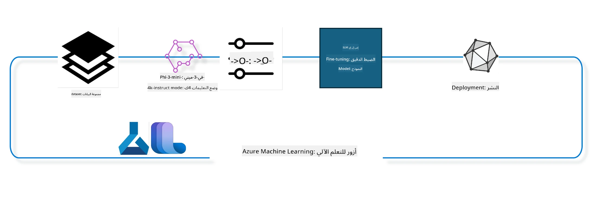

## كيفية استخدام مكونات إكمال المحادثة من سجل نظام Azure ML لضبط نموذج دقيق

في هذا المثال سنقوم بضبط نموذج Phi-3-mini-4k-instruct لإكمال محادثة بين شخصين باستخدام مجموعة بيانات ultrachat_200k.



سيُظهر المثال كيفية القيام بضبط دقيق باستخدام Azure ML SDK وPython ثم نشر النموذج المضبوط على نقطة نهاية عبر الإنترنت للاستدلال في الوقت الفعلي.

### بيانات التدريب

سنستخدم مجموعة البيانات ultrachat_200k. هذه نسخة مُرشحة بشدة من مجموعة بيانات UltraChat وتم استخدامها لتدريب Zephyr-7B-β، وهو نموذج محادثة متقدم بحجم 7 مليارات.

### النموذج

سنستخدم نموذج Phi-3-mini-4k-instruct لإظهار كيف يمكن للمستخدم ضبط نموذج لمهمة إكمال المحادثة. إذا فتحت هذا الدفتر من بطاقة نموذج معينة، تذكر استبدال اسم النموذج المحدد.

### المهام

- اختر نموذجًا للضبط الدقيق.
- اختر واستكشف بيانات التدريب.
- قم بتكوين مهمة الضبط الدقيق.
- قم بتشغيل مهمة الضبط الدقيق.
- استعرض مقاييس التدريب والتقييم.
- سجل النموذج المضبوط.
- انشر النموذج المضبوط للاستدلال في الوقت الفعلي.
- قم بتنظيف الموارد.

## 1. إعداد المتطلبات الأساسية

- تثبيت التبعيات
- الاتصال بـ AzureML Workspace. تعلم المزيد في إعداد مصادقة SDK. استبدل <WORKSPACE_NAME>، <RESOURCE_GROUP> و< SUBSCRIPTION_ID > أدناه.
- الاتصال بسجل نظام azureml
- تعيين اسم تجربة اختياري
- تحقق أو أنشئ الحوسبة.

> [!NOTE]
> متطلبات: يمكن لعقدة GPU واحدة أن تحتوي على عدة بطاقات GPU. على سبيل المثال، في عقدة واحدة من Standard_NC24rs_v3 هناك 4 بطاقات NVIDIA V100، بينما في Standard_NC12s_v3 هناك بطاقتان NVIDIA V100. راجع المستندات لهذه المعلومات. يتم تعيين عدد بطاقات GPU لكل عقدة في المتغير gpus_per_node أدناه. تعيين هذه القيمة بشكل صحيح سيضمن استخدام جميع وحدات معالجة الرسومات في العقدة. يمكن العثور على وحدات معالجة الرسومات المُوصى بها هنا وهنا.

### مكتبات بايثون

قم بتثبيت التبعيات بتشغيل الخلية أدناه. هذه ليست خطوة اختيارية إذا كنت تعمل في بيئة جديدة.

```bash
pip install azure-ai-ml
pip install azure-identity
pip install datasets==2.9.0
pip install mlflow
pip install azureml-mlflow
```

### التفاعل مع Azure ML

1. هذا السكربت بايثون يُستخدم للتفاعل مع خدمة Azure Machine Learning (Azure ML). إليك تفصيل لما يقوم به:

    - يستورد الوحدات اللازمة من حزم azure.ai.ml، azure.identity، وazure.ai.ml.entities. كما يستورد وحدة الوقت time.

    - يحاول المصادقة باستخدام DefaultAzureCredential()، الذي يوفر تجربة مصادقة مبسطة للبدء السريع في تطوير التطبيقات التي تعمل على سحابة Azure. إذا فشل ذلك، يستخدم InteractiveBrowserCredential()، الذي يوفر نافذة تسجيل دخول تفاعلية.

    - ثم يحاول إنشاء مثيل MLClient باستخدام طريقة from_config، التي تقرأ التكوين من ملف الإعداد الافتراضي (config.json). إذا فشل ذلك، ينشئ MXClient يدويًا عن طريق توفير subscription_id وresource_group_name وworkspace_name.

    - ينشئ مثيل MLClient آخر لهذه المرة من سجل Azure ML المسمى "azureml". هذا السجل هو المكان الذي يتم فيه تخزين النماذج وأنابيب الضبط الدقيق والبيئات.

    - يعين experiment_name إلى "chat_completion_Phi-3-mini-4k-instruct".

    - يُولد طابع زمن فريد بتحويل الوقت الحالي (بالثواني منذ العصر، كرقم عشري) إلى عدد صحيح ثم إلى نص. يمكن استخدام هذا الطابع لإنشاء أسماء وإصدارات فريدة.

    ```python
    # استيراد الوحدات الضرورية من Azure ML و Azure Identity
    from azure.ai.ml import MLClient
    from azure.identity import (
        DefaultAzureCredential,
        InteractiveBrowserCredential,
    )
    from azure.ai.ml.entities import AmlCompute
    import time  # استيراد وحدة الوقت
    
    # محاولة المصادقة باستخدام DefaultAzureCredential
    try:
        credential = DefaultAzureCredential()
        credential.get_token("https://management.azure.com/.default")
    except Exception as ex:  # إذا فشل DefaultAzureCredential، استخدم InteractiveBrowserCredential
        credential = InteractiveBrowserCredential()
    
    # محاولة إنشاء كائن MLClient باستخدام ملف التكوين الافتراضي
    try:
        workspace_ml_client = MLClient.from_config(credential=credential)
    except:  # إذا فشل ذلك، إنشاء كائن MLClient عن طريق تقديم التفاصيل يدويًا
        workspace_ml_client = MLClient(
            credential,
            subscription_id="<SUBSCRIPTION_ID>",
            resource_group_name="<RESOURCE_GROUP>",
            workspace_name="<WORKSPACE_NAME>",
        )
    
    # إنشاء كائن MLClient آخر لسجل Azure ML المسمى "azureml"
    # هذا السجل هو حيث يتم تخزين النماذج، وخطوط أنابيب التخصيص، والبيئات
    registry_ml_client = MLClient(credential, registry_name="azureml")
    
    # تعيين اسم التجربة
    experiment_name = "chat_completion_Phi-3-mini-4k-instruct"
    
    # إنشاء طابع زمني فريد يمكن استخدامه للأسماء والإصدارات التي تحتاج لأن تكون فريدة
    timestamp = str(int(time.time()))
    ```

## 2. اختر نموذج أساس للضبط الدقيق

1. Phi-3-mini-4k-instruct هو نموذج خفيف الوزن بحدود 3.8 مليار معلمة، حديث ومفتوح قائم على مجموعات البيانات المستخدمة في Phi-2. النموذج ينتمي إلى عائلة نماذج Phi-3، والنسخة المصغرة Mini تأتي بنسختين 4K و128K وهو طول السياق (بوحدات التوكن) الذي يمكنه دعمه، نحتاج لضبط النموذج لغرضنا الخاص لاستخدامه. يمكنك تصفح هذه النماذج في كتالوج النماذج في AzureML Studio مع التصفية حسب مهمة إكمال المحادثة. في هذا المثال، نستخدم نموذج Phi-3-mini-4k-instruct. إذا فتحت هذا الدفتر لنموذج مختلف، استبدل اسم النموذج والإصدار تبعًا لذلك.

> [!NOTE]
> خاصية معرف النموذج model id في النموذج. سيتم تمريرها كمدخل إلى مهمة الضبط الدقيق. تتوفر هذه أيضًا كحقل Asset ID في صفحة تفاصيل النموذج في كتالوج نماذج AzureML Studio.

2. هذا السكربت بايثون يتفاعل مع خدمة Azure Machine Learning. إليك تفصيل ما يقوم به:

    - يعين model_name إلى "Phi-3-mini-4k-instruct".

    - يستخدم طريقة get الخاصة بخاصية models لكائن registry_ml_client لاسترجاع أحدث إصدار من النموذج بالاسم المحدد من سجل Azure ML. تُستدعى طريقة get بوسيطين: اسم النموذج ووسم لتحديد أنه يجب استرجاع أحدث إصدار.

    - يطبع رسالة في وحدة التحكم تشير إلى اسم وإصدار ومعرف النموذج الذي سيتم استخدامه للضبط الدقيق. يستخدم شكل format لسلسلة النص لإدخال اسم وإصدار ومعرف النموذج في الرسالة. يتم الوصول إلى هذه الخصائص من كائن foundation_model.

    ```python
    # تعيين اسم النموذج
    model_name = "Phi-3-mini-4k-instruct"
    
    # الحصول على أحدث نسخة من النموذج من سجل Azure ML
    foundation_model = registry_ml_client.models.get(model_name, label="latest")
    
    # طباعة اسم النموذج والإصدار والمعرف
    # هذه المعلومات مفيدة للتتبع وتصحيح الأخطاء
    print(
        "\n\nUsing model name: {0}, version: {1}, id: {2} for fine tuning".format(
            foundation_model.name, foundation_model.version, foundation_model.id
        )
    )
    ```

## 3. أنشئ حوسبة للاستخدام مع المهمة

تعمل مهمة الضبط الدقيق فقط مع الحوسبة التي تحتوي على GPU. حجم الحوسبة يعتمد على حجم النموذج وفي معظم الحالات يصبح من الصعب تحديد الحوسبة المناسبة للمهمة. في هذه الخلية، نوجه المستخدم لاختيار الحوسبة المناسبة للمهمة.

> [!NOTE]
> الحواسب المذكورة أدناه تعمل بأفضل تكوين مُحسّن. أي تغييرات على التكوين قد تؤدي إلى خطأ نفاد ذاكرة Cuda. في مثل هذه الحالات، حاول ترقية الحوسبة إلى حجم أكبر.

> [!NOTE]
> عند اختيار compute_cluster_size أدناه، تأكد من توفر الحوسبة في مجموعة الموارد الخاصة بك. إذا لم تكن حوسبة معينة متوفرة يمكنك طلب الوصول إلى موارد الحوسبة.

### التحقق من دعم النموذج للضبط الدقيق

1. هذا السكربت بايثون يتفاعل مع نموذج في Azure Machine Learning. إليك تفصيل ما يقوم به:

    - يستورد وحدة ast، التي توفر دوال لمعالجة أشجار بناء جملة بايثون المجردة.

    - يتحقق مما إذا كان كائن foundation_model (يمثل نموذج في Azure ML) يحتوي على علامة باسم finetune_compute_allow_list. العلامات في Azure ML هي أزواج مفتاح-قيمة يمكنك إنشاؤها لاستخدامها في التصفية والفرز.

    - إذا كانت علامة finetune_compute_allow_list موجودة، يستخدم ast.literal_eval لتحليل قيمة العلامة (نص) بأمان إلى قائمة بايثون. تُعيّن هذه القائمة إلى المتغير computes_allow_list. ثم يطبع رسالة توضح أنه يجب إنشاء الحوسبة من القائمة.

    - إذا لم تكن العلامة موجودة، يعين computes_allow_list إلى None ويطبع رسالة تفيد بأن العلامة finetune_compute_allow_list ليست ضمن علامات النموذج.

    - بالملخص، هذا السكربت يتحقق من وجود علامة محددة في بيانات النموذج الوصفية، ويحوّل قيمة العلامة إلى قائمة إذا وجدت، ويقدم ملاحظات للمستخدم بناءً على ذلك.

    ```python
    # استيراد وحدة ast، التي توفر دوال لمعالجة أشجار القواعد النحوية المجردة للغة بايثون
    import ast
    
    # التحقق مما إذا كانت الوسمة 'finetune_compute_allow_list' موجودة في وسوم النموذج
    if "finetune_compute_allow_list" in foundation_model.tags:
        # إذا كانت الوسمة موجودة، استخدم ast.literal_eval لتحليل قيمة الوسمة (سلسلة نصية) بأمان إلى قائمة بايثون
        computes_allow_list = ast.literal_eval(
            foundation_model.tags["finetune_compute_allow_list"]
        )  # تحويل السلسلة النصية إلى قائمة بايثون
        # طباعة رسالة تشير إلى أنه يجب إنشاء حساب من القائمة
        print(f"Please create a compute from the above list - {computes_allow_list}")
    else:
        # إذا لم تكن الوسمة موجودة، تعيين computes_allow_list إلى None
        computes_allow_list = None
        # طباعة رسالة تشير إلى أن الوسمة 'finetune_compute_allow_list' ليست جزءًا من وسوم النموذج
        print("`finetune_compute_allow_list` is not part of model tags")
    ```

### التحقق من مثيل الحوسبة

1. هذا السكربت بايثون يتفاعل مع خدمة Azure Machine Learning ويجري عدة فحوصات على مثيل الحوسبة. إليك تفصيل ما يقوم به:

    - يحاول استرجاع مثيل الحوسبة الذي يحمل الاسم المخزن في compute_cluster من مساحة عمل Azure ML. إذا كانت حالة التهيئة provisioning state هي "failed"، يرفع استثناء ValueError.

    - يتحقق مما إذا كانت القائمة computes_allow_list ليست None. إذا لم تكن كذلك، يحول جميع أحجام الحوسبة في القائمة إلى أحرف صغيرة ويتحقق ما إذا كان حجم مثيل الحوسبة الحالي ضمن القائمة. إذا لم يكن كذلك، يرفع استثناء ValueError.

    - إذا كانت computes_allow_list هي None، يتحقق ما إذا كان حجم مثيل الحوسبة ضمن قائمة بأحجام VM غير المدعومة لـ GPU. إذا كان كذلك، يرفع استثناء ValueError.

    - يسترجع قائمة بكل أحجام الحوسبة المتاحة في مساحة العمل. ثم يتكرر عبر القائمة، ولكل حجم حوسبة، يتحقق ما إذا كان اسمه يطابق حجم مثيل الحوسبة الحالي. إذا كان كذلك، يسترجع عدد وحدات GPU لذلك الحجم ويعيّن gpu_count_found إلى True.

    - إذا كان gpu_count_found True، يطبع عدد وحدات GPU في مثيل الحوسبة. إذا كان False، يرفع استثناء ValueError.

    - باختصار، يجري هذا السكربت فحوصات عدة على مثيل الحوسبة في مساحة عمل Azure ML، بما في ذلك حالة التهيئة، حجمه مقابل قائمة مسموح بها أو ممنوعة، وعدد وحدات GPU التي يحتويها.
    
    ```python
    # طباعة رسالة الاستثناء
    print(e)
    # رفع استثناء ValueError إذا كان حجم الحوسبة غير متاح في مساحة العمل
    raise ValueError(
        f"WARNING! Compute size {compute_cluster_size} not available in workspace"
    )
    
    # استرداد مثيل الحوسبة من مساحة عمل Azure ML
    compute = workspace_ml_client.compute.get(compute_cluster)
    # التحقق مما إذا كانت حالة توفير مثيل الحوسبة "فشل"
    if compute.provisioning_state.lower() == "failed":
        # رفع استثناء ValueError إذا كانت حالة التوفير "فشل"
        raise ValueError(
            f"Provisioning failed, Compute '{compute_cluster}' is in failed state. "
            f"please try creating a different compute"
        )
    
    # التحقق مما إذا كانت قائمة السماح بالحوسبة غير None
    if computes_allow_list is not None:
        # تحويل جميع أحجام الحوسبة في قائمة السماح إلى أحرف صغيرة
        computes_allow_list_lower_case = [x.lower() for x in computes_allow_list]
        # التحقق مما إذا كان حجم مثيل الحوسبة في القائمة المحولة إلى أحرف صغيرة
        if compute.size.lower() not in computes_allow_list_lower_case:
            # رفع استثناء ValueError إذا لم يكن حجم مثيل الحوسبة في القائمة المحولة إلى أحرف صغيرة
            raise ValueError(
                f"VM size {compute.size} is not in the allow-listed computes for finetuning"
            )
    else:
        # تعريف قائمة بأحجام الأجهزة الافتراضية للـ GPU غير المدعومة
        unsupported_gpu_vm_list = [
            "standard_nc6",
            "standard_nc12",
            "standard_nc24",
            "standard_nc24r",
        ]
        # التحقق مما إذا كان حجم مثيل الحوسبة في قائمة الأجهزة الافتراضية للـ GPU غير المدعومة
        if compute.size.lower() in unsupported_gpu_vm_list:
            # رفع استثناء ValueError إذا كان حجم مثيل الحوسبة في قائمة الأجهزة الافتراضية للـ GPU غير المدعومة
            raise ValueError(
                f"VM size {compute.size} is currently not supported for finetuning"
            )
    
    # تهيئة علامة للتحقق مما إذا تم العثور على عدد وحدات معالجة الرسومات في مثيل الحوسبة
    gpu_count_found = False
    # استرداد قائمة بجميع أحجام الحوسبة المتاحة في مساحة العمل
    workspace_compute_sku_list = workspace_ml_client.compute.list_sizes()
    available_sku_sizes = []
    # التكرار عبر قائمة أحجام الحوسبة المتاحة
    for compute_sku in workspace_compute_sku_list:
        available_sku_sizes.append(compute_sku.name)
        # التحقق مما إذا كان اسم حجم الحوسبة يطابق حجم مثيل الحوسبة
        if compute_sku.name.lower() == compute.size.lower():
            # إذا كان كذلك، استرداد عدد وحدات معالجة الرسومات لذلك الحجم وتعيين gpu_count_found إلى True
            gpus_per_node = compute_sku.gpus
            gpu_count_found = True
    # إذا كانت gpu_count_found صحيحة، طباعة عدد وحدات معالجة الرسومات في مثيل الحوسبة
    if gpu_count_found:
        print(f"Number of GPU's in compute {compute.size}: {gpus_per_node}")
    else:
        # إذا كانت gpu_count_found خاطئة، رفع استثناء ValueError
        raise ValueError(
            f"Number of GPU's in compute {compute.size} not found. Available skus are: {available_sku_sizes}."
            f"This should not happen. Please check the selected compute cluster: {compute_cluster} and try again."
        )
    ```

## 4. اختر مجموعة البيانات لضبط النموذج دقيقًا

1. نستخدم مجموعة البيانات ultrachat_200k. تحتوي مجموعة البيانات على أربعة تقسيمات، مناسبة للضبط الدقيق المُشرف (sft).
ترتيب التوليد (gen). يُظهر عدد الأمثلة لكل تقسيم كما يلي:

    ```bash
    train_sft test_sft  train_gen  test_gen
    207865  23110  256032  28304
    ```

1. الخلايا التالية تُظهر التحضير الأساسي للبيانات للضبط الدقيق:

### عرض بعض صفوف البيانات

نريد أن تعمل هذه العينة بسرعة، لذا احفظ train_sft و test_sft التي تحتوي على 5% من الصفوف المقتطعة مسبقًا. هذا يعني أن النموذج المضبوط سيكون دقته أقل، لذلك لا ينبغي استخدامه في العالم الحقيقي.
يُستخدم السكربت download-dataset.py لتحميل مجموعة بيانات ultrachat_200k وتحويلها إلى تنسيق مستهلك لمكوّن أنبوب الضبط الدقيق. وبما أن مجموعة البيانات كبيرة، فنحن هنا نمتلك فقط جزءًا منها.

1. تشغيل السكربت أدناه يُحمّل فقط 5% من البيانات. يمكن زيادة هذا من خلال تغيير معلمة dataset_split_pc إلى النسبة المئوية المطلوبة.

> [!NOTE]
> بعض نماذج اللغة لها رموز لغات مختلفة وبالتالي يجب أن تعكس أسماء الأعمدة في مجموعة البيانات نفس الشيء.

1. هنا مثال على كيفية ظهور البيانات
مجموعة بيانات إكمال المحادثة مخزنة بصيغة parquet مع كل إدخال يستخدم المخطط التالي:

    - هذه وثيقة JSON (تنسيق تبادل بيانات شائع). هي ليست كود تنفيذي، بل طريقة لتخزين ونقل البيانات. تاليًا تفصيل لهيكلها:

    - "prompt": هذا المفتاح يحمل قيمة نصية تمثل مهمة أو سؤال موجه إلى مساعد ذكي.

    - "messages": هذا المفتاح يحمل مصفوفة من الكائنات. كل كائن يمثل رسالة في محادثة بين مستخدم ومساعد ذكي. كل كائن رسالة يحتوي على مفتاحين:

    - "content": هذا المفتاح يحمل نص الرسالة.
    - "role": هذا المفتاح يحمل نص يمثل دور الذي أرسل الرسالة. يمكن أن يكون "user" أو "assistant".
    - "prompt_id": هذا المفتاح يحمل معرفًا فريدًا للنص الأساسي.

1. في هذه الوثيقة JSON المحددة، تُعرض محادثة يطلب فيها المستخدم من المساعد الذكي إنشاء بطل لقصة ديستوبية. يرد المساعد، ثم يطلب المستخدم المزيد من التفاصيل. يوافق المساعد على تزويد المزيد من التفاصيل. كل المحادثة مرتبطة بمعرف نص محدد.

    ```python
    {
        // The task or question posed to an AI assistant
        "prompt": "Create a fully-developed protagonist who is challenged to survive within a dystopian society under the rule of a tyrant. ...",
        
        // An array of objects, each representing a message in a conversation between a user and an AI assistant
        "messages":[
            {
                // The content of the user's message
                "content": "Create a fully-developed protagonist who is challenged to survive within a dystopian society under the rule of a tyrant. ...",
                // The role of the entity that sent the message
                "role": "user"
            },
            {
                // The content of the assistant's message
                "content": "Name: Ava\n\n Ava was just 16 years old when the world as she knew it came crashing down. The government had collapsed, leaving behind a chaotic and lawless society. ...",
                // The role of the entity that sent the message
                "role": "assistant"
            },
            {
                // The content of the user's message
                "content": "Wow, Ava's story is so intense and inspiring! Can you provide me with more details.  ...",
                // The role of the entity that sent the message
                "role": "user"
            }, 
            {
                // The content of the assistant's message
                "content": "Certainly! ....",
                // The role of the entity that sent the message
                "role": "assistant"
            }
        ],
        
        // A unique identifier for the prompt
        "prompt_id": "d938b65dfe31f05f80eb8572964c6673eddbd68eff3db6bd234d7f1e3b86c2af"
    }
    ```

### تنزيل البيانات

1. هذا السكربت بايثون يُستخدم لتنزيل مجموعة بيانات باستخدام سكربت مساعد اسمه download-dataset.py. إليك تفصيل ما يقوم به:

    - يستورد وحدة os، التي توفر طريقة محمولة لاستخدام وظائف نظام التشغيل.

    - يستخدم دالة os.system لتشغيل السكربت download-dataset.py في الصدفة مع وسائط سطر الأوامر المحددة. الوسائط تحدد مجموعة البيانات التي سيتم تنزيلها (HuggingFaceH4/ultrachat_200k)، الدليل الذي سيتم التنزيل إليه (ultrachat_200k_dataset)، والنسبة المئوية لتقسيم مجموعة البيانات (5). تعيد الدالة os.system حالة الخروج من الأمر الذي نفذته، ويتم تخزين هذه الحالة في المتغير exit_status.

    - يتحقق مما إذا كانت exit_status ليست 0. في أنظمة التشغيل الشبيهة بـ Unix، تشير الحالة 0 إلى نجاح الأمر، وأي رقم آخر يشير إلى خطأ. إذا كانت exit_status ليست 0، يرفع استثناء مع رسالة تشير إلى وجود خطأ في تنزيل مجموعة البيانات.

    - باختصار، يشغّل هذا السكربت أمرًا لتنزيل مجموعة بيانات باستخدام سكربت مساعد، ويرفع استثناء إذا فشل الأمر.
    
    ```python
    # استيراد وحدة os، التي توفر طريقة لاستخدام وظائف تعتمد على نظام التشغيل
    import os
    
    # استخدام دالة os.system لتشغيل سكريبت download-dataset.py في الصدفة مع وسائط سطر الأوامر المحددة
    # الوسائط تحدد مجموعة البيانات التي سيتم تنزيلها (HuggingFaceH4/ultrachat_200k)، والدليل الذي ستتم فيه عملية التنزيل (ultrachat_200k_dataset)، ونسبة تقسيم مجموعة البيانات (5)
    # تعيد دالة os.system حالة الخروج للأمر الذي نفذته؛ يتم تخزين هذه الحالة في المتغير exit_status
    exit_status = os.system(
        "python ./download-dataset.py --dataset HuggingFaceH4/ultrachat_200k --download_dir ultrachat_200k_dataset --dataset_split_pc 5"
    )
    
    # تحقق إذا كانت قيمة exit_status ليست 0
    # في أنظمة التشغيل الشبيهة بيونكس، تشير حالة الخروج 0 عادة إلى نجاح الأمر، بينما أي رقم آخر يشير إلى حدوث خطأ
    # إذا كانت exit_status ليست 0، اطرح استثناء مع رسالة تشير إلى وجود خطأ في تنزيل مجموعة البيانات
    if exit_status != 0:
        raise Exception("Error downloading dataset")
    ```

### تحميل البيانات في DataFrame
1. تقوم هذه السكريبت بلغة بايثون بتحميل ملف JSON Lines إلى إطار بيانات (DataFrame) من مكتبة pandas وعرض أول 5 صفوف. إليك تحليل لما يقوم به:

    - يستورد مكتبة pandas، وهي مكتبة قوية لمعالجة وتحليل البيانات.

    - يضبط الحد الأقصى لعرض الأعمدة في خيارات عرض pandas إلى 0. وهذا يعني أن النص الكامل لكل عمود سيتم عرضه دون اقتطاع عند طباعة إطار البيانات.

    - يستخدم دالة pd.read_json لتحميل ملف train_sft.jsonl من مجلد ultrachat_200k_dataset إلى إطار بيانات. الوسيطة lines=True تشير إلى أن الملف في صيغة JSON Lines، حيث كل سطر هو كائن JSON منفصل.

    - يستخدم دالة head لعرض أول 5 صفوف من إطار البيانات. إذا كان إطار البيانات يحتوي على أقل من 5 صفوف، فسيعرض كل ما هو موجود.

    - باختصار، يقوم هذا السكريبت بتحميل ملف JSON Lines إلى إطار بيانات وعرض أول 5 صفوف مع النص الكامل للأعمدة.
    
    ```python
    # استيراد مكتبة بانداز، وهي مكتبة قوية لمعالجة وتحليل البيانات
    import pandas as pd
    
    # تعيين الحد الأقصى لعرض الأعمدة في خيارات عرض بانداز إلى 0
    # هذا يعني أنه سيتم عرض النص الكامل لكل عمود دون اقتطاع عند طباعة DataFrame
    pd.set_option("display.max_colwidth", 0)
    
    # استخدام دالة pd.read_json لتحميل ملف train_sft.jsonl من مجلد ultrachat_200k_dataset إلى DataFrame
    # الوسيط lines=True يشير إلى أن الملف بتنسيق JSON Lines، حيث يكون كل سطر كائن JSON منفصل
    df = pd.read_json("./ultrachat_200k_dataset/train_sft.jsonl", lines=True)
    
    # استخدام طريقة head لعرض أول 5 صفوف من DataFrame
    # إذا كان DataFrame يحتوي على أقل من 5 صفوف، فسيتم عرضها كلها
    df.head()
    ```

## 5. تقديم مهمة ضبط النموذج الدقيق باستخدام النموذج والبيانات كمدخلات

إنشاء المهمة التي تستخدم مكون خط أنابيب إكمال الدردشة. تعرّف على كافة المعاملات المدعومة لضبط النموذج الدقيق.

### تعريف معاملات الضبط الدقيق

1. يمكن تصنيف معاملات الضبط الدقيق إلى فئتين - معاملات التدريب، معاملات التحسين.

1. تحدد معاملات التدريب جوانب التدريب مثل -

    - المحسن، وجدول التوقيت المستخدم
    - المقياس الذي يتم تحسينه في الضبط الدقيق
    - عدد خطوات التدريب وحجم الدُفعة وما إلى ذلك
    - تساعد معاملات التحسين في تحسين استخدام ذاكرة GPU واستخدام موارد الحوسبة بشكل فعال.

1. فيما يلي بعض المعاملات التي تنتمي لهذه الفئة. تختلف معاملات التحسين لكل نموذج ويتم تعبئتها مع النموذج لمعالجة هذه الاختلافات.

    - تفعيل deepspeed و LoRA
    - تفعيل التدريب بدقة مختلطة
    - تفعيل التدريب متعدد العقد

> [!NOTE]
> قد يؤدي الضبط الدقيق الخاضع للإشراف إلى فقدان المحاذاة أو النسيان الكارثي. نوصي بفحص هذه المشكلة وتشغيل مرحلة المحاذاة بعد الانتهاء من الضبط الدقيق.

### معاملات الضبط الدقيق

1. تقوم هذه السكريبت بلغة بايثون بإعداد معاملات لضبط نموذج تعلم آلي بدقة. إليك شرح لما تقوم به:

    - تضبط معاملات التدريب الافتراضية مثل عدد حقب التدريب، أحجام الدُفعات للتدريب والتقييم، معدل التعلم، ونوع جدول معدل التعلم.

    - تضبط معاملات التحسين الافتراضية مثل ما إذا كان سيتم تطبيق Layer-wise Relevance Propagation (LoRa) و DeepSpeed، ومرحلة DeepSpeed.

    - تدمج معاملات التدريب والتحسين في قاموس واحد يسمى finetune_parameters.

    - تتحقق مما إذا كان foundation_model يحتوي على أي معاملات افتراضية خاصة بالنموذج. إذا كان كذلك، تطبع رسالة تحذير وتحدث قاموس finetune_parameters بهذه الافتراضات الخاصة بالنموذج. تُستخدم دالة ast.literal_eval لتحويل الافتراضات الخاصة بالنموذج من سلسلة إلى قاموس بايثون.

    - تطبع مجموعة المعاملات النهائية لضبط النموذج التي ستُستخدم أثناء التشغيل.

    - باختصار، تقوم هذه السكريبت بإعداد وعرض معاملات الضبط الدقيق لنموذج تعلم آلي، مع القدرة على تجاوز المعاملات الافتراضية بواحدة خاصة بالنموذج.

    ```python
    # إعداد معلمات التدريب الافتراضية مثل عدد عصور التدريب، حجم الدُفعات للتدريب والتقييم، معدل التعلم، ونوع مُجدول معدل التعلم
    training_parameters = dict(
        num_train_epochs=3,
        per_device_train_batch_size=1,
        per_device_eval_batch_size=1,
        learning_rate=5e-6,
        lr_scheduler_type="cosine",
    )
    
    # إعداد معلمات التحسين الافتراضية مثل ما إذا كان سيتم تطبيق انتشار الأهمية الطبقي (LoRa) و DeepSpeed، ومرحلة DeepSpeed
    optimization_parameters = dict(
        apply_lora="true",
        apply_deepspeed="true",
        deepspeed_stage=2,
    )
    
    # دمج معلمات التدريب والتحسين في قاموس واحد يُسمى finetune_parameters
    finetune_parameters = {**training_parameters, **optimization_parameters}
    
    # التحقق مما إذا كان النموذج الأساسي foundation_model يحتوي على أي معلمات افتراضية خاصة بالنموذج
    # إذا كان يحتوي، طباعة رسالة تحذير وتحديث قاموس finetune_parameters بهذه القيم الافتراضية الخاصة بالنموذج
    # تُستخدم الدالة ast.literal_eval لتحويل القيم الافتراضية الخاصة بالنموذج من نص إلى قاموس بايثون
    if "model_specific_defaults" in foundation_model.tags:
        print("Warning! Model specific defaults exist. The defaults could be overridden.")
        finetune_parameters.update(
            ast.literal_eval(  # تحويل النص إلى قاموس بايثون
                foundation_model.tags["model_specific_defaults"]
            )
        )
    
    # طباعة مجموعة معلمات الضبط النهائي التي ستُستخدم في التنفيذ
    print(
        f"The following finetune parameters are going to be set for the run: {finetune_parameters}"
    )
    ```

### خط أنابيب التدريب

1. تقوم هذه السكريبت بلغة بايثون بتعريف دالة لإنشاء اسم عرض لخط أنابيب تدريب تعلم آلي، ثم تستدعي هذه الدالة لتوليد وطباعة اسم العرض. إليك تحليل لما تقوم به:

1. تم تعريف دالة get_pipeline_display_name. هذه الدالة تولد اسم عرض بناءً على عدة معاملات تتعلق بخط أنابيب التدريب.

1. داخل الدالة، تحسب الحجم الكلي للدُفعة بضرب حجم الدُفعة لكل جهاز، وعدد خطوات تراكم التدرجات، وعدد وحدات GPU لكل عقدة، وعدد العقد المستخدمة للضبط الدقيق.

1. تستخرج معاملات أخرى متنوعة مثل نوع جدول معدل التعلم، ما إذا تم تطبيق DeepSpeed، مرحلة DeepSpeed، ما إذا تم تطبيق Layer-wise Relevance Propagation (LoRa)، الحد على عدد نقاط التحقق الخاصة بالنموذج للاحتفاظ بها، والطول الأقصى للتسلسل.

1. تبني سلسلة نصية تتضمن كل هذه المعاملات مفصولة بشرطة (-). إذا تم تطبيق DeepSpeed أو LoRa، تشمل السلسلة "ds" متبوعة بمرحلة DeepSpeed، أو "lora"، على التوالي. وإذا لم يتم، تشمل "nods" أو "nolora"، على التوالي.

1. تعيد الدالة هذه السلسلة، والتي تستخدم كاسم عرض لخط أنابيب التدريب.

1. بعد تعريف الدالة، يتم استدعاؤها لتوليد اسم العرض، ثم طبع هذا الاسم.

1. باختصار، تولد هذه السكريبت اسم عرض لخط أنابيب تدريب تعلم آلي بناءً على عدة معاملات، ثم تطبع هذا الاسم.

    ```python
    # تعريف دالة لتوليد اسم عرض لسير تدريب النموذج
    def get_pipeline_display_name():
        # حساب حجم الدُفعة الكلي بضرب حجم الدُفعة لكل جهاز، وعدد خطوات تراكم التدرج، وعدد وحدات معالجة الرسوميات لكل عقدة، وعدد العقد المستخدمة لضبط النموذج الدقيق
        batch_size = (
            int(finetune_parameters.get("per_device_train_batch_size", 1))
            * int(finetune_parameters.get("gradient_accumulation_steps", 1))
            * int(gpus_per_node)
            * int(finetune_parameters.get("num_nodes_finetune", 1))
        )
        # استرجاع نوع مبرمج معدل التعلم
        scheduler = finetune_parameters.get("lr_scheduler_type", "linear")
        # استرجاع ما إذا كان DeepSpeed مُطبقًا
        deepspeed = finetune_parameters.get("apply_deepspeed", "false")
        # استرجاع المرحلة في DeepSpeed
        ds_stage = finetune_parameters.get("deepspeed_stage", "2")
        # إذا تم تطبيق DeepSpeed، تضمين "ds" متبوعة بمرحلة DeepSpeed في اسم العرض؛ وإذا لم يكن، تضمين "nods"
        if deepspeed == "true":
            ds_string = f"ds{ds_stage}"
        else:
            ds_string = "nods"
        # استرجاع ما إذا كان تم تطبيق الترويج الطبقي للأهمية (LoRa)
        lora = finetune_parameters.get("apply_lora", "false")
        # إذا تم تطبيق LoRa، تضمين "lora" في اسم العرض؛ وإذا لم يكن، تضمين "nolora"
        if lora == "true":
            lora_string = "lora"
        else:
            lora_string = "nolora"
        # استرجاع الحد الأقصى لعدد نقاط تفتيش النموذج التي يجب الاحتفاظ بها
        save_limit = finetune_parameters.get("save_total_limit", -1)
        # استرجاع الحد الأقصى لطول التسلسل
        seq_len = finetune_parameters.get("max_seq_length", -1)
        # بناء اسم العرض بدمج كل هذه المعلمات، مفصولة بشرطات
        return (
            model_name
            + "-"
            + "ultrachat"
            + "-"
            + f"bs{batch_size}"
            + "-"
            + f"{scheduler}"
            + "-"
            + ds_string
            + "-"
            + lora_string
            + f"-save_limit{save_limit}"
            + f"-seqlen{seq_len}"
        )
    
    # استدعاء الدالة لتوليد اسم العرض
    pipeline_display_name = get_pipeline_display_name()
    # طباعة اسم العرض
    print(f"Display name used for the run: {pipeline_display_name}")
    ```

### تكوين خط الأنابيب

تقوم هذه السكريبت بلغة بايثون بتعريف وتكوين خط أنابيب تعلم آلي باستخدام SDK الخاص بـ Azure Machine Learning. إليك ما تقوم به:

1. تستورد الوحدات الضرورية من Azure AI ML SDK.

1. تستعيد مكون خط أنابيب باسم "chat_completion_pipeline" من السجل.

1. تعرف مهمة خط أنابيب باستخدام المزخرف `@pipeline` والدالة `create_pipeline`. يُعين اسم خط الأنابيب إلى `pipeline_display_name`.

1. داخل دالة `create_pipeline`، تهيئ مكون خط الأنابيب الذي تم استيراده مع عدة معاملات، منها مسار النموذج، عناقيد الحوسبة للمراحل المختلفة، تقسيمات مجموعة البيانات للتدريب والاختبار، عدد وحدات GPU المستخدمة للضبط الدقيق، ومعاملات الضبط الدقيق الأخرى.

1. تربط مخرجات مهمة الضبط الدقيق بمخرجات مهمة خط الأنابيب. يتم ذلك حتى يمكن تسجيل النموذج المضبوط بسهولة، وهو مطلوب لنشر النموذج إلى نقطة نهاية عبر الإنترنت أو دفعة.

1. تنشئ مثيلاً من خط الأنابيب باستدعاء دالة `create_pipeline`.

1. تضبط إعداد `force_rerun` لخط الأنابيب إلى `True`، مما يعني عدم استخدام النتائج المخبأة من المهام السابقة.

1. تضبط إعداد `continue_on_step_failure` لخط الأنابيب إلى `False`، مما يعني توقف خط الأنابيب إذا فشلت أي خطوة.

1. باختصار، تعرف هذه السكريبت خط أنابيب تعلم آلي لمهمة إكمال المحادثة باستخدام Azure Machine Learning SDK وتقوم بتكوينه.

    ```python
    # استيراد الوحدات الضرورية من Azure AI ML SDK
    from azure.ai.ml.dsl import pipeline
    from azure.ai.ml import Input
    
    # جلب مكون خط الأنابيب المسمى "chat_completion_pipeline" من السجل
    pipeline_component_func = registry_ml_client.components.get(
        name="chat_completion_pipeline", label="latest"
    )
    
    # تعريف وظيفة خط الأنابيب باستخدام مزخرف @pipeline والدالة create_pipeline
    # تم تعيين اسم خط الأنابيب إلى pipeline_display_name
    @pipeline(name=pipeline_display_name)
    def create_pipeline():
        # تهيئة مكون خط الأنابيب المسترجع مع معلمات مختلفة
        # تشمل هذه مسار النموذج، عناقيد الحوسبة لمراحل مختلفة، تقسيمات مجموعة البيانات للتدريب والاختبار، عدد وحدات معالجة الرسومات المستخدمة في الضبط الدقيق، ومعلمات الضبط الدقيق الأخرى
        chat_completion_pipeline = pipeline_component_func(
            mlflow_model_path=foundation_model.id,
            compute_model_import=compute_cluster,
            compute_preprocess=compute_cluster,
            compute_finetune=compute_cluster,
            compute_model_evaluation=compute_cluster,
            # تعيين تقسيمات مجموعة البيانات إلى المعلمات
            train_file_path=Input(
                type="uri_file", path="./ultrachat_200k_dataset/train_sft.jsonl"
            ),
            test_file_path=Input(
                type="uri_file", path="./ultrachat_200k_dataset/test_sft.jsonl"
            ),
            # إعدادات التدريب
            number_of_gpu_to_use_finetuning=gpus_per_node,  # يتم ضبطها على عدد وحدات معالجة الرسومات المتوفرة في الحوسبة
            **finetune_parameters
        )
        return {
            # تعيين مخرجات مهمة الضبط الدقيق إلى مخرجات مهمة خط الأنابيب
            # يتم ذلك حتى نتمكن من تسجيل النموذج المضبوط بدقة بسهولة
            # تسجيل النموذج مطلوب لنشر النموذج على نقطة نهاية عبر الإنترنت أو دفعة
            "trained_model": chat_completion_pipeline.outputs.mlflow_model_folder
        }
    
    # إنشاء نسخة من خط الأنابيب عن طريق استدعاء دالة create_pipeline
    pipeline_object = create_pipeline()
    
    # عدم استخدام النتائج المخزنة مؤقتًا من الوظائف السابقة
    pipeline_object.settings.force_rerun = True
    
    # تعيين الاستمرار عند فشل الخطوة إلى False
    # هذا يعني أن خط الأنابيب سيتوقف إذا فشلت أي خطوة
    pipeline_object.settings.continue_on_step_failure = False
    ```

### تقديم المهمة

1. تقوم هذه السكريبت بلغة بايثون بتقديم مهمة خط أنابيب تعلم آلي إلى مساحة عمل Azure Machine Learning ثم تنتظر انتهاء المهمة. إليك ما تقوم به:

    - تستدعي دالة create_or_update لكائن الوظائف jobs في العميل workspace_ml_client لتقديم مهمة خط الأنابيب. الخط الأنابيب الذي سيتم تشغيله محدد بواسطة pipeline_object، والتجربة التي يتم تشغيل المهمة ضمنها محددة بواسطة experiment_name.

    - ثم تستدعي دالة stream لكائن الوظائف jobs في العميل workspace_ml_client للانتظار حتى تكتمل مهمة خط الأنابيب. المهمة التي ينتظر لها محددة بواسطة خاصية name لكائن pipeline_job.

    - باختصار، تقوم هذه السكريبت بتقديم مهمة خط أنابيب تعلم آلي إلى مساحة عمل Azure Machine Learning، ثم تنتظر حتى تكتمل المهمة.

    ```python
    # تقديم مهمة خط الأنابيب إلى مساحة عمل Azure للتعلم الآلي
    # يتم تحديد خط الأنابيب الذي سيتم تشغيله بواسطة pipeline_object
    # يتم تحديد التجربة التي يتم تشغيل المهمة ضمنها بواسطة experiment_name
    pipeline_job = workspace_ml_client.jobs.create_or_update(
        pipeline_object, experiment_name=experiment_name
    )
    
    # الانتظار حتى اكتمال مهمة خط الأنابيب
    # يتم تحديد المهمة التي يجب الانتظار لها بواسطة خاصية الاسم لكائن pipeline_job
    workspace_ml_client.jobs.stream(pipeline_job.name)
    ```

## 6. تسجيل النموذج المضبوط الدقيق في مساحة العمل

سنسجل النموذج من مخرجات مهمة الضبط الدقيق. وهذا سيتتبع الاتصال بين النموذج المضبوط الدقيق ومهمة الضبط الدقيق. مهمة الضبط الدقيق بدورها تتتبع الاتصال إلى النموذج الأساسي والبيانات وكود التدريب.

### تسجيل نموذج ML

1. تقوم هذه السكريبت بلغة بايثون بتسجيل نموذج تعلم آلي تم تدريبه في خط أنابيب Azure Machine Learning. إليك ما تقوم به:

    - تستورد الوحدات الضرورية من Azure AI ML SDK.

    - تتحقق مما إذا كان مخرج trained_model متاحاً من مهمة خط الأنابيب عبر استدعاء دالة get لكائن الوظائف jobs في العميل workspace_ml_client والوصول إلى خاصية outputs.

    - تبني مسارًا إلى النموذج المدرب عن طريق تنسيق سلسلة تتضمن اسم مهمة خط الأنابيب واسم المخرج ("trained_model").

    - تعرف اسمًا للنموذج المضبوط الدقيق عبر إلحاق "-ultrachat-200k" باسم النموذج الأصلي واستبدال أي شرطات مائلة بشرطات عادية.

    - تستعد لتسجيل النموذج عبر إنشاء كائن Model مع عدة معاملات، بما في ذلك مسار النموذج، نوع النموذج (نموذج MLflow)، اسم وإصدار النموذج، ووصف للنموذج.

    - تسجل النموذج عبر استدعاء دالة create_or_update لكائن models في العميل workspace_ml_client مع كائن Model كوسيط.

    - تطبع النموذج المسجل.

1. باختصار، تقوم هذه السكريبت بتسجيل نموذج تعلم آلي تم تدريبه في خط أنابيب Azure Machine Learning.
    
    ```python
    # استيراد الوحدات اللازمة من حزمة Azure AI ML SDK
    from azure.ai.ml.entities import Model
    from azure.ai.ml.constants import AssetTypes
    
    # التحقق مما إذا كان مخرج `trained_model` متاحًا من مهمة خط الأنابيب
    print("pipeline job outputs: ", workspace_ml_client.jobs.get(pipeline_job.name).outputs)
    
    # إنشاء مسار إلى النموذج المدرب عن طريق تنسيق سلسلة باستخدام اسم مهمة خط الأنابيب واسم المخرج ("trained_model")
    model_path_from_job = "azureml://jobs/{0}/outputs/{1}".format(
        pipeline_job.name, "trained_model"
    )
    
    # تعريف اسم للنموذج المُحسن عن طريق إلحاق "-ultrachat-200k" باسم النموذج الأصلي واستبدال أي شرطات مائلة بشرطات عادية
    finetuned_model_name = model_name + "-ultrachat-200k"
    finetuned_model_name = finetuned_model_name.replace("/", "-")
    
    print("path to register model: ", model_path_from_job)
    
    # التحضير لتسجيل النموذج بإنشاء كائن Model مع معلمات مختلفة
    # تشمل هذه المسار إلى النموذج، نوع النموذج (نموذج MLflow)، اسم وإصدار النموذج، ووصف للنموذج
    prepare_to_register_model = Model(
        path=model_path_from_job,
        type=AssetTypes.MLFLOW_MODEL,
        name=finetuned_model_name,
        version=timestamp,  # استخدام الطابع الزمني كإصدار لتجنب تضارب الإصدارات
        description=model_name + " fine tuned model for ultrachat 200k chat-completion",
    )
    
    print("prepare to register model: \n", prepare_to_register_model)
    
    # تسجيل النموذج عن طريق استدعاء أسلوب create_or_update لكائن النماذج في workspace_ml_client مع كائن Model كوسيط
    registered_model = workspace_ml_client.models.create_or_update(
        prepare_to_register_model
    )
    
    # طباعة النموذج المسجل
    print("registered model: \n", registered_model)
    ```

## 7. نشر النموذج المضبوط الدقيق إلى نقطة نهاية على الإنترنت

نقاط النهاية على الإنترنت تقدم واجهة REST API دائمة يمكن استخدامها للاندماج مع التطبيقات التي تحتاج إلى استخدام النموذج.

### إدارة نقطة النهاية

1. تقوم هذه السكريبت بلغة بايثون بإنشاء نقطة نهاية مدارة على الإنترنت في Azure Machine Learning لنموذج مسجل. إليك تحليل لما تقوم به:

    - تستورد الوحدات الضرورية من Azure AI ML SDK.

    - تعرف اسمًا فريداً لنقطة النهاية على الإنترنت عبر إلحاق طابع زمني بالسلسلة "ultrachat-completion-".

    - تستعد لإنشاء نقطة النهاية عبر إنشاء كائن ManagedOnlineEndpoint مع عدة معاملات، منها اسم نقطة النهاية، وصف نقطة النهاية، ووضع التوثيق ("key").

    - تنشئ نقطة النهاية على الإنترنت عبر استدعاء دالة begin_create_or_update لكائن workspace_ml_client مع كائن ManagedOnlineEndpoint كوسيط، ثم تنتظر اكتمال عملية الإنشاء عبر استدعاء دالة wait.

1. باختصار، تقوم هذه السكريبت بإنشاء نقطة نهاية مدارة على الإنترنت في Azure Machine Learning لنموذج مسجل.

    ```python
    # استيراد الوحدات اللازمة من مجموعة تطوير برمجيات Azure AI ML
    from azure.ai.ml.entities import (
        ManagedOnlineEndpoint,
        ManagedOnlineDeployment,
        ProbeSettings,
        OnlineRequestSettings,
    )
    
    # تعريف اسم فريد لنقطة النهاية عبر الإنترنت عن طريق إلحاق طابع زمني بسلسلة "ultrachat-completion-"
    online_endpoint_name = "ultrachat-completion-" + timestamp
    
    # الاستعداد لإنشاء نقطة النهاية عبر الإنترنت عن طريق إنشاء كائن ManagedOnlineEndpoint مع معلمات مختلفة
    # تتضمن هذه اسم نقطة النهاية، ووصف نقطة النهاية، ووضع المصادقة ("مفتاح")
    endpoint = ManagedOnlineEndpoint(
        name=online_endpoint_name,
        description="Online endpoint for "
        + registered_model.name
        + ", fine tuned model for ultrachat-200k-chat-completion",
        auth_mode="key",
    )
    
    # إنشاء نقطة النهاية عبر الإنترنت عن طريق استدعاء طريقة begin_create_or_update لعميل workspace_ml_client مع كائن ManagedOnlineEndpoint كمعطى
    # ثم الانتظار حتى تكتمل عملية الإنشاء عن طريق استدعاء طريقة wait
    workspace_ml_client.begin_create_or_update(endpoint).wait()
    ```

> [!NOTE]
> يمكنك العثور هنا على قائمة أنواع SKUs المدعومة للنشر - [Managed online endpoints SKU list](https://learn.microsoft.com/azure/machine-learning/reference-managed-online-endpoints-vm-sku-list)

### نشر نموذج ML

1. تقوم هذه السكريبت بلغة بايثون بنشر نموذج تعلم آلي مسجل إلى نقطة نهاية مدارة على الإنترنت في Azure Machine Learning. إليك ما تقوم به:

    - تستورد وحدة ast، التي توفر وظائف لمعالجة أشجار قواعد تركيب بايثون المجردة.

    - تضبط نوع الجهاز للنشر إلى "Standard_NC6s_v3".

    - تتحقق مما إذا كانت العلامة inference_compute_allow_list موجودة في النموذج الأساسي. إذا كانت موجودة، تحول قيمة العلامة من سلسلة إلى قائمة بايثون وتعينها إلى inference_computes_allow_list. إذا لم تكن موجودة، تضبط inference_computes_allow_list إلى None.

    - تتحقق مما إذا كان نوع الجهاز المحدد ضمن القائمة المسموح بها. إذا لم يكن كذلك، تطبع رسالة تطلب من المستخدم اختيار نوع جهاز من القائمة المسموح بها.

    - تستعد لإنشاء النشر عبر إنشاء كائن ManagedOnlineDeployment مع عدة معاملات، منها اسم النشر، اسم نقطة النهاية، معرف النموذج، نوع الجهاز وعدد النسخ، إعدادات التحقق من الحيوية، وإعدادات الطلب.

    - تنشئ النشر عبر استدعاء دالة begin_create_or_update لكائن workspace_ml_client مع كائن ManagedOnlineDeployment كوسيط. ثم تنتظر اكتمال عملية الإنشاء عبر استدعاء دالة wait.

    - تضبط حركة المرور على نقطة النهاية لتوجيه 100% من الحركة إلى نشر "demo".

    - تحدّث نقطة النهاية عبر استدعاء دالة begin_create_or_update لكائن workspace_ml_client مع كائن نقطة النهاية كوسيط. ثم تنتظر اكتمال العملية عبر استدعاء دالة result.

1. باختصار، تقوم هذه السكريبت بنشر نموذج تعلم آلي مسجل إلى نقطة نهاية مدارة على الإنترنت في Azure Machine Learning.

    ```python
    # استيراد وحدة ast، التي توفر دوال لمعالجة أشجار نحو بايثون المجرد
    import ast
    
    # تعيين نوع المثيل للنشر
    instance_type = "Standard_NC6s_v3"
    
    # تحقق مما إذا كان وسم `inference_compute_allow_list` موجودًا في النموذج الأساسي
    if "inference_compute_allow_list" in foundation_model.tags:
        # إذا كان موجودًا، قم بتحويل قيمة الوسم من سلسلة إلى قائمة بايثون وعيّنها إلى `inference_computes_allow_list`
        inference_computes_allow_list = ast.literal_eval(
            foundation_model.tags["inference_compute_allow_list"]
        )
        print(f"Please create a compute from the above list - {computes_allow_list}")
    else:
        # إذا لم يكن كذلك، عيّن `inference_computes_allow_list` إلى `None`
        inference_computes_allow_list = None
        print("`inference_compute_allow_list` is not part of model tags")
    
    # تحقق مما إذا كان نوع المثيل المحدد موجودًا في قائمة السماح
    if (
        inference_computes_allow_list is not None
        and instance_type not in inference_computes_allow_list
    ):
        print(
            f"`instance_type` is not in the allow listed compute. Please select a value from {inference_computes_allow_list}"
        )
    
    # التحضير لإنشاء النشر عن طريق إنشاء كائن `ManagedOnlineDeployment` مع معلمات مختلفة
    demo_deployment = ManagedOnlineDeployment(
        name="demo",
        endpoint_name=online_endpoint_name,
        model=registered_model.id,
        instance_type=instance_type,
        instance_count=1,
        liveness_probe=ProbeSettings(initial_delay=600),
        request_settings=OnlineRequestSettings(request_timeout_ms=90000),
    )
    
    # إنشاء النشر عن طريق استدعاء طريقة `begin_create_or_update` من `workspace_ml_client` مع كائن `ManagedOnlineDeployment` كوسيط
    # ثم الانتظار حتى تكتمل عملية الإنشاء عن طريق استدعاء طريقة `wait`
    workspace_ml_client.online_deployments.begin_create_or_update(demo_deployment).wait()
    
    # تعيين حركة المرور للنقطة النهائية لتوجيه 100٪ من الحركة إلى نشر "demo"
    endpoint.traffic = {"demo": 100}
    
    # تحديث النقطة النهائية عن طريق استدعاء طريقة `begin_create_or_update` من `workspace_ml_client` مع كائن `endpoint` كوسيط
    # ثم الانتظار حتى تكتمل عملية التحديث عن طريق استدعاء طريقة `result`
    workspace_ml_client.begin_create_or_update(endpoint).result()
    ```

## 8. اختبار نقطة النهاية ببيانات عينة

سنجلب بعض البيانات العينة من مجموعة اختبار البيانات ونقدمها إلى نقطة النهاية على الإنترنت للاستدلال. ثم سنعرض التسميات المتوقعة إلى جانب التسميات الحقيقية.

### قراءة النتائج

1. تقوم هذه السكريبت بلغة بايثون بقراءة ملف JSON Lines إلى إطار بيانات pandas، أخذ عينة عشوائية، وإعادة تعيين الفهرس. إليك ما تقوم به:

    - تقرأ الملف ./ultrachat_200k_dataset/test_gen.jsonl إلى إطار بيانات pandas. تُستخدم دالة read_json مع الوسيطة lines=True لأن الملف في صيغة JSON Lines، حيث كل سطر هو كائن JSON مستقل.

    - تأخذ عينة عشوائية من صف واحد من إطار البيانات. تُستخدم دالة sample مع الوسيطة n=1 لتحديد عدد الصفوف العشوائية المراد اختيارها.

    - تعيد تعيين فهرس إطار البيانات. تُستخدم دالة reset_index مع الوسيطة drop=True لحذف الفهرس الأصلي واستبداله بفهرس جديد ذو قيم صحيحة افتراضية.

    - تعرض أول صفين من إطار البيانات باستخدام دالة head مع الوسيطة 2. ومع ذلك، بما أن إطار البيانات يحتوي على صف واحد فقط بعد العينات، فسيعرض ذلك الصف الوحيد.

1. باختصار، تقرأ هذه السكريبت ملف JSON Lines إلى إطار بيانات pandas، تأخذ عينة عشوائية من صف واحد، تعيد تعيين الفهرس، وتعرض الصف الأول.
    
    ```python
    # استيراد مكتبة pandas
    import pandas as pd
    
    # قراءة ملف JSON Lines './ultrachat_200k_dataset/test_gen.jsonl' إلى DataFrame في pandas
    # الوسيطة 'lines=True' تشير إلى أن الملف بصيغة JSON Lines، حيث كل سطر هو كائن JSON منفصل
    test_df = pd.read_json("./ultrachat_200k_dataset/test_gen.jsonl", lines=True)
    
    # أخذ عينة عشوائية مكونة من صف واحد من DataFrame
    # الوسيطة 'n=1' تحدد عدد الصفوف العشوائية التي سيتم اختيارها
    test_df = test_df.sample(n=1)
    
    # إعادة تعيين فهرس DataFrame
    # الوسيطة 'drop=True' تشير إلى أنه يجب حذف الفهرس الأصلي واستبداله بفهرس جديد بقيم صحيحة افتراضية
    # الوسيطة 'inplace=True' تشير إلى أنه يجب تعديل DataFrame في مكانه (دون إنشاء كائن جديد)
    test_df.reset_index(drop=True, inplace=True)
    
    # عرض أول صفين من DataFrame
    # ولكن، بما أن DataFrame يحتوي على صف واحد فقط بعد العينة، سيعرض هذا ذلك الصف الوحيد فقط
    test_df.head(2)
    ```

### إنشاء كائن JSON
1. هذا السكربت بلغة بايثون يقوم بإنشاء كائن JSON بمعايير محددة ويحفظه في ملف. إليك تفصيل ما يقوم به:

    - يستورد وحدة json، التي توفر دوال للعمل مع بيانات JSON.

    - ينشئ قاموسًا يسمى parameters يحتوي على مفاتيح وقيم تمثل معايير لنموذج تعلم آلي. المفاتيح هي "temperature"، "top_p"، "do_sample"، و "max_new_tokens"، والقيم المقابلة لها هي 0.6، 0.9، True، و 200 على التوالي.

    - ينشئ قاموسًا آخر test_json به مفتاحان: "input_data" و "params". قيمة "input_data" هي قاموس آخر به مفاتيح "input_string" و "parameters". قيمة "input_string" هي قائمة تحتوي على الرسالة الأولى من إطار البيانات test_df. قيمة "parameters" هي القاموس parameters الذي أنشئ سابقًا. قيمة "params" هي قاموس فارغ.

    - يفتح ملفًا باسم sample_score.json
    
    ```python
    # استيراد وحدة json، التي توفر دوال للعمل مع بيانات JSON
    import json
    
    # إنشاء قاموس `parameters` يحتوي على مفاتيح وقيم تمثل معلمات لنموذج تعلم آلي
    # المفاتيح هي "temperature"، "top_p"، "do_sample"، و "max_new_tokens"، والقيم المقابلة لها هي 0.6، 0.9، True، و 200 على التوالي
    parameters = {
        "temperature": 0.6,
        "top_p": 0.9,
        "do_sample": True,
        "max_new_tokens": 200,
    }
    
    # إنشاء قاموس آخر `test_json` يحتوي على مفتاحين: "input_data" و "params"
    # قيمة "input_data" هي قاموس آخر يحتوي على المفاتيح "input_string" و "parameters"
    # قيمة "input_string" هي قائمة تحتوي على الرسالة الأولى من DataFrame `test_df`
    # قيمة "parameters" هي القاموس `parameters` الذي تم إنشاؤه سابقًا
    # قيمة "params" هي قاموس فارغ
    test_json = {
        "input_data": {
            "input_string": [test_df["messages"][0]],
            "parameters": parameters,
        },
        "params": {},
    }
    
    # فتح ملف باسم `sample_score.json` في دليل `./ultrachat_200k_dataset` في وضع الكتابة
    with open("./ultrachat_200k_dataset/sample_score.json", "w") as f:
        # كتابة قاموس `test_json` إلى الملف بصيغة JSON باستخدام دالة `json.dump`
        json.dump(test_json, f)
    ```

### استدعاء نقطة النهاية

1. هذا السكربت بلغة بايثون يقوم باستدعاء نقطة نهاية على الإنترنت في Azure Machine Learning لتقييم ملف JSON. إليك تفصيل ما يقوم به:

    - يستدعي دالة invoke من خاصية online_endpoints لكائن workspace_ml_client. تُستخدم هذه الدالة لإرسال طلب إلى نقطة نهاية على الإنترنت والحصول على استجابة.

    - يحدد اسم نقطة النهاية والنشر باستخدام الوسيطات endpoint_name و deployment_name. في هذه الحالة، اسم نقطة النهاية مخزن في المتغير online_endpoint_name واسم النشر هو "demo".

    - يحدد مسار ملف JSON المطلوب تقييمه باستخدام الوسيطة request_file. في هذه الحالة، الملف هو ./ultrachat_200k_dataset/sample_score.json.

    - يخزن الاستجابة من نقطة النهاية في المتغير response.

    - يطبع الاستجابة الخام.

1. باختصار، هذا السكربت يستدعي نقطة نهاية على الإنترنت في Azure Machine Learning لتقييم ملف JSON ويطبع الاستجابة.

    ```python
    # استدعاء نقطة النهاية عبر الإنترنت في Azure Machine Learning لتسجيل ملف `sample_score.json`
    # تُستخدم طريقة `invoke` من خاصية `online_endpoints` للكائن `workspace_ml_client` لإرسال طلب إلى نقطة نهاية عبر الإنترنت والحصول على رد
    # يحدد الوسيط `endpoint_name` اسم نقطة النهاية، المخزن في المتغير `online_endpoint_name`
    # يحدد الوسيط `deployment_name` اسم النشر، وهو "demo"
    # يحدد الوسيط `request_file` مسار ملف JSON الذي سيتم تسجيله، وهو `./ultrachat_200k_dataset/sample_score.json`
    response = workspace_ml_client.online_endpoints.invoke(
        endpoint_name=online_endpoint_name,
        deployment_name="demo",
        request_file="./ultrachat_200k_dataset/sample_score.json",
    )
    
    # طبع الاستجابة الخام من نقطة النهاية
    print("raw response: \n", response, "\n")
    ```

## 9. حذف نقطة النهاية على الإنترنت

1. لا تنس حذف نقطة النهاية على الإنترنت، وإلا ستترك عداد الفوترة يعمل للحوسبة المستخدمة من قبل نقطة النهاية. هذا السطر من كود بايثون يقوم بحذف نقطة نهاية على الإنترنت في Azure Machine Learning. إليك تفصيل ما يقوم به:

    - يستدعي دالة begin_delete من خاصية online_endpoints لكائن workspace_ml_client. تُستخدم هذه الدالة لبدء حذف نقطة نهاية على الإنترنت.

    - يحدد اسم نقطة النهاية المراد حذفها باستخدام الوسيطة name. في هذه الحالة، اسم نقطة النهاية مخزن في المتغير online_endpoint_name.

    - يستدعي دالة wait للانتظار حتى تكتمل عملية الحذف. هذه عملية حظر، مما يعني أنها ستمنع السكربت من الاستمرار حتى ينتهي الحذف.

    - باختصار، هذا السطر يبدأ حذف نقطة نهاية على الإنترنت في Azure Machine Learning وينتظر حتى تكتمل العملية.

    ```python
    # حذف نقطة النهاية الإلكترونية في Azure Machine Learning
    # تُستخدم طريقة `begin_delete` الخاصة بخصيصة `online_endpoints` في كائن `workspace_ml_client` لبدء حذف نقطة النهاية الإلكترونية
    # يحدد الوسيط `name` اسم النقطة النهاية المراد حذفها، والذي مخزن في المتغير `online_endpoint_name`
    # تُستدعى طريقة `wait` للانتظار حتى تكتمل عملية الحذف. هذه عملية حظر، مما يعني أنها تمنع استمرار تنفيذ السكريبت حتى ينتهي الحذف
    workspace_ml_client.online_endpoints.begin_delete(name=online_endpoint_name).wait()
    ```

---

<!-- CO-OP TRANSLATOR DISCLAIMER START -->
**تنويه**:  
تم ترجمة هذا المستند باستخدام خدمة الترجمة الآلية [Co-op Translator](https://github.com/Azure/co-op-translator). بينما نسعى لتحقيق الدقة، الرجاء العلم أن الترجمات الآلية قد تحتوي على أخطاء أو عدم دقة. يجب اعتبار المستند الأصلي بلغته الأصلية المصدر الموثوق والرسمي. للمعلومات الحساسة أو الهامة، يُنصح بالترجمة الاحترافية البشرية. نحن غير مسؤولين عن أي سوء فهم أو تفسير ناتج عن استخدام هذه الترجمة.
<!-- CO-OP TRANSLATOR DISCLAIMER END -->