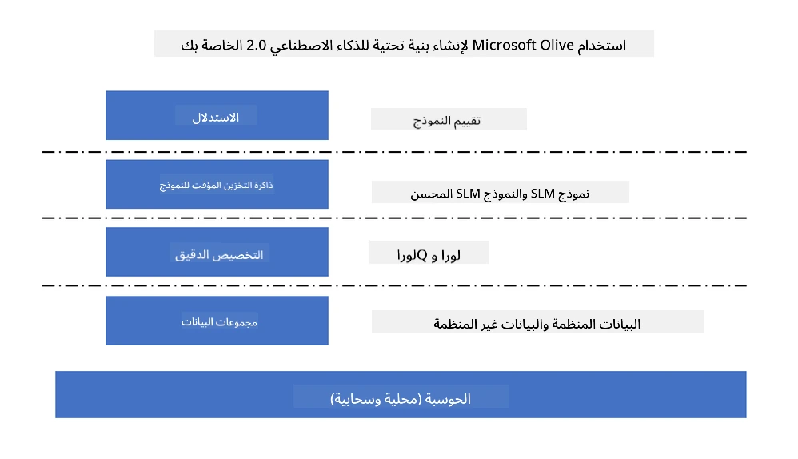
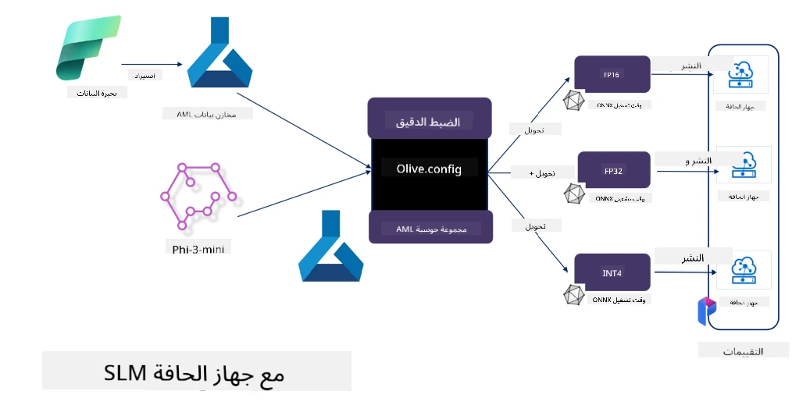

# **ضبط دقيق لـ Phi-3 باستخدام Microsoft Olive**

[Olive](https://github.com/microsoft/OLive?WT.mc_id=aiml-138114-kinfeylo) هي أداة تحسين نماذج مدركة للأجهزة وسهلة الاستخدام تجمع بين تقنيات رائدة في الصناعة عبر ضغط النماذج، والتحسين، والترجمة.

تم تصميمها لتبسيط عملية تحسين نماذج التعلم الآلي، وضمان الاستفادة القصوى من البنى التحتية للأجهزة المحددة.

سواء كنت تعمل على تطبيقات سحابية أو أجهزة طرفية، تتيح لك Olive تحسين نماذجك بسهولة وفعالية.

## الميزات الرئيسية:
- تجمع Olive بين تقنيات التحسين وتؤتمتها للأجهزة المستهدفة المطلوبة.
- لا توجد تقنية تحسين واحدة تناسب جميع السيناريوهات، لذا تسمح Olive بالتمديد من خلال تمكين خبراء الصناعة من إدخال ابتكاراتهم في التحسين.

## تقليل الجهد الهندسي:
- غالبًا ما يحتاج المطورون إلى تعلم واستخدام عدة سلاسل أدوات خاصة بموردي الأجهزة لتحضير وتحسين النماذج المدربة للنشر.
- تبسط Olive هذه التجربة من خلال أتمتة تقنيات التحسين للأجهزة المطلوبة.

## حل تحسين شامل جاهز للاستخدام:

من خلال تركيب وضبط التقنيات المتكاملة، تقدم Olive حلاً موحدًا للتحسين من البداية للنهاية.
تأخذ في الاعتبار قيود مثل الدقة والكمون أثناء تحسين النماذج.

## استخدام Microsoft Olive لضبط دقيق

Microsoft Olive هي أداة مفتوحة المصدر سهلة الاستخدام لتحسين النماذج يمكنها تغطية كل من الضبط الدقيق والمرجعية في مجال الذكاء الاصطناعي التوليدي. تتطلب فقط إعدادًا بسيطًا، وبالاقتران مع استخدام نماذج لغوية صغيرة مفتوحة المصدر وبيئات التشغيل ذات الصلة (AzureML / GPU محلي، CPU، DirectML)، يمكنك إتمام الضبط الدقيق أو المرجعية للنموذج من خلال التحسين التلقائي، والعثور على أفضل نموذج للنشر على السحابة أو على الأجهزة الطرفية. تتيح للمؤسسات بناء نماذجها الخاصة بالقطاعات الصناعية محليًا وفي السحابة.



## ضبط دقيق لـ Phi-3 باستخدام Microsoft Olive



## مثال على كود Olive لـ Phi-3

في هذا المثال ستستخدم Olive لـ:

- ضبط دقيق لمحول LoRA لتصنيف العبارات إلى حزن، فرح، خوف، مفاجأة.
- دمج أوزان المحول في النموذج الأساسي.
- تحسين وتكميم النموذج إلى int4.

[Sample Code](../../code/03.Finetuning/olive-ort-example/README.md)

### إعداد Microsoft Olive

تثبيت Microsoft Olive بسيط جدًا، ويمكن تثبيته أيضًا للـ CPU، GPU، DirectML، وAzure ML

```bash
pip install olive-ai
```

إذا كنت ترغب في تشغيل نموذج ONNX باستخدام CPU، يمكنك استخدام

```bash
pip install olive-ai[cpu]
```

إذا كنت تريد تشغيل نموذج ONNX باستخدام GPU، يمكنك استخدام

```python
pip install olive-ai[gpu]
```

إذا كنت تريد استخدام Azure ML، استخدم

```python
pip install git+https://github.com/microsoft/Olive#egg=olive-ai[azureml]
```

**ملاحظة**
متطلبات نظام التشغيل: Ubuntu 20.04 / 22.04

### **ملف Config.json الخاص بـ Microsoft Olive**

بعد التثبيت، يمكنك تكوين إعدادات مختلفة خاصة بالنموذج من خلال ملف Config، بما في ذلك البيانات، الحوسبة، التدريب، النشر، وتوليد النموذج.

**1. البيانات**

على Microsoft Olive، يمكن دعم التدريب على البيانات المحلية وبيانات السحابة، ويمكن تكوين ذلك في الإعدادات.

*إعدادات البيانات المحلية*

يمكنك ببساطة إعداد مجموعة البيانات التي تحتاج إلى تدريبها للضبط الدقيق، عادةً بصيغة json، وتكييفها مع قالب البيانات. يجب تعديل ذلك بناءً على متطلبات النموذج (على سبيل المثال، تكييفها مع الصيغة المطلوبة من Microsoft Phi-3-mini. إذا كان لديك نماذج أخرى، يرجى الرجوع إلى صيغ الضبط الدقيق المطلوبة للنماذج الأخرى للمعالجة)

```json

    "data_configs": [
        {
            "name": "dataset_default_train",
            "type": "HuggingfaceContainer",
            "load_dataset_config": {
                "params": {
                    "data_name": "json", 
                    "data_files":"dataset/dataset-classification.json",
                    "split": "train"
                }
            },
            "pre_process_data_config": {
                "params": {
                    "dataset_type": "corpus",
                    "text_cols": [
                            "phrase",
                            "tone"
                    ],
                    "text_template": "### Text: {phrase}\n### The tone is:\n{tone}",
                    "corpus_strategy": "join",
                    "source_max_len": 2048,
                    "pad_to_max_len": false,
                    "use_attention_mask": false
                }
            }
        }
    ],
```

**إعدادات مصدر بيانات السحابة**

من خلال ربط مخزن البيانات الخاص بـ Azure AI Studio / Azure Machine Learning Service لربط البيانات في السحابة، يمكنك اختيار إدخال مصادر بيانات مختلفة إلى Azure AI Studio / Azure Machine Learning Service عبر Microsoft Fabric وAzure Data كدعم لضبط البيانات.

```json

    "data_configs": [
        {
            "name": "dataset_default_train",
            "type": "HuggingfaceContainer",
            "load_dataset_config": {
                "params": {
                    "data_name": "json", 
                    "data_files": {
                        "type": "azureml_datastore",
                        "config": {
                            "azureml_client": {
                                "subscription_id": "Your Azure Subscrition ID",
                                "resource_group": "Your Azure Resource Group",
                                "workspace_name": "Your Azure ML Workspaces name"
                            },
                            "datastore_name": "workspaceblobstore",
                            "relative_path": "Your train_data.json Azure ML Location"
                        }
                    },
                    "split": "train"
                }
            },
            "pre_process_data_config": {
                "params": {
                    "dataset_type": "corpus",
                    "text_cols": [
                            "Question",
                            "Best Answer"
                    ],
                    "text_template": "<|user|>\n{Question}<|end|>\n<|assistant|>\n{Best Answer}\n<|end|>",
                    "corpus_strategy": "join",
                    "source_max_len": 2048,
                    "pad_to_max_len": false,
                    "use_attention_mask": false
                }
            }
        }
    ],
    
```

**2. إعداد الحوسبة**

إذا كنت بحاجة إلى العمل محليًا، يمكنك استخدام موارد البيانات المحلية مباشرة. إذا كنت بحاجة إلى استخدام موارد Azure AI Studio / Azure Machine Learning Service، يجب تكوين المعلمات ذات الصلة مثل اسم الحوسبة، وغيرها.

```json

    "systems": {
        "aml": {
            "type": "AzureML",
            "config": {
                "accelerators": ["gpu"],
                "hf_token": true,
                "aml_compute": "Your Azure AI Studio / Azure Machine Learning Service Compute Name",
                "aml_docker_config": {
                    "base_image": "Your Azure AI Studio / Azure Machine Learning Service docker",
                    "conda_file_path": "conda.yaml"
                }
            }
        },
        "azure_arc": {
            "type": "AzureML",
            "config": {
                "accelerators": ["gpu"],
                "aml_compute": "Your Azure AI Studio / Azure Machine Learning Service Compute Name",
                "aml_docker_config": {
                    "base_image": "Your Azure AI Studio / Azure Machine Learning Service docker",
                    "conda_file_path": "conda.yaml"
                }
            }
        }
    },
```

***ملاحظة***

نظرًا لأنه يتم التشغيل عبر حاوية على Azure AI Studio / Azure Machine Learning Service، يجب تكوين البيئة المطلوبة. يتم ذلك في بيئة conda.yaml.

```yaml

name: project_environment
channels:
  - defaults
dependencies:
  - python=3.8.13
  - pip=22.3.1
  - pip:
      - einops
      - accelerate
      - azure-keyvault-secrets
      - azure-identity
      - bitsandbytes
      - datasets
      - huggingface_hub
      - peft
      - scipy
      - sentencepiece
      - torch>=2.2.0
      - transformers
      - git+https://github.com/microsoft/Olive@jiapli/mlflow_loading_fix#egg=olive-ai[gpu]
      - --extra-index-url https://aiinfra.pkgs.visualstudio.com/PublicPackages/_packaging/ORT-Nightly/pypi/simple/ 
      - ort-nightly-gpu==1.18.0.dev20240307004
      - --extra-index-url https://aiinfra.pkgs.visualstudio.com/PublicPackages/_packaging/onnxruntime-genai/pypi/simple/
      - onnxruntime-genai-cuda

    

```

**3. اختيار SLM الخاص بك**

يمكنك استخدام النموذج مباشرة من Hugging face، أو دمجه مباشرة مع كتالوج النماذج الخاص بـ Azure AI Studio / Azure Machine Learning لاختيار النموذج المراد استخدامه. في مثال الكود أدناه سنستخدم Microsoft Phi-3-mini كمثال.

إذا كان لديك النموذج محليًا، يمكنك استخدام هذه الطريقة

```json

    "input_model":{
        "type": "PyTorchModel",
        "config": {
            "hf_config": {
                "model_name": "model-cache/microsoft/phi-3-mini",
                "task": "text-generation",
                "model_loading_args": {
                    "trust_remote_code": true
                }
            }
        }
    },
```

إذا كنت تريد استخدام نموذج من Azure AI Studio / Azure Machine Learning Service، يمكنك استخدام هذه الطريقة

```json

    "input_model":{
        "type": "PyTorchModel",
        "config": {
            "model_path": {
                "type": "azureml_registry_model",
                "config": {
                    "name": "microsoft/Phi-3-mini-4k-instruct",
                    "registry_name": "azureml-msr",
                    "version": "11"
                }
            },
             "model_file_format": "PyTorch.MLflow",
             "hf_config": {
                "model_name": "microsoft/Phi-3-mini-4k-instruct",
                "task": "text-generation",
                "from_pretrained_args": {
                    "trust_remote_code": true
                }
            }
        }
    },
```

**ملاحظة:**
نحتاج إلى التكامل مع Azure AI Studio / Azure Machine Learning Service، لذا عند إعداد النموذج، يرجى الرجوع إلى رقم الإصدار والتسمية ذات الصلة.

جميع النماذج على Azure يجب أن تكون مضبوطة على PyTorch.MLflow

يجب أن يكون لديك حساب Hugging face وربط المفتاح بقيمة المفتاح في Azure AI Studio / Azure Machine Learning

**4. الخوارزمية**

تغلف Microsoft Olive خوارزميات الضبط الدقيق Lora و QLora بشكل جيد جدًا. كل ما تحتاجه هو تكوين بعض المعلمات ذات الصلة. هنا سأأخذ QLora كمثال.

```json
        "lora": {
            "type": "LoRA",
            "config": {
                "target_modules": [
                    "o_proj",
                    "qkv_proj"
                ],
                "double_quant": true,
                "lora_r": 64,
                "lora_alpha": 64,
                "lora_dropout": 0.1,
                "train_data_config": "dataset_default_train",
                "eval_dataset_size": 0.3,
                "training_args": {
                    "seed": 0,
                    "data_seed": 42,
                    "per_device_train_batch_size": 1,
                    "per_device_eval_batch_size": 1,
                    "gradient_accumulation_steps": 4,
                    "gradient_checkpointing": false,
                    "learning_rate": 0.0001,
                    "num_train_epochs": 3,
                    "max_steps": 10,
                    "logging_steps": 10,
                    "evaluation_strategy": "steps",
                    "eval_steps": 187,
                    "group_by_length": true,
                    "adam_beta2": 0.999,
                    "max_grad_norm": 0.3
                }
            }
        },
```

إذا كنت تريد تحويل التكميم، فإن الفرع الرئيسي لـ Microsoft Olive يدعم بالفعل طريقة onnxruntime-genai. يمكنك ضبطها حسب حاجتك:

1. دمج أوزان المحول في النموذج الأساسي
2. تحويل النموذج إلى نموذج onnx بالدقة المطلوبة بواسطة ModelBuilder

مثل التحويل إلى INT4 مكمم

```json

        "merge_adapter_weights": {
            "type": "MergeAdapterWeights"
        },
        "builder": {
            "type": "ModelBuilder",
            "config": {
                "precision": "int4"
            }
        }
```

**ملاحظة**
- إذا استخدمت QLoRA، فإن تحويل التكميم لـ ONNXRuntime-genai غير مدعوم في الوقت الحالي.

- يجب التنويه هنا إلى أنه يمكنك ضبط الخطوات أعلاه حسب حاجتك. ليس من الضروري تكوين كل هذه الخطوات بالكامل. بناءً على احتياجاتك، يمكنك استخدام خطوات الخوارزمية مباشرة بدون ضبط دقيق. وأخيرًا تحتاج إلى تكوين المحركات ذات الصلة.

```json

    "engine": {
        "log_severity_level": 0,
        "host": "aml",
        "target": "aml",
        "search_strategy": false,
        "execution_providers": ["CUDAExecutionProvider"],
        "cache_dir": "../model-cache/models/phi3-finetuned/cache",
        "output_dir" : "../model-cache/models/phi3-finetuned"
    }
```

**5. الانتهاء من الضبط الدقيق**

على سطر الأوامر، نفذ في مجلد olive-config.json

```bash
olive run --config olive-config.json  
```

**إخلاء المسؤولية**:  
تمت ترجمة هذا المستند باستخدام خدمة الترجمة الآلية [Co-op Translator](https://github.com/Azure/co-op-translator). بينما نسعى لتحقيق الدقة، يرجى العلم أن الترجمات الآلية قد تحتوي على أخطاء أو عدم دقة. يجب اعتبار المستند الأصلي بلغته الأصلية المصدر الموثوق به. للمعلومات الهامة، يُنصح بالاعتماد على الترجمة البشرية المهنية. نحن غير مسؤولين عن أي سوء فهم أو تفسير ناتج عن استخدام هذه الترجمة.