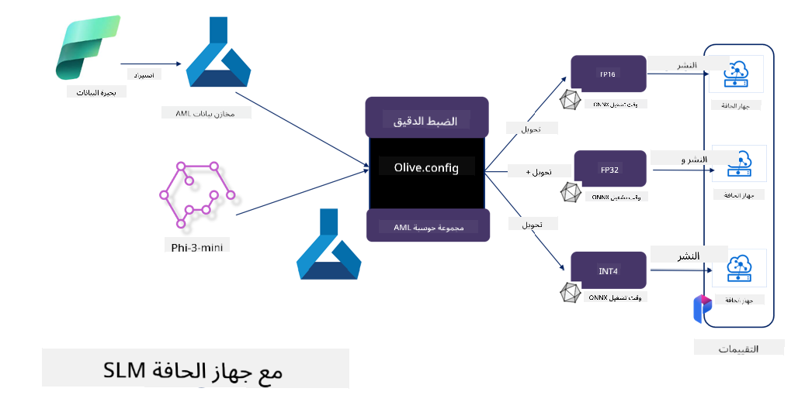

<!--
CO_OP_TRANSLATOR_METADATA:
{
  "original_hash": "5764be88ad2eb4f341e742eb8f14fab1",
  "translation_date": "2025-05-07T10:32:30+00:00",
  "source_file": "md/03.FineTuning/FineTuning_MicrosoftOlive.md",
  "language_code": "ar"
}
-->
# **ضبط دقيق لـ Phi-3 باستخدام Microsoft Olive**

[Olive](https://github.com/microsoft/OLive?WT.mc_id=aiml-138114-kinfeylo) هو أداة سهلة الاستخدام وواعية بالأجهزة لتحسين النماذج، تجمع بين تقنيات رائدة في الصناعة في ضغط النماذج، والتحسين، والترجمة.

تم تصميمها لتبسيط عملية تحسين نماذج التعلم الآلي، مع ضمان الاستفادة القصوى من البنى التحتية للأجهزة المحددة.

سواء كنت تعمل على تطبيقات سحابية أو على أجهزة الحافة، تمكّنك Olive من تحسين نماذجك بسهولة وفعالية.

## الميزات الرئيسية:
- تجمع Olive بين تقنيات التحسين وتؤتمتها لأهداف الأجهزة المرغوبة.
- لا توجد تقنية تحسين واحدة تناسب كل السيناريوهات، لذا تتيح Olive التوسعة عبر تمكين خبراء الصناعة من دمج ابتكاراتهم في التحسين.

## تقليل جهد الهندسة:
- غالبًا ما يحتاج المطورون إلى تعلم واستخدام عدة سلاسل أدوات خاصة ببائعي الأجهزة لتحضير وتحسين النماذج المدربة للنشر.
- تبسط Olive هذه التجربة من خلال أتمتة تقنيات التحسين للأجهزة المطلوبة.

## حل تحسين شامل جاهز للاستخدام:

من خلال تركيب وضبط التقنيات المتكاملة، تقدم Olive حلاً موحدًا للتحسين الشامل.
تأخذ في الاعتبار قيود مثل الدقة والكمون أثناء تحسين النماذج.

## استخدام Microsoft Olive لضبط الدقة

Microsoft Olive هو أداة مفتوحة المصدر سهلة الاستخدام لتحسين النماذج، تغطي كل من الضبط الدقيق والإشارة في مجال الذكاء الاصطناعي التوليدي. يتطلب فقط إعدادًا بسيطًا، وبالاقتران مع استخدام نماذج لغوية صغيرة مفتوحة المصدر وبيئات التشغيل ذات الصلة (AzureML / GPU محلي، CPU، DirectML)، يمكنك إتمام الضبط الدقيق أو الإشارة إلى النموذج من خلال التحسين التلقائي، والعثور على أفضل نموذج للنشر على السحابة أو على أجهزة الحافة. تتيح للمؤسسات بناء نماذجها الصناعية الخاصة على الخوادم المحلية والسحابة.


## ضبط دقيق لـ Phi-3 مع Microsoft Olive



## مثال على كود Olive لـ Phi-3

في هذا المثال ستستخدم Olive لـ:

- ضبط دقيق لـ LoRA adapter لتصنيف العبارات إلى حزن، فرح، خوف، مفاجأة.
- دمج أوزان المحول في النموذج الأساسي.
- تحسين وتحويل النموذج إلى int4.

[Sample Code](../../code/03.Finetuning/olive-ort-example/README.md)

### إعداد Microsoft Olive

تثبيت Microsoft Olive بسيط جدًا، ويمكن تثبيته أيضًا لـ CPU، GPU، DirectML، وAzure ML

```bash
pip install olive-ai
```

إذا رغبت في تشغيل نموذج ONNX باستخدام CPU، يمكنك استخدام

```bash
pip install olive-ai[cpu]
```

إذا أردت تشغيل نموذج ONNX باستخدام GPU، يمكنك استخدام

```python
pip install olive-ai[gpu]
```

إذا أردت استخدام Azure ML، استخدم

```python
pip install git+https://github.com/microsoft/Olive#egg=olive-ai[azureml]
```

**ملاحظة**
متطلبات نظام التشغيل: Ubuntu 20.04 / 22.04

### **ملف Config.json الخاص بـ Microsoft Olive**

بعد التثبيت، يمكنك تكوين إعدادات مختلفة خاصة بالنموذج من خلال ملف Config، بما في ذلك البيانات، الحوسبة، التدريب، النشر، وتوليد النموذج.

**1. البيانات**

على Microsoft Olive، يمكن دعم التدريب على البيانات المحلية وبيانات السحابة، ويمكن تكوين ذلك في الإعدادات.

*إعدادات البيانات المحلية*

يمكنك ببساطة إعداد مجموعة البيانات التي تحتاج إلى تدريبها للضبط الدقيق، عادةً بصيغة json، وتكييفها مع قالب البيانات. هذا يحتاج إلى تعديل بناءً على متطلبات النموذج (على سبيل المثال، تكييفه مع الصيغة المطلوبة من Microsoft Phi-3-mini. إذا كان لديك نماذج أخرى، يرجى الرجوع إلى صيغ الضبط الدقيق المطلوبة للنماذج الأخرى للمعالجة)

```json

    "data_configs": [
        {
            "name": "dataset_default_train",
            "type": "HuggingfaceContainer",
            "load_dataset_config": {
                "params": {
                    "data_name": "json", 
                    "data_files":"dataset/dataset-classification.json",
                    "split": "train"
                }
            },
            "pre_process_data_config": {
                "params": {
                    "dataset_type": "corpus",
                    "text_cols": [
                            "phrase",
                            "tone"
                    ],
                    "text_template": "### Text: {phrase}\n### The tone is:\n{tone}",
                    "corpus_strategy": "join",
                    "source_max_len": 2048,
                    "pad_to_max_len": false,
                    "use_attention_mask": false
                }
            }
        }
    ],
```

**إعدادات مصدر بيانات السحابة**

عن طريق ربط مخزن البيانات في Azure AI Studio / Azure Machine Learning Service لربط البيانات في السحابة، يمكنك اختيار إدخال مصادر بيانات مختلفة إلى Azure AI Studio / Azure Machine Learning Service من خلال Microsoft Fabric وAzure Data كدعم للضبط الدقيق للبيانات.

```json

    "data_configs": [
        {
            "name": "dataset_default_train",
            "type": "HuggingfaceContainer",
            "load_dataset_config": {
                "params": {
                    "data_name": "json", 
                    "data_files": {
                        "type": "azureml_datastore",
                        "config": {
                            "azureml_client": {
                                "subscription_id": "Your Azure Subscrition ID",
                                "resource_group": "Your Azure Resource Group",
                                "workspace_name": "Your Azure ML Workspaces name"
                            },
                            "datastore_name": "workspaceblobstore",
                            "relative_path": "Your train_data.json Azure ML Location"
                        }
                    },
                    "split": "train"
                }
            },
            "pre_process_data_config": {
                "params": {
                    "dataset_type": "corpus",
                    "text_cols": [
                            "Question",
                            "Best Answer"
                    ],
                    "text_template": "<|user|>\n{Question}<|end|>\n<|assistant|>\n{Best Answer}\n<|end|>",
                    "corpus_strategy": "join",
                    "source_max_len": 2048,
                    "pad_to_max_len": false,
                    "use_attention_mask": false
                }
            }
        }
    ],
    
```

**2. تكوين الحوسبة**

إذا كنت تحتاج إلى العمل محليًا، يمكنك استخدام موارد البيانات المحلية مباشرة. إذا كنت تحتاج إلى استخدام موارد Azure AI Studio / Azure Machine Learning Service، عليك تكوين المعلمات ذات الصلة، مثل اسم القدرة الحاسوبية، وغيرها.

```json

    "systems": {
        "aml": {
            "type": "AzureML",
            "config": {
                "accelerators": ["gpu"],
                "hf_token": true,
                "aml_compute": "Your Azure AI Studio / Azure Machine Learning Service Compute Name",
                "aml_docker_config": {
                    "base_image": "Your Azure AI Studio / Azure Machine Learning Service docker",
                    "conda_file_path": "conda.yaml"
                }
            }
        },
        "azure_arc": {
            "type": "AzureML",
            "config": {
                "accelerators": ["gpu"],
                "aml_compute": "Your Azure AI Studio / Azure Machine Learning Service Compute Name",
                "aml_docker_config": {
                    "base_image": "Your Azure AI Studio / Azure Machine Learning Service docker",
                    "conda_file_path": "conda.yaml"
                }
            }
        }
    },
```

***ملاحظة***

نظرًا لأنه يتم التشغيل عبر حاوية على Azure AI Studio / Azure Machine Learning Service، يجب تكوين البيئة المطلوبة. يتم ذلك في ملف conda.yaml الخاص بالبيئة.

```yaml

name: project_environment
channels:
  - defaults
dependencies:
  - python=3.8.13
  - pip=22.3.1
  - pip:
      - einops
      - accelerate
      - azure-keyvault-secrets
      - azure-identity
      - bitsandbytes
      - datasets
      - huggingface_hub
      - peft
      - scipy
      - sentencepiece
      - torch>=2.2.0
      - transformers
      - git+https://github.com/microsoft/Olive@jiapli/mlflow_loading_fix#egg=olive-ai[gpu]
      - --extra-index-url https://aiinfra.pkgs.visualstudio.com/PublicPackages/_packaging/ORT-Nightly/pypi/simple/ 
      - ort-nightly-gpu==1.18.0.dev20240307004
      - --extra-index-url https://aiinfra.pkgs.visualstudio.com/PublicPackages/_packaging/onnxruntime-genai/pypi/simple/
      - onnxruntime-genai-cuda

    

```

**3. اختيار نموذج SLM الخاص بك**

يمكنك استخدام النموذج مباشرة من Hugging face، أو دمجه مباشرة مع كتالوج النماذج في Azure AI Studio / Azure Machine Learning لاختيار النموذج المستخدم. في مثال الكود أدناه سنستخدم Microsoft Phi-3-mini كمثال.

إذا كان لديك النموذج محليًا، يمكنك استخدام هذه الطريقة

```json

    "input_model":{
        "type": "PyTorchModel",
        "config": {
            "hf_config": {
                "model_name": "model-cache/microsoft/phi-3-mini",
                "task": "text-generation",
                "model_loading_args": {
                    "trust_remote_code": true
                }
            }
        }
    },
```

إذا أردت استخدام نموذج من Azure AI Studio / Azure Machine Learning Service، يمكنك استخدام هذه الطريقة

```json

    "input_model":{
        "type": "PyTorchModel",
        "config": {
            "model_path": {
                "type": "azureml_registry_model",
                "config": {
                    "name": "microsoft/Phi-3-mini-4k-instruct",
                    "registry_name": "azureml-msr",
                    "version": "11"
                }
            },
             "model_file_format": "PyTorch.MLflow",
             "hf_config": {
                "model_name": "microsoft/Phi-3-mini-4k-instruct",
                "task": "text-generation",
                "from_pretrained_args": {
                    "trust_remote_code": true
                }
            }
        }
    },
```

**ملاحظة:**
نحتاج إلى التكامل مع Azure AI Studio / Azure Machine Learning Service، لذا عند إعداد النموذج، يرجى الرجوع إلى رقم الإصدار والتسمية ذات الصلة.

يجب تعيين جميع النماذج على Azure إلى PyTorch.MLflow

يجب أن يكون لديك حساب Hugging face وربط المفتاح بقيمة المفتاح في Azure AI Studio / Azure Machine Learning

**4. الخوارزمية**

يحتوي Microsoft Olive على تغليف ممتاز لخوارزميات الضبط الدقيق Lora و QLora. كل ما عليك هو تكوين بعض المعلمات ذات الصلة. هنا سأستخدم QLora كمثال.

```json
        "lora": {
            "type": "LoRA",
            "config": {
                "target_modules": [
                    "o_proj",
                    "qkv_proj"
                ],
                "double_quant": true,
                "lora_r": 64,
                "lora_alpha": 64,
                "lora_dropout": 0.1,
                "train_data_config": "dataset_default_train",
                "eval_dataset_size": 0.3,
                "training_args": {
                    "seed": 0,
                    "data_seed": 42,
                    "per_device_train_batch_size": 1,
                    "per_device_eval_batch_size": 1,
                    "gradient_accumulation_steps": 4,
                    "gradient_checkpointing": false,
                    "learning_rate": 0.0001,
                    "num_train_epochs": 3,
                    "max_steps": 10,
                    "logging_steps": 10,
                    "evaluation_strategy": "steps",
                    "eval_steps": 187,
                    "group_by_length": true,
                    "adam_beta2": 0.999,
                    "max_grad_norm": 0.3
                }
            }
        },
```

إذا أردت تحويل الكم، فإن الفرع الرئيسي لـ Microsoft Olive يدعم بالفعل طريقة onnxruntime-genai. يمكنك ضبطها حسب حاجتك:

1. دمج أوزان المحول في النموذج الأساسي
2. تحويل النموذج إلى نموذج onnx بالدقة المطلوبة بواسطة ModelBuilder

مثل التحويل إلى INT4 الكمّي

```json

        "merge_adapter_weights": {
            "type": "MergeAdapterWeights"
        },
        "builder": {
            "type": "ModelBuilder",
            "config": {
                "precision": "int4"
            }
        }
```

**ملاحظة**
- إذا استخدمت QLoRA، فإن تحويل الكم لـ ONNXRuntime-genai غير مدعوم في الوقت الحالي.
- يجدر التنويه هنا إلى أنه يمكنك ضبط الخطوات أعلاه حسب حاجتك. ليس من الضروري تكوين كل هذه الخطوات بالكامل. حسب حاجتك، يمكنك استخدام خطوات الخوارزمية مباشرة بدون ضبط دقيق. وأخيرًا، تحتاج إلى تكوين المحركات ذات الصلة.

```json

    "engine": {
        "log_severity_level": 0,
        "host": "aml",
        "target": "aml",
        "search_strategy": false,
        "execution_providers": ["CUDAExecutionProvider"],
        "cache_dir": "../model-cache/models/phi3-finetuned/cache",
        "output_dir" : "../model-cache/models/phi3-finetuned"
    }
```

**5. الانتهاء من الضبط الدقيق**

نفّذ في سطر الأوامر داخل مجلد olive-config.json

```bash
olive run --config olive-config.json  
```

**إخلاء مسؤولية**:  
تمت ترجمة هذا المستند باستخدام خدمة الترجمة الآلية [Co-op Translator](https://github.com/Azure/co-op-translator). بينما نسعى لتحقيق الدقة، يرجى العلم أن الترجمات الآلية قد تحتوي على أخطاء أو عدم دقة. يجب اعتبار المستند الأصلي بلغته الأصلية المصدر الرسمي والمعتمد. بالنسبة للمعلومات الحساسة، يُنصح بالاعتماد على الترجمة المهنية البشرية. نحن غير مسؤولين عن أي سوء فهم أو تفسير خاطئ ناتج عن استخدام هذه الترجمة.