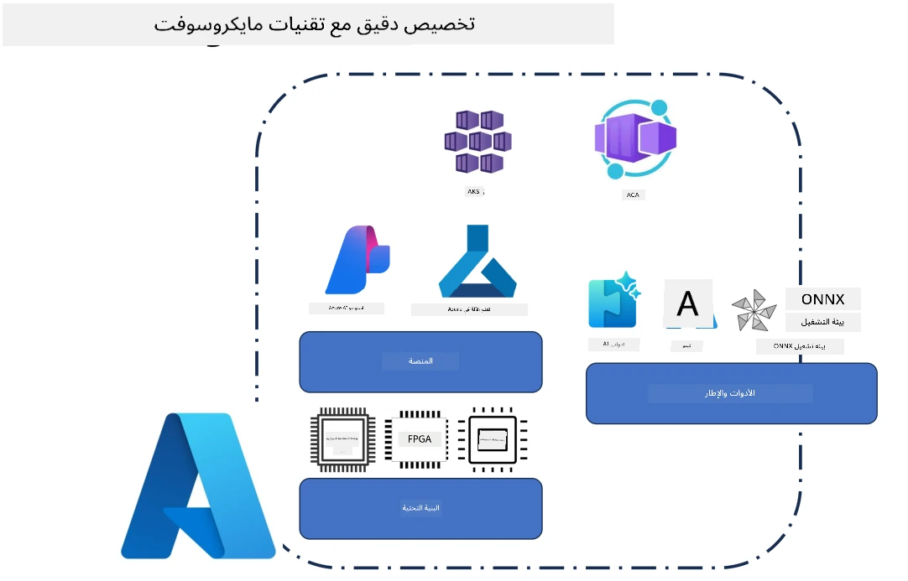
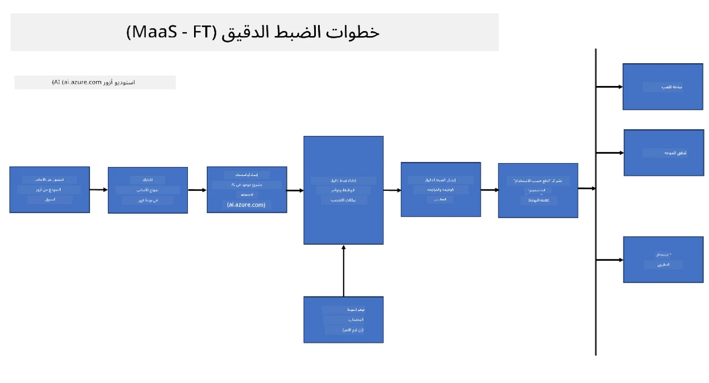
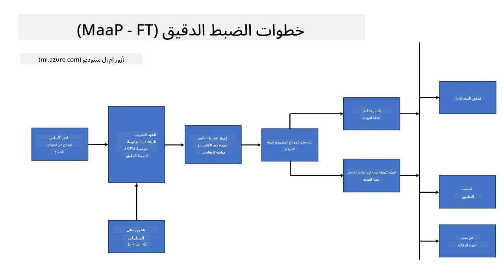
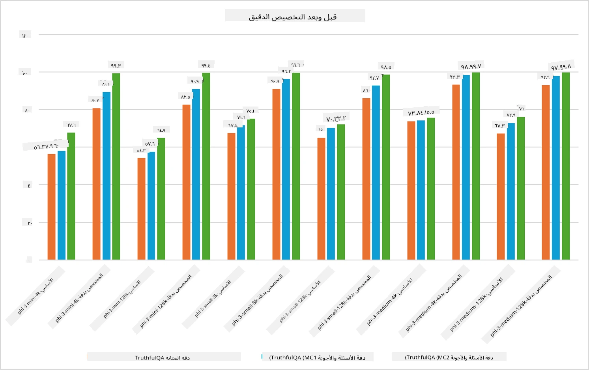

## سيناريوهات الضبط الدقيق

يوفر هذا القسم لمحة عامة عن سيناريوهات الضبط الدقيق في بيئات Microsoft Foundry وAzure، بما في ذلك نماذج النشر، طبقات البنية التحتية، وتقنيات التحسين المستخدمة بشكل شائع.

**المنصة**  
تشمل هذه الخدمات المُدارة مثل Microsoft Foundry (المعروف سابقًا باسم Azure AI Foundry) وAzure Machine Learning، التي توفر إدارة النماذج، تنظيم سير العمل، تتبع التجارب، وسير عمل النشر.

**البنية التحتية**  
يتطلب الضبط الدقيق موارد حوسبة قابلة للتوسع. في بيئات Azure، يشمل ذلك عادةً الأجهزة الافتراضية القائمة على GPU وموارد CPU للأحمال الخفيفة، إلى جانب التخزين القابل للتوسع للمجموعات البيانات ونقاط التحقق.

**الأدوات والأُطر**  
تعتمد عمليات الضبط الدقيق عادةً على أُطر ومكتبات تحسين مثل Hugging Face Transformers، DeepSpeed، وPEFT (الضبط الدقيق بكفاءة المعلمات).

تشمل عملية الضبط الدقيق باستخدام تقنيات مايكروسوفت خدمات المنصة، بنية الحوسبة، وأُطر التدريب. من خلال فهم كيفية عمل هذه المكونات معًا، يمكن للمطورين تعديل نماذج الأساس بكفاءة لتناسب المهام المحددة وسيناريوهات الإنتاج.

## النموذج كخدمة

ضبط النموذج باستخدام الضبط الدقيق المستضاف، دون الحاجة إلى إنشاء وإدارة موارد الحوسبة.

الضبط الدقيق بدون خادم متاح الآن لعائلات النماذج Phi-3، Phi-3.5، وPhi-4، مما يمكّن المطورين من تخصيص النماذج بسرعة وسهولة لسيناريوهات السحابة والحافة دون الحاجة لترتيب موارد الحوسبة.

## النموذج كمنصة

يقوم المستخدمون بإدارة موارد الحوسبة الخاصة بهم من أجل ضبط نماذجهم.

[عينة ضبط دقيق](https://github.com/Azure/azureml-examples/blob/main/sdk/python/foundation-models/system/finetune/chat-completion/chat-completion.ipynb)

## مقارنة تقنيات الضبط الدقيق

|السيناريو|LoRA|QLoRA|PEFT|DeepSpeed|ZeRO|DoRA|
|---|---|---|---|---|---|---|
|تكييف نماذج LLM المدربة مسبقًا لمهام أو مجالات محددة|نعم|نعم|نعم|نعم|نعم|نعم|
|الضبط الدقيق لمهام معالجة اللغة الطبيعية مثل تصنيف النصوص، التعرف على الكيانات المسماة، والترجمة الآلية|نعم|نعم|نعم|نعم|نعم|نعم|
|الضبط الدقيق لمهام الأسئلة والأجوبة|نعم|نعم|نعم|نعم|نعم|نعم|
|الضبط الدقيق لتوليد ردود شبيهة بالبشر في روبوتات الدردشة|نعم|نعم|نعم|نعم|نعم|نعم|
|الضبط الدقيق لتوليد الموسيقى، الفن، أو أشكال أخرى من الإبداع|نعم|نعم|نعم|نعم|نعم|نعم|
|تقليل التكاليف الحسابية والمالية|نعم|نعم|نعم|نعم|نعم|نعم|
|تقليل استخدام الذاكرة|نعم|نعم|نعم|نعم|نعم|نعم|
|استخدام عدد أقل من المعلمات لضبط دقيق فعّال|نعم|نعم|نعم|لا|لا|نعم|
|شكل فعال للذاكرة من التوازي البياناتي يمنح الوصول إلى الذاكرة المجمعة لجميع أجهزة GPU المتاحة|لا|لا|لا|نعم|نعم|لا|

> [!NOTE]
> تعد LoRA، QLoRA، PEFT، وDoRA طرق ضبط دقيق بكفاءة المعلمات، بينما يركز DeepSpeed وZeRO على التدريب الموزع وتحسين الذاكرة.

## أمثلة على أداء الضبط الدقيق

---

<!-- CO-OP TRANSLATOR DISCLAIMER START -->
**إخلاء المسؤولية**:
تمت ترجمة هذا المستند باستخدام خدمة الترجمة الآلية [Co-op Translator](https://github.com/Azure/co-op-translator). بينما نسعى لتحقيق الدقة، يرجى العلم أن الترجمات الآلية قد تحتوي على أخطاء أو عدم دقة. يجب اعتبار المستند الأصلي بلغته الأصلية هو المصدر الموثوق. بالنسبة للمعلومات الحساسة، يُنصح بالترجمة المهنية البشرية. نحن غير مسؤولين عن أي سوء فهم أو تفسير ناتج عن استخدام هذه الترجمة.
<!-- CO-OP TRANSLATOR DISCLAIMER END -->