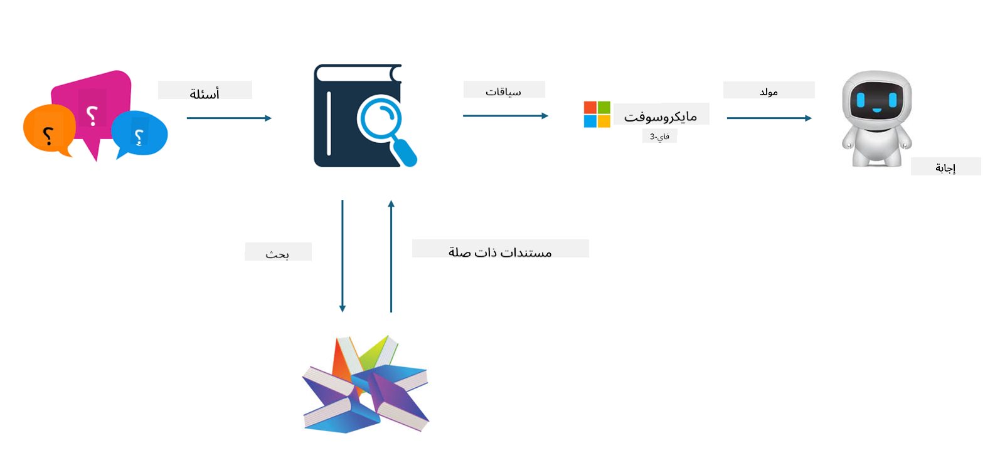

<!--
CO_OP_TRANSLATOR_METADATA:
{
  "original_hash": "e4e010400c2918557b36bb932a14004c",
  "translation_date": "2025-07-17T09:26:46+00:00",
  "source_file": "md/03.FineTuning/FineTuning_vs_RAG.md",
  "language_code": "ar"
}
-->
## التخصيص مقابل RAG

## التوليد المعزز بالاسترجاع

RAG هو استرجاع البيانات + توليد النصوص. يتم تخزين البيانات المنظمة وغير المنظمة للمؤسسة في قاعدة بيانات متجهة. عند البحث عن محتوى ذي صلة، يتم العثور على الملخص والمحتوى المناسب لتشكيل سياق، ويتم دمج قدرة إكمال النص في LLM/SLM لتوليد المحتوى.

## عملية RAG

## التخصيص
التخصيص يعتمد على تحسين نموذج معين. لا يحتاج إلى البدء بخوارزمية النموذج، لكن يجب تراكم البيانات بشكل مستمر. إذا كنت تريد مصطلحات وتعبيرات لغوية أكثر دقة في تطبيقات الصناعة، فالتخصيص هو الخيار الأفضل. ولكن إذا كانت بياناتك تتغير بشكل متكرر، فقد يصبح التخصيص معقدًا.

## كيفية الاختيار
إذا كان جوابنا يتطلب إدخال بيانات خارجية، فإن RAG هو الخيار الأفضل.

إذا كنت بحاجة إلى إخراج معرفة صناعية مستقرة ودقيقة، فالتخصيص سيكون خيارًا جيدًا. RAG يركز على سحب المحتوى ذي الصلة لكنه قد لا يلتقط دائمًا التفاصيل المتخصصة بدقة.

التخصيص يتطلب مجموعة بيانات عالية الجودة، وإذا كانت البيانات ضمن نطاق صغير فقط، فلن يحدث فرقًا كبيرًا. RAG أكثر مرونة.
التخصيص هو صندوق أسود، نوع من الميتافيزيقا، ومن الصعب فهم آليته الداخلية. أما RAG فيسهل العثور على مصدر البيانات، مما يساعد على ضبط الهلوسات أو أخطاء المحتوى بشكل فعال ويوفر شفافية أفضل.

**إخلاء المسؤولية**:  
تمت ترجمة هذا المستند باستخدام خدمة الترجمة الآلية [Co-op Translator](https://github.com/Azure/co-op-translator). بينما نسعى لتحقيق الدقة، يرجى العلم أن الترجمات الآلية قد تحتوي على أخطاء أو عدم دقة. يجب اعتبار المستند الأصلي بلغته الأصلية المصدر الموثوق به. للمعلومات الهامة، يُنصح بالاعتماد على الترجمة البشرية المهنية. نحن غير مسؤولين عن أي سوء فهم أو تفسير ناتج عن استخدام هذه الترجمة.