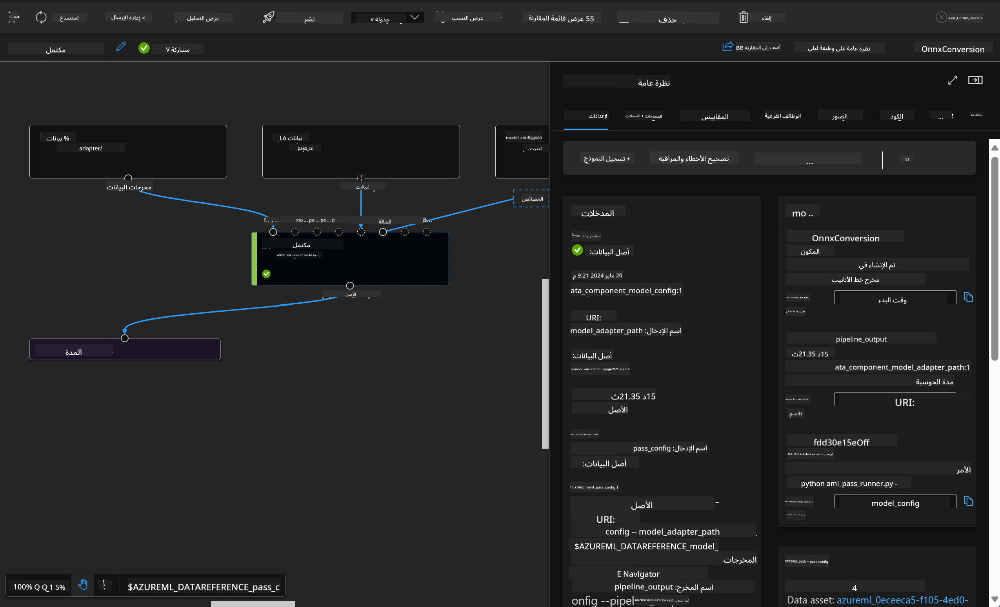

<!--
CO_OP_TRANSLATOR_METADATA:
{
  "original_hash": "7fe541373802e33568e94e13226d463c",
  "translation_date": "2025-05-07T10:23:39+00:00",
  "source_file": "md/03.FineTuning/Introduce_AzureML.md",
  "language_code": "ar"
}
-->
# **تقديم خدمة Azure Machine Learning**

[Azure Machine Learning](https://ml.azure.com?WT.mc_id=aiml-138114-kinfeylo) هي خدمة سحابية لتسريع وإدارة دورة حياة مشاريع التعلم الآلي (ML).

يمكن للمحترفين في مجال ML، وعلماء البيانات، والمهندسين استخدامها في سير عملهم اليومي لـ:

- تدريب ونشر النماذج.
- إدارة عمليات التعلم الآلي (MLOps).
- يمكنك إنشاء نموذج في Azure Machine Learning أو استخدام نموذج تم إنشاؤه من منصة مفتوحة المصدر مثل PyTorch أو TensorFlow أو scikit-learn.
- تساعد أدوات MLOps في مراقبة النماذج، وإعادة تدريبها، وإعادة نشرها.

## لمن موجه Azure Machine Learning؟

**علماء البيانات ومهندسو ML**

يمكنهم استخدام الأدوات لتسريع وأتمتة سير العمل اليومي.
يوفر Azure ML ميزات للعدالة، والشرح، والتتبع، والتدقيق.

**مطوروا التطبيقات:**

يمكنهم دمج النماذج بسلاسة في التطبيقات أو الخدمات.

**مطوروا المنصات**

لديهم وصول إلى مجموعة قوية من الأدوات مدعومة بواسطة Azure Resource Manager APIs المتينة.
تسمح هذه الأدوات ببناء أدوات تعلم آلي متقدمة.

**المؤسسات**

العمل في سحابة Microsoft Azure يتيح للمؤسسات الاستفادة من أمان مألوف والتحكم في الوصول بناءً على الأدوار.
يمكن إعداد المشاريع للتحكم في الوصول إلى البيانات المحمية والعمليات المحددة.

## الإنتاجية للجميع في الفريق
غالبًا ما تتطلب مشاريع ML فريقًا يمتلك مجموعة متنوعة من المهارات للبناء والصيانة.

يوفر Azure ML أدوات تمكنك من:
- التعاون مع فريقك عبر دفاتر الملاحظات المشتركة، وموارد الحوسبة، والحوسبة بدون خادم، والبيانات، والبيئات.
- تطوير نماذج تتميز بالعدالة، والشرح، والتتبع، والتدقيق لتلبية متطلبات الأصول والتدقيق.
- نشر نماذج ML بسرعة وسهولة وعلى نطاق واسع، وإدارتها وحوكمتها بكفاءة باستخدام MLOps.
- تشغيل أحمال عمل التعلم الآلي في أي مكان مع الحوكمة والأمان والامتثال المدمجين.

## أدوات منصة متوافقة عبر الأنظمة

يمكن لأي شخص في فريق ML استخدام الأدوات المفضلة لديه لإنجاز المهمة.
سواء كنت تجري تجارب سريعة، أو تضبط المعاملات الفائقة، أو تبني خطوط أنابيب، أو تدير الاستدلالات، يمكنك استخدام واجهات مألوفة تشمل:
- Azure Machine Learning Studio
- Python SDK (v2)
- Azure CLI (v2)
- Azure Resource Manager REST APIs

أثناء تحسين النماذج والتعاون طوال دورة التطوير، يمكنك مشاركة والعثور على الأصول والموارد والقياسات داخل واجهة Azure Machine Learning studio.

## **LLM/SLM في Azure ML**

أضاف Azure ML العديد من الوظائف المتعلقة بـ LLM/SLM، مدمجًا بين LLMOps و SLMOps لإنشاء منصة تكنولوجيا ذكاء اصطناعي توليدية على مستوى المؤسسة.

### **كتالوج النماذج**

يمكن لمستخدمي المؤسسات نشر نماذج مختلفة حسب سيناريوهات الأعمال المختلفة من خلال كتالوج النماذج، وتقديم الخدمات كنموذج كخدمة للمطورين أو المستخدمين في المؤسسة.

يعد كتالوج النماذج في Azure Machine Learning studio مركزًا لاكتشاف واستخدام مجموعة واسعة من النماذج التي تمكنك من بناء تطبيقات الذكاء الاصطناعي التوليدية. يحتوي كتالوج النماذج على مئات النماذج من مزودي النماذج مثل خدمة Azure OpenAI، Mistral، Meta، Cohere، Nvidia، Hugging Face، بما في ذلك النماذج التي تدربتها Microsoft. النماذج من مزودين غير Microsoft تُعتبر منتجات غير تابعة لمايكروسوفت، كما هو معرف في شروط منتجات Microsoft، وتخضع للشروط المقدمة مع النموذج.

### **خط أنابيب الوظائف**

الجوهر في خط أنابيب التعلم الآلي هو تقسيم مهمة التعلم الآلي الكاملة إلى سير عمل متعدد الخطوات. كل خطوة هي مكون يمكن إدارته، تطويره، تحسينه، تكوينه، وأتمتته بشكل فردي. ترتبط الخطوات عبر واجهات محددة جيدًا. تقوم خدمة خط أنابيب Azure Machine Learning بتنظيم جميع التبعيات بين خطوات الخط تلقائيًا.

في تحسين SLM / LLM، يمكننا إدارة بياناتنا، والتدريب، وعمليات التوليد عبر Pipeline

### **تدفق المطالبات**

فوائد استخدام تدفق مطالبات Azure Machine Learning  
يقدم تدفق مطالبات Azure Machine Learning مجموعة من الفوائد التي تساعد المستخدمين على الانتقال من الفكرة إلى التجربة، وأخيرًا إلى تطبيقات LLM الجاهزة للإنتاج:

**مرونة هندسة المطالبات**

تجربة تأليف تفاعلية: يوفر تدفق مطالبات Azure Machine Learning تمثيلًا بصريًا لهياكل التدفق، مما يسمح للمستخدمين بفهم مشاريعهم والتنقل فيها بسهولة. كما يقدم تجربة تشبه دفتر الملاحظات لتطوير وتصحيح التدفقات بكفاءة.  
تنويعات لضبط المطالبات: يمكن للمستخدمين إنشاء ومقارنة عدة تنويعات للمطالبات، مما يسهل عملية تحسين متكررة.

التقييم: تمكّن التدفقات المدمجة من تقييم جودة وفعالية المطالبات والتدفقات.

موارد شاملة: يتضمن تدفق مطالبات Azure Machine Learning مكتبة من الأدوات المدمجة، والعينات، والقوالب التي تشكل نقطة انطلاق للتطوير، ملهمة للإبداع ومعجلة للعملية.

**الجاهزية المؤسسية لتطبيقات LLM**

التعاون: يدعم تدفق مطالبات Azure Machine Learning التعاون الجماعي، مما يسمح لعدة مستخدمين بالعمل معًا على مشاريع هندسة المطالبات، ومشاركة المعرفة، والحفاظ على التحكم في الإصدارات.

منصة متكاملة: يبسط تدفق مطالبات Azure Machine Learning عملية هندسة المطالبات بأكملها، من التطوير والتقييم إلى النشر والمراقبة. يمكن للمستخدمين نشر تدفقاتهم كنقاط نهاية Azure Machine Learning ومراقبة أدائها في الوقت الفعلي، مما يضمن التشغيل الأمثل والتحسين المستمر.

حلول جاهزية المؤسسات من Azure Machine Learning: يستفيد تدفق المطالبات من حلول الجاهزية المؤسسية القوية لـ Azure Machine Learning، مما يوفر أساسًا آمنًا وقابلًا للتوسع وموثوقًا لتطوير، وتجربة، ونشر التدفقات.

مع تدفق مطالبات Azure Machine Learning، يمكن للمستخدمين إطلاق مرونة هندسة المطالبات، والتعاون بفعالية، والاستفادة من حلول ذات مستوى مؤسسي لتطوير ونشر تطبيقات LLM ناجحة.

من خلال دمج قوة الحوسبة، والبيانات، والمكونات المختلفة لـ Azure ML، يمكن لمطوري المؤسسات بناء تطبيقات الذكاء الاصطناعي الخاصة بهم بسهولة.

**تنويه**:  
تمت ترجمة هذا المستند باستخدام خدمة الترجمة الآلية [Co-op Translator](https://github.com/Azure/co-op-translator). بينما نسعى لتحقيق الدقة، يرجى العلم أن الترجمات الآلية قد تحتوي على أخطاء أو عدم دقة. يجب اعتبار المستند الأصلي بلغته الأصلية المصدر الموثوق به. للمعلومات الحساسة، يُنصح بالاستعانة بترجمة بشرية محترفة. نحن غير مسؤولين عن أي سوء فهم أو تفسير ناتج عن استخدام هذه الترجمة.