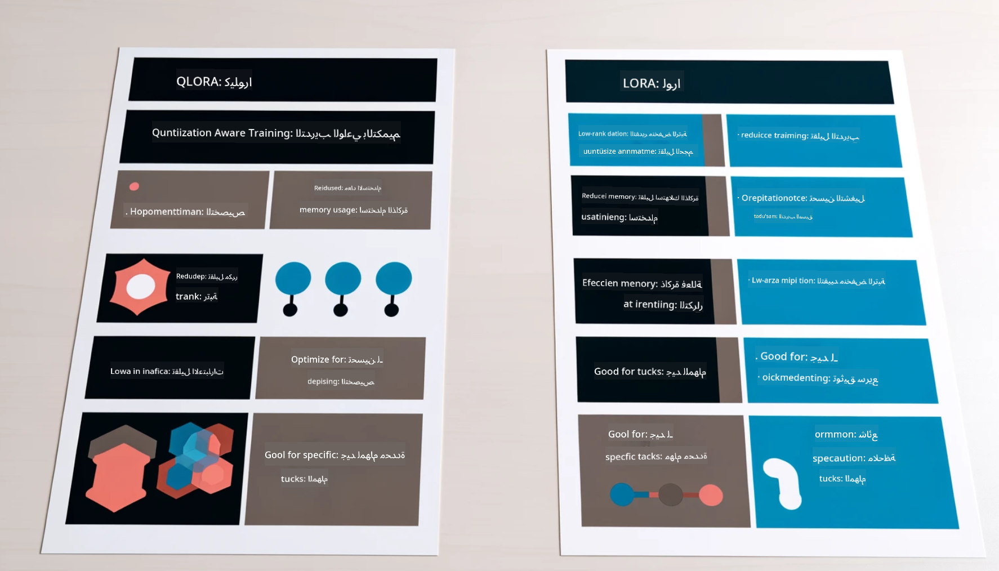

<!--
CO_OP_TRANSLATOR_METADATA:
{
  "original_hash": "743d7e9cb9c4e8ea642d77bee657a7fa",
  "translation_date": "2025-05-07T10:22:25+00:00",
  "source_file": "md/03.FineTuning/LetPhi3gotoIndustriy.md",
  "language_code": "ar"
}
-->
# **دع Phi-3 يصبح خبيرًا في الصناعة**

لوضع نموذج Phi-3 في صناعة معينة، تحتاج إلى إضافة بيانات الأعمال الصناعية إلى نموذج Phi-3. لدينا خياران مختلفان، الأول هو RAG (التوليد المعزز بالاسترجاع) والثاني هو Fine Tuning (الضبط الدقيق).

## **RAG مقابل Fine-Tuning**

### **التوليد المعزز بالاسترجاع**

RAG هو استرجاع البيانات + توليد النصوص. يتم تخزين البيانات المنظمة وغير المنظمة للمؤسسة في قاعدة بيانات المتجهات. عند البحث عن محتوى ذي صلة، يتم العثور على الملخص والمحتوى ذي الصلة لتشكيل سياق، ويتم دمج قدرة إكمال النص في LLM/SLM لتوليد المحتوى.

### **الضبط الدقيق**

الضبط الدقيق يعتمد على تحسين نموذج معين. لا يحتاج إلى البدء بخوارزمية النموذج، لكن يجب تراكم البيانات باستمرار. إذا كنت تريد مصطلحات وتعبيرات لغوية أكثر دقة في تطبيقات الصناعة، فإن الضبط الدقيق هو الخيار الأفضل. لكن إذا كانت بياناتك تتغير بشكل متكرر، قد يصبح الضبط الدقيق معقدًا.

### **كيفية الاختيار**

1. إذا كان جوابنا يتطلب إدخال بيانات خارجية، فإن RAG هو الخيار الأفضل

2. إذا كنت تحتاج إلى إخراج معرفة صناعية مستقرة ودقيقة، سيكون الضبط الدقيق خيارًا جيدًا. يفضل RAG سحب المحتوى ذي الصلة لكنه قد لا يلتقط دائمًا الفروق المتخصصة بدقة.

3. يتطلب الضبط الدقيق مجموعة بيانات عالية الجودة، وإذا كانت البيانات في نطاق صغير فقط، فلن يحدث فرق كبير. RAG أكثر مرونة.

4. الضبط الدقيق هو صندوق أسود، أمر غامض، ومن الصعب فهم آليته الداخلية. أما RAG فيسهل العثور على مصدر البيانات، مما يسمح بضبط الهلوسات أو أخطاء المحتوى بشكل فعال ويوفر شفافية أفضل.

### **السيناريوهات**

1. الصناعات العمودية تتطلب مفردات وتعبيرات مهنية محددة، ***الضبط الدقيق*** سيكون الخيار الأفضل

2. نظام الأسئلة والأجوبة، الذي يتضمن تجميع نقاط معرفة مختلفة، ***RAG*** سيكون الخيار الأفضل

3. الجمع بين سير العمل الآلي للأعمال ***RAG + الضبط الدقيق*** هو الخيار الأمثل

## **كيفية استخدام RAG**

قاعدة بيانات المتجهات هي مجموعة من البيانات المخزنة بشكل رياضي. تسهل قواعد بيانات المتجهات على نماذج التعلم الآلي تذكر المدخلات السابقة، مما يتيح استخدام التعلم الآلي لدعم حالات الاستخدام مثل البحث، التوصيات، وتوليد النصوص. يمكن التعرف على البيانات بناءً على مقاييس التشابه بدلاً من التطابق التام، مما يسمح للنماذج الحاسوبية بفهم سياق البيانات.

قاعدة بيانات المتجهات هي المفتاح لتحقيق RAG. يمكننا تحويل البيانات إلى تخزين متجهات من خلال نماذج المتجهات مثل text-embedding-3، jina-ai-embedding، وغيرها.

لمعرفة المزيد عن إنشاء تطبيق RAG [https://github.com/microsoft/Phi-3CookBook](https://github.com/microsoft/Phi-3CookBook?WT.mc_id=aiml-138114-kinfeylo)

## **كيفية استخدام Fine-tuning**

الخوارزميات المستخدمة عادة في الضبط الدقيق هي Lora و QLora. كيف تختار؟
- [تعلم المزيد مع هذا الدفتر التفاعلي](../../../../code/04.Finetuning/Phi_3_Inference_Finetuning.ipynb)
- [مثال على نموذج FineTuning في بايثون](../../../../code/04.Finetuning/FineTrainingScript.py)

### **Lora و QLora**

LoRA (التكيف منخفض الرتبة) و QLoRA (التكيف منخفض الرتبة المقنن) هما تقنيتان تُستخدمان لضبط نماذج اللغة الكبيرة (LLMs) باستخدام الضبط الدقيق الفعال للمعلمات (PEFT). تم تصميم تقنيات PEFT لتدريب النماذج بكفاءة أكبر مقارنة بالطرق التقليدية.

LoRA هي تقنية ضبط دقيق قائمة بذاتها تقلل من استهلاك الذاكرة من خلال تطبيق تقريب منخفض الرتبة على مصفوفة تحديث الأوزان. توفر أوقات تدريب سريعة وتحافظ على أداء قريب من طرق الضبط التقليدية.

QLoRA هي نسخة موسعة من LoRA تتضمن تقنيات التكميم لتقليل استخدام الذاكرة بشكل أكبر. تقوم QLoRA بتكميم دقة معلمات الأوزان في نموذج LLM المدرب مسبقًا إلى دقة 4-بت، مما يجعلها أكثر كفاءة في الذاكرة مقارنة بـ LoRA. ومع ذلك، فإن تدريب QLoRA أبطأ بحوالي 30% من تدريب LoRA بسبب خطوات التكميم وإلغاء التكميم الإضافية.

تستخدم QLoRA LoRA كملحق لتصحيح الأخطاء الناتجة عن أخطاء التكميم. تمكّن QLoRA من ضبط نماذج ضخمة بمليارات المعلمات على وحدات معالجة رسومية صغيرة ومتاحة نسبيًا. على سبيل المثال، يمكن لـ QLoRA ضبط نموذج بـ 70 مليار معلمة يتطلب 36 وحدة معالجة رسومية باستخدام فقط 2

**إخلاء مسؤولية**:  
تمت ترجمة هذا المستند باستخدام خدمة الترجمة الآلية [Co-op Translator](https://github.com/Azure/co-op-translator). بينما نسعى لتحقيق الدقة، يرجى العلم أن الترجمات الآلية قد تحتوي على أخطاء أو عدم دقة. يجب اعتبار المستند الأصلي بلغته الأصلية المصدر الرسمي والمعتمد. للمعلومات الحساسة، يُنصح بالترجمة المهنية البشرية. نحن غير مسؤولين عن أي سوء فهم أو تفسير خاطئ ناتج عن استخدام هذه الترجمة.