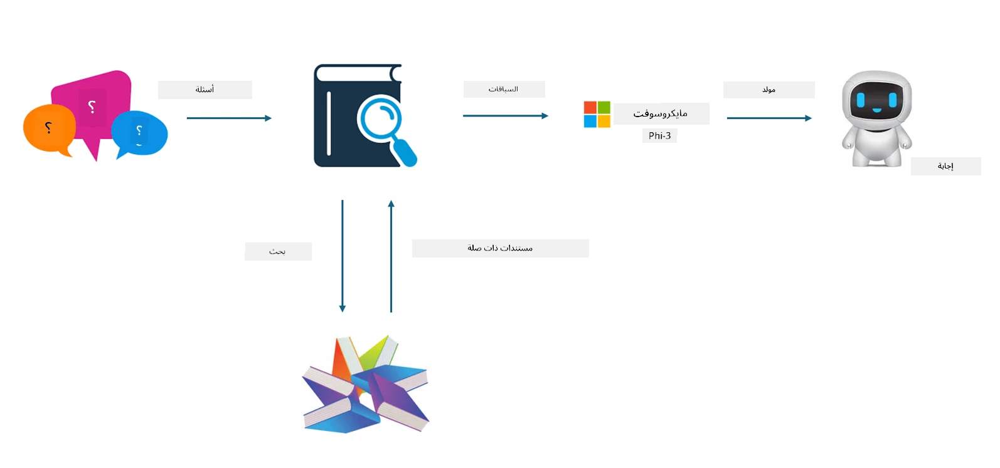
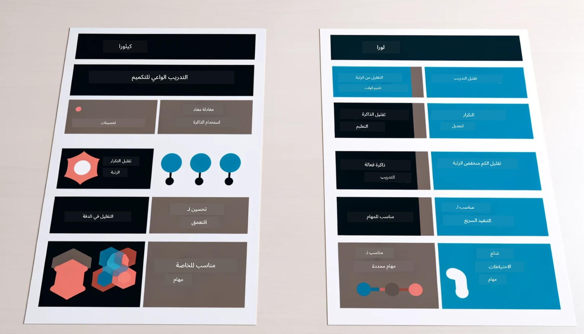

<!--
CO_OP_TRANSLATOR_METADATA:
{
  "original_hash": "743d7e9cb9c4e8ea642d77bee657a7fa",
  "translation_date": "2025-07-17T09:51:46+00:00",
  "source_file": "md/03.FineTuning/LetPhi3gotoIndustriy.md",
  "language_code": "ar"
}
-->
# **دع Phi-3 يصبح خبيرًا في الصناعة**

لوضع نموذج Phi-3 في صناعة معينة، تحتاج إلى إضافة بيانات أعمال الصناعة إلى نموذج Phi-3. لدينا خياران مختلفان، الأول هو RAG (التوليد المعزز بالاسترجاع) والثاني هو الضبط الدقيق.

## **RAG مقابل الضبط الدقيق**

### **التوليد المعزز بالاسترجاع**

RAG هو استرجاع البيانات + توليد النصوص. يتم تخزين البيانات المنظمة وغير المنظمة للمؤسسة في قاعدة بيانات متجهية. عند البحث عن محتوى ذي صلة، يتم العثور على الملخص والمحتوى المناسب لتشكيل سياق، ويتم دمج قدرة إكمال النصوص لنماذج LLM/SLM لتوليد المحتوى.

### **الضبط الدقيق**

الضبط الدقيق يعتمد على تحسين نموذج معين. لا يحتاج إلى البدء بخوارزمية النموذج، لكن يجب تراكم البيانات بشكل مستمر. إذا كنت تريد مصطلحات وتعبيرات لغوية أكثر دقة في تطبيقات الصناعة، فالضبط الدقيق هو الخيار الأفضل. ولكن إذا كانت بياناتك تتغير بشكل متكرر، فقد يصبح الضبط الدقيق معقدًا.

### **كيفية الاختيار**

1. إذا كان جوابنا يتطلب إدخال بيانات خارجية، فإن RAG هو الخيار الأفضل

2. إذا كنت بحاجة إلى إخراج معرفة صناعية مستقرة ودقيقة، فالضبط الدقيق سيكون خيارًا جيدًا. RAG يفضل سحب المحتوى ذي الصلة لكنه قد لا يلتقط دائمًا الفروق الدقيقة المتخصصة.

3. الضبط الدقيق يتطلب مجموعة بيانات عالية الجودة، وإذا كانت البيانات ضمن نطاق صغير فقط، فلن يحدث فرق كبير. RAG أكثر مرونة

4. الضبط الدقيق هو صندوق أسود، نوع من الغموض، ومن الصعب فهم آليته الداخلية. أما RAG فيسهل العثور على مصدر البيانات، مما يساعد على تعديل الهلوسات أو أخطاء المحتوى بفعالية ويوفر شفافية أفضل.

### **السيناريوهات**

1. الصناعات المتخصصة تتطلب مفردات وتعبيرات مهنية محددة، ***الضبط الدقيق*** سيكون الخيار الأفضل

2. نظام الأسئلة والأجوبة، الذي يتضمن تجميع نقاط معرفة مختلفة، ***RAG*** سيكون الخيار الأفضل

3. الجمع بين تدفق الأعمال الآلي ***RAG + الضبط الدقيق*** هو الخيار الأمثل

## **كيفية استخدام RAG**

قاعدة البيانات المتجهية هي مجموعة من البيانات المخزنة بشكل رياضي. تسهل قواعد البيانات المتجهية على نماذج التعلم الآلي تذكر المدخلات السابقة، مما يمكن التعلم الآلي من دعم حالات الاستخدام مثل البحث، التوصيات، وتوليد النصوص. يمكن التعرف على البيانات بناءً على مقاييس التشابه بدلاً من التطابقات الدقيقة، مما يسمح للنماذج الحاسوبية بفهم سياق البيانات.

قاعدة البيانات المتجهية هي المفتاح لتحقيق RAG. يمكننا تحويل البيانات إلى تخزين متجهي من خلال نماذج متجهية مثل text-embedding-3، jina-ai-embedding، وغيرها.

تعرف على المزيد حول إنشاء تطبيق RAG [https://github.com/microsoft/Phi-3CookBook](https://github.com/microsoft/Phi-3CookBook?WT.mc_id=aiml-138114-kinfeylo)

## **كيفية استخدام الضبط الدقيق**

الخوارزميات المستخدمة عادة في الضبط الدقيق هي Lora و QLora. كيف تختار؟
- [تعلم المزيد من خلال هذا الدفتر التعليمي](../../../../code/04.Finetuning/Phi_3_Inference_Finetuning.ipynb)
- [مثال على ضبط دقيق بلغة بايثون](../../../../code/04.Finetuning/FineTrainingScript.py)

### **Lora و QLora**

LoRA (التكيف منخفض الرتبة) و QLoRA (التكيف منخفض الرتبة الكمي) هما تقنيتان تُستخدمان لضبط نماذج اللغة الكبيرة (LLMs) باستخدام تقنية الضبط الدقيق الفعّال للمعلمات (PEFT). تم تصميم تقنيات PEFT لتدريب النماذج بكفاءة أعلى من الطرق التقليدية.  
LoRA هي تقنية ضبط دقيق مستقلة تقلل من استهلاك الذاكرة عن طريق تطبيق تقريب منخفض الرتبة على مصفوفة تحديث الأوزان. توفر أوقات تدريب سريعة وتحافظ على أداء قريب من طرق الضبط الدقيق التقليدية.

QLoRA هي نسخة مطورة من LoRA تدمج تقنيات التكميم لتقليل استهلاك الذاكرة بشكل أكبر. تقوم QLoRA بتكميم دقة معلمات الأوزان في نموذج LLM المدرب مسبقًا إلى دقة 4-بت، مما يجعلها أكثر كفاءة في استخدام الذاكرة مقارنة بـ LoRA. ومع ذلك، فإن تدريب QLoRA أبطأ بحوالي 30% من تدريب LoRA بسبب خطوات التكميم وإلغاء التكميم الإضافية.

تستخدم QLoRA LoRA كملحق لتصحيح الأخطاء التي تحدث أثناء التكميم. تمكّن QLoRA من ضبط نماذج ضخمة تحتوي على مليارات المعلمات على وحدات معالجة رسومية صغيرة ومتاحة نسبيًا. على سبيل المثال، يمكن لـ QLoRA ضبط نموذج يحتوي على 70 مليار معلمة يتطلب 36 وحدة معالجة رسومية باستخدام فقط 2

**إخلاء المسؤولية**:  
تمت ترجمة هذا المستند باستخدام خدمة الترجمة الآلية [Co-op Translator](https://github.com/Azure/co-op-translator). بينما نسعى لتحقيق الدقة، يرجى العلم أن الترجمات الآلية قد تحتوي على أخطاء أو عدم دقة. يجب اعتبار المستند الأصلي بلغته الأصلية المصدر الموثوق به. للمعلومات الهامة، يُنصح بالاعتماد على الترجمة البشرية المهنية. نحن غير مسؤولين عن أي سوء فهم أو تفسير ناتج عن استخدام هذه الترجمة.