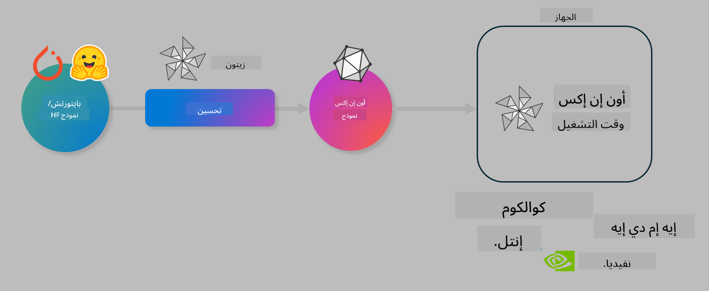

<!--
CO_OP_TRANSLATOR_METADATA:
{
  "original_hash": "6bbe47de3b974df7eea29dfeccf6032b",
  "translation_date": "2025-05-07T10:34:20+00:00",
  "source_file": "md/03.FineTuning/olive-lab/readme.md",
  "language_code": "ar"
}
-->
# مختبر. تحسين نماذج الذكاء الاصطناعي للاستدلال على الجهاز

## المقدمة

> [!IMPORTANT]
> يتطلب هذا المختبر وجود **بطاقة رسومات Nvidia A10 أو A100** مع برامج التشغيل وأدوات CUDA (الإصدار 12+) مثبتة.

> [!NOTE]
> هذا مختبر مدته **35 دقيقة** يقدم لك مقدمة عملية حول المفاهيم الأساسية لتحسين النماذج للاستدلال على الجهاز باستخدام OLIVE.

## أهداف التعلم

بنهاية هذا المختبر، ستكون قادرًا على استخدام OLIVE لـ:

- تقليل دقة نموذج الذكاء الاصطناعي باستخدام طريقة تقليل الدقة AWQ.
- ضبط نموذج الذكاء الاصطناعي لمهمة محددة.
- إنشاء محولات LoRA (نموذج مضبوط) لاستدلال فعال على الجهاز باستخدام ONNX Runtime.

### ما هو Olive

Olive (*O*NNX *live*) هو مجموعة أدوات لتحسين النماذج مع واجهة أوامر مصاحبة تمكنك من نشر النماذج على ONNX runtime +++https://onnxruntime.ai+++ بجودة وأداء عاليين.



عادةً ما يكون الإدخال إلى Olive نموذج PyTorch أو Hugging Face، والمخرج هو نموذج ONNX محسن يتم تشغيله على جهاز (هدف النشر) يعمل ببيئة ONNX runtime. يقوم Olive بتحسين النموذج لمسرّع الذكاء الاصطناعي الخاص بهدف النشر (NPU، GPU، CPU) المزود من شركة تصنيع مثل Qualcomm أو AMD أو Nvidia أو Intel.

يقوم Olive بتنفيذ *سير عمل*، وهو تسلسل مرتب من مهام تحسين النموذج الفردية تسمى *المراحل* - تشمل أمثلة المراحل: ضغط النموذج، التقاط الرسم البياني، تقليل الدقة، تحسين الرسم البياني. لكل مرحلة مجموعة من المعلمات التي يمكن ضبطها لتحقيق أفضل مؤشرات، مثل الدقة والكمون، التي يتم تقييمها بواسطة المقيم المختص. يستخدم Olive استراتيجية بحث تعتمد على خوارزمية بحث لضبط كل مرحلة تلقائيًا واحدة تلو الأخرى أو مجموعة من المراحل معًا.

#### فوائد Olive

- **تقليل الإحباط والوقت** في التجارب اليدوية المتكررة مع تقنيات مختلفة لتحسين الرسم البياني، الضغط وتقليل الدقة. حدد قيود الجودة والأداء ودع Olive يجد أفضل نموذج تلقائيًا.
- **أكثر من 40 مكونًا مدمجًا لتحسين النماذج** تغطي أحدث التقنيات في تقليل الدقة، الضغط، تحسين الرسم البياني وضبط النماذج.
- **واجهة أوامر سهلة الاستخدام** لمهام تحسين النماذج الشائعة. مثل: olive quantize، olive auto-opt، olive finetune.
- تغليف النموذج والنشر مدمجان.
- يدعم إنشاء نماذج لـ **خدمة Multi LoRA**.
- بناء سير العمل باستخدام YAML/JSON لتنظيم مهام تحسين النماذج والنشر.
- تكامل مع **Hugging Face** و **Azure AI**.
- آلية **تخزين مؤقت** مدمجة لـ **توفير التكاليف**.

## تعليمات المختبر
> [!NOTE]
> يرجى التأكد من إعداد Azure AI Hub والمشروع الخاص بك وتكوين حساب A100 كما في المختبر 1.

### الخطوة 0: الاتصال بحساب Azure AI Compute الخاص بك

ستتصل بحساب Azure AI compute باستخدام ميزة الاتصال عن بُعد في **VS Code.**

1. افتح تطبيق **VS Code** على سطح المكتب:
1. افتح **لوحة الأوامر** باستخدام **Shift+Ctrl+P**
1. في لوحة الأوامر ابحث عن **AzureML - remote: Connect to compute instance in New Window**.
1. اتبع التعليمات الظاهرة على الشاشة للاتصال بالحساب. سيتضمن ذلك اختيار اشتراك Azure، مجموعة الموارد، المشروع واسم الحساب الذي أعددته في المختبر 1.
1. بمجرد الاتصال بعقدة Azure ML Compute الخاصة بك، ستظهر في **أسفل يسار نافذة Visual Code** `><Azure ML: Compute Name`

### الخطوة 1: استنساخ هذا المستودع

في VS Code، يمكنك فتح نافذة طرفية جديدة باستخدام **Ctrl+J** واستنساخ هذا المستودع:

في الطرفية سترى الموجه

```
azureuser@computername:~/cloudfiles/code$ 
```
استنساخ الحل

```bash
cd ~/localfiles
git clone https://github.com/microsoft/phi-3cookbook.git
```

### الخطوة 2: فتح المجلد في VS Code

لفتح VS Code في المجلد المناسب نفذ الأمر التالي في الطرفية، مما سيفتح نافذة جديدة:

```bash
code phi-3cookbook/code/04.Finetuning/Olive-lab
```

بدلاً من ذلك، يمكنك فتح المجلد عن طريق اختيار **ملف** > **فتح مجلد**.

### الخطوة 3: التبعيات

افتح نافذة طرفية في VS Code على حساب Azure AI Compute الخاص بك (نصيحة: **Ctrl+J**) ونفذ الأوامر التالية لتثبيت التبعيات:

```bash
conda create -n olive-ai python=3.11 -y
conda activate olive-ai
pip install -r requirements.txt
az extension remove -n azure-cli-ml
az extension add -n ml
```

> [!NOTE]
> ستستغرق عملية تثبيت جميع التبعيات حوالي 5 دقائق.

في هذا المختبر، ستقوم بتنزيل ورفع النماذج إلى كتالوج نماذج Azure AI. للوصول إلى الكتالوج، ستحتاج إلى تسجيل الدخول إلى Azure باستخدام:

```bash
az login
```

> [!NOTE]
> عند تسجيل الدخول، سيُطلب منك اختيار الاشتراك. تأكد من تعيين الاشتراك إلى الاشتراك المخصص لهذا المختبر.

### الخطوة 4: تنفيذ أوامر Olive

افتح نافذة طرفية في VS Code على حساب Azure AI Compute الخاص بك (نصيحة: **Ctrl+J**) وتأكد من تفعيل بيئة conda المسماة `olive-ai`:

```bash
conda activate olive-ai
```

بعد ذلك، نفذ أوامر Olive التالية في سطر الأوامر.

1. **تفقد البيانات:** في هذا المثال، ستقوم بضبط نموذج Phi-3.5-Mini ليكون متخصصًا في الإجابة على أسئلة متعلقة بالسفر. يعرض الكود أدناه السجلات الأولى من مجموعة البيانات، والتي تكون بصيغة JSON lines:

    ```bash
    head data/data_sample_travel.jsonl
    ```
1. **تقليل دقة النموذج:** قبل تدريب النموذج، تقوم أولاً بتقليل دقته باستخدام الأمر التالي الذي يستخدم تقنية تسمى Active Aware Quantization (AWQ) +++https://arxiv.org/abs/2306.00978+++. تقوم AWQ بتقليل دقة أوزان النموذج مع الأخذ في الاعتبار التنشيطات الناتجة أثناء الاستدلال. هذا يعني أن عملية تقليل الدقة تأخذ في الحسبان توزيع البيانات الفعلي في التنشيطات، مما يؤدي إلى الحفاظ بشكل أفضل على دقة النموذج مقارنة بطرق تقليل دقة الأوزان التقليدية.

    ```bash
    olive quantize \
       --model_name_or_path microsoft/Phi-3.5-mini-instruct \
       --trust_remote_code \
       --algorithm awq \
       --output_path models/phi/awq \
       --log_level 1
    ```

    تستغرق عملية تقليل دقة AWQ حوالي **8 دقائق**، مما سيؤدي إلى **تقليل حجم النموذج من ~7.5 جيجابايت إلى ~2.5 جيجابايت**.

    في هذا المختبر، نعرض لك كيفية إدخال النماذج من Hugging Face (على سبيل المثال: `microsoft/Phi-3.5-mini-instruct`). However, Olive also allows you to input models from the Azure AI catalog by updating the `model_name_or_path` argument to an Azure AI asset ID (for example:  `azureml://registries/azureml/models/Phi-3.5-mini-instruct/versions/4`). 

1. **Train the model:** Next, the `olive finetune` يقوم الأمر بضبط النموذج بعد تقليل الدقة. تقليل الدقة *قبل* الضبط يعطي دقة أفضل لأن عملية الضبط تستعيد جزءًا من الخسارة الناتجة عن تقليل الدقة.

    ```bash
    olive finetune \
        --method lora \
        --model_name_or_path models/phi/awq \
        --data_files "data/data_sample_travel.jsonl" \
        --data_name "json" \
        --text_template "<|user|>\n{prompt}<|end|>\n<|assistant|>\n{response}<|end|>" \
        --max_steps 100 \
        --output_path ./models/phi/ft \
        --log_level 1
    ```

    تستغرق عملية الضبط حوالي **6 دقائق** (مع 100 خطوة).

1. **التحسين:** بعد تدريب النموذج، تقوم الآن بتحسينه باستخدام أوامر Olive مع الوسائط `auto-opt` command, which will capture the ONNX graph and automatically perform a number of optimizations to improve the model performance for CPU by compressing the model and doing fusions. It should be noted, that you can also optimize for other devices such as NPU or GPU by just updating the `--device` and `--provider` - ولكن لأغراض هذا المختبر سنستخدم CPU.

    ```bash
    olive auto-opt \
       --model_name_or_path models/phi/ft/model \
       --adapter_path models/phi/ft/adapter \
       --device cpu \
       --provider CPUExecutionProvider \
       --use_ort_genai \
       --output_path models/phi/onnx-ao \
       --log_level 1
    ```

    تستغرق عملية التحسين حوالي **5 دقائق**.

### الخطوة 5: اختبار استدلال سريع للنموذج

لاختبار استدلال النموذج، أنشئ ملف Python في مجلدك باسم **app.py** ونسخ وألصق الكود التالي:

```python
import onnxruntime_genai as og
import numpy as np

print("loading model and adapters...", end="", flush=True)
model = og.Model("models/phi/onnx-ao/model")
adapters = og.Adapters(model)
adapters.load("models/phi/onnx-ao/model/adapter_weights.onnx_adapter", "travel")
print("DONE!")

tokenizer = og.Tokenizer(model)
tokenizer_stream = tokenizer.create_stream()

params = og.GeneratorParams(model)
params.set_search_options(max_length=100, past_present_share_buffer=False)
user_input = "what is the best thing to see in chicago"
params.input_ids = tokenizer.encode(f"<|user|>\n{user_input}<|end|>\n<|assistant|>\n")

generator = og.Generator(model, params)

generator.set_active_adapter(adapters, "travel")

print(f"{user_input}")

while not generator.is_done():
    generator.compute_logits()
    generator.generate_next_token()

    new_token = generator.get_next_tokens()[0]
    print(tokenizer_stream.decode(new_token), end='', flush=True)

print("\n")
```

نفذ الكود باستخدام:

```bash
python app.py
```

### الخطوة 6: رفع النموذج إلى Azure AI

رفع النموذج إلى مستودع نماذج Azure AI يجعل النموذج قابلًا للمشاركة مع أعضاء فريق التطوير الآخرين كما يدير التحكم في الإصدارات للنموذج. لرفع النموذج، نفذ الأمر التالي:

> [!NOTE]
> حدّث قيم `{}` في `resourceGroup` واسم مشروع Azure AI، ثم نفذ الأمر التالي

```
az ml workspace show
```

أو عبر الذهاب إلى +++ai.azure.com+++ واختيار **مركز الإدارة** > **المشروع** > **نظرة عامة**

قم بتحديث القيم `{}` بأسماء مجموعة الموارد واسم مشروع Azure AI الخاص بك.

```bash
az ml model create \
    --name ft-for-travel \
    --version 1 \
    --path ./models/phi/onnx-ao \
    --resource-group {RESOURCE_GROUP_NAME} \
    --workspace-name {PROJECT_NAME}
```

يمكنك بعدها رؤية النموذج المرفوع ونشره على https://ml.azure.com/model/list

**تنويه**:  
تمت ترجمة هذا المستند باستخدام خدمة الترجمة الآلية [Co-op Translator](https://github.com/Azure/co-op-translator). بينما نسعى لتحقيق الدقة، يرجى العلم أن الترجمات الآلية قد تحتوي على أخطاء أو عدم دقة. يجب اعتبار المستند الأصلي بلغته الأصلية المصدر الرسمي والمعتمد. بالنسبة للمعلومات الهامة، يُنصح بالاعتماد على الترجمة الاحترافية التي يقوم بها البشر. نحن غير مسؤولين عن أي سوء فهم أو تفسير ناتج عن استخدام هذه الترجمة.