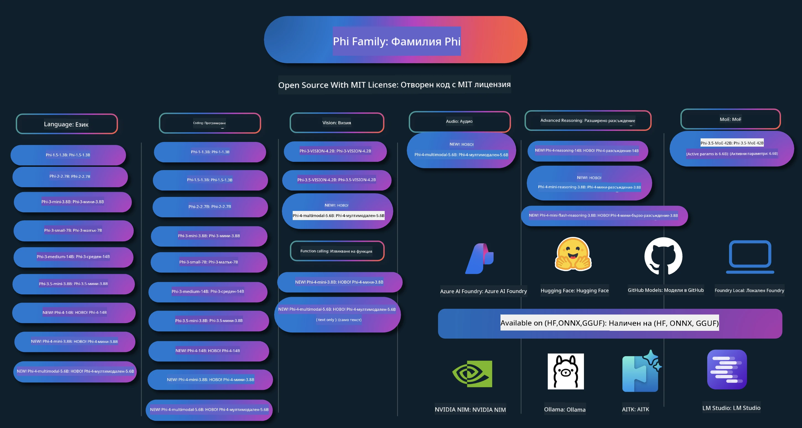

# Phi Cookbook: Практически примери с Phi моделите на Microsoft

[](https://codespaces.new/microsoft/phicookbook)
[](https://vscode.dev/redirect?url=vscode://ms-vscode-remote.remote-containers/cloneInVolume?url=https://github.com/microsoft/phicookbook)

[](https://GitHub.com/microsoft/phicookbook/graphs/contributors/?WT.mc_id=aiml-137032-kinfeylo)
[](https://GitHub.com/microsoft/phicookbook/issues/?WT.mc_id=aiml-137032-kinfeylo)
[](https://GitHub.com/microsoft/phicookbook/pulls/?WT.mc_id=aiml-137032-kinfeylo)
[](http://makeapullrequest.com?WT.mc_id=aiml-137032-kinfeylo)

[](https://GitHub.com/microsoft/phicookbook/watchers/?WT.mc_id=aiml-137032-kinfeylo)
[](https://GitHub.com/microsoft/phicookbook/network/?WT.mc_id=aiml-137032-kinfeylo)
[](https://GitHub.com/microsoft/phicookbook/stargazers/?WT.mc_id=aiml-137032-kinfeylo)

[](https://discord.com/invite/ByRwuEEgH4)

Phi е серия от източници на изкуствен интелект с отворен код, разработени от Microsoft.

В момента Phi е най-мощният и икономичен малък езиков модел (SLM), с много добри показатели в многоезична поддръжка, разсъждения, генериране на текст/чат, кодиране, изображения, аудио и други сценарии.

Можете да разположите Phi в облака или на крайни устройства и лесно да изградите генеративни AI приложения с ограничена изчислителна мощност.

Следвайте тези стъпки, за да започнете да използвате тези ресурси:
1. **Форквайте хранилището**: Кликнете [](https://GitHub.com/microsoft/phicookbook/network/?WT.mc_id=aiml-137032-kinfeylo)
2. **Клонирайте хранилището**: `git clone https://github.com/microsoft/PhiCookBook.git`
3. [**Присъединете се към общността Microsoft AI в Discord и срещнете експерти и други разработчици**](https://discord.com/invite/ByRwuEEgH4?WT.mc_id=aiml-137032-kinfeylo)



### 🌐 Многоезична поддръжка

#### Поддържа се чрез GitHub Action (Автоматично и винаги актуализирано)

<!-- CO-OP TRANSLATOR LANGUAGES TABLE START -->
[Арабски](../ar/README.md) | [Бенгалски](../bn/README.md) | [Български](./README.md) | [Бирмански (Мианмар)](../my/README.md) | [Китайски (опростен)](../zh-CN/README.md) | [Китайски (традиционен, Хонконг)](../zh-HK/README.md) | [Китайски (традиционен, Макао)](../zh-MO/README.md) | [Китайски (традиционен, Тайван)](../zh-TW/README.md) | [Хърватски](../hr/README.md) | [Чешки](../cs/README.md) | [Датски](../da/README.md) | [Холандски](../nl/README.md) | [Естонски](../et/README.md) | [Фински](../fi/README.md) | [Френски](../fr/README.md) | [Немски](../de/README.md) | [Гръцки](../el/README.md) | [Иврит](../he/README.md) | [Хинди](../hi/README.md) | [Унгарски](../hu/README.md) | [Индонезийски](../id/README.md) | [Италиански](../it/README.md) | [Японски](../ja/README.md) | [Каннада](../kn/README.md) | [Корейски](../ko/README.md) | [Литовски](../lt/README.md) | [Малайски](../ms/README.md) | [Малаялам](../ml/README.md) | [Марати](../mr/README.md) | [Непали](../ne/README.md) | [Нигерийски пиджин](../pcm/README.md) | [Норвежки](../no/README.md) | [Персийски (фарси)](../fa/README.md) | [Полски](../pl/README.md) | [Португалски (Бразилия)](../pt-BR/README.md) | [Португалски (Португалия)](../pt-PT/README.md) | [Пенджабски (Гурмуки)](../pa/README.md) | [Румънски](../ro/README.md) | [Руски](../ru/README.md) | [Сръбски (кирилица)](../sr/README.md) | [Словашки](../sk/README.md) | [Словенски](../sl/README.md) | [Испански](../es/README.md) | [Суахили](../sw/README.md) | [Шведски](../sv/README.md) | [Тагалог (филипински)](../tl/README.md) | [Тамилски](../ta/README.md) | [Телугу](../te/README.md) | [Тайски](../th/README.md) | [Турски](../tr/README.md) | [Украински](../uk/README.md) | [Урду](../ur/README.md) | [Виетнамски](../vi/README.md)

> **Предпочитате да клонирате локално?**

> Това хранилище включва 50+ езикови превода, което значително увеличава размера на изтеглянето. За да клонирате без преводи, използвайте sparse checkout:
> ```bash
> git clone --filter=blob:none --sparse https://github.com/microsoft/PhiCookBook.git
> cd PhiCookBook
> git sparse-checkout set --no-cone '/*' '!translations' '!translated_images'
> ```
> Това ви дава всичко необходимо за завършване на курса с много по-бързо изтегляне.
<!-- CO-OP TRANSLATOR LANGUAGES TABLE END -->

## Съдържание

- Въведение
  - [Добре дошли в семейството Phi](./md/01.Introduction/01/01.PhiFamily.md)
  - [Настройване на вашата среда](./md/01.Introduction/01/01.EnvironmentSetup.md)
  - [Разбиране на ключовите технологии](./md/01.Introduction/01/01.Understandingtech.md)
  - [Сигурност в ИИ за Phi моделите](./md/01.Introduction/01/01.AISafety.md)
  - [Поддръжка на хардуера Phi](./md/01.Introduction/01/01.Hardwaresupport.md)
  - [Phi модели и наличност на различни платформи](./md/01.Introduction/01/01.Edgeandcloud.md)
  - [Използване на Guidance-ai и Phi](./md/01.Introduction/01/01.Guidance.md)
  - [Модели от GitHub Marketplace](https://github.com/marketplace/models)
  - [Каталог с модели Azure AI](https://ai.azure.com)

- Извеждане на Phi в различна среда
    -  [Hugging face](./md/01.Introduction/02/01.HF.md)
    -  [GitHub модели](./md/01.Introduction/02/02.GitHubModel.md)
    -  [Каталог с модели Azure AI Foundry](./md/01.Introduction/02/03.AzureAIFoundry.md)
    -  [Ollama](./md/01.Introduction/02/04.Ollama.md)
    -  [AI Toolkit VSCode (AITK)](./md/01.Introduction/02/05.AITK.md)
    -  [NVIDIA NIM](./md/01.Introduction/02/06.NVIDIA.md)
    -  [Foundry Local](./md/01.Introduction/02/07.FoundryLocal.md)

- Извеждане на Phi Family
    - [Извеждане на Phi в iOS](./md/01.Introduction/03/iOS_Inference.md)
    - [Извеждане на Phi в Android](./md/01.Introduction/03/Android_Inference.md)
    - [Извеждане на Phi в Jetson](./md/01.Introduction/03/Jetson_Inference.md)
    - [Извеждане на Phi в AI PC](./md/01.Introduction/03/AIPC_Inference.md)
    - [Извеждане на Phi с Apple MLX Framework](./md/01.Introduction/03/MLX_Inference.md)
    - [Извеждане на Phi на локален сървър](./md/01.Introduction/03/Local_Server_Inference.md)
    - [Извеждане на Phi в отдалечен сървър с помощта на AI Toolkit](./md/01.Introduction/03/Remote_Interence.md)
    - [Извеждане на Phi с Rust](./md/01.Introduction/03/Rust_Inference.md)
    - [Извеждане на Phi – Vision локално](./md/01.Introduction/03/Vision_Inference.md)
    - [Извеждане на Phi с Kaito AKS, Azure Containers (официална поддръжка)](./md/01.Introduction/03/Kaito_Inference.md)
-  [Квантизиране на Phi Family](./md/01.Introduction/04/QuantifyingPhi.md)
    - [Квантизиране на Phi-3.5 / 4 с llama.cpp](./md/01.Introduction/04/UsingLlamacppQuantifyingPhi.md)
    - [Квантизиране на Phi-3.5 / 4 с разширения за генеративен AI за onnxruntime](./md/01.Introduction/04/UsingORTGenAIQuantifyingPhi.md)
    - [Квантизиране на Phi-3.5 / 4 с Intel OpenVINO](./md/01.Introduction/04/UsingIntelOpenVINOQuantifyingPhi.md)
    - [Квантизиране на Phi-3.5 / 4 с Apple MLX Framework](./md/01.Introduction/04/UsingAppleMLXQuantifyingPhi.md)

-  Оценка на Phi
    - [Отговорен AI](./md/01.Introduction/05/ResponsibleAI.md)
    - [Azure AI Foundry за оценка](./md/01.Introduction/05/AIFoundry.md)
    - [Използване на Promptflow за оценка](./md/01.Introduction/05/Promptflow.md)
 
- RAG с Azure AI Search
    - [Как да използвате Phi-4-mini и Phi-4-мултимодален (RAG) с Azure AI Search](https://github.com/microsoft/PhiCookBook/blob/main/code/06.E2E/E2E_Phi-4-RAG-Azure-AI-Search.ipynb)

- Примери за разработка на Phi приложения
  - Текстови и чат приложения
    - Примери с Phi-4 🆕
      - [📓] [Чат с Phi-4-mini ONNX модел](./md/02.Application/01.TextAndChat/Phi4/ChatWithPhi4ONNX/README.md)
      - [Чат с локален ONNX модел Phi-4 .NET](../../md/04.HOL/dotnet/src/LabsPhi4-Chat-01OnnxRuntime)
      - [Конзолно .NET приложение за чат с Phi-4 ONNX използвайки Semantic Kernel](../../md/04.HOL/dotnet/src/LabsPhi4-Chat-02SK)
    - Примери с Phi-3 / 3.5
      - [Локален чатбот в браузъра с Phi3, ONNX Runtime Web и WebGPU](https://github.com/microsoft/onnxruntime-inference-examples/tree/main/js/chat)
      - [OpenVino Chat](./md/02.Application/01.TextAndChat/Phi3/E2E_OpenVino_Chat.md)
      - [Мулти модел - Интерактивен Phi-3-mini и OpenAI Whisper](./md/02.Application/01.TextAndChat/Phi3/E2E_Phi-3-mini_with_whisper.md)
      - [MLFlow - Създаване на обвивка и използване на Phi-3 с MLFlow](./md//02.Application/01.TextAndChat/Phi3/E2E_Phi-3-MLflow.md)
      - [Оптимизация на модел - Как да оптимизирате модела Phi-3-min за ONNX Runtime Web с Olive](https://github.com/microsoft/Olive/tree/main/examples/phi3)
      - [WinUI3 приложение с Phi-3 mini-4k-instruct-onnx](https://github.com/microsoft/Phi3-Chat-WinUI3-Sample/)
      -[WinUI3 Multi Model AI захранено приложение за бележки пример](https://github.com/microsoft/ai-powered-notes-winui3-sample)
      - [Фина настройка и интеграция на персонализирани модели Phi-3 с Prompt flow](./md/02.Application/01.TextAndChat/Phi3/E2E_Phi-3-FineTuning_PromptFlow_Integration.md)
      - [Фина настройка и интеграция на персонализирани модели Phi-3 с Prompt flow в Azure AI Foundry](./md/02.Application/01.TextAndChat/Phi3/E2E_Phi-3-FineTuning_PromptFlow_Integration_AIFoundry.md)
      - [Оценка на фино настроения модел Phi-3 / Phi-3.5 в Azure AI Foundry с фокус върху принципите на отговорен AI на Microsoft](./md/02.Application/01.TextAndChat/Phi3/E2E_Phi-3-Evaluation_AIFoundry.md)
      - [📓] [Пример за езикова прогноза Phi-3.5-mini-instruct (китайски/английски)](./md/02.Application/01.TextAndChat/Phi3/phi3-instruct-demo.ipynb)
      - [Phi-3.5-Instruct WebGPU RAG чатбот](./md/02.Application/01.TextAndChat/Phi3/WebGPUWithPhi35Readme.md)
      - [Използване на Windows GPU за създаване на решение с Prompt flow с Phi-3.5-Instruct ONNX](./md/02.Application/01.TextAndChat/Phi3/UsingPromptFlowWithONNX.md)
      - [Използване на Microsoft Phi-3.5 tflite за създаване на Android приложение](./md/02.Application/01.TextAndChat/Phi3/UsingPhi35TFLiteCreateAndroidApp.md)
      - [Q&A .NET пример с локален ONNX Phi-3 модел, използващ Microsoft.ML.OnnxRuntime](../../md/04.HOL/dotnet/src/LabsPhi301)
      - [Конзолно чат .NET приложение с Semantic Kernel и Phi-3](../../md/04.HOL/dotnet/src/LabsPhi302)

  - Azure AI Inference SDK Примери на код
    - Примери Phi-4 🆕
      - [📓] [Генериране на код на проект с използване на Phi-4-multimodal](./md/02.Application/02.Code/Phi4/GenProjectCode/README.md)
    - Примери Phi-3 / 3.5
      - [Създайте собствен Visual Studio Code GitHub Copilot Chat с Microsoft Phi-3 Family](./md/02.Application/02.Code/Phi3/VSCodeExt/README.md)
      - [Създайте собствен Visual Studio Code Chat Copilot агент с Phi-3.5 чрез GitHub модели](/md/02.Application/02.Code/Phi3/CreateVSCodeChatAgentWithGitHubModels.md)

  - Примери за разширено разсъждение
    - Примери Phi-4 🆕
      - [📓] [Примери Phi-4-mini-reasoning или Phi-4-reasoning](./md/02.Application/03.AdvancedReasoning/Phi4/AdvancedResoningPhi4mini/README.md)
      - [📓] [Фина настройка на Phi-4-mini-reasoning с Microsoft Olive](./md/02.Application/03.AdvancedReasoning/Phi4/AdvancedResoningPhi4mini/olive_ft_phi_4_reasoning_with_medicaldata.ipynb)
      - [📓] [Фина настройка на Phi-4-mini-reasoning с Apple MLX](./md/02.Application/03.AdvancedReasoning/Phi4/AdvancedResoningPhi4mini/mlx_ft_phi_4_reasoning_with_medicaldata.ipynb)
      - [📓] [Phi-4-mini-reasoning с GitHub модели](./md/02.Application/02.Code/Phi4r/github_models_inference.ipynb)
      - [📓] [Phi-4-mini-reasoning с Azure AI Foundry модели](./md/02.Application/02.Code/Phi4r/azure_models_inference.ipynb)
  - Демонстрации
      - [Демо на Phi-4-mini, хоствани на Hugging Face Spaces](https://huggingface.co/spaces/microsoft/phi-4-mini?WT.mc_id=aiml-137032-kinfeylo)
      - [Демо на Phi-4-multimodal, хоствани на Hugginge Face Spaces](https://huggingface.co/spaces/microsoft/phi-4-multimodal?WT.mc_id=aiml-137032-kinfeylo)
  - Примери виждане
    - Примери Phi-4 🆕
      - [📓] [Използване на Phi-4-multimodal за четене на изображения и генериране на код](./md/02.Application/04.Vision/Phi4/CreateFrontend/README.md) 
    - Примери Phi-3 / 3.5
      -  [📓][Phi-3-визия: преобразуване на текст в изображение към текст](./md/02.Application/04.Vision/Phi3/E2E_Phi-3-vision-image-text-to-text-online-endpoint.ipynb)
      - [Phi-3-визия-ONNX](https://onnxruntime.ai/docs/genai/tutorials/phi3-v.html)
      - [📓][Phi-3-визия CLIP embedding](./md/02.Application/04.Vision/Phi3/E2E_Phi-3-vision-image-text-to-text-online-endpoint.ipynb)
      - [ДЕМО: Phi-3 рециклиране](https://github.com/jennifermarsman/PhiRecycling/)
      - [Phi-3-визия - Визуален езиков асистент - с Phi3-Vision и OpenVINO](https://docs.openvino.ai/nightly/notebooks/phi-3-vision-with-output.html)
      - [Phi-3 Виждане Nvidia NIM](./md/02.Application/04.Vision/Phi3/E2E_Nvidia_NIM_Vision.md)
      - [Phi-3 Виждане OpenVino](./md/02.Application/04.Vision/Phi3/E2E_OpenVino_Phi3Vision.md)
      - [📓][Phi-3.5 Виждане многокадров пример или многоизображен пример](./md/02.Application/04.Vision/Phi3/phi3-vision-demo.ipynb)
      - [Phi-3 Виждане локален ONNX модел с Microsoft.ML.OnnxRuntime .NET](../../md/04.HOL/dotnet/src/LabsPhi303)
      - [Меню базиран Phi-3 Виждане локален ONNX модел с Microsoft.ML.OnnxRuntime .NET](../../md/04.HOL/dotnet/src/LabsPhi304)

  - Примери по математика
    -  Phi-4-Mini-Flash-Reasoning-Instruct примери 🆕 [Математическо демо с Phi-4-Mini-Flash-Reasoning-Instruct](./md/02.Application/09.Math/MathDemo.ipynb)

  - Примери по аудио
    - Примери Phi-4 🆕
      - [📓] [Извличане на аудио транскрипции с Phi-4-multimodal](./md/02.Application/05.Audio/Phi4/Transciption/README.md)
      - [📓] [Демо с Phi-4-multimodal аудио](./md/02.Application/05.Audio/Phi4/Siri/demo.ipynb)
      - [📓] [Пример за речев превод с Phi-4-multimodal](./md/02.Application/05.Audio/Phi4/Translate/demo.ipynb)
      - [.NET конзолно приложение използващо Phi-4-multimodal аудио за анализ на аудио файл и генериране на транскрипция](../../md/04.HOL/dotnet/src/LabsPhi4-MultiModal-02Audio)

  - Примери MOE
    - Примери Phi-3 / 3.5
      - [📓] [Пример с Phi-3.5 Mixture of Experts Models (MoEs) за социални медии](./md/02.Application/06.MoE/Phi3/phi3_moe_demo.ipynb)
      - [📓] [Изграждане на Retrieval-Augmented Generation (RAG) Pipeline с NVIDIA NIM Phi-3 MOE, Azure AI Search и LlamaIndex](./md/02.Application/06.MoE/Phi3/azure-ai-search-nvidia-rag.ipynb)
      - 
  - Примери за повикване на функции
    - Примери Phi-4 🆕
      -  [📓] [Използване на повикване на функции с Phi-4-mini](./md/02.Application/07.FunctionCalling/Phi4/FunctionCallingBasic/README.md)
      -  [📓] [Използване на повикване на функции за създаване на мулти-агенти с Phi-4-mini](./md/02.Application/07.FunctionCalling/Phi4/Multiagents/Phi_4_mini_multiagent.ipynb)
      -  [📓] [Използване на повикване на функции с Ollama](./md/02.Application/07.FunctionCalling/Phi4/Ollama/ollama_functioncalling.ipynb)
      -  [📓] [Използване на повикване на функции с ONNX](./md/02.Application/07.FunctionCalling/Phi4/ONNX/onnx_parallel_functioncalling.ipynb)
  - Примери с мултимодално смесване
    - Примери Phi-4 🆕
      -  [📓] [Използване на Phi-4-multimodal като технологичен журналист](./md/02.Application/08.Multimodel/Phi4/TechJournalist/phi_4_mm_audio_text_publish_news.ipynb)
      - [.NET конзолно приложение използващо Phi-4-multimodal за анализ на изображения](../../md/04.HOL/dotnet/src/LabsPhi4-MultiModal-01Images)

- Фина настройка на Phi примери
  - [Сценарии за фина настройка](./md/03.FineTuning/FineTuning_Scenarios.md)
  - [Фина настройка срещу RAG](./md/03.FineTuning/FineTuning_vs_RAG.md)
  - [Фина настройка: Нека Phi-3 стане индустриален експерт](./md/03.FineTuning/LetPhi3gotoIndustriy.md)
  - [Фина настройка на Phi-3 с AI Toolkit за VS Code](./md/03.FineTuning/Finetuning_VSCodeaitoolkit.md)
  - [Фина настройка на Phi-3 с Azure Machine Learning Service](./md/03.FineTuning/Introduce_AzureML.md)
  - [Фина настройка на Phi-3 с Lora](./md/03.FineTuning/FineTuning_Lora.md)
  - [Фина настройка на Phi-3 с QLora](./md/03.FineTuning/FineTuning_Qlora.md)
  - [Фина настройка на Phi-3 с Azure AI Foundry](./md/03.FineTuning/FineTuning_AIFoundry.md)
  - [Фина настройка на Phi-3 с Azure ML CLI/SDK](./md/03.FineTuning/FineTuning_MLSDK.md)
  - [Фина настройка с Microsoft Olive](./md/03.FineTuning/FineTuning_MicrosoftOlive.md)
  - [Фина настройка с Microsoft Olive Hands-On Lab](./md/03.FineTuning/olive-lab/readme.md)
  - [Фина настройка на Phi-3-vision с Weights and Bias](./md/03.FineTuning/FineTuning_Phi-3-visionWandB.md)
  - [Фина настройка на Phi-3 с Apple MLX Framework](./md/03.FineTuning/FineTuning_MLX.md)
  - [Фина настройка на Phi-3-vision (официална поддръжка)](./md/03.FineTuning/FineTuning_Vision.md)
  - [Фина настройка на Phi-3 с Kaito AKS , Azure Containers (официална поддръжка)](./md/03.FineTuning/FineTuning_Kaito.md)
  - [Фина настройка на Phi-3 и 3.5 Виждане](https://github.com/2U1/Phi3-Vision-Finetune)

- Hands on Lab
  - [Изследване на най-новите модели: LLMs, SLMs, локална разработка и други](https://github.com/microsoft/aitour-exploring-cutting-edge-models)
  - [Отключване на потенциала на NLP: Фина настройка с Microsoft Olive](https://github.com/azure/Ignite_FineTuning_workshop)

- Академични изследователски трудове и публикации
  - [Учебниците са всичко, от което се нуждаете II: технически доклад phi-1.5](https://arxiv.org/abs/2309.05463)
  - [Технически доклад Phi-3: Високоефективен езиков модел локално на вашия телефон](https://arxiv.org/abs/2404.14219)
  - [Технически доклад Phi-4](https://arxiv.org/abs/2412.08905)
  - [Технически доклад Phi-4-Mini: Компактни, но мощни мултимодални езикови модели чрез смесване на LoRA](https://arxiv.org/abs/2503.01743)
  - [Оптимизиране на малки езикови модели за извикване на функции в превозни средства](https://arxiv.org/abs/2501.02342)
  - [(WhyPHI) Финна настройка на PHI-3 за отговаряне на въпроси с избор от няколко възможности: Методология, резултати и предизвикателства](https://arxiv.org/abs/2501.01588)
  - [Технически доклад Phi-4- reasoning](https://www.microsoft.com/en-us/research/wp-content/uploads/2025/04/phi_4_reasoning.pdf)
  - [Технически доклад Phi-4-mini-reasoning](https://huggingface.co/microsoft/Phi-4-mini-reasoning/blob/main/Phi-4-Mini-Reasoning.pdf)

## Използване на Phi Модели

### Phi в Azure AI Foundry

Можете да се научите как да използвате Microsoft Phi и как да изграждате завършени решения в различните си хардуерни устройства. За да изпитате Phi лично, започнете като експериментирате с моделите и персонализирате Phi за вашите сценарии, използвайки [Azure AI Foundry Azure AI Model Catalog](https://aka.ms/phi3-azure-ai). Можете да научите повече в Ръководството за започване с [Azure AI Foundry](/md/02.QuickStart/AzureAIFoundry_QuickStart.md)

**Площадка за игра**
Всеки модел има собствено пространство за тестване на модела [Azure AI Playground](https://aka.ms/try-phi3).

### Phi в GitHub Модели

Можете да се научите как да използвате Microsoft Phi и как да изграждате завършени решения в различните си хардуерни устройства. За да изпитате Phi лично, започнете като експериментирате с модела и персонализирате Phi за вашите сценарии, използвайки [GitHub Model Catalog](https://github.com/marketplace/models?WT.mc_id=aiml-137032-kinfeylo). Можете да научите повече в Ръководството за започване с [GitHub Model Catalog](/md/02.QuickStart/GitHubModel_QuickStart.md)

**Площадка за игра**
Всеки модел има собствено [пространство за тестване на модела](/md/02.QuickStart/GitHubModel_QuickStart.md).

### Phi в Hugging Face

Моделът можете да намерите и в [Hugging Face](https://huggingface.co/microsoft)

**Площадка за игра**
[Hugging Chat playground](https://huggingface.co/chat/models/microsoft/Phi-3-mini-4k-instruct)

## 🎒 Други курсове

Нашият екип предлага и други курсове! Вижте:

<!-- CO-OP TRANSLATOR OTHER COURSES START -->
### LangChain
[](https://aka.ms/langchain4j-for-beginners)
[](https://aka.ms/langchainjs-for-beginners?WT.mc_id=m365-94501-dwahlin)
[](https://github.com/microsoft/langchain-for-beginners?WT.mc_id=m365-94501-dwahlin)
---

### Azure / Edge / MCP / Агенти
[](https://github.com/microsoft/AZD-for-beginners?WT.mc_id=academic-105485-koreyst)
[](https://github.com/microsoft/edgeai-for-beginners?WT.mc_id=academic-105485-koreyst)
[](https://github.com/microsoft/mcp-for-beginners?WT.mc_id=academic-105485-koreyst)
[](https://github.com/microsoft/ai-agents-for-beginners?WT.mc_id=academic-105485-koreyst)

---

### Серия за генеративен AI
[](https://github.com/microsoft/generative-ai-for-beginners?WT.mc_id=academic-105485-koreyst)
[-9333EA?style=for-the-badge&labelColor=E5E7EB&color=9333EA)](https://github.com/microsoft/Generative-AI-for-beginners-dotnet?WT.mc_id=academic-105485-koreyst)
[-C084FC?style=for-the-badge&labelColor=E5E7EB&color=C084FC)](https://github.com/microsoft/generative-ai-for-beginners-java?WT.mc_id=academic-105485-koreyst)
[-E879F9?style=for-the-badge&labelColor=E5E7EB&color=E879F9)](https://github.com/microsoft/generative-ai-with-javascript?WT.mc_id=academic-105485-koreyst)

---

### Основно обучение
[](https://aka.ms/ml-beginners?WT.mc_id=academic-105485-koreyst)
[](https://aka.ms/datascience-beginners?WT.mc_id=academic-105485-koreyst)
[](https://aka.ms/ai-beginners?WT.mc_id=academic-105485-koreyst)
[](https://github.com/microsoft/Security-101?WT.mc_id=academic-96948-sayoung)
[](https://aka.ms/webdev-beginners?WT.mc_id=academic-105485-koreyst)
[](https://aka.ms/iot-beginners?WT.mc_id=academic-105485-koreyst)
[](https://github.com/microsoft/xr-development-for-beginners?WT.mc_id=academic-105485-koreyst)

---

### Серия Copilot
[](https://aka.ms/GitHubCopilotAI?WT.mc_id=academic-105485-koreyst)
[](https://github.com/microsoft/mastering-github-copilot-for-dotnet-csharp-developers?WT.mc_id=academic-105485-koreyst)
[](https://github.com/microsoft/CopilotAdventures?WT.mc_id=academic-105485-koreyst)
<!-- CO-OP TRANSLATOR OTHER COURSES END -->

## Отговорен AI 

Microsoft се ангажира да помага на нашите клиенти да използват продуктите ни с изкуствен интелект отговорно, споделяйки наученото и изграждайки партньорства, базирани на доверие, чрез инструменти като бележки за прозрачност и оценки на въздействието. Много от тези ресурси могат да бъдат намерени на [https://aka.ms/RAI](https://aka.ms/RAI). Подходът на Microsoft към отговорния AI е основан на нашите принципи за изкуствен интелект: справедливост, надеждност и безопасност, поверителност и сигурност, приобщаване, прозрачност и отговорност.

Големите модели за естествен език, изображения и реч - като тези, използвани в този пример - потенциално могат да се държат по несправедлив, ненадежден или обиден начин, което може да причини вреди. Моля, консултирайте се с [бележката за прозрачност на услугата Azure OpenAI](https://learn.microsoft.com/legal/cognitive-services/openai/transparency-note?tabs=text), за да получите информация за рисковете и ограниченията.

Препоръчителният подход за смекчаване на тези рискове е да включите безопасна система във вашата архитектура, която може да открива и предотвратява вредно поведение. [Azure AI Content Safety](https://learn.microsoft.com/azure/ai-services/content-safety/overview) предоставя независим слой защита, който може да открива вредно съдържание, създадено от потребители и AI, в приложения и услуги. Azure AI Content Safety включва текстови и образни API-та, които ви позволяват да откривате вреден материал. В рамките на Azure AI Foundry услугата Content Safety ви позволява да разглеждате, изследвате и изпробвате примерен код за откриване на вредно съдържание в различни модалности. Следната [документация за бърз старт](https://learn.microsoft.com/azure/ai-services/content-safety/quickstart-text?tabs=visual-studio%2Clinux&pivots=programming-language-rest) ви води стъпка по стъпка при извършване на заявки към услугата.
Друг аспект, който трябва да се вземе предвид, е общото представяне на приложението. При мултимодални и мултимоделни приложения, считаме представянето за това системата да работи според очакванията на вас и вашите потребители, включително да не генерира вредни изходи. Важно е да оцените представянето на цялото си приложение, използвайки [Performance and Quality and Risk and Safety evaluators](https://learn.microsoft.com/azure/ai-studio/concepts/evaluation-metrics-built-in). Вие също имате възможност да създавате и оценявате с [custom evaluators](https://learn.microsoft.com/azure/ai-studio/how-to/develop/evaluate-sdk#custom-evaluators).

Можете да оцените своето AI приложение в средата за разработка, използвайки [Azure AI Evaluation SDK](https://microsoft.github.io/promptflow/index.html). Даден тестов набор от данни или цел, генерациите на вашето генеративно AI приложение се измерват количествено с вградените или потребителски избрани оценители. За да започнете с azure ai evaluation sdk за оценка на вашата система, можете да следвате [quickstart guide](https://learn.microsoft.com/azure/ai-studio/how-to/develop/flow-evaluate-sdk). След като извършите изпълнение на оценката, можете да [визуализирате резултатите в Azure AI Foundry](https://learn.microsoft.com/azure/ai-studio/how-to/evaluate-flow-results). 

## Търговски марки

Този проект може да съдържа търговски марки или лога на проекти, продукти или услуги. Разрешената употреба на търговски марки или лога на Microsoft е предмет на и трябва да следва [Microsoft's Trademark & Brand Guidelines](https://www.microsoft.com/legal/intellectualproperty/trademarks/usage/general).
Употребата на търговски марки или лога на Microsoft в модифицирани версии на този проект не трябва да предизвиква объркване или да предполага спонсорство от Microsoft. Всяка употреба на търговски марки или лога на трети страни е подчинена на политиките на съответния трети страни.

## Получаване на помощ

Ако се затрудните или имате въпроси за създаване на AI приложения, присъединете се към:

[](https://aka.ms/foundry/discord)

Ако имате обратна връзка за продукта или грешки по време на разработка, посетете:

[](https://aka.ms/foundry/forum)

---

<!-- CO-OP TRANSLATOR DISCLAIMER START -->
**Отказ от отговорност**:  
Този документ е преведен с помощта на AI преводаческа услуга [Co-op Translator](https://github.com/Azure/co-op-translator). Макар да се стремим към точност, моля, имайте предвид, че автоматичните преводи могат да съдържат грешки или неточности. Оригиналният документ на неговия език трябва да се счита за авторитетен източник. За критична информация се препоръчва професионален превод от човешки преводач. Ние не носим отговорност за недоразумения или неправилни тълкувания, произтичащи от използването на този превод.
<!-- CO-OP TRANSLATOR DISCLAIMER END -->