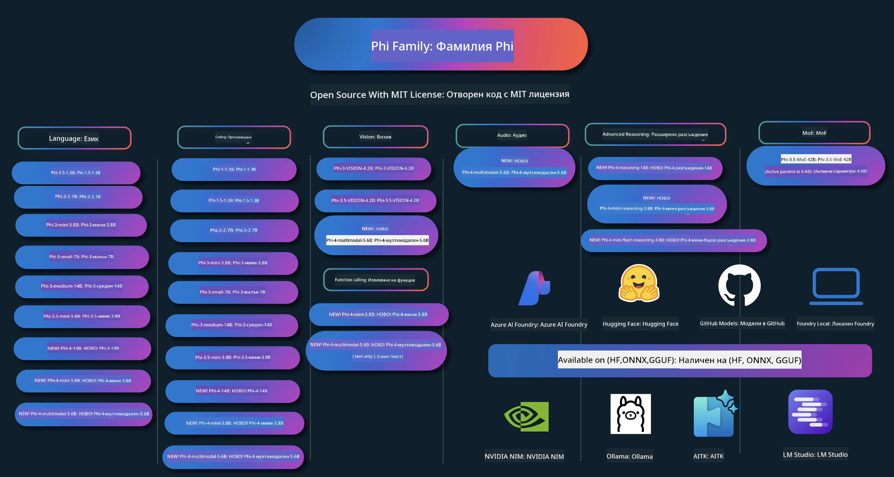

# Phi Cookbook: Практически примери с моделите Phi на Microsoft

[](https://codespaces.new/microsoft/phicookbook)
[](https://vscode.dev/redirect?url=vscode://ms-vscode-remote.remote-containers/cloneInVolume?url=https://github.com/microsoft/phicookbook)

[](https://GitHub.com/microsoft/phicookbook/graphs/contributors/?WT.mc_id=aiml-137032-kinfeylo)
[](https://GitHub.com/microsoft/phicookbook/issues/?WT.mc_id=aiml-137032-kinfeylo)
[](https://GitHub.com/microsoft/phicookbook/pulls/?WT.mc_id=aiml-137032-kinfeylo)
[](http://makeapullrequest.com?WT.mc_id=aiml-137032-kinfeylo)

[](https://GitHub.com/microsoft/phicookbook/watchers/?WT.mc_id=aiml-137032-kinfeylo)
[](https://GitHub.com/microsoft/phicookbook/network/?WT.mc_id=aiml-137032-kinfeylo)
[](https://GitHub.com/microsoft/phicookbook/stargazers/?WT.mc_id=aiml-137032-kinfeylo)

[](https://discord.com/invite/ByRwuEEgH4)

Phi е серия от отворени AI модели, разработени от Microsoft.

Phi в момента е най-мощният и ефективен малък езиков модел (SLM), с много добри показатели в многоезично разбиране, разсъждение, генериране на текст/чат, кодиране, изображения, аудио и други сценарии.

Можете да разположите Phi в облака или на гранични устройства и лесно да създавате генеративни AI приложения с ограничени изчислителни ресурси.

Следвайте тези стъпки, за да започнете да използвате тези ресурси:
1. **Форкнете хранилището**: Кликнете [](https://GitHub.com/microsoft/phicookbook/network/?WT.mc_id=aiml-137032-kinfeylo)
2. **Клонирайте хранилището**: `git clone https://github.com/microsoft/PhiCookBook.git`
3. [**Присъединете се към Microsoft AI Discord общността и се запознайте с експерти и други разработчици**](https://discord.com/invite/ByRwuEEgH4?WT.mc_id=aiml-137032-kinfeylo)



### 🌐 Многоезична поддръжка

#### Поддържа се чрез GitHub Action (Автоматизирано и винаги актуално)

<!-- CO-OP TRANSLATOR LANGUAGES TABLE START -->
[Арабски](../ar/README.md) | [Бенгалски](../bn/README.md) | [Български](./README.md) | [Бирмански (Мианма)](../my/README.md) | [Китайски (опростен)](../zh-CN/README.md) | [Китайски (традиционен, Хонконг)](../zh-HK/README.md) | [Китайски (традиционен, Макао)](../zh-MO/README.md) | [Китайски (традиционен, Тайван)](../zh-TW/README.md) | [Хърватски](../hr/README.md) | [Чешки](../cs/README.md) | [Датски](../da/README.md) | [Холандски](../nl/README.md) | [Естонски](../et/README.md) | [Фински](../fi/README.md) | [Френски](../fr/README.md) | [Немски](../de/README.md) | [Гръцки](../el/README.md) | [Иврит](../he/README.md) | [Хинди](../hi/README.md) | [Унгарски](../hu/README.md) | [Индонезийски](../id/README.md) | [Италиански](../it/README.md) | [Японски](../ja/README.md) | [Каннада](../kn/README.md) | [Корейски](../ko/README.md) | [Литовски](../lt/README.md) | [Малайски](../ms/README.md) | [Малайалам](../ml/README.md) | [Маратхи](../mr/README.md) | [Непалски](../ne/README.md) | [Нигерийски пиджин](../pcm/README.md) | [Норвежки](../no/README.md) | [Персийски (Фарси)](../fa/README.md) | [Полски](../pl/README.md) | [Португалски (Бразилия)](../pt-BR/README.md) | [Португалски (Португалия)](../pt-PT/README.md) | [Панджаби (Гурмуки)](../pa/README.md) | [Румънски](../ro/README.md) | [Руски](../ru/README.md) | [Сръбски (кирилица)](../sr/README.md) | [Словашки](../sk/README.md) | [Словенски](../sl/README.md) | [Испански](../es/README.md) | [Суахили](../sw/README.md) | [Шведски](../sv/README.md) | [Тагалог (филипински)](../tl/README.md) | [Тамилски](../ta/README.md) | [Телугу](../te/README.md) | [Тайски](../th/README.md) | [Турски](../tr/README.md) | [Украински](../uk/README.md) | [Урду](../ur/README.md) | [Виетнамски](../vi/README.md)

> **Предпочитате да клонирате локално?**
>
> Това хранилище включва над 50 езикови превода, което значително увеличава размера за изтегляне. За да клонирате без преводи, използвайте sparse checkout:
>
> **Bash / macOS / Linux:**
> ```bash
> git clone --filter=blob:none --sparse https://github.com/microsoft/PhiCookBook.git
> cd PhiCookBook
> git sparse-checkout set --no-cone '/*' '!translations' '!translated_images'
> ```
>
> **CMD (Windows):**
> ```cmd
> git clone --filter=blob:none --sparse https://github.com/microsoft/PhiCookBook.git
> cd PhiCookBook
> git sparse-checkout set --no-cone "/*" "!translations" "!translated_images"
> ```
>
> Това ви осигурява всичко необходимо за завършване на курса с много по-бързо изтегляне.
<!-- CO-OP TRANSLATOR LANGUAGES TABLE END -->

## Съдържание

- Въведение
  - [Добре дошли във Фамилията Phi](./md/01.Introduction/01/01.PhiFamily.md)
  - [Настройване на вашата среда](./md/01.Introduction/01/01.EnvironmentSetup.md)
  - [Разбиране на ключовите технологии](./md/01.Introduction/01/01.Understandingtech.md)
  - [AI безопасност за модели Phi](./md/01.Introduction/01/01.AISafety.md)
  - [Поддръжка на хардуер Phi](./md/01.Introduction/01/01.Hardwaresupport.md)
  - [Phi модели и наличност на различни платформи](./md/01.Introduction/01/01.Edgeandcloud.md)
  - [Използване на Guidance-ai и Phi](./md/01.Introduction/01/01.Guidance.md)
  - [Модели в GitHub Marketplace](https://github.com/marketplace/models)
  - [Каталог на Azure AI модели](https://ai.azure.com)

- Извеждане на Phi в различни среди
    -  [Hugging face](./md/01.Introduction/02/01.HF.md)
    -  [GitHub модели](./md/01.Introduction/02/02.GitHubModel.md)
    -  [Microsoft Foundry модел каталог](./md/01.Introduction/02/03.AzureAIFoundry.md)
    -  [Ollama](./md/01.Introduction/02/04.Ollama.md)
    -  [AI Toolkit VSCode (AITK)](./md/01.Introduction/02/05.AITK.md)
    -  [NVIDIA NIM](./md/01.Introduction/02/06.NVIDIA.md)
    -  [Foundry Local](./md/01.Introduction/02/07.FoundryLocal.md)

- Извеждане на Phi фамилията
    - [Извеждане на Phi в iOS](./md/01.Introduction/03/iOS_Inference.md)
    - [Извеждане на Phi в Android](./md/01.Introduction/03/Android_Inference.md)
    - [Извеждане на Phi в Jetson](./md/01.Introduction/03/Jetson_Inference.md)
    - [Извеждане на Phi в AI PC](./md/01.Introduction/03/AIPC_Inference.md)
    - [Извеждане на Phi с Apple MLX Framework](./md/01.Introduction/03/MLX_Inference.md)
    - [Извеждане на Phi в локален сървър](./md/01.Introduction/03/Local_Server_Inference.md)
    - [Извеждане на Phi в отдалечен сървър с AI Toolkit](./md/01.Introduction/03/Remote_Interence.md)
    - [Извеждане на Phi с Rust](./md/01.Introduction/03/Rust_Inference.md)
    - [Извеждане на Phi--Vision локално](./md/01.Introduction/03/Vision_Inference.md)
    - [Извеждане на Phi с Kaito AKS, Azure контейнери (официална поддръжка)](./md/01.Introduction/03/Kaito_Inference.md)
-  [Квантоване на Phi фамилията](./md/01.Introduction/04/QuantifyingPhi.md)
    - [Квантоване на Phi-3.5 / 4 с llama.cpp](./md/01.Introduction/04/UsingLlamacppQuantifyingPhi.md)
    - [Квантоване на Phi-3.5 / 4 с генеративни AI разширения за onnxruntime](./md/01.Introduction/04/UsingORTGenAIQuantifyingPhi.md)
    - [Квантоване на Phi-3.5 / 4 с Intel OpenVINO](./md/01.Introduction/04/UsingIntelOpenVINOQuantifyingPhi.md)
    - [Квантоване на Phi-3.5 / 4 с Apple MLX Framework](./md/01.Introduction/04/UsingAppleMLXQuantifyingPhi.md)

- Оценка на Phi
    - [Отговорен AI](./md/01.Introduction/05/ResponsibleAI.md)
    - [Microsoft Foundry за оценка](./md/01.Introduction/05/AIFoundry.md)
    - [Използване на Promptflow за оценка](./md/01.Introduction/05/Promptflow.md)
 
- RAG с Azure AI Search
    - [Как да използвате Phi-4-mini и Phi-4-multimodal (RAG) с Azure AI Search](https://github.com/microsoft/PhiCookBook/blob/main/code/06.E2E/E2E_Phi-4-RAG-Azure-AI-Search.ipynb)

- Примери за разработка на приложения с Phi
  - Текстови и чат приложения
    - Phi-4 Примери 🆕
      - [📓] [Чат с Phi-4-mini ONNX модел](./md/02.Application/01.TextAndChat/Phi4/ChatWithPhi4ONNX/README.md)
      - [Чат с Phi-4 локален ONNX модел .NET](../../md/04.HOL/dotnet/src/LabsPhi4-Chat-01OnnxRuntime)
      - [Чат конзолно приложение .NET с Phi-4 ONNX използвайки Sementic Kernel](../../md/04.HOL/dotnet/src/LabsPhi4-Chat-02SK)
    - Phi-3 / 3.5 Примери
      - [Локален чатбот в браузъра, използващ Phi3, ONNX Runtime Web и WebGPU](https://github.com/microsoft/onnxruntime-inference-examples/tree/main/js/chat)
      - [OpenVino Chat](./md/02.Application/01.TextAndChat/Phi3/E2E_OpenVino_Chat.md)
      - [Мулти-Модел - Интерактивен Phi-3-mini и OpenAI Whisper](./md/02.Application/01.TextAndChat/Phi3/E2E_Phi-3-mini_with_whisper.md)
      - [MLFlow - Създаване на обвивка и използване на Phi-3 с MLFlow](./md//02.Application/01.TextAndChat/Phi3/E2E_Phi-3-MLflow.md)
      - [Оптимизация на модел - Как да оптимизирате модела Phi-3-min за ONNX Runtime Web с Olive](https://github.com/microsoft/Olive/tree/main/examples/phi3)
      - [WinUI3 приложение с Phi-3 mini-4k-instruct-onnx](https://github.com/microsoft/Phi3-Chat-WinUI3-Sample/)
      -[Пример за приложение WinUI3 с мулти модел, захранван с AI бележки](https://github.com/microsoft/ai-powered-notes-winui3-sample)
      - [Фино настройване и интегриране на персонализирани Phi-3 модели с Prompt flow](./md/02.Application/01.TextAndChat/Phi3/E2E_Phi-3-FineTuning_PromptFlow_Integration.md)
      - [Фино настройване и интегриране на персонализирани Phi-3 модели с Prompt flow в Microsoft Foundry](./md/02.Application/01.TextAndChat/Phi3/E2E_Phi-3-FineTuning_PromptFlow_Integration_AIFoundry.md)
      - [Оценка на фино настроения модел Phi-3 / Phi-3.5 в Microsoft Foundry с акцент върху отговорните AI принципи на Microsoft](./md/02.Application/01.TextAndChat/Phi3/E2E_Phi-3-Evaluation_AIFoundry.md)
      - [📓] [Пример за езикова прогноза Phi-3.5-mini-instruct (китайски/английски)](./md/02.Application/01.TextAndChat/Phi3/phi3-instruct-demo.ipynb)
      - [Phi-3.5-Instruct WebGPU RAG чатбот](./md/02.Application/01.TextAndChat/Phi3/WebGPUWithPhi35Readme.md)
      - [Използване на Windows GPU за създаване на решение Prompt flow с Phi-3.5-Instruct ONNX](./md/02.Application/01.TextAndChat/Phi3/UsingPromptFlowWithONNX.md)
      - [Използване на Microsoft Phi-3.5 tflite за създаване на Android приложение](./md/02.Application/01.TextAndChat/Phi3/UsingPhi35TFLiteCreateAndroidApp.md)
      - [Пример за въпроси и отговори .NET с локален ONNX Phi-3 модел, използващ Microsoft.ML.OnnxRuntime](../../md/04.HOL/dotnet/src/LabsPhi301)
      - [Конзолно чат .NET приложение със Semantic Kernel и Phi-3](../../md/04.HOL/dotnet/src/LabsPhi302)

  - Примери с код за Azure AI Inference SDK 
    - Примери с Phi-4 🆕
      - [📓] [Генериране на проектен код с Phi-4-multimodal](./md/02.Application/02.Code/Phi4/GenProjectCode/README.md)
    - Примери с Phi-3 / 3.5
      - [Създайте собствен Visual Studio Code GitHub Copilot Chat с Microsoft Phi-3 Family](./md/02.Application/02.Code/Phi3/VSCodeExt/README.md)
      - [Създайте собствен Visual Studio Code Chat Copilot агент с Phi-3.5 чрез GitHub модели](/md/02.Application/02.Code/Phi3/CreateVSCodeChatAgentWithGitHubModels.md)

  - Примери за разширено разсъждение
    - Примери с Phi-4 🆕
      - [📓] [Phi-4-mini-reasoning или Phi-4-reasoning примери](./md/02.Application/03.AdvancedReasoning/Phi4/AdvancedResoningPhi4mini/README.md)
      - [📓] [Фино настройване на Phi-4-mini-reasoning с Microsoft Olive](./md/02.Application/03.AdvancedReasoning/Phi4/AdvancedResoningPhi4mini/olive_ft_phi_4_reasoning_with_medicaldata.ipynb)
      - [📓] [Фино настройване на Phi-4-mini-reasoning с Apple MLX](./md/02.Application/03.AdvancedReasoning/Phi4/AdvancedResoningPhi4mini/mlx_ft_phi_4_reasoning_with_medicaldata.ipynb)
      - [📓] [Phi-4-mini-reasoning с GitHub модели](./md/02.Application/02.Code/Phi4r/github_models_inference.ipynb)
      - [📓] [Phi-4-mini-reasoning с Microsoft Foundry модели](./md/02.Application/02.Code/Phi4r/azure_models_inference.ipynb)
  - Демонстрации
      - [Phi-4-mini демонстрации хоствани в Hugging Face Spaces](https://huggingface.co/spaces/microsoft/phi-4-mini?WT.mc_id=aiml-137032-kinfeylo)
      - [Phi-4-multimodal демонстрации хоствани в Hugginge Face Spaces](https://huggingface.co/spaces/microsoft/phi-4-multimodal?WT.mc_id=aiml-137032-kinfeylo)
  - Примери за визия
    - Примери с Phi-4 🆕
      - [📓] [Използване на Phi-4-multimodal за четене на изображения и генериране на код](./md/02.Application/04.Vision/Phi4/CreateFrontend/README.md) 
    - Примери с Phi-3 / 3.5
      -  [📓][Phi-3-vision-образ текст към текст](./md/02.Application/04.Vision/Phi3/E2E_Phi-3-vision-image-text-to-text-online-endpoint.ipynb)
      - [Phi-3-vision-ONNX](https://onnxruntime.ai/docs/genai/tutorials/phi3-v.html)
      - [📓][Phi-3-vision CLIP embedding](./md/02.Application/04.Vision/Phi3/E2E_Phi-3-vision-image-text-to-text-online-endpoint.ipynb)
      - [DEMO: Phi-3 рециклиране](https://github.com/jennifermarsman/PhiRecycling/)
      - [Phi-3-vision - Визуален езиков асистент - с Phi3-Vision и OpenVINO](https://docs.openvino.ai/nightly/notebooks/phi-3-vision-with-output.html)
      - [Phi-3 Vision Nvidia NIM](./md/02.Application/04.Vision/Phi3/E2E_Nvidia_NIM_Vision.md)
      - [Phi-3 Vision OpenVino](./md/02.Application/04.Vision/Phi3/E2E_OpenVino_Phi3Vision.md)
      - [📓][Phi-3.5 Vision мултирамков или мулти-изображен пример](./md/02.Application/04.Vision/Phi3/phi3-vision-demo.ipynb)
      - [Phi-3 Vision локален ONNX модел с използване на Microsoft.ML.OnnxRuntime .NET](../../md/04.HOL/dotnet/src/LabsPhi303)
      - [Меню базиран Phi-3 Vision локален ONNX модел с използване на Microsoft.ML.OnnxRuntime .NET](../../md/04.HOL/dotnet/src/LabsPhi304)

  - Примери с математика
    -  Phi-4-Mini-Flash-Reasoning-Instruct примери 🆕 [Демо математика с Phi-4-Mini-Flash-Reasoning-Instruct](./md/02.Application/09.Math/MathDemo.ipynb)

  - Примери с аудио
    - Примери с Phi-4 🆕
      - [📓] [Извличане на аудио транскрипти с Phi-4-multimodal](./md/02.Application/05.Audio/Phi4/Transciption/README.md)
      - [📓] [Phi-4-multimodal аудио пример](./md/02.Application/05.Audio/Phi4/Siri/demo.ipynb)
      - [📓] [Phi-4-multimodal пример за речев превод](./md/02.Application/05.Audio/Phi4/Translate/demo.ipynb)
      - [Конзолно .NET приложение, използващо Phi-4-multimodal аудио за анализ на аудио файл и генериране на транскрипция](../../md/04.HOL/dotnet/src/LabsPhi4-MultiModal-02Audio)

  - MOE Примери
    - Примери с Phi-3 / 3.5
      - [📓] [Phi-3.5 Смес от експерти модели (MoEs) Пример за социални медии](./md/02.Application/06.MoE/Phi3/phi3_moe_demo.ipynb)
      - [📓] [Създаване на Retrieval-Augmented Generation (RAG) pipeline с NVIDIA NIM Phi-3 MOE, Azure AI Search и LlamaIndex](./md/02.Application/06.MoE/Phi3/azure-ai-search-nvidia-rag.ipynb)
      - 
  - Примери за Function Calling
    - Примери с Phi-4 🆕
      -  [📓] [Използване на Function Calling с Phi-4-mini](./md/02.Application/07.FunctionCalling/Phi4/FunctionCallingBasic/README.md)
      -  [📓] [Използване на Function Calling за създаване на мулти-агенти с Phi-4-mini](./md/02.Application/07.FunctionCalling/Phi4/Multiagents/Phi_4_mini_multiagent.ipynb)
      -  [📓] [Използване на Function Calling с Ollama](./md/02.Application/07.FunctionCalling/Phi4/Ollama/ollama_functioncalling.ipynb)
      -  [📓] [Използване на Function Calling с ONNX](./md/02.Application/07.FunctionCalling/Phi4/ONNX/onnx_parallel_functioncalling.ipynb)
  - Примери за мултимодално смесване
    - Примери с Phi-4 🆕
      -  [📓] [Използване на Phi-4-multimodal като технологичен журналист](./md/02.Application/08.Multimodel/Phi4/TechJournalist/phi_4_mm_audio_text_publish_news.ipynb)
      - [Конзолно .NET приложение, използващо Phi-4-multimodal за анализ на изображения](../../md/04.HOL/dotnet/src/LabsPhi4-MultiModal-01Images)

- Фино настройване на Phi примери
  - [Сценарии за фино настройване](./md/03.FineTuning/FineTuning_Scenarios.md)
  - [Фино настройване срещу RAG](./md/03.FineTuning/FineTuning_vs_RAG.md)
  - [Фино настройване: Нека Phi-3 стане индустриален експерт](./md/03.FineTuning/LetPhi3gotoIndustriy.md)
  - [Фино настройване на Phi-3 с AI Toolkit за VS Code](./md/03.FineTuning/Finetuning_VSCodeaitoolkit.md)
  - [Фино настройване на Phi-3 с Azure Machine Learning Service](./md/03.FineTuning/Introduce_AzureML.md)
  - [Фино настройване на Phi-3 с Lora](./md/03.FineTuning/FineTuning_Lora.md)
  - [Фино настройване на Phi-3 с QLora](./md/03.FineTuning/FineTuning_Qlora.md)
  - [Фино настройване на Phi-3 с Microsoft Foundry](./md/03.FineTuning/FineTuning_AIFoundry.md)
  - [Фино настройване на Phi-3 с Azure ML CLI/SDK](./md/03.FineTuning/FineTuning_MLSDK.md)
  - [Фино настройване с Microsoft Olive](./md/03.FineTuning/FineTuning_MicrosoftOlive.md)
  - [Практически лабораторен курс за фино настройване с Microsoft Olive](./md/03.FineTuning/olive-lab/readme.md)
  - [Фино настройване на Phi-3-vision с Weights and Bias](./md/03.FineTuning/FineTuning_Phi-3-visionWandB.md)
  - [Фино настройване на Phi-3 с Apple MLX Framework](./md/03.FineTuning/FineTuning_MLX.md)
  - [Фино настройване на Phi-3-vision (официална поддръжка)](./md/03.FineTuning/FineTuning_Vision.md)
  - [Фино настройване на Phi-3 с Kaito AKS, Azure контейнерни услуги (официална поддръжка)](./md/03.FineTuning/FineTuning_Kaito.md)
  - [Фино настройване на Phi-3 и 3.5 Vision](https://github.com/2U1/Phi3-Vision-Finetune)

- Практически лабораторен курс
  - [Изследване на най-съвременните модели: LLMs, SLMs, локална разработка и други](https://github.com/microsoft/aitour-exploring-cutting-edge-models)
  - [Отключване на потенциала на NLP: Фино настройване с Microsoft Olive](https://github.com/azure/Ignite_FineTuning_workshop)
- Академични изследователски статии и публикации
  - [Учебниците са всичко, от което имате нужда II: технически доклад за phi-1.5](https://arxiv.org/abs/2309.05463)
  - [Технически доклад Phi-3: Много способен езиков модел локално на вашия телефон](https://arxiv.org/abs/2404.14219)
  - [Технически доклад Phi-4](https://arxiv.org/abs/2412.08905)
  - [Технически доклад Phi-4-Mini: Компактни, но мощни мултимодални езикови модели чрез Микс от LoRAs](https://arxiv.org/abs/2503.01743)
  - [Оптимизиране на малки езикови модели за извикване на функции в превозното средство](https://arxiv.org/abs/2501.02342)
  - [(WhyPHI) Финно настройване на PHI-3 за отговаряне на въпроси с множествен избор: методология, резултати и предизвикателства](https://arxiv.org/abs/2501.01588)
  - [Технически доклад Phi-4-засичане](https://www.microsoft.com/en-us/research/wp-content/uploads/2025/04/phi_4_reasoning.pdf)
  - [Технически доклад Phi-4-mini-засичане](https://huggingface.co/microsoft/Phi-4-mini-reasoning/blob/main/Phi-4-Mini-Reasoning.pdf)

## Използване на Phi модели

### Phi в Microsoft Foundry

Можете да научите как да използвате Microsoft Phi и как да изградите крайни решения (E2E) в различните си хардуерни устройства. За да изпробвате Phi сами, започнете с игра с моделите и персонализиране на Phi за вашите сценарии чрез [Microsoft Foundry Azure AI Model Catalog](https://aka.ms/phi3-azure-ai). Можете да научите повече в Започване с [Microsoft Foundry](/md/02.QuickStart/AzureAIFoundry_QuickStart.md)

**Пясъчник (Playground)**
Всеки модел има посветен пясъчник за тестване на модела [Azure AI Playground](https://aka.ms/try-phi3).

### Phi в GitHub Models

Можете да научите как да използвате Microsoft Phi и как да изградите крайни решения (E2E) в различните си хардуерни устройства. За да изпробвате Phi сами, започнете с игра с модела и персонализиране на Phi за вашите сценарии чрез [GitHub Model Catalog](https://github.com/marketplace/models?WT.mc_id=aiml-137032-kinfeylo). Можете да научите повече в Започване с [GitHub Model Catalog](/md/02.QuickStart/GitHubModel_QuickStart.md)

**Пясъчник (Playground)**
Всеки модел има посветен [пясъчник за тестване на модела](/md/02.QuickStart/GitHubModel_QuickStart.md).

### Phi в Hugging Face

Моделът също може да бъде намерен на [Hugging Face](https://huggingface.co/microsoft)

**Пясъчник (Playground)**
[Hugging Chat пясъчник](https://huggingface.co/chat/models/microsoft/Phi-3-mini-4k-instruct)

## 🎒 Други курсове

Нашият екип произвежда и други курсове! Разгледайте:

<!-- CO-OP TRANSLATOR OTHER COURSES START -->
### LangChain
[](https://aka.ms/langchain4j-for-beginners)
[](https://aka.ms/langchainjs-for-beginners?WT.mc_id=m365-94501-dwahlin)
[](https://github.com/microsoft/langchain-for-beginners?WT.mc_id=m365-94501-dwahlin)
---

### Azure / Edge / MCP / Агенти
[](https://github.com/microsoft/AZD-for-beginners?WT.mc_id=academic-105485-koreyst)
[](https://github.com/microsoft/edgeai-for-beginners?WT.mc_id=academic-105485-koreyst)
[](https://github.com/microsoft/mcp-for-beginners?WT.mc_id=academic-105485-koreyst)
[](https://github.com/microsoft/ai-agents-for-beginners?WT.mc_id=academic-105485-koreyst)

---

### Серия за генеративен изкуствен интелект
[](https://github.com/microsoft/generative-ai-for-beginners?WT.mc_id=academic-105485-koreyst)
[-9333EA?style=for-the-badge&labelColor=E5E7EB&color=9333EA)](https://github.com/microsoft/Generative-AI-for-beginners-dotnet?WT.mc_id=academic-105485-koreyst)
[-C084FC?style=for-the-badge&labelColor=E5E7EB&color=C084FC)](https://github.com/microsoft/generative-ai-for-beginners-java?WT.mc_id=academic-105485-koreyst)
[-E879F9?style=for-the-badge&labelColor=E5E7EB&color=E879F9)](https://github.com/microsoft/generative-ai-with-javascript?WT.mc_id=academic-105485-koreyst)

---

### Основно обучение
[](https://aka.ms/ml-beginners?WT.mc_id=academic-105485-koreyst)
[](https://aka.ms/datascience-beginners?WT.mc_id=academic-105485-koreyst)
[](https://aka.ms/ai-beginners?WT.mc_id=academic-105485-koreyst)
[](https://github.com/microsoft/Security-101?WT.mc_id=academic-96948-sayoung)
[](https://aka.ms/webdev-beginners?WT.mc_id=academic-105485-koreyst)
[](https://aka.ms/iot-beginners?WT.mc_id=academic-105485-koreyst)
[](https://github.com/microsoft/xr-development-for-beginners?WT.mc_id=academic-105485-koreyst)

---

### Серия Copilot
[](https://aka.ms/GitHubCopilotAI?WT.mc_id=academic-105485-koreyst)
[](https://github.com/microsoft/mastering-github-copilot-for-dotnet-csharp-developers?WT.mc_id=academic-105485-koreyst)
[](https://github.com/microsoft/CopilotAdventures?WT.mc_id=academic-105485-koreyst)
<!-- CO-OP TRANSLATOR OTHER COURSES END -->

## Отговорен AI

Microsoft е ангажиран да помага на клиентите си да използват нашите AI продукти отговорно, като споделя нашите знания и изгражда партньорства, базирани на доверие чрез инструменти като Записки за прозрачност и Оценки на въздействието. Много от тези ресурси могат да бъдат намерени на [https://aka.ms/RAI](https://aka.ms/RAI).  
Подходът на Microsoft към отговорния AI е основан на нашите принципи за AI: справедливост, надеждност и безопасност, поверителност и сигурност, включване, прозрачност и отчетност.

Големи модели за естествен език, изображения и реч – като тези, използвани в този пример – могат потенциално да се държат по несправедлив, ненадежден или обидителен начин, което може да причини вреди. Моля, консултирайте се със [Записката за прозрачност на услугата Azure OpenAI](https://learn.microsoft.com/legal/cognitive-services/openai/transparency-note?tabs=text), за да се информирате за рисковете и ограниченията.

Препоръчителният подход за намаляване на тези рискове е да включите в архитектурата си система за безопасност, която може да открива и предотвратява вредно поведение. [Azure AI Content Safety](https://learn.microsoft.com/azure/ai-services/content-safety/overview) предоставя независим защитен слой, способен да открива вредно съдържание, генерирано от потребителите или AI, в приложения и услуги. Azure AI Content Safety включва API за текст и изображения, които позволяват да откривате вреден материал. В Microsoft Foundry, услугата Content Safety позволява да разглеждате, изследвате и изпробвате примерен код за откриване на вредно съдържание в различни модалности. Следната [документация за бързо стартиране](https://learn.microsoft.com/azure/ai-services/content-safety/quickstart-text?tabs=visual-studio%2Clinux&pivots=programming-language-rest) ви води през процеса за изпращане на заявки към услугата.
Друг аспект, който трябва да се вземе предвид, е цялостното представяне на приложението. При мултимодални и многомоделни приложения, под представяне разбираме, че системата работи така, както вие и вашите потребители очаквате, включително да не генерира вредни резултати. Важно е да се оцени представянето на цялото ви приложение, използвайки [Оценители за представяне, качество, риск и безопасност](https://learn.microsoft.com/azure/ai-studio/concepts/evaluation-metrics-built-in). Вие също имате възможността да създавате и оценявате с [персонализирани оценители](https://learn.microsoft.com/azure/ai-studio/how-to/develop/evaluate-sdk#custom-evaluators).

Можете да оцените вашето AI приложение във вашата среда за разработка, използвайки [Azure AI Evaluation SDK](https://microsoft.github.io/promptflow/index.html). При наличие на тестов набор от данни или цел, генерациите на вашето генериращо AI приложение се измерват количествено с вградени оценители или с персонализирани оценители по ваш избор. За да започнете с azure ai evaluation sdk за оценка на вашата система, можете да следвате [ръководството за бърз старт](https://learn.microsoft.com/azure/ai-studio/how-to/develop/flow-evaluate-sdk). След като изпълните оценъчно изпълнение, можете да [визуализирате резултатите в Microsoft Foundry](https://learn.microsoft.com/azure/ai-studio/how-to/evaluate-flow-results).

## Търговски марки

Този проект може да съдържа търговски марки или лога на проекти, продукти или услуги. Разрешената употреба на търговски марки или лога на Microsoft подлежи на и трябва да следва [Правилата за търговски марки и брандиране на Microsoft](https://www.microsoft.com/legal/intellectualproperty/trademarks/usage/general).
Използването на търговски марки или лога на Microsoft в модифицирани версии на този проект не трябва да предизвиква объркване или да предполага спонсорство от Microsoft. Всяка употреба на търговски марки или лога на трети страни е подчинена на правилата на тези трети страни.

## Получаване на помощ

Ако срещнете проблем или имате въпроси относно изграждането на AI приложения, присъединете се към:

[](https://aka.ms/foundry/discord)

Ако имате обратна връзка или грешки по време на разработка, посетете:

[](https://aka.ms/foundry/forum)

---

<!-- CO-OP TRANSLATOR DISCLAIMER START -->
**Отказ от отговорност**:
Този документ е преведен с помощта на AI преводна услуга [Co-op Translator](https://github.com/Azure/co-op-translator). Въпреки че се стремим към точност, моля, имайте предвид, че автоматизираните преводи могат да съдържат грешки или неточности. Оригиналният документ на неговия първичен език трябва да се счита за авторитетен източник. За критична информация се препоръчва професионален човешки превод. Ние не носим отговорност за никакви недоразумения или погрешни тълкувания, произтичащи от използването на този превод.
<!-- CO-OP TRANSLATOR DISCLAIMER END -->