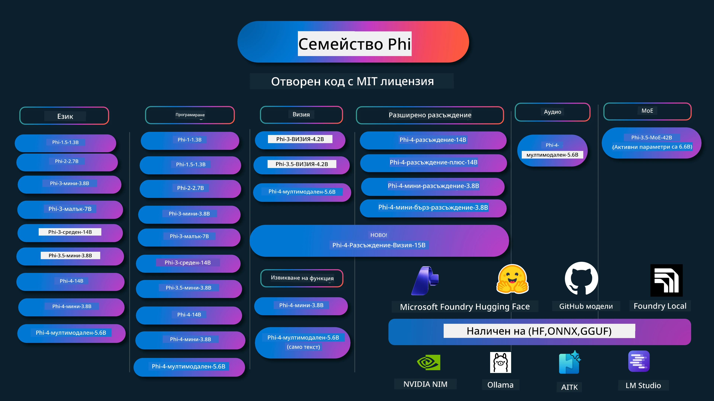

# Книга с рецепти за Phi: Практически примери с Phi моделите на Microsoft

[](https://codespaces.new/microsoft/phicookbook)
[](https://vscode.dev/redirect?url=vscode://ms-vscode-remote.remote-containers/cloneInVolume?url=https://github.com/microsoft/phicookbook)

[](https://GitHub.com/microsoft/phicookbook/graphs/contributors/?WT.mc_id=aiml-137032-kinfeylo)
[](https://GitHub.com/microsoft/phicookbook/issues/?WT.mc_id=aiml-137032-kinfeylo)
[](https://GitHub.com/microsoft/phicookbook/pulls/?WT.mc_id=aiml-137032-kinfeylo)
[](http://makeapullrequest.com?WT.mc_id=aiml-137032-kinfeylo)

[](https://GitHub.com/microsoft/phicookbook/watchers/?WT.mc_id=aiml-137032-kinfeylo)
[](https://GitHub.com/microsoft/phicookbook/network/?WT.mc_id=aiml-137032-kinfeylo)
[](https://GitHub.com/microsoft/phicookbook/stargazers/?WT.mc_id=aiml-137032-kinfeylo)

[](https://discord.com/invite/ByRwuEEgH4)

Phi е серия от отворени AI модели, разработени от Microsoft.

Phi е в момента най-мощният и ефективен по отношение на разходите малък езиков модел (SLM), с отлични резултати в многоезични, логически, текстови/чат генерации, кодиране, изображения, аудио и други сценарии.

Можете да разгърнете Phi в облак или на крайни устройства и лесно да изграждате генеративни AI приложения с ограничена изчислителна мощ.

Следвайте тези стъпки, за да започнете да използвате тези ресурси:
1. **Форкнете хранилището**: Кликнете [](https://GitHub.com/microsoft/phicookbook/network/?WT.mc_id=aiml-137032-kinfeylo)
2. **Клонирайте хранилището**: `git clone https://github.com/microsoft/PhiCookBook.git`
3. [**Присъединете се към Microsoft AI Discord Общността и се срещнете с експерти и други разработчици**](https://discord.com/invite/ByRwuEEgH4?WT.mc_id=aiml-137032-kinfeylo)



### 🌐 Поддръжка на много езици

#### Поддържано чрез GitHub Action (Автоматично и винаги актуално)

<!-- CO-OP TRANSLATOR LANGUAGES TABLE START -->
[Арабски](../ar/README.md) | [Бенгалски](../bn/README.md) | [Български](./README.md) | [Бирмански (Мианмар)](../my/README.md) | [Китайски (опростен)](../zh-CN/README.md) | [Китайски (традиционен, Хонконг)](../zh-HK/README.md) | [Китайски (традиционен, Макао)](../zh-MO/README.md) | [Китайски (традиционен, Тайван)](../zh-TW/README.md) | [Хърватски](../hr/README.md) | [Чешки](../cs/README.md) | [Датски](../da/README.md) | [Холандски](../nl/README.md) | [Естонски](../et/README.md) | [Фински](../fi/README.md) | [Френски](../fr/README.md) | [Немски](../de/README.md) | [Гръцки](../el/README.md) | [Иврит](../he/README.md) | [Хинди](../hi/README.md) | [Унгарски](../hu/README.md) | [Индонезийски](../id/README.md) | [Италиански](../it/README.md) | [Японски](../ja/README.md) | [Каннада](../kn/README.md) | [Кхмерски](../km/README.md) | [Корейски](../ko/README.md) | [Литовски](../lt/README.md) | [Малайски](../ms/README.md) | [Малаялам](../ml/README.md) | [Маратхи](../mr/README.md) | [Непалски](../ne/README.md) | [Нигерийски Пиджин](../pcm/README.md) | [Норвежки](../no/README.md) | [Фарси (Персийски)](../fa/README.md) | [Полски](../pl/README.md) | [Португалски (Бразилия)](../pt-BR/README.md) | [Португалски (Португалия)](../pt-PT/README.md) | [Пенджаби (Гурмукхи)](../pa/README.md) | [Румънски](../ro/README.md) | [Руски](../ru/README.md) | [Сръбски (кирилица)](../sr/README.md) | [Словашки](../sk/README.md) | [Словенски](../sl/README.md) | [Испански](../es/README.md) | [Суахили](../sw/README.md) | [Шведски](../sv/README.md) | [Тагалог (Филипински)](../tl/README.md) | [Тамилски](../ta/README.md) | [Телугу](../te/README.md) | [Тайски](../th/README.md) | [Турски](../tr/README.md) | [Украински](../uk/README.md) | [Урду](../ur/README.md) | [Виетнамски](../vi/README.md)

> **Предпочитате да клонирате локално?**
>
> Това хранилище включва над 50 езикови превода, които значително увеличават размера на изтеглянето. За клониране без преводи, използвайте sparse checkout:
>
> **Bash / macOS / Linux:**
> ```bash
> git clone --filter=blob:none --sparse https://github.com/microsoft/PhiCookBook.git
> cd PhiCookBook
> git sparse-checkout set --no-cone '/*' '!translations' '!translated_images'
> ```
>
> **CMD (Windows):**
> ```cmd
> git clone --filter=blob:none --sparse https://github.com/microsoft/PhiCookBook.git
> cd PhiCookBook
> git sparse-checkout set --no-cone "/*" "!translations" "!translated_images"
> ```
>
> Това ви осигурява всичко необходимо, за да завършите курса с по-бързо изтегляне.
<!-- CO-OP TRANSLATOR LANGUAGES TABLE END -->

## Съдържание

- Въведение
  - [Добре дошли във фамилията Phi](./md/01.Introduction/01/01.PhiFamily.md)
  - [Настройване на вашата среда](./md/01.Introduction/01/01.EnvironmentSetup.md)
  - [Разбиране на ключовите технологии](./md/01.Introduction/01/01.Understandingtech.md)
  - [Безопасност при AI за Phi моделите](./md/01.Introduction/01/01.AISafety.md)
  - [Поддръжка на хардуер за Phi](./md/01.Introduction/01/01.Hardwaresupport.md)
  - [Phi модели и наличност през платформите](./md/01.Introduction/01/01.Edgeandcloud.md)
  - [Използване на Guidance-ai и Phi](./md/01.Introduction/01/01.Guidance.md)
  - [GitHub Marketplace модели](https://github.com/marketplace/models)
  - [Azure AI каталог на модели](https://ai.azure.com)

- Извеждане на Phi в различна среда
    -  [Hugging face](./md/01.Introduction/02/01.HF.md)
    -  [GitHub Модели](./md/01.Introduction/02/02.GitHubModel.md)
    -  [Microsoft Foundry Каталог с модели](./md/01.Introduction/02/03.AzureAIFoundry.md)
    -  [Ollama](./md/01.Introduction/02/04.Ollama.md)
    -  [AI Toolkit VSCode (AITK)](./md/01.Introduction/02/05.AITK.md)
    -  [NVIDIA NIM](./md/01.Introduction/02/06.NVIDIA.md)
    -  [Foundry Local](./md/01.Introduction/02/07.FoundryLocal.md)

- Извеждане на Phi фамилията
    - [Извеждане на Phi в iOS](./md/01.Introduction/03/iOS_Inference.md)
    - [Извеждане на Phi в Android](./md/01.Introduction/03/Android_Inference.md)
    - [Извеждане на Phi в Jetson](./md/01.Introduction/03/Jetson_Inference.md)
    - [Извеждане на Phi в AI PC](./md/01.Introduction/03/AIPC_Inference.md)
    - [Извеждане на Phi с Apple MLX Framework](./md/01.Introduction/03/MLX_Inference.md)
    - [Извеждане на Phi в локален сървър](./md/01.Introduction/03/Local_Server_Inference.md)
    - [Извеждане на Phi в отдалечен сървър с AI Toolkit](./md/01.Introduction/03/Remote_Interence.md)
    - [Извеждане на Phi с Rust](./md/01.Introduction/03/Rust_Inference.md)
    - [Извеждане на Phi--Визия локално](./md/01.Introduction/03/Vision_Inference.md)
    - [Извеждане на Phi с Kaito AKS, Azure Контейнери (официална поддръжка)](./md/01.Introduction/03/Kaito_Inference.md)
-  [Квантизиране на Phi фамилията](./md/01.Introduction/04/QuantifyingPhi.md)
    - [Квантизиране на Phi-3.5 / 4 с llama.cpp](./md/01.Introduction/04/UsingLlamacppQuantifyingPhi.md)
    - [Квантизиране на Phi-3.5 / 4 с разширения за генеративен AI за onnxruntime](./md/01.Introduction/04/UsingORTGenAIQuantifyingPhi.md)
    - [Квантизиране на Phi-3.5 / 4 с Intel OpenVINO](./md/01.Introduction/04/UsingIntelOpenVINOQuantifyingPhi.md)
    - [Квантизиране на Phi-3.5 / 4 с Apple MLX Framework](./md/01.Introduction/04/UsingAppleMLXQuantifyingPhi.md)

-  Оценяване на Phi
    - [Отговорен AI](./md/01.Introduction/05/ResponsibleAI.md)
    - [Microsoft Foundry за оценяване](./md/01.Introduction/05/AIFoundry.md)
    - [Използване на Promptflow за оценяване](./md/01.Introduction/05/Promptflow.md)
 
- RAG с Azure AI Search
    - [Как да използвате Phi-4-mini и Phi-4-мултимодален (RAG) с Azure AI Search](https://github.com/microsoft/PhiCookBook/blob/main/code/06.E2E/E2E_Phi-4-RAG-Azure-AI-Search.ipynb)
    - [Zero-Cloud локален хибриден RAG с SQLite FTS5 и phi-4-mini](https://github.com/microsoft/PhiCookBook/blob/main/code/06.E2E/E2E_Phi-4-mini_Local_Hybrid_RAG_SQLite_FTS5.ipynb)

- Примери за разработване на Phi приложения
  - Текстови и чат приложения
    - Phi-4 Примери 
      - [📓] [Чат с Phi-4-mini ONNX модел](./md/02.Application/01.TextAndChat/Phi4/ChatWithPhi4ONNX/README.md)
      - [Чат с Phi-4 локален ONNX модел .NET](../../md/04.HOL/dotnet/src/LabsPhi4-Chat-01OnnxRuntime)
      - [Чат конзолно приложение на .NET с Phi-4 ONNX използващо Semnatic Kernel](../../md/04.HOL/dotnet/src/LabsPhi4-Chat-02SK)

    - Примери Phi-3 / 3.5
      - [Локален чатбот в браузъра с Phi3, ONNX Runtime Web и WebGPU](https://github.com/microsoft/onnxruntime-inference-examples/tree/main/js/chat)
      - [OpenVino Chat](./md/02.Application/01.TextAndChat/Phi3/E2E_OpenVino_Chat.md)
      - [Мулти модел - интерактивни Phi-3-mini и OpenAI Whisper](./md/02.Application/01.TextAndChat/Phi3/E2E_Phi-3-mini_with_whisper.md)
      - [MLFlow - Създаване на обвивка и използване на Phi-3 с MLFlow](./md//02.Application/01.TextAndChat/Phi3/E2E_Phi-3-MLflow.md)
      - [Оптимизация на модел - Как да оптимизирате модел Phi-3-min за ONNX Runtime Web с Olive](https://github.com/microsoft/Olive/tree/main/examples/phi3)
      - [WinUI3 приложение с Phi-3 mini-4k-instruct-onnx](https://github.com/microsoft/Phi3-Chat-WinUI3-Sample/)
      -[WinUI3 мултимоделно приложение за бележки с AI](https://github.com/microsoft/ai-powered-notes-winui3-sample)
      - [Фино настройване и интеграция на персонализирани Phi-3 модели с Prompt flow](./md/02.Application/01.TextAndChat/Phi3/E2E_Phi-3-FineTuning_PromptFlow_Integration.md)
      - [Фино настройване и интеграция на персонализирани Phi-3 модели с Prompt flow в Microsoft Foundry](./md/02.Application/01.TextAndChat/Phi3/E2E_Phi-3-FineTuning_PromptFlow_Integration_AIFoundry.md)
      - [Оценка на фино настроения модел Phi-3 / Phi-3.5 в Microsoft Foundry с фокус върху отговорните AI принципи на Microsoft](./md/02.Application/01.TextAndChat/Phi3/E2E_Phi-3-Evaluation_AIFoundry.md)
      - [📓] [Phi-3.5-mini-instruct пример за езиково предсказване (китайски/английски)](./md/02.Application/01.TextAndChat/Phi3/phi3-instruct-demo.ipynb)
      - [Phi-3.5-Instruct WebGPU RAG чатбот](./md/02.Application/01.TextAndChat/Phi3/WebGPUWithPhi35Readme.md)
      - [Използване на Windows GPU за създаване на Prompt flow решение с Phi-3.5-Instruct ONNX](./md/02.Application/01.TextAndChat/Phi3/UsingPromptFlowWithONNX.md)
      - [Използване на Microsoft Phi-3.5 tflite за създаване на Android приложение](./md/02.Application/01.TextAndChat/Phi3/UsingPhi35TFLiteCreateAndroidApp.md)
      - [Пример за Q&A .NET с локален ONNX Phi-3 модел чрез Microsoft.ML.OnnxRuntime](../../md/04.HOL/dotnet/src/LabsPhi301)
      - [Конзолно чат .NET приложение със Semantic Kernel и Phi-3](../../md/04.HOL/dotnet/src/LabsPhi302)

  - Примери за Azure AI Inference SDK, базирани на код
    - Примери Phi-4
      - [📓] [Генериране на проектен код с Phi-4-multimodal](./md/02.Application/02.Code/Phi4/GenProjectCode/README.md)
    - Примери Phi-3 / 3.5
      - [Създайте свой собствен Visual Studio Code GitHub Copilot Chat с Microsoft Phi-3 Family](./md/02.Application/02.Code/Phi3/VSCodeExt/README.md)
      - [Създайте свой собствен Visual Studio Code Chat Copilot Agent с Phi-3.5 чрез GitHub модели](/md/02.Application/02.Code/Phi3/CreateVSCodeChatAgentWithGitHubModels.md)

  - Примери за усъвършенствано разсъждение
    - Примери Phi-4
      - [📓] [Примери Phi-4-mini-reasoning или Phi-4-reasoning](./md/02.Application/03.AdvancedReasoning/Phi4/AdvancedResoningPhi4mini/README.md)
      - [📓] [Фино настройване на Phi-4-mini-reasoning със Microsoft Olive](./md/02.Application/03.AdvancedReasoning/Phi4/AdvancedResoningPhi4mini/olive_ft_phi_4_reasoning_with_medicaldata.ipynb)
      - [📓] [Фино настройване на Phi-4-mini-reasoning с Apple MLX](./md/02.Application/03.AdvancedReasoning/Phi4/AdvancedResoningPhi4mini/mlx_ft_phi_4_reasoning_with_medicaldata.ipynb)
      - [📓] [Phi-4-mini-reasoning с GitHub модели](./md/02.Application/02.Code/Phi4r/github_models_inference.ipynb)
      - [📓] [Phi-4-mini-reasoning с Microsoft Foundry модели](./md/02.Application/02.Code/Phi4r/azure_models_inference.ipynb)
  - Демонстрации
      - [Phi-4-mini демонстрации, хоствани на Hugging Face Spaces](https://huggingface.co/spaces/microsoft/phi-4-mini?WT.mc_id=aiml-137032-kinfeylo)
      - [Phi-4-multimodal демонстрации, хоствани на Hugging Face Spaces](https://huggingface.co/spaces/microsoft/phi-4-multimodal?WT.mc_id=aiml-137032-kinfeylo)
  - Примери във визията
    - Примери Phi-4
      - [📓] [Използване на Phi-4-multimodal за четене на изображения и генериране на код](./md/02.Application/04.Vision/Phi4/CreateFrontend/README.md) 
    - Примери Phi-3 / 3.5
      -  [📓][Phi-3-vision-Image текст към текст](./md/02.Application/04.Vision/Phi3/E2E_Phi-3-vision-image-text-to-text-online-endpoint.ipynb)
      - [Phi-3-vision-ONNX](https://onnxruntime.ai/docs/genai/tutorials/phi3-v.html)
      - [📓][Phi-3-vision CLIP_embedding](./md/02.Application/04.Vision/Phi3/E2E_Phi-3-vision-image-text-to-text-online-endpoint.ipynb)
      - [ДЕМО: Phi-3 рециклиране](https://github.com/jennifermarsman/PhiRecycling/)
      - [Phi-3-vision - Визуален езиков асистент - с Phi3-Vision и OpenVINO](https://docs.openvino.ai/nightly/notebooks/phi-3-vision-with-output.html)
      - [Phi-3 Визия Nvidia NIM](./md/02.Application/04.Vision/Phi3/E2E_Nvidia_NIM_Vision.md)
      - [Phi-3 Визия OpenVino](./md/02.Application/04.Vision/Phi3/E2E_OpenVino_Phi3Vision.md)
      - [📓][Phi-3.5 Визия мултирамков или мултиизображен пример](./md/02.Application/04.Vision/Phi3/phi3-vision-demo.ipynb)
      - [Phi-3 Визия Локален ONNX модел чрез Microsoft.ML.OnnxRuntime .NET](../../md/04.HOL/dotnet/src/LabsPhi303)
      - [Меню базиран Phi-3 Визия Локален ONNX модел чрез Microsoft.ML.OnnxRuntime .NET](../../md/04.HOL/dotnet/src/LabsPhi304)

  - Примери за разсъждения и визия
    - Phi-4-Reasoning-Vision-15B 
      - [📓] [Използване на Phi-4-Reasoning-Vision-15B за откриване на неправилно пресичане на пешеходна пътека](./md/02.Application/10.ReasoningVision/Phi_4_reasoning_vision_15b_Jaywalking.ipynb)
      - [📓] [Използване на Phi-4-Reasoning-Vision-15B за математика](./md/02.Application/10.ReasoningVision/Phi_4_reasoning_vision_15b_Math.ipynb)
      - [📓] [Използване на Phi-4-Reasoning-Vision-15B за откриване на UI](./md/02.Application/10.ReasoningVision/Phi_4_reasoning_vision_15b_ui.ipynb)

  - Примери за математика
    -  Phi-4-Mini-Flash-Reasoning-Instruct Примери  [Демо математика с Phi-4-Mini-Flash-Reasoning-Instruct](./md/02.Application/09.Math/MathDemo.ipynb)

  - Примери за аудио
    - Примери Phi-4
      - [📓] [Извличане на аудио транскрипции с Phi-4-multimodal](./md/02.Application/05.Audio/Phi4/Transciption/README.md)
      - [📓] [Пример за Phi-4-multimodal аудио](./md/02.Application/05.Audio/Phi4/Siri/demo.ipynb)
      - [📓] [Пример за Phi-4-multimodal превод на реч](./md/02.Application/05.Audio/Phi4/Translate/demo.ipynb)
      - [.NET конзолно приложение, използващо Phi-4-multimodal Audio за анализ на аудио файл и генериране на транскрипт](../../md/04.HOL/dotnet/src/LabsPhi4-MultiModal-02Audio)

  - Примери MOE
    - Примери Phi-3 / 3.5
      - [📓] [Phi-3.5 модели Mixture of Experts (MoEs) пример в социалните медии](./md/02.Application/06.MoE/Phi3/phi3_moe_demo.ipynb)
      - [📓] [Създаване на Retrieval-Augmented Generation (RAG) pipeline с NVIDIA NIM Phi-3 MOE, Azure AI Search и LlamaIndex](./md/02.Application/06.MoE/Phi3/azure-ai-search-nvidia-rag.ipynb)
      - 
  - Примери за извикване на функции
    - Примери Phi-4 🆕
      -  [📓] [Използване на извикване на функции с Phi-4-mini](./md/02.Application/07.FunctionCalling/Phi4/FunctionCallingBasic/README.md)
      -  [📓] [Използване на извикване на функции за създаване на мулти-агенти с Phi-4-mini](./md/02.Application/07.FunctionCalling/Phi4/Multiagents/Phi_4_mini_multiagent.ipynb)
      -  [📓] [Използване на извикване на функции с Ollama](./md/02.Application/07.FunctionCalling/Phi4/Ollama/ollama_functioncalling.ipynb)
      -  [📓] [Използване на извикване на функции с ONNX](./md/02.Application/07.FunctionCalling/Phi4/ONNX/onnx_parallel_functioncalling.ipynb)
  - Примери за мултимодално смесване
    - Примери Phi-4 🆕
      -  [📓] [Използване на Phi-4-multimodal като технологичен журналист](./md/02.Application/08.Multimodel/Phi4/TechJournalist/phi_4_mm_audio_text_publish_news.ipynb)
      - [.NET конзолно приложение, използващо Phi-4-multimodal за анализ на изображения](../../md/04.HOL/dotnet/src/LabsPhi4-MultiModal-01Images)

- Фино настройване на Phi примери
  - [Сценарии за фино настройване](./md/03.FineTuning/FineTuning_Scenarios.md)
  - [Фино настройване срещу RAG](./md/03.FineTuning/FineTuning_vs_RAG.md)
  - [Фино настройване: Нека Phi-3 стане индустриален експерт](./md/03.FineTuning/LetPhi3gotoIndustriy.md)
  - [Фино настройване на Phi-3 с AI Toolkit за VS Code](./md/03.FineTuning/Finetuning_VSCodeaitoolkit.md)
  - [Фино настройване на Phi-3 с Azure Machine Learning Service](./md/03.FineTuning/Introduce_AzureML.md)
  - [Фино настройване на Phi-3 с Lora](./md/03.FineTuning/FineTuning_Lora.md)
  - [Фино настройване на Phi-3 с QLora](./md/03.FineTuning/FineTuning_Qlora.md)
  - [Фино настройване на Phi-3 с Microsoft Foundry](./md/03.FineTuning/FineTuning_AIFoundry.md)
  - [Фино настройване на Phi-3 с Azure ML CLI/SDK](./md/03.FineTuning/FineTuning_MLSDK.md)
  - [Фино настройване с Microsoft Olive](./md/03.FineTuning/FineTuning_MicrosoftOlive.md)
  - [Фино настройване с Microsoft Olive Hands-On Lab](./md/03.FineTuning/olive-lab/readme.md)
  - [Фино настройване на Phi-3-vision с Weights and Bias](./md/03.FineTuning/FineTuning_Phi-3-visionWandB.md)

  - [Фино настройване на Phi-3 с Apple MLX Framework](./md/03.FineTuning/FineTuning_MLX.md)
  - [Фино настройване на Phi-3-vision (официална поддръжка)](./md/03.FineTuning/FineTuning_Vision.md)
  - [Фино настройване на Phi-3 с Kaito AKS, Azure Containers (официална поддръжка)](./md/03.FineTuning/FineTuning_Kaito.md)
  - [Фино настройване на Phi-3 и 3.5 Vision](https://github.com/2U1/Phi3-Vision-Finetune)

- Практическо обучение
  - [Изследване на най-новите модели: LLMs, SLMs, локална разработка и други](https://github.com/microsoft/aitour-exploring-cutting-edge-models)
  - [Отключване на потенциала на NLP: Фино настройване с Microsoft Olive](https://github.com/azure/Ignite_FineTuning_workshop)

- Академични изследователски доклади и публикации
  - [Учебниците са всичко, от което се нуждаете II: технически доклад phi-1.5](https://arxiv.org/abs/2309.05463)
  - [Технически доклад Phi-3: Висококапацитивен езиков модел локално на телефона ви](https://arxiv.org/abs/2404.14219)
  - [Технически доклад Phi-4](https://arxiv.org/abs/2412.08905)
  - [Технически доклад Phi-4-Mini: Компактни, но мощни мултимодални езикови модели чрез смесване на LoRA](https://arxiv.org/abs/2503.01743)
  - [Оптимизиране на малки езикови модели за функция за повикване в превозното средство](https://arxiv.org/abs/2501.02342)
  - [(WhyPHI) Фино настройване на PHI-3 за въпроси с множествен избор: методология, резултати и предизвикателства](https://arxiv.org/abs/2501.01588)
  - [Технически доклад Phi-4-разсъждения](https://www.microsoft.com/en-us/research/wp-content/uploads/2025/04/phi_4_reasoning.pdf)
  - [Технически доклад Phi-4-mini-разсъждения](https://huggingface.co/microsoft/Phi-4-mini-reasoning/blob/main/Phi-4-Mini-Reasoning.pdf)

## Използване на Phi модели

### Phi в Microsoft Foundry

Можете да научите как да използвате Microsoft Phi и как да изграждате комплексни решения (E2E) на различни хардуерни устройства. За да усетите Phi сами, започнете с експериментиране с моделите и персонализация на Phi за вашите сценарии, използвайки [Microsoft Foundry Azure AI Model Catalog](https://aka.ms/phi3-azure-ai). Можете да научите повече в Започване с [Microsoft Foundry](/md/02.QuickStart/AzureAIFoundry_QuickStart.md)

**Playground**
Всеки модел има специално игрално поле за тестове [Azure AI Playground](https://aka.ms/try-phi3).

### Phi в GitHub модели

Можете да научите как да използвате Microsoft Phi и как да изграждате комплексни решения (E2E) на различни хардуерни устройства. За да усетите Phi сами, започнете с експериментиране с модела и персонализация на Phi за вашите сценарии, използвайки [GitHub Model Catalog](https://github.com/marketplace/models?WT.mc_id=aiml-137032-kinfeylo). Можете да научите повече в Започване с [GitHub Model Catalog](/md/02.QuickStart/GitHubModel_QuickStart.md)

**Playground**
Всеки модел има специално [игрално поле за тест на модела](/md/02.QuickStart/GitHubModel_QuickStart.md).

### Phi в Hugging Face

Можете също да намерите модела на [Hugging Face](https://huggingface.co/microsoft)

**Playground**
 [Игрално поле Hugging Chat](https://huggingface.co/chat/models/microsoft/Phi-3-mini-4k-instruct)

 ## 🎒 Други курсове

Нашият екип произвежда и други курсове! Разгледайте:

<!-- CO-OP TRANSLATOR OTHER COURSES START -->
### LangChain
[](https://aka.ms/langchain4j-for-beginners)
[](https://aka.ms/langchainjs-for-beginners?WT.mc_id=m365-94501-dwahlin)
[](https://github.com/microsoft/langchain-for-beginners?WT.mc_id=m365-94501-dwahlin)
---

### Azure / Edge / MCP / Агенти
[](https://github.com/microsoft/AZD-for-beginners?WT.mc_id=academic-105485-koreyst)
[](https://github.com/microsoft/edgeai-for-beginners?WT.mc_id=academic-105485-koreyst)
[](https://github.com/microsoft/mcp-for-beginners?WT.mc_id=academic-105485-koreyst)
[](https://github.com/microsoft/ai-agents-for-beginners?WT.mc_id=academic-105485-koreyst)

---
 
### Серия за генеративен AI
[](https://github.com/microsoft/generative-ai-for-beginners?WT.mc_id=academic-105485-koreyst)
[-9333EA?style=for-the-badge&labelColor=E5E7EB&color=9333EA)](https://github.com/microsoft/Generative-AI-for-beginners-dotnet?WT.mc_id=academic-105485-koreyst)
[-C084FC?style=for-the-badge&labelColor=E5E7EB&color=C084FC)](https://github.com/microsoft/generative-ai-for-beginners-java?WT.mc_id=academic-105485-koreyst)
[-E879F9?style=for-the-badge&labelColor=E5E7EB&color=E879F9)](https://github.com/microsoft/generative-ai-with-javascript?WT.mc_id=academic-105485-koreyst)

---
 
### Основно обучение
[](https://aka.ms/ml-beginners?WT.mc_id=academic-105485-koreyst)
[](https://aka.ms/datascience-beginners?WT.mc_id=academic-105485-koreyst)
[](https://aka.ms/ai-beginners?WT.mc_id=academic-105485-koreyst)
[](https://github.com/microsoft/Security-101?WT.mc_id=academic-96948-sayoung)
[](https://aka.ms/webdev-beginners?WT.mc_id=academic-105485-koreyst)
[](https://aka.ms/iot-beginners?WT.mc_id=academic-105485-koreyst)
[](https://github.com/microsoft/xr-development-for-beginners?WT.mc_id=academic-105485-koreyst)

---
 
### Серия Copilot
[](https://aka.ms/GitHubCopilotAI?WT.mc_id=academic-105485-koreyst)
[](https://github.com/microsoft/mastering-github-copilot-for-dotnet-csharp-developers?WT.mc_id=academic-105485-koreyst)
[](https://github.com/microsoft/CopilotAdventures?WT.mc_id=academic-105485-koreyst)
<!-- CO-OP TRANSLATOR OTHER COURSES END -->

## Отговорен AI

Microsoft се ангажира да помогне на клиентите си да използват AI продуктите отговорно, да споделя нашите знания и да изгражда партньорства, базирани на доверие, чрез инструменти като Бележки за прозрачност и Оценки на въздействието. Много от тези ресурси могат да бъдат намерени на [https://aka.ms/RAI](https://aka.ms/RAI).
Подходът на Microsoft към отговорния AI е основан на нашите AI принципи за справедливост, надеждност и безопасност, поверителност и сигурност, приобщаване, прозрачност и отчетност.

Големите модели за естествен език, изображения и реч – като тези, използвани в този пример – могат потенциално да се държат по начини, които са несправедливи, ненадеждни или обидни, като по този начин причиняват вреди. Моля, консултирайте се с [Бележката за прозрачност на услугата Azure OpenAI](https://learn.microsoft.com/legal/cognitive-services/openai/transparency-note?tabs=text), за да се информирате за рисковете и ограниченията.


Препоръчителният подход за смекчаване на тези рискове е да включите система за безопасност във вашата архитектура, която може да открива и предотвратява вредно поведение. [Azure AI Content Safety](https://learn.microsoft.com/azure/ai-services/content-safety/overview) предоставя независим защитен слой, способен да открива вредно съдържание, генерирано от потребители и от AI, в приложения и услуги. Azure AI Content Safety включва текстови и изображенчески API, които ви позволяват да откривате материал, който е вреден. В Microsoft Foundry услугата Content Safety ви позволява да виждате, разглеждате и изпробвате примерен код за откриване на вредно съдържание в различни модалности. Следващата [документация за бърз старт](https://learn.microsoft.com/azure/ai-services/content-safety/quickstart-text?tabs=visual-studio%2Clinux&pivots=programming-language-rest) ви води през процеса на изпращане на заявки към услугата.

Друг аспект, който трябва да се вземе предвид, е общата производителност на приложението. При мултимодални и мултимоделови приложения, считаме, че производителността означава, че системата работи така, както вие и вашите потребители очаквате, включително да не генерира вредни резултати. Важно е да оцените производителността на цялото си приложение, като използвате [оценители за производителност, качество, риск и безопасност](https://learn.microsoft.com/azure/ai-studio/concepts/evaluation-metrics-built-in). Също така имате възможност да създавате и оценявате с [персонализирани оценители](https://learn.microsoft.com/azure/ai-studio/how-to/develop/evaluate-sdk#custom-evaluators).

Можете да оцените своето AI приложение в средата за разработка, като използвате [Azure AI Evaluation SDK](https://microsoft.github.io/promptflow/index.html). Независимо дали имате тестов набор от данни или цел, генерираните резултати на вашето генеративно AI приложение се измерват количествено с вградени оценители или персонализирани оценители по ваш избор. За да започнете с azure ai evaluation sdk за оценка на вашата система, можете да следвате [ръководството за бърз старт](https://learn.microsoft.com/azure/ai-studio/how-to/develop/flow-evaluate-sdk). След като изпълните оценъчен цикъл, можете да [визуализирате резултатите в Microsoft Foundry](https://learn.microsoft.com/azure/ai-studio/how-to/evaluate-flow-results).

## Търговски марки

Този проект може да съдържа търговски марки или лога на проекти, продукти или услуги. Пълномощното използване на търговски марки или лога на Microsoft се подчинява на [Правилата за търговски марки и бранд на Microsoft](https://www.microsoft.com/legal/intellectualproperty/trademarks/usage/general).
Използването на търговски марки или лога на Microsoft в модифицирани версии на този проект не трябва да създава объркване или да предполага спонсорство от Microsoft. Всяко използване на търговски марки или лога на трети страни се подчинява на правилата на тези трети страни.

## Получаване на помощ

Ако се затрудните или имате въпроси относно изграждането на AI приложения, присъединете се към:

[](https://aka.ms/foundry/discord)

Ако имате обратна връзка за продукта или грешки при изграждането, посетете:

[](https://aka.ms/foundry/forum)

---

<!-- CO-OP TRANSLATOR DISCLAIMER START -->
**Отказ от отговорност**:
Този документ е преведен с помощта на AI преводачески услуга [Co-op Translator](https://github.com/Azure/co-op-translator). Въпреки че се стремим към точност, моля имайте предвид, че автоматизираните преводи могат да съдържат грешки или неточности. Оригиналният документ на неговия роден език трябва да се счита за авторитетен източник. За критична информация се препоръчва професионален човешки превод. Ние не носим отговорност за каквито и да е недоразумения или неправилни тълкувания, произтичащи от използването на този превод.
<!-- CO-OP TRANSLATOR DISCLAIMER END -->