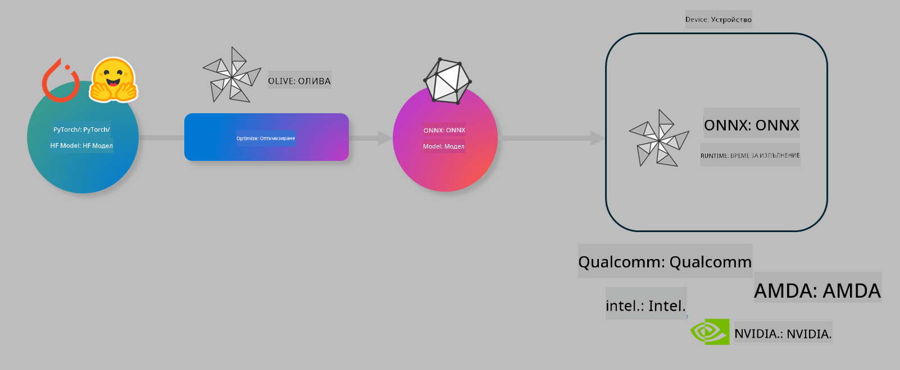

<!--
CO_OP_TRANSLATOR_METADATA:
{
  "original_hash": "6bbe47de3b974df7eea29dfeccf6032b",
  "translation_date": "2025-05-09T04:29:44+00:00",
  "source_file": "code/03.Finetuning/olive-lab/readme.md",
  "language_code": "bg"
}
-->
# Лаб. Оптимизиране на AI модели за изпълнение на устройството

## Въведение

> [!IMPORTANT]  
> Тази лаборатория изисква **Nvidia A10 или A100 GPU** с инсталирани съответни драйвери и CUDA toolkit (версия 12+).

> [!NOTE]  
> Това е **35-минутна** лаборатория, която ще ви даде практическо въведение в основните концепции за оптимизиране на модели за изпълнение на устройството с помощта на OLIVE.

## Учебни цели

Към края на тази лаборатория ще можете да използвате OLIVE, за да:

- Квантизирате AI модел с помощта на метода за квантизация AWQ.  
- Фино настроите AI модел за конкретна задача.  
- Генерирате LoRA адаптери (фино настроен модел) за ефективно изпълнение на устройството с ONNX Runtime.

### Какво е Olive

Olive (*O*NNX *live*) е комплект за оптимизация на модели с придружаващ CLI, който ви позволява да доставяте модели за ONNX runtime +++https://onnxruntime.ai+++ с високо качество и производителност.



Входът за Olive обикновено е PyTorch или Hugging Face модел, а изходът е оптимизиран ONNX модел, който се изпълнява на устройство (цел на внедряване), работещо с ONNX runtime. Olive оптимизира модела за AI ускорителя на целевото устройство (NPU, GPU, CPU), предоставен от хардуерен доставчик като Qualcomm, AMD, Nvidia или Intel.

Olive изпълнява *workflow*, който е подредена последователност от отделни задачи за оптимизация на модела, наречени *passes* – примерни passes включват: компресия на модела, улавяне на графа, квантизация, оптимизация на графа. Всеки pass има набор от параметри, които могат да се настройват, за да се постигнат най-добри метрики, като точност и латентност, оценявани от съответния evaluator. Olive използва стратегия за търсене, която прилага алгоритъм за автоматично настройване на всеки pass поотделно или група passes заедно.

#### Предимства на Olive

- **Намалява разочарованието и времето** за ръчно експериментиране чрез проби и грешки с различни техники за оптимизация на графа, компресия и квантизация. Определете вашите изисквания за качество и производителност и оставете Olive автоматично да намери най-добрия модел за вас.  
- **Над 40 вградени компонента за оптимизация на модели**, обхващащи най-съвременни техники в квантизацията, компресията, оптимизацията на графа и финото настройване.  
- **Лесен за използване CLI** за често срещани задачи по оптимизация на модели. Например, olive quantize, olive auto-opt, olive finetune.  
- Вградено пакетиране и внедряване на модели.  
- Поддържа генериране на модели за **Multi LoRA обслужване**.  
- Създаване на workflows с YAML/JSON за оркестрация на задачи по оптимизация и внедряване на модели.  
- Интеграция с **Hugging Face** и **Azure AI**.  
- Вграден механизъм за **кеширане**, който помага за **спестяване на разходи**.

## Инструкции за лабораторията

> [!NOTE]  
> Моля, уверете се, че сте създали вашия Azure AI Hub и проект и сте настроили вашия A100 compute съгласно Лаборатория 1.

### Стъпка 0: Свържете се с вашия Azure AI Compute

Ще се свържете с Azure AI compute чрез функцията за отдалечен достъп в **VS Code.**

1. Отворете десктоп приложението **VS Code**:  
1. Отворете **command palette** с **Shift+Ctrl+P**  
1. В command palette потърсете **AzureML - remote: Connect to compute instance in New Window**.  
1. Следвайте инструкциите на екрана, за да се свържете с Compute. Това включва избор на вашия Azure Subscription, Resource Group, Project и името на Compute, който сте настроили в Лаборатория 1.  
1. След свързване с вашия Azure ML Compute node, той ще се покаже в **долния ляв ъгъл на Visual Code** `><Azure ML: Compute Name`

### Стъпка 1: Клонирайте това хранилище

Във VS Code можете да отворите нов терминал с **Ctrl+J** и да клонирате това хранилище:

В терминала трябва да видите подканата

```
azureuser@computername:~/cloudfiles/code$ 
```  
Клонирайте решението

```bash
cd ~/localfiles
git clone https://github.com/microsoft/phi-3cookbook.git
```

### Стъпка 2: Отворете папката във VS Code

За да отворите VS Code в съответната папка, изпълнете следната команда в терминала, която ще отвори нов прозорец:

```bash
code phi-3cookbook/code/04.Finetuning/Olive-lab
```

Алтернативно, можете да отворите папката чрез **File** > **Open Folder**.

### Стъпка 3: Зависимости

Отворете терминал във VS Code на вашия Azure AI Compute Instance (съвет: **Ctrl+J**) и изпълнете следните команди, за да инсталирате зависимостите:

```bash
conda create -n olive-ai python=3.11 -y
conda activate olive-ai
pip install -r requirements.txt
az extension remove -n azure-cli-ml
az extension add -n ml
```

> [!NOTE]  
> Инсталирането на всички зависимости ще отнеме около 5 минути.

В тази лаборатория ще сваляте и качвате модели в Azure AI Model catalog. За да имате достъп до каталога, трябва да се логнете в Azure с:

```bash
az login
```

> [!NOTE]  
> При влизане ще бъдете помолени да изберете вашата абонаментна услуга. Уверете се, че е избрана тази, предоставена за тази лаборатория.

### Стъпка 4: Изпълнение на Olive команди

Отворете терминал във VS Code на вашия Azure AI Compute Instance (съвет: **Ctrl+J**) и се уверете, че `olive-ai` conda средата е активирана:

```bash
conda activate olive-ai
```

След това изпълнете следните Olive команди в командния ред.

1. **Преглед на данните:** В този пример ще фино настроите модела Phi-3.5-Mini, така че да е специализиран в отговори на въпроси, свързани с пътувания. Кодът по-долу показва първите няколко записа от набора данни, които са във формат JSON lines:  
   
    ```bash
    head data/data_sample_travel.jsonl
    ```  
1. **Квантизирайте модела:** Преди да тренирате модела, първо го квантизирате с командата по-долу, която използва техника, наречена Active Aware Quantization (AWQ) +++https://arxiv.org/abs/2306.00978+++. AWQ квантизира теглата на модела, като взема предвид активациите, произведени по време на изпълнението. Това означава, че процесът на квантизация отчита реалното разпределение на данните в активациите, което води до по-добро запазване на точността на модела в сравнение с традиционните методи за квантизация на теглата.  
   
    ```bash
    olive quantize \
       --model_name_or_path microsoft/Phi-3.5-mini-instruct \
       --trust_remote_code \
       --algorithm awq \
       --output_path models/phi/awq \
       --log_level 1
    ```  
   
    Процесът на AWQ квантизация отнема около **8 минути** и ще **намали размера на модела от ~7.5GB до ~2.5GB**.  
   
   В тази лаборатория показваме как да въвеждате модели от Hugging Face (например: `microsoft/Phi-3.5-mini-instruct`). However, Olive also allows you to input models from the Azure AI catalog by updating the `model_name_or_path` argument to an Azure AI asset ID (for example:  `azureml://registries/azureml/models/Phi-3.5-mini-instruct/versions/4`). 

1. **Train the model:** Next, the `olive finetune` командата фино настройва квантизирания модел. Квантизирането на модела *преди* финото настройване, а не след това, дава по-добра точност, тъй като процесът на фино настройване възстановява част от загубата от квантизацията.  
   
    ```bash
    olive finetune \
        --method lora \
        --model_name_or_path models/phi/awq \
        --data_files "data/data_sample_travel.jsonl" \
        --data_name "json" \
        --text_template "<|user|>\n{prompt}<|end|>\n<|assistant|>\n{response}<|end|>" \
        --max_steps 100 \
        --output_path ./models/phi/ft \
        --log_level 1
    ```  
   
    Финото настройване отнема около **6 минути** (с 100 стъпки).

1. **Оптимизирайте:** След като моделът е обучен, сега го оптимизирате, използвайки Olive с аргументите `auto-opt` command, which will capture the ONNX graph and automatically perform a number of optimizations to improve the model performance for CPU by compressing the model and doing fusions. It should be noted, that you can also optimize for other devices such as NPU or GPU by just updating the `--device` and `--provider` - но за целите на тази лаборатория ще използваме CPU.

    ```bash
    olive auto-opt \
       --model_name_or_path models/phi/ft/model \
       --adapter_path models/phi/ft/adapter \
       --device cpu \
       --provider CPUExecutionProvider \
       --use_ort_genai \
       --output_path models/phi/onnx-ao \
       --log_level 1
    ```  
   
    Оптимизацията отнема около **5 минути**.

### Стъпка 5: Бърз тест на инференция на модела

За да тествате инференцията на модела, създайте Python файл в папката си с име **app.py** и копирайте следния код:

```python
import onnxruntime_genai as og
import numpy as np

print("loading model and adapters...", end="", flush=True)
model = og.Model("models/phi/onnx-ao/model")
adapters = og.Adapters(model)
adapters.load("models/phi/onnx-ao/model/adapter_weights.onnx_adapter", "travel")
print("DONE!")

tokenizer = og.Tokenizer(model)
tokenizer_stream = tokenizer.create_stream()

params = og.GeneratorParams(model)
params.set_search_options(max_length=100, past_present_share_buffer=False)
user_input = "what is the best thing to see in chicago"
params.input_ids = tokenizer.encode(f"<|user|>\n{user_input}<|end|>\n<|assistant|>\n")

generator = og.Generator(model, params)

generator.set_active_adapter(adapters, "travel")

print(f"{user_input}")

while not generator.is_done():
    generator.compute_logits()
    generator.generate_next_token()

    new_token = generator.get_next_tokens()[0]
    print(tokenizer_stream.decode(new_token), end='', flush=True)

print("\n")
```

Изпълнете кода с:

```bash
python app.py
```

### Стъпка 6: Качване на модел в Azure AI

Качването на модела в Azure AI model repository прави модела споделяем с други членове на вашия екип и също така управлява версиите на модела. За да качите модела, изпълнете следната команда:

> [!NOTE]  
> Актуализирайте `{}`` placeholders with the name of your resource group and Azure AI Project Name. 

To find your resource group ` с името на вашата ресурсна група и Azure AI проект, след което изпълнете командата:

```
az ml workspace show
```

Или отидете на +++ai.azure.com+++ и изберете **management center** > **project** > **overview**

Актуализирайте `{}` плейсхолдерите с името на вашата ресурсна група и Azure AI проект.

```bash
az ml model create \
    --name ft-for-travel \
    --version 1 \
    --path ./models/phi/onnx-ao \
    --resource-group {RESOURCE_GROUP_NAME} \
    --workspace-name {PROJECT_NAME}
```  
След това можете да видите качения модел и да го внедрите на https://ml.azure.com/model/list

**Отказ от отговорност**:  
Този документ е преведен с помощта на AI преводаческа услуга [Co-op Translator](https://github.com/Azure/co-op-translator). Въпреки че се стремим към точност, моля, имайте предвид, че автоматизираните преводи могат да съдържат грешки или неточности. Оригиналният документ на неговия роден език трябва да се счита за авторитетен източник. За критична информация се препоръчва професионален човешки превод. Ние не носим отговорност за каквито и да е недоразумения или неправилни тълкувания, произтичащи от използването на този превод.