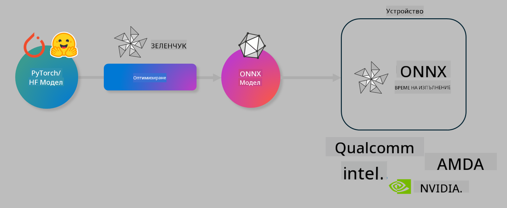

<!--
CO_OP_TRANSLATOR_METADATA:
{
  "original_hash": "6bbe47de3b974df7eea29dfeccf6032b",
  "translation_date": "2025-05-09T04:42:51+00:00",
  "source_file": "code/04.Finetuning/olive-lab/readme.md",
  "language_code": "bg"
}
-->
# Лаборатория. Оптимизиране на AI модели за изпълнение на устройството

## Въведение

> [!IMPORTANT]  
> Тази лаборатория изисква **Nvidia A10 или A100 GPU** с инсталирани съответни драйвери и CUDA toolkit (версия 12+).

> [!NOTE]  
> Това е **35-минутна** лаборатория, която ще ви даде практически насоки за основните концепции при оптимизирането на модели за изпълнение на устройството с помощта на OLIVE.

## Учебни цели

След края на тази лаборатория ще можете да използвате OLIVE, за да:

- Квантизирате AI модел с метода AWQ.
- Финно настроите AI модел за конкретна задача.
- Генерирате LoRA адаптери (финно настроен модел) за ефективно изпълнение на устройството с ONNX Runtime.

### Какво е Olive

Olive (*O*NNX *live*) е комплект за оптимизация на модели с придружаващ CLI, който ви позволява да подготвяте модели за ONNX runtime +++https://onnxruntime.ai+++ с високо качество и производителност.



Входът за Olive обикновено е PyTorch или Hugging Face модел, а изходът е оптимизиран ONNX модел, който се изпълнява на устройство (цел за внедряване), работещо с ONNX runtime. Olive оптимизира модела за AI ускорителя (NPU, GPU, CPU) на устройството, предоставен от хардуерен доставчик като Qualcomm, AMD, Nvidia или Intel.

Olive изпълнява *workflow* – подредена последователност от отделни задачи за оптимизация на модела, наречени *passes*. Примери за passes са: компресия на модела, улавяне на графа, квантизация, оптимизация на графа. Всеки pass има набор от параметри, които могат да се настройват за постигане на най-добри показатели, като точност и латентност, оценявани от съответния evaluator. Olive използва стратегия за търсене, която прилага алгоритъм за автоматично настройване на всеки pass поотделно или група passes заедно.

#### Предимства на Olive

- **Намалява разочарованието и времето** за ръчно експериментиране с различни техники за оптимизация на граф, компресия и квантизация. Задайте своите изисквания за качество и производителност и оставете Olive автоматично да намери най-добрия модел за вас.
- **Над 40 вградени компонента** за оптимизация на модели, обхващащи най-съвременни техники в квантизацията, компресията, оптимизацията на граф и финна настройка.
- **Лесен за използване CLI** за често срещани задачи по оптимизация на модели. Например, olive quantize, olive auto-opt, olive finetune.
- Вградена поддръжка за опаковане и внедряване на модели.
- Поддържа генериране на модели за **Multi LoRA обслужване**.
- Конструиране на workflow с YAML/JSON за оркестрация на задачи по оптимизация и внедряване на модели.
- Интеграция с **Hugging Face** и **Azure AI**.
- Вграден механизъм за **кеширане**, който помага да **спестите разходи**.

## Инструкции за лабораторията

> [!NOTE]  
> Моля, уверете се, че сте осигурили своя Azure AI Hub и проект и сте настроили своя A100 изчислителен ресурс според Лаб 1.

### Стъпка 0: Свържете се със своя Azure AI Compute

Ще се свържете с Azure AI compute чрез отдалечена функция в **VS Code**.

1. Отворете настолното приложение **VS Code**:  
1. Отворете **command palette** с **Shift+Ctrl+P**  
1. В command palette потърсете **AzureML - remote: Connect to compute instance in New Window**.  
1. Следвайте инструкциите на екрана, за да се свържете с Compute. Това включва избор на вашия Azure Subscription, Resource Group, Project и Compute име, което сте настроили в Лаб 1.  
1. След като сте свързани към Azure ML Compute възела, това ще се покаже в **долния ляв ъгъл на Visual Code** `><Azure ML: Compute Name`

### Стъпка 1: Клонирайте това хранилище

Във VS Code можете да отворите нов терминал с **Ctrl+J** и да клонирате това хранилище:

В терминала ще видите подканата

```
azureuser@computername:~/cloudfiles/code$ 
```  
Клонирайте решението

```bash
cd ~/localfiles
git clone https://github.com/microsoft/phi-3cookbook.git
```

### Стъпка 2: Отворете папката във VS Code

За да отворите VS Code в съответната папка, изпълнете следната команда в терминала, която ще отвори нов прозорец:

```bash
code phi-3cookbook/code/04.Finetuning/Olive-lab
```

Алтернативно, можете да отворите папката, като изберете **File** > **Open Folder**.

### Стъпка 3: Зависимости

Отворете терминал във VS Code на вашия Azure AI Compute Instance (съвет: **Ctrl+J**) и изпълнете следните команди, за да инсталирате зависимостите:

```bash
conda create -n olive-ai python=3.11 -y
conda activate olive-ai
pip install -r requirements.txt
az extension remove -n azure-cli-ml
az extension add -n ml
```

> [!NOTE]  
> Инсталацията на всички зависимости ще отнеме около 5 минути.

В тази лаборатория ще изтегляте и качвате модели в Azure AI Model каталог. За да имате достъп до каталога, трябва да влезете в Azure с:

```bash
az login
```

> [!NOTE]  
> При входа ще бъдете помолени да изберете своя subscription. Уверете се, че сте избрали абонамента, предоставен за тази лаборатория.

### Стъпка 4: Изпълнете Olive команди

Отворете терминал във VS Code на вашия Azure AI Compute Instance (съвет: **Ctrl+J**) и се уверете, че е активирана conda средата `olive-ai`:

```bash
conda activate olive-ai
```

След това изпълнете следните Olive команди в командния ред.

1. **Преглед на данните:** В този пример ще финно настроите модела Phi-3.5-Mini, за да бъде специализиран в отговаряне на въпроси, свързани с пътувания. Кодът по-долу показва първите няколко записа от набора данни, който е във формат JSON lines:

    ```bash
    head data/data_sample_travel.jsonl
    ```

1. **Квантизиране на модела:** Преди да обучите модела, първо го квантизирате с командата по-долу, която използва техника, наречена Active Aware Quantization (AWQ) +++https://arxiv.org/abs/2306.00978+++. AWQ квантизира тежестите на модела, като взема предвид активациите, генерирани по време на изпълнение. Това означава, че процесът на квантизация отчита реалното разпределение на данните в активациите, което води до по-добро запазване на точността на модела в сравнение с традиционните методи за квантизация на тежести.

    ```bash
    olive quantize \
       --model_name_or_path microsoft/Phi-3.5-mini-instruct \
       --trust_remote_code \
       --algorithm awq \
       --output_path models/phi/awq \
       --log_level 1
    ```

    Квантизацията с AWQ отнема **около 8 минути** и ще **намали размера на модела от ~7.5GB до ~2.5GB**.

    В тази лаборатория показваме как да заредите модели от Hugging Face (например: `microsoft/Phi-3.5-mini-instruct`). However, Olive also allows you to input models from the Azure AI catalog by updating the `model_name_or_path` argument to an Azure AI asset ID (for example:  `azureml://registries/azureml/models/Phi-3.5-mini-instruct/versions/4`). 

1. **Train the model:** Next, the `olive finetune` команда финно настройва квантизирания модел. Квантизирането на модела *преди* финната настройка дава по-добра точност, тъй като финната настройка компенсира част от загубите при квантизация.

    ```bash
    olive finetune \
        --method lora \
        --model_name_or_path models/phi/awq \
        --data_files "data/data_sample_travel.jsonl" \
        --data_name "json" \
        --text_template "<|user|>\n{prompt}<|end|>\n<|assistant|>\n{response}<|end|>" \
        --max_steps 100 \
        --output_path ./models/phi/ft \
        --log_level 1
    ```

    Финната настройка (с 100 стъпки) отнема **около 6 минути**.

1. **Оптимизация:** След като моделът е обучен, го оптимизирате с помощта на Olive чрез аргументите `auto-opt` command, which will capture the ONNX graph and automatically perform a number of optimizations to improve the model performance for CPU by compressing the model and doing fusions. It should be noted, that you can also optimize for other devices such as NPU or GPU by just updating the `--device` and `--provider` – за целите на тази лаборатория ще използваме CPU.

    ```bash
    olive auto-opt \
       --model_name_or_path models/phi/ft/model \
       --adapter_path models/phi/ft/adapter \
       --device cpu \
       --provider CPUExecutionProvider \
       --use_ort_genai \
       --output_path models/phi/onnx-ao \
       --log_level 1
    ```

    Оптимизацията отнема **около 5 минути**.

### Стъпка 5: Бърз тест за извеждане на модела

За да тествате извеждането на модела, създайте Python файл във вашата папка с име **app.py** и копирайте следния код:

```python
import onnxruntime_genai as og
import numpy as np

print("loading model and adapters...", end="", flush=True)
model = og.Model("models/phi/onnx-ao/model")
adapters = og.Adapters(model)
adapters.load("models/phi/onnx-ao/model/adapter_weights.onnx_adapter", "travel")
print("DONE!")

tokenizer = og.Tokenizer(model)
tokenizer_stream = tokenizer.create_stream()

params = og.GeneratorParams(model)
params.set_search_options(max_length=100, past_present_share_buffer=False)
user_input = "what is the best thing to see in chicago"
params.input_ids = tokenizer.encode(f"<|user|>\n{user_input}<|end|>\n<|assistant|>\n")

generator = og.Generator(model, params)

generator.set_active_adapter(adapters, "travel")

print(f"{user_input}")

while not generator.is_done():
    generator.compute_logits()
    generator.generate_next_token()

    new_token = generator.get_next_tokens()[0]
    print(tokenizer_stream.decode(new_token), end='', flush=True)

print("\n")
```

Изпълнете кода с:

```bash
python app.py
```

### Стъпка 6: Качване на модел в Azure AI

Качването на модела в Azure AI моделно хранилище позволява да споделяте модела с други членове на вашия екип и също така управлява версиите на модела. За да качите модела, изпълнете следната команда:

> [!NOTE]  
> Актуализирайте `{}` placeholders with the name of your resource group and Azure AI Project Name. 

To find your resource group `"resourceGroup"` и името на Azure AI проекта, като изпълните следната команда:

```
az ml workspace show
```

Или отидете на +++ai.azure.com+++ и изберете **management center** > **project** > **overview**

Актуализирайте `{}` плейсхолдърите с името на вашата resource group и името на Azure AI проекта.

```bash
az ml model create \
    --name ft-for-travel \
    --version 1 \
    --path ./models/phi/onnx-ao \
    --resource-group {RESOURCE_GROUP_NAME} \
    --workspace-name {PROJECT_NAME}
```

След това можете да видите качения модел и да го внедрите на https://ml.azure.com/model/list

**Отказ от отговорност**:  
Този документ е преведен с помощта на AI преводаческа услуга [Co-op Translator](https://github.com/Azure/co-op-translator). Въпреки че се стремим към точност, моля, имайте предвид, че автоматизираните преводи могат да съдържат грешки или неточности. Оригиналният документ на неговия оригинален език трябва да се счита за авторитетен източник. За критична информация се препоръчва професионален човешки превод. Ние не носим отговорност за каквито и да е недоразумения или неправилни тълкувания, произтичащи от използването на този превод.