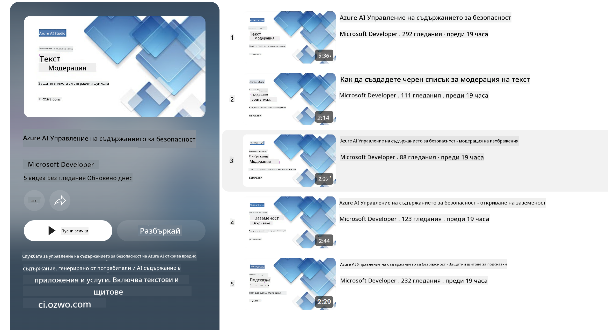

<!--
CO_OP_TRANSLATOR_METADATA:
{
  "original_hash": "c8273672cc57df2be675407a1383aaf0",
  "translation_date": "2025-05-09T06:24:15+00:00",
  "source_file": "md/01.Introduction/01/01.AISafety.md",
  "language_code": "bg"
}
-->
# Безопасност на AI за Phi модели  
Семейството модели Phi са разработени в съответствие с [Microsoft Responsible AI Standard](https://query.prod.cms.rt.microsoft.com/cms/api/am/binary/RE5cmFl), който представлява фирмен набор от изисквания, базирани на следните шест принципа: отчетност, прозрачност, справедливост, надеждност и безопасност, поверителност и сигурност, както и приобщаване, които формират [Принципите за отговорен AI на Microsoft](https://www.microsoft.com/ai/responsible-ai).

Подобно на предишните Phi модели, бе приет многоаспектен подход за оценка на безопасността и обучение след тренировка, като бяха взети допълнителни мерки, за да се отразят многоезичните възможности на това издание. Нашият подход към обучението и оценките за безопасност, включително тестове на различни езици и категории рискове, е описан в [Phi Safety Post-Training Paper](https://arxiv.org/abs/2407.13833). Въпреки че Phi моделите се възползват от този подход, разработчиците трябва да прилагат най-добрите практики за отговорен AI, включително картографиране, измерване и намаляване на рисковете, свързани с конкретния им случай на употреба и културен и езиков контекст.

## Най-добри практики  

Подобно на други модели, семейството Phi може потенциално да се държи по начини, които са несправедливи, ненадеждни или обидни.

Някои от ограниченията в поведението на SLM и LLM, за които трябва да сте наясно, включват:

- **Качество на услугата:** Phi моделите са обучени основно на английски текст. Езиците, различни от английски, ще имат по-слабо представяне. Вариации на английски език с по-малко представителство в обучителните данни може да се представят по-зле от стандартния американски английски.  
- **Представяне на вреди и поддържане на стереотипи:** Тези модели могат да надценяват или подценяват групи хора, да премахват представителството на някои групи или да засилват унизителни или негативни стереотипи. Въпреки обучението след тренировка за безопасност, тези ограничения може все още да са налице поради различните нива на представителство на различни групи или наличието на примери с негативни стереотипи в обучителните данни, които отразяват реални обществени модели и пристрастия.  
- **Неподходящо или обидно съдържание:** Тези модели могат да генерират други видове неподходящо или обидно съдържание, което може да направи тяхното използване неподходящо за чувствителни контексти без допълнителни мерки, специфични за конкретния случай.  
- **Надеждност на информацията:** Езиковите модели могат да създават безсмислено съдържание или да измислят информация, която звучи правдоподобно, но е неточна или остаряла.  
- **Ограничен обхват за код:** Повечето обучителни данни на Phi-3 са базирани на Python и използват общи пакети като "typing, math, random, collections, datetime, itertools". Ако моделът генерира Python скриптове с други пакети или скриптове на други езици, препоръчваме на потребителите ръчно да проверяват всички използвани API.

Разработчиците трябва да прилагат най-добрите практики за отговорен AI и носят отговорност да гарантират, че конкретният случай на употреба отговаря на съответните закони и регулации (например поверителност, търговия и др.).

## Съображения за отговорен AI  

Подобно на други езикови модели, моделите от серията Phi могат потенциално да се държат по начини, които са несправедливи, ненадеждни или обидни. Някои от ограниченията, за които трябва да се внимава, включват:

**Качество на услугата:** Phi моделите са обучени основно на английски текст. Езиците, различни от английски, ще имат по-слабо представяне. Вариации на английски език с по-малко представителство в обучителните данни може да се представят по-зле от стандартния американски английски.

**Представяне на вреди и поддържане на стереотипи:** Тези модели могат да надценяват или подценяват групи хора, да премахват представителството на някои групи или да засилват унизителни или негативни стереотипи. Въпреки обучението след тренировка за безопасност, тези ограничения може все още да са налице поради различните нива на представителство на различни групи или наличието на примери с негативни стереотипи в обучителните данни, които отразяват реални обществени модели и пристрастия.

**Неподходящо или обидно съдържание:** Тези модели могат да генерират други видове неподходящо или обидно съдържание, което може да направи тяхното използване неподходящо за чувствителни контексти без допълнителни мерки, специфични за конкретния случай.  
Надеждност на информацията: Езиковите модели могат да създават безсмислено съдържание или да измислят информация, която звучи правдоподобно, но е неточна или остаряла.

**Ограничен обхват за код:** Повечето обучителни данни на Phi-3 са базирани на Python и използват общи пакети като "typing, math, random, collections, datetime, itertools". Ако моделът генерира Python скриптове с други пакети или скриптове на други езици, препоръчваме на потребителите ръчно да проверяват всички използвани API.

Разработчиците трябва да прилагат най-добрите практики за отговорен AI и носят отговорност да гарантират, че конкретният случай на употреба отговаря на съответните закони и регулации (например поверителност, търговия и др.). Важни области за внимание включват:

**Разпределение:** Моделите може да не са подходящи за ситуации, които биха имали значително влияние върху правния статус или разпределението на ресурси или житейски възможности (например жилище, заетост, кредит и др.) без допълнителни оценки и техники за намаляване на пристрастия.

**Високорискови сценарии:** Разработчиците трябва да оценят подходящостта на използването на модели в високорискови сценарии, където несправедливи, ненадеждни или обидни изходи могат да бъдат изключително скъпи или да доведат до вреда. Това включва предоставяне на съвети в чувствителни или експертни области, където точността и надеждността са критични (например правни или здравни съвети). Допълнителни мерки за защита трябва да се прилагат на ниво приложение според контекста на внедряване.

**Дезинформация:** Моделите могат да генерират неточна информация. Разработчиците трябва да следват най-добрите практики за прозрачност и да информират крайните потребители, че взаимодействат с AI система. На ниво приложение разработчиците могат да изграждат механизми за обратна връзка и канали за обвързване на отговорите с конкретна, контекстуална информация за случая на употреба, техника, известна като Retrieval Augmented Generation (RAG).

**Генериране на вредно съдържание:** Разработчиците трябва да оценяват изходите в контекста им и да използват налични класификатори за безопасност или персонализирани решения, подходящи за конкретния случай.

**Злоупотреба:** Други форми на злоупотреба като измама, спам или създаване на зловреден софтуер са възможни, и разработчиците трябва да гарантират, че техните приложения не нарушават приложимите закони и регулации.

### Финетюнинг и безопасност на AI съдържание  

След финетюнинг на модел, силно препоръчваме да използвате мерките на [Azure AI Content Safety](https://learn.microsoft.com/azure/ai-services/content-safety/overview) за наблюдение на съдържанието, генерирано от моделите, за идентифициране и блокиране на потенциални рискове, заплахи и проблеми с качеството.

[Azure AI Content Safety](https://learn.microsoft.com/azure/ai-services/content-safety/overview) поддържа както текстово, така и визуално съдържание. Може да бъде внедрена в облака, в изолирани контейнери и на edge/вградени устройства.

## Преглед на Azure AI Content Safety  

Azure AI Content Safety не е универсално решение; може да бъде персонализирано, за да съответства на специфичните политики на бизнеса. Освен това, неговите многоезични модели му позволяват да разбира няколко езика едновременно.

- **Azure AI Content Safety**  
- **Microsoft Developer**  
- **5 видеа**

Услугата Azure AI Content Safety открива вредно съдържание, генерирано от потребители и AI, в приложения и услуги. Тя включва текстови и визуални API, които позволяват откриването на вредно или неподходящо съдържание.

[AI Content Safety Playlist](https://www.youtube.com/playlist?list=PLlrxD0HtieHjaQ9bJjyp1T7FeCbmVcPkQ)

**Отказ от отговорност**:  
Този документ е преведен с помощта на AI преводаческа услуга [Co-op Translator](https://github.com/Azure/co-op-translator). Въпреки че се стремим към точност, моля, имайте предвид, че автоматичните преводи могат да съдържат грешки или неточности. Оригиналният документ на неговия език трябва да се счита за авторитетен източник. За критична информация се препоръчва професионален човешки превод. Ние не носим отговорност за никакви недоразумения или погрешни тълкувания, произтичащи от използването на този превод.