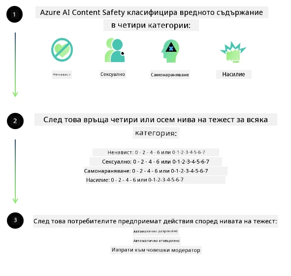

# Безопасност на изкуствения интелект за модели Phi
Семейството от модели Phi е разработено в съответствие с [Отговорния стандарт за изкуствен интелект на Microsoft](https://www.microsoft.com/ai/principles-and-approach#responsible-ai-standard), който представлява обхватен набор от изисквания на компанията, базирани на следните шест принципа: отчетност, прозрачност, справедливост, надеждност и безопасност, поверителност и сигурност, и приобщаване, които формират [Отговорните принципи за изкуствен интелект на Microsoft](https://www.microsoft.com/ai/responsible-ai).

Както при предишните модели Phi, беше възприет многостранен подход за оценка на безопасността и обучение за безопасност след трениране, с допълнителни мерки, взети предвид възможностите за многоезична поддръжка на това издание. Нашият подход към обучението и оценките за безопасност, включително тестване на няколко езика и категории рискове, е изложен в [Доклада за безопасност на Phi след трениране](https://arxiv.org/abs/2407.13833). Въпреки че моделите Phi се възползват от този подход, разработчиците трябва да прилагат най-добрите практики за отговорен изкуствен интелект, включително картографиране, измерване и смекчаване на рисковете, свързани с конкретния им случай на употреба и културния и лингвистичен контекст.

## Най-добри практики

Както и другите модели, семейството от модели Phi потенциално може да се държи по начини, които са несправедливи, ненадеждни или обидни.

Някои от ограничаващите поведения на SLM и LLM, които трябва да знаете, включват:

- **Качество на услугата:** Моделите Phi са обучени основно на английски текстове. Езиците, различни от английски, ще имат по-лошо представяне. Английските езикови разновидности с по-малко представяне в обучителните данни могат да имат по-лошо представяне в сравнение със стандартния американски английски.
- **Представяне на вреди и поддържане на стереотипи:** Тези модели могат да над- или недопредставят групи хора, да изтрият представянето на някои групи или да укрепят унизителни или негативни стереотипи. Въпреки обучението за безопасност след трениране, тези ограничения може все още да съществуват поради различни нива на представяне на различни групи или разпространение на примери за негативни стереотипи в обучителните данни, които отразяват реалните модели и социални предубеждения.
- **Неподходящо или обидно съдържание:** Тези модели могат да генерират други видове неподходящо или обидно съдържание, което може да направи използването им неподходящо за чувствителни контексти без допълнителни мерки за смекчаване, специфични за случая на употреба.
  Надеждност на информацията: Езиковите модели могат да генерират нелепо съдържание или да съчинят информация, която може да звучи разумно, но е неточна или остаряла.
- **Ограничен обхват за код:** Повечето от обучителните данни на Phi-3 са базирани в Python и използват общи пакети като "typing, math, random, collections, datetime, itertools". Ако моделът генерира Python скриптове, използващи други пакети или скриптове на други езици, настоятелно препоръчваме потребителите да проверяват всички API използвания ръчно.

Разработчиците трябва да прилагат най-добрите практики за отговорен изкуствен интелект и са отговорни да осигурят, че конкретният случай на употреба отговаря на съответните закони и наредби (напр. поверителност, търговия и др.).

## Съображения за отговорен изкуствен интелект

Както и другите езикови модели, моделите от серията Phi потенциално могат да се държат по начини, които са несправедливи, ненадеждни или обидни. Някои от ограничаващите поведения, които трябва да знаете, включват:

**Качество на услугата:** Моделите Phi са обучени основно на английски текст. Езиците, различни от английски, ще имат по-лошо представяне. Английските езикови разновидности с по-малко представяне в обучителните данни могат да имат по-лошо представяне в сравнение със стандартния американски английски.

**Представяне на вреди и поддържане на стереотипи:** Тези модели могат да над- или недопредставят групи хора, да изтрият представянето на някои групи или да укрепят унизителни или негативни стереотипи. Въпреки обучението за безопасност след трениране, тези ограничения може все още да съществуват поради различни нива на представяне на различни групи или разпространение на примери за негативни стереотипи в обучителните данни, които отразяват реалните модели и социални предубеждения.

**Неподходящо или обидно съдържание:** Тези модели могат да генерират други видове неподходящо или обидно съдържание, което може да направи използването им неподходящо за чувствителни контексти без допълнителни мерки за смекчаване, специфични за случая на употреба.
Надеждност на информацията: Езиковите модели могат да генерират нелепо съдържание или да съчинят информация, която може да звучи разумно, но е неточна или остаряла.

**Ограничен обхват за код:** Повечето от обучителните данни на Phi-3 са базирани в Python и използват общи пакети като "typing, math, random, collections, datetime, itertools". Ако моделът генерира Python скриптове, използващи други пакети или скриптове на други езици, настоятелно препоръчваме потребителите да проверяват всички API използвания ръчно.

Разработчиците трябва да прилагат най-добрите практики за отговорен изкуствен интелект и са отговорни да осигурят, че конкретният случай на употреба отговаря на съответните закони и наредби (напр. поверителност, търговия и др.). Важни области за разглеждане включват:

**Разпределение:** Моделите може да не са подходящи за сценарии, които могат да имат съществено въздействие върху правния статус или разпределението на ресурси или възможности за живот (напр. жилище, заетост, кредит и др.) без допълнителни оценки и допълнителни техники за премахване на пристрастия.

**Сценарии с висок риск:** Разработчиците трябва да оценят подходящостта на използването на модели в сценарии с висок риск, където несправедливи, ненадеждни или обидни изходи могат да бъдат изключително скъпи или да доведат до вреда. Това включва даване на съвети в чувствителни или експертни области, където точността и надеждността са критични (напр. правни или здравни съвети). Допълнителни мерки за защита трябва да бъдат приложени на ниво приложение според контекста на внедряване.

**Дезинформация:** Моделите могат да генерират неточна информация. Разработчиците трябва да следват най-добрите практики за прозрачност и да информират крайните потребители, че взаимодействат с AI система. На ниво приложение разработчиците могат да изградят механизми за обратна връзка и канали за основаване на отговорите на информация, специфична за случая на употреба и контекста, техника, известна като Retrieval Augmented Generation (RAG).

**Генериране на вредно съдържание:** Разработчиците трябва да оценят изходите според техния контекст и да използват наличните класификатори за безопасност или персонализирани решения, подходящи за техния случай на употреба.

**Злоупотреба:** Други форми на злоупотреба, като измами, спам или създаване на злонамерен софтуер, могат да бъдат възможни, и разработчиците трябва да гарантират, че техните приложения не нарушават приложимите закони и наредби.

### Финетюнинг и безопасност на съдържанието на ИИ

След финетюнинг на модел силно препоръчваме използването на мерки на [Azure AI Content Safety](https://learn.microsoft.com/azure/ai-services/content-safety/overview), за да се наблюдава съдържанието, генерирано от моделите, да се идентифицират и блокират потенциални рискове, заплахи и проблеми с качеството.

[Azure AI Content Safety](https://learn.microsoft.com/azure/ai-services/content-safety/overview) поддържа както текстово, така и визуално съдържание. Може да бъде внедрена в облак, в изолирани контейнери и на гранични/вградени устройства.

## Преглед на Azure AI Content Safety

Azure AI Content Safety не е универсално решение; може да бъде персонализирано, за да съответства на специфичните политики на бизнеса. Освен това, многоезичните му модели позволяват разбиране на няколко езика едновременно.

- **Azure AI Content Safety**
- **Microsoft Developer**
- **5 видеа**

Услугата Azure AI Content Safety открива вредно съдържание, генерирано от потребители и от изкуствен интелект, в приложения и услуги. Тя включва текстови и визуални API, които позволяват откриване на вредно или неподходящо съдържание.

[AI Content Safety Playlist](https://www.youtube.com/playlist?list=PLlrxD0HtieHjaQ9bJjyp1T7FeCbmVcPkQ)

---

<!-- CO-OP TRANSLATOR DISCLAIMER START -->
**Отказ от отговорност**:  
Този документ е преведен с помощта на AI преводаческа услуга [Co-op Translator](https://github.com/Azure/co-op-translator). Въпреки че се стремим към точност, моля, имайте предвид, че автоматизираните преводи могат да съдържат грешки или неточности. Оригиналният документ на неговия роден език трябва да се счита за авторитетен източник. За критична информация се препоръчва професионален човешки превод. Ние не носим отговорност за недоразумения или неправилни тълкувания, произтичащи от използването на този превод.
<!-- CO-OP TRANSLATOR DISCLAIMER END -->