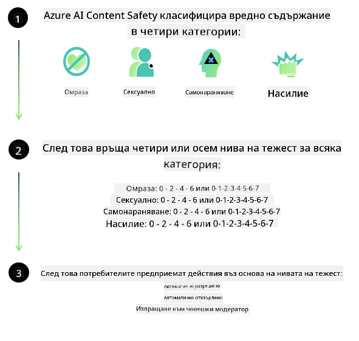
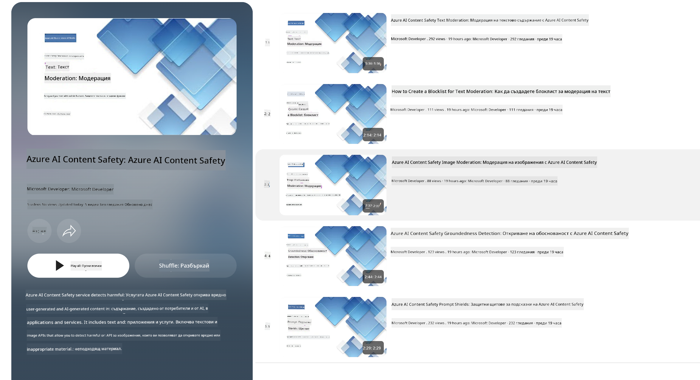

<!--
CO_OP_TRANSLATOR_METADATA:
{
  "original_hash": "c8273672cc57df2be675407a1383aaf0",
  "translation_date": "2025-07-16T17:53:21+00:00",
  "source_file": "md/01.Introduction/01/01.AISafety.md",
  "language_code": "bg"
}
-->
# AI безопасност за Phi модели  
Семейството модели Phi са разработени в съответствие с [Microsoft Responsible AI Standard](https://query.prod.cms.rt.microsoft.com/cms/api/am/binary/RE5cmFl), който представлява набор от изисквания на компанията, базирани на следните шест принципа: отчетност, прозрачност, справедливост, надеждност и безопасност, поверителност и сигурност, както и приобщаване, които формират [Принципите за отговорен AI на Microsoft](https://www.microsoft.com/ai/responsible-ai).

Подобно на предишните Phi модели, беше възприет многостранен подход за оценка на безопасността и обучение след тренировка с допълнителни мерки, отчитащи многоезичните възможности на това издание. Нашият подход към обучението за безопасност и оценките, включително тестване на множество езици и категории рискове, е описан в [Phi Safety Post-Training Paper](https://arxiv.org/abs/2407.13833). Въпреки че Phi моделите се възползват от този подход, разработчиците трябва да прилагат най-добрите практики за отговорен AI, включително картографиране, измерване и смекчаване на рисковете, свързани с конкретния им случай на употреба и културен и езиков контекст.

## Най-добри практики

Подобно на други модели, семейството Phi може потенциално да се държи по начини, които са несправедливи, ненадеждни или обидни.

Някои от ограниченията в поведението на SLM и LLM, за които трябва да сте наясно, включват:

- **Качество на услугата:** Phi моделите са обучени основно на английски текст. Езици, различни от английски, ще имат по-слаба производителност. Варианти на английски с по-малко представителство в тренировъчните данни може да имат по-лоша производителност в сравнение със стандартния американски английски.  
- **Представяне на вреди и поддържане на стереотипи:** Тези модели могат да над- или под-представят групи хора, да изтриват представителството на някои групи или да засилват унизителни или негативни стереотипи. Въпреки обучението за безопасност след тренировка, тези ограничения могат да продължат да съществуват поради различните нива на представителство на различни групи или наличието на примери за негативни стереотипи в тренировъчните данни, които отразяват реални модели и обществени пристрастия.  
- **Неподходящо или обидно съдържание:** Тези модели могат да генерират други видове неподходящо или обидно съдържание, което може да направи използването им неподходящо в чувствителни контексти без допълнителни мерки, специфични за случая на употреба.  
- **Надеждност на информацията:** Езиковите модели могат да генерират безсмислено съдържание или да измислят информация, която звучи разумно, но е неточна или остаряла.  
- **Ограничен обхват за код:** Повечето от тренировъчните данни на Phi-3 са базирани на Python и използват често срещани пакети като "typing, math, random, collections, datetime, itertools". Ако моделът генерира Python скриптове, които използват други пакети или скриптове на други езици, силно препоръчваме потребителите ръчно да проверяват всички използвани API.

Разработчиците трябва да прилагат най-добрите практики за отговорен AI и носят отговорност да гарантират, че конкретният случай на употреба отговаря на приложимите закони и регулации (например поверителност, търговия и др.).

## Съображения за отговорен AI

Подобно на други езикови модели, моделите от серията Phi могат потенциално да се държат по начини, които са несправедливи, ненадеждни или обидни. Някои от ограниченията, за които трябва да се внимава, включват:

**Качество на услугата:** Phi моделите са обучени основно на английски текст. Езици, различни от английски, ще имат по-слаба производителност. Варианти на английски с по-малко представителство в тренировъчните данни може да имат по-лоша производителност в сравнение със стандартния американски английски.

**Представяне на вреди и поддържане на стереотипи:** Тези модели могат да над- или под-представят групи хора, да изтриват представителството на някои групи или да засилват унизителни или негативни стереотипи. Въпреки обучението за безопасност след тренировка, тези ограничения могат да продължат да съществуват поради различните нива на представителство на различни групи или наличието на примери за негативни стереотипи в тренировъчните данни, които отразяват реални модели и обществени пристрастия.

**Неподходящо или обидно съдържание:** Тези модели могат да генерират други видове неподходящо или обидно съдържание, което може да направи използването им неподходящо в чувствителни контексти без допълнителни мерки, специфични за случая на употреба.  
Надеждност на информацията: Езиковите модели могат да генерират безсмислено съдържание или да измислят информация, която звучи разумно, но е неточна или остаряла.

**Ограничен обхват за код:** Повечето от тренировъчните данни на Phi-3 са базирани на Python и използват често срещани пакети като "typing, math, random, collections, datetime, itertools". Ако моделът генерира Python скриптове, които използват други пакети или скриптове на други езици, силно препоръчваме потребителите ръчно да проверяват всички използвани API.

Разработчиците трябва да прилагат най-добрите практики за отговорен AI и носят отговорност да гарантират, че конкретният случай на употреба отговаря на приложимите закони и регулации (например поверителност, търговия и др.). Важни области за разглеждане включват:

**Разпределение:** Моделите може да не са подходящи за ситуации, които могат да имат съществено въздействие върху правния статус или разпределението на ресурси или жизнени възможности (например жилище, заетост, кредит и др.) без допълнителни оценки и техники за намаляване на пристрастия.

**Високорискови сценарии:** Разработчиците трябва да оценят подходящостта на използването на модели в високорискови сценарии, където несправедливи, ненадеждни или обидни резултати могат да бъдат изключително скъпи или да доведат до вреда. Това включва предоставяне на съвети в чувствителни или експертни области, където точността и надеждността са критични (например правни или здравни съвети). Допълнителни мерки за защита трябва да се прилагат на ниво приложение според контекста на внедряване.

**Дезинформация:** Моделите могат да генерират неточна информация. Разработчиците трябва да следват най-добрите практики за прозрачност и да информират крайните потребители, че взаимодействат с AI система. На ниво приложение разработчиците могат да изградят механизми за обратна връзка и потоци за осигуряване на отговори, базирани на конкретна за случая информация, техника известна като Retrieval Augmented Generation (RAG).

**Генериране на вредно съдържание:** Разработчиците трябва да оценяват изходите в контекста им и да използват налични класификатори за безопасност или персонализирани решения, подходящи за техния случай на употреба.

**Злоупотреба:** Възможни са и други форми на злоупотреба като измами, спам или създаване на зловреден софтуер, затова разработчиците трябва да гарантират, че техните приложения не нарушават приложимите закони и регулации.

### Финетюнинг и безопасност на AI съдържанието

След финетюнинг на модел силно препоръчваме използването на мерки от [Azure AI Content Safety](https://learn.microsoft.com/azure/ai-services/content-safety/overview) за наблюдение на съдържанието, генерирано от моделите, идентифициране и блокиране на потенциални рискове, заплахи и проблеми с качеството.

[Azure AI Content Safety](https://learn.microsoft.com/azure/ai-services/content-safety/overview) поддържа както текстово, така и изображително съдържание. Може да бъде внедрена в облака, в изолирани контейнери и на edge/вградени устройства.

## Преглед на Azure AI Content Safety

Azure AI Content Safety не е универсално решение; може да бъде персонализирана, за да съответства на специфичните политики на бизнеса. Освен това, многозначните ѝ модели позволяват разпознаване на няколко езика едновременно.

- **Azure AI Content Safety**  
- **Microsoft Developer**  
- **5 видеа**

Услугата Azure AI Content Safety открива вредно съдържание, генерирано от потребители и AI, в приложения и услуги. Включва текстови и изображителни API, които позволяват откриване на вредно или неподходящо съдържание.

[AI Content Safety Playlist](https://www.youtube.com/playlist?list=PLlrxD0HtieHjaQ9bJjyp1T7FeCbmVcPkQ)

**Отказ от отговорност**:  
Този документ е преведен с помощта на AI преводаческа услуга [Co-op Translator](https://github.com/Azure/co-op-translator). Въпреки че се стремим към точност, моля, имайте предвид, че автоматизираните преводи могат да съдържат грешки или неточности. Оригиналният документ на неговия роден език трябва да се счита за авторитетен източник. За критична информация се препоръчва професионален човешки превод. Ние не носим отговорност за каквито и да е недоразумения или неправилни тълкувания, произтичащи от използването на този превод.