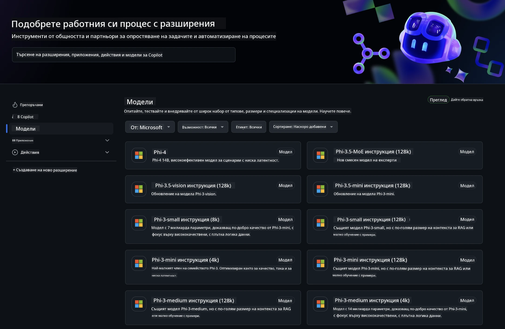
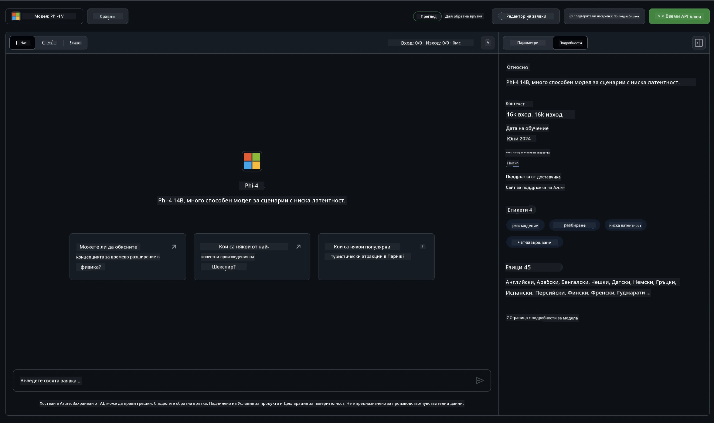
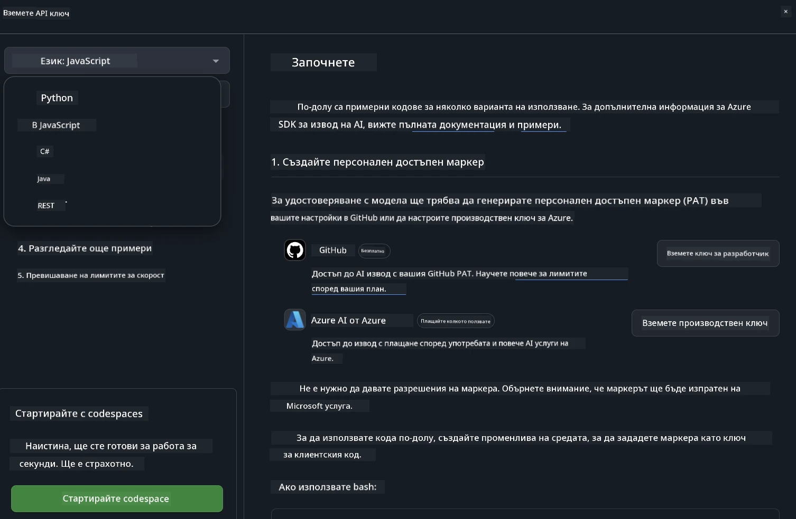
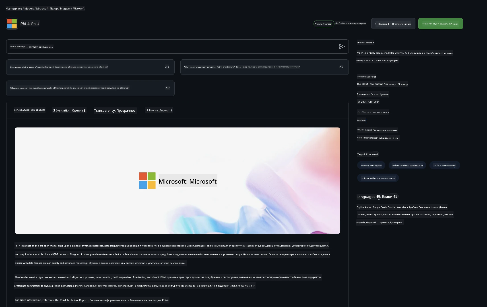

<!--
CO_OP_TRANSLATOR_METADATA:
{
  "original_hash": "fb67a08b9fc911a10ed58081fadef416",
  "translation_date": "2025-07-16T19:04:45+00:00",
  "source_file": "md/01.Introduction/02/02.GitHubModel.md",
  "language_code": "bg"
}
-->
## Phi Family в GitHub Models

Добре дошли в [GitHub Models](https://github.com/marketplace/models)! Всичко е готово за вас да разгледате AI модели, хоствани в Azure AI.



За повече информация относно моделите, налични в GitHub Models, разгледайте [GitHub Model Marketplace](https://github.com/marketplace/models)

## Налични модели

Всеки модел има собствен playground и примерен код



### Phi Family в GitHub Model Catalog

- [Phi-4](https://github.com/marketplace/models/azureml/Phi-4)

- [Phi-3.5-MoE instruct (128k)](https://github.com/marketplace/models/azureml/Phi-3-5-MoE-instruct)

- [Phi-3.5-vision instruct (128k)](https://github.com/marketplace/models/azureml/Phi-3-5-vision-instruct)

- [Phi-3.5-mini instruct (128k)](https://github.com/marketplace/models/azureml/Phi-3-5-mini-instruct)

- [Phi-3-Medium-128k-Instruct](https://github.com/marketplace/models/azureml/Phi-3-medium-128k-instruct)

- [Phi-3-medium-4k-instruct](https://github.com/marketplace/models/azureml/Phi-3-medium-4k-instruct)

- [Phi-3-mini-128k-instruct](https://github.com/marketplace/models/azureml/Phi-3-mini-128k-instruct)

- [Phi-3-mini-4k-instruct](https://github.com/marketplace/models/azureml/Phi-3-mini-4k-instruct)

- [Phi-3-small-128k-instruct](https://github.com/marketplace/models/azureml/Phi-3-small-128k-instruct)

- [Phi-3-small-8k-instruct](https://github.com/marketplace/models/azureml/Phi-3-small-8k-instruct)

## Започване

Има няколко основни примера, готови за изпълнение. Можете да ги намерите в директорията samples. Ако искате да преминете директно към предпочитания от вас език, примерите са налични на следните езици:

- Python
- JavaScript
- C#
- Java
- cURL

Има и специална среда Codespaces за изпълнение на примерите и моделите.



## Примерен код

По-долу са примерни кодови откъси за няколко случая на употреба. За допълнителна информация относно Azure AI Inference SDK, вижте пълната документация и примери.

## Настройка

1. Създайте личен достъп токен  
Не е необходимо да задавате никакви разрешения на токена. Обърнете внимание, че токенът ще бъде изпратен до услуга на Microsoft.

За да използвате кодовите откъси по-долу, създайте променлива на средата, в която задайте вашия токен като ключ за клиентския код.

Ако използвате bash:  
```
export GITHUB_TOKEN="<your-github-token-goes-here>"
```  
Ако сте в powershell:  

```
$Env:GITHUB_TOKEN="<your-github-token-goes-here>"
```  

Ако използвате Windows command prompt:  

```
set GITHUB_TOKEN=<your-github-token-goes-here>
```  

## Python пример

### Инсталиране на зависимости  
Инсталирайте Azure AI Inference SDK чрез pip (Изисква: Python >=3.8):  

```
pip install azure-ai-inference
```  
### Изпълнение на основен примерен код

Този пример показва основно извикване на chat completion API. Използва се GitHub AI модел inference endpoint и вашия GitHub токен. Извикването е синхронно.

```python
import os
from azure.ai.inference import ChatCompletionsClient
from azure.ai.inference.models import SystemMessage, UserMessage
from azure.core.credentials import AzureKeyCredential

endpoint = "https://models.inference.ai.azure.com"
model_name = "Phi-4"
token = os.environ["GITHUB_TOKEN"]

client = ChatCompletionsClient(
    endpoint=endpoint,
    credential=AzureKeyCredential(token),
)

response = client.complete(
    messages=[
        UserMessage(content="I have $20,000 in my savings account, where I receive a 4% profit per year and payments twice a year. Can you please tell me how long it will take for me to become a millionaire? Also, can you please explain the math step by step as if you were explaining it to an uneducated person?"),
    ],
    temperature=0.4,
    top_p=1.0,
    max_tokens=2048,
    model=model_name
)

print(response.choices[0].message.content)
```

### Изпълнение на многоредов разговор

Този пример демонстрира многоредов разговор с chat completion API. При използване на модела за чат приложение, трябва да управлявате историята на разговора и да изпращате последните съобщения към модела.

```
import os
from azure.ai.inference import ChatCompletionsClient
from azure.ai.inference.models import AssistantMessage, SystemMessage, UserMessage
from azure.core.credentials import AzureKeyCredential

token = os.environ["GITHUB_TOKEN"]
endpoint = "https://models.inference.ai.azure.com"
# Replace Model_Name
model_name = "Phi-4"

client = ChatCompletionsClient(
    endpoint=endpoint,
    credential=AzureKeyCredential(token),
)

messages = [
    SystemMessage(content="You are a helpful assistant."),
    UserMessage(content="What is the capital of France?"),
    AssistantMessage(content="The capital of France is Paris."),
    UserMessage(content="What about Spain?"),
]

response = client.complete(messages=messages, model=model_name)

print(response.choices[0].message.content)
```

### Поточно извеждане

За по-добро потребителско изживяване, ще искате да предавате отговора на модела на части, така че първият токен да се появи рано и да избегнете чакане за дълги отговори.

```
import os
from azure.ai.inference import ChatCompletionsClient
from azure.ai.inference.models import SystemMessage, UserMessage
from azure.core.credentials import AzureKeyCredential

token = os.environ["GITHUB_TOKEN"]
endpoint = "https://models.inference.ai.azure.com"
# Replace Model_Name
model_name = "Phi-4"

client = ChatCompletionsClient(
    endpoint=endpoint,
    credential=AzureKeyCredential(token),
)

response = client.complete(
    stream=True,
    messages=[
        SystemMessage(content="You are a helpful assistant."),
        UserMessage(content="Give me 5 good reasons why I should exercise every day."),
    ],
    model=model_name,
)

for update in response:
    if update.choices:
        print(update.choices[0].delta.content or "", end="")

client.close()
```

## Безплатна употреба и ограничения за GitHub Models



[Ограниченията за playground и безплатната API употреба](https://docs.github.com/en/github-models/prototyping-with-ai-models#rate-limits) са предназначени да ви помогнат да експериментирате с модели и да прототипирате вашето AI приложение. За използване извън тези ограничения и за мащабиране на приложението, трябва да осигурите ресурси от Azure акаунт и да се удостоверите оттам, вместо с вашия GitHub личен достъп токен. Не е необходимо да променяте нищо друго в кода си. Използвайте тази връзка, за да разберете как да преминете отвъд безплатните лимити в Azure AI.

### Разкрития

Имайте предвид, че при взаимодействие с модел вие експериментирате с AI, затова са възможни грешки в съдържанието.

Функцията е подложена на различни ограничения (включително заявки в минута, заявки на ден, токени на заявка и едновременни заявки) и не е предназначена за производствени случаи.

GitHub Models използва Azure AI Content Safety. Тези филтри не могат да бъдат изключвани като част от GitHub Models. Ако решите да използвате модели чрез платена услуга, моля, конфигурирайте филтрите за съдържание според вашите изисквания.

Тази услуга е под GitHub Pre-release Terms.

**Отказ от отговорност**:  
Този документ е преведен с помощта на AI преводаческа услуга [Co-op Translator](https://github.com/Azure/co-op-translator). Въпреки че се стремим към точност, моля, имайте предвид, че автоматизираните преводи могат да съдържат грешки или неточности. Оригиналният документ на неговия роден език трябва да се счита за авторитетен източник. За критична информация се препоръчва професионален човешки превод. Ние не носим отговорност за каквито и да е недоразумения или неправилни тълкувания, произтичащи от използването на този превод.