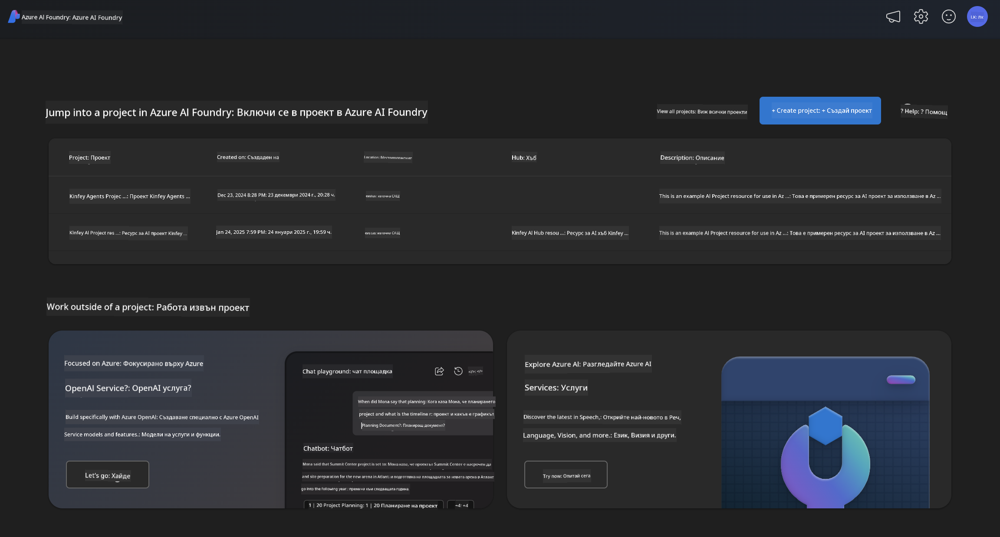
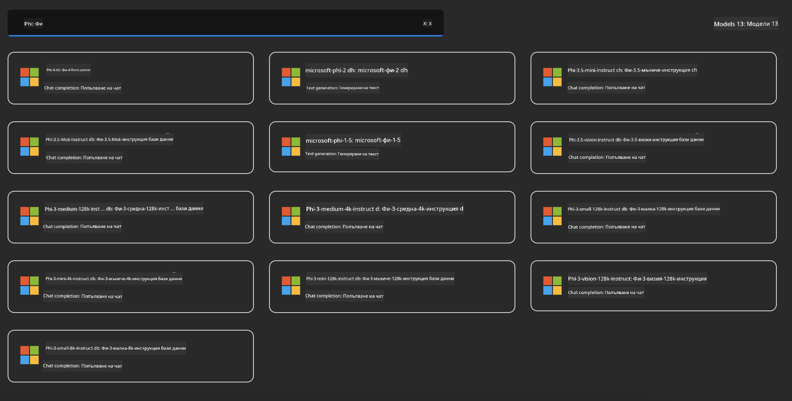
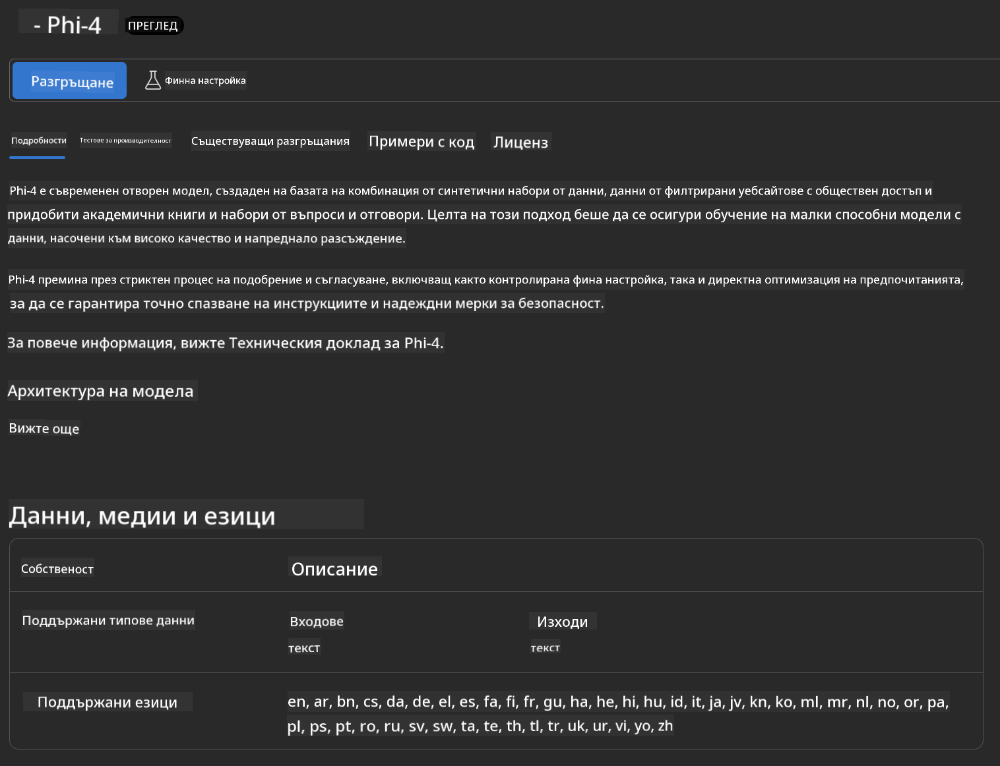
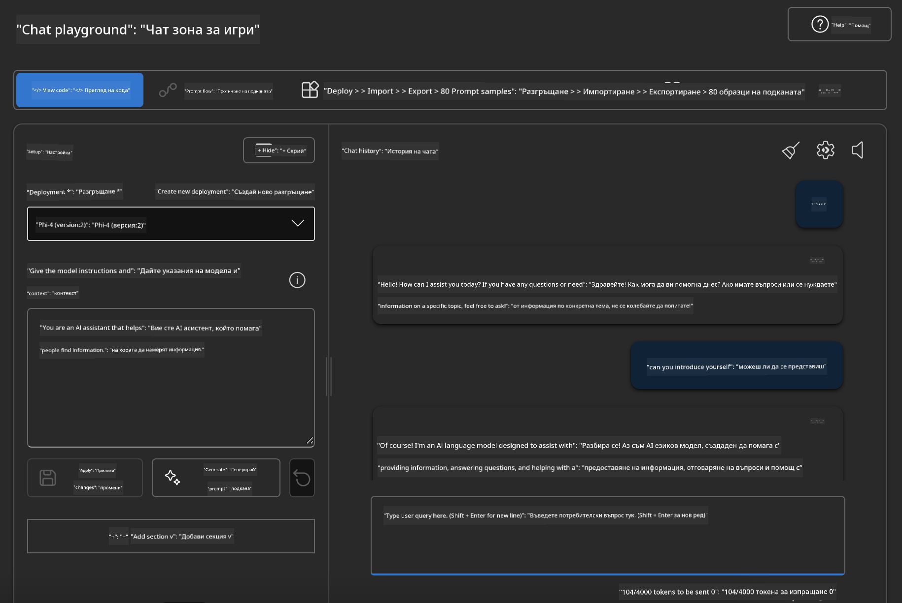

<!--
CO_OP_TRANSLATOR_METADATA:
{
  "original_hash": "3ae21dc5554e888defbe57946ee995ee",
  "translation_date": "2025-05-09T09:10:00+00:00",
  "source_file": "md/01.Introduction/02/03.AzureAIFoundry.md",
  "language_code": "bg"
}
-->
## Phi фамилия в Azure AI Foundry

[Azure AI Foundry](https://ai.azure.com) е надеждна платформа, която дава възможност на разработчиците да стимулират иновациите и да оформят бъдещето с изкуствен интелект по безопасен, сигурен и отговорен начин.

[Azure AI Foundry](https://ai.azure.com) е създадена за разработчици, които искат да:

- Създават генеративни AI приложения върху корпоративна платформа.
- Изследват, изграждат, тестват и внедряват с помощта на най-съвременни AI инструменти и ML модели, базирани на отговорни практики за AI.
- Работят в екип през целия жизнен цикъл на разработка на приложения.

С Azure AI Foundry можете да разгледате голямо разнообразие от модели, услуги и възможности и да започнете да създавате AI приложения, които най-добре отговарят на вашите цели. Платформата Azure AI Foundry улеснява мащабирането при превръщане на концепции в пълноценни производствени приложения. Непрекъснатото наблюдение и усъвършенстване подпомагат дългосрочния успех.



Освен използването на Azure AOAI Service в Azure AI Foundry, можете също да използвате модели от трети страни в Azure AI Foundry Model Catalog. Това е добър избор, ако искате да използвате Azure AI Foundry като платформа за вашето AI решение.

Можем бързо да внедрим Phi Family модели чрез Model Catalog в Azure AI Foundry

[Microsoft Phi Models in Azure AI Foundry Models](https://ai.azure.com/explore/models/?selectedCollection=phi)



### **Внедряване на Phi-4 в Azure AI Foundry**



### **Тестване на Phi-4 в Azure AI Foundry Playground**



### **Изпълнение на Python код за извикване на Azure AI Foundry Phi-4**

```python

import os  
import base64
from openai import AzureOpenAI  
from azure.identity import DefaultAzureCredential, get_bearer_token_provider  
        
endpoint = os.getenv("ENDPOINT_URL", "Your Azure AOAI Service Endpoint")  
deployment = os.getenv("DEPLOYMENT_NAME", "Phi-4")  
      
token_provider = get_bearer_token_provider(  
    DefaultAzureCredential(),  
    "https://cognitiveservices.azure.com/.default"  
)  
  
client = AzureOpenAI(  
    azure_endpoint=endpoint,  
    azure_ad_token_provider=token_provider,  
    api_version="2024-05-01-preview",  
)  
  

chat_prompt = [
    {
        "role": "system",
        "content": "You are an AI assistant that helps people find information."
    },
    {
        "role": "user",
        "content": "can you introduce yourself"
    }
] 
    
# Include speech result if speech is enabled  
messages = chat_prompt 

completion = client.chat.completions.create(  
    model=deployment,  
    messages=messages,
    max_tokens=800,  
    temperature=0.7,  
    top_p=0.95,  
    frequency_penalty=0,  
    presence_penalty=0,
    stop=None,  
    stream=False  
)  
  
print(completion.to_json())  

```

**Отказ от отговорност**:  
Този документ е преведен с помощта на AI преводаческа услуга [Co-op Translator](https://github.com/Azure/co-op-translator). Въпреки че се стремим към точност, моля, имайте предвид, че автоматизираните преводи могат да съдържат грешки или неточности. Оригиналният документ на неговия език трябва да се счита за авторитетен източник. За критична информация се препоръчва професионален човешки превод. Ние не носим отговорност за каквито и да е недоразумения или неправилни тълкувания, произтичащи от използването на този превод.