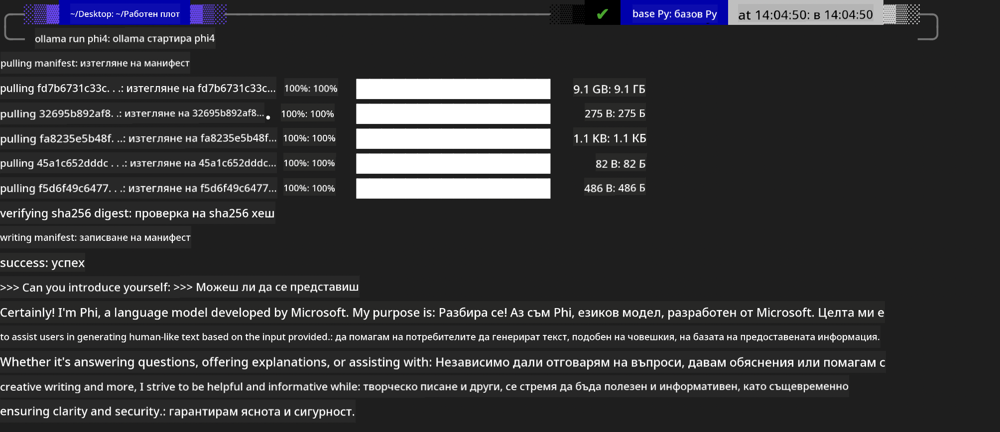
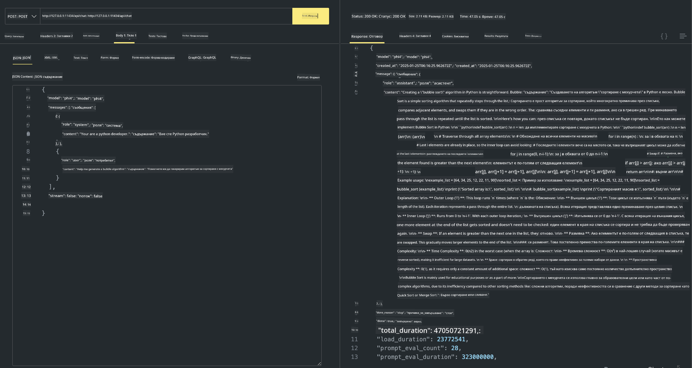

<!--
CO_OP_TRANSLATOR_METADATA:
{
  "original_hash": "0b38834693bb497f96bf53f0d941f9a1",
  "translation_date": "2025-05-09T09:24:34+00:00",
  "source_file": "md/01.Introduction/02/04.Ollama.md",
  "language_code": "bg"
}
-->
## Phi фамилия в Ollama


[Ollama](https://ollama.com) позволява на повече хора директно да разгръщат отворени LLM или SLM чрез прости скриптове и също така може да създава API-та за подпомагане на локални приложения като Copilot.

## **1. Инсталация**

Ollama поддържа работа на Windows, macOS и Linux. Можете да инсталирате Ollama чрез този линк ([https://ollama.com/download](https://ollama.com/download)). След успешна инсталация, можете директно да използвате Ollama скрипт за извикване на Phi-3 през терминален прозорец. Можете да видите всички [налични библиотеки в Ollama](https://ollama.com/library). Ако отворите това хранилище в Codespace, Ollama вече ще е инсталиран.

```bash

ollama run phi4

```

> [!NOTE]
> Моделът ще бъде изтеглен при първото му стартиране. Разбира се, можете и директно да посочите вече изтегления Phi-4 модел. Като пример използваме WSL за изпълнение на командата. След като моделът се изтегли успешно, можете да взаимодействате директно в терминала.



## **2. Извикване на phi-4 API от Ollama**

Ако искате да извикате Phi-4 API, генериран от Ollama, можете да използвате тази команда в терминала, за да стартирате Ollama сървъра.

```bash

ollama serve

```

> [!NOTE]
> Ако работите с MacOS или Linux, имайте предвид, че може да срещнете следната грешка **"Error: listen tcp 127.0.0.1:11434: bind: address already in use"** при изпълнение на командата. Можете да игнорирате тази грешка, тъй като обикновено означава, че сървърът вече работи, или можете да го спрете и рестартирате Ollama:

**macOS**

```bash

brew services restart ollama

```

**Linux**

```bash

sudo systemctl stop ollama

```

Ollama поддържа два API-та: generate и chat. Можете да извиквате моделните API-та, които Ollama предоставя, според нуждите си, като изпращате заявки към локалната услуга, работеща на порт 11434.

**Chat**

```bash

curl http://127.0.0.1:11434/api/chat -d '{
  "model": "phi3",
  "messages": [
    {
      "role": "system",
      "content": "Your are a python developer."
    },
    {
      "role": "user",
      "content": "Help me generate a bubble algorithm"
    }
  ],
  "stream": false
  
}'

This is the result in Postman



## Additional Resources

Check the list of available models in Ollama in [their library](https://ollama.com/library).

Pull your model from the Ollama server using this command

```bash
ollama pull phi4
```

Run the model using this command

```bash
ollama run phi4
```

***Note:*** Visit this link [https://github.com/ollama/ollama/blob/main/docs/api.md](https://github.com/ollama/ollama/blob/main/docs/api.md) to learn more

## Calling Ollama from Python

You can use `requests` or `urllib3` to make requests to the local server endpoints used above. However, a popular way to use Ollama in Python is via the [openai](https://pypi.org/project/openai/) SDK, since Ollama provides OpenAI-compatible server endpoints as well.

Here is an example for phi3-mini:

```python
import openai

client = openai.OpenAI(
    base_url="http://localhost:11434/v1",
    api_key="nokeyneeded",
)

response = client.chat.completions.create(
    model="phi4",
    temperature=0.7,
    n=1,
    messages=[
        {"role": "system", "content": "You are a helpful assistant."},
        {"role": "user", "content": "Write a haiku about a hungry cat"},
    ],
)

print("Response:")
print(response.choices[0].message.content)
```

## Calling Ollama from JavaScript 

```javascript
// Пример за обобщаване на файл с Phi-4
script({
    model: "ollama:phi4",
    title: "Обобщаване с Phi-4",
    system: ["system"],
})

// Пример за обобщаване
const file = def("FILE", env.files)
$`Summarize ${file} in a single paragraph.`
```

## Calling Ollama from C#

Create a new C# Console application and add the following NuGet package:

```bash
dotnet add package Microsoft.SemanticKernel --version 1.34.0
```

Then replace this code in the `Program.cs` file

```csharp
using Microsoft.SemanticKernel;
using Microsoft.SemanticKernel.ChatCompletion;

// добавяне на чат услуга с помощта на локалния Ollama сървър
#pragma warning disable SKEXP0001, SKEXP0003, SKEXP0010, SKEXP0011, SKEXP0050, SKEXP0052
builder.AddOpenAIChatCompletion(
    modelId: "phi4",
    endpoint: new Uri("http://localhost:11434/"),
    apiKey: "non required");

// извикване на прост prompt към чат услугата
string prompt = "Write a joke about kittens";
var response = await kernel.InvokePromptAsync(prompt);
Console.WriteLine(response.GetValue<string>());
```

Run the app with the command:

```bash
dotnet run

**Отказ от отговорност**:  
Този документ е преведен с помощта на AI преводаческа услуга [Co-op Translator](https://github.com/Azure/co-op-translator). Въпреки че се стремим към точност, моля, имайте предвид, че автоматизираните преводи могат да съдържат грешки или неточности. Оригиналният документ на неговия роден език трябва да се счита за авторитетен източник. За критична информация се препоръчва професионален човешки превод. Ние не носим отговорност за каквито и да е недоразумения или погрешни тълкувания, произтичащи от използването на този превод.