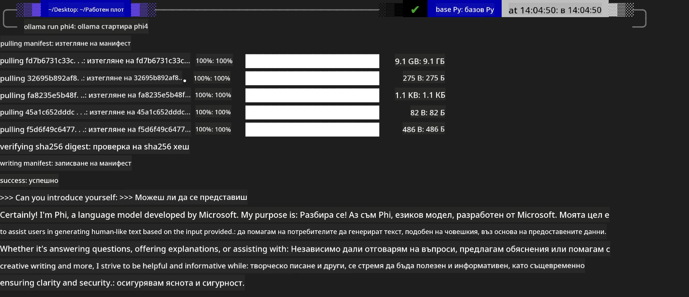
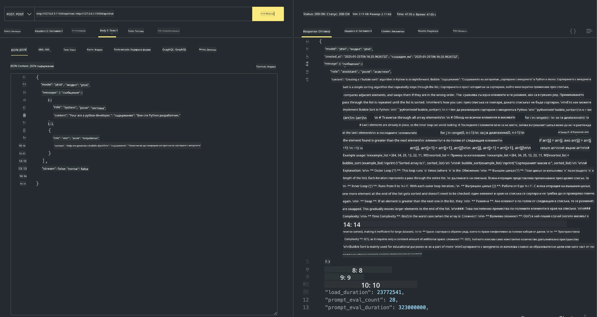

## Семейство Phi в Ollama


[Ollama](https://ollama.com) позволява на повече хора да разгръщат директно отворени LLM или SLM чрез прости скриптове, както и да изгражда API-та за подпомагане на локални сценарии на приложения тип Copilot.

## **1. Инсталация**

Ollama поддържа работа на Windows, macOS и Linux. Можете да инсталирате Ollama чрез този линк ([https://ollama.com/download](https://ollama.com/download)). След успешна инсталация можете директно да използвате скрипта на Ollama, за да извикате Phi-3 през терминален прозорец. Можете да видите всички [налични библиотеки в Ollama](https://ollama.com/library). Ако отворите това хранилище в Codespace, то вече ще има инсталиран Ollama.

```bash

ollama run phi4

```

> [!NOTE]
> Моделът ще бъде изтеглен при първото му стартиране. Разбира се, можете и директно да посочите вече изтегления Phi-4 модел. Като пример използваме WSL за изпълнение на командата. След като моделът е успешно изтеглен, можете да взаимодействате директно в терминала.



## **2. Извикване на phi-4 API от Ollama**

Ако искате да извикате Phi-4 API, генерирано от ollama, можете да използвате тази команда в терминала, за да стартирате Ollama сървъра.

```bash

ollama serve

```

> [!NOTE]
> Ако работите на MacOS или Linux, обърнете внимание, че може да срещнете следната грешка **"Error: listen tcp 127.0.0.1:11434: bind: address already in use"**. Може да получите тази грешка при изпълнение на командата. Можете или да игнорирате тази грешка, тъй като обикновено означава, че сървърът вече работи, или да спрете и рестартирате Ollama:

**macOS**

```bash

brew services restart ollama

```

**Linux**

```bash

sudo systemctl stop ollama

```

Ollama поддържа два API-та: generate и chat. Можете да извиквате моделния API, предоставен от Ollama, според нуждите си, като изпращате заявки към локалната услуга, работеща на порт 11434.

**Chat**

```bash

curl http://127.0.0.1:11434/api/chat -d '{
  "model": "phi3",
  "messages": [
    {
      "role": "system",
      "content": "Your are a python developer."
    },
    {
      "role": "user",
      "content": "Help me generate a bubble algorithm"
    }
  ],
  "stream": false
  
}'
```

Това е резултатът в Postman



## Допълнителни ресурси

Проверете списъка с налични модели в Ollama в [тяхната библиотека](https://ollama.com/library).

Изтеглете своя модел от Ollama сървъра, като използвате тази команда

```bash
ollama pull phi4
```

Стартирайте модела, използвайки тази команда

```bash
ollama run phi4
```

***Бележка:*** Посетете този линк [https://github.com/ollama/ollama/blob/main/docs/api.md](https://github.com/ollama/ollama/blob/main/docs/api.md), за да научите повече

## Извикване на Ollama от Python

Можете да използвате `requests` или `urllib3`, за да правите заявки към локалните сървърни крайни точки, използвани по-горе. Въпреки това, популярен начин за използване на Ollama в Python е чрез SDK-а [openai](https://pypi.org/project/openai/), тъй като Ollama също предоставя съвместими със OpenAI сървърни крайни точки.

Ето пример за phi3-mini:

```python
import openai

client = openai.OpenAI(
    base_url="http://localhost:11434/v1",
    api_key="nokeyneeded",
)

response = client.chat.completions.create(
    model="phi4",
    temperature=0.7,
    n=1,
    messages=[
        {"role": "system", "content": "You are a helpful assistant."},
        {"role": "user", "content": "Write a haiku about a hungry cat"},
    ],
)

print("Response:")
print(response.choices[0].message.content)
```

## Извикване на Ollama от JavaScript 
```javascript
// Пример за обобщаване на файл с Phi-4
script({
    model: "ollama:phi4",
    title: "Summarize with Phi-4",
    system: ["system"],
})

// Пример за обобщаване
const file = def("FILE", env.files)
$`Summarize ${file} in a single paragraph.`
```

## Извикване на Ollama от C#

Създайте ново C# конзолно приложение и добавете следния NuGet пакет:

```bash
dotnet add package Microsoft.SemanticKernel --version 1.34.0
```

След това заменете този код във файла `Program.cs`

```csharp
using Microsoft.SemanticKernel;
using Microsoft.SemanticKernel.ChatCompletion;

// add chat completion service using the local ollama server endpoint
#pragma warning disable SKEXP0001, SKEXP0003, SKEXP0010, SKEXP0011, SKEXP0050, SKEXP0052
builder.AddOpenAIChatCompletion(
    modelId: "phi4",
    endpoint: new Uri("http://localhost:11434/"),
    apiKey: "non required");

// invoke a simple prompt to the chat service
string prompt = "Write a joke about kittens";
var response = await kernel.InvokePromptAsync(prompt);
Console.WriteLine(response.GetValue<string>());
```

Стартирайте приложението с командата:

```bash
dotnet run
```

---

<!-- CO-OP TRANSLATOR DISCLAIMER START -->
Отказ от отговорност:
Този документ е преведен с помощта на AI преводаческа услуга [Co-op Translator] (https://github.com/Azure/co-op-translator). Въпреки че се стремим към точност, имайте предвид, че автоматизираните преводи могат да съдържат грешки или неточности. Оригиналният документ на оригиналния език трябва да се счита за авторитетен източник. За критична информация се препоръчва професионален човешки превод. Не носим отговорност за каквито и да е недоразумения или неправилни тълкувания, произтичащи от използването на този превод.
<!-- CO-OP TRANSLATOR DISCLAIMER END -->