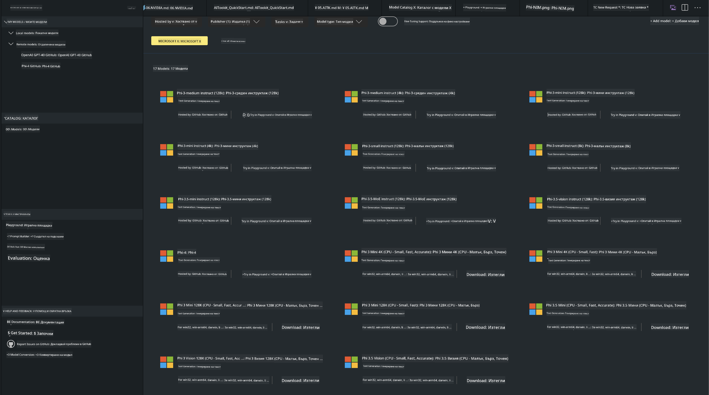
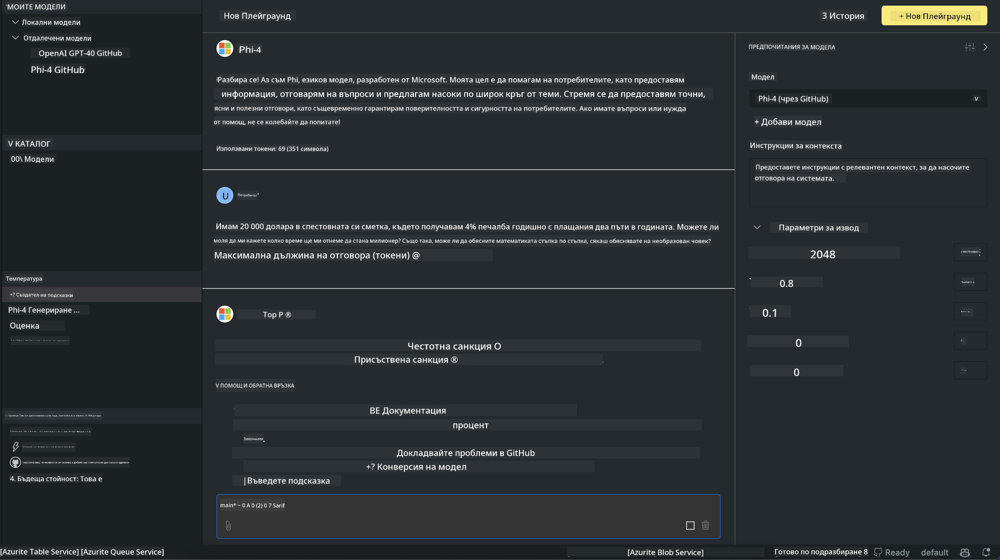

<!--
CO_OP_TRANSLATOR_METADATA:
{
  "original_hash": "4951d458c0b60c02cd1e751b40903877",
  "translation_date": "2025-07-16T19:30:30+00:00",
  "source_file": "md/01.Introduction/02/05.AITK.md",
  "language_code": "bg"
}
-->
# Phi Family в AITK

[AI Toolkit за VS Code](https://marketplace.visualstudio.com/items?itemName=ms-windows-ai-studio.windows-ai-studio) улеснява разработката на генеративни AI приложения, като обединява най-съвременни инструменти и модели за AI от Azure AI Foundry Catalog и други каталози като Hugging Face. Ще можете да разглеждате каталога с AI модели, захранван от GitHub Models и Azure AI Foundry Model Catalogs, да ги изтегляте локално или отдалечено, да ги донастройвате, тествате и използвате във вашето приложение.

AI Toolkit Preview ще работи локално. Локалното извеждане или донастройване зависи от избрания модел, като може да се изисква GPU, например NVIDIA CUDA GPU. Можете също да стартирате GitHub Models директно с AITK.

## Започване

[Научете повече как да инсталирате Windows subsystem за Linux](https://learn.microsoft.com/windows/wsl/install?WT.mc_id=aiml-137032-kinfeylo)

и [как да смените подразбиращата се дистрибуция](https://learn.microsoft.com/windows/wsl/install#change-the-default-linux-distribution-installed).

[AI Toolkit GitHub хранилище](https://github.com/microsoft/vscode-ai-toolkit/)

- Windows, Linux, macOS

- За донастройване както на Windows, така и на Linux, ще ви е необходим Nvidia GPU. Освен това, **Windows** изисква subsystem за Linux с дистрибуция Ubuntu 18.4 или по-нова. [Научете повече как да инсталирате Windows subsystem за Linux](https://learn.microsoft.com/windows/wsl/install) и [как да смените подразбиращата се дистрибуция](https://learn.microsoft.com/windows/wsl/install#change-the-default-linux-distribution-installed).

### Инсталиране на AI Toolkit

AI Toolkit се доставя като [разширение за Visual Studio Code](https://code.visualstudio.com/docs/setup/additional-components#_vs-code-extensions), затова първо трябва да инсталирате [VS Code](https://code.visualstudio.com/docs/setup/windows?WT.mc_id=aiml-137032-kinfeylo) и да изтеглите AI Toolkit от [VS Marketplace](https://marketplace.visualstudio.com/items?itemName=ms-windows-ai-studio.windows-ai-studio).  
[AI Toolkit е наличен в Visual Studio Marketplace](https://marketplace.visualstudio.com/items?itemName=ms-windows-ai-studio.windows-ai-studio) и може да бъде инсталиран като всяко друго разширение за VS Code.

Ако не сте запознати с инсталирането на разширения за VS Code, следвайте тези стъпки:

### Вход в системата

1. В Activity Bar на VS Code изберете **Extensions**  
1. В полето за търсене на разширения напишете "AI Toolkit"  
1. Изберете "AI Toolkit for Visual Studio code"  
1. Натиснете **Install**

Сега сте готови да използвате разширението!

Ще бъдете подканени да влезете в GitHub, затова кликнете "Allow", за да продължите. Ще бъдете пренасочени към страницата за вход в GitHub.

Моля, влезте и следвайте стъпките. След успешното приключване ще бъдете върнати обратно в VS Code.

След инсталирането на разширението ще видите иконата на AI Toolkit в Activity Bar.

Нека разгледаме наличните действия!

### Налични действия

Основната странична лента на AI Toolkit е организирана в  

- **Models**  
- **Resources**  
- **Playground**  
- **Fine-tuning**  
- **Evaluation**

Налични са в секцията Resources. За да започнете, изберете **Model Catalog**.

### Изтегляне на модел от каталога

След стартиране на AI Toolkit от страничната лента на VS Code, можете да изберете от следните опции:



- Намерете поддържан модел в **Model Catalog** и го изтеглете локално  
- Тествайте извеждането на модела в **Model Playground**  
- Донастройте модела локално или отдалечено в **Model Fine-tuning**  
- Разположете донастроени модели в облака чрез командния палитра на AI Toolkit  
- Оценка на модели

> [!NOTE]
>
> **GPU срещу CPU**
>
> Ще забележите, че картите на моделите показват размера на модела, платформата и типа ускорител (CPU, GPU). За оптимална производителност на **Windows устройства с поне един GPU**, изберете версии на моделите, които са насочени само към Windows.
>
> Това гарантира, че имате модел, оптимизиран за DirectML ускорител.
>
> Имената на моделите са във формат
>
> - `{model_name}-{accelerator}-{quantization}-{format}`.
>
>За да проверите дали имате GPU на вашето Windows устройство, отворете **Task Manager** и изберете таба **Performance**. Ако имате GPU(та), те ще бъдат изброени под имена като "GPU 0" или "GPU 1".

### Стартиране на модела в playground

След като всички параметри са зададени, натиснете **Generate Project**.

След като моделът се изтегли, изберете **Load in Playground** на картата на модела в каталога:

- Стартиране на изтеглянето на модела  
- Инсталиране на всички необходими зависимости  
- Създаване на работно пространство във VS Code



### Използване на REST API във вашето приложение

AI Toolkit идва с локален REST API уеб сървър **на порт 5272**, който използва [формата за чат завършвания на OpenAI](https://platform.openai.com/docs/api-reference/chat/create).

Това ви позволява да тествате приложението си локално, без да разчитате на облачна AI услуга. Например, следният JSON файл показва как да конфигурирате тялото на заявката:

```json
{
    "model": "Phi-4",
    "messages": [
        {
            "role": "user",
            "content": "what is the golden ratio?"
        }
    ],
    "temperature": 0.7,
    "top_p": 1,
    "top_k": 10,
    "max_tokens": 100,
    "stream": true
}
```

Можете да тествате REST API с помощта на (например) [Postman](https://www.postman.com/) или CURL (Client URL) инструмент:

```bash
curl -vX POST http://127.0.0.1:5272/v1/chat/completions -H 'Content-Type: application/json' -d @body.json
```

### Използване на OpenAI клиентската библиотека за Python

```python
from openai import OpenAI

client = OpenAI(
    base_url="http://127.0.0.1:5272/v1/", 
    api_key="x" # required for the API but not used
)

chat_completion = client.chat.completions.create(
    messages=[
        {
            "role": "user",
            "content": "what is the golden ratio?",
        }
    ],
    model="Phi-4",
)

print(chat_completion.choices[0].message.content)
```

### Използване на Azure OpenAI клиентската библиотека за .NET

Добавете [Azure OpenAI клиентската библиотека за .NET](https://www.nuget.org/packages/Azure.AI.OpenAI/) към вашия проект чрез NuGet:

```bash
dotnet add {project_name} package Azure.AI.OpenAI --version 1.0.0-beta.17
```

Добавете C# файл с име **OverridePolicy.cs** към проекта и поставете следния код:

```csharp
// OverridePolicy.cs
using Azure.Core.Pipeline;
using Azure.Core;

internal partial class OverrideRequestUriPolicy(Uri overrideUri)
    : HttpPipelineSynchronousPolicy
{
    private readonly Uri _overrideUri = overrideUri;

    public override void OnSendingRequest(HttpMessage message)
    {
        message.Request.Uri.Reset(_overrideUri);
    }
}
```

След това поставете следния код във вашия **Program.cs** файл:

```csharp
// Program.cs
using Azure.AI.OpenAI;

Uri localhostUri = new("http://localhost:5272/v1/chat/completions");

OpenAIClientOptions clientOptions = new();
clientOptions.AddPolicy(
    new OverrideRequestUriPolicy(localhostUri),
    Azure.Core.HttpPipelinePosition.BeforeTransport);
OpenAIClient client = new(openAIApiKey: "unused", clientOptions);

ChatCompletionsOptions options = new()
{
    DeploymentName = "Phi-4",
    Messages =
    {
        new ChatRequestSystemMessage("You are a helpful assistant. Be brief and succinct."),
        new ChatRequestUserMessage("What is the golden ratio?"),
    }
};

StreamingResponse<StreamingChatCompletionsUpdate> streamingChatResponse
    = await client.GetChatCompletionsStreamingAsync(options);

await foreach (StreamingChatCompletionsUpdate chatChunk in streamingChatResponse)
{
    Console.Write(chatChunk.ContentUpdate);
}
```


## Донастройване с AI Toolkit

- Започнете с откриване на модели и playground.  
- Донастройване и извеждане на модели с локални изчислителни ресурси.  
- Отдалечено донастройване и извеждане с помощта на Azure ресурси.

[Донастройване с AI Toolkit](../../03.FineTuning/Finetuning_VSCodeaitoolkit.md)

## Ресурси за въпроси и отговори за AI Toolkit

Моля, посетете нашата [страница с въпроси и отговори](https://github.com/microsoft/vscode-ai-toolkit/blob/main/archive/QA.md) за най-често срещаните проблеми и решения.

**Отказ от отговорност**:  
Този документ е преведен с помощта на AI преводаческа услуга [Co-op Translator](https://github.com/Azure/co-op-translator). Въпреки че се стремим към точност, моля, имайте предвид, че автоматизираните преводи могат да съдържат грешки или неточности. Оригиналният документ на неговия роден език трябва да се счита за авторитетен източник. За критична информация се препоръчва професионален човешки превод. Ние не носим отговорност за каквито и да е недоразумения или неправилни тълкувания, произтичащи от използването на този превод.