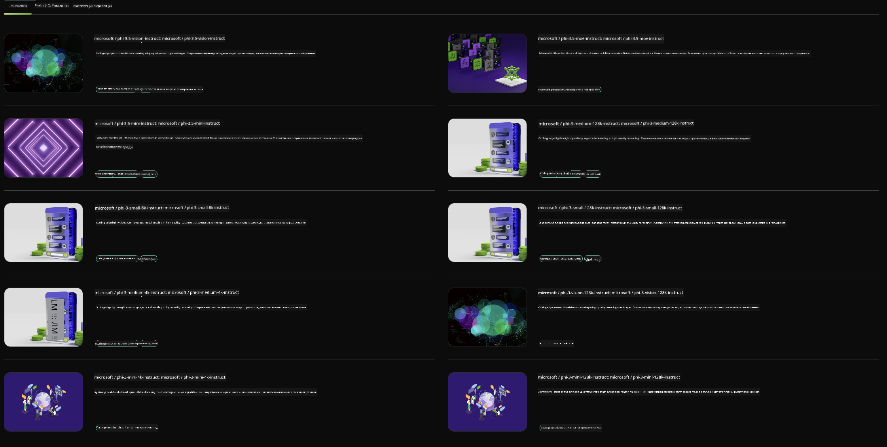

<!--
CO_OP_TRANSLATOR_METADATA:
{
  "original_hash": "7b08e277df2a9307f861ae54bc30c772",
  "translation_date": "2025-05-09T10:03:23+00:00",
  "source_file": "md/01.Introduction/02/06.NVIDIA.md",
  "language_code": "bg"
}
-->
## Phi Family в NVIDIA NIM

NVIDIA NIM е набор от лесни за използване микросървиси, предназначени да ускорят разгръщането на генеративни AI модели в облака, в центрове за данни и на работни станции. NIM са категоризирани по семейство модели и по отделни модели. Например, NVIDIA NIM за големи езикови модели (LLMs) предоставя мощта на най-съвременните LLM към корпоративни приложения, осигурявайки ненадминати възможности за обработка и разбиране на естествен език.

NIM улеснява IT и DevOps екипите да хостват сами големи езикови модели (LLMs) в собствените си управлявани среди, като същевременно предоставя на разработчиците индустриални стандарти API-та, които им позволяват да създават мощни копилоти, чатботове и AI асистенти, които могат да трансформират бизнеса им. Използвайки водещото GPU ускорение на NVIDIA и мащабируемото разгръщане, NIM предлага най-бързия път до инференция с ненадмината производителност.

Можете да използвате NVIDIA NIM за инференция на Phi Family модели



### **Примери - Phi-3-Vision в NVIDIA NIM**

Представете си, че имате изображение (`demo.png`) и искате да генерирате Python код, който обработва това изображение и записва нова версия на файла (`phi-3-vision.jpg`).

Горният код автоматизира този процес чрез:

1. Настройване на средата и необходимите конфигурации.
2. Създаване на промпт, който инструктира модела да генерира необходимия Python код.
3. Изпращане на промпта към модела и събиране на генерирания код.
4. Извличане и изпълнение на генерирания код.
5. Показване на оригиналното и обработеното изображение.

Този подход използва силата на AI за автоматизиране на задачи по обработка на изображения, което прави постигането на целите ви по-лесно и по-бързо.

[Примерен код](../../../../../code/06.E2E/E2E_Nvidia_NIM_Phi3_Vision.ipynb)

Нека разгледаме какво прави целият код стъпка по стъпка:

1. **Инсталиране на необходимия пакет**:
    ```python
    !pip install langchain_nvidia_ai_endpoints -U
    ```
    Тази команда инсталира пакета `langchain_nvidia_ai_endpoints`, като гарантира, че е най-новата версия.

2. **Импортиране на нужните модули**:
    ```python
    from langchain_nvidia_ai_endpoints import ChatNVIDIA
    import getpass
    import os
    import base64
    ```
    Тези импорти зареждат необходимите модули за работа с NVIDIA AI endpoints, сигурно въвеждане на пароли, взаимодействие с операционната система и кодиране/декодиране в base64 формат.

3. **Настройка на API ключ**:
    ```python
    if not os.getenv("NVIDIA_API_KEY"):
        os.environ["NVIDIA_API_KEY"] = getpass.getpass("Enter your NVIDIA API key: ")
    ```
    Този код проверява дали променливата на средата `NVIDIA_API_KEY` е зададена. Ако не е, подканва потребителя да въведе своя API ключ по сигурен начин.

4. **Дефиниране на модела и пътя до изображението**:
    ```python
    model = 'microsoft/phi-3-vision-128k-instruct'
    chat = ChatNVIDIA(model=model)
    img_path = './imgs/demo.png'
    ```
    Тук се задава моделът, създава се инстанция на `ChatNVIDIA` с избрания модел и се определя пътят до файла с изображението.

5. **Създаване на текстов промпт**:
    ```python
    text = "Please create Python code for image, and use plt to save the new picture under imgs/ and name it phi-3-vision.jpg."
    ```
    Тук се дефинира текстов промпт, който инструктира модела да генерира Python код за обработка на изображение.

6. **Кодиране на изображението в Base64**:
    ```python
    with open(img_path, "rb") as f:
        image_b64 = base64.b64encode(f.read()).decode()
    image = f''
    ```
    Този код чете файла с изображението, кодира го в base64 и създава HTML таг за изображение с кодираните данни.

7. **Комбиниране на текста и изображението в промпта**:
    ```python
    prompt = f"{text} {image}"
    ```
    Тук се съчетават текстовият промпт и HTML тагът с изображението в един низ.

8. **Генериране на код с ChatNVIDIA**:
    ```python
    code = ""
    for chunk in chat.stream(prompt):
        print(chunk.content, end="")
        code += chunk.content
    ```
    Този код изпраща промпта към `ChatNVIDIA` model and collects the generated code in chunks, printing and appending each chunk to the `code` низ.

9. **Извличане на Python кода от генерираното съдържание**:
    ```python
    begin = code.index('```python') + 9
    code = code[begin:]
    end = code.index('```')
    code = code[:end]
    ```
    Тук се извлича реалният Python код от генерираното съдържание, като се премахва markdown форматирането.

10. **Изпълнение на генерирания код**:
    ```python
    import subprocess
    result = subprocess.run(["python", "-c", code], capture_output=True)
    ```
    Този код изпълнява извлечения Python код като подпроцес и улавя изхода му.

11. **Показване на изображенията**:
    ```python
    from IPython.display import Image, display
    display(Image(filename='./imgs/phi-3-vision.jpg'))
    display(Image(filename='./imgs/demo.png'))
    ```
    Тези редове показват изображенията с помощта на модула `IPython.display`.

**Отказ от отговорност**:  
Този документ е преведен с помощта на AI преводаческа услуга [Co-op Translator](https://github.com/Azure/co-op-translator). Въпреки че се стремим към точност, моля, имайте предвид, че автоматизираните преводи могат да съдържат грешки или неточности. Оригиналният документ на неговия роден език трябва да се счита за авторитетен източник. За критична информация се препоръчва професионален човешки превод. Ние не носим отговорност за никакви недоразумения или неправилни тълкувания, произтичащи от използването на този превод.