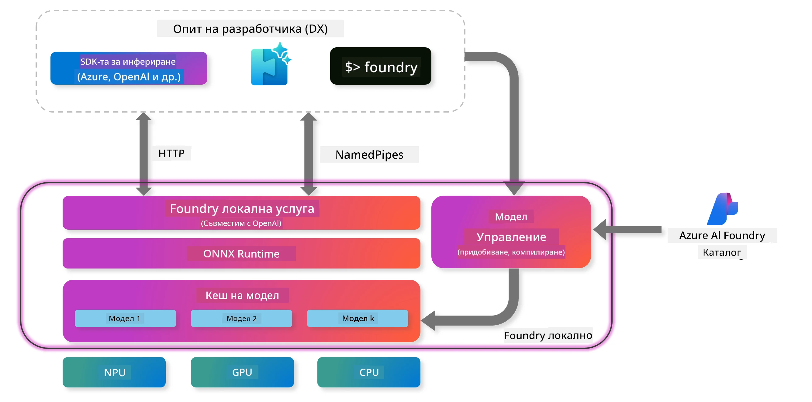
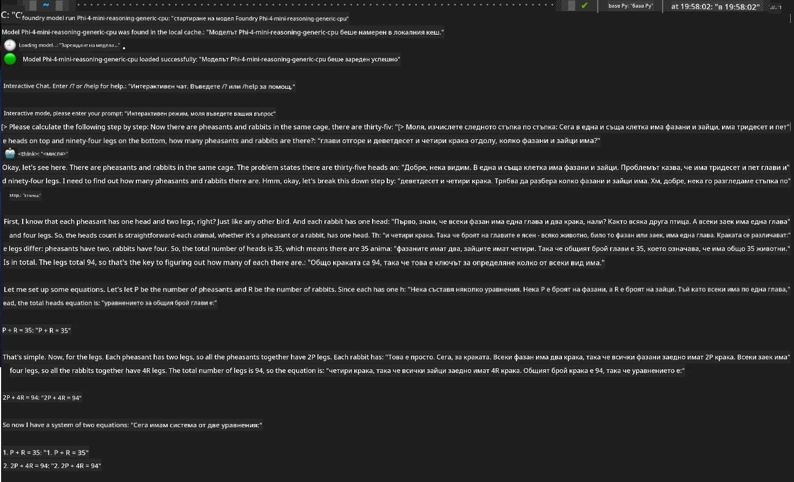

## Започване с Phi-Family модели във Foundry Local

### Въведение във Foundry Local

Foundry Local е мощно решение за AI изчисления на устройството, което предоставя корпоративно ниво AI възможности директно на вашия локален хардуер. Този урок ще ви преведе през настройката и използването на Phi-Family модели с Foundry Local, като ви даде пълен контрол върху AI задачите, запазвайки поверителността и намалявайки разходите.

Foundry Local осигурява предимства по отношение на производителност, поверителност, персонализация и разходи, като изпълнява AI модели локално на вашето устройство. Той се интегрира безпроблемно във вашите съществуващи работни процеси и приложения чрез интуитивен CLI, SDK и REST API.




### Защо да изберете Foundry Local?

Разбирането на предимствата на Foundry Local ще ви помогне да вземете информирано решение за стратегията си за внедряване на AI:

- **Изчисления на устройството:** Стартирайте модели локално на вашия хардуер, намалявайки разходите и запазвайки всички данни на вашето устройство.

- **Персонализация на моделите:** Избирайте от предварително зададени модели или използвайте свои собствени, за да отговорите на конкретни изисквания и случаи на употреба.

- **Икономия на разходи:** Премахнете повтарящите се разходи за облачни услуги, използвайки съществуващия си хардуер, което прави AI по-достъпен.

- **Безпроблемна интеграция:** Свържете се с вашите приложения чрез SDK, API крайни точки или CLI, с лесно мащабиране към Azure AI Foundry при нарастване на нуждите ви.

> **Getting Started Note:** Този урок се фокусира върху използването на Foundry Local чрез CLI и SDK интерфейси. Ще научите и двата подхода, за да изберете най-подходящия за вашия случай.

## Част 1: Настройка на Foundry Local CLI

### Стъпка 1: Инсталация

Foundry Local CLI е вашият портал за управление и стартиране на AI модели локално. Нека започнем с инсталирането му на вашата система.

**Поддържани платформи:** Windows и macOS

За подробни инструкции за инсталация, моля, вижте [официалната документация на Foundry Local](https://github.com/microsoft/Foundry-Local/blob/main/README.md).

### Стъпка 2: Разглеждане на наличните модели

След като инсталирате Foundry Local CLI, можете да разгледате какви модели са налични за вашия случай на употреба. Тази команда ще ви покаже всички поддържани модели:


```bash
foundry model list
```

### Стъпка 3: Запознаване с Phi Family моделите

Phi Family предлага набор от модели, оптимизирани за различни случаи на употреба и хардуерни конфигурации. Ето Phi моделите, налични във Foundry Local:

**Налични Phi модели:** 

- **phi-3.5-mini** - Компактен модел за основни задачи
- **phi-3-mini-128k** - Версия с разширен контекст за по-дълги разговори
- **phi-3-mini-4k** - Стандартен контекст модел за обща употреба
- **phi-4** - Разширен модел с подобрени възможности
- **phi-4-mini** - Лекият вариант на Phi-4
- **phi-4-mini-reasoning** - Специализиран за сложни задачи с разсъждения

> **Съвместимост с хардуер:** Всеки модел може да бъде конфигуриран за различно хардуерно ускорение (CPU, GPU) в зависимост от възможностите на вашата система.

### Стъпка 4: Стартиране на първия Phi модел

Нека започнем с практичен пример. Ще стартираме модела `phi-4-mini-reasoning`, който се справя отлично с решаването на сложни проблеми стъпка по стъпка.


**Команда за стартиране на модела:**

```bash
foundry model run Phi-4-mini-reasoning-generic-cpu
```

> **Първоначална настройка:** При първото стартиране на модел, Foundry Local автоматично ще го изтегли на вашето локално устройство. Времето за изтегляне зависи от скоростта на вашата мрежа, затова моля, бъдете търпеливи по време на първоначалната настройка.

### Стъпка 5: Тестване на модела с реален проблем

Сега нека тестваме модела с класически логически проблем, за да видим как се справя с разсъждения стъпка по стъпка:

**Примерен проблем:**

```txt
Please calculate the following step by step: Now there are pheasants and rabbits in the same cage, there are thirty-five heads on top and ninety-four legs on the bottom, how many pheasants and rabbits are there?
```

**Очаквано поведение:** Моделът трябва да разбие проблема на логически стъпки, използвайки факта, че фазани имат 2 крака, а зайци - 4 крака, за да реши системата от уравнения.

**Резултати:**



## Част 2: Създаване на приложения с Foundry Local SDK

### Защо да използваме SDK?

Докато CLI е идеален за тестване и бързи взаимодействия, SDK ви позволява да интегрирате Foundry Local в приложенията си програмно. Това отваря възможности за:

- Създаване на персонализирани AI приложения
- Автоматизиране на работни процеси
- Интегриране на AI възможности в съществуващи системи
- Разработка на чатботове и интерактивни инструменти

### Поддържани програмни езици

Foundry Local предлага SDK поддръжка за няколко програмни езика, за да отговаря на вашите предпочитания за разработка:

**📦 Налични SDK:**

- **C# (.NET):** [SDK документация и примери](https://github.com/microsoft/Foundry-Local/tree/main/sdk/cs)
- **Python:** [SDK документация и примери](https://github.com/microsoft/Foundry-Local/tree/main/sdk/python)
- **JavaScript:** [SDK документация и примери](https://github.com/microsoft/Foundry-Local/tree/main/sdk/js)
- **Rust:** [SDK документация и примери](https://github.com/microsoft/Foundry-Local/tree/main/sdk/rust)

### Следващи стъпки

1. **Изберете предпочитания SDK** според вашата среда за разработка
2. **Следвайте документацията за конкретния SDK** за подробни ръководства за имплементация
3. **Започнете с прости примери** преди да изграждате сложни приложения
4. **Разгледайте примерния код** в съответното SDK хранилище

## Заключение

Сега вече знаете как да:
- ✅ Инсталирате и настроите Foundry Local CLI
- ✅ Откривате и стартирате Phi Family модели
- ✅ Тествате модели с реални проблеми
- ✅ Разбирате опциите за SDK при разработка на приложения

Foundry Local предоставя мощна основа за пренасяне на AI възможности директно във вашата локална среда, като ви дава контрол върху производителността, поверителността и разходите, като същевременно запазва гъвкавостта за мащабиране към облачни решения при необходимост.

**Отказ от отговорност**:  
Този документ е преведен с помощта на AI преводаческа услуга [Co-op Translator](https://github.com/Azure/co-op-translator). Въпреки че се стремим към точност, моля, имайте предвид, че автоматизираните преводи могат да съдържат грешки или неточности. Оригиналният документ на неговия език трябва да се счита за авторитетен източник. За критична информация се препоръчва професионален човешки превод. Ние не носим отговорност за каквито и да е недоразумения или неправилни тълкувания, произтичащи от използването на този превод.