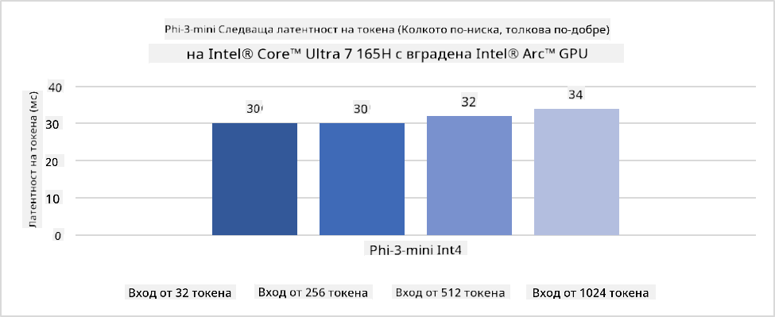

<!--
CO_OP_TRANSLATOR_METADATA:
{
  "original_hash": "e08ce816e23ad813244a09ca34ebb8ac",
  "translation_date": "2025-07-16T20:07:52+00:00",
  "source_file": "md/01.Introduction/03/AIPC_Inference.md",
  "language_code": "bg"
}
-->
# **Inference Phi-3 в AI PC**

С напредъка на генеративния AI и подобряването на хардуерните възможности на крайни устройства, все повече генеративни AI модели могат да бъдат интегрирани в устройствата на потребителите по модела Bring Your Own Device (BYOD). AI PC са сред тези модели. От 2024 г. Intel, AMD и Qualcomm си сътрудничат с производители на компютри, за да представят AI PC, които улесняват внедряването на локализирани генеративни AI модели чрез хардуерни модификации. В тази дискусия ще се фокусираме върху Intel AI PC и ще разгледаме как да внедрим Phi-3 на Intel AI PC.

### Какво е NPU

NPU (Neural Processing Unit) е специализиран процесор или изчислителен модул в по-голям SoC, предназначен специално за ускоряване на операции с невронни мрежи и AI задачи. За разлика от универсалните CPU и GPU, NPU са оптимизирани за паралелни изчисления, базирани на данни, което ги прави изключително ефективни при обработка на големи мултимедийни данни като видеа и изображения, както и при обработка на данни за невронни мрежи. Те са особено добри в изпълнението на AI задачи като разпознаване на реч, размазване на фон по време на видео разговори и процеси за редактиране на снимки или видео, като откриване на обекти.

## NPU срещу GPU

Въпреки че много AI и машинно обучение задачи се изпълняват на GPU, има съществена разлика между GPU и NPU.  
GPU са известни със своите паралелни изчислителни възможности, но не всички GPU са еднакво ефективни извън обработката на графика. От друга страна, NPU са специално създадени за сложни изчисления, свързани с операции на невронни мрежи, което ги прави много ефективни за AI задачи.

В обобщение, NPU са математическите гении, които ускоряват AI изчисленията и играят ключова роля в новата ера на AI PC!

***Този пример е базиран на най-новия процесор Intel Core Ultra***

## **1. Използване на NPU за изпълнение на Phi-3 модел**

Intel® NPU устройството е AI ускорител за инференция, интегриран с Intel клиентски CPU, започвайки от поколението Intel® Core™ Ultra (преди известно като Meteor Lake). То позволява енергийно ефективно изпълнение на задачи с изкуствени невронни мрежи.




**Intel NPU Acceleration Library**

Intel NPU Acceleration Library [https://github.com/intel/intel-npu-acceleration-library](https://github.com/intel/intel-npu-acceleration-library) е Python библиотека, създадена да повиши ефективността на вашите приложения, използвайки мощта на Intel Neural Processing Unit (NPU) за извършване на високоскоростни изчисления на съвместим хардуер.

Пример с Phi-3-mini на AI PC, захранван от процесори Intel® Core™ Ultra.


Инсталирайте Python библиотеката с pip

```bash

   pip install intel-npu-acceleration-library

```

***Забележка*** Проектът все още е в процес на разработка, но референтният модел вече е много завършен.

### **Изпълнение на Phi-3 с Intel NPU Acceleration Library**

Използвайки Intel NPU ускорение, тази библиотека не променя традиционния процес на кодиране. Трябва само да използвате тази библиотека, за да квантизирате оригиналния Phi-3 модел, например FP16, INT8, INT4, като

```python
from transformers import AutoTokenizer, pipeline,TextStreamer
from intel_npu_acceleration_library import NPUModelForCausalLM, int4
from intel_npu_acceleration_library.compiler import CompilerConfig
import warnings

model_id = "microsoft/Phi-3-mini-4k-instruct"

compiler_conf = CompilerConfig(dtype=int4)
model = NPUModelForCausalLM.from_pretrained(
    model_id, use_cache=True, config=compiler_conf, attn_implementation="sdpa"
).eval()

tokenizer = AutoTokenizer.from_pretrained(model_id)

text_streamer = TextStreamer(tokenizer, skip_prompt=True)
```

След успешната квантизация, продължете с изпълнението, за да извикате NPU за стартиране на Phi-3 модела.

```python
generation_args = {
   "max_new_tokens": 1024,
   "return_full_text": False,
   "temperature": 0.3,
   "do_sample": False,
   "streamer": text_streamer,
}

pipe = pipeline(
   "text-generation",
   model=model,
   tokenizer=tokenizer,
)

query = "<|system|>You are a helpful AI assistant.<|end|><|user|>Can you introduce yourself?<|end|><|assistant|>"

with warnings.catch_warnings():
    warnings.simplefilter("ignore")
    pipe(query, **generation_args)
```

При изпълнение на кода можем да наблюдаваме състоянието на NPU през Диспечера на задачите


***Примери*** : [AIPC_NPU_DEMO.ipynb](../../../../../code/03.Inference/AIPC/AIPC_NPU_DEMO.ipynb)

## **2. Използване на DirectML + ONNX Runtime за изпълнение на Phi-3 модел**

### **Какво е DirectML**

[DirectML](https://github.com/microsoft/DirectML) е високопроизводителна, хардуерно ускорена DirectX 12 библиотека за машинно обучение. DirectML осигурява GPU ускорение за често срещани задачи в машинното обучение на широк набор от поддържан хардуер и драйвери, включително всички DirectX 12 съвместими GPU от производители като AMD, Intel, NVIDIA и Qualcomm.

Когато се използва самостоятелно, DirectML API е ниско ниво DirectX 12 библиотека и е подходяща за високопроизводителни, с ниска латентност приложения като фреймуъркове, игри и други приложения в реално време. Безпроблемната съвместимост на DirectML с Direct3D 12, както и ниската му натовареност и съвместимост с различен хардуер, правят DirectML идеален за ускоряване на машинното обучение, когато се търси както висока производителност, така и надеждност и предсказуемост на резултатите на различен хардуер.

***Забележка*** : Последната версия на DirectML вече поддържа NPU (https://devblogs.microsoft.com/directx/introducing-neural-processor-unit-npu-support-in-directml-developer-preview/)

### DirectML и CUDA по отношение на възможностите и производителността:

**DirectML** е библиотека за машинно обучение, разработена от Microsoft. Тя е предназначена да ускори машинното обучение на Windows устройства, включително настолни компютри, лаптопи и крайни устройства.  
- Базирана на DX12: DirectML е изградена върху DirectX 12 (DX12), който осигурява широка хардуерна поддръжка за GPU, включително NVIDIA и AMD.  
- По-широка поддръжка: Тъй като използва DX12, DirectML може да работи с всеки GPU, който поддържа DX12, дори интегрирани GPU.  
- Обработка на изображения: DirectML обработва изображения и други данни чрез невронни мрежи, което я прави подходяща за задачи като разпознаване на изображения, откриване на обекти и други.  
- Лесна настройка: Настройването на DirectML е лесно и не изисква специфични SDK или библиотеки от производителите на GPU.  
- Производителност: В някои случаи DirectML работи добре и може да бъде по-бърза от CUDA, особено при определени натоварвания.  
- Ограничения: Въпреки това, има случаи, когато DirectML може да е по-бавна, особено при големи партиди с float16.

**CUDA** е паралелна изчислителна платформа и програмна среда на NVIDIA. Тя позволява на разработчиците да използват мощта на NVIDIA GPU за общи изчисления, включително машинно обучение и научни симулации.  
- Специфична за NVIDIA: CUDA е тясно интегрирана с NVIDIA GPU и е специално проектирана за тях.  
- Високо оптимизирана: Осигурява отлична производителност за задачи, ускорени от GPU, особено при използване на NVIDIA GPU.  
- Широко използвана: Много фреймуъркове и библиотеки за машинно обучение (като TensorFlow и PyTorch) поддържат CUDA.  
- Персонализация: Разработчиците могат да настройват CUDA за конкретни задачи, което води до оптимална производителност.  
- Ограничения: Въпреки това, зависимостта на CUDA от хардуер на NVIDIA може да ограничи съвместимостта с други GPU.

### Избор между DirectML и CUDA

Изборът между DirectML и CUDA зависи от конкретния ви случай, наличния хардуер и предпочитанията ви.  
Ако търсите по-широка съвместимост и лесна настройка, DirectML може да е добър избор. Ако обаче разполагате с NVIDIA GPU и имате нужда от високо оптимизирана производителност, CUDA остава силен кандидат. В обобщение, и двата варианта имат своите предимства и недостатъци, затова преценете изискванията и наличния хардуер при вземане на решение.

### **Генеративен AI с ONNX Runtime**

В ерата на AI преносимостта на AI моделите е много важна. ONNX Runtime позволява лесно внедряване на обучени модели на различни устройства. Разработчиците не трябва да се притесняват за инференционната рамка и използват унифициран API за изпълнение на модела. В ерата на генеративния AI, ONNX Runtime също извършва оптимизация на кода (https://onnxruntime.ai/docs/genai/). Чрез оптимизирания ONNX Runtime, квантизираният генеративен AI модел може да бъде изпълнен на различни устройства. В Generative AI с ONNX Runtime можете да извършвате инференция на AI модел чрез Python, C#, C / C++. Разбира се, внедряването на iPhone може да се възползва от C++ API на Generative AI с ONNX Runtime.

[Примерен код](https://github.com/Azure-Samples/Phi-3MiniSamples/tree/main/onnx)

***Компилиране на библиотеката за генеративен AI с ONNX Runtime***

```bash

winget install --id=Kitware.CMake  -e

git clone https://github.com/microsoft/onnxruntime.git

cd .\onnxruntime\

./build.bat --build_shared_lib --skip_tests --parallel --use_dml --config Release

cd ../

git clone https://github.com/microsoft/onnxruntime-genai.git

cd .\onnxruntime-genai\

mkdir ort

cd ort

mkdir include

mkdir lib

copy ..\onnxruntime\include\onnxruntime\core\providers\dml\dml_provider_factory.h ort\include

copy ..\onnxruntime\include\onnxruntime\core\session\onnxruntime_c_api.h ort\include

copy ..\onnxruntime\build\Windows\Release\Release\*.dll ort\lib

copy ..\onnxruntime\build\Windows\Release\Release\onnxruntime.lib ort\lib

python build.py --use_dml


```

**Инсталиране на библиотеката**

```bash

pip install .\onnxruntime_genai_directml-0.3.0.dev0-cp310-cp310-win_amd64.whl

```

Това е резултатът от изпълнението


***Примери*** : [AIPC_DirectML_DEMO.ipynb](../../../../../code/03.Inference/AIPC/AIPC_DirectML_DEMO.ipynb)

## **3. Използване на Intel OpenVino за изпълнение на Phi-3 модел**

### **Какво е OpenVINO**

[OpenVINO](https://github.com/openvinotoolkit/openvino) е отворен инструментариум за оптимизация и внедряване на модели за дълбоко обучение. Той осигурява ускорена производителност за модели за зрение, аудио и език от популярни фреймуъркове като TensorFlow, PyTorch и други. Започнете с OpenVINO. OpenVINO може да се използва и в комбинация с CPU и GPU за изпълнение на Phi-3 модела.

***Забележка***: В момента OpenVINO не поддържа NPU.

### **Инсталиране на OpenVINO библиотеката**

```bash

 pip install git+https://github.com/huggingface/optimum-intel.git

 pip install git+https://github.com/openvinotoolkit/nncf.git

 pip install openvino-nightly

```

### **Изпълнение на Phi-3 с OpenVINO**

Подобно на NPU, OpenVINO изпълнява извикванията на генеративни AI модели чрез изпълнение на квантизирани модели. Първо трябва да квантизираме Phi-3 модела и да завършим квантизацията на модела чрез командния ред с optimum-cli

**INT4**

```bash

optimum-cli export openvino --model "microsoft/Phi-3-mini-4k-instruct" --task text-generation-with-past --weight-format int4 --group-size 128 --ratio 0.6  --sym  --trust-remote-code ./openvinomodel/phi3/int4

```

**FP16**

```bash

optimum-cli export openvino --model "microsoft/Phi-3-mini-4k-instruct" --task text-generation-with-past --weight-format fp16 --trust-remote-code ./openvinomodel/phi3/fp16

```

конвертирания формат изглежда така


Зареждаме пътищата към модела (model_dir), свързаните конфигурации (ov_config = {"PERFORMANCE_HINT": "LATENCY", "NUM_STREAMS": "1", "CACHE_DIR": ""}) и хардуерно ускорените устройства (GPU.0) чрез OVModelForCausalLM

```python

ov_model = OVModelForCausalLM.from_pretrained(
     model_dir,
     device='GPU.0',
     ov_config=ov_config,
     config=AutoConfig.from_pretrained(model_dir, trust_remote_code=True),
     trust_remote_code=True,
)

```

При изпълнение на кода можем да наблюдаваме състоянието на GPU през Диспечера на задачите


***Примери*** : [AIPC_OpenVino_Demo.ipynb](../../../../../code/03.Inference/AIPC/AIPC_OpenVino_Demo.ipynb)

### ***Забележка*** : Тези три метода имат своите предимства, но се препоръчва използването на NPU ускорение за инференция на AI PC.

**Отказ от отговорност**:  
Този документ е преведен с помощта на AI преводаческа услуга [Co-op Translator](https://github.com/Azure/co-op-translator). Въпреки че се стремим към точност, моля, имайте предвид, че автоматизираните преводи могат да съдържат грешки или неточности. Оригиналният документ на неговия роден език трябва да се счита за авторитетен източник. За критична информация се препоръчва професионален човешки превод. Ние не носим отговорност за каквито и да е недоразумения или неправилни тълкувания, произтичащи от използването на този превод.