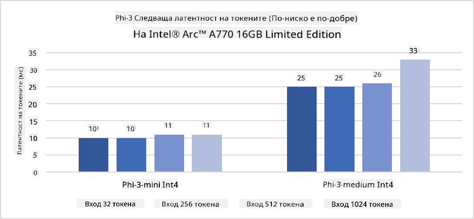
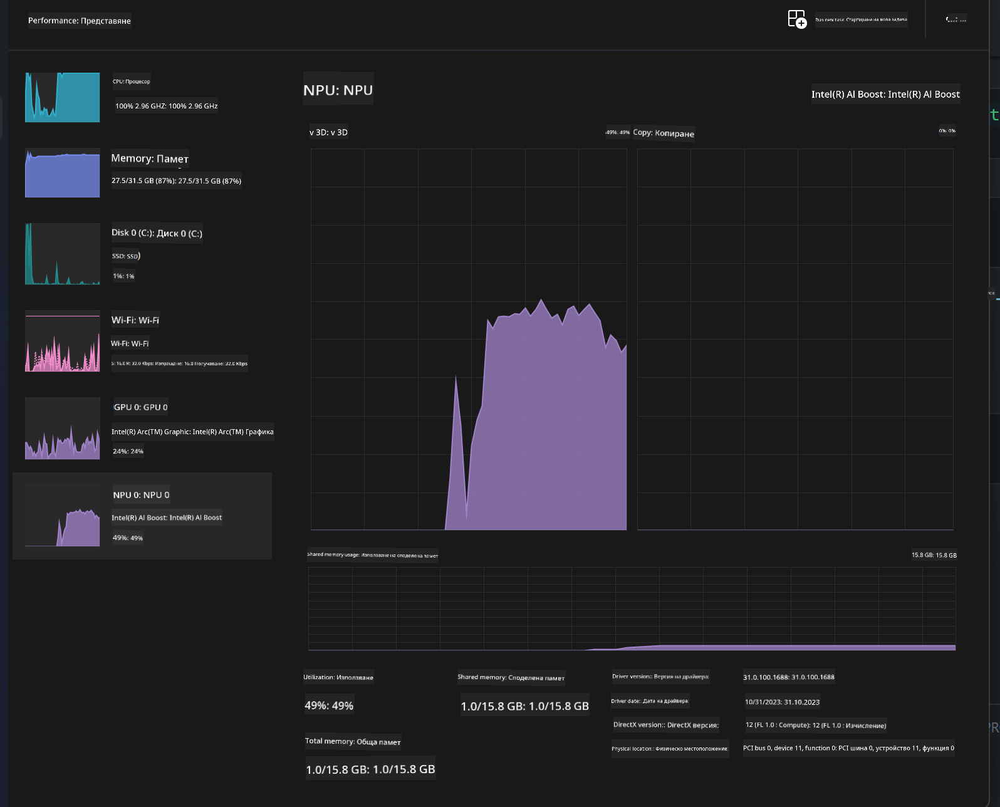
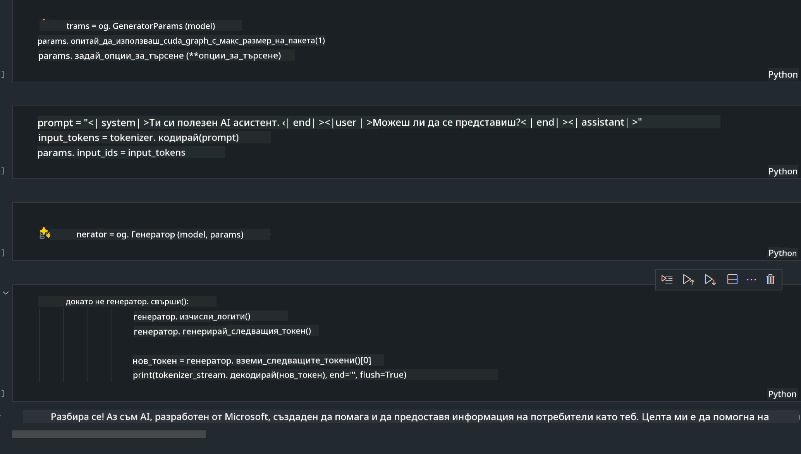
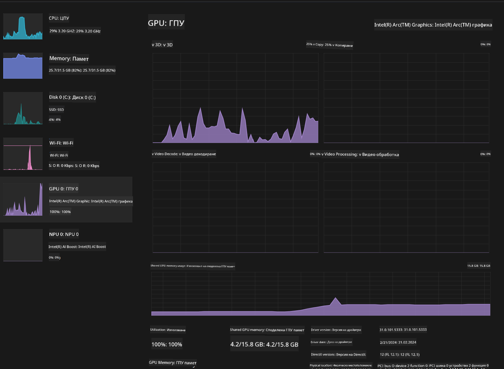

<!--
CO_OP_TRANSLATOR_METADATA:
{
  "original_hash": "e08ce816e23ad813244a09ca34ebb8ac",
  "translation_date": "2025-05-09T10:37:38+00:00",
  "source_file": "md/01.Introduction/03/AIPC_Inference.md",
  "language_code": "bg"
}
-->
# **Инференс Phi-3 в AI PC**

С развитието на генеративния AI и подобряването на хардуерните възможности на крайни устройства, все повече генеративни AI модели могат да бъдат интегрирани в устройствата на потребителите по модела Bring Your Own Device (BYOD). AI PC са сред тези устройства. От 2024 г. Intel, AMD и Qualcomm си сътрудничат с производители на компютри, за да представят AI PC, които улесняват внедряването на локализирани генеративни AI модели чрез хардуерни промени. В това обсъждане ще се фокусираме върху Intel AI PC и ще разгледаме как да се внедри Phi-3 на Intel AI PC.

### Какво е NPU

NPU (Neural Processing Unit) е специализиран процесор или изчислителен блок в по-голям SoC, предназначен специално за ускоряване на операции с невронни мрежи и AI задачи. За разлика от общо предназначените CPU и GPU, NPU са оптимизирани за паралелни изчисления, базирани на данни, което ги прави много ефективни при обработка на огромни мултимедийни данни като видео и изображения, както и при обработка на данни за невронни мрежи. Те са особено добри в изпълнението на AI задачи като разпознаване на реч, замъгляване на фон по време на видеоразговори и редактиране на снимки или видео, например откриване на обекти.

## NPU срещу GPU

Въпреки че много AI и машинно обучение задачи се изпълняват на GPU, има съществена разлика между GPU и NPU.  
GPU са известни с паралелните си изчислителни възможности, но не всички GPU са еднакво ефективни извън обработката на графика. NPU, от своя страна, са специално създадени за сложни изчисления, свързани с операции на невронни мрежи, което ги прави много ефективни за AI задачи.

Обобщено, NPU са математическите експерти, които ускоряват AI изчисленията и играят ключова роля в новата ера на AI PC!

***Този пример е базиран на най-новия процесор Intel Core Ultra***

## **1. Използване на NPU за изпълнение на модела Phi-3**

Intel® NPU устройството е AI ускорител за инференс, интегриран с клиентските процесори на Intel, започвайки от поколението Intel® Core™ Ultra (преди известно като Meteor Lake). То позволява енергийно ефективно изпълнение на задачи с изкуствени невронни мрежи.




**Intel NPU Acceleration Library**

Intel NPU Acceleration Library [https://github.com/intel/intel-npu-acceleration-library](https://github.com/intel/intel-npu-acceleration-library) е Python библиотека, създадена да повиши ефективността на вашите приложения, използвайки мощта на Intel Neural Processing Unit (NPU) за извършване на високоскоростни изчисления на съвместим хардуер.

Пример за Phi-3-mini на AI PC с процесори Intel® Core™ Ultra.


Инсталиране на Python библиотеката с pip

```bash

   pip install intel-npu-acceleration-library

```

***Забележка*** Проектът все още е в развитие, но референтният модел вече е много завършен.

### **Изпълнение на Phi-3 с Intel NPU Acceleration Library**

С използване на Intel NPU ускорение, тази библиотека не влияе на традиционния процес на кодиране. Нужно е само да използвате тази библиотека, за да квантирате оригиналния Phi-3 модел, например FP16, INT8, INT4, като например

```python
from transformers import AutoTokenizer, pipeline,TextStreamer
from intel_npu_acceleration_library import NPUModelForCausalLM, int4
from intel_npu_acceleration_library.compiler import CompilerConfig
import warnings

model_id = "microsoft/Phi-3-mini-4k-instruct"

compiler_conf = CompilerConfig(dtype=int4)
model = NPUModelForCausalLM.from_pretrained(
    model_id, use_cache=True, config=compiler_conf, attn_implementation="sdpa"
).eval()

tokenizer = AutoTokenizer.from_pretrained(model_id)

text_streamer = TextStreamer(tokenizer, skip_prompt=True)
```

След успешната квантификация, продължете с изпълнението, за да извикате NPU и да стартирате модела Phi-3.

```python
generation_args = {
   "max_new_tokens": 1024,
   "return_full_text": False,
   "temperature": 0.3,
   "do_sample": False,
   "streamer": text_streamer,
}

pipe = pipeline(
   "text-generation",
   model=model,
   tokenizer=tokenizer,
)

query = "<|system|>You are a helpful AI assistant.<|end|><|user|>Can you introduce yourself?<|end|><|assistant|>"

with warnings.catch_warnings():
    warnings.simplefilter("ignore")
    pipe(query, **generation_args)
```

При изпълнение на кода можем да наблюдаваме статуса на работа на NPU чрез Диспечера на задачите



***Примери*** : [AIPC_NPU_DEMO.ipynb](../../../../../code/03.Inference/AIPC/AIPC_NPU_DEMO.ipynb)

## **2. Използване на DirectML + ONNX Runtime за изпълнение на модела Phi-3**

### **Какво е DirectML**

[DirectML](https://github.com/microsoft/DirectML) е високопроизводителна библиотека, хардуерно ускорена чрез DirectX 12, предназначена за машинно обучение. DirectML осигурява GPU ускорение за често срещани задачи в машинното обучение на широка гама от поддържан хардуер и драйвери, включително всички GPU с поддръжка на DirectX 12 от производители като AMD, Intel, NVIDIA и Qualcomm.

Когато се използва самостоятелно, DirectML API е ниско ниво библиотека на DirectX 12, подходяща за високопроизводителни приложения с ниска латентност, като рамки, игри и други приложения в реално време. Безпроблемната съвместимост на DirectML с Direct3D 12, ниската му консумация на ресурси и съвместимостта с различен хардуер правят DirectML идеален за ускоряване на машинното обучение, когато се търси висока производителност и надеждност на резултатите на различен хардуер.

***Забележка*** : Последната версия на DirectML вече поддържа NPU (https://devblogs.microsoft.com/directx/introducing-neural-processor-unit-npu-support-in-directml-developer-preview/)

### Сравнение между DirectML и CUDA по отношение на възможности и производителност:

**DirectML** е библиотека за машинно обучение, разработена от Microsoft. Тя е предназначена за ускоряване на задачи с машинно обучение на устройства с Windows, включително настолни компютри, лаптопи и крайни устройства.  
- Базирана на DX12: DirectML е изградена върху DirectX 12 (DX12), който осигурява широка хардуерна поддръжка на GPU, включително NVIDIA и AMD.  
- По-широка поддръжка: Тъй като използва DX12, DirectML може да работи с всеки GPU, който поддържа DX12, включително интегрирани GPU.  
- Обработка на изображения: DirectML обработва изображения и други данни чрез невронни мрежи, което я прави подходяща за задачи като разпознаване на образи, откриване на обекти и други.  
- Лесна настройка: Настройването на DirectML е лесно и не изисква специфични SDK или библиотеки от производителите на GPU.  
- Производителност: В някои случаи DirectML работи добре и може да бъде по-бърза от CUDA, особено за определени задачи.  
- Ограничения: Въпреки това има случаи, когато DirectML може да е по-бавна, особено при големи батчове с float16.

**CUDA** е паралелна изчислителна платформа и програмна среда на NVIDIA. Тя позволява на разработчиците да използват мощността на NVIDIA GPU за общи изчисления, включително машинно обучение и научни симулации.  
- Специфична за NVIDIA: CUDA е тясно интегрирана с NVIDIA GPU и е специално разработена за тях.  
- Високо оптимизирана: Осигурява отлична производителност за GPU-ускорени задачи, особено при използване на NVIDIA хардуер.  
- Широко използвана: Много рамки и библиотеки за машинно обучение (като TensorFlow и PyTorch) поддържат CUDA.  
- Персонализация: Разработчиците могат да настроят CUDA за конкретни задачи, което води до оптимална производителност.  
- Ограничения: Зависимостта на CUDA от хардуера на NVIDIA може да ограничи съвместимостта с други GPU.

### Избор между DirectML и CUDA

Изборът между DirectML и CUDA зависи от конкретния случай, наличния хардуер и предпочитанията.  
Ако търсите по-широка съвместимост и лесна настройка, DirectML може да е добър избор. Ако разполагате с NVIDIA GPU и имате нужда от високо оптимизирана производителност, CUDA остава силен кандидат. В обобщение, и двата варианта имат предимства и недостатъци, затова вземете предвид вашите изисквания и наличния хардуер при вземане на решение.

### **Генеративен AI с ONNX Runtime**

В ерата на AI преносимостта на AI моделите е изключително важна. ONNX Runtime позволява лесно внедряване на обучени модели на различни устройства. Разработчиците не трябва да се притесняват за рамката за инференс и използват единен API за извършване на инференс. В ерата на генеративния AI, ONNX Runtime също така предлага оптимизация на кода (https://onnxruntime.ai/docs/genai/). Чрез оптимизирания ONNX Runtime, квантираният генеративен AI модел може да бъде използван на различни устройства. С Generative AI с ONNX Runtime можете да използвате API за инференс на AI модел чрез Python, C#, C / C++. Разбира се, внедряването на iPhone може да се възползва от Generative AI с ONNX Runtime API на C++.

[Примерен код](https://github.com/Azure-Samples/Phi-3MiniSamples/tree/main/onnx)

***компилиране на библиотеката Generative AI с ONNX Runtime***

```bash

winget install --id=Kitware.CMake  -e

git clone https://github.com/microsoft/onnxruntime.git

cd .\onnxruntime\

./build.bat --build_shared_lib --skip_tests --parallel --use_dml --config Release

cd ../

git clone https://github.com/microsoft/onnxruntime-genai.git

cd .\onnxruntime-genai\

mkdir ort

cd ort

mkdir include

mkdir lib

copy ..\onnxruntime\include\onnxruntime\core\providers\dml\dml_provider_factory.h ort\include

copy ..\onnxruntime\include\onnxruntime\core\session\onnxruntime_c_api.h ort\include

copy ..\onnxruntime\build\Windows\Release\Release\*.dll ort\lib

copy ..\onnxruntime\build\Windows\Release\Release\onnxruntime.lib ort\lib

python build.py --use_dml


```

**Инсталиране на библиотеката**

```bash

pip install .\onnxruntime_genai_directml-0.3.0.dev0-cp310-cp310-win_amd64.whl

```

Това е резултатът от изпълнението



***Примери*** : [AIPC_DirectML_DEMO.ipynb](../../../../../code/03.Inference/AIPC/AIPC_DirectML_DEMO.ipynb)

## **3. Използване на Intel OpenVino за изпълнение на модела Phi-3**

### **Какво е OpenVINO**

[OpenVINO](https://github.com/openvinotoolkit/openvino) е отворен софтуерен комплект за оптимизация и внедряване на модели за дълбоко обучение. Той осигурява ускорение на дълбокото обучение за модели за визуализация, аудио и език от популярни рамки като TensorFlow, PyTorch и други. Започнете с OpenVINO. OpenVINO може да се използва и в комбинация с CPU и GPU за изпълнение на модела Phi-3.

***Забележка***: В момента OpenVINO не поддържа NPU.

### **Инсталиране на OpenVINO библиотеката**

```bash

 pip install git+https://github.com/huggingface/optimum-intel.git

 pip install git+https://github.com/openvinotoolkit/nncf.git

 pip install openvino-nightly

```

### **Изпълнение на Phi-3 с OpenVINO**

Подобно на NPU, OpenVINO изпълнява извикване на генеративни AI модели чрез изпълнение на квантирани модели. Първо трябва да квантираме модела Phi-3 и да завършим квантификацията на модела чрез командния ред с optimum-cli

**INT4**

```bash

optimum-cli export openvino --model "microsoft/Phi-3-mini-4k-instruct" --task text-generation-with-past --weight-format int4 --group-size 128 --ratio 0.6  --sym  --trust-remote-code ./openvinomodel/phi3/int4

```

**FP16**

```bash

optimum-cli export openvino --model "microsoft/Phi-3-mini-4k-instruct" --task text-generation-with-past --weight-format fp16 --trust-remote-code ./openvinomodel/phi3/fp16

```

конвертирания формат изглежда така


Зареждане на пътища към моделите (model_dir), свързани конфигурации (ov_config = {"PERFORMANCE_HINT": "LATENCY", "NUM_STREAMS": "1", "CACHE_DIR": ""}) и хардуерно ускорени устройства (GPU.0) чрез OVModelForCausalLM

```python

ov_model = OVModelForCausalLM.from_pretrained(
     model_dir,
     device='GPU.0',
     ov_config=ov_config,
     config=AutoConfig.from_pretrained(model_dir, trust_remote_code=True),
     trust_remote_code=True,
)

```

При изпълнение на кода можем да наблюдаваме статуса на работа на GPU чрез Диспечера на задачите



***Примери*** : [AIPC_OpenVino_Demo.ipynb](../../../../../code/03.Inference/AIPC/AIPC_OpenVino_Demo.ipynb)

### ***Забележка*** : Тези три метода имат своите предимства, но се препоръчва използването на NPU ускорение за инференс на AI PC.

**Отказ от отговорност**:  
Този документ е преведен с помощта на AI преводаческа услуга [Co-op Translator](https://github.com/Azure/co-op-translator). Въпреки че се стремим към точност, моля, имайте предвид, че автоматизираните преводи могат да съдържат грешки или неточности. Оригиналният документ на неговия език трябва да се счита за авторитетен източник. За критична информация се препоръчва професионален човешки превод. Ние не носим отговорност за недоразумения или неправилни тълкувания, произтичащи от използването на този превод.