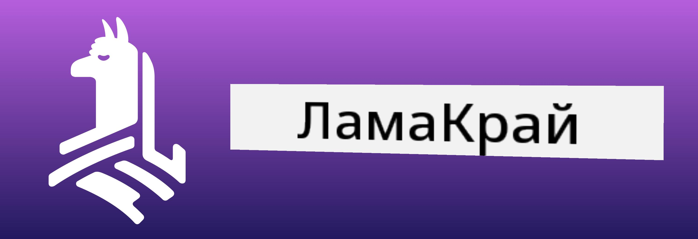
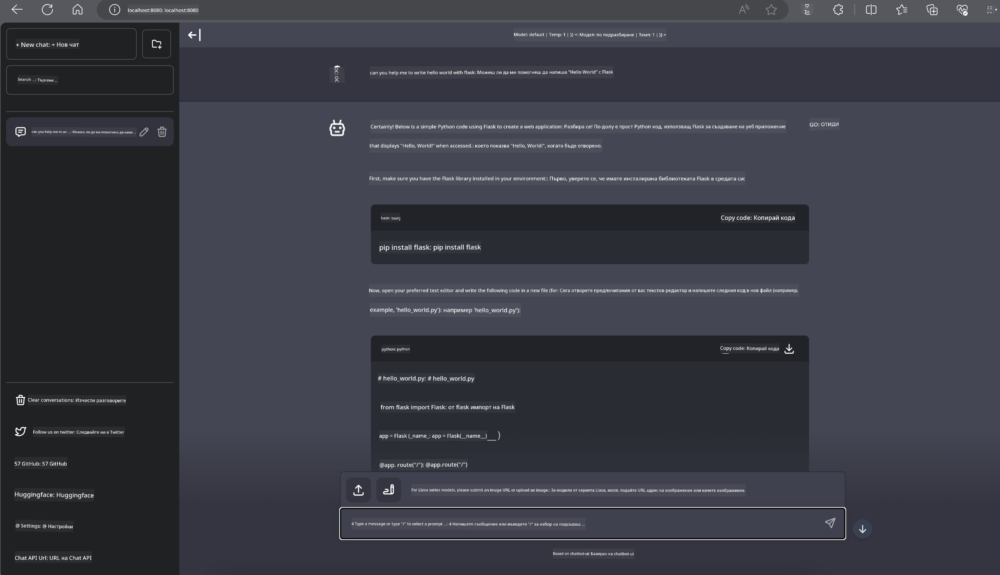

<!--
CO_OP_TRANSLATOR_METADATA:
{
  "original_hash": "be4101a30d98e95a71d42c276e8bcd37",
  "translation_date": "2025-05-09T11:46:03+00:00",
  "source_file": "md/01.Introduction/03/Jetson_Inference.md",
  "language_code": "bg"
}
-->
# **Инференция Phi-3 в Nvidia Jetson**

Nvidia Jetson е серия вградени компютърни платки от Nvidia. Моделите Jetson TK1, TX1 и TX2 използват процесор Tegra (или SoC) от Nvidia, който интегрира централен процесор (CPU) с ARM архитектура. Jetson е нискоенергиен системен модул, предназначен за ускоряване на приложения за машинно обучение. Nvidia Jetson се използва от професионални разработчици за създаване на иновативни AI продукти във всички индустрии, както и от студенти и ентусиасти за практическо обучение по AI и създаване на впечатляващи проекти. SLM се внедрява в крайни устройства като Jetson, което позволява по-добра реализация на индустриални сценарии с генеративен AI.

## Внедряване на NVIDIA Jetson:
Разработчици, работещи с автономна роботика и вградени устройства, могат да използват Phi-3 Mini. Относително малкият размер на Phi-3 го прави идеален за внедряване на ръба. Параметрите са прецизно настроени по време на обучението, гарантирайки висока точност в отговорите.

### Оптимизация TensorRT-LLM:
[TensorRT-LLM библиотеката](https://github.com/NVIDIA/TensorRT-LLM?WT.mc_id=aiml-138114-kinfeylo) на NVIDIA оптимизира инференцията на големи езикови модели. Тя поддържа дългия контекстов прозорец на Phi-3 Mini, подобрявайки както пропускателната способност, така и латентността. Оптимизациите включват техники като LongRoPE, FP8 и inflight batching.

### Наличност и внедряване:
Разработчиците могат да изпробват Phi-3 Mini с контекстов прозорец 128K на [NVIDIA AI](https://www.nvidia.com/en-us/ai-data-science/generative-ai/). Той е пакетирани като NVIDIA NIM, микросървис със стандартен API, който може да се внедрява навсякъде. Освен това, [имплементациите на TensorRT-LLM в GitHub](https://github.com/NVIDIA/TensorRT-LLM).

## **1. Подготовка**

a. Jetson Orin NX / Jetson NX

b. JetPack 5.1.2+

c. Cuda 11.8

d. Python 3.8+

## **2. Стартиране на Phi-3 в Jetson**

Можем да изберем [Ollama](https://ollama.com) или [LlamaEdge](https://llamaedge.com)

Ако искате да използвате gguf едновременно в облака и на крайни устройства, LlamaEdge може да се разбира като WasmEdge (WasmEdge е лек, високопроизводителен, мащабируем WebAssembly runtime, подходящ за cloud native, edge и децентрализирани приложения. Поддържа безсървърни приложения, вградени функции, микросървиси, интелигентни договори и IoT устройства). Можете да внедрите количествения модел gguf както на крайни устройства, така и в облака чрез LlamaEdge.



Ето стъпките за използване:

1. Инсталирайте и изтеглете свързаните библиотеки и файлове

```bash

curl -sSf https://raw.githubusercontent.com/WasmEdge/WasmEdge/master/utils/install.sh | bash -s -- --plugin wasi_nn-ggml

curl -LO https://github.com/LlamaEdge/LlamaEdge/releases/latest/download/llama-api-server.wasm

curl -LO https://github.com/LlamaEdge/chatbot-ui/releases/latest/download/chatbot-ui.tar.gz

tar xzf chatbot-ui.tar.gz

```

**Забележка**: llama-api-server.wasm и chatbot-ui трябва да са в една и съща директория

2. Стартирайте скриптовете в терминала

```bash

wasmedge --dir .:. --nn-preload default:GGML:AUTO:{Your gguf path} llama-api-server.wasm -p phi-3-chat

```

Ето резултата от изпълнението



***Примерен код*** [Phi-3 mini WASM Notebook Sample](https://github.com/Azure-Samples/Phi-3MiniSamples/tree/main/wasm)

В обобщение, Phi-3 Mini представлява значителен напредък в езиковото моделиране, съчетавайки ефективност, осъзнаване на контекста и оптимизациите на NVIDIA. Независимо дали създавате роботи или приложения на ръба, Phi-3 Mini е мощен инструмент, който заслужава внимание.

**Отказ от отговорност**:  
Този документ е преведен с помощта на AI преводаческа услуга [Co-op Translator](https://github.com/Azure/co-op-translator). Въпреки че се стремим към точност, моля, имайте предвид, че автоматизираните преводи могат да съдържат грешки или неточности. Оригиналният документ на неговия роден език трябва да се счита за авторитетен източник. За критична информация се препоръчва професионален човешки превод. Ние не носим отговорност за каквито и да е недоразумения или неправилни тълкувания, произтичащи от използването на този превод.