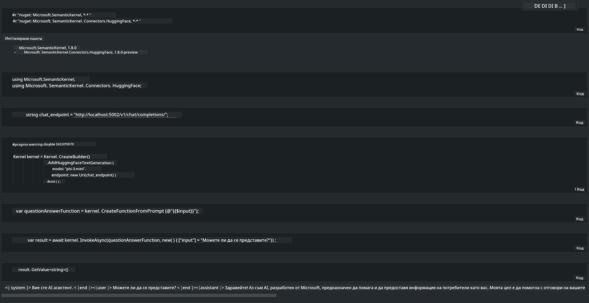

<!--
CO_OP_TRANSLATOR_METADATA:
{
  "original_hash": "bcf5dd7031db0031abdb9dd0c05ba118",
  "translation_date": "2025-05-09T12:09:12+00:00",
  "source_file": "md/01.Introduction/03/Local_Server_Inference.md",
  "language_code": "bg"
}
-->
# **Инференция Phi-3 на локален сървър**

Можем да разположим Phi-3 на локален сървър. Потребителите могат да изберат решения като [Ollama](https://ollama.com) или [LM Studio](https://llamaedge.com), или да напишат собствен код. Можете да свържете локалните услуги на Phi-3 чрез [Semantic Kernel](https://github.com/microsoft/semantic-kernel?WT.mc_id=aiml-138114-kinfeylo) или [Langchain](https://www.langchain.com/) за създаване на Copilot приложения.

## **Използване на Semantic Kernel за достъп до Phi-3-mini**

В Copilot приложението създаваме приложения чрез Semantic Kernel / LangChain. Този тип рамка за приложения обикновено е съвместима с Azure OpenAI Service / OpenAI модели, както и поддържа отворени модели от Hugging Face и локални модели. Какво трябва да направим, ако искаме да използваме Semantic Kernel за достъп до Phi-3-mini? Като пример с .NET, можем да го комбинираме с Hugging Face Connector в Semantic Kernel. По подразбиране, той съответства на model id в Hugging Face (първия път, когато го използвате, моделът се изтегля от Hugging Face, което отнема време). Също така можете да се свържете с локално изградената услуга. В сравнение с двете, препоръчваме второто, тъй като предлага по-голяма автономия, особено при корпоративни приложения.

От фигурата се вижда, че достъпът до локални услуги чрез Semantic Kernel лесно се свързва със самостоятелно изградения Phi-3-mini модел сървър. Ето резултатът от изпълнението:

***Примерен код*** https://github.com/kinfey/Phi3MiniSamples/tree/main/semantickernel

**Отказ от отговорност**:  
Този документ е преведен с помощта на AI преводаческа услуга [Co-op Translator](https://github.com/Azure/co-op-translator). Въпреки че се стремим към точност, моля, имайте предвид, че автоматичните преводи могат да съдържат грешки или неточности. Оригиналният документ на неговия роден език трябва да се счита за авторитетен източник. За критична информация се препоръчва професионален човешки превод. Ние не носим отговорност за каквито и да е недоразумения или неправилни тълкувания, произтичащи от използването на този превод.