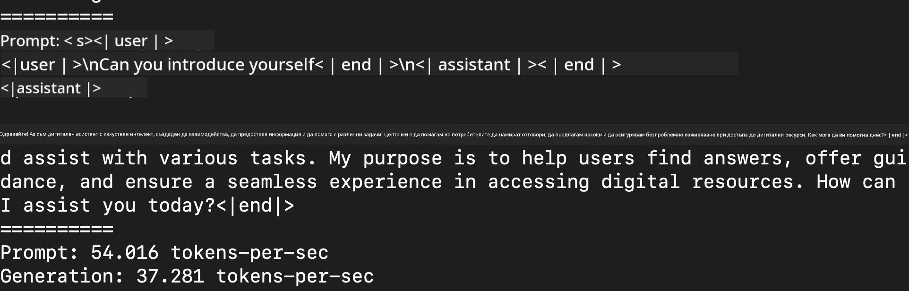

<!--
CO_OP_TRANSLATOR_METADATA:
{
  "original_hash": "dcb656f3d206fc4968e236deec5d4384",
  "translation_date": "2025-07-16T21:05:22+00:00",
  "source_file": "md/01.Introduction/03/MLX_Inference.md",
  "language_code": "bg"
}
-->
# **Инференция Phi-3 с Apple MLX Framework**

## **Какво е MLX Framework**

MLX е фреймуърк за масиви, предназначен за изследвания в областта на машинното обучение на Apple silicon, разработен от екипа за машинно обучение на Apple.

MLX е създаден от изследователи в машинното обучение за изследователи в машинното обучение. Фреймуъркът е проектиран да бъде лесен за използване, но същевременно ефективен за обучение и внедряване на модели. Концептуалният дизайн на фреймуърка е опростен. Целта ни е да улесним изследователите да разширяват и подобряват MLX, за да могат бързо да изпробват нови идеи.

Големите езикови модели (LLMs) могат да бъдат ускорени на устройства с Apple Silicon чрез MLX, а моделите могат да се изпълняват локално много удобно.

## **Използване на MLX за инференция на Phi-3-mini**

### **1. Настройка на MLX средата**

1. Python 3.11.x  
2. Инсталиране на MLX библиотеката

```bash

pip install mlx-lm

```

### **2. Стартиране на Phi-3-mini в терминала с MLX**

```bash

python -m mlx_lm.generate --model microsoft/Phi-3-mini-4k-instruct --max-token 2048 --prompt  "<|user|>\nCan you introduce yourself<|end|>\n<|assistant|>"

```

Резултатът (моята среда е Apple M1 Max, 64GB) е


### **3. Квантизиране на Phi-3-mini с MLX в терминала**

```bash

python -m mlx_lm.convert --hf-path microsoft/Phi-3-mini-4k-instruct

```

***Note：*** Моделът може да бъде квантизиран чрез mlx_lm.convert, като по подразбиране квантизацията е INT4. Този пример квантизира Phi-3-mini до INT4.

Моделът може да бъде квантизиран чрез mlx_lm.convert, като по подразбиране квантизацията е INT4. Този пример показва как да се квантизира Phi-3-mini в INT4. След квантизацията моделът ще бъде запазен в стандартната директория ./mlx_model

Можем да тестваме квантизирания модел с MLX от терминала

```bash

python -m mlx_lm.generate --model ./mlx_model/ --max-token 2048 --prompt  "<|user|>\nCan you introduce yourself<|end|>\n<|assistant|>"

```

Резултатът е



### **4. Стартиране на Phi-3-mini с MLX в Jupyter Notebook**


***Note:*** Моля, разгледайте този пример [кликнете тук](../../../../../code/03.Inference/MLX/MLX_DEMO.ipynb)

## **Ресурси**

1. Научете повече за Apple MLX Framework [https://ml-explore.github.io](https://ml-explore.github.io/mlx/build/html/index.html)

2. Apple MLX GitHub репо [https://github.com/ml-explore](https://github.com/ml-explore)

**Отказ от отговорност**:  
Този документ е преведен с помощта на AI преводаческа услуга [Co-op Translator](https://github.com/Azure/co-op-translator). Въпреки че се стремим към точност, моля, имайте предвид, че автоматизираните преводи могат да съдържат грешки или неточности. Оригиналният документ на неговия роден език трябва да се счита за авторитетен източник. За критична информация се препоръчва професионален човешки превод. Ние не носим отговорност за каквито и да е недоразумения или неправилни тълкувания, произтичащи от използването на този превод.