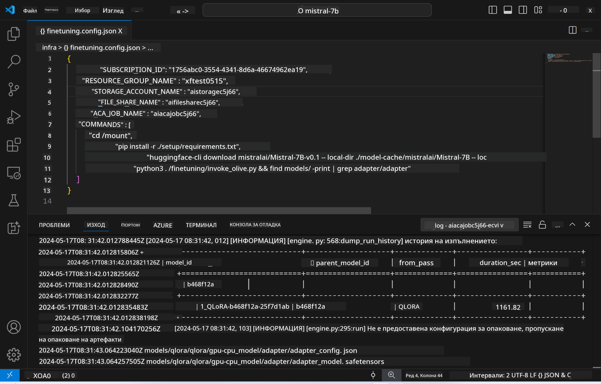
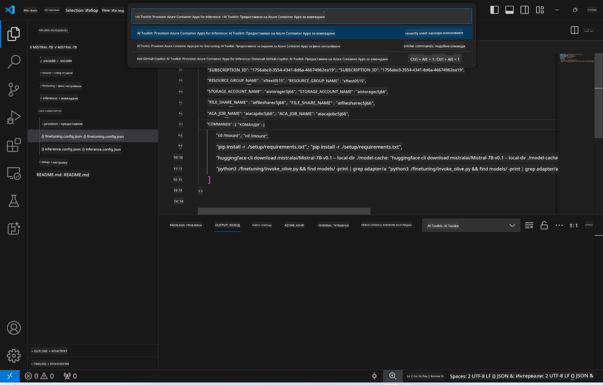

<!--
CO_OP_TRANSLATOR_METADATA:
{
  "original_hash": "a54cd3d65b6963e4e8ce21e143c3ab04",
  "translation_date": "2025-05-09T12:46:57+00:00",
  "source_file": "md/01.Introduction/03/Remote_Interence.md",
  "language_code": "bg"
}
-->
# Отдалечено извеждане с финно настроения модел

След като адаптерите са обучени в отдалечената среда, използвайте просто Gradio приложение, за да взаимодействате с модела.



### Настройка на Azure ресурси
Трябва да конфигурирате Azure ресурсите за отдалечено извеждане, като изпълните `AI Toolkit: Provision Azure Container Apps for inference` от командната палитра. По време на тази настройка ще бъдете помолени да изберете вашия Azure абонамент и ресурсна група.  


По подразбиране абонаментът и ресурсната група за извеждане трябва да съвпадат с тези, използвани за финното настройване. Извеждането ще използва същата Azure Container App среда и ще има достъп до модела и адаптера на модела, съхранени в Azure Files, които бяха създадени по време на стъпката за финно настройване.

## Използване на AI Toolkit

### Деплой за извеждане  
Ако желаете да промените кода за извеждане или да презаредите модела за извеждане, изпълнете командата `AI Toolkit: Deploy for inference`. Това ще синхронизира последния ви код с ACA и ще рестартира репликата.


След успешно приключване на деплоймента, моделът вече е готов за оценка чрез този крайна точка.

### Достъп до API за извеждане

Можете да достъпите API за извеждане, като кликнете на бутона "*Go to Inference Endpoint*" в известието на VSCode. Алтернативно, уеб API крайна точка може да се намери под `ACA_APP_ENDPOINT` в `./infra/inference.config.json` и в панела с изход.


> **Note:** Крайната точка за извеждане може да отнеме няколко минути, за да стане напълно функционална.

## Компоненти за извеждане, включени в шаблона

| Папка | Съдържание |
| ------ |--------- |
| `infra` | Съдържа всички необходими конфигурации за отдалечени операции. |
| `infra/provision/inference.parameters.json` | Съдържа параметри за bicep шаблоните, използвани за настройка на Azure ресурси за извеждане. |
| `infra/provision/inference.bicep` | Съдържа шаблони за настройка на Azure ресурси за извеждане. |
| `infra/inference.config.json` | Конфигурационният файл, генериран от командата `AI Toolkit: Provision Azure Container Apps for inference`. Използва се като вход за други команди в отдалечената командна палитра. |

### Използване на AI Toolkit за конфигуриране на Azure Resource Provision
Конфигурирайте [AI Toolkit](https://marketplace.visualstudio.com/items?itemName=ms-windows-ai-studio.windows-ai-studio)

Настройте Azure Container Apps за извеждане в ` command.

You can find configuration parameters in `./infra/provision/inference.parameters.json` file. Here are the details:
| Parameter | Description |
| --------- |------------ |
| `defaultCommands` | This is the commands to initiate a web API. |
| `maximumInstanceCount` | This parameter sets the maximum capacity of GPU instances. |
| `location` | This is the location where Azure resources are provisioned. The default value is the same as the chosen resource group's location. |
| `storageAccountName`, `fileShareName` `acaEnvironmentName`, `acaEnvironmentStorageName`, `acaAppName`,  `acaLogAnalyticsName` | These parameters are used to name the Azure resources for provision. By default, they will be same to the fine-tuning resource name. You can input a new, unused resource name to create your own custom-named resources, or you can input the name of an already existing Azure resource if you'd prefer to use that. For details, refer to the section [Using existing Azure Resources](../../../../../md/01.Introduction/03). |

### Using Existing Azure Resources

By default, the inference provision use the same Azure Container App Environment, Storage Account, Azure File Share, and Azure Log Analytics that were used for fine-tuning. A separate Azure Container App is created solely for the inference API. 

If you have customized the Azure resources during the fine-tuning step or want to use your own existing Azure resources for inference, specify their names in the `./infra/inference.parameters.json` файл. След това изпълнете командата `AI Toolkit: Provision Azure Container Apps for inference` от командната палитра. Това ще актуализира посочените ресурси и ще създаде липсващите.

Например, ако вече имате съществуваща Azure контейнерна среда, вашият файл `./infra/finetuning.parameters.json` трябва да изглежда така:

```json
{
    "$schema": "https://schema.management.azure.com/schemas/2019-04-01/deploymentParameters.json#",
    "contentVersion": "1.0.0.0",
    "parameters": {
      ...
      "acaEnvironmentName": {
        "value": "<your-aca-env-name>"
      },
      "acaEnvironmentStorageName": {
        "value": null
      },
      ...
    }
  }
```

### Ръчна настройка  
Ако предпочитате да конфигурирате Azure ресурсите ръчно, можете да използвате предоставените bicep файлове в `./infra/provision` folders. If you have already set up and configured all the Azure resources without using the AI Toolkit command palette, you can simply enter the resource names in the `inference.config.json` файла.

Например:

```json
{
  "SUBSCRIPTION_ID": "<your-subscription-id>",
  "RESOURCE_GROUP_NAME": "<your-resource-group-name>",
  "STORAGE_ACCOUNT_NAME": "<your-storage-account-name>",
  "FILE_SHARE_NAME": "<your-file-share-name>",
  "ACA_APP_NAME": "<your-aca-name>",
  "ACA_APP_ENDPOINT": "<your-aca-endpoint>"
}
```

**Отказ от отговорност**:  
Този документ е преведен с помощта на AI преводаческа услуга [Co-op Translator](https://github.com/Azure/co-op-translator). Въпреки че се стремим към точност, моля имайте предвид, че автоматизираните преводи могат да съдържат грешки или неточности. Оригиналният документ на неговия език трябва да се счита за авторитетен източник. За критична информация се препоръчва професионален човешки превод. Ние не носим отговорност за никакви недоразумения или неправилни тълкувания, произтичащи от използването на този превод.