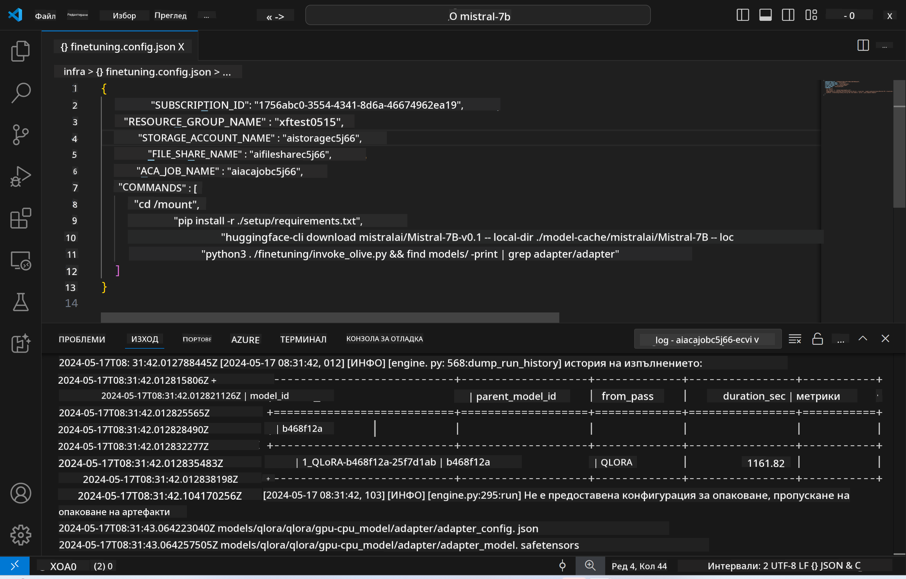
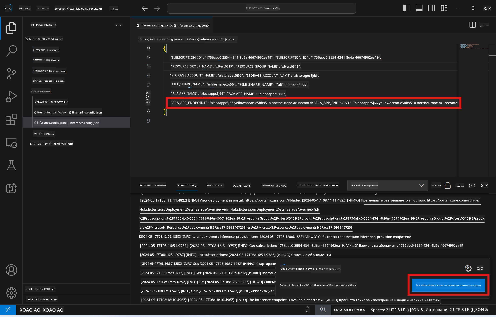

<!--
CO_OP_TRANSLATOR_METADATA:
{
  "original_hash": "a54cd3d65b6963e4e8ce21e143c3ab04",
  "translation_date": "2025-07-16T21:22:26+00:00",
  "source_file": "md/01.Introduction/03/Remote_Interence.md",
  "language_code": "bg"
}
-->
# Отдалечено извеждане с фино настроения модел

След като адаптерите бъдат обучени в отдалечената среда, използвайте проста Gradio апликация за взаимодействие с модела.



### Осигуряване на Azure ресурси
Трябва да настроите Azure ресурсите за отдалечено извеждане, като изпълните командата `AI Toolkit: Provision Azure Container Apps for inference` от командната палитра. По време на тази настройка ще бъдете помолени да изберете вашия Azure абонамент и група ресурси.  

   
По подразбиране абонаментът и групата ресурси за извеждане трябва да съвпадат с тези, използвани за финото настройване. Извеждането ще използва същата Azure Container App среда и ще има достъп до модела и адаптера на модела, съхранени в Azure Files, които бяха създадени по време на стъпката за фино настройване.

## Използване на AI Toolkit

### Разгръщане за извеждане  
Ако желаете да промените кода за извеждане или да презаредите модела за извеждане, изпълнете командата `AI Toolkit: Deploy for inference`. Това ще синхронизира последния ви код с ACA и ще рестартира репликата.


След успешно приключване на разгръщането, моделът е готов за оценка чрез този крайна точка.

### Достъп до API за извеждане

Можете да получите достъп до API за извеждане, като кликнете върху бутона "*Go to Inference Endpoint*" в известието на VSCode. Алтернативно, уеб API крайна точка може да бъде намерена под `ACA_APP_ENDPOINT` в `./infra/inference.config.json` и в панела с изходни данни.



> **Note:** Крайната точка за извеждане може да отнеме няколко минути, за да стане напълно функционална.

## Компоненти за извеждане, включени в шаблона

| Папка | Съдържание |
| ------ |--------- |
| `infra` | Съдържа всички необходими конфигурации за отдалечени операции. |
| `infra/provision/inference.parameters.json` | Съдържа параметрите за bicep шаблоните, използвани за осигуряване на Azure ресурси за извеждане. |
| `infra/provision/inference.bicep` | Съдържа шаблони за осигуряване на Azure ресурси за извеждане. |
| `infra/inference.config.json` | Конфигурационният файл, генериран от командата `AI Toolkit: Provision Azure Container Apps for inference`. Използва се като вход за други отдалечени командни палитри. |

### Използване на AI Toolkit за конфигуриране на осигуряването на Azure ресурси
Конфигурирайте [AI Toolkit](https://marketplace.visualstudio.com/items?itemName=ms-windows-ai-studio.windows-ai-studio)

Изпълнете командата `Provision Azure Container Apps for inference`.

Можете да намерите параметрите за конфигурация във файла `./infra/provision/inference.parameters.json`. Ето подробностите:
| Параметър | Описание |
| --------- |------------ |
| `defaultCommands` | Командите за стартиране на уеб API. |
| `maximumInstanceCount` | Този параметър задава максималния брой GPU инстанции. |
| `location` | Местоположението, където се осигуряват Azure ресурсите. По подразбиране е същото като местоположението на избраната група ресурси. |
| `storageAccountName`, `fileShareName`, `acaEnvironmentName`, `acaEnvironmentStorageName`, `acaAppName`,  `acaLogAnalyticsName` | Тези параметри се използват за именуване на Azure ресурсите за осигуряване. По подразбиране те са същите като имената на ресурсите за фино настройване. Можете да въведете ново, неизползвано име за ресурс, за да създадете свои собствени ресурси с персонализирани имена, или да въведете името на вече съществуващ Azure ресурс, ако предпочитате да използвате него. За подробности вижте секцията [Using existing Azure Resources](../../../../../md/01.Introduction/03). |

### Използване на съществуващи Azure ресурси

По подразбиране осигуряването за извеждане използва същата Azure Container App среда, Storage Account, Azure File Share и Azure Log Analytics, които са използвани за финото настройване. Създава се отделен Azure Container App само за API-то за извеждане.

Ако сте персонализирали Azure ресурсите по време на стъпката за фино настройване или искате да използвате свои собствени съществуващи Azure ресурси за извеждане, посочете техните имена във файла `./infra/inference.parameters.json`. След това изпълнете командата `AI Toolkit: Provision Azure Container Apps for inference` от командната палитра. Това ще актуализира посочените ресурси и ще създаде липсващите.

Например, ако имате съществуваща Azure контейнерна среда, вашият файл `./infra/finetuning.parameters.json` трябва да изглежда така:

```json
{
    "$schema": "https://schema.management.azure.com/schemas/2019-04-01/deploymentParameters.json#",
    "contentVersion": "1.0.0.0",
    "parameters": {
      ...
      "acaEnvironmentName": {
        "value": "<your-aca-env-name>"
      },
      "acaEnvironmentStorageName": {
        "value": null
      },
      ...
    }
  }
```

### Ръчно осигуряване  
Ако предпочитате да конфигурирате Azure ресурсите ръчно, можете да използвате предоставените bicep файлове в папките `./infra/provision`. Ако вече сте настроили и конфигурирали всички Azure ресурси без да използвате командната палитра на AI Toolkit, просто въведете имената на ресурсите във файла `inference.config.json`.

Например:

```json
{
  "SUBSCRIPTION_ID": "<your-subscription-id>",
  "RESOURCE_GROUP_NAME": "<your-resource-group-name>",
  "STORAGE_ACCOUNT_NAME": "<your-storage-account-name>",
  "FILE_SHARE_NAME": "<your-file-share-name>",
  "ACA_APP_NAME": "<your-aca-name>",
  "ACA_APP_ENDPOINT": "<your-aca-endpoint>"
}
```

**Отказ от отговорност**:  
Този документ е преведен с помощта на AI преводаческа услуга [Co-op Translator](https://github.com/Azure/co-op-translator). Въпреки че се стремим към точност, моля, имайте предвид, че автоматизираните преводи могат да съдържат грешки или неточности. Оригиналният документ на неговия роден език трябва да се счита за авторитетен източник. За критична информация се препоръчва професионален човешки превод. Ние не носим отговорност за каквито и да е недоразумения или неправилни тълкувания, произтичащи от използването на този превод.