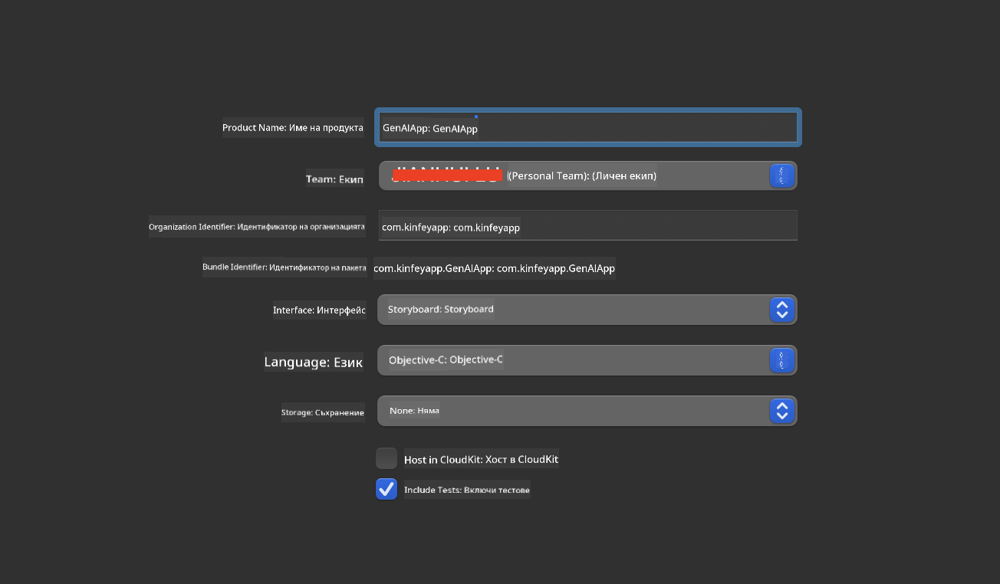
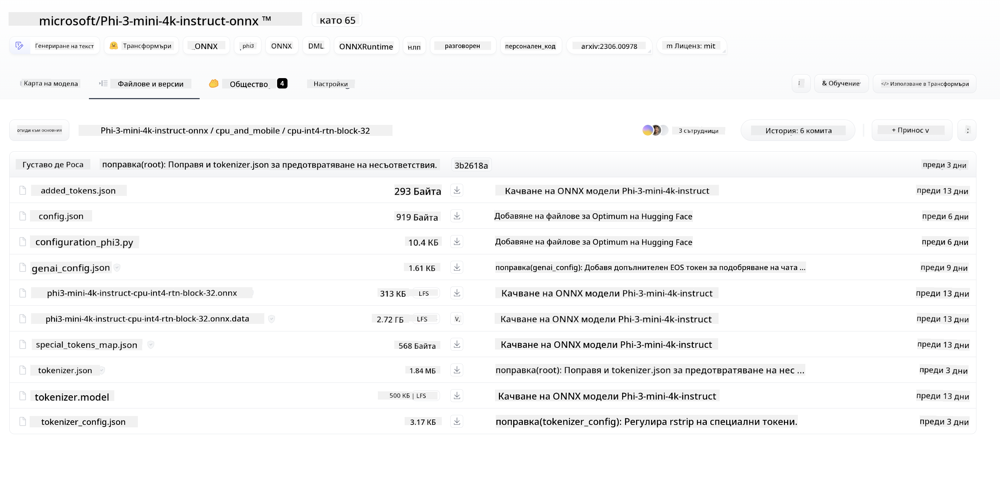
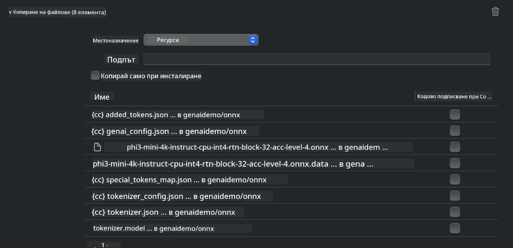
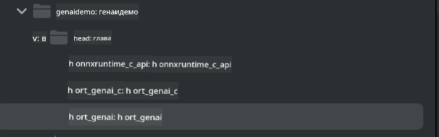
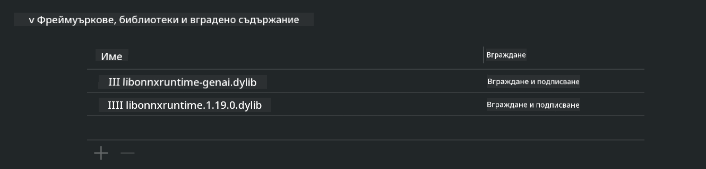
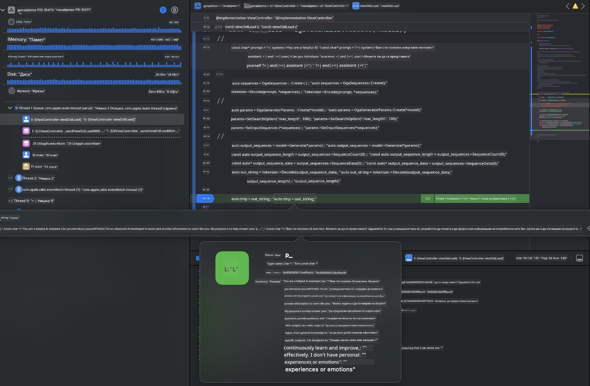

<!--
CO_OP_TRANSLATOR_METADATA:
{
  "original_hash": "82af197df38d25346a98f1f0e84d1698",
  "translation_date": "2025-05-09T11:06:31+00:00",
  "source_file": "md/01.Introduction/03/iOS_Inference.md",
  "language_code": "bg"
}
-->
# **Извеждане на Phi-3 в iOS**

Phi-3-mini е нова серия модели от Microsoft, която позволява внедряване на големи езикови модели (LLMs) на гранични устройства и IoT устройства. Phi-3-mini е наличен за iOS, Android и Edge Device внедрявания, което дава възможност за използване на генеративен AI в BYOD среди. Следният пример показва как да се внедри Phi-3-mini в iOS.

## **1. Подготовка**

- **a.** macOS 14+
- **b.** Xcode 15+
- **c.** iOS SDK 17.x (iPhone 14 с A16 или по-нов)
- **d.** Инсталирайте Python 3.10+ (препоръчително е Conda)
- **e.** Инсталирайте Python библиотеката: `python-flatbuffers`
- **f.** Инсталирайте CMake

### Semantic Kernel и извеждане

Semantic Kernel е рамка за приложения, която ви позволява да създавате приложения, съвместими с Azure OpenAI Service, OpenAI модели и дори локални модели. Достъпът до локални услуги чрез Semantic Kernel улеснява интеграцията с вашия самостоятелно хостван Phi-3-mini модел сървър.

### Извикване на квантизирани модели с Ollama или LlamaEdge

Много потребители предпочитат да използват квантизирани модели за локално изпълнение. [Ollama](https://ollama.com) и [LlamaEdge](https://llamaedge.com) позволяват извикване на различни квантизирани модели:

#### **Ollama**

Можете да стартирате `ollama run phi3` директно или да го конфигурирате офлайн. Създайте Modelfile с пътя до вашия `gguf` файл. Примерен код за стартиране на квантизирания модел Phi-3-mini:

```gguf
FROM {Add your gguf file path}
TEMPLATE \"\"\"<|user|> .Prompt<|end|> <|assistant|>\"\"\"
PARAMETER stop <|end|>
PARAMETER num_ctx 4096
```

#### **LlamaEdge**

Ако искате да използвате `gguf` както в облака, така и на гранични устройства едновременно, LlamaEdge е отличен избор.

## **2. Компилиране на ONNX Runtime за iOS**

```bash

git clone https://github.com/microsoft/onnxruntime.git

cd onnxruntime

./build.sh --build_shared_lib --ios --skip_tests --parallel --build_dir ./build_ios --ios --apple_sysroot iphoneos --osx_arch arm64 --apple_deploy_target 17.5 --cmake_generator Xcode --config Release

cd ../

```

### **Забележка**

- **a.** Преди компилиране, уверете се, че Xcode е правилно конфигуриран и го задайте като активна среда за разработка в терминала:

    ```bash
    sudo xcode-select -switch /Applications/Xcode.app/Contents/Developer
    ```

- **b.** ONNX Runtime трябва да бъде компилиран за различни платформи. За iOS можете да компилирате за `arm64` or `x86_64`.

- **c.** Препоръчително е да използвате най-новия iOS SDK за компилиране. Въпреки това, можете да използвате и по-стара версия, ако имате нужда от съвместимост с предишни SDK.

## **3. Компилиране на Generative AI с ONNX Runtime за iOS**

> **Note:** Тъй като Generative AI с ONNX Runtime е в предварителен преглед, моля, имайте предвид възможни промени.

```bash

git clone https://github.com/microsoft/onnxruntime-genai
 
cd onnxruntime-genai
 
mkdir ort
 
cd ort
 
mkdir include
 
mkdir lib
 
cd ../
 
cp ../onnxruntime/include/onnxruntime/core/session/onnxruntime_c_api.h ort/include
 
cp ../onnxruntime/build_ios/Release/Release-iphoneos/libonnxruntime*.dylib* ort/lib
 
export OPENCV_SKIP_XCODEBUILD_FORCE_TRYCOMPILE_DEBUG=1
 
python3 build.py --parallel --build_dir ./build_ios --ios --ios_sysroot iphoneos --ios_arch arm64 --ios_deployment_target 17.5 --cmake_generator Xcode --cmake_extra_defines CMAKE_XCODE_ATTRIBUTE_CODE_SIGNING_ALLOWED=NO

```

## **4. Създаване на App приложение в Xcode**

Избрах Objective-C като метод за разработка на приложението, защото при използване на Generative AI с ONNX Runtime C++ API, Objective-C е по-добре съвместим. Разбира се, можете да реализирате свързаните извиквания и чрез Swift bridging.



## **5. Копиране на ONNX квантизирания INT4 модел в проекта на App приложението**

Необходимо е да импортираме INT4 квантизационния модел в ONNX формат, който трябва първо да бъде изтеглен.



След изтегляне, трябва да го добавите в директорията Resources на проекта в Xcode.



## **6. Добавяне на C++ API във ViewControllers**

> **Забележка:**

- **a.** Добавете съответните C++ хедър файлове в проекта.

  

- **b.** Включете `onnxruntime-genai` dynamic library in Xcode.

  

- **c.** Use the C Samples code for testing. You can also add additional features like ChatUI for more functionality.

- **d.** Since you need to use C++ in your project, rename `ViewController.m` to `ViewController.mm`, за да активирате поддръжката на Objective-C++.

```objc

    NSString *llmPath = [[NSBundle mainBundle] resourcePath];
    char const *modelPath = llmPath.cString;

    auto model =  OgaModel::Create(modelPath);

    auto tokenizer = OgaTokenizer::Create(*model);

    const char* prompt = "<|system|>You are a helpful AI assistant.<|end|><|user|>Can you introduce yourself?<|end|><|assistant|>";

    auto sequences = OgaSequences::Create();
    tokenizer->Encode(prompt, *sequences);

    auto params = OgaGeneratorParams::Create(*model);
    params->SetSearchOption("max_length", 100);
    params->SetInputSequences(*sequences);

    auto output_sequences = model->Generate(*params);
    const auto output_sequence_length = output_sequences->SequenceCount(0);
    const auto* output_sequence_data = output_sequences->SequenceData(0);
    auto out_string = tokenizer->Decode(output_sequence_data, output_sequence_length);
    
    auto tmp = out_string;

```

## **7. Стартиране на приложението**

След като настройката е завършена, можете да стартирате приложението, за да видите резултатите от извеждането на модела Phi-3-mini.



За повече примерен код и подробни инструкции, посетете [Phi-3 Mini Samples repository](https://github.com/Azure-Samples/Phi-3MiniSamples/tree/main/ios).

**Отказ от отговорност**:  
Този документ е преведен с помощта на AI преводаческа услуга [Co-op Translator](https://github.com/Azure/co-op-translator). Въпреки че се стремим към точност, моля имайте предвид, че автоматизираните преводи могат да съдържат грешки или неточности. Оригиналният документ на неговия език трябва да се счита за авторитетен източник. За критична информация се препоръчва професионален човешки превод. Ние не носим отговорност за каквито и да е недоразумения или неправилни тълкувания, произтичащи от използването на този превод.