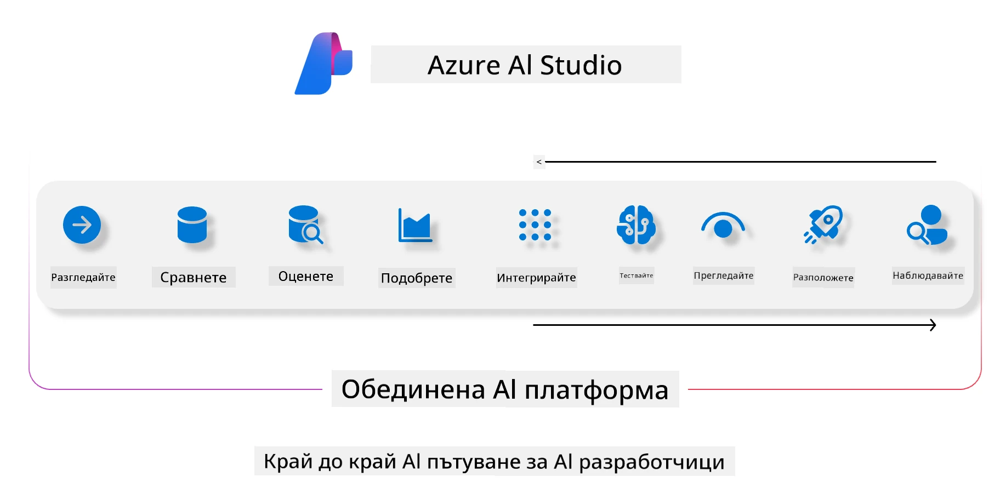
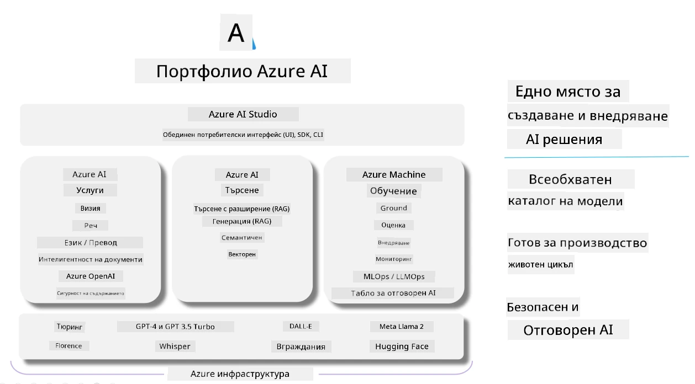

<!--
CO_OP_TRANSLATOR_METADATA:
{
  "original_hash": "7b4235159486df4000e16b7b46ddfec3",
  "translation_date": "2025-07-16T22:33:54+00:00",
  "source_file": "md/01.Introduction/05/AIFoundry.md",
  "language_code": "bg"
}
-->
# **Използване на Azure AI Foundry за оценка**

Как да оцените вашето генеративно AI приложение с помощта на [Azure AI Foundry](https://ai.azure.com?WT.mc_id=aiml-138114-kinfeylo). Независимо дали оценявате еднократни или многократни разговори, Azure AI Foundry предоставя инструменти за оценка на представянето и безопасността на модела.

## Как да оцените генеративни AI приложения с Azure AI Foundry  
За по-подробни инструкции вижте [документацията на Azure AI Foundry](https://learn.microsoft.com/azure/ai-studio/how-to/evaluate-generative-ai-app?WT.mc_id=aiml-138114-kinfeylo)

Ето стъпките за започване:

## Оценка на генеративни AI модели в Azure AI Foundry

**Изисквания**

- Тестов набор от данни във формат CSV или JSON.  
- Разположен генеративен AI модел (като Phi-3, GPT 3.5, GPT 4 или Davinci модели).  
- Среда за изпълнение с изчислителен инстанс за провеждане на оценката.

## Вградени метрики за оценка

Azure AI Foundry ви позволява да оценявате както еднократни, така и сложни многократни разговори.  
За сценарии с Retrieval Augmented Generation (RAG), при които моделът е базиран на конкретни данни, можете да оцените представянето с помощта на вградените метрики.  
Освен това, можете да оценявате и общи сценарии за отговаряне на еднократни въпроси (без RAG).

## Създаване на оценъчен процес

От интерфейса на Azure AI Foundry отидете на страницата Evaluate или Prompt Flow.  
Следвайте съветника за създаване на оценка, за да настроите оценъчен процес. Можете да зададете и име на оценката по избор.  
Изберете сценария, който съответства на целите на вашето приложение.  
Изберете една или повече метрики за оценка, с които да прецените изхода на модела.

## Персонализиран оценъчен поток (по избор)

За по-голяма гъвкавост можете да създадете персонализиран оценъчен поток. Настройте процеса според вашите конкретни нужди.

## Преглед на резултатите

След като проведете оценката, можете да прегледате, разгледате и анализирате подробните метрики в Azure AI Foundry. Получете ценна информация за възможностите и ограниченията на вашето приложение.

**Note** Azure AI Foundry в момента е в публичен преглед, затова го използвайте за експерименти и разработка. За продукционни натоварвания обмислете други опции. Разгледайте официалната [документация на AI Foundry](https://learn.microsoft.com/azure/ai-studio/?WT.mc_id=aiml-138114-kinfeylo) за повече подробности и стъпка по стъпка инструкции.

**Отказ от отговорност**:  
Този документ е преведен с помощта на AI преводаческа услуга [Co-op Translator](https://github.com/Azure/co-op-translator). Въпреки че се стремим към точност, моля, имайте предвид, че автоматизираните преводи могат да съдържат грешки или неточности. Оригиналният документ на неговия роден език трябва да се счита за авторитетен източник. За критична информация се препоръчва професионален човешки превод. Ние не носим отговорност за каквито и да е недоразумения или неправилни тълкувания, произтичащи от използването на този превод.