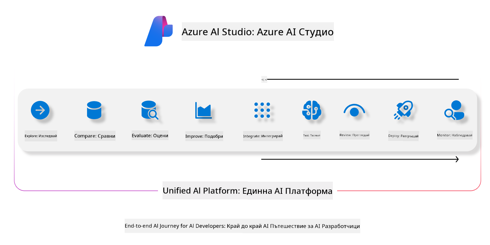
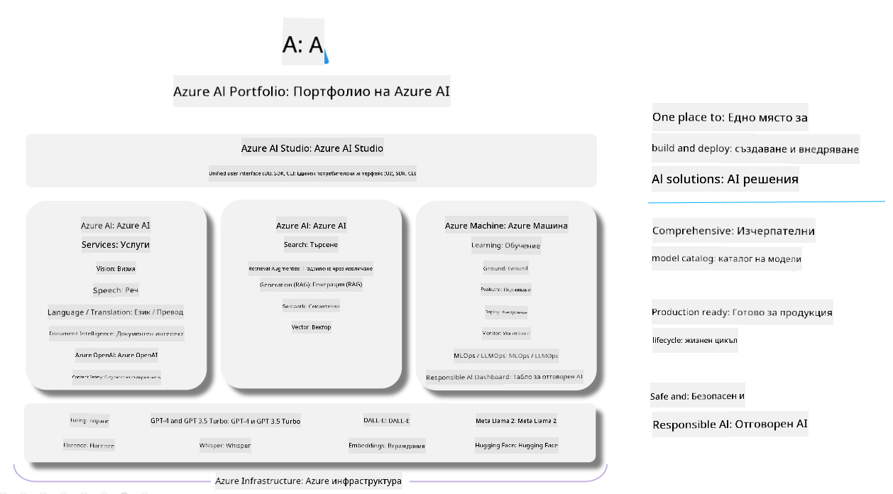

<!--
CO_OP_TRANSLATOR_METADATA:
{
  "original_hash": "7b4235159486df4000e16b7b46ddfec3",
  "translation_date": "2025-05-09T15:04:12+00:00",
  "source_file": "md/01.Introduction/05/AIFoundry.md",
  "language_code": "bg"
}
-->
# **Използване на Azure AI Foundry за оценка**

Как да оцените вашето генеративно AI приложение с помощта на [Azure AI Foundry](https://ai.azure.com?WT.mc_id=aiml-138114-kinfeylo). Независимо дали оценявате еднократни или многократни разговори, Azure AI Foundry предлага инструменти за проверка на представянето и безопасността на модела.

## Как да оценявате генеративни AI приложения с Azure AI Foundry
За по-подробни инструкции вижте [документацията на Azure AI Foundry](https://learn.microsoft.com/azure/ai-studio/how-to/evaluate-generative-ai-app?WT.mc_id=aiml-138114-kinfeylo)

Ето стъпките за започване:

## Оценка на генеративни AI модели в Azure AI Foundry

**Изисквания**

- Тестов набор от данни във формат CSV или JSON.
- Разположен генеративен AI модел (като Phi-3, GPT 3.5, GPT 4 или Davinci модели).
- Среда за изпълнение с изчислителен инстанс за провеждане на оценката.

## Вградени метрики за оценка

Azure AI Foundry позволява оценка както на еднократни, така и на сложни многократни разговори.  
За сценарии с Retrieval Augmented Generation (RAG), при които моделът е базиран на конкретни данни, можете да оцените представянето чрез вградените метрики.  
Освен това можете да оцените и общи еднократни въпроси и отговори (не-RAG).

## Създаване на оценъчен процес

От интерфейса на Azure AI Foundry отидете на страницата Evaluate или Prompt Flow.  
Следвайте съветника за създаване на оценка, за да настроите процеса. Можете да дадете и име по избор на оценката.  
Изберете сценария, който съответства на целите на вашето приложение.  
Изберете една или повече метрики за оценка, за да прецените резултатите на модела.

## Персонализиран оценъчен поток (по избор)

За повече гъвкавост можете да създадете персонализиран оценъчен поток. Персонализирайте процеса според конкретните си нужди.

## Преглед на резултатите

След като изпълните оценката, регистрирайте, разгледайте и анализирайте детайлните метрики в Azure AI Foundry. Получете по-добра представа за възможностите и ограниченията на вашето приложение.

**Note** Azure AI Foundry в момента е в публичен преглед, затова го използвайте за експерименти и разработка. За продукционни натоварвания разгледайте други опции. Вижте официалната [документация на AI Foundry](https://learn.microsoft.com/azure/ai-studio/?WT.mc_id=aiml-138114-kinfeylo) за повече информация и стъпка по стъпка инструкции.

**Отказ от отговорност**:  
Този документ е преведен с помощта на AI преводаческа услуга [Co-op Translator](https://github.com/Azure/co-op-translator). Въпреки че се стремим към точност, моля, имайте предвид, че автоматизираните преводи могат да съдържат грешки или неточности. Оригиналният документ на неговия първичен език трябва да се счита за авторитетен източник. За критична информация се препоръчва професионален човешки превод. Ние не носим отговорност за каквито и да е недоразумения или погрешни тълкувания, възникнали от използването на този превод.