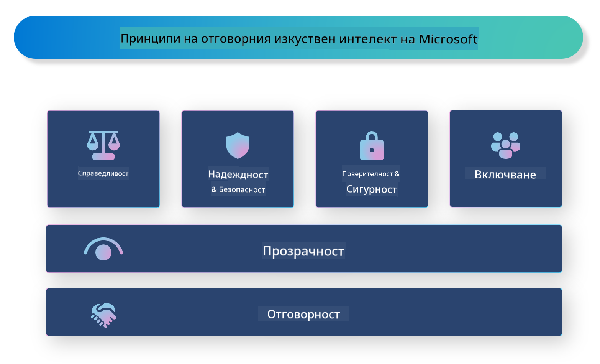

<!--
CO_OP_TRANSLATOR_METADATA:
{
  "original_hash": "805b96b20152936d8f4c587d90d6e06e",
  "translation_date": "2025-07-16T22:58:22+00:00",
  "source_file": "md/01.Introduction/05/ResponsibleAI.md",
  "language_code": "bg"
}
-->
# **Въведение в Responsible AI**

[Microsoft Responsible AI](https://www.microsoft.com/ai/responsible-ai?WT.mc_id=aiml-138114-kinfeylo) е инициатива, която цели да помогне на разработчиците и организациите да създават AI системи, които са прозрачни, надеждни и отговорни. Тази инициатива предоставя насоки и ресурси за разработване на отговорни AI решения, които се съобразяват с етични принципи като поверителност, справедливост и прозрачност. Ще разгледаме и някои от предизвикателствата и добрите практики, свързани с изграждането на отговорни AI системи.

## Преглед на Microsoft Responsible AI

**Етични принципи**

Microsoft Responsible AI се ръководи от набор от етични принципи, като поверителност, справедливост, прозрачност, отчетност и безопасност. Тези принципи са създадени, за да гарантират, че AI системите се разработват по етичен и отговорен начин.

**Прозрачен AI**

Microsoft Responsible AI подчертава значението на прозрачността в AI системите. Това включва предоставяне на ясни обяснения за начина, по който работят AI моделите, както и осигуряване на публичен достъп до източниците на данни и алгоритмите.

**Отговорен AI**

[Microsoft Responsible AI](https://www.microsoft.com/ai/responsible-ai?WT.mc_id=aiml-138114-kinfeylo) насърчава разработването на отговорни AI системи, които могат да предоставят прозрения за начина, по който AI моделите вземат решения. Това помага на потребителите да разберат и да имат доверие в резултатите от AI системите.

**Включване**

AI системите трябва да бъдат проектирани така, че да са полезни за всички. Microsoft се стреми да създаде инклузивен AI, който отчита различни гледни точки и избягва пристрастия или дискриминация.

**Надеждност и безопасност**

Гарантирането, че AI системите са надеждни и безопасни, е от съществено значение. Microsoft се фокусира върху изграждането на стабилни модели, които работят последователно и избягват вредни резултати.

**Справедливост в AI**

Microsoft Responsible AI признава, че AI системите могат да поддържат пристрастия, ако са обучени с пристрастни данни или алгоритми. Инициативата предоставя насоки за разработване на справедливи AI системи, които не дискриминират въз основа на фактори като раса, пол или възраст.

**Поверителност и сигурност**

Microsoft Responsible AI подчертава важността на защитата на поверителността на потребителите и сигурността на данните в AI системите. Това включва прилагане на силно криптиране на данните и контрол на достъпа, както и редовен одит на AI системите за уязвимости.

**Отговорност и отчетност**

Microsoft Responsible AI насърчава отговорността и отчетността при разработката и внедряването на AI. Това включва гарантиране, че разработчиците и организациите са наясно с потенциалните рискове, свързани с AI системите, и предприемат мерки за тяхното намаляване.

## Добри практики за изграждане на отговорни AI системи

**Разработвайте AI модели с разнообразни набори от данни**

За да се избегнат пристрастия в AI системите, е важно да се използват разнообразни набори от данни, които представят различни гледни точки и опит.

**Използвайте техники за обясним AI**

Техниките за обясним AI помагат на потребителите да разберат как AI моделите вземат решения, което повишава доверието в системата.

**Редовно одитирайте AI системите за уязвимости**

Редовните одити на AI системите помагат да се идентифицират потенциални рискове и уязвимости, които трябва да бъдат адресирани.

**Прилагайте силно криптиране на данните и контрол на достъпа**

Криптирането на данните и контролът на достъпа помагат за защитата на поверителността и сигурността на потребителите в AI системите.

**Следвайте етичните принципи при разработката на AI**

Спазването на етични принципи като справедливост, прозрачност и отчетност помага за изграждането на доверие в AI системите и гарантира, че те се разработват отговорно.

## Използване на AI Foundry за Responsible AI

[Azure AI Foundry](https://ai.azure.com?WT.mc_id=aiml-138114-kinfeylo) е мощна платформа, която позволява на разработчиците и организациите бързо да създават интелигентни, модерни, готови за пазара и отговорни приложения. Ето някои ключови функции и възможности на Azure AI Foundry:

**Готови за използване API-та и модели**

Azure AI Foundry предоставя предварително изградени и персонализируеми API-та и модели. Те покриват широк спектър от AI задачи, включително генеративен AI, обработка на естествен език за разговори, търсене, мониторинг, превод, реч, визуализация и вземане на решения.

**Prompt Flow**

Prompt flow в Azure AI Foundry ви позволява да създавате разговорни AI преживявания. Тази функция улеснява проектирането и управлението на разговорни потоци, което прави изграждането на чатботове, виртуални асистенти и други интерактивни приложения по-лесно.

**Retrieval Augmented Generation (RAG)**

RAG е техника, която комбинира подходи, базирани на извличане, с генеративни подходи. Тя подобрява качеството на генерираните отговори, като използва както предварително съществуващи знания (извличане), така и креативно генериране (генериране).

**Метрики за оценка и мониторинг на генеративен AI**

Azure AI Foundry предоставя инструменти за оценка и мониторинг на генеративни AI модели. Можете да прецените тяхната производителност, справедливост и други важни показатели, за да осигурите отговорно внедряване. Освен това, ако сте създали табло за управление, можете да използвате no-code UI в Azure Machine Learning Studio, за да персонализирате и генерирате Responsible AI Dashboard и свързаната scorecard, базирана на [Responsible AI Toolbox](https://responsibleaitoolbox.ai/?WT.mc_id=aiml-138114-kinfeylo) Python библиотеки. Тази scorecard ви помага да споделяте ключови прозрения, свързани със справедливост, важност на характеристиките и други съображения за отговорно внедряване както с технически, така и с нетехнически заинтересовани страни.

За да използвате AI Foundry с отговорен AI, можете да следвате тези добри практики:

**Определете проблема и целите на вашата AI система**

Преди да започнете процеса на разработка, е важно ясно да дефинирате проблема или целта, която вашата AI система трябва да реши. Това ще ви помогне да идентифицирате необходимите данни, алгоритми и ресурси за изграждане на ефективен модел.

**Съберете и предварително обработете релевантни данни**

Качеството и количеството на данните, използвани за обучение на AI система, могат значително да повлияят на нейната производителност. Затова е важно да съберете релевантни данни, да ги почистите, предварително обработите и да се уверите, че те са представителни за населението или проблема, който се опитвате да решите.

**Изберете подходящ алгоритъм за оценка**

Съществуват различни алгоритми за оценка. Важно е да изберете най-подходящия алгоритъм въз основа на вашите данни и проблем.

**Оценете и интерпретирайте модела**

След като сте изградили AI модел, е важно да оцените неговата производителност с подходящи метрики и да интерпретирате резултатите прозрачно. Това ще ви помогне да идентифицирате евентуални пристрастия или ограничения в модела и да направите подобрения, където е необходимо.

**Осигурете прозрачност и обяснимост**

AI системите трябва да бъдат прозрачни и обясними, за да могат потребителите да разберат как работят и как се вземат решенията. Това е особено важно за приложения, които имат значително въздействие върху човешкия живот, като здравеопазване, финанси и правни системи.

**Мониторирайте и актуализирайте модела**

AI системите трябва да се наблюдават и актуализират непрекъснато, за да се гарантира, че остават точни и ефективни с течение на времето. Това изисква постоянна поддръжка, тестване и повторно обучение на модела.

В заключение, Microsoft Responsible AI е инициатива, която цели да помогне на разработчиците и организациите да изграждат AI системи, които са прозрачни, надеждни и отговорни. Не забравяйте, че отговорното внедряване на AI е от ключово значение, а Azure AI Foundry цели да го направи практично за организациите. Следвайки етичните принципи и добрите практики, можем да гарантираме, че AI системите се разработват и внедряват по отговорен начин, който носи полза на обществото като цяло.

**Отказ от отговорност**:  
Този документ е преведен с помощта на AI преводаческа услуга [Co-op Translator](https://github.com/Azure/co-op-translator). Въпреки че се стремим към точност, моля, имайте предвид, че автоматизираните преводи могат да съдържат грешки или неточности. Оригиналният документ на неговия роден език трябва да се счита за авторитетен източник. За критична информация се препоръчва професионален човешки превод. Ние не носим отговорност за каквито и да е недоразумения или неправилни тълкувания, произтичащи от използването на този превод.