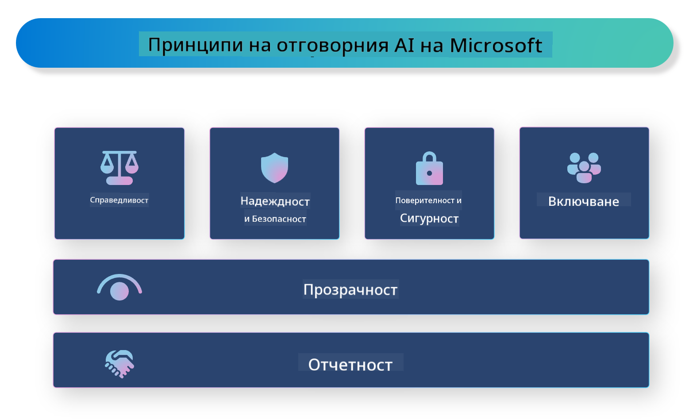

<!--
CO_OP_TRANSLATOR_METADATA:
{
  "original_hash": "805b96b20152936d8f4c587d90d6e06e",
  "translation_date": "2025-05-09T15:48:08+00:00",
  "source_file": "md/01.Introduction/05/ResponsibleAI.md",
  "language_code": "bg"
}
-->
# **Представяне на Отговорния ИИ**

[Microsoft Responsible AI](https://www.microsoft.com/ai/responsible-ai?WT.mc_id=aiml-138114-kinfeylo) е инициатива, която цели да помогне на разработчици и организации да изграждат ИИ системи, които са прозрачни, надеждни и отчетни. Инициативата предоставя насоки и ресурси за разработване на отговорни ИИ решения, съобразени с етични принципи като поверителност, справедливост и прозрачност. Ще разгледаме също някои от предизвикателствата и добрите практики, свързани с изграждането на отговорни ИИ системи.

## Преглед на Microsoft Responsible AI

**Етични принципи**

Microsoft Responsible AI се ръководи от набор от етични принципи като поверителност, справедливост, прозрачност, отчетност и безопасност. Тези принципи са създадени, за да гарантират, че ИИ системите се разработват по етичен и отговорен начин.

**Прозрачен ИИ**

Microsoft Responsible AI подчертава значението на прозрачността в ИИ системите. Това включва предоставяне на ясни обяснения за начина, по който работят ИИ моделите, както и осигуряване на публичен достъп до източниците на данни и алгоритмите.

**Отчетен ИИ**

[Microsoft Responsible AI](https://www.microsoft.com/ai/responsible-ai?WT.mc_id=aiml-138114-kinfeylo) насърчава разработването на отчетни ИИ системи, които могат да предоставят прозрения за начина, по който ИИ моделите взимат решения. Това помага на потребителите да разберат и да имат доверие в резултатите на ИИ системите.

**Включване**

ИИ системите трябва да бъдат проектирани така, че да са полезни за всички. Microsoft се стреми да създаде инклузивен ИИ, който отчита различни гледни точки и избягва пристрастия или дискриминация.

**Надеждност и безопасност**

Гарантирането, че ИИ системите са надеждни и безопасни, е от съществено значение. Microsoft се фокусира върху изграждането на здрави модели, които работят стабилно и избягват вредни резултати.

**Справедливост в ИИ**

Microsoft Responsible AI признава, че ИИ системите могат да поддържат пристрастия, ако са обучавани с пристрастни данни или алгоритми. Инициативата предоставя насоки за разработване на справедливи ИИ системи, които не дискриминират по признаци като раса, пол или възраст.

**Поверителност и сигурност**

Microsoft Responsible AI акцентира върху важността на защитата на поверителността на потребителите и сигурността на данните в ИИ системите. Това включва прилагане на силно криптиране на данните и контрол на достъпа, както и редовен одит на ИИ системите за уязвимости.

**Отчетност и отговорност**

Microsoft Responsible AI насърчава отчетността и отговорността при разработката и внедряването на ИИ. Това включва гарантиране, че разработчиците и организациите са наясно с потенциалните рискове, свързани с ИИ системите, и предприемат мерки за намаляването им.

## Добри практики за изграждане на отговорни ИИ системи

**Разработвайте ИИ модели с използване на разнообразни набори от данни**

За да се избегнат пристрастия в ИИ системите, е важно да се използват разнообразни набори от данни, които представят различни гледни точки и опит.

**Използвайте техники за обясним ИИ**

Техниките за обясним ИИ помагат на потребителите да разберат как ИИ моделите взимат решения, което повишава доверието в системата.

**Редовно одитирайте ИИ системите за уязвимости**

Редовните одити на ИИ системите могат да помогнат за идентифициране на потенциални рискове и уязвимости, които трябва да бъдат адресирани.

**Прилагайте силно криптиране на данните и контрол на достъпа**

Криптирането на данните и контрола на достъпа помагат за защитата на поверителността и сигурността на потребителите в ИИ системите.

**Спазвайте етичните принципи при разработката на ИИ**

Спазването на етични принципи като справедливост, прозрачност и отчетност помага да се изгради доверие в ИИ системите и да се гарантира, че те се разработват отговорно.

## Използване на AI Foundry за Отговорен ИИ

[Azure AI Foundry](https://ai.azure.com?WT.mc_id=aiml-138114-kinfeylo) е мощна платформа, която позволява на разработчици и организации бързо да създават интелигентни, съвременни, готови за пазара и отговорни приложения. Ето някои ключови функции и възможности на Azure AI Foundry:

**Готови за използване API и модели**

Azure AI Foundry предоставя предварително изградени и персонализируеми API и модели. Те покриват широк спектър от ИИ задачи, включително генеративен ИИ, обработка на естествен език за разговори, търсене, мониторинг, превод, реч, визуално разпознаване и вземане на решения.

**Prompt Flow**

Prompt Flow в Azure AI Foundry ви позволява да създавате разговорни ИИ преживявания. Той дава възможност за проектиране и управление на разговорни потоци, което улеснява изграждането на чатботове, виртуални асистенти и други интерактивни приложения.

**Retrieval Augmented Generation (RAG)**

RAG е техника, която комбинира подходи, базирани на извличане и генериране. Тя подобрява качеството на генерираните отговори, използвайки както предварително налични знания (извличане), така и креативно генериране (генериране).

**Метрики за оценка и мониторинг на генеративен ИИ**

Azure AI Foundry предоставя инструменти за оценка и мониторинг на генеративни ИИ модели. Можете да преценявате тяхното представяне, справедливост и други важни метрики, за да осигурите отговорно внедряване. Освен това, ако сте създали табло за управление, можете да използвате no-code UI в Azure Machine Learning Studio за персонализиране и генериране на Responsible AI Dashboard и свързаната scorecard, базирана на [Repsonsible AI Toolbox](https://responsibleaitoolbox.ai/?WT.mc_id=aiml-138114-kinfeylo) Python библиотеки. Тази scorecard ви помага да споделяте ключови прозрения, свързани със справедливостта, важността на характеристиките и други аспекти на отговорното внедряване както с технически, така и с нетехнически заинтересовани страни.

За да използвате AI Foundry с отговорен ИИ, можете да следвате тези добри практики:

**Определете проблема и целите на вашата ИИ система**

Преди да започнете разработката, е важно ясно да дефинирате проблема или целта, която вашата ИИ система трябва да реши. Това ще ви помогне да идентифицирате необходимите данни, алгоритми и ресурси за изграждане на ефективен модел.

**Съберете и предварително обработете релевантни данни**

Качеството и количеството на данните, използвани за обучение на ИИ система, имат значително влияние върху нейната производителност. Затова е важно да съберете релевантни данни, да ги почистите, предварително обработите и да се уверите, че те са представителни за популацията или проблема, който искате да решите.

**Изберете подходяща оценка**

Има различни алгоритми за оценка. Важно е да изберете най-подходящия алгоритъм според вашите данни и проблем.

**Оценете и интерпретирайте модела**

След като сте изградили ИИ модел, е важно да оцените неговото представяне с подходящи метрики и да интерпретирате резултатите прозрачно. Това ще ви помогне да откриете евентуални пристрастия или ограничения в модела и да направите подобрения, ако е необходимо.

**Осигурете прозрачност и обяснимост**

ИИ системите трябва да са прозрачни и обясними, за да могат потребителите да разберат как работят и как се взимат решения. Това е особено важно за приложения с голямо въздействие върху човешкия живот, като здравеопазване, финанси и правни системи.

**Наблюдавайте и актуализирайте модела**

ИИ системите трябва да се наблюдават и актуализират постоянно, за да останат точни и ефективни с времето. Това изисква непрекъсната поддръжка, тестване и преквалификация на модела.

В заключение, Microsoft Responsible AI е инициатива, която цели да помогне на разработчици и организации да изграждат ИИ системи, които са прозрачни, надеждни и отчетни. Не забравяйте, че отговорното прилагане на ИИ е от ключово значение, а Azure AI Foundry има за цел да го направи практично за организациите. Като следваме етични принципи и добри практики, можем да гарантираме, че ИИ системите се разработват и внедряват по отговорен начин, който носи полза на обществото като цяло.

**Отказ от отговорност**:  
Този документ е преведен с помощта на AI преводаческа услуга [Co-op Translator](https://github.com/Azure/co-op-translator). Въпреки че се стремим към точност, моля, имайте предвид, че автоматизираните преводи могат да съдържат грешки или неточности. Оригиналният документ на неговия роден език трябва да се счита за авторитетен източник. За критична информация се препоръчва професионален човешки превод. Ние не носим отговорност за никакви недоразумения или неправилни тълкувания, произтичащи от използването на този превод.