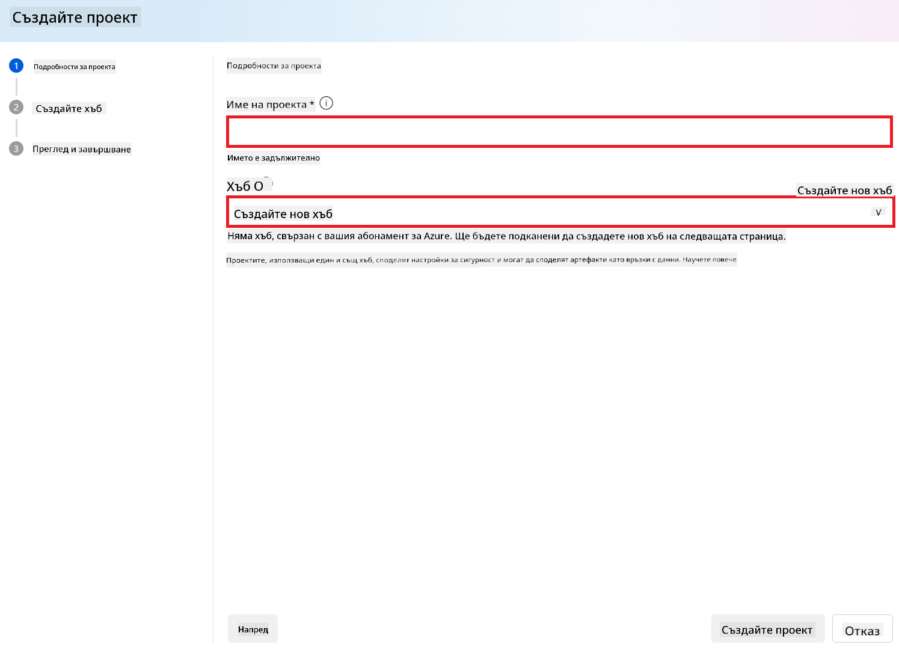
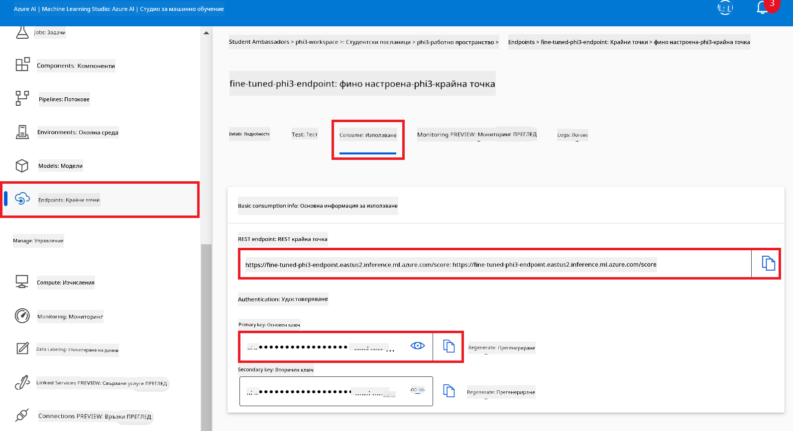
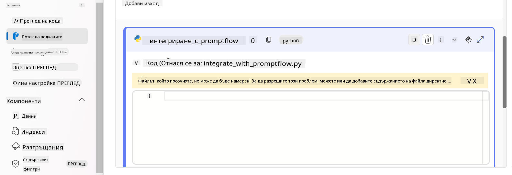
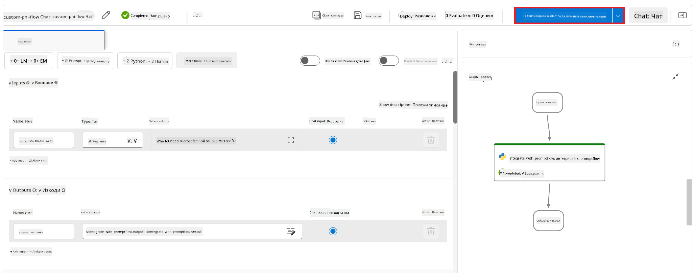
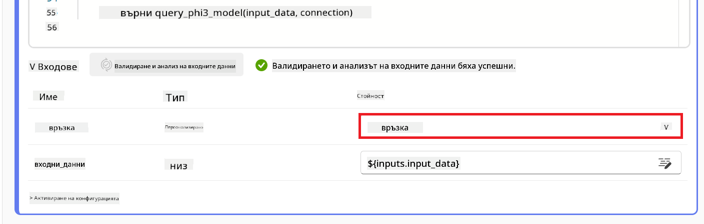
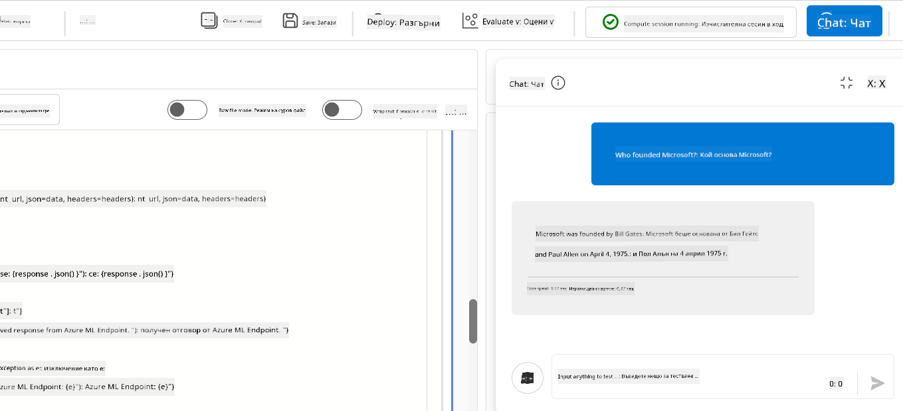

<!--
CO_OP_TRANSLATOR_METADATA:
{
  "original_hash": "80a853c08e4ee25ef9b4bfcedd8990da",
  "translation_date": "2025-07-16T23:56:07+00:00",
  "source_file": "md/02.Application/01.TextAndChat/Phi3/E2E_Phi-3-Evaluation_AIFoundry.md",
  "language_code": "bg"
}
-->
# Оценка на фино настроения модел Phi-3 / Phi-3.5 в Azure AI Foundry с фокус върху принципите за отговорен AI на Microsoft

Този краен (E2E) пример е базиран на ръководството "[Evaluate Fine-tuned Phi-3 / 3.5 Models in Azure AI Foundry Focusing on Microsoft's Responsible AI](https://techcommunity.microsoft.com/blog/educatordeveloperblog/evaluate-fine-tuned-phi-3--3-5-models-in-azure-ai-studio-focusing-on-microsofts-/4227850?WT.mc_id=aiml-137032-kinfeylo)" от Microsoft Tech Community.

## Преглед

### Как може да оцените безопасността и представянето на фино настроен модел Phi-3 / Phi-3.5 в Azure AI Foundry?

Финото настройване на модел понякога може да доведе до нежелани или неочаквани отговори. За да се гарантира, че моделът остава безопасен и ефективен, е важно да се оцени потенциалът му да генерира вредно съдържание и способността му да предоставя точни, релевантни и свързани отговори. В този урок ще научите как да оцените безопасността и представянето на фино настроен модел Phi-3 / Phi-3.5, интегриран с Prompt flow в Azure AI Foundry.

Ето процеса на оценка в Azure AI Foundry.


*Източник на изображението: [Evaluation of generative AI applications](https://learn.microsoft.com/azure/ai-studio/concepts/evaluation-approach-gen-ai?wt.mc_id%3Dstudentamb_279723)*

> [!NOTE]
>
> За по-подробна информация и допълнителни ресурси за Phi-3 / Phi-3.5, посетете [Phi-3CookBook](https://github.com/microsoft/Phi-3CookBook?wt.mc_id=studentamb_279723).

### Предварителни изисквания

- [Python](https://www.python.org/downloads)
- [Абонамент за Azure](https://azure.microsoft.com/free?wt.mc_id=studentamb_279723)
- [Visual Studio Code](https://code.visualstudio.com)
- Фино настроен модел Phi-3 / Phi-3.5

### Съдържание

1. [**Сценарий 1: Въведение в оценката с Prompt flow на Azure AI Foundry**](../../../../../../md/02.Application/01.TextAndChat/Phi3)

    - [Въведение в оценката на безопасността](../../../../../../md/02.Application/01.TextAndChat/Phi3)
    - [Въведение в оценката на представянето](../../../../../../md/02.Application/01.TextAndChat/Phi3)

1. [**Сценарий 2: Оценка на модела Phi-3 / Phi-3.5 в Azure AI Foundry**](../../../../../../md/02.Application/01.TextAndChat/Phi3)

    - [Преди да започнете](../../../../../../md/02.Application/01.TextAndChat/Phi3)
    - [Деплойване на Azure OpenAI за оценка на модела Phi-3 / Phi-3.5](../../../../../../md/02.Application/01.TextAndChat/Phi3)
    - [Оценка на фино настроения модел Phi-3 / Phi-3.5 с помощта на Prompt flow в Azure AI Foundry](../../../../../../md/02.Application/01.TextAndChat/Phi3)

1. [Поздравления!](../../../../../../md/02.Application/01.TextAndChat/Phi3)

## **Сценарий 1: Въведение в оценката с Prompt flow на Azure AI Foundry**

### Въведение в оценката на безопасността

За да сте сигурни, че вашият AI модел е етичен и безопасен, е от съществено значение да го оцените спрямо принципите за отговорен AI на Microsoft. В Azure AI Foundry оценките за безопасност ви позволяват да проверите уязвимостта на модела към jailbreak атаки и потенциала му да генерира вредно съдържание, което е в пълно съответствие с тези принципи.


*Източник на изображението: [Evaluation of generative AI applications](https://learn.microsoft.com/azure/ai-studio/concepts/evaluation-approach-gen-ai?wt.mc_id%3Dstudentamb_279723)*

#### Принципите за отговорен AI на Microsoft

Преди да започнете техническите стъпки, е важно да разберете принципите за отговорен AI на Microsoft – етичен рамков модел, създаден да насочва отговорното разработване, внедряване и експлоатация на AI системи. Тези принципи ръководят отговорния дизайн, разработка и внедряване на AI системи, като гарантират, че AI технологиите се изграждат по начин, който е справедлив, прозрачен и приобщаващ. Те са основата за оценка на безопасността на AI моделите.

Принципите за отговорен AI на Microsoft включват:

- **Справедливост и приобщаване**: AI системите трябва да третират всички справедливо и да избягват да влияят по различен начин на сходни групи хора. Например, когато AI системи предоставят насоки за медицинско лечение, кандидатстване за заем или заетост, те трябва да дават еднакви препоръки на всички с подобни симптоми, финансово състояние или професионални квалификации.

- **Надеждност и безопасност**: За да се изгради доверие, е критично AI системите да работят надеждно, безопасно и последователно. Тези системи трябва да функционират според първоначалния си дизайн, да реагират безопасно при неочаквани условия и да устояват на вредни манипулации. Тяхното поведение и разнообразието от условия, които могат да обработват, отразяват обхвата на ситуации и обстоятелства, предвидени от разработчиците по време на проектиране и тестване.

- **Прозрачност**: Когато AI системи подпомагат вземането на решения с голямо въздействие върху живота на хората, е важно хората да разбират как са взети тези решения. Например, банка може да използва AI система, за да определи дали дадено лице е кредитоспособно. Компания може да използва AI система, за да избере най-подходящите кандидати за работа.

- **Поверителност и сигурност**: С нарастващото разпространение на AI, защитата на поверителността и сигурността на личната и бизнес информация става все по-важна и сложна. При AI, поверителността и сигурността на данните изискват специално внимание, тъй като достъпът до данни е от съществено значение за точни и информирани прогнози и решения.

- **Отговорност**: Хората, които проектират и внедряват AI системи, трябва да носят отговорност за начина, по който техните системи функционират. Организациите трябва да се основават на индустриални стандарти за разработване на норми за отговорност. Тези норми гарантират, че AI системите не са окончателният авторитет при решения, които засягат живота на хората, и че хората запазват значим контрол върху иначе силно автономни AI системи.


*Източник на изображението: [What is Responsible AI?](https://learn.microsoft.com/azure/machine-learning/concept-responsible-ai?view=azureml-api-2&viewFallbackFrom=azureml-api-2%253fwt.mc_id%3Dstudentamb_279723)*

> [!NOTE]
> За да научите повече за принципите за отговорен AI на Microsoft, посетете [What is Responsible AI?](https://learn.microsoft.com/azure/machine-learning/concept-responsible-ai?view=azureml-api-2?wt.mc_id=studentamb_279723).

#### Метрики за безопасност

В този урок ще оцените безопасността на фино настроения модел Phi-3, използвайки метриките за безопасност на Azure AI Foundry. Тези метрики ви помагат да прецените потенциала на модела да генерира вредно съдържание и уязвимостта му към jailbreak атаки. Метриките за безопасност включват:

- **Съдържание, свързано със самонараняване**: Оценява дали моделът има склонност да генерира съдържание, свързано със самонараняване.
- **Омразно и несправедливо съдържание**: Оценява дали моделът има склонност да генерира омразно или несправедливо съдържание.
- **Насилствено съдържание**: Оценява дали моделът има склонност да генерира насилствено съдържание.
- **Сексуално съдържание**: Оценява дали моделът има склонност да генерира неподходящо сексуално съдържание.

Оценката на тези аспекти гарантира, че AI моделът не произвежда вредно или обидно съдържание, съобразено с обществените ценности и регулаторните изисквания.


### Въведение в оценката на представянето

За да сте сигурни, че вашият AI модел работи според очакванията, е важно да оцените представянето му спрямо метрики за ефективност. В Azure AI Foundry оценките на представянето ви позволяват да прецените ефективността на модела при генериране на точни, релевантни и свързани отговори.


*Източник на изображението: [Evaluation of generative AI applications](https://learn.microsoft.com/azure/ai-studio/concepts/evaluation-approach-gen-ai?wt.mc_id%3Dstudentamb_279723)*

#### Метрики за представяне

В този урок ще оцените представянето на фино настроения модел Phi-3 / Phi-3.5, използвайки метриките за представяне на Azure AI Foundry. Тези метрики ви помагат да прецените ефективността на модела при генериране на точни, релевантни и свързани отговори. Метриките за представяне включват:

- **Основаност (Groundedness)**: Оценява доколко генерираните отговори съответстват на информацията от входния източник.
- **Релевантност**: Оценява уместността на генерираните отговори спрямо зададените въпроси.
- **Кохерентност**: Оценява колко плавно тече генерираният текст, дали се чете естествено и прилича на човешки език.
- **Течност (Fluency)**: Оценява езиковата компетентност на генерирания текст.
- **GPT сходство**: Сравнява генерирания отговор с истинските данни за сходство.
- **F1 скор**: Изчислява съотношението на споделените думи между генерирания отговор и изходните данни.

Тези метрики ви помагат да оцените ефективността на модела при генериране на точни, релевантни и свързани отговори.


## **Сценарий 2: Оценка на модела Phi-3 / Phi-3.5 в Azure AI Foundry**

### Преди да започнете

Този урок е продължение на предишните блог постове, "[Fine-Tune and Integrate Custom Phi-3 Models with Prompt Flow: Step-by-Step Guide](https://techcommunity.microsoft.com/t5/educator-developer-blog/fine-tune-and-integrate-custom-phi-3-models-with-prompt-flow/ba-p/4178612?wt.mc_id=studentamb_279723)" и "[Fine-Tune and Integrate Custom Phi-3 Models with Prompt Flow in Azure AI Foundry](https://techcommunity.microsoft.com/t5/educator-developer-blog/fine-tune-and-integrate-custom-phi-3-models-with-prompt-flow-in/ba-p/4191726?wt.mc_id=studentamb_279723)." В тези публикации разгледахме процеса на фино настройване на модел Phi-3 / Phi-3.5 в Azure AI Foundry и интегрирането му с Prompt flow.

В този урок ще деплойнете Azure OpenAI модел като оценител в Azure AI Foundry и ще го използвате за оценка на вашия фино настроен модел Phi-3 / Phi-3.5.

Преди да започнете този урок, уверете се, че разполагате със следните предварителни изисквания, описани в предишните уроци:

1. Подготвен набор от данни за оценка на фино настроения модел Phi-3 / Phi-3.5.
1. Модел Phi-3 / Phi-3.5, който е фино настроен и деплойнат в Azure Machine Learning.
1. Prompt flow, интегриран с вашия фино настроен модел Phi-3 / Phi-3.5 в Azure AI Foundry.

> [!NOTE]
> Ще използвате файла *test_data.jsonl*, намиращ се в папката data от набора данни **ULTRACHAT_200k**, изтеглен в предишните блог постове, като набор от данни за оценка на фино настроения модел Phi-3 / Phi-3.5.

#### Интегриране на персонализирания модел Phi-3 / Phi-3.5 с Prompt flow в Azure AI Foundry (подход с приоритет на кода)
> [!NOTE]
> Ако сте следвали подхода с нисък код, описан в "[Fine-Tune and Integrate Custom Phi-3 Models with Prompt Flow in Azure AI Foundry](https://techcommunity.microsoft.com/t5/educator-developer-blog/fine-tune-and-integrate-custom-phi-3-models-with-prompt-flow-in/ba-p/4191726?wt.mc_id=studentamb_279723)", можете да пропуснете това упражнение и да преминете към следващото.
> Въпреки това, ако сте използвали подхода, базиран на код, описан в "[Fine-Tune and Integrate Custom Phi-3 Models with Prompt Flow: Step-by-Step Guide](https://techcommunity.microsoft.com/t5/educator-developer-blog/fine-tune-and-integrate-custom-phi-3-models-with-prompt-flow/ba-p/4178612?wt.mc_id=studentamb_279723)" за фина настройка и разгръщане на вашия Phi-3 / Phi-3.5 модел, процесът на свързване на модела с Prompt flow е малко по-различен. Ще научите този процес в това упражнение.
За да продължите, трябва да интегрирате вашия фино настроен модел Phi-3 / Phi-3.5 в Prompt flow в Azure AI Foundry.

#### Създаване на Azure AI Foundry Hub

Трябва да създадете Hub преди да създадете Проект. Hub действа като Resource Group, позволявайки ви да организирате и управлявате множество Проекти в Azure AI Foundry.

1. Влезте в [Azure AI Foundry](https://ai.azure.com/?wt.mc_id=studentamb_279723).

1. Изберете **All hubs** от лявата странична лента.

1. Изберете **+ New hub** от навигационното меню.

    

1. Изпълнете следните задачи:

    - Въведете **Hub name**. Трябва да е уникално име.
    - Изберете вашия Azure **Subscription**.
    - Изберете **Resource group**, която да използвате (създайте нова, ако е необходимо).
    - Изберете **Location**, която желаете да използвате.
    - Изберете **Connect Azure AI Services**, които да използвате (създайте нови, ако е необходимо).
    - Изберете **Connect Azure AI Search** и изберете **Skip connecting**.

    

1. Изберете **Next**.

#### Създаване на Azure AI Foundry Проект

1. В създадения от вас Hub изберете **All projects** от лявата странична лента.

1. Изберете **+ New project** от навигационното меню.

    

1. Въведете **Project name**. Трябва да е уникално име.

    

1. Изберете **Create a project**.

#### Добавяне на персонализирана връзка за фино настроения модел Phi-3 / Phi-3.5

За да интегрирате вашия персонализиран модел Phi-3 / Phi-3.5 с Prompt flow, трябва да запазите endpoint и ключа на модела в персонализирана връзка. Тази настройка осигурява достъп до вашия модел в Prompt flow.

#### Настройване на api ключ и endpoint uri на фино настроения модел Phi-3 / Phi-3.5

1. Посетете [Azure ML Studio](https://ml.azure.com/home?wt.mc_id=studentamb_279723).

1. Отидете в Azure Machine learning workspace, който сте създали.

1. Изберете **Endpoints** от лявата странична лента.

    

1. Изберете endpoint, който сте създали.

    

1. Изберете **Consume** от навигационното меню.

1. Копирайте вашия **REST endpoint** и **Primary key**.

    

#### Добавяне на персонализираната връзка

1. Посетете [Azure AI Foundry](https://ai.azure.com/?wt.mc_id=studentamb_279723).

1. Отидете в Azure AI Foundry проекта, който сте създали.

1. В проекта, който сте създали, изберете **Settings** от лявата странична лента.

1. Изберете **+ New connection**.

    

1. Изберете **Custom keys** от навигационното меню.

    

1. Изпълнете следните задачи:

    - Изберете **+ Add key value pairs**.
    - За името на ключа въведете **endpoint** и поставете endpoint-а, който копирахте от Azure ML Studio, в полето за стойност.
    - Отново изберете **+ Add key value pairs**.
    - За името на ключа въведете **key** и поставете ключа, който копирахте от Azure ML Studio, в полето за стойност.
    - След добавяне на ключовете, маркирайте **is secret**, за да предотвратите излагането на ключа.

    

1. Изберете **Add connection**.

#### Създаване на Prompt flow

Вече добавихте персонализирана връзка в Azure AI Foundry. Сега нека създадем Prompt flow, като следвате следните стъпки. След това ще свържете този Prompt flow с персонализираната връзка, за да използвате фино настроения модел в Prompt flow.

1. Отидете в Azure AI Foundry проекта, който сте създали.

1. Изберете **Prompt flow** от лявата странична лента.

1. Изберете **+ Create** от навигационното меню.

    

1. Изберете **Chat flow** от навигационното меню.

    

1. Въведете **Folder name**, който искате да използвате.

    

1. Изберете **Create**.

#### Настройване на Prompt flow за чат с вашия персонализиран модел Phi-3 / Phi-3.5

Трябва да интегрирате фино настроения модел Phi-3 / Phi-3.5 в Prompt flow. Въпреки това, съществуващият Prompt flow не е проектиран за тази цел. Затова трябва да преработите Prompt flow, за да позволите интеграцията на персонализирания модел.

1. В Prompt flow изпълнете следните задачи, за да изградите наново съществуващия flow:

    - Изберете **Raw file mode**.
    - Изтрийте целия съществуващ код във файла *flow.dag.yml*.
    - Добавете следния код във *flow.dag.yml*.

        ```yml
        inputs:
          input_data:
            type: string
            default: "Who founded Microsoft?"

        outputs:
          answer:
            type: string
            reference: ${integrate_with_promptflow.output}

        nodes:
        - name: integrate_with_promptflow
          type: python
          source:
            type: code
            path: integrate_with_promptflow.py
          inputs:
            input_data: ${inputs.input_data}
        ```

    - Изберете **Save**.

    

1. Добавете следния код в *integrate_with_promptflow.py*, за да използвате персонализирания модел Phi-3 / Phi-3.5 в Prompt flow.

    ```python
    import logging
    import requests
    from promptflow import tool
    from promptflow.connections import CustomConnection

    # Logging setup
    logging.basicConfig(
        format="%(asctime)s - %(levelname)s - %(name)s - %(message)s",
        datefmt="%Y-%m-%d %H:%M:%S",
        level=logging.DEBUG
    )
    logger = logging.getLogger(__name__)

    def query_phi3_model(input_data: str, connection: CustomConnection) -> str:
        """
        Send a request to the Phi-3 / Phi-3.5 model endpoint with the given input data using Custom Connection.
        """

        # "connection" is the name of the Custom Connection, "endpoint", "key" are the keys in the Custom Connection
        endpoint_url = connection.endpoint
        api_key = connection.key

        headers = {
            "Content-Type": "application/json",
            "Authorization": f"Bearer {api_key}"
        }
    data = {
        "input_data": [input_data],
        "params": {
            "temperature": 0.7,
            "max_new_tokens": 128,
            "do_sample": True,
            "return_full_text": True
            }
        }
        try:
            response = requests.post(endpoint_url, json=data, headers=headers)
            response.raise_for_status()
            
            # Log the full JSON response
            logger.debug(f"Full JSON response: {response.json()}")

            result = response.json()["output"]
            logger.info("Successfully received response from Azure ML Endpoint.")
            return result
        except requests.exceptions.RequestException as e:
            logger.error(f"Error querying Azure ML Endpoint: {e}")
            raise

    @tool
    def my_python_tool(input_data: str, connection: CustomConnection) -> str:
        """
        Tool function to process input data and query the Phi-3 / Phi-3.5 model.
        """
        return query_phi3_model(input_data, connection)

    ```

    

> [!NOTE]
> За по-подробна информация относно използването на Prompt flow в Azure AI Foundry, можете да се обърнете към [Prompt flow в Azure AI Foundry](https://learn.microsoft.com/azure/ai-studio/how-to/prompt-flow).

1. Изберете **Chat input**, **Chat output**, за да активирате чата с вашия модел.

    

1. Сега сте готови да чатите с вашия персонализиран модел Phi-3 / Phi-3.5. В следващото упражнение ще научите как да стартирате Prompt flow и да го използвате за чат с вашия фино настроен модел Phi-3 / Phi-3.5.

> [!NOTE]
>
> Преработеният flow трябва да изглежда като на изображението по-долу:
>
> 
>

#### Стартиране на Prompt flow

1. Изберете **Start compute sessions**, за да стартирате Prompt flow.

    

1. Изберете **Validate and parse input**, за да обновите параметрите.

    

1. Изберете **Value** на **connection** към персонализираната връзка, която сте създали. Например, *connection*.

    

#### Чат с вашия персонализиран модел Phi-3 / Phi-3.5

1. Изберете **Chat**.

    

1. Ето пример за резултатите: Сега можете да чатите с вашия персонализиран модел Phi-3 / Phi-3.5. Препоръчително е да задавате въпроси, базирани на данните, използвани за фино настройване.

    

### Деплойване на Azure OpenAI за оценка на модела Phi-3 / Phi-3.5

За да оцените модела Phi-3 / Phi-3.5 в Azure AI Foundry, трябва да деплойнете Azure OpenAI модел. Този модел ще се използва за оценка на представянето на Phi-3 / Phi-3.5.

#### Деплойване на Azure OpenAI

1. Влезте в [Azure AI Foundry](https://ai.azure.com/?wt.mc_id=studentamb_279723).

1. Отидете в Azure AI Foundry проекта, който сте създали.

    

1. В проекта, който сте създали, изберете **Deployments** от лявата странична лента.

1. Изберете **+ Deploy model** от навигационното меню.

1. Изберете **Deploy base model**.

    

1. Изберете Azure OpenAI модела, който искате да използвате. Например, **gpt-4o**.

    

1. Изберете **Confirm**.

### Оценка на фино настроения модел Phi-3 / Phi-3.5 с помощта на Prompt flow evaluation в Azure AI Foundry

### Стартиране на нова оценка

1. Посетете [Azure AI Foundry](https://ai.azure.com/?wt.mc_id=studentamb_279723).

1. Отидете в Azure AI Foundry проекта, който сте създали.

    

1. В проекта, който сте създали, изберете **Evaluation** от лявата странична лента.

1. Изберете **+ New evaluation** от навигационното меню.

    

1. Изберете **Prompt flow** evaluation.

    

1. Изпълнете следните задачи:

    - Въведете име на оценката. Трябва да е уникално.
    - Изберете **Question and answer without context** като тип задача, тъй като наборът от данни **ULTRACHAT_200k**, използван в това ръководство, не съдържа контекст.
    - Изберете prompt flow, който искате да оцените.

    

1. Изберете **Next**.

1. Изпълнете следните задачи:

    - Изберете **Add your dataset**, за да качите набора от данни. Например, можете да качите тестовия файл, като *test_data.json1*, който е включен при изтегляне на **ULTRACHAT_200k** набора.
    - Изберете подходящата **Dataset column**, която съответства на вашия набор от данни. Например, ако използвате **ULTRACHAT_200k**, изберете **${data.prompt}** като колона.

    

1. Изберете **Next**.

1. Изпълнете следните задачи за конфигуриране на метриките за производителност и качество:

    - Изберете метриките за производителност и качество, които искате да използвате.
    - Изберете Azure OpenAI модела, който създадохте за оценка. Например, изберете **gpt-4o**.

    

1. Изпълнете следните задачи за конфигуриране на метриките за риск и безопасност:

    - Изберете метриките за риск и безопасност, които искате да използвате.
    - Изберете прага за изчисляване на процента на дефекти. Например, изберете **Medium**.
    - За **question**, изберете **Data source** да бъде **{$data.prompt}**.
    - За **answer**, изберете **Data source** да бъде **{$run.outputs.answer}**.
    - За **ground_truth**, изберете **Data source** да бъде **{$data.message}**.

    

1. Изберете **Next**.

1. Изберете **Submit**, за да стартирате оценката.

1. Оценката ще отнеме известно време. Можете да следите напредъка в таба **Evaluation**.

### Преглед на резултатите от оценката
> [!NOTE]
> Представените по-долу резултати имат за цел да илюстрират процеса на оценяване. В този урок използвахме модел, донастроен върху сравнително малък набор от данни, което може да доведе до по-слаби резултати. Реалните резултати могат значително да варират в зависимост от размера, качеството и разнообразието на използвания набор от данни, както и от конкретната конфигурация на модела.
След като оценката приключи, можете да прегледате резултатите както за показатели за производителност, така и за безопасност.

1. Показатели за производителност и качество:

    - оценете ефективността на модела при генериране на свързани, плавни и релевантни отговори.

    

1. Показатели за риск и безопасност:

    - Уверете се, че изходите на модела са безопасни и съответстват на Принципите за отговорен ИИ, като избягват всякакво вредно или обидно съдържание.

    

1. Можете да превъртите надолу, за да видите **Подробни резултати от показателите**.

    

1. Чрез оценка на вашия персонализиран модел Phi-3 / Phi-3.5 спрямо показатели за производителност и безопасност, можете да потвърдите, че моделът не само е ефективен, но и спазва практиките за отговорен ИИ, което го прави готов за реално внедряване.

## Поздравления!

### Вие завършихте този урок

Успешно оценихте финно настроения модел Phi-3, интегриран с Prompt flow в Azure AI Foundry. Това е важна стъпка за гарантиране, че вашите AI модели не само работят добре, но и спазват Принципите за отговорен ИИ на Microsoft, за да ви помогнат да изградите надеждни и доверени AI приложения.


## Почистване на Azure ресурси

Почистете вашите Azure ресурси, за да избегнете допълнителни такси по акаунта си. Отидете в Azure портала и изтрийте следните ресурси:

- Ресурсът Azure Machine learning.
- Крайна точка на модела в Azure Machine learning.
- Ресурсът Azure AI Foundry Project.
- Ресурсът Azure AI Foundry Prompt flow.

### Следващи стъпки

#### Документация

- [Оценка на AI системи чрез таблото за отговорен ИИ](https://learn.microsoft.com/azure/machine-learning/concept-responsible-ai-dashboard?view=azureml-api-2&source=recommendations?wt.mc_id=studentamb_279723)
- [Показатели за оценка и мониторинг на генеративен ИИ](https://learn.microsoft.com/azure/ai-studio/concepts/evaluation-metrics-built-in?tabs=definition?wt.mc_id=studentamb_279723)
- [Документация за Azure AI Foundry](https://learn.microsoft.com/azure/ai-studio/?wt.mc_id=studentamb_279723)
- [Документация за Prompt flow](https://microsoft.github.io/promptflow/?wt.mc_id=studentamb_279723)

#### Обучителни материали

- [Въведение в подхода на Microsoft за отговорен ИИ](https://learn.microsoft.com/training/modules/introduction-to-microsofts-responsible-ai-approach/?source=recommendations?wt.mc_id=studentamb_279723)
- [Въведение в Azure AI Foundry](https://learn.microsoft.com/training/modules/introduction-to-azure-ai-studio/?wt.mc_id=studentamb_279723)

### Референции

- [Какво е отговорен ИИ?](https://learn.microsoft.com/azure/machine-learning/concept-responsible-ai?view=azureml-api-2?wt.mc_id=studentamb_279723)
- [Обявяване на нови инструменти в Azure AI за изграждане на по-сигурни и надеждни генеративни AI приложения](https://azure.microsoft.com/blog/announcing-new-tools-in-azure-ai-to-help-you-build-more-secure-and-trustworthy-generative-ai-applications/?wt.mc_id=studentamb_279723)
- [Оценка на генеративни AI приложения](https://learn.microsoft.com/azure/ai-studio/concepts/evaluation-approach-gen-ai?wt.mc_id%3Dstudentamb_279723)

**Отказ от отговорност**:  
Този документ е преведен с помощта на AI преводаческа услуга [Co-op Translator](https://github.com/Azure/co-op-translator). Въпреки че се стремим към точност, моля, имайте предвид, че автоматизираните преводи могат да съдържат грешки или неточности. Оригиналният документ на неговия език трябва да се счита за авторитетен източник. За критична информация се препоръчва професионален човешки превод. Ние не носим отговорност за каквито и да е недоразумения или неправилни тълкувания, произтичащи от използването на този превод.