<!--
CO_OP_TRANSLATOR_METADATA:
{
  "original_hash": "455be2b7b9c3390d367d528f8fab2aa0",
  "translation_date": "2025-05-09T17:51:25+00:00",
  "source_file": "md/02.Application/01.TextAndChat/Phi3/E2E_Phi-3-FineTuning_PromptFlow_Integration.md",
  "language_code": "bg"
}
-->
# Фина настройка и интеграция на персонализирани Phi-3 модели с Prompt flow

Този краен (E2E) пример е базиран на ръководството "[Fine-Tune and Integrate Custom Phi-3 Models with Prompt Flow: Step-by-Step Guide](https://techcommunity.microsoft.com/t5/educator-developer-blog/fine-tune-and-integrate-custom-phi-3-models-with-prompt-flow/ba-p/4178612?WT.mc_id=aiml-137032-kinfeylo)" от Microsoft Tech Community. Тук се представят процесите на фина настройка, разгръщане и интеграция на персонализирани Phi-3 модели с Prompt flow.

## Преглед

В този E2E пример ще научите как да направите фина настройка на Phi-3 модела и да го интегрирате с Prompt flow. Използвайки Azure Machine Learning и Prompt flow, ще изградите работен процес за разгръщане и използване на персонализирани AI модели. Този пример е разделен на три сценария:

**Сценарий 1: Настройка на Azure ресурси и подготовка за фина настройка**

**Сценарий 2: Фина настройка на Phi-3 модела и разгръщане в Azure Machine Learning Studio**

**Сценарий 3: Интеграция с Prompt flow и чат с вашия персонализиран модел**

Ето един общ преглед на този E2E пример.


### Съдържание

1. **[Сценарий 1: Настройка на Azure ресурси и подготовка за фина настройка](../../../../../../md/02.Application/01.TextAndChat/Phi3)**
    - [Създаване на Azure Machine Learning Workspace](../../../../../../md/02.Application/01.TextAndChat/Phi3)
    - [Заявка за GPU квоти в Azure Subscription](../../../../../../md/02.Application/01.TextAndChat/Phi3)
    - [Добавяне на роля](../../../../../../md/02.Application/01.TextAndChat/Phi3)
    - [Настройка на проекта](../../../../../../md/02.Application/01.TextAndChat/Phi3)
    - [Подготовка на датасет за фина настройка](../../../../../../md/02.Application/01.TextAndChat/Phi3)

1. **[Сценарий 2: Фина настройка на Phi-3 модел и разгръщане в Azure Machine Learning Studio](../../../../../../md/02.Application/01.TextAndChat/Phi3)**
    - [Настройка на Azure CLI](../../../../../../md/02.Application/01.TextAndChat/Phi3)
    - [Фина настройка на Phi-3 модела](../../../../../../md/02.Application/01.TextAndChat/Phi3)
    - [Разгръщане на финно настроения модел](../../../../../../md/02.Application/01.TextAndChat/Phi3)

1. **[Сценарий 3: Интеграция с Prompt flow и чат с вашия персонализиран модел](../../../../../../md/02.Application/01.TextAndChat/Phi3)**
    - [Интегриране на персонализирания Phi-3 модел с Prompt flow](../../../../../../md/02.Application/01.TextAndChat/Phi3)
    - [Чат с вашия персонализиран модел](../../../../../../md/02.Application/01.TextAndChat/Phi3)

## Сценарий 1: Настройка на Azure ресурси и подготовка за фина настройка

### Създаване на Azure Machine Learning Workspace

1. Въведете *azure machine learning* в **полето за търсене** в горната част на портала и изберете **Azure Machine Learning** от показалите се опции.

    

1. Изберете **+ Create** от навигационното меню.

1. Изберете **New workspace** от навигационното меню.

    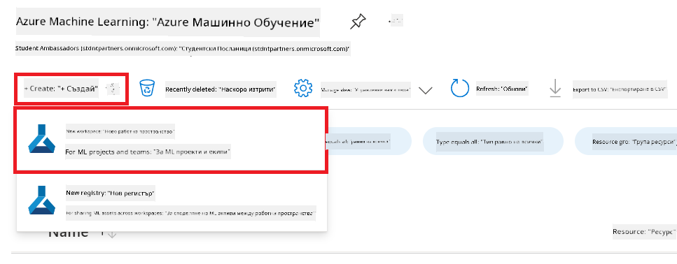

1. Изпълнете следните задачи:

    - Изберете вашия Azure **Subscription**.
    - Изберете **Resource group**, която ще използвате (създайте нова, ако е необходимо).
    - Въведете **Workspace Name**. Трябва да е уникално име.
    - Изберете **Region**, която искате да използвате.
    - Изберете **Storage account**, който ще използвате (създайте нов, ако е необходимо).
    - Изберете **Key vault**, който ще използвате (създайте нов, ако е необходимо).
    - Изберете **Application insights**, който ще използвате (създайте нов, ако е необходимо).
    - Изберете **Container registry**, който ще използвате (създайте нов, ако е необходимо).

    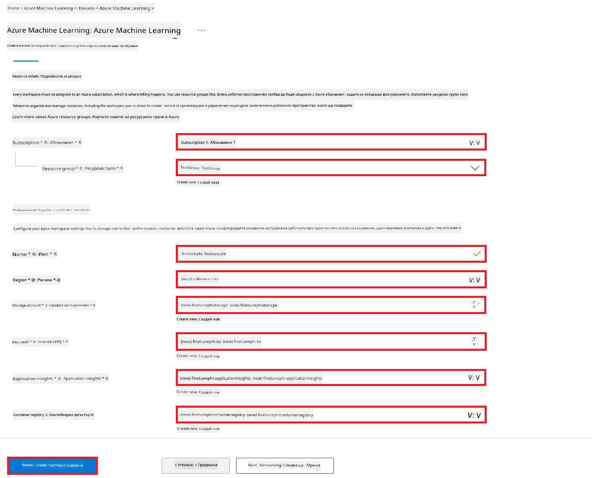

1. Изберете **Review + Create**.

1. Изберете **Create**.

### Заявка за GPU квоти в Azure Subscription

В този E2E пример ще използвате *Standard_NC24ads_A100_v4 GPU* за фина настройка, което изисква заявка за квота, и *Standard_E4s_v3* CPU за разгръщане, което не изисква заявка за квота.

> [!NOTE]
>
> Само абонаментите тип Pay-As-You-Go (стандартен тип абонамент) имат право на GPU ресурси; абонаментите с бонуси в момента не се поддържат.
>
> За тези, които използват абонаменти с бонуси (като Visual Studio Enterprise Subscription) или искат бързо да тестват процеса на фина настройка и разгръщане, това ръководство предлага и указания за фина настройка с минимален датасет, използвайки CPU. Важно е обаче да се отбележи, че резултатите от фината настройка са значително по-добри при използване на GPU с по-големи датасети.

1. Посетете [Azure ML Studio](https://ml.azure.com/home?wt.mc_id=studentamb_279723).

1. Изпълнете следните задачи, за да заявите квота за *Standard NCADSA100v4 Family*:

    - Изберете **Quota** от лявата странична лента.
    - Изберете **Virtual machine family**, която искате да използвате. Например, изберете **Standard NCADSA100v4 Family Cluster Dedicated vCPUs**, която включва *Standard_NC24ads_A100_v4* GPU.
    - Изберете **Request quota** от навигационното меню.

        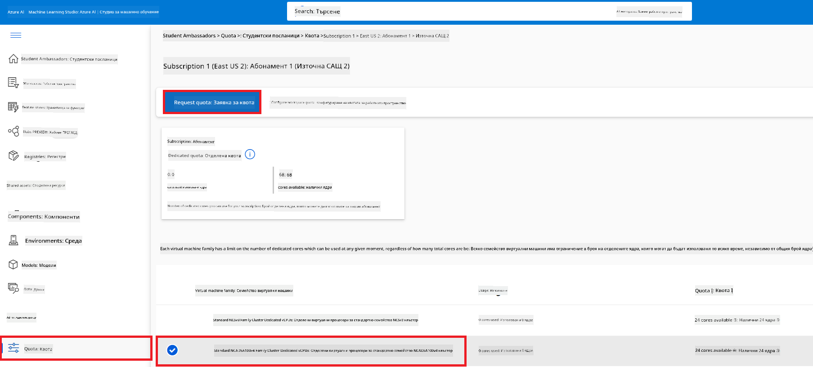

    - В страницата за заявка на квота въведете желаната стойност за **New cores limit**. Например, 24.
    - В страницата за заявка на квота изберете **Submit**, за да подадете заявката за GPU квота.

> [!NOTE]
> Можете да изберете подходящия GPU или CPU според нуждите си, като се консултирате с документацията [Sizes for Virtual Machines in Azure](https://learn.microsoft.com/azure/virtual-machines/sizes/overview?tabs=breakdownseries%2Cgeneralsizelist%2Ccomputesizelist%2Cmemorysizelist%2Cstoragesizelist%2Cgpusizelist%2Cfpgasizelist%2Chpcsizelist).

### Добавяне на роля

За да направите фина настройка и разгръщане на моделите, първо трябва да създадете User Assigned Managed Identity (UAI) и да ѝ присвоите подходящи разрешения. Тази UAI ще се използва за удостоверяване по време на разгръщането.

#### Създаване на User Assigned Managed Identity (UAI)

1. Въведете *managed identities* в **полето за търсене** в горната част на портала и изберете **Managed Identities** от появилите се опции.

    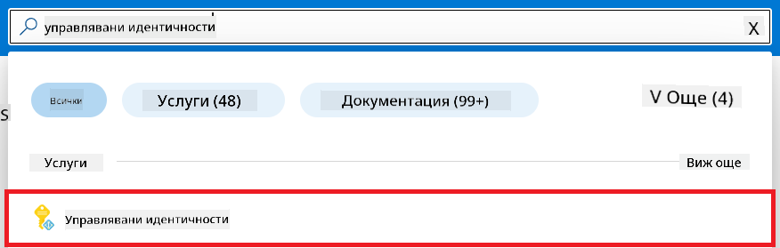

1. Изберете **+ Create**.

    

1. Изпълнете следните задачи:

    - Изберете вашия Azure **Subscription**.
    - Изберете **Resource group**, която ще използвате (създайте нова, ако е необходимо).
    - Изберете **Region**, която искате да използвате.
    - Въведете **Name**. Трябва да е уникално име.

1. Изберете **Review + create**.

1. Изберете **+ Create**.

#### Добавяне на роля Contributor към Managed Identity

1. Отидете на ресурса Managed Identity, който създадохте.

1. Изберете **Azure role assignments** от лявата странична лента.

1. Изберете **+Add role assignment** от навигационното меню.

1. В страницата Add role assignment изпълнете следните задачи:
    - Изберете **Scope** да е **Resource group**.
    - Изберете вашия Azure **Subscription**.
    - Изберете **Resource group**, която ще използвате.
    - Изберете **Role** да е **Contributor**.

    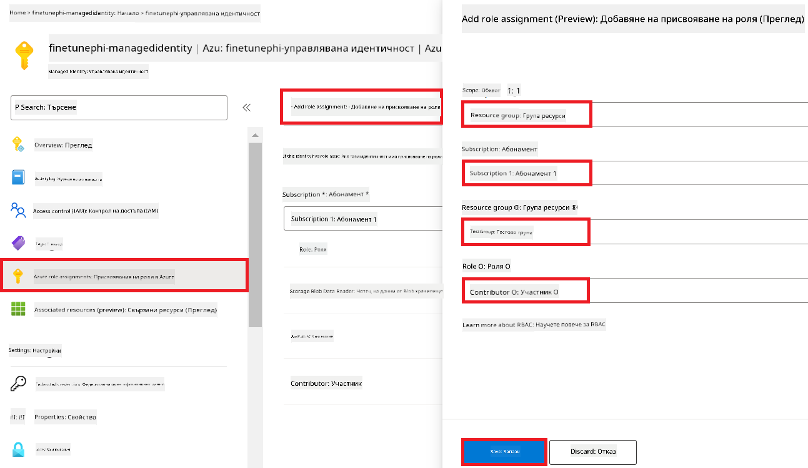

1. Изберете **Save**.

#### Добавяне на роля Storage Blob Data Reader към Managed Identity

1. Въведете *storage accounts* в **полето за търсене** в горната част на портала и изберете **Storage accounts** от появилите се опции.

    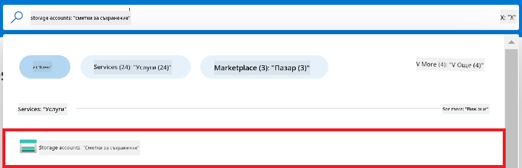

1. Изберете storage акаунта, свързан с Azure Machine Learning workspace, който създадохте. Например, *finetunephistorage*.

1. Изпълнете следните задачи, за да отидете в Add role assignment страницата:

    - Отидете на Azure Storage акаунта, който създадохте.
    - Изберете **Access Control (IAM)** от лявата странична лента.
    - Изберете **+ Add** от навигационното меню.
    - Изберете **Add role assignment** от навигационното меню.

    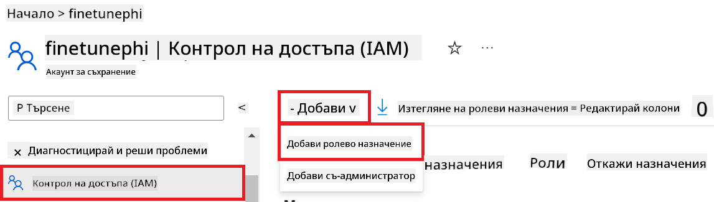

1. В страницата Add role assignment изпълнете следните задачи:

    - В страницата Role въведете *Storage Blob Data Reader* в **полето за търсене** и изберете **Storage Blob Data Reader** от появилите се опции.
    - В страницата Role изберете **Next**.
    - В страницата Members изберете **Assign access to** **Managed identity**.
    - В страницата Members изберете **+ Select members**.
    - В страницата Select managed identities изберете вашия Azure **Subscription**.
    - В страницата Select managed identities изберете **Managed identity**.
    - В страницата Select managed identities изберете създадената Managed Identity. Например, *finetunephi-managedidentity*.
    - В страницата Select managed identities изберете **Select**.

    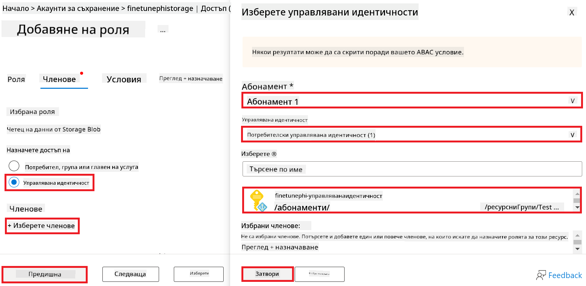

1. Изберете **Review + assign**.

#### Добавяне на роля AcrPull към Managed Identity

1. Въведете *container registries* в **полето за търсене** в горната част на портала и изберете **Container registries** от появилите се опции.

    

1. Изберете контейнерния регистър, свързан с Azure Machine Learning workspace. Например, *finetunephicontainerregistries*

1. Изпълнете следните задачи, за да отидете в Add role assignment страницата:

    - Изберете **Access Control (IAM)** от лявата странична лента.
    - Изберете **+ Add** от навигационното меню.
    - Изберете **Add role assignment** от навигационното меню.

1. В страницата Add role assignment изпълнете следните задачи:

    - В страницата Role въведете *AcrPull* в **полето за търсене** и изберете **AcrPull** от появилите се опции.
    - В страницата Role изберете **Next**.
    - В страницата Members изберете **Assign access to** **Managed identity**.
    - В страницата Members изберете **+ Select members**.
    - В страницата Select managed identities изберете вашия Azure **Subscription**.
    - В страницата Select managed identities изберете **Managed identity**.
    - В страницата Select managed identities изберете създадената Managed Identity. Например, *finetunephi-managedidentity*.
    - В страницата Select managed identities изберете **Select**.
    - Изберете **Review + assign**.

### Настройка на проекта

Сега ще създадете папка, в която да работите, и ще настроите виртуална среда, за да разработите програма, която взаимодейства с потребителите и използва съхранена чат история от Azure Cosmos DB, за да подобри отговорите си.

#### Създаване на папка за работа

1. Отворете терминал и изпълнете следната команда, за да създадете папка с име *finetune-phi* в подразбиращата се директория.

    ```console
    mkdir finetune-phi
    ```

1. Изпълнете следната команда в терминала, за да влезете в папката *finetune-phi*, която създадохте.

    ```console
    cd finetune-phi
    ```

#### Създаване на виртуална среда

1. Изпълнете следната команда в терминала, за да създадете виртуална среда с име *.venv*.

    ```console
    python -m venv .venv
    ```

1. Изпълнете следната команда в терминала, за да активирате виртуалната среда.

    ```console
    .venv\Scripts\activate.bat
    ```

> [!NOTE]
>
> Ако всичко е наред, трябва да видите *(.venv)* преди подканата за въвеждане на команди.

#### Инсталиране на необходимите пакети

1. Изпълнете следните команди в терминала, за да инсталирате нужните пакети.

    ```console
    pip install datasets==2.19.1
    pip install transformers==4.41.1
    pip install azure-ai-ml==1.16.0
    pip install torch==2.3.1
    pip install trl==0.9.4
    pip install promptflow==1.12.0
    ```

#### Създаване на файлове за проекта

В това упражнение ще създадете основните файлове за проекта. Те включват скриптове за сваляне на датасета, настройка на Azure Machine Learning среда, фина настройка на Phi-3 модела и разгръщане на финно настроения модел. Ще създадете и файл *conda.yml* за настройка на средата за фина настройка.

В това упражнение ще:

- Създадете файл *download_dataset.py* за сваляне на датасета.
- Създадете файл *setup_ml.py* за настройка на Azure Machine Learning средата.
- Създадете файл *fine_tune.py* в папката *finetuning_dir* за фина настройка на Phi-3 модела с помощта на датасета.
- Създадете файл *conda.yml* за настройка на средата за фина настройка.
- Създадете файл *deploy_model.py* за разгръщане на финно настроения модел.
- Създадете файл *integrate_with_promptflow.py* за интеграция на финно настроения модел и изпълнение чрез Prompt flow.
- Създадете файл flow.dag.yml за настройка на структурата на работния процес в Prompt flow.
- Създадете файл *config.py* за въвеждане на информация за Azure.

> [!NOTE]
>
> Пълна структура на папките:
>
> ```text
> └── YourUserName
> .    └── finetune-phi
> .        ├── finetuning_dir
> .        │      └── fine_tune.py
> .        ├── conda.yml
> .        ├── config.py
> .        ├── deploy_model.py
> .        ├── download_dataset.py
> .        ├── flow.dag.yml
> .        ├── integrate_with_promptflow.py
> .        └── setup_ml.py
> ```

1. Отворете **Visual Studio Code**.

1. Изберете **File** от менюто.

1. Изберете **Open Folder**.

1. Изберете папката *finetune-phi*, която създадохте, намираща се в *C:\Users\yourUserName\finetune-phi*.

    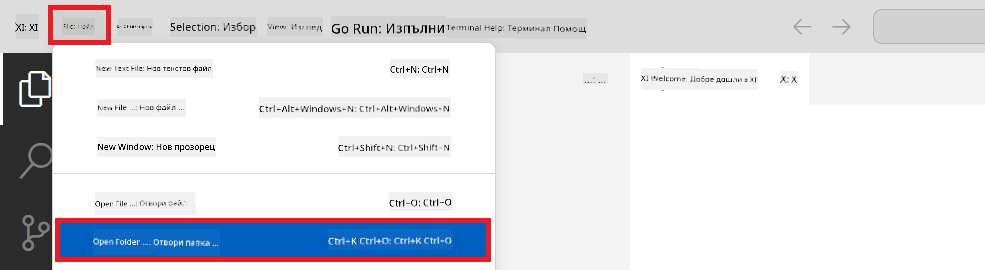

1. В лявата част на Visual Studio Code, с десен бутон кликнете и изберете **New File**, за да създадете нов файл с име *download_dataset.py*.

1. В лявата част на Visual Studio Code, с десен бутон кликнете и изберете **New File**, за да създадете нов файл с име *setup_ml.py*.

1. В лявата част на Visual Studio Code, с десен бутон кликнете и изберете **New File**, за да създадете нов файл с име *deploy_model.py*.

    

1. В лявата част на Visual Studio Code, с десен бутон кликнете и изберете **New Folder**, за да създадете нова папка с име *finetuning_dir*.

1. В папката *finetuning_dir* създайте нов файл с име
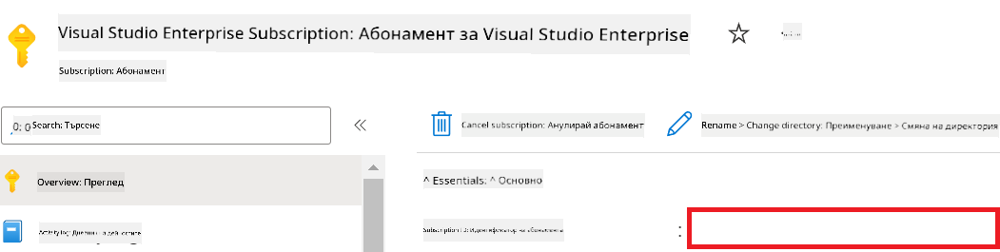

1. Изпълнете следните стъпки, за да добавите името на Azure Workspace:

    - Отидете до ресурса Azure Machine Learning, който сте създали.
    - Копирайте и поставете името на вашия акаунт във файла *config.py*.

    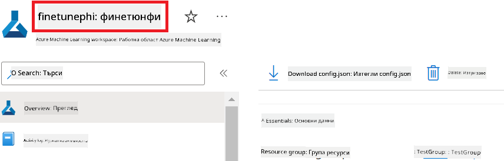

1. Изпълнете следните стъпки, за да добавите името на Azure Resource Group:

    - Отидете до ресурса Azure Machine Learning, който сте създали.
    - Копирайте и поставете името на вашата Azure Resource Group във файла *config.py*.

    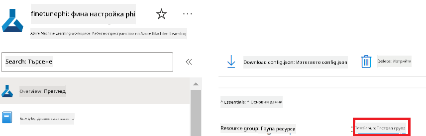

2. Изпълнете следните стъпки, за да добавите името на Azure Managed Identity

    - Отидете до ресурса Managed Identities, който сте създали.
    - Копирайте и поставете името на вашата Azure Managed Identity във файла *config.py*.

    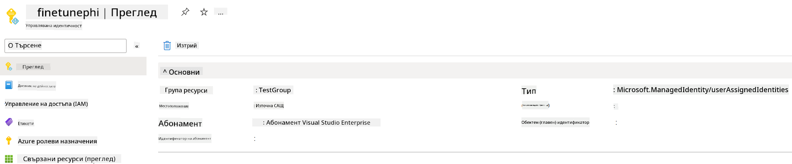

### Подгответе набора от данни за фино настройване

В това упражнение ще стартирате файла *download_dataset.py*, за да изтеглите наборите от данни *ULTRACHAT_200k* на локалната си среда. След това ще използвате тези набори за фино настройване на модела Phi-3 в Azure Machine Learning.

#### Изтеглете вашия набор от данни с помощта на *download_dataset.py*

1. Отворете файла *download_dataset.py* във Visual Studio Code.

1. Добавете следния код във *download_dataset.py*.

    ```python
    import json
    import os
    from datasets import load_dataset
    from config import (
        TRAIN_DATA_PATH,
        TEST_DATA_PATH)

    def load_and_split_dataset(dataset_name, config_name, split_ratio):
        """
        Load and split a dataset.
        """
        # Load the dataset with the specified name, configuration, and split ratio
        dataset = load_dataset(dataset_name, config_name, split=split_ratio)
        print(f"Original dataset size: {len(dataset)}")
        
        # Split the dataset into train and test sets (80% train, 20% test)
        split_dataset = dataset.train_test_split(test_size=0.2)
        print(f"Train dataset size: {len(split_dataset['train'])}")
        print(f"Test dataset size: {len(split_dataset['test'])}")
        
        return split_dataset

    def save_dataset_to_jsonl(dataset, filepath):
        """
        Save a dataset to a JSONL file.
        """
        # Create the directory if it does not exist
        os.makedirs(os.path.dirname(filepath), exist_ok=True)
        
        # Open the file in write mode
        with open(filepath, 'w', encoding='utf-8') as f:
            # Iterate over each record in the dataset
            for record in dataset:
                # Dump the record as a JSON object and write it to the file
                json.dump(record, f)
                # Write a newline character to separate records
                f.write('\n')
        
        print(f"Dataset saved to {filepath}")

    def main():
        """
        Main function to load, split, and save the dataset.
        """
        # Load and split the ULTRACHAT_200k dataset with a specific configuration and split ratio
        dataset = load_and_split_dataset("HuggingFaceH4/ultrachat_200k", 'default', 'train_sft[:1%]')
        
        # Extract the train and test datasets from the split
        train_dataset = dataset['train']
        test_dataset = dataset['test']

        # Save the train dataset to a JSONL file
        save_dataset_to_jsonl(train_dataset, TRAIN_DATA_PATH)
        
        # Save the test dataset to a separate JSONL file
        save_dataset_to_jsonl(test_dataset, TEST_DATA_PATH)

    if __name__ == "__main__":
        main()

    ```

> [!TIP]
>
> **Насоки за фино настройване с минимален набор от данни, използвайки CPU**
>
> Ако искате да използвате CPU за фино настройване, този подход е подходящ за потребители с абонаменти с предимства (като Visual Studio Enterprise Subscription) или за бързо тестване на процеса на фино настройване и внедряване.
>
> Заменете `dataset = load_and_split_dataset("HuggingFaceH4/ultrachat_200k", 'default', 'train_sft[:1%]')` with `dataset = load_and_split_dataset("HuggingFaceH4/ultrachat_200k", 'default', 'train_sft[:10]')`
>

1. Въведете следната команда в терминала, за да стартирате скрипта и да изтеглите набора от данни в локалната си среда.

    ```console
    python download_data.py
    ```

1. Уверете се, че наборите от данни са успешно запазени в локалната директория *finetune-phi/data*.

> [!NOTE]
>
> **Размер на набора от данни и време за фино настройване**
>
> В този пример E2E използвате само 1% от набора от данни (`train_sft[:1%]`). Това значително намалява обема на данните, ускорявайки както качването, така и процеса на фино настройване. Можете да коригирате процента, за да намерите подходящия баланс между времето за обучение и производителността на модела. Използването на по-малък поднабор от данните намалява времето за фино настройване, което прави процеса по-лесно управляем за пример E2E.

## Сценарий 2: Фино настройване на модела Phi-3 и внедряване в Azure Machine Learning Studio

### Настройка на Azure CLI

Трябва да настроите Azure CLI, за да удостоверите вашата среда. Azure CLI ви позволява да управлявате Azure ресурсите директно от командния ред и предоставя необходимите идентификационни данни за Azure Machine Learning да получи достъп до тези ресурси. За да започнете, инсталирайте [Azure CLI](https://learn.microsoft.com/cli/azure/install-azure-cli)

1. Отворете прозорец на терминала и въведете следната команда, за да влезете в своя Azure акаунт.

    ```console
    az login
    ```

1. Изберете Azure акаунта, който искате да използвате.

1. Изберете абонамента в Azure, който искате да използвате.

    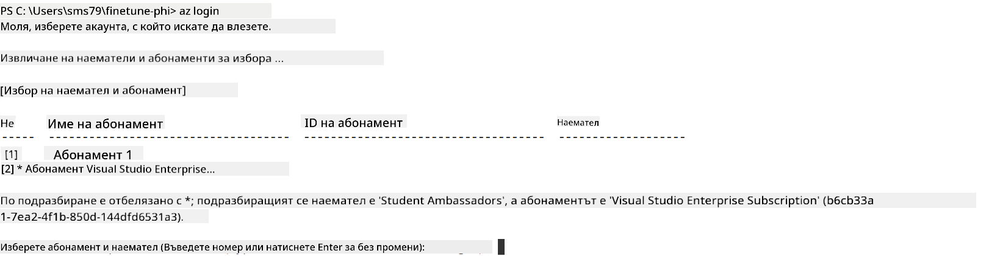

> [!TIP]
>
> Ако имате проблеми с влизането в Azure, опитайте да използвате код за устройство. Отворете терминал и въведете следната команда, за да влезете в Azure акаунта си:
>
> ```console
> az login --use-device-code
> ```
>

### Фино настройване на модела Phi-3

В това упражнение ще фино настроите модела Phi-3, използвайки предоставения набор от данни. Първо ще дефинирате процеса на фино настройване във файла *fine_tune.py*. След това ще конфигурирате средата Azure Machine Learning и ще стартирате процеса на фино настройване, като стартирате файла *setup_ml.py*. Този скрипт гарантира, че финото настройване се извършва в средата на Azure Machine Learning.

Като стартирате *setup_ml.py*, ще стартирате процеса на фино настройване в средата на Azure Machine Learning.

#### Добавете код във файла *fine_tune.py*

1. Отидете в папката *finetuning_dir* и отворете файла *fine_tune.py* във Visual Studio Code.

1. Добавете следния код във *fine_tune.py*.

    ```python
    import argparse
    import sys
    import logging
    import os
    from datasets import load_dataset
    import torch
    import mlflow
    from transformers import AutoModelForCausalLM, AutoTokenizer, TrainingArguments
    from trl import SFTTrainer

    # To avoid the INVALID_PARAMETER_VALUE error in MLflow, disable MLflow integration
    os.environ["DISABLE_MLFLOW_INTEGRATION"] = "True"

    # Logging setup
    logging.basicConfig(
        format="%(asctime)s - %(levelname)s - %(name)s - %(message)s",
        datefmt="%Y-%m-%d %H:%M:%S",
        handlers=[logging.StreamHandler(sys.stdout)],
        level=logging.WARNING
    )
    logger = logging.getLogger(__name__)

    def initialize_model_and_tokenizer(model_name, model_kwargs):
        """
        Initialize the model and tokenizer with the given pretrained model name and arguments.
        """
        model = AutoModelForCausalLM.from_pretrained(model_name, **model_kwargs)
        tokenizer = AutoTokenizer.from_pretrained(model_name)
        tokenizer.model_max_length = 2048
        tokenizer.pad_token = tokenizer.unk_token
        tokenizer.pad_token_id = tokenizer.convert_tokens_to_ids(tokenizer.pad_token)
        tokenizer.padding_side = 'right'
        return model, tokenizer

    def apply_chat_template(example, tokenizer):
        """
        Apply a chat template to tokenize messages in the example.
        """
        messages = example["messages"]
        if messages[0]["role"] != "system":
            messages.insert(0, {"role": "system", "content": ""})
        example["text"] = tokenizer.apply_chat_template(
            messages, tokenize=False, add_generation_prompt=False
        )
        return example

    def load_and_preprocess_data(train_filepath, test_filepath, tokenizer):
        """
        Load and preprocess the dataset.
        """
        train_dataset = load_dataset('json', data_files=train_filepath, split='train')
        test_dataset = load_dataset('json', data_files=test_filepath, split='train')
        column_names = list(train_dataset.features)

        train_dataset = train_dataset.map(
            apply_chat_template,
            fn_kwargs={"tokenizer": tokenizer},
            num_proc=10,
            remove_columns=column_names,
            desc="Applying chat template to train dataset",
        )

        test_dataset = test_dataset.map(
            apply_chat_template,
            fn_kwargs={"tokenizer": tokenizer},
            num_proc=10,
            remove_columns=column_names,
            desc="Applying chat template to test dataset",
        )

        return train_dataset, test_dataset

    def train_and_evaluate_model(train_dataset, test_dataset, model, tokenizer, output_dir):
        """
        Train and evaluate the model.
        """
        training_args = TrainingArguments(
            bf16=True,
            do_eval=True,
            output_dir=output_dir,
            eval_strategy="epoch",
            learning_rate=5.0e-06,
            logging_steps=20,
            lr_scheduler_type="cosine",
            num_train_epochs=3,
            overwrite_output_dir=True,
            per_device_eval_batch_size=4,
            per_device_train_batch_size=4,
            remove_unused_columns=True,
            save_steps=500,
            seed=0,
            gradient_checkpointing=True,
            gradient_accumulation_steps=1,
            warmup_ratio=0.2,
        )

        trainer = SFTTrainer(
            model=model,
            args=training_args,
            train_dataset=train_dataset,
            eval_dataset=test_dataset,
            max_seq_length=2048,
            dataset_text_field="text",
            tokenizer=tokenizer,
            packing=True
        )

        train_result = trainer.train()
        trainer.log_metrics("train", train_result.metrics)

        mlflow.transformers.log_model(
            transformers_model={"model": trainer.model, "tokenizer": tokenizer},
            artifact_path=output_dir,
        )

        tokenizer.padding_side = 'left'
        eval_metrics = trainer.evaluate()
        eval_metrics["eval_samples"] = len(test_dataset)
        trainer.log_metrics("eval", eval_metrics)

    def main(train_file, eval_file, model_output_dir):
        """
        Main function to fine-tune the model.
        """
        model_kwargs = {
            "use_cache": False,
            "trust_remote_code": True,
            "torch_dtype": torch.bfloat16,
            "device_map": None,
            "attn_implementation": "eager"
        }

        # pretrained_model_name = "microsoft/Phi-3-mini-4k-instruct"
        pretrained_model_name = "microsoft/Phi-3.5-mini-instruct"

        with mlflow.start_run():
            model, tokenizer = initialize_model_and_tokenizer(pretrained_model_name, model_kwargs)
            train_dataset, test_dataset = load_and_preprocess_data(train_file, eval_file, tokenizer)
            train_and_evaluate_model(train_dataset, test_dataset, model, tokenizer, model_output_dir)

    if __name__ == "__main__":
        parser = argparse.ArgumentParser()
        parser.add_argument("--train-file", type=str, required=True, help="Path to the training data")
        parser.add_argument("--eval-file", type=str, required=True, help="Path to the evaluation data")
        parser.add_argument("--model_output_dir", type=str, required=True, help="Directory to save the fine-tuned model")
        args = parser.parse_args()
        main(args.train_file, args.eval_file, args.model_output_dir)

    ```

1. Запазете и затворете файла *fine_tune.py*.

> [!TIP]
> **Можете да фино настроите модел Phi-3.5**
>
> Във файла *fine_tune.py* можете да промените полето `pretrained_model_name` from `"microsoft/Phi-3-mini-4k-instruct"` to any model you want to fine-tune. For example, if you change it to `"microsoft/Phi-3.5-mini-instruct"`, you'll be using the Phi-3.5-mini-instruct model for fine-tuning. To find and use the model name you prefer, visit [Hugging Face](https://huggingface.co/), search for the model you're interested in, and then copy and paste its name into the `pretrained_model_name` в скрипта си.
>
> :::image type="content" source="../../imgs/03/FineTuning-PromptFlow/finetunephi3.5.png" alt-text="Фино настройване на Phi-3.5.":::
>

#### Добавете код във файла *setup_ml.py*

1. Отворете файла *setup_ml.py* във Visual Studio Code.

1. Добавете следния код във *setup_ml.py*.

    ```python
    import logging
    from azure.ai.ml import MLClient, command, Input
    from azure.ai.ml.entities import Environment, AmlCompute
    from azure.identity import AzureCliCredential
    from config import (
        AZURE_SUBSCRIPTION_ID,
        AZURE_RESOURCE_GROUP_NAME,
        AZURE_ML_WORKSPACE_NAME,
        TRAIN_DATA_PATH,
        TEST_DATA_PATH
    )

    # Constants

    # Uncomment the following lines to use a CPU instance for training
    # COMPUTE_INSTANCE_TYPE = "Standard_E16s_v3" # cpu
    # COMPUTE_NAME = "cpu-e16s-v3"
    # DOCKER_IMAGE_NAME = "mcr.microsoft.com/azureml/openmpi4.1.0-ubuntu20.04:latest"

    # Uncomment the following lines to use a GPU instance for training
    COMPUTE_INSTANCE_TYPE = "Standard_NC24ads_A100_v4"
    COMPUTE_NAME = "gpu-nc24s-a100-v4"
    DOCKER_IMAGE_NAME = "mcr.microsoft.com/azureml/curated/acft-hf-nlp-gpu:59"

    CONDA_FILE = "conda.yml"
    LOCATION = "eastus2" # Replace with the location of your compute cluster
    FINETUNING_DIR = "./finetuning_dir" # Path to the fine-tuning script
    TRAINING_ENV_NAME = "phi-3-training-environment" # Name of the training environment
    MODEL_OUTPUT_DIR = "./model_output" # Path to the model output directory in azure ml

    # Logging setup to track the process
    logger = logging.getLogger(__name__)
    logging.basicConfig(
        format="%(asctime)s - %(levelname)s - %(name)s - %(message)s",
        datefmt="%Y-%m-%d %H:%M:%S",
        level=logging.WARNING
    )

    def get_ml_client():
        """
        Initialize the ML Client using Azure CLI credentials.
        """
        credential = AzureCliCredential()
        return MLClient(credential, AZURE_SUBSCRIPTION_ID, AZURE_RESOURCE_GROUP_NAME, AZURE_ML_WORKSPACE_NAME)

    def create_or_get_environment(ml_client):
        """
        Create or update the training environment in Azure ML.
        """
        env = Environment(
            image=DOCKER_IMAGE_NAME,  # Docker image for the environment
            conda_file=CONDA_FILE,  # Conda environment file
            name=TRAINING_ENV_NAME,  # Name of the environment
        )
        return ml_client.environments.create_or_update(env)

    def create_or_get_compute_cluster(ml_client, compute_name, COMPUTE_INSTANCE_TYPE, location):
        """
        Create or update the compute cluster in Azure ML.
        """
        try:
            compute_cluster = ml_client.compute.get(compute_name)
            logger.info(f"Compute cluster '{compute_name}' already exists. Reusing it for the current run.")
        except Exception:
            logger.info(f"Compute cluster '{compute_name}' does not exist. Creating a new one with size {COMPUTE_INSTANCE_TYPE}.")
            compute_cluster = AmlCompute(
                name=compute_name,
                size=COMPUTE_INSTANCE_TYPE,
                location=location,
                tier="Dedicated",  # Tier of the compute cluster
                min_instances=0,  # Minimum number of instances
                max_instances=1  # Maximum number of instances
            )
            ml_client.compute.begin_create_or_update(compute_cluster).wait()  # Wait for the cluster to be created
        return compute_cluster

    def create_fine_tuning_job(env, compute_name):
        """
        Set up the fine-tuning job in Azure ML.
        """
        return command(
            code=FINETUNING_DIR,  # Path to fine_tune.py
            command=(
                "python fine_tune.py "
                "--train-file ${{inputs.train_file}} "
                "--eval-file ${{inputs.eval_file}} "
                "--model_output_dir ${{inputs.model_output}}"
            ),
            environment=env,  # Training environment
            compute=compute_name,  # Compute cluster to use
            inputs={
                "train_file": Input(type="uri_file", path=TRAIN_DATA_PATH),  # Path to the training data file
                "eval_file": Input(type="uri_file", path=TEST_DATA_PATH),  # Path to the evaluation data file
                "model_output": MODEL_OUTPUT_DIR
            }
        )

    def main():
        """
        Main function to set up and run the fine-tuning job in Azure ML.
        """
        # Initialize ML Client
        ml_client = get_ml_client()

        # Create Environment
        env = create_or_get_environment(ml_client)
        
        # Create or get existing compute cluster
        create_or_get_compute_cluster(ml_client, COMPUTE_NAME, COMPUTE_INSTANCE_TYPE, LOCATION)

        # Create and Submit Fine-Tuning Job
        job = create_fine_tuning_job(env, COMPUTE_NAME)
        returned_job = ml_client.jobs.create_or_update(job)  # Submit the job
        ml_client.jobs.stream(returned_job.name)  # Stream the job logs
        
        # Capture the job name
        job_name = returned_job.name
        print(f"Job name: {job_name}")

    if __name__ == "__main__":
        main()

    ```

1. Заменете `COMPUTE_INSTANCE_TYPE`, `COMPUTE_NAME`, and `LOCATION` със своите конкретни данни.

    ```python
   # Uncomment the following lines to use a GPU instance for training
    COMPUTE_INSTANCE_TYPE = "Standard_NC24ads_A100_v4"
    COMPUTE_NAME = "gpu-nc24s-a100-v4"
    ...
    LOCATION = "eastus2" # Replace with the location of your compute cluster
    ```

> [!TIP]
>
> **Насоки за фино настройване с минимален набор от данни, използвайки CPU**
>
> Ако искате да използвате CPU за фино настройване, този подход е подходящ за потребители с абонаменти с предимства (като Visual Studio Enterprise Subscription) или за бързо тестване на процеса на фино настройване и внедряване.
>
> 1. Отворете файла *setup_ml*.
> 1. Заменете `COMPUTE_INSTANCE_TYPE`, `COMPUTE_NAME`, and `DOCKER_IMAGE_NAME` with the following. If you do not have access to *Standard_E16s_v3*, you can use an equivalent CPU instance or request a new quota.
> 1. Replace `LOCATION` със своите конкретни данни.
>
>    ```python
>    # Uncomment the following lines to use a CPU instance for training
>    COMPUTE_INSTANCE_TYPE = "Standard_E16s_v3" # cpu
>    COMPUTE_NAME = "cpu-e16s-v3"
>    DOCKER_IMAGE_NAME = "mcr.microsoft.com/azureml/openmpi4.1.0-ubuntu20.04:latest"
>    LOCATION = "eastus2" # Replace with the location of your compute cluster
>    ```
>

1. Въведете следната команда, за да стартирате скрипта *setup_ml.py* и да започнете процеса на фино настройване в Azure Machine Learning.

    ```python
    python setup_ml.py
    ```

1. В това упражнение успешно фино настроихте модела Phi-3 с помощта на Azure Machine Learning. Като стартирате скрипта *setup_ml.py*, вие настроихте средата Azure Machine Learning и стартирахте процеса на фино настройване, дефиниран във файла *fine_tune.py*. Обърнете внимание, че процесът на фино настройване може да отнеме значително време. След стартиране на `python setup_ml.py` command, you need to wait for the process to complete. You can monitor the status of the fine-tuning job by following the link provided in the terminal to the Azure Machine Learning portal.

    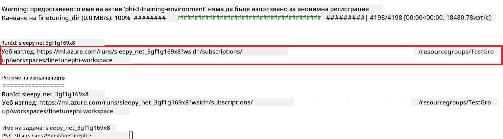

### Deploy the fine-tuned model

To integrate the fine-tuned Phi-3 model with Prompt Flow, you need to deploy the model to make it accessible for real-time inference. This process involves registering the model, creating an online endpoint, and deploying the model.

#### Set the model name, endpoint name, and deployment name for deployment

1. Open *config.py* file.

1. Replace `AZURE_MODEL_NAME = "your_fine_tuned_model_name"` with the desired name for your model.

1. Replace `AZURE_ENDPOINT_NAME = "your_fine_tuned_model_endpoint_name"` with the desired name for your endpoint.

1. Replace `AZURE_DEPLOYMENT_NAME = "your_fine_tuned_model_deployment_name"` с желаното име за вашето внедряване.

#### Добавете код във файла *deploy_model.py*

Стартирането на файла *deploy_model.py* автоматизира целия процес на внедряване. Той регистрира модела, създава крайна точка и изпълнява внедряването според настройките, посочени във файла config.py, който включва името на модела, името на крайната точка и името на внедряването.

1. Отворете файла *deploy_model.py* във Visual Studio Code.

1. Добавете следния код във *deploy_model.py*.

    ```python
    import logging
    from azure.identity import AzureCliCredential
    from azure.ai.ml import MLClient
    from azure.ai.ml.entities import Model, ProbeSettings, ManagedOnlineEndpoint, ManagedOnlineDeployment, IdentityConfiguration, ManagedIdentityConfiguration, OnlineRequestSettings
    from azure.ai.ml.constants import AssetTypes

    # Configuration imports
    from config import (
        AZURE_SUBSCRIPTION_ID,
        AZURE_RESOURCE_GROUP_NAME,
        AZURE_ML_WORKSPACE_NAME,
        AZURE_MANAGED_IDENTITY_RESOURCE_ID,
        AZURE_MANAGED_IDENTITY_CLIENT_ID,
        AZURE_MODEL_NAME,
        AZURE_ENDPOINT_NAME,
        AZURE_DEPLOYMENT_NAME
    )

    # Constants
    JOB_NAME = "your-job-name"
    COMPUTE_INSTANCE_TYPE = "Standard_E4s_v3"

    deployment_env_vars = {
        "SUBSCRIPTION_ID": AZURE_SUBSCRIPTION_ID,
        "RESOURCE_GROUP_NAME": AZURE_RESOURCE_GROUP_NAME,
        "UAI_CLIENT_ID": AZURE_MANAGED_IDENTITY_CLIENT_ID,
    }

    # Logging setup
    logging.basicConfig(
        format="%(asctime)s - %(levelname)s - %(name)s - %(message)s",
        datefmt="%Y-%m-%d %H:%M:%S",
        level=logging.DEBUG
    )
    logger = logging.getLogger(__name__)

    def get_ml_client():
        """Initialize and return the ML Client."""
        credential = AzureCliCredential()
        return MLClient(credential, AZURE_SUBSCRIPTION_ID, AZURE_RESOURCE_GROUP_NAME, AZURE_ML_WORKSPACE_NAME)

    def register_model(ml_client, model_name, job_name):
        """Register a new model."""
        model_path = f"azureml://jobs/{job_name}/outputs/artifacts/paths/model_output"
        logger.info(f"Registering model {model_name} from job {job_name} at path {model_path}.")
        run_model = Model(
            path=model_path,
            name=model_name,
            description="Model created from run.",
            type=AssetTypes.MLFLOW_MODEL,
        )
        model = ml_client.models.create_or_update(run_model)
        logger.info(f"Registered model ID: {model.id}")
        return model

    def delete_existing_endpoint(ml_client, endpoint_name):
        """Delete existing endpoint if it exists."""
        try:
            endpoint_result = ml_client.online_endpoints.get(name=endpoint_name)
            logger.info(f"Deleting existing endpoint {endpoint_name}.")
            ml_client.online_endpoints.begin_delete(name=endpoint_name).result()
            logger.info(f"Deleted existing endpoint {endpoint_name}.")
        except Exception as e:
            logger.info(f"No existing endpoint {endpoint_name} found to delete: {e}")

    def create_or_update_endpoint(ml_client, endpoint_name, description=""):
        """Create or update an endpoint."""
        delete_existing_endpoint(ml_client, endpoint_name)
        logger.info(f"Creating new endpoint {endpoint_name}.")
        endpoint = ManagedOnlineEndpoint(
            name=endpoint_name,
            description=description,
            identity=IdentityConfiguration(
                type="user_assigned",
                user_assigned_identities=[ManagedIdentityConfiguration(resource_id=AZURE_MANAGED_IDENTITY_RESOURCE_ID)]
            )
        )
        endpoint_result = ml_client.online_endpoints.begin_create_or_update(endpoint).result()
        logger.info(f"Created new endpoint {endpoint_name}.")
        return endpoint_result

    def create_or_update_deployment(ml_client, endpoint_name, deployment_name, model):
        """Create or update a deployment."""

        logger.info(f"Creating deployment {deployment_name} for endpoint {endpoint_name}.")
        deployment = ManagedOnlineDeployment(
            name=deployment_name,
            endpoint_name=endpoint_name,
            model=model.id,
            instance_type=COMPUTE_INSTANCE_TYPE,
            instance_count=1,
            environment_variables=deployment_env_vars,
            request_settings=OnlineRequestSettings(
                max_concurrent_requests_per_instance=3,
                request_timeout_ms=180000,
                max_queue_wait_ms=120000
            ),
            liveness_probe=ProbeSettings(
                failure_threshold=30,
                success_threshold=1,
                period=100,
                initial_delay=500,
            ),
            readiness_probe=ProbeSettings(
                failure_threshold=30,
                success_threshold=1,
                period=100,
                initial_delay=500,
            ),
        )
        deployment_result = ml_client.online_deployments.begin_create_or_update(deployment).result()
        logger.info(f"Created deployment {deployment.name} for endpoint {endpoint_name}.")
        return deployment_result

    def set_traffic_to_deployment(ml_client, endpoint_name, deployment_name):
        """Set traffic to the specified deployment."""
        try:
            # Fetch the current endpoint details
            endpoint = ml_client.online_endpoints.get(name=endpoint_name)
            
            # Log the current traffic allocation for debugging
            logger.info(f"Current traffic allocation: {endpoint.traffic}")
            
            # Set the traffic allocation for the deployment
            endpoint.traffic = {deployment_name: 100}
            
            # Update the endpoint with the new traffic allocation
            endpoint_poller = ml_client.online_endpoints.begin_create_or_update(endpoint)
            updated_endpoint = endpoint_poller.result()
            
            # Log the updated traffic allocation for debugging
            logger.info(f"Updated traffic allocation: {updated_endpoint.traffic}")
            logger.info(f"Set traffic to deployment {deployment_name} at endpoint {endpoint_name}.")
            return updated_endpoint
        except Exception as e:
            # Log any errors that occur during the process
            logger.error(f"Failed to set traffic to deployment: {e}")
            raise


    def main():
        ml_client = get_ml_client()

        registered_model = register_model(ml_client, AZURE_MODEL_NAME, JOB_NAME)
        logger.info(f"Registered model ID: {registered_model.id}")

        endpoint = create_or_update_endpoint(ml_client, AZURE_ENDPOINT_NAME, "Endpoint for finetuned Phi-3 model")
        logger.info(f"Endpoint {AZURE_ENDPOINT_NAME} is ready.")

        try:
            deployment = create_or_update_deployment(ml_client, AZURE_ENDPOINT_NAME, AZURE_DEPLOYMENT_NAME, registered_model)
            logger.info(f"Deployment {AZURE_DEPLOYMENT_NAME} is created for endpoint {AZURE_ENDPOINT_NAME}.")

            set_traffic_to_deployment(ml_client, AZURE_ENDPOINT_NAME, AZURE_DEPLOYMENT_NAME)
            logger.info(f"Traffic is set to deployment {AZURE_DEPLOYMENT_NAME} at endpoint {AZURE_ENDPOINT_NAME}.")
        except Exception as e:
            logger.error(f"Failed to create or update deployment: {e}")

    if __name__ == "__main__":
        main()

    ```

1. Изпълнете следните стъпки, за да получите `JOB_NAME`:

    - Navigate to Azure Machine Learning resource that you created.
    - Select **Studio web URL** to open the Azure Machine Learning workspace.
    - Select **Jobs** from the left side tab.
    - Select the experiment for fine-tuning. For example, *finetunephi*.
    - Select the job that you created.
    - Copy and paste your job Name into the `JOB_NAME = "your-job-name"` in *deploy_model.py* file.

1. Replace `COMPUTE_INSTANCE_TYPE` със своите конкретни данни.

1. Въведете следната команда, за да стартирате скрипта *deploy_model.py* и да започнете процеса на внедряване в Azure Machine Learning.

    ```python
    python deploy_model.py
    ```

> [!WARNING]
> За да избегнете допълнителни такси по вашия акаунт, уверете се, че сте изтрили създадената крайна точка в Azure Machine Learning workspace.
>

#### Проверете състоянието на внедряването в Azure Machine Learning Workspace

1. Посетете [Azure ML Studio](https://ml.azure.com/home?wt.mc_id=studentamb_279723).

1. Отидете до Azure Machine Learning workspace, който сте създали.

1. Изберете **Studio web URL**, за да отворите Azure Machine Learning workspace.

1. Изберете **Endpoints** от лявата странична лента.

    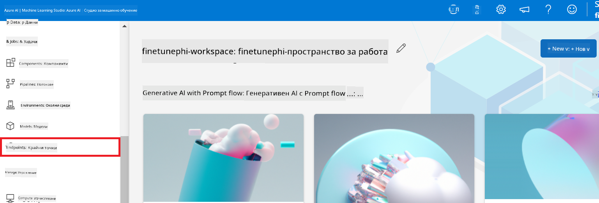

2. Изберете крайната точка, която сте създали.

    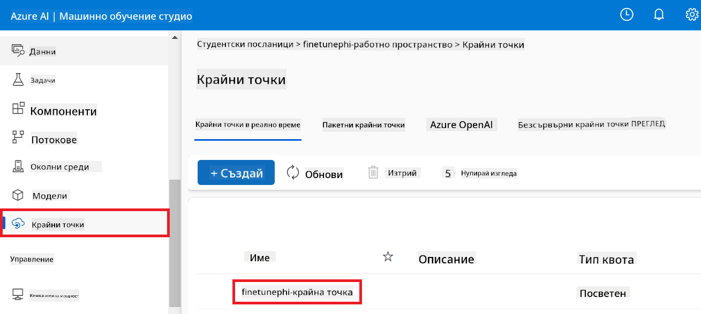

3. На тази страница можете да управлявате крайните точки, създадени по време на процеса на внедряване.

## Сценарий 3: Интегриране с Prompt flow и чат с вашия персонализиран модел

### Интегриране на персонализирания модел Phi-3 с Prompt flow

След успешно внедряване на фино настроения модел, вече можете да го интегрирате с Prompt flow, за да използвате модела си в реални приложения, позволявайки разнообразие от интерактивни задачи с вашия персонализиран модел Phi-3.

#### Настройте api ключ и uri на крайната точка на фино настроения модел Phi-3

1. Отидете до Azure Machine Learning workspace, който сте създали.
1. Изберете **Endpoints** от лявата странична лента.
1. Изберете крайната точка, която сте създали.
1. Изберете **Consume** от навигационното меню.
1. Копирайте и поставете вашия **REST endpoint** във файла *config.py*, като замените `AZURE_ML_ENDPOINT = "your_fine_tuned_model_endpoint_uri"` with your **REST endpoint**.
1. Copy and paste your **Primary key** into the *config.py* file, replacing `AZURE_ML_API_KEY = "your_fine_tuned_model_api_key"` с вашия **Primary key**.

    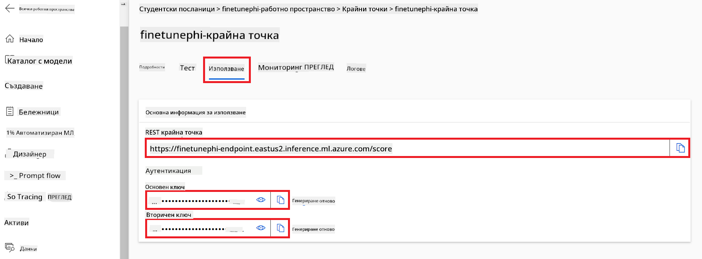

#### Добавете код във файла *flow.dag.yml*

1. Отворете файла *flow.dag.yml* във Visual Studio Code.

1. Добавете следния код във *flow.dag.yml*.

    ```yml
    inputs:
      input_data:
        type: string
        default: "Who founded Microsoft?"

    outputs:
      answer:
        type: string
        reference: ${integrate_with_promptflow.output}

    nodes:
    - name: integrate_with_promptflow
      type: python
      source:
        type: code
        path: integrate_with_promptflow.py
      inputs:
        input_data: ${inputs.input_data}
    ```

#### Добавете код във файла *integrate_with_promptflow.py*

1. Отворете файла *integrate_with_promptflow.py* във Visual Studio Code.

1. Добавете следния код във *integrate_with_promptflow.py*.

    ```python
    import logging
    import requests
    from promptflow.core import tool
    import asyncio
    import platform
    from config import (
        AZURE_ML_ENDPOINT,
        AZURE_ML_API_KEY
    )

    # Logging setup
    logging.basicConfig(
        format="%(asctime)s - %(levelname)s - %(name)s - %(message)s",
        datefmt="%Y-%m-%d %H:%M:%S",
        level=logging.DEBUG
    )
    logger = logging.getLogger(__name__)

    def query_azml_endpoint(input_data: list, endpoint_url: str, api_key: str) -> str:
        """
        Send a request to the Azure ML endpoint with the given input data.
        """
        headers = {
            "Content-Type": "application/json",
            "Authorization": f"Bearer {api_key}"
        }
        data = {
            "input_data": [input_data],
            "params": {
                "temperature": 0.7,
                "max_new_tokens": 128,
                "do_sample": True,
                "return_full_text": True
            }
        }
        try:
            response = requests.post(endpoint_url, json=data, headers=headers)
            response.raise_for_status()
            result = response.json()[0]
            logger.info("Successfully received response from Azure ML Endpoint.")
            return result
        except requests.exceptions.RequestException as e:
            logger.error(f"Error querying Azure ML Endpoint: {e}")
            raise

    def setup_asyncio_policy():
        """
        Setup asyncio event loop policy for Windows.
        """
        if platform.system() == 'Windows':
            asyncio.set_event_loop_policy(asyncio.WindowsSelectorEventLoopPolicy())
            logger.info("Set Windows asyncio event loop policy.")

    @tool
    def my_python_tool(input_data: str) -> str:
        """
        Tool function to process input data and query the Azure ML endpoint.
        """
        setup_asyncio_policy()
        return query_azml_endpoint(input_data, AZURE_ML_ENDPOINT, AZURE_ML_API_KEY)

    ```

### Чат с вашия персонализиран модел

1. Въведете следната команда, за да стартирате скрипта *deploy_model.py* и да започнете процеса на внедряване в Azure Machine Learning.

    ```python
    pf flow serve --source ./ --port 8080 --host localhost
    ```

1. Ето пример за резултатите: Сега можете да чатите с вашия персонализиран модел Phi-3. Препоръчително е да задавате въпроси, базирани на данните, използвани за фино настройване.

    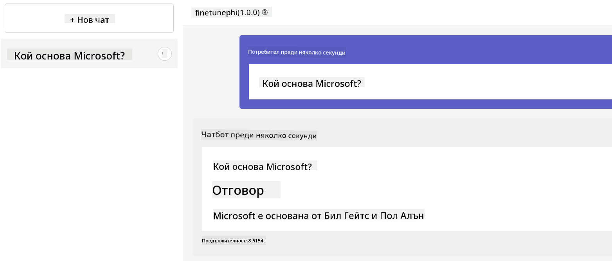

**Отказ от отговорност**:  
Този документ е преведен с помощта на AI преводаческа услуга [Co-op Translator](https://github.com/Azure/co-op-translator). Въпреки че се стремим към точност, моля, имайте предвид, че автоматизираните преводи могат да съдържат грешки или неточности. Оригиналният документ на неговия роден език трябва да се счита за авторитетен източник. За критична информация се препоръчва професионален човешки превод. Ние не носим отговорност за каквито и да е недоразумения или неправилни тълкувания, възникнали от използването на този превод.