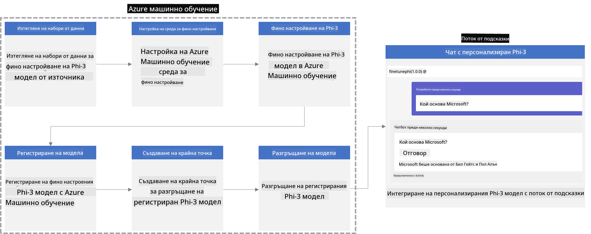
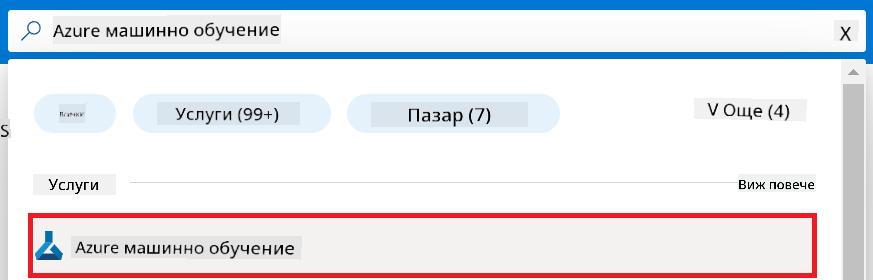
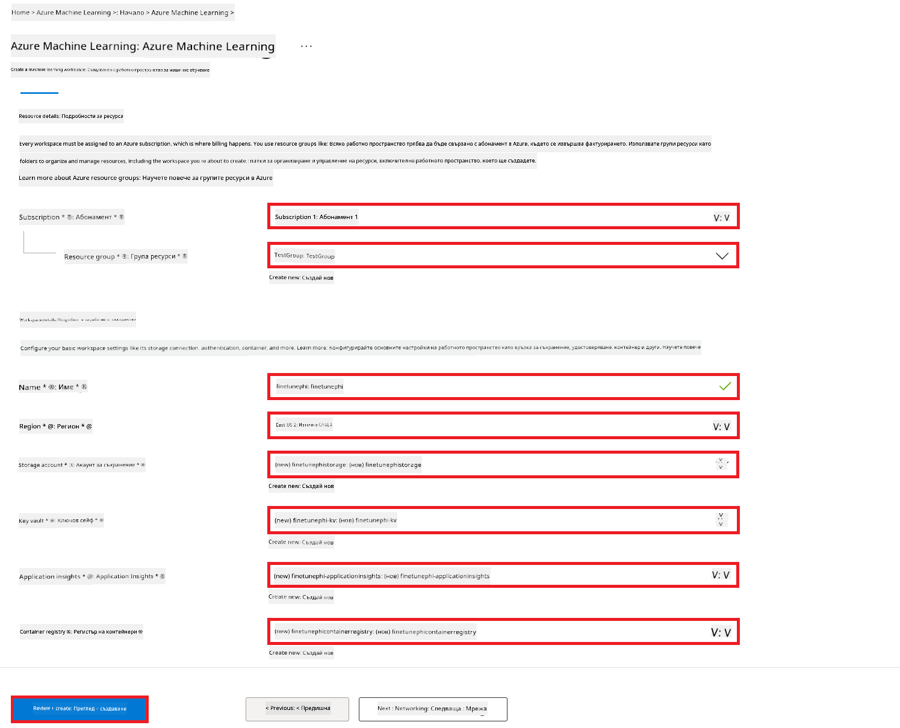
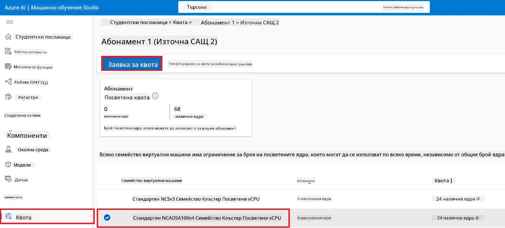
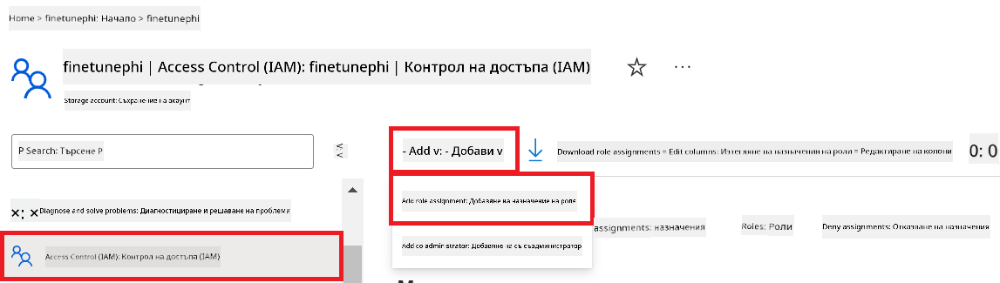
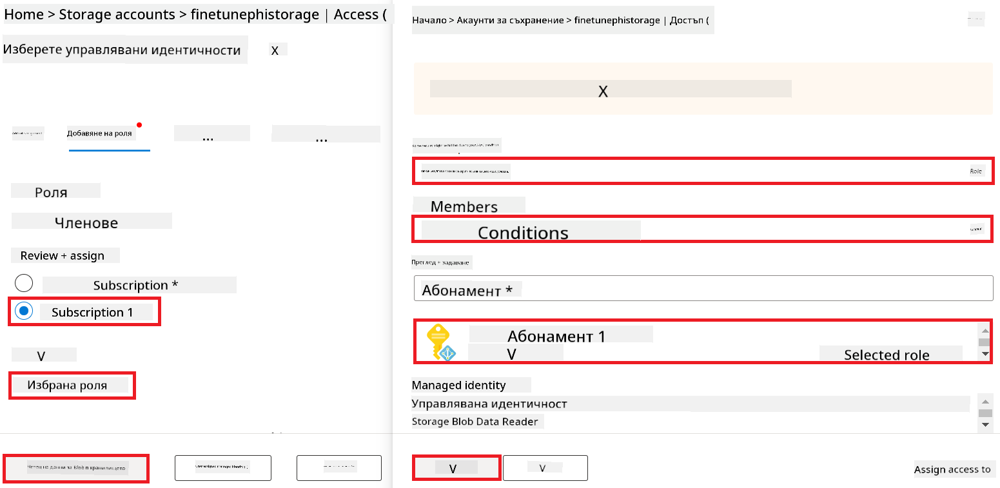
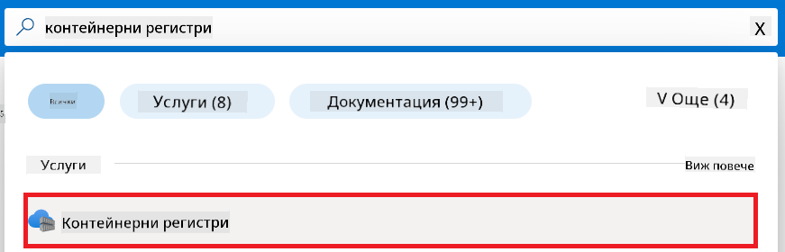
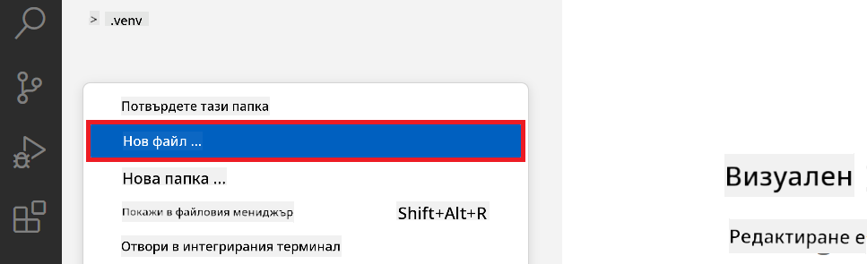
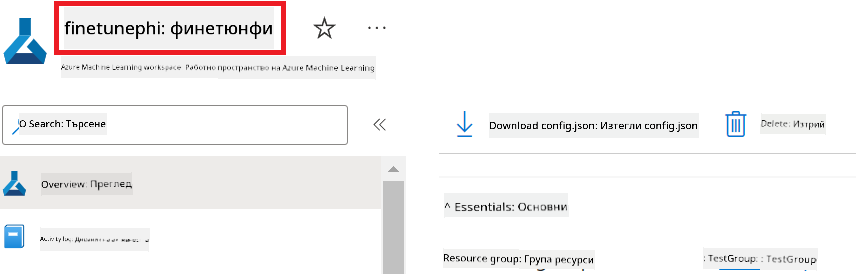
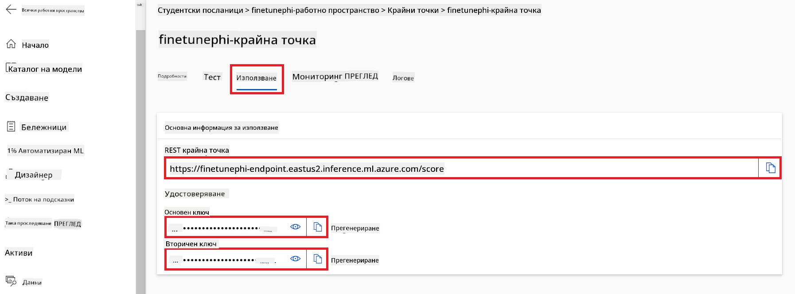

<!--
CO_OP_TRANSLATOR_METADATA:
{
  "original_hash": "7ca2c30fdb802664070e9cfbf92e24fe",
  "translation_date": "2026-01-05T09:57:58+00:00",
  "source_file": "md/02.Application/01.TextAndChat/Phi3/E2E_Phi-3-FineTuning_PromptFlow_Integration.md",
  "language_code": "bg"
}
-->
# Допинг и интегриране на персонализирани Phi-3 модели с Prompt flow

Този изчерпателен (E2E) пример е базиран на ръководството "[Допинг и интегриране на персонализирани Phi-3 модели с Prompt Flow: Ръководство стъпка по стъпка](https://techcommunity.microsoft.com/t5/educator-developer-blog/fine-tune-and-integrate-custom-phi-3-models-with-prompt-flow/ba-p/4178612?WT.mc_id=aiml-137032-kinfeylo)" от Microsoft Tech Community. То представя процесите на допинг, внедряване и интегриране на персонализирани Phi-3 модели с Prompt flow.

## Преглед

В този E2E пример ще научите как да допирате модела Phi-3 и да го интегрирате с Prompt flow. Използвайки Azure Machine Learning и Prompt flow, ще създадете работен процес за внедряване и използване на персонализирани AI модели. Този E2E пример е разделен на три сценария:

**Сценарий 1: Настройване на Azure ресурси и подготовка за допинг**

**Сценарий 2: Допинг на модела Phi-3 и внедряване в Azure Machine Learning Studio**

**Сценарий 3: Интегриране с Prompt flow и чат с вашия персонализиран модел**

Ето един преглед на този E2E пример.



### Съдържание

1. **[Сценарий 1: Настройване на Azure ресурси и подготовка за допинг](../../../../../../md/02.Application/01.TextAndChat/Phi3)**
    - [Създаване на Azure Machine Learning работно пространство](../../../../../../md/02.Application/01.TextAndChat/Phi3)
    - [Поискайте GPU квоти в Azure абонамент](../../../../../../md/02.Application/01.TextAndChat/Phi3)
    - [Добавяне на ролево назначение](../../../../../../md/02.Application/01.TextAndChat/Phi3)
    - [Настройване на проект](../../../../../../md/02.Application/01.TextAndChat/Phi3)
    - [Подготовка на набор от данни за допинг](../../../../../../md/02.Application/01.TextAndChat/Phi3)

1. **[Сценарий 2: Допинг на модел Phi-3 и внедряване в Azure Machine Learning Studio](../../../../../../md/02.Application/01.TextAndChat/Phi3)**
    - [Настройване на Azure CLI](../../../../../../md/02.Application/01.TextAndChat/Phi3)
    - [Допинг на модел Phi-3](../../../../../../md/02.Application/01.TextAndChat/Phi3)
    - [Внедряване на допирания модел](../../../../../../md/02.Application/01.TextAndChat/Phi3)

1. **[Сценарий 3: Интегриране с Prompt flow и чат с вашия персонализиран модел](../../../../../../md/02.Application/01.TextAndChat/Phi3)**
    - [Интегриране на персонализирания Phi-3 модел с Prompt flow](../../../../../../md/02.Application/01.TextAndChat/Phi3)
    - [Чат с вашия персонализиран модел](../../../../../../md/02.Application/01.TextAndChat/Phi3)

## Сценарий 1: Настройване на Azure ресурси и подготовка за допинг

### Създаване на Azure Machine Learning работно пространство

1. Въведете *azure machine learning* в **лента за търсене** в горната част на портала и изберете **Azure Machine Learning** от появилите се опции.

    

1. Изберете **+ Create** от навигационното меню.

1. Изберете **New workspace** от навигационното меню.

    

1. Изпълнете следните задачи:

    - Изберете вашия Azure **абонамент**.
    - Изберете **група ресурси** за използване (ако е необходимо, създайте нова).
    - Въведете **Име на работното пространство**. Трябва да бъде уникална стойност.
    - Изберете **Регион**, който искате да използвате.
    - Изберете **акаунт за съхранение**, който да използвате (създайте нов, ако е необходимо).
    - Изберете **key vault**, който да използвате (създайте нов, ако е необходимо).
    - Изберете **Application insights**, който да използвате (създайте нов, ако е необходимо).
    - Изберете **регистър на контейнери**, който да използвате (създайте нов, ако е необходимо).

    

1. Изберете **Review + Create**.

1. Изберете **Create**.

### Поискайте GPU квоти в Azure абонамент

В този E2E пример ще използвате *Standard_NC24ads_A100_v4 GPU* за допинг, който изисква заявка за квота, и *Standard_E4s_v3* CPU за внедряване, което не изисква заявка за квота.

> [!NOTE]
>
> Само абонаменти Pay-As-You-Go (стандартният тип абонамент) имат право на разпределяне на GPU; абонаментите с предимства в момента не се поддържат.
>
> За тези, които използват абонаменти с предимства (като Visual Studio Enterprise Subscription) или искат бързо да тестват процеса на допинг и внедряване, това ръководство предлага насоки за допинг с минимален набор от данни, използвайки CPU. Въпреки това е важно да се знае, че резултатите от допинга са значително по-добри при използване на GPU с по-големи набори от данни.

1. Посетете [Azure ML Studio](https://ml.azure.com/home?wt.mc_id=studentamb_279723).

1. Изпълнете следните задачи, за да поискате квотата *Standard NCADSA100v4 Family*:

    - Изберете **Quota** от лявата страна.
    - Изберете **Виртуално семейство машини**, което искате да използвате. Например, изберете **Standard NCADSA100v4 Family Cluster Dedicated vCPUs**, което включва *Standard_NC24ads_A100_v4* GPU.
    - Изберете **Request quota** от навигационното меню.

        

    - В страницата за заявка на квота въведете **Нов лимит на ядрата**, който искате да използвате. Например, 24.
    - В страницата за заявка на квота изберете **Submit**, за да поискате квотата за GPU.

> [!NOTE]
> Можете да изберете подходящия GPU или CPU за вашите нужди, като се позовете на документа [Размери на виртуални машини в Azure](https://learn.microsoft.com/azure/virtual-machines/sizes/overview?tabs=breakdownseries%2Cgeneralsizelist%2Ccomputesizelist%2Cmemorysizelist%2Cstoragesizelist%2Cgpusizelist%2Cfpgasizelist%2Chpcsizelist).

### Добавяне на ролево назначение

За да допирате и внедрите вашите модели, първо трябва да създадете управлявана идентичност, зададена на потребител (UAI), и да ѝ присвоите подходящите разрешения. Тази UAI ще се използва за удостоверяване по време на внедряването.

#### Създаване на управлявана идентичност, зададена на потребител (UAI)

1. Въведете *managed identities* в **лента за търсене** в горната част на портала и изберете **Managed Identities** от появилите се опции.

    

1. Изберете **+ Create**.

    

1. Изпълнете следните задачи:

    - Изберете вашия Azure **абонамент**.
    - Изберете **група ресурси** за използване (създайте нова, ако е необходимо).
    - Изберете **регион**, който искате да използвате.
    - Въведете **Име**, което трябва да бъде уникално.

1. Изберете **Review + create**.

1. Изберете **+ Create**.

#### Добавете ролево назначение Contributor към управляваната идентичност

1. Навигирайте до ресурса за управляваната идентичност, който създадохте.

1. Изберете **Azure role assignments** от лявната страна.

1. Изберете **+Add role assignment** от навигационното меню.

1. В страницата Add role assignment изпълнете следните задачи:
    - Изберете **Scope** на **Resource group**.
    - Изберете вашия Azure **абонамент**.
    - Изберете **група ресурси** за използване.
    - Изберете **Роля** на **Contributor**.

    

1. Изберете **Save**.

#### Добавете ролево назначение Storage Blob Data Reader към управляваната идентичност

1. Въведете *storage accounts* в **лента за търсене** в горната част на портала и изберете **Storage accounts** от появилите се опции.

    

1. Изберете акаунта за съхранение, свързан с Azure Machine Learning работното пространство, което създадохте. Например, *finetunephistorage*.

1. Изпълнете следните задачи, за да навигирате до страницата Add role assignment:

    - Навигирайте до Azure Storage акаунта, който създадохте.
    - Изберете **Access Control (IAM)** от лявата страна.
    - Изберете **+ Add** от навигационното меню.
    - Изберете **Add role assignment** от навигационното меню.

    

1. В страницата Add role assignment изпълнете следните задачи:

    - В страницата Role въведете *Storage Blob Data Reader* в **лента за търсене** и изберете **Storage Blob Data Reader** от появилите се опции.
    - В страницата Role изберете **Next**.
    - В страницата Members изберете **Assign access to** **Managed identity**.
    - В страницата Members изберете **+ Select members**.
    - В страницата Select managed identities изберете вашия Azure **абонамент**.
    - В страницата Select managed identities изберете **Managed identity** за **Manage Identity**.
    - В страницата Select managed identities изберете управляваната идентичност, която създадохте. Например, *finetunephi-managedidentity*.
    - В страницата Select managed identities изберете **Select**.

    

1. Изберете **Review + assign**.

#### Добавяне на роля AcrPull към управляваната идентичност

1. Въведете *container registries* в **лента за търсене** в горната част на портала и изберете **Container registries** от появилите се опции.

    

1. Изберете регистъра на контейнери, свързан с Azure Machine Learning работното пространство. Например, *finetunephicontainerregistries*.

1. Изпълнете следните задачи, за да навигирате до страницата Add role assignment:

    - Изберете **Access Control (IAM)** от лявата страна.
    - Изберете **+ Add** от навигационното меню.
    - Изберете **Add role assignment** от навигационното меню.

1. В страницата Add role assignment изпълнете следните задачи:

    - В страницата Role въведете *AcrPull* в **лента за търсене** и изберете **AcrPull** от появилите се опции.
    - В страницата Role изберете **Next**.
    - В страницата Members изберете **Assign access to** **Managed identity**.
    - В страницата Members изберете **+ Select members**.
    - В страницата Select managed identities изберете вашия Azure **абонамент**.
    - В страницата Select managed identities изберете **Managed identity** за **Manage Identity**.
    - В страницата Select managed identities изберете управляваната идентичност, която създадохте. Например, *finetunephi-managedidentity*.
    - В страницата Select managed identities изберете **Select**.
    - Изберете **Review + assign**.

### Настройване на проект

Сега ще създадете папка, в която да работите, и ще настроите виртуална среда за разработване на програма, която взаимодейства с потребителите и използва съхранявана история на чатове от Azure Cosmos DB, за да информира своите отговори.

#### Създаване на папка за работа

1. Отворете терминален прозорец и изпълнете следната команда, за да създадете папка с име *finetune-phi* в подразбиращия се път.

    ```console
    mkdir finetune-phi
    ```

1. В терминала изпълнете следната команда, за да отидете в папката *finetune-phi*, която създадохте.

    ```console
    cd finetune-phi
    ```

#### Създаване на виртуална среда

1. В терминала въведете следната команда за създаване на виртуална среда с име *.venv*.

    ```console
    python -m venv .venv
    ```

1. В терминала въведете следната команда, за да активирате виртуалната среда.

    ```console
    .venv\Scripts\activate.bat
    ```

> [!NOTE]
>
> Ако е успешно, трябва да видите *(.venv)* пред командния ред.

#### Инсталиране на необходимите пакети

1. В терминала въведете следните команди, за да инсталирате необходимите пакети.

    ```console
    pip install datasets==2.19.1
    pip install transformers==4.41.1
    pip install azure-ai-ml==1.16.0
    pip install torch==2.3.1
    pip install trl==0.9.4
    pip install promptflow==1.12.0
    ```

#### Създаване на проектни файлове
В това упражнение ще създадете основните файлове за нашия проект. Тези файлове включват скриптове за изтегляне на набора от данни, настройка на средата за машинно обучение в Azure, донастройка на модела Phi-3 и разгръщане на донастройвания модел. Също така ще създадете файл *conda.yml* за настройка на средата за донастройка.

В това упражнение ще:

- Създадете файл *download_dataset.py* за изтегляне на набора от данни.
- Създадете файл *setup_ml.py* за настройка на средата за машинно обучение в Azure.
- Създадете файл *fine_tune.py* в папката *finetuning_dir* за донастройка на модела Phi-3 с използване на набора от данни.
- Създадете файл *conda.yml* за настройка на средата за донастройка.
- Създадете файл *deploy_model.py* за разгръщане на донастройвания модел.
- Създадете файл *integrate_with_promptflow.py* за интегриране на донастройвания модел и изпълнение на модела чрез Prompt flow.
- Създадете файл flow.dag.yml за настройка на структурата на работния процес за Prompt flow.
- Създадете файл *config.py* за въвеждане на информация за Azure.

> [!NOTE]
>
> Пълна структура на папките:
>
> ```text
> └── YourUserName
> .    └── finetune-phi
> .        ├── finetuning_dir
> .        │      └── fine_tune.py
> .        ├── conda.yml
> .        ├── config.py
> .        ├── deploy_model.py
> .        ├── download_dataset.py
> .        ├── flow.dag.yml
> .        ├── integrate_with_promptflow.py
> .        └── setup_ml.py
> ```

1. Отворете **Visual Studio Code**.

1. Изберете **File** от менюто.

1. Изберете **Open Folder**.

1. Изберете папката *finetune-phi*, която сте създали, намираща се в *C:\Users\yourUserName\finetune-phi*.

    

1. В лявата част на Visual Studio Code, кликнете с десен бутон и изберете **New File**, за да създадете нов файл с име *download_dataset.py*.

1. В лявата част на Visual Studio Code, кликнете с десен бутон и изберете **New File**, за да създадете нов файл с име *setup_ml.py*.

1. В лявата част на Visual Studio Code, кликнете с десен бутон и изберете **New File**, за да създадете нов файл с име *deploy_model.py*.

    

1. В лявата част на Visual Studio Code, кликнете с десен бутон и изберете **New Folder**, за да създадете нова папка с име *finetuning_dir*.

1. В папката *finetuning_dir*, създайте нов файл с име *fine_tune.py*.

#### Създайте и конфигурирайте файла *conda.yml*

1. В лявата част на Visual Studio Code, кликнете с десен бутон и изберете **New File**, за да създадете нов файл с име *conda.yml*.

1. Добавете следния код във файла *conda.yml* за настройка на средата за донастройка на модела Phi-3.

    ```yml
    name: phi-3-training-env
    channels:
      - defaults
      - conda-forge
    dependencies:
      - python=3.10
      - pip
      - numpy<2.0
      - pip:
          - torch==2.4.0
          - torchvision==0.19.0
          - trl==0.8.6
          - transformers==4.41
          - datasets==2.21.0
          - azureml-core==1.57.0
          - azure-storage-blob==12.19.0
          - azure-ai-ml==1.16
          - azure-identity==1.17.1
          - accelerate==0.33.0
          - mlflow==2.15.1
          - azureml-mlflow==1.57.0
    ```

#### Създайте и конфигурирайте файла *config.py*

1. В лявата част на Visual Studio Code, кликнете с десен бутон и изберете **New File**, за да създадете нов файл с име *config.py*.

1. Добавете следния код във файла *config.py* за въвеждане на вашата информация за Azure.

    ```python
    # Настройки на Azure
    AZURE_SUBSCRIPTION_ID = "your_subscription_id"
    AZURE_RESOURCE_GROUP_NAME = "your_resource_group_name" # "TestGroup"

    # Настройки на Azure Machine Learning
    AZURE_ML_WORKSPACE_NAME = "your_workspace_name" # "finetunephi-workspace"

    # Настройки на управлявана идентичност на Azure
    AZURE_MANAGED_IDENTITY_CLIENT_ID = "your_azure_managed_identity_client_id"
    AZURE_MANAGED_IDENTITY_NAME = "your_azure_managed_identity_name" # "finetunephi-mangedidentity"
    AZURE_MANAGED_IDENTITY_RESOURCE_ID = f"/subscriptions/{AZURE_SUBSCRIPTION_ID}/resourceGroups/{AZURE_RESOURCE_GROUP_NAME}/providers/Microsoft.ManagedIdentity/userAssignedIdentities/{AZURE_MANAGED_IDENTITY_NAME}"

    # Пути до файлове на набори от данни
    TRAIN_DATA_PATH = "data/train_data.jsonl"
    TEST_DATA_PATH = "data/test_data.jsonl"

    # Настройки на донастройван модел
    AZURE_MODEL_NAME = "your_fine_tuned_model_name" # "finetune-phi-model"
    AZURE_ENDPOINT_NAME = "your_fine_tuned_model_endpoint_name" # "finetune-phi-endpoint"
    AZURE_DEPLOYMENT_NAME = "your_fine_tuned_model_deployment_name" # "finetune-phi-deployment"

    AZURE_ML_API_KEY = "your_fine_tuned_model_api_key"
    AZURE_ML_ENDPOINT = "your_fine_tuned_model_endpoint_uri" # "https://{your-endpoint-name}.{your-region}.inference.ml.azure.com/score"
    ```

#### Добавяне на променливи на средата за Azure

1. Изпълнете следните стъпки, за да добавите Azure Subscription ID:

    - Въведете *subscriptions* в **лентата за търсене** в горната част на портала и изберете **Subscriptions** от представените опции.
    - Изберете абонамента за Azure, който използвате в момента.
    - Копирайте и поставете вашия Subscription ID във файла *config.py*.

    

1. Изпълнете следните стъпки, за да добавите името на Azure Workspace:

    - Навигирайте до ресурса Azure Machine Learning, който сте създали.
    - Копирайте и поставете името на вашия акаунт във файла *config.py*.

    

1. Изпълнете следните стъпки, за да добавите името на Azure Resource Group:

    - Навигирайте до ресурса Azure Machine Learning, който сте създали.
    - Копирайте и поставете името на вашата Azure Resource Group във файла *config.py*.

    

2. Изпълнете следните стъпки, за да добавите името на Azure Managed Identity:

    - Навигирайте до ресурса Managed Identities, който сте създали.
    - Копирайте и поставете името на вашата Azure Managed Identity във файла *config.py*.

    

### Подготовка на набора от данни за донастройка

В това упражнение ще стартирате файла *download_dataset.py*, за да изтеглите набора от данни *ULTRACHAT_200k* във вашата локална среда. След това ще използвате този набор от данни, за да донастроите модела Phi-3 в Azure Machine Learning.

#### Изтеглете вашия набор от данни с помощта на *download_dataset.py*

1. Отворете файла *download_dataset.py* в Visual Studio Code.

1. Добавете следния код във файла *download_dataset.py*.

    ```python
    import json
    import os
    from datasets import load_dataset
    from config import (
        TRAIN_DATA_PATH,
        TEST_DATA_PATH)

    def load_and_split_dataset(dataset_name, config_name, split_ratio):
        """
        Load and split a dataset.
        """
        # Заредете набора от данни със зададеното име, конфигурация и съотношение на разделяне
        dataset = load_dataset(dataset_name, config_name, split=split_ratio)
        print(f"Original dataset size: {len(dataset)}")
        
        # Разделете набора от данни на тренировъчен и тестов набор (80% тренировка, 20% тест)
        split_dataset = dataset.train_test_split(test_size=0.2)
        print(f"Train dataset size: {len(split_dataset['train'])}")
        print(f"Test dataset size: {len(split_dataset['test'])}")
        
        return split_dataset

    def save_dataset_to_jsonl(dataset, filepath):
        """
        Save a dataset to a JSONL file.
        """
        # Създайте директорията, ако не съществува
        os.makedirs(os.path.dirname(filepath), exist_ok=True)
        
        # Отворете файла в режим за запис
        with open(filepath, 'w', encoding='utf-8') as f:
            # Итерайте през всеки запис в набора от данни
            for record in dataset:
                # Запишете записа като JSON обект във файла
                json.dump(record, f)
                # Запишете символ за нов ред, за да разделите записите
                f.write('\n')
        
        print(f"Dataset saved to {filepath}")

    def main():
        """
        Main function to load, split, and save the dataset.
        """
        # Заредете и разделете ULTRACHAT_200k набора от данни с конкретна конфигурация и съотношение
        dataset = load_and_split_dataset("HuggingFaceH4/ultrachat_200k", 'default', 'train_sft[:1%]')
        
        # Извлечете тренировъчните и тестовите набори от разделянето
        train_dataset = dataset['train']
        test_dataset = dataset['test']

        # Запишете тренировъчния набор в JSONL файл
        save_dataset_to_jsonl(train_dataset, TRAIN_DATA_PATH)
        
        # Запишете тестовия набор в отделен JSONL файл
        save_dataset_to_jsonl(test_dataset, TEST_DATA_PATH)

    if __name__ == "__main__":
        main()

    ```

> [!TIP]
>
> **Ръководство за донастройка с минимален набор от данни с използване на CPU**
>
> Ако искате да използвате CPU за донастройка, този подход е идеален за потребители с абонаменти с привилегии (като Visual Studio Enterprise Subscription) или за бързо тестване на процеса на донастройка и разгръщане.
>
> Заменете `dataset = load_and_split_dataset("HuggingFaceH4/ultrachat_200k", 'default', 'train_sft[:1%]')` с `dataset = load_and_split_dataset("HuggingFaceH4/ultrachat_200k", 'default', 'train_sft[:10]')`
>

1. Въведете следната команда в терминала, за да стартирате скрипта и изтеглите набора от данни в локалната си среда.

    ```console
    python download_data.py
    ```

1. Проверете дали наборите от данни са успешно запазени в локалната директория *finetune-phi/data*.

> [!NOTE]
>
> **Размер на набора от данни и време за донастройка**
>
> В този пример за E2E използвате само 1% от набора от данни (`train_sft[:1%]`). Това значително намалява обема на данните, ускорявайки както процеса на качване, така и на донастройка. Можете да регулирате процента, за да намерите правилния баланс между времето за обучение и производителността на модела. Използването на по-малка част от набора от данни намалява времето, необходимо за донастройка, което прави процеса по-лесно управляем за пример за E2E.

## Сценарий 2: Донастройка на модела Phi-3 и Разгръщане в Azure Machine Learning Studio

### Настройка на Azure CLI

Необходимо е да настроите Azure CLI, за да удостоверите вашата среда. Azure CLI ви позволява да управлявате ресурсите на Azure директно от командния ред и предоставя необходимите удостоверения, за да може Azure Machine Learning да достъпи тези ресурси. За започване инсталирайте [Azure CLI](https://learn.microsoft.com/cli/azure/install-azure-cli).

1. Отворете терминал и въведете следната команда, за да влезете във вашия Azure акаунт.

    ```console
    az login
    ```

1. Изберете вашия акаунт в Azure, който искате да използвате.

1. Изберете абонамента за Azure, който искате да използвате.

    

> [!TIP]
>
> Ако имате затруднения при влизане в Azure, опитайте с устройство код. Отворете терминал и въведете следната команда за влизане във вашия Azure акаунт:
>
> ```console
> az login --use-device-code
> ```
>

### Донастройка на модела Phi-3

В това упражнение ще донастроите модела Phi-3, използвайки предоставения набор от данни. Първо ще определите процеса на донастройка във файла *fine_tune.py*. След това ще конфигурирате средата за машинно обучение в Azure и ще инициирате процеса на донастройка, като стартирате файла *setup_ml.py*. Този скрипт гарантира, че донастройката се извършва в средата на Azure Machine Learning.

Като стартирате *setup_ml.py*, вие ще стартирате процеса по донастройка в средата на Azure Machine Learning.

#### Добавете код във файла *fine_tune.py*

1. Отидете в папката *finetuning_dir* и отворете файла *fine_tune.py* в Visual Studio Code.

1. Добавете следния код във файла *fine_tune.py*.

    ```python
    import argparse
    import sys
    import logging
    import os
    from datasets import load_dataset
    import torch
    import mlflow
    from transformers import AutoModelForCausalLM, AutoTokenizer, TrainingArguments
    from trl import SFTTrainer

    # За да избегнете грешката INVALID_PARAMETER_VALUE в MLflow, деактивирайте интеграцията на MLflow
    os.environ["DISABLE_MLFLOW_INTEGRATION"] = "True"

    # Настройка на логването
    logging.basicConfig(
        format="%(asctime)s - %(levelname)s - %(name)s - %(message)s",
        datefmt="%Y-%m-%d %H:%M:%S",
        handlers=[logging.StreamHandler(sys.stdout)],
        level=logging.WARNING
    )
    logger = logging.getLogger(__name__)

    def initialize_model_and_tokenizer(model_name, model_kwargs):
        """
        Initialize the model and tokenizer with the given pretrained model name and arguments.
        """
        model = AutoModelForCausalLM.from_pretrained(model_name, **model_kwargs)
        tokenizer = AutoTokenizer.from_pretrained(model_name)
        tokenizer.model_max_length = 2048
        tokenizer.pad_token = tokenizer.unk_token
        tokenizer.pad_token_id = tokenizer.convert_tokens_to_ids(tokenizer.pad_token)
        tokenizer.padding_side = 'right'
        return model, tokenizer

    def apply_chat_template(example, tokenizer):
        """
        Apply a chat template to tokenize messages in the example.
        """
        messages = example["messages"]
        if messages[0]["role"] != "system":
            messages.insert(0, {"role": "system", "content": ""})
        example["text"] = tokenizer.apply_chat_template(
            messages, tokenize=False, add_generation_prompt=False
        )
        return example

    def load_and_preprocess_data(train_filepath, test_filepath, tokenizer):
        """
        Load and preprocess the dataset.
        """
        train_dataset = load_dataset('json', data_files=train_filepath, split='train')
        test_dataset = load_dataset('json', data_files=test_filepath, split='train')
        column_names = list(train_dataset.features)

        train_dataset = train_dataset.map(
            apply_chat_template,
            fn_kwargs={"tokenizer": tokenizer},
            num_proc=10,
            remove_columns=column_names,
            desc="Applying chat template to train dataset",
        )

        test_dataset = test_dataset.map(
            apply_chat_template,
            fn_kwargs={"tokenizer": tokenizer},
            num_proc=10,
            remove_columns=column_names,
            desc="Applying chat template to test dataset",
        )

        return train_dataset, test_dataset

    def train_and_evaluate_model(train_dataset, test_dataset, model, tokenizer, output_dir):
        """
        Train and evaluate the model.
        """
        training_args = TrainingArguments(
            bf16=True,
            do_eval=True,
            output_dir=output_dir,
            eval_strategy="epoch",
            learning_rate=5.0e-06,
            logging_steps=20,
            lr_scheduler_type="cosine",
            num_train_epochs=3,
            overwrite_output_dir=True,
            per_device_eval_batch_size=4,
            per_device_train_batch_size=4,
            remove_unused_columns=True,
            save_steps=500,
            seed=0,
            gradient_checkpointing=True,
            gradient_accumulation_steps=1,
            warmup_ratio=0.2,
        )

        trainer = SFTTrainer(
            model=model,
            args=training_args,
            train_dataset=train_dataset,
            eval_dataset=test_dataset,
            max_seq_length=2048,
            dataset_text_field="text",
            tokenizer=tokenizer,
            packing=True
        )

        train_result = trainer.train()
        trainer.log_metrics("train", train_result.metrics)

        mlflow.transformers.log_model(
            transformers_model={"model": trainer.model, "tokenizer": tokenizer},
            artifact_path=output_dir,
        )

        tokenizer.padding_side = 'left'
        eval_metrics = trainer.evaluate()
        eval_metrics["eval_samples"] = len(test_dataset)
        trainer.log_metrics("eval", eval_metrics)

    def main(train_file, eval_file, model_output_dir):
        """
        Main function to fine-tune the model.
        """
        model_kwargs = {
            "use_cache": False,
            "trust_remote_code": True,
            "torch_dtype": torch.bfloat16,
            "device_map": None,
            "attn_implementation": "eager"
        }

        # pretrained_model_name = "microsoft/Phi-3-mini-4k-instruct"
        pretrained_model_name = "microsoft/Phi-3.5-mini-instruct"

        with mlflow.start_run():
            model, tokenizer = initialize_model_and_tokenizer(pretrained_model_name, model_kwargs)
            train_dataset, test_dataset = load_and_preprocess_data(train_file, eval_file, tokenizer)
            train_and_evaluate_model(train_dataset, test_dataset, model, tokenizer, model_output_dir)

    if __name__ == "__main__":
        parser = argparse.ArgumentParser()
        parser.add_argument("--train-file", type=str, required=True, help="Path to the training data")
        parser.add_argument("--eval-file", type=str, required=True, help="Path to the evaluation data")
        parser.add_argument("--model_output_dir", type=str, required=True, help="Directory to save the fine-tuned model")
        args = parser.parse_args()
        main(args.train_file, args.eval_file, args.model_output_dir)

    ```

1. Запазете и затворете файла *fine_tune.py*.

> [!TIP]
> **Можете да донастроите модел Phi-3.5**
>
> Във файла *fine_tune.py* можете да промените `pretrained_model_name` от `"microsoft/Phi-3-mini-4k-instruct"` на всеки модел, който искате да донастроите. Например, ако го промените на `"microsoft/Phi-3.5-mini-instruct"`, ще използвате модела Phi-3.5-mini-instruct за донастройка. За да намерите и използвате предпочитаното от вас име на модел, посетете [Hugging Face](https://huggingface.co/), потърсете желания модел и след това копирайте и поставете името му в полето `pretrained_model_name` във вашия скрипт.
>
> <image type="content" src="../../../../imgs/02/FineTuning-PromptFlow/finetunephi3.5.png" alt-text="Донастройка на Phi-3.5.">
>

#### Добавете код във файла *setup_ml.py*

1. Отворете файла *setup_ml.py* във Visual Studio Code.

1. Добавете следния код във файла *setup_ml.py*.

    ```python
    import logging
    from azure.ai.ml import MLClient, command, Input
    from azure.ai.ml.entities import Environment, AmlCompute
    from azure.identity import AzureCliCredential
    from config import (
        AZURE_SUBSCRIPTION_ID,
        AZURE_RESOURCE_GROUP_NAME,
        AZURE_ML_WORKSPACE_NAME,
        TRAIN_DATA_PATH,
        TEST_DATA_PATH
    )

    # Константи

    # Разкоментирайте следните редове, за да използвате CPU инстанция за обучение
    # COMPUTE_INSTANCE_TYPE = "Standard_E16s_v3" # cpu
    # COMPUTE_NAME = "cpu-e16s-v3"
    # DOCKER_IMAGE_NAME = "mcr.microsoft.com/azureml/openmpi4.1.0-ubuntu20.04:latest"

    # Разкоментирайте следните редове, за да използвате GPU инстанция за обучение
    COMPUTE_INSTANCE_TYPE = "Standard_NC24ads_A100_v4"
    COMPUTE_NAME = "gpu-nc24s-a100-v4"
    DOCKER_IMAGE_NAME = "mcr.microsoft.com/azureml/curated/acft-hf-nlp-gpu:59"

    CONDA_FILE = "conda.yml"
    LOCATION = "eastus2" # Заменете с местоположението на вашия изчислителен клъстер
    FINETUNING_DIR = "./finetuning_dir" # Път до скрипта за фино настройване
    TRAINING_ENV_NAME = "phi-3-training-environment" # Име на обучителната среда
    MODEL_OUTPUT_DIR = "./model_output" # Път до директорията за изхода на модела в Azure ML

    # Настройка на логването за проследяване на процеса
    logger = logging.getLogger(__name__)
    logging.basicConfig(
        format="%(asctime)s - %(levelname)s - %(name)s - %(message)s",
        datefmt="%Y-%m-%d %H:%M:%S",
        level=logging.WARNING
    )

    def get_ml_client():
        """
        Initialize the ML Client using Azure CLI credentials.
        """
        credential = AzureCliCredential()
        return MLClient(credential, AZURE_SUBSCRIPTION_ID, AZURE_RESOURCE_GROUP_NAME, AZURE_ML_WORKSPACE_NAME)

    def create_or_get_environment(ml_client):
        """
        Create or update the training environment in Azure ML.
        """
        env = Environment(
            image=DOCKER_IMAGE_NAME,  # Docker изображение за средата
            conda_file=CONDA_FILE,  # Файл на Conda среда
            name=TRAINING_ENV_NAME,  # Име на средата
        )
        return ml_client.environments.create_or_update(env)

    def create_or_get_compute_cluster(ml_client, compute_name, COMPUTE_INSTANCE_TYPE, location):
        """
        Create or update the compute cluster in Azure ML.
        """
        try:
            compute_cluster = ml_client.compute.get(compute_name)
            logger.info(f"Compute cluster '{compute_name}' already exists. Reusing it for the current run.")
        except Exception:
            logger.info(f"Compute cluster '{compute_name}' does not exist. Creating a new one with size {COMPUTE_INSTANCE_TYPE}.")
            compute_cluster = AmlCompute(
                name=compute_name,
                size=COMPUTE_INSTANCE_TYPE,
                location=location,
                tier="Dedicated",  # Ниво на изчислителния клъстер
                min_instances=0,  # Минимален брой инстанции
                max_instances=1  # Максимален брой инстанции
            )
            ml_client.compute.begin_create_or_update(compute_cluster).wait()  # Изчакайте създаването на клъстера
        return compute_cluster

    def create_fine_tuning_job(env, compute_name):
        """
        Set up the fine-tuning job in Azure ML.
        """
        return command(
            code=FINETUNING_DIR,  # Път до fine_tune.py
            command=(
                "python fine_tune.py "
                "--train-file ${{inputs.train_file}} "
                "--eval-file ${{inputs.eval_file}} "
                "--model_output_dir ${{inputs.model_output}}"
            ),
            environment=env,  # Обучителна среда
            compute=compute_name,  # Използван изчислителен клъстер
            inputs={
                "train_file": Input(type="uri_file", path=TRAIN_DATA_PATH),  # Път до файла с обучителни данни
                "eval_file": Input(type="uri_file", path=TEST_DATA_PATH),  # Път до файла с оценъчни данни
                "model_output": MODEL_OUTPUT_DIR
            }
        )

    def main():
        """
        Main function to set up and run the fine-tuning job in Azure ML.
        """
        # Инициализиране на ML клиент
        ml_client = get_ml_client()

        # Създаване на среда
        env = create_or_get_environment(ml_client)
        
        # Създаване или вземане на съществуващ изчислителен клъстер
        create_or_get_compute_cluster(ml_client, COMPUTE_NAME, COMPUTE_INSTANCE_TYPE, LOCATION)

        # Създаване и изпращане на работна задача за фино настройване
        job = create_fine_tuning_job(env, COMPUTE_NAME)
        returned_job = ml_client.jobs.create_or_update(job)  # Изпращане на задачата
        ml_client.jobs.stream(returned_job.name)  # Поточно показване на логовете на задачата
        
        # Записване на името на задачата
        job_name = returned_job.name
        print(f"Job name: {job_name}")

    if __name__ == "__main__":
        main()

    ```

1. Заменете `COMPUTE_INSTANCE_TYPE`, `COMPUTE_NAME` и `LOCATION` със своите специфични данни.

    ```python
   # Премахнете коментарите от следващите редове, за да използвате GPU инстанция за обучение
    COMPUTE_INSTANCE_TYPE = "Standard_NC24ads_A100_v4"
    COMPUTE_NAME = "gpu-nc24s-a100-v4"
    ...
    LOCATION = "eastus2" # Заменете с местоположението на вашия изчислителен клъстер
    ```

> [!TIP]
>
> **Ръководство за донастройка с минимален набор от данни с използване на CPU**
>
> Ако искате да използвате CPU за донастройка, този подход е идеален за потребители с абонаменти с привилегии (като Visual Studio Enterprise Subscription) или за бързо тестване на процеса на донастройка и разгръщане.
>
> 1. Отворете файла *setup_ml*.
> 1. Заменете `COMPUTE_INSTANCE_TYPE`, `COMPUTE_NAME` и `DOCKER_IMAGE_NAME` със следното. Ако нямате достъп до *Standard_E16s_v3*, може да използвате еквивалентен CPU инстанс или да поискате нова квота.
> 1. Заменете `LOCATION` със своите специфични данни.
>
>    ```python
>    # Uncomment the following lines to use a CPU instance for training
>    COMPUTE_INSTANCE_TYPE = "Standard_E16s_v3" # cpu
>    COMPUTE_NAME = "cpu-e16s-v3"
>    DOCKER_IMAGE_NAME = "mcr.microsoft.com/azureml/openmpi4.1.0-ubuntu20.04:latest"
>    LOCATION = "eastus2" # Replace with the location of your compute cluster
>    ```
>

1. Въведете следната команда, за да стартирате скрипта *setup_ml.py* и да започнете процеса на донастройка в Azure Machine Learning.

    ```python
    python setup_ml.py
    ```

1. В това упражнение успешно донастроихте модела Phi-3, използвайки Azure Machine Learning. Като стартирахте скрипта *setup_ml.py*, настроихте средата за машинно обучение в Azure и инициирахте процеса на донастройка, дефиниран във файла *fine_tune.py*. Моля, имайте предвид, че процесът на донастройка може да отнеме значително време. След стартиране на командата `python setup_ml.py`, трябва да изчакате процесът да завърши. Можете да проследите статуса на задачата по донастройка, като използвате линка в терминала към портала на Azure Machine Learning.

    

### Разгръщане на донастройвания модел

За да интегрирате донастройвания модел Phi-3 в Prompt Flow, трябва да разположите модела, за да бъде достъпен за реално време предсказване. Този процес включва регистрация на модела, създаване на онлайн крайна точка и разгръщане на модела.

#### Задайте името на модела, името на крайна точка и името на разгръщането за разгръщане

1. Отворете файла *config.py*.

1. Заменете `AZURE_MODEL_NAME = "your_fine_tuned_model_name"` с желаното име на вашия модел.

1. Заменете `AZURE_ENDPOINT_NAME = "your_fine_tuned_model_endpoint_name"` с желаното име на вашата крайна точка.

1. Заменете `AZURE_DEPLOYMENT_NAME = "your_fine_tuned_model_deployment_name"` с желаното име на вашето разгръщане.

#### Добавете код във файла *deploy_model.py*

Стартирането на файла *deploy_model.py* автоматизира целия процес на разгръщане. Той регистрира модела, създава крайна точка и изпълнява разгръщането въз основа на настройките, определени във файла config.py, който включва името на модела, името на крайната точка и името на разгръщането.

1. Отворете файла *deploy_model.py* във Visual Studio Code.

1. Добавете следния код във файла *deploy_model.py*.

    ```python
    import logging
    from azure.identity import AzureCliCredential
    from azure.ai.ml import MLClient
    from azure.ai.ml.entities import Model, ProbeSettings, ManagedOnlineEndpoint, ManagedOnlineDeployment, IdentityConfiguration, ManagedIdentityConfiguration, OnlineRequestSettings
    from azure.ai.ml.constants import AssetTypes

    # Импорти на конфигурацията
    from config import (
        AZURE_SUBSCRIPTION_ID,
        AZURE_RESOURCE_GROUP_NAME,
        AZURE_ML_WORKSPACE_NAME,
        AZURE_MANAGED_IDENTITY_RESOURCE_ID,
        AZURE_MANAGED_IDENTITY_CLIENT_ID,
        AZURE_MODEL_NAME,
        AZURE_ENDPOINT_NAME,
        AZURE_DEPLOYMENT_NAME
    )

    # Константи
    JOB_NAME = "your-job-name"
    COMPUTE_INSTANCE_TYPE = "Standard_E4s_v3"

    deployment_env_vars = {
        "SUBSCRIPTION_ID": AZURE_SUBSCRIPTION_ID,
        "RESOURCE_GROUP_NAME": AZURE_RESOURCE_GROUP_NAME,
        "UAI_CLIENT_ID": AZURE_MANAGED_IDENTITY_CLIENT_ID,
    }

    # Настройка на логването
    logging.basicConfig(
        format="%(asctime)s - %(levelname)s - %(name)s - %(message)s",
        datefmt="%Y-%m-%d %H:%M:%S",
        level=logging.DEBUG
    )
    logger = logging.getLogger(__name__)

    def get_ml_client():
        """Initialize and return the ML Client."""
        credential = AzureCliCredential()
        return MLClient(credential, AZURE_SUBSCRIPTION_ID, AZURE_RESOURCE_GROUP_NAME, AZURE_ML_WORKSPACE_NAME)

    def register_model(ml_client, model_name, job_name):
        """Register a new model."""
        model_path = f"azureml://jobs/{job_name}/outputs/artifacts/paths/model_output"
        logger.info(f"Registering model {model_name} from job {job_name} at path {model_path}.")
        run_model = Model(
            path=model_path,
            name=model_name,
            description="Model created from run.",
            type=AssetTypes.MLFLOW_MODEL,
        )
        model = ml_client.models.create_or_update(run_model)
        logger.info(f"Registered model ID: {model.id}")
        return model

    def delete_existing_endpoint(ml_client, endpoint_name):
        """Delete existing endpoint if it exists."""
        try:
            endpoint_result = ml_client.online_endpoints.get(name=endpoint_name)
            logger.info(f"Deleting existing endpoint {endpoint_name}.")
            ml_client.online_endpoints.begin_delete(name=endpoint_name).result()
            logger.info(f"Deleted existing endpoint {endpoint_name}.")
        except Exception as e:
            logger.info(f"No existing endpoint {endpoint_name} found to delete: {e}")

    def create_or_update_endpoint(ml_client, endpoint_name, description=""):
        """Create or update an endpoint."""
        delete_existing_endpoint(ml_client, endpoint_name)
        logger.info(f"Creating new endpoint {endpoint_name}.")
        endpoint = ManagedOnlineEndpoint(
            name=endpoint_name,
            description=description,
            identity=IdentityConfiguration(
                type="user_assigned",
                user_assigned_identities=[ManagedIdentityConfiguration(resource_id=AZURE_MANAGED_IDENTITY_RESOURCE_ID)]
            )
        )
        endpoint_result = ml_client.online_endpoints.begin_create_or_update(endpoint).result()
        logger.info(f"Created new endpoint {endpoint_name}.")
        return endpoint_result

    def create_or_update_deployment(ml_client, endpoint_name, deployment_name, model):
        """Create or update a deployment."""

        logger.info(f"Creating deployment {deployment_name} for endpoint {endpoint_name}.")
        deployment = ManagedOnlineDeployment(
            name=deployment_name,
            endpoint_name=endpoint_name,
            model=model.id,
            instance_type=COMPUTE_INSTANCE_TYPE,
            instance_count=1,
            environment_variables=deployment_env_vars,
            request_settings=OnlineRequestSettings(
                max_concurrent_requests_per_instance=3,
                request_timeout_ms=180000,
                max_queue_wait_ms=120000
            ),
            liveness_probe=ProbeSettings(
                failure_threshold=30,
                success_threshold=1,
                period=100,
                initial_delay=500,
            ),
            readiness_probe=ProbeSettings(
                failure_threshold=30,
                success_threshold=1,
                period=100,
                initial_delay=500,
            ),
        )
        deployment_result = ml_client.online_deployments.begin_create_or_update(deployment).result()
        logger.info(f"Created deployment {deployment.name} for endpoint {endpoint_name}.")
        return deployment_result

    def set_traffic_to_deployment(ml_client, endpoint_name, deployment_name):
        """Set traffic to the specified deployment."""
        try:
            # Вземете текущите подробности за крайна точка
            endpoint = ml_client.online_endpoints.get(name=endpoint_name)
            
            # Запишете текущото разпределение на трафика за отстраняване на грешки
            logger.info(f"Current traffic allocation: {endpoint.traffic}")
            
            # Задайте разпределението на трафика за внедряването
            endpoint.traffic = {deployment_name: 100}
            
            # Актуализирайте крайната точка с новото разпределение на трафика
            endpoint_poller = ml_client.online_endpoints.begin_create_or_update(endpoint)
            updated_endpoint = endpoint_poller.result()
            
            # Запишете обновеното разпределение на трафика за отстраняване на грешки
            logger.info(f"Updated traffic allocation: {updated_endpoint.traffic}")
            logger.info(f"Set traffic to deployment {deployment_name} at endpoint {endpoint_name}.")
            return updated_endpoint
        except Exception as e:
            # Запишете всички грешки, които възникнат по време на процеса
            logger.error(f"Failed to set traffic to deployment: {e}")
            raise


    def main():
        ml_client = get_ml_client()

        registered_model = register_model(ml_client, AZURE_MODEL_NAME, JOB_NAME)
        logger.info(f"Registered model ID: {registered_model.id}")

        endpoint = create_or_update_endpoint(ml_client, AZURE_ENDPOINT_NAME, "Endpoint for finetuned Phi-3 model")
        logger.info(f"Endpoint {AZURE_ENDPOINT_NAME} is ready.")

        try:
            deployment = create_or_update_deployment(ml_client, AZURE_ENDPOINT_NAME, AZURE_DEPLOYMENT_NAME, registered_model)
            logger.info(f"Deployment {AZURE_DEPLOYMENT_NAME} is created for endpoint {AZURE_ENDPOINT_NAME}.")

            set_traffic_to_deployment(ml_client, AZURE_ENDPOINT_NAME, AZURE_DEPLOYMENT_NAME)
            logger.info(f"Traffic is set to deployment {AZURE_DEPLOYMENT_NAME} at endpoint {AZURE_ENDPOINT_NAME}.")
        except Exception as e:
            logger.error(f"Failed to create or update deployment: {e}")

    if __name__ == "__main__":
        main()

    ```

1. Изпълнете следните стъпки, за да намерите `JOB_NAME`:

    - Навигирайте до ресурса Azure Machine Learning, който сте създали.
    - Изберете **Studio web URL**, за да отворите работната среда Azure Machine Learning.
    - Изберете **Jobs** от лявата странична лента.
    - Изберете експеримента за донастройка. Например, *finetunephi*.
    - Изберете създадената задача.
- Копирайте и поставете името на задачата си в `JOB_NAME = "your-job-name"` във файла *deploy_model.py*.

1. Заменете `COMPUTE_INSTANCE_TYPE` със своите конкретни детайли.

1. Въведете следната команда, за да стартирате скрипта *deploy_model.py* и да започнете процеса на разгръщане в Azure Machine Learning.

    ```python
    python deploy_model.py
    ```

> [!WARNING]
> За да избегнете допълнителни такси по вашия акаунт, уверете се, че сте изтрили създадения крайна точка в работното пространство на Azure Machine Learning.
>

#### Проверете статуса на разгръщане в работното пространство на Azure Machine Learning

1. Посетете [Azure ML Studio](https://ml.azure.com/home?wt.mc_id=studentamb_279723).

1. Навигирайте до работното пространство Azure Machine Learning, което сте създали.

1. Изберете **Studio web URL**, за да отворите работното пространство на Azure Machine Learning.

1. Изберете **Endpoints** от страничния таб.

    

2. Изберете крайна точка, която сте създали.

    

3. На тази страница можете да управлявате крайните точки, създадени по време на процеса на разгръщане.

## Сценарий 3: Интегриране с Prompt flow и чат с вашия персонализиран модел

### Интегриране на персонализирания Phi-3 модел с Prompt flow

След успешно разгръщане на вашия фино настроен модел, вече можете да го интегрирате с Prompt flow, за да използвате модела си в реалновремеви приложения, позволяващи разнообразни интерактивни задачи с вашия персонализиран Phi-3 модел.

#### Задайте api ключ и uri на крайна точка на фино настроения Phi-3 модел

1. Навигирайте до работното пространство Azure Machine Learning, което сте създали.
1. Изберете **Endpoints** от страничния таб.
1. Изберете крайна точка, която сте създали.
1. Изберете **Consume** от навигационното меню.
1. Копирайте и поставете вашия **REST endpoint** във файла *config.py*, като замените `AZURE_ML_ENDPOINT = "your_fine_tuned_model_endpoint_uri"` с вашия **REST endpoint**.
1. Копирайте и поставете вашия **Primary key** във файла *config.py*, като замените `AZURE_ML_API_KEY = "your_fine_tuned_model_api_key"` с вашия **Primary key**.

    

#### Добавете код във файла *flow.dag.yml*

1. Отворете файла *flow.dag.yml* във Visual Studio Code.

1. Добавете следния код във *flow.dag.yml*.

    ```yml
    inputs:
      input_data:
        type: string
        default: "Who founded Microsoft?"

    outputs:
      answer:
        type: string
        reference: ${integrate_with_promptflow.output}

    nodes:
    - name: integrate_with_promptflow
      type: python
      source:
        type: code
        path: integrate_with_promptflow.py
      inputs:
        input_data: ${inputs.input_data}
    ```

#### Добавете код във файла *integrate_with_promptflow.py*

1. Отворете файла *integrate_with_promptflow.py* във Visual Studio Code.

1. Добавете следния код във *integrate_with_promptflow.py*.

    ```python
    import logging
    import requests
    from promptflow.core import tool
    import asyncio
    import platform
    from config import (
        AZURE_ML_ENDPOINT,
        AZURE_ML_API_KEY
    )

    # Настройка на логването
    logging.basicConfig(
        format="%(asctime)s - %(levelname)s - %(name)s - %(message)s",
        datefmt="%Y-%m-%d %H:%M:%S",
        level=logging.DEBUG
    )
    logger = logging.getLogger(__name__)

    def query_azml_endpoint(input_data: list, endpoint_url: str, api_key: str) -> str:
        """
        Send a request to the Azure ML endpoint with the given input data.
        """
        headers = {
            "Content-Type": "application/json",
            "Authorization": f"Bearer {api_key}"
        }
        data = {
            "input_data": [input_data],
            "params": {
                "temperature": 0.7,
                "max_new_tokens": 128,
                "do_sample": True,
                "return_full_text": True
            }
        }
        try:
            response = requests.post(endpoint_url, json=data, headers=headers)
            response.raise_for_status()
            result = response.json()[0]
            logger.info("Successfully received response from Azure ML Endpoint.")
            return result
        except requests.exceptions.RequestException as e:
            logger.error(f"Error querying Azure ML Endpoint: {e}")
            raise

    def setup_asyncio_policy():
        """
        Setup asyncio event loop policy for Windows.
        """
        if platform.system() == 'Windows':
            asyncio.set_event_loop_policy(asyncio.WindowsSelectorEventLoopPolicy())
            logger.info("Set Windows asyncio event loop policy.")

    @tool
    def my_python_tool(input_data: str) -> str:
        """
        Tool function to process input data and query the Azure ML endpoint.
        """
        setup_asyncio_policy()
        return query_azml_endpoint(input_data, AZURE_ML_ENDPOINT, AZURE_ML_API_KEY)

    ```

### Чат с вашия персонализиран модел

1. Въведете следната команда, за да стартирате скрипта *deploy_model.py* и да започнете процеса на разгръщане в Azure Machine Learning.

    ```python
    pf flow serve --source ./ --port 8080 --host localhost
    ```

1. Ето един пример за резултатите: сега можете да чатите с вашия персонализиран Phi-3 модел. Препоръчително е да задавате въпроси, базирани на данните, използвани за финото настройване.

    

---

<!-- CO-OP TRANSLATOR DISCLAIMER START -->
**Отказ от отговорност**:  
Този документ е преведен с помощта на AI преводна услуга [Co-op Translator](https://github.com/Azure/co-op-translator). Въпреки че се стремим към точност, моля, имайте предвид, че автоматизираните преводи могат да съдържат грешки или неточности. Оригиналният документ на неговия оригинален език трябва да се счита за авторитетен източник. За критична информация се препоръчва професионален човешки превод. Ние не носим отговорност за никакви недоразумения или неправилни тълкувания, произтичащи от използването на този превод.
<!-- CO-OP TRANSLATOR DISCLAIMER END -->