<!--
CO_OP_TRANSLATOR_METADATA:
{
  "original_hash": "ecbd9179a21edbaafaf114d47f09f3e3",
  "translation_date": "2025-05-09T18:25:25+00:00",
  "source_file": "md/02.Application/01.TextAndChat/Phi3/E2E_Phi-3-FineTuning_PromptFlow_Integration_AIFoundry.md",
  "language_code": "bg"
}
-->
# Фина настройка и интеграция на персонализирани Phi-3 модели с Prompt flow в Azure AI Foundry

Този краен (E2E) пример е базиран на ръководството "[Fine-Tune and Integrate Custom Phi-3 Models with Prompt Flow in Azure AI Foundry](https://techcommunity.microsoft.com/t5/educator-developer-blog/fine-tune-and-integrate-custom-phi-3-models-with-prompt-flow-in/ba-p/4191726?WT.mc_id=aiml-137032-kinfeylo)" от Microsoft Tech Community. То представя процесите по фина настройка, внедряване и интеграция на персонализирани Phi-3 модели с Prompt flow в Azure AI Foundry. За разлика от E2E примера "[Fine-Tune and Integrate Custom Phi-3 Models with Prompt Flow](./E2E_Phi-3-FineTuning_PromptFlow_Integration.md)", който включваше локално изпълнение на код, това ръководство е изцяло фокусирано върху фина настройка и интеграция на вашия модел в Azure AI / ML Studio.

## Преглед

В този E2E пример ще научите как да фино настроите Phi-3 модел и да го интегрирате с Prompt flow в Azure AI Foundry. Използвайки Azure AI / ML Studio, ще създадете работен процес за внедряване и използване на персонализирани AI модели. Този E2E пример е разделен на три сценария:

**Сценарий 1: Настройка на Azure ресурси и подготовка за фина настройка**

**Сценарий 2: Фина настройка на Phi-3 модела и внедряване в Azure Machine Learning Studio**

**Сценарий 3: Интеграция с Prompt flow и чат с вашия персонализиран модел в Azure AI Foundry**

Ето преглед на този E2E пример.

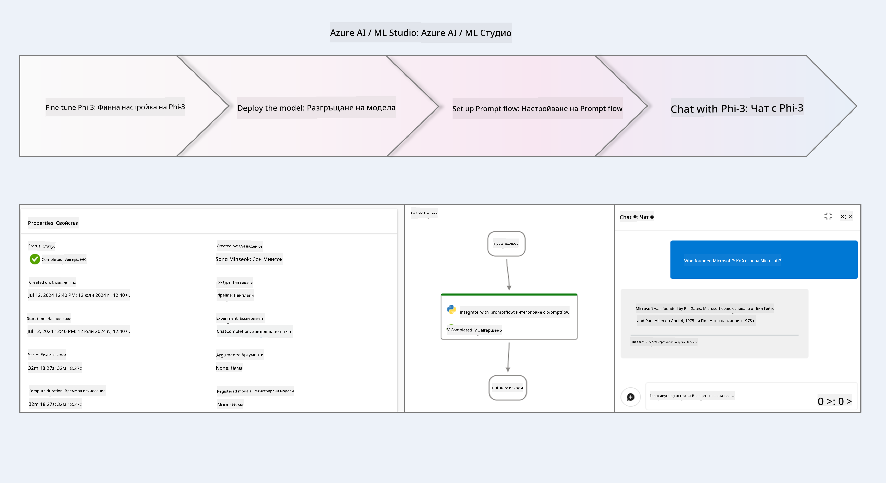

### Съдържание

1. **[Сценарий 1: Настройка на Azure ресурси и подготовка за фина настройка](../../../../../../md/02.Application/01.TextAndChat/Phi3)**
    - [Създаване на Azure Machine Learning Workspace](../../../../../../md/02.Application/01.TextAndChat/Phi3)
    - [Заявка за GPU квоти в Azure Subscription](../../../../../../md/02.Application/01.TextAndChat/Phi3)
    - [Добавяне на ролево назначение](../../../../../../md/02.Application/01.TextAndChat/Phi3)
    - [Настройка на проект](../../../../../../md/02.Application/01.TextAndChat/Phi3)
    - [Подготовка на набор от данни за фина настройка](../../../../../../md/02.Application/01.TextAndChat/Phi3)

1. **[Сценарий 2: Фина настройка на Phi-3 модел и внедряване в Azure Machine Learning Studio](../../../../../../md/02.Application/01.TextAndChat/Phi3)**
    - [Фина настройка на Phi-3 модела](../../../../../../md/02.Application/01.TextAndChat/Phi3)
    - [Внедряване на фино настроения Phi-3 модел](../../../../../../md/02.Application/01.TextAndChat/Phi3)

1. **[Сценарий 3: Интеграция с Prompt flow и чат с вашия персонализиран модел в Azure AI Foundry](../../../../../../md/02.Application/01.TextAndChat/Phi3)**
    - [Интеграция на персонализирания Phi-3 модел с Prompt flow](../../../../../../md/02.Application/01.TextAndChat/Phi3)
    - [Чат с вашия персонализиран Phi-3 модел](../../../../../../md/02.Application/01.TextAndChat/Phi3)

## Сценарий 1: Настройка на Azure ресурси и подготовка за фина настройка

### Създаване на Azure Machine Learning Workspace

1. Въведете *azure machine learning* в **лентата за търсене** в горната част на портала и изберете **Azure Machine Learning** от показаните опции.

    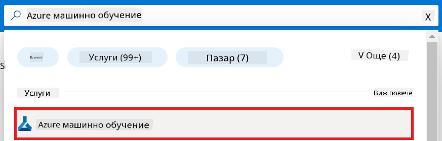

2. Изберете **+ Create** от навигационното меню.

3. Изберете **New workspace** от навигационното меню.

    

4. Изпълнете следните задачи:

    - Изберете вашия Azure **Subscription**.
    - Изберете **Resource group**, която да използвате (създайте нова, ако е необходимо).
    - Въведете **Workspace Name**. Трябва да е уникално име.
    - Изберете **Region**, която желаете да използвате.
    - Изберете **Storage account**, която да използвате (създайте нова, ако е необходимо).
    - Изберете **Key vault**, която да използвате (създайте нова, ако е необходимо).
    - Изберете **Application insights**, която да използвате (създайте нова, ако е необходимо).
    - Изберете **Container registry**, която да използвате (създайте нова, ако е необходимо).

    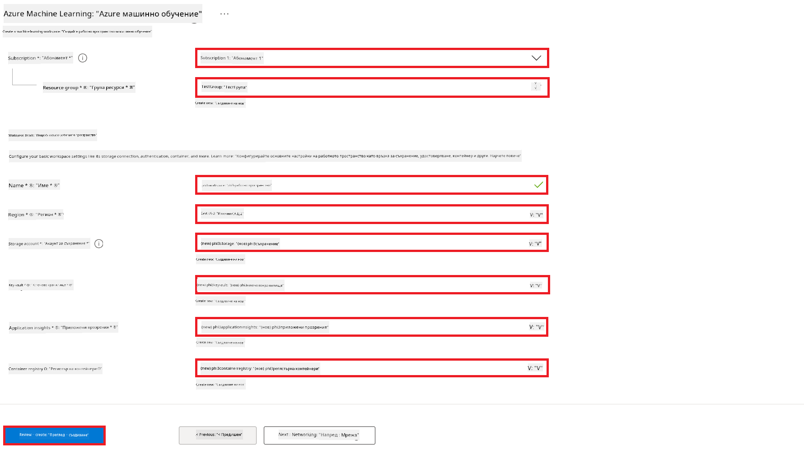

5. Изберете **Review + Create**.

6. Изберете **Create**.

### Заявка за GPU квоти в Azure Subscription

В това ръководство ще научите как да фино настроите и внедрите Phi-3 модел, използвайки GPU. За фина настройка ще използвате GPU *Standard_NC24ads_A100_v4*, който изисква заявка за квота. За внедряване ще използвате GPU *Standard_NC6s_v3*, който също изисква заявка за квота.

> [!NOTE]
>
> Само абонаменти от тип Pay-As-You-Go (стандартен тип абонамент) имат право на GPU ресурси; абонаментите с ползи не се поддържат в момента.
>

1. Посетете [Azure ML Studio](https://ml.azure.com/home?wt.mc_id=studentamb_279723).

1. Изпълнете следните стъпки, за да заявите квота за *Standard NCADSA100v4 Family*:

    - Изберете **Quota** от лявата странична лента.
    - Изберете **Virtual machine family**, която искате да използвате. Например, изберете **Standard NCADSA100v4 Family Cluster Dedicated vCPUs**, която включва GPU *Standard_NC24ads_A100_v4*.
    - Изберете **Request quota** от навигационното меню.

        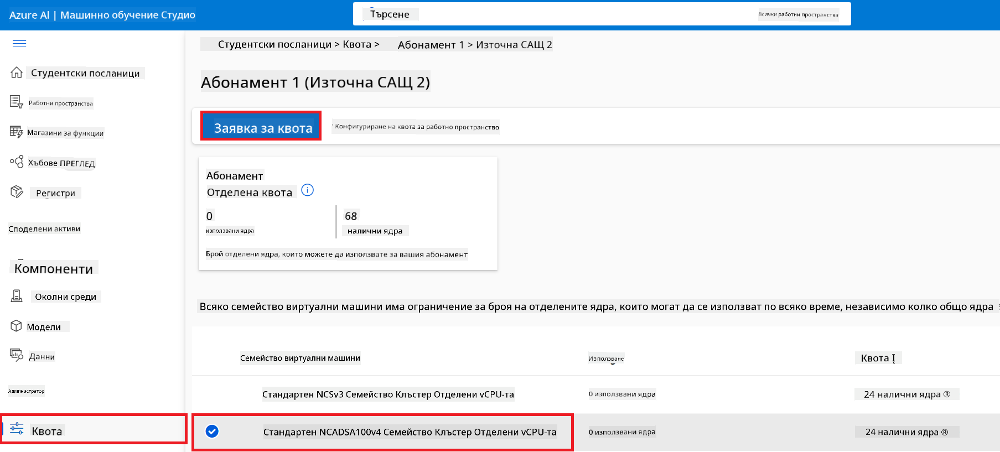

    - В страницата за заявка на квота въведете **New cores limit**, който желаете да използвате. Например, 24.
    - В страницата за заявка на квота изберете **Submit**, за да изпратите заявката за GPU квота.

1. Изпълнете следните стъпки, за да заявите квота за *Standard NCSv3 Family*:

    - Изберете **Quota** от лявата странична лента.
    - Изберете **Virtual machine family**, която искате да използвате. Например, изберете **Standard NCSv3 Family Cluster Dedicated vCPUs**, която включва GPU *Standard_NC6s_v3*.
    - Изберете **Request quota** от навигационното меню.
    - В страницата за заявка на квота въведете **New cores limit**, който желаете да използвате. Например, 24.
    - В страницата за заявка на квота изберете **Submit**, за да изпратите заявката за GPU квота.

### Добавяне на ролево назначение

За да фино настроите и внедрите моделите си, първо трябва да създадете User Assigned Managed Identity (UAI) и да ѝ присвоите подходящите разрешения. Тази UAI ще се използва за удостоверяване по време на внедряването.

#### Създаване на User Assigned Managed Identity (UAI)

1. Въведете *managed identities* в **лентата за търсене** в горната част на портала и изберете **Managed Identities** от показаните опции.

    

1. Изберете **+ Create**.

    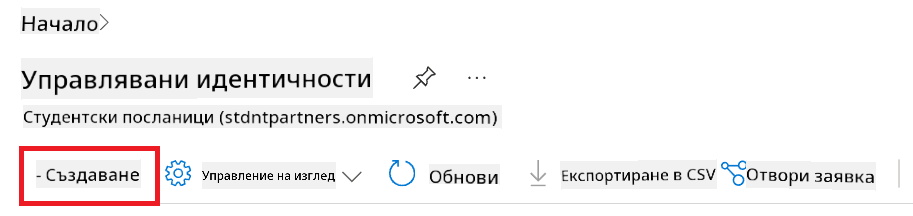

1. Изпълнете следните задачи:

    - Изберете вашия Azure **Subscription**.
    - Изберете **Resource group**, която да използвате (създайте нова, ако е необходимо).
    - Изберете **Region**, която желаете да използвате.
    - Въведете **Name**. Трябва да е уникално име.

    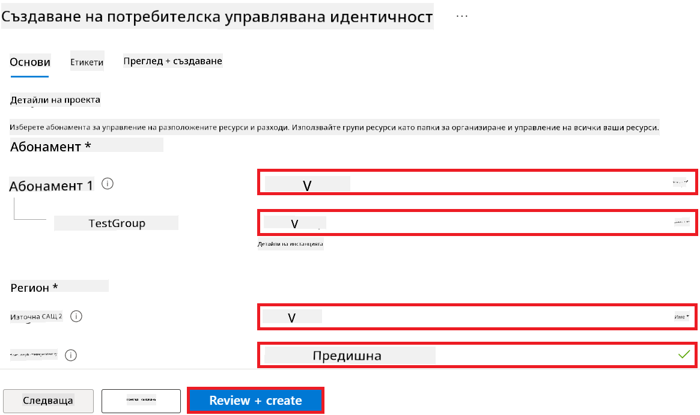

1. Изберете **Review + create**.

1. Изберете **+ Create**.

#### Добавяне на роля Contributor към Managed Identity

1. Отидете до създадения от вас Managed Identity ресурс.

1. Изберете **Azure role assignments** от лявата странична лента.

1. Изберете **+Add role assignment** от навигационното меню.

1. В страницата Add role assignment изпълнете следните задачи:
    - Изберете **Scope** на **Resource group**.
    - Изберете вашия Azure **Subscription**.
    - Изберете **Resource group**, която да използвате.
    - Изберете **Role** на **Contributor**.

    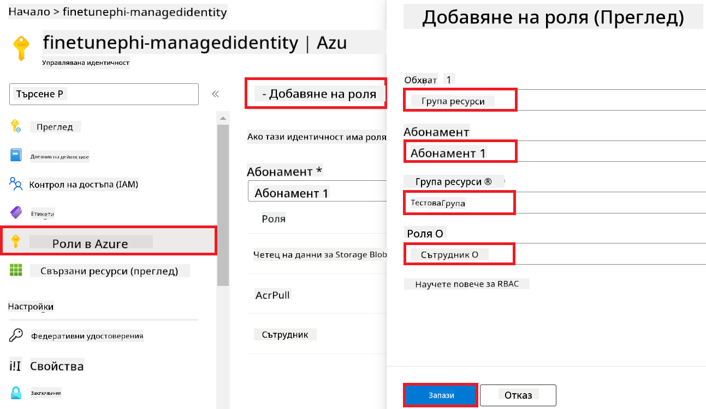

2. Изберете **Save**.

#### Добавяне на роля Storage Blob Data Reader към Managed Identity

1. Въведете *storage accounts* в **лентата за търсене** в горната част на портала и изберете **Storage accounts** от показаните опции.

    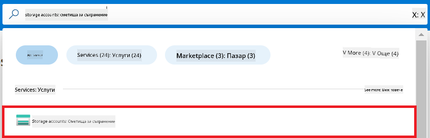

1. Изберете storage акаунта, асоцииран с Azure Machine Learning workspace, който сте създали. Например, *finetunephistorage*.

1. Изпълнете следните стъпки, за да стигнете до страницата Add role assignment:

    - Отидете до създадения Azure Storage акаунт.
    - Изберете **Access Control (IAM)** от лявата странична лента.
    - Изберете **+ Add** от навигационното меню.
    - Изберете **Add role assignment** от навигационното меню.

    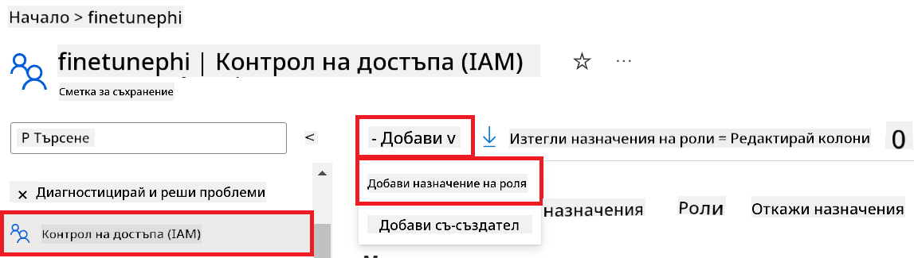

1. В страницата Add role assignment изпълнете следните задачи:

    - В полето Role въведете *Storage Blob Data Reader* в **лентата за търсене** и изберете **Storage Blob Data Reader** от показаните опции.
    - Изберете **Next**.
    - В страницата Members изберете **Assign access to** **Managed identity**.
    - Изберете **+ Select members**.
    - В страницата Select managed identities изберете вашия Azure **Subscription**.
    - Изберете **Managed identity** на **Manage Identity**.
    - Изберете създадената Manage Identity. Например, *finetunephi-managedidentity*.
    - Изберете **Select**.

    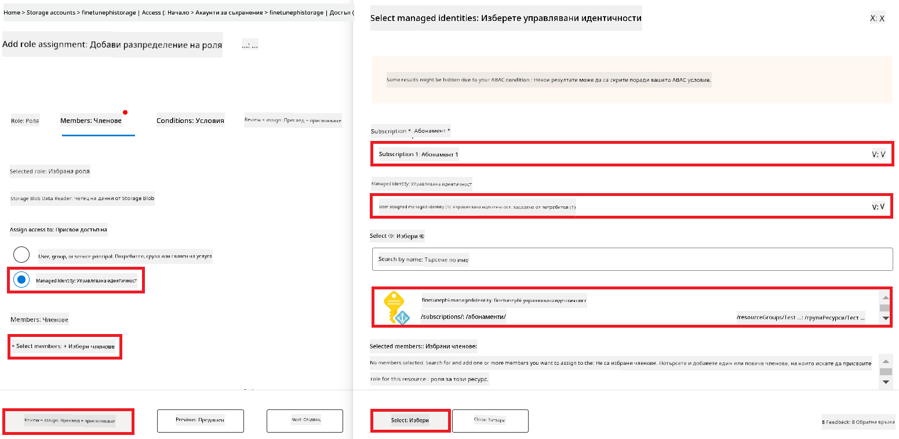

1. Изберете **Review + assign**.

#### Добавяне на роля AcrPull към Managed Identity

1. Въведете *container registries* в **лентата за търсене** в горната част на портала и изберете **Container registries** от показаните опции.

    

1. Изберете container registry, асоцииран с Azure Machine Learning workspace. Например, *finetunephicontainerregistry*

1. Изпълнете следните стъпки, за да стигнете до страницата Add role assignment:

    - Изберете **Access Control (IAM)** от лявата странична лента.
    - Изберете **+ Add** от навигационното меню.
    - Изберете **Add role assignment** от навигационното меню.

1. В страницата Add role assignment изпълнете следните задачи:

    - В полето Role въведете *AcrPull* в **лентата за търсене** и изберете **AcrPull** от показаните опции.
    - Изберете **Next**.
    - В страницата Members изберете **Assign access to** **Managed identity**.
    - Изберете **+ Select members**.
    - В страницата Select managed identities изберете вашия Azure **Subscription**.
    - Изберете **Managed identity** на **Manage Identity**.
    - Изберете създадената Manage Identity. Например, *finetunephi-managedidentity*.
    - Изберете **Select**.
    - Изберете **Review + assign**.

### Настройка на проект

За да изтеглите необходимите набори от данни за фина настройка, ще настроите локална среда.

В това упражнение ще:

- Създадете папка, в която да работите.
- Създадете виртуална среда.
- Инсталирате необходимите пакети.
- Създадете файл *download_dataset.py* за изтегляне на набора от данни.

#### Създаване на папка, в която да работите

1. Отворете терминал и въведете следната команда, за да създадете папка с име *finetune-phi* в стандартната директория.

    ```console
    mkdir finetune-phi
    ```

2. Въведете следната команда в терминала, за да навигирате до създадената папка *finetune-phi*.

    ```console
    cd finetune-phi
    ```

#### Създаване на виртуална среда

1. Въведете следната команда в терминала, за да създадете виртуална среда с име *.venv*.

    ```console
    python -m venv .venv
    ```

2. Въведете следната команда в терминала, за да активирате виртуалната среда.

    ```console
    .venv\Scripts\activate.bat
    ```

> [!NOTE]
> Ако всичко е наред, трябва да видите *(.venv)* преди командния ред.

#### Инсталиране на необходимите пакети

1. Въведете следните команди в терминала, за да инсталирате необходимите пакети.

    ```console
    pip install datasets==2.19.1
    ```

#### Създаване на `download_dataset.py`

> [!NOTE]
> Пълна структура на папките:
>
> ```text
> └── YourUserName
> .    └── finetune-phi
> .        └── download_dataset.py
> ```

1. Отворете **Visual Studio Code**.

1. Изберете **File** от менюто.

1. Изберете **Open Folder**.

1. Изберете папката *finetune-phi*, която сте създали, намираща се в *C:\Users\yourUserName\finetune-phi*.

    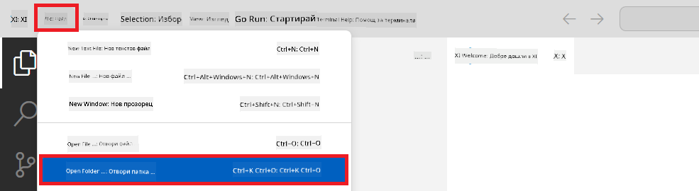

1. В лявата част на Visual Studio Code, кликнете с десен бутон и изберете **New File**, за да създадете нов файл с име *download_dataset.py*.

    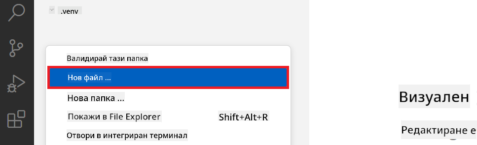

### Подготовка на набор от данни за фина настройка

В това упражнение ще стартирате файла *download_dataset.py*, за да изтеглите набора от данни *ultrachat_200k* в локалната си среда. След това ще използвате този набор от данни за фина настройка на Phi-3 модела в Azure Machine Learning.

В това упражнение ще:

- Добавите код във файла *download_dataset.py* за изтегляне на набора от данни.
- Стартирате файла *download_dataset.py*, за да изтеглите набора от данни в локалната си среда.

#### Изтегляне на набора от данни с помощта на *download_dataset.py*

1. Отворете файла *download_dataset.py* във Visual Studio Code.

1. Добавете следния код във файла *download_dataset.py*.

    ```python
    import json
    import os
    from datasets import load_dataset

    def load_and_split_dataset(dataset_name, config_name, split_ratio):
        """
        Load and split a dataset.
        """
        # Load the dataset with the specified name, configuration, and split ratio
        dataset = load_dataset(dataset_name, config_name, split=split_ratio)
        print(f"Original dataset size: {len(dataset)}")
        
        # Split the dataset into train and test sets (80% train, 20% test)
        split_dataset = dataset.train_test_split(test_size=0.2)
        print(f"Train dataset size: {len(split_dataset['train'])}")
        print(f"Test dataset size: {len(split_dataset['test'])}")
        
        return split_dataset

    def save_dataset_to_jsonl(dataset, filepath):
        """
        Save a dataset to a JSONL file.
        """
        # Create the directory if it does not exist
        os.makedirs(os.path.dirname(filepath), exist_ok=True)
        
        # Open the file in write mode
        with open(filepath, 'w', encoding='utf-8') as f:
            # Iterate over each record in the dataset
            for record in dataset:
                # Dump the record as a JSON object and write it to the file
                json.dump(record, f)
                # Write a newline character to separate records
                f.write('\n')
        
        print(f"Dataset saved to {filepath}")

    def main():
        """
        Main function to load, split, and save the dataset.
        """
        # Load and split the ULTRACHAT_200k dataset with a specific configuration and split ratio
        dataset = load_and_split_dataset("HuggingFaceH4/ultrachat_200k", 'default', 'train_sft[:1%]')
        
        # Extract the train and test datasets from the split
        train_dataset = dataset['train']
        test_dataset = dataset['test']

        # Save the train dataset to a JSONL file
        save_dataset_to_jsonl(train_dataset, "data/train_data.jsonl")
        
        # Save the test dataset to a separate JSONL file
        save_dataset_to_jsonl(test_dataset, "data/test_data.jsonl")

    if __name__ == "__main__":
        main()

    ```

1. Въведете следната команда в терминала, за да стартирате скрипта и изтеглите набора от данни в локалната си среда.

    ```console
    python download_dataset.py
    ```

1. Проверете дали наборите от данни са запазени успешно в локалната директория *finetune-phi/data*.

> [!NOTE]
>
> #### Забележка относно размера на наб
1. Посетете [Azure ML Studio](https://ml.azure.com/home?wt.mc_id=studentamb_279723).

1. Изберете **Compute** от таба вляво.

1. Изберете **Compute clusters** от навигационното меню.

1. Изберете **+ New**.

    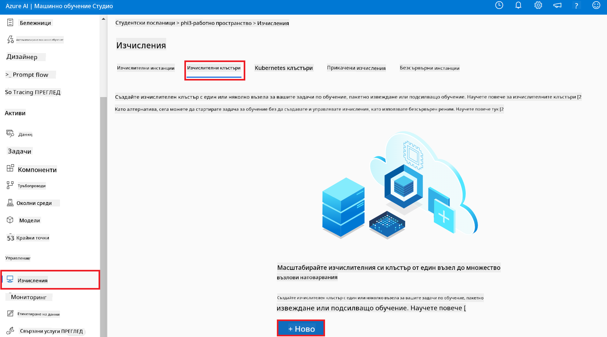

1. Изпълнете следните задачи:

    - Изберете **Region**, който искате да използвате.
    - Изберете **Virtual machine tier** на **Dedicated**.
    - Изберете **Virtual machine type** на **GPU**.
    - Филтрирайте **Virtual machine size** на **Select from all options**.
    - Изберете **Virtual machine size** на **Standard_NC24ads_A100_v4**.

    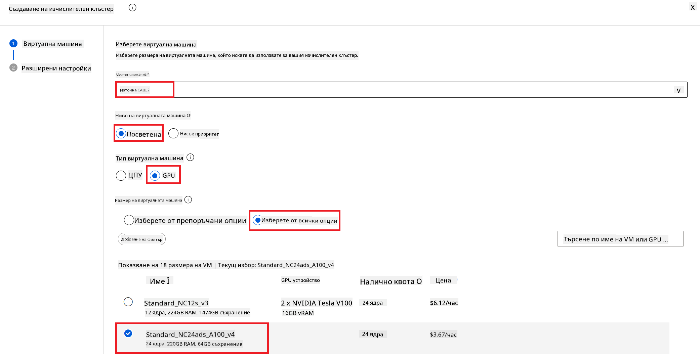

1. Изберете **Next**.

1. Изпълнете следните задачи:

    - Въведете **Compute name**. Трябва да е уникално име.
    - Изберете **Minimum number of nodes** на **0**.
    - Изберете **Maximum number of nodes** на **1**.
    - Изберете **Idle seconds before scale down** на **120**.

    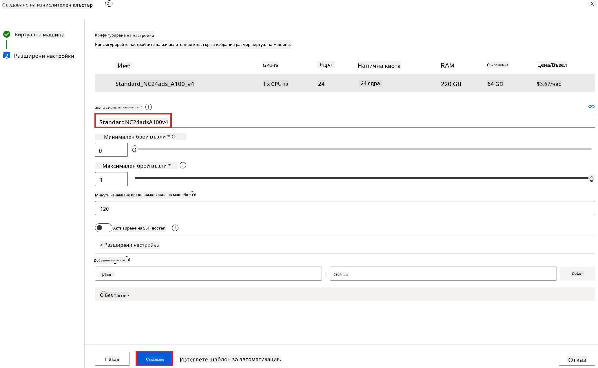

1. Изберете **Create**.

#### Финна настройка на модела Phi-3

1. Посетете [Azure ML Studio](https://ml.azure.com/home?wt.mc_id=studentamb_279723).

1. Изберете създаденото Azure Machine Learning работно пространство.

    

1. Изпълнете следните задачи:

    - Изберете **Model catalog** от таба вляво.
    - Въведете *phi-3-mini-4k* в **search bar** и изберете **Phi-3-mini-4k-instruct** от появилите се опции.

    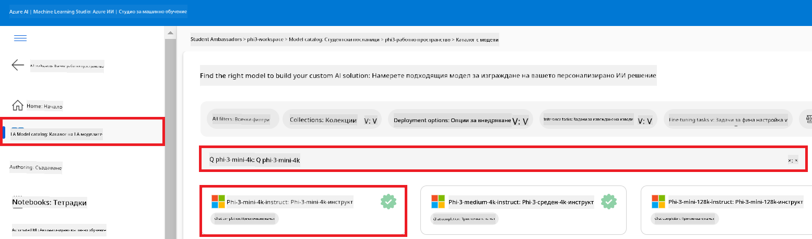

1. Изберете **Fine-tune** от навигационното меню.

    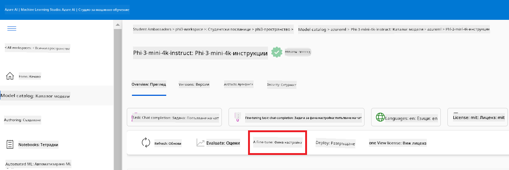

1. Изпълнете следните задачи:

    - Изберете **Select task type** на **Chat completion**.
    - Изберете **+ Select data** за качване на **Traning data**.
    - Изберете типа качване на Validation data на **Provide different validation data**.
    - Изберете **+ Select data** за качване на **Validation data**.

    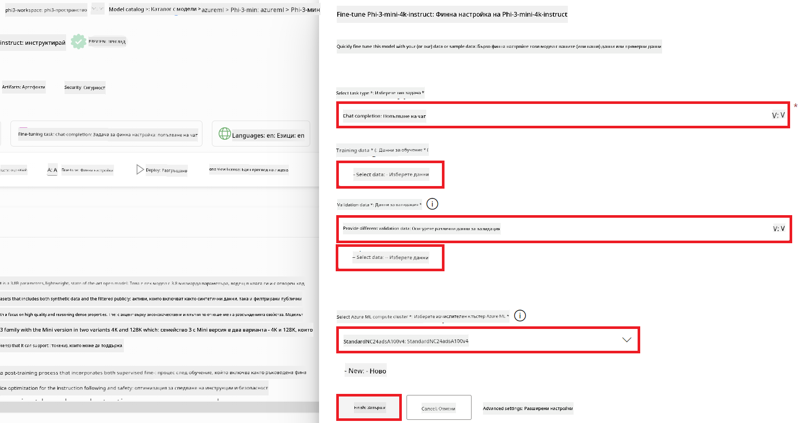

    > [!TIP]
    >
    > Можете да изберете **Advanced settings**, за да персонализирате конфигурации като **learning_rate** и **lr_scheduler_type**, за да оптимизирате процеса на финна настройка според вашите нужди.

1. Изберете **Finish**.

1. В това упражнение успешно финно настроихте модела Phi-3 с помощта на Azure Machine Learning. Имайте предвид, че процесът на финна настройка може да отнеме значително време. След стартиране на задачата за финна настройка трябва да изчакате тя да завърши. Можете да следите статуса на задачата, като отидете в раздел Jobs вляво в работното пространство на Azure Machine Learning. В следващата серия ще разгледаме как да разположите финно настроения модел и да го интегрирате с Prompt flow.

    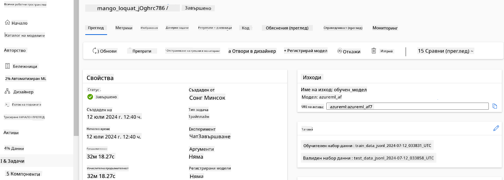

### Разполагане на финно настроения модел Phi-3

За да интегрирате финно настроения модел Phi-3 с Prompt flow, трябва да го разположите, за да бъде достъпен за реално време инференция. Този процес включва регистриране на модела, създаване на онлайн крайна точка и разполагане на модела.

В това упражнение ще:

- Регистрирате финно настроения модел в Azure Machine Learning работното пространство.
- Създадете онлайн крайна точка.
- Разположите регистрирания финно настроен модел Phi-3.

#### Регистриране на финно настроения модел

1. Посетете [Azure ML Studio](https://ml.azure.com/home?wt.mc_id=studentamb_279723).

1. Изберете създаденото Azure Machine Learning работно пространство.

    

1. Изберете **Models** от таба вляво.
1. Изберете **+ Register**.
1. Изберете **From a job output**.

    

1. Изберете създадената от вас задача.

    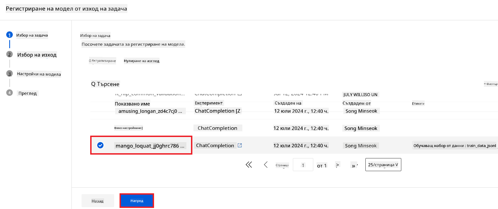

1. Изберете **Next**.

1. Изберете **Model type** на **MLflow**.

1. Уверете се, че **Job output** е избрано; това трябва да стане автоматично.

    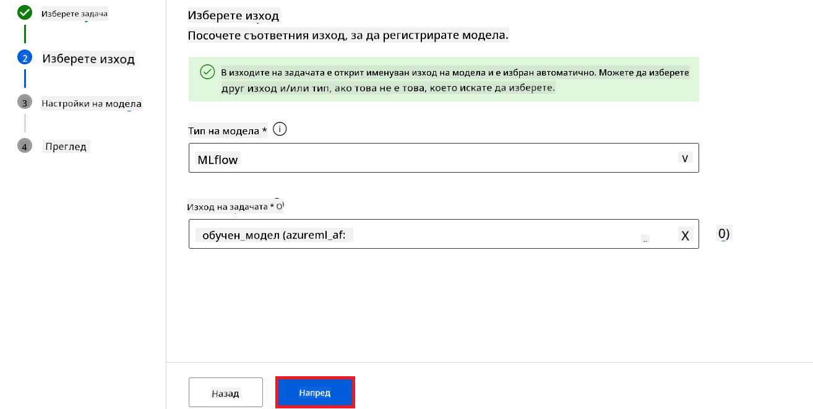

2. Изберете **Next**.

3. Изберете **Register**.

    

4. Можете да видите регистрирания модел, като отидете в менюто **Models** от таба вляво.

    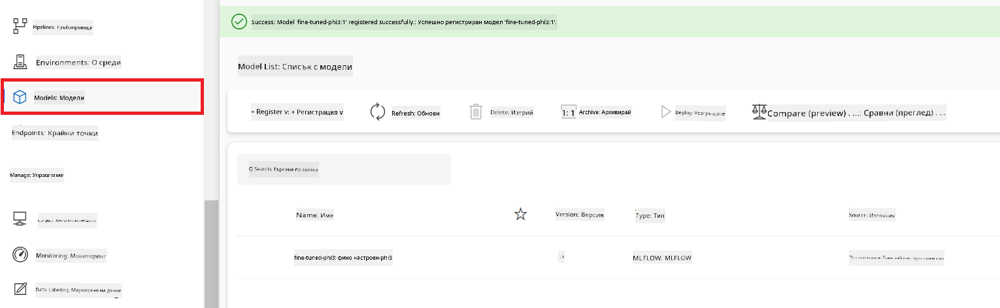

#### Разполагане на финно настроения модел

1. Отидете в създаденото Azure Machine Learning работно пространство.

1. Изберете **Endpoints** от таба вляво.

1. Изберете **Real-time endpoints** от навигационното меню.

    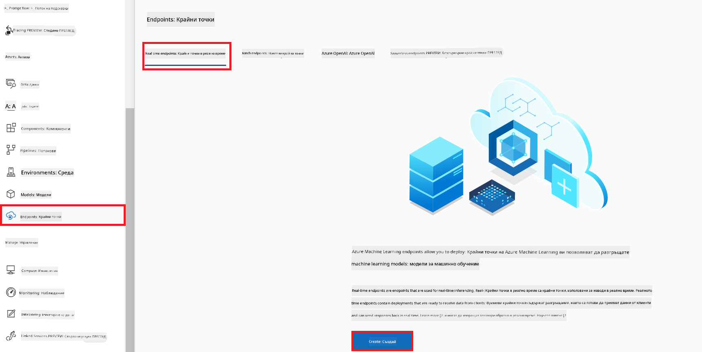

1. Изберете **Create**.

1. Изберете регистрирания модел, който създадохте.

    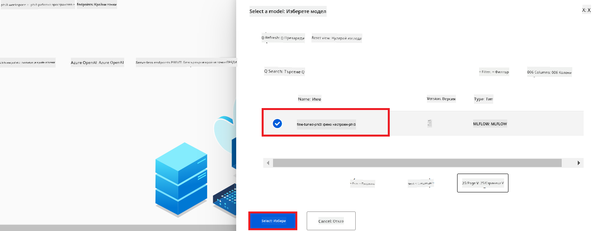

1. Изберете **Select**.

1. Изпълнете следните задачи:

    - Изберете **Virtual machine** на *Standard_NC6s_v3*.
    - Изберете броя на инстанциите, които искате да използвате, например *1*.
    - Изберете **Endpoint** на **New**, за да създадете крайна точка.
    - Въведете **Endpoint name**. Трябва да е уникално име.
    - Въведете **Deployment name**. Трябва да е уникално име.

    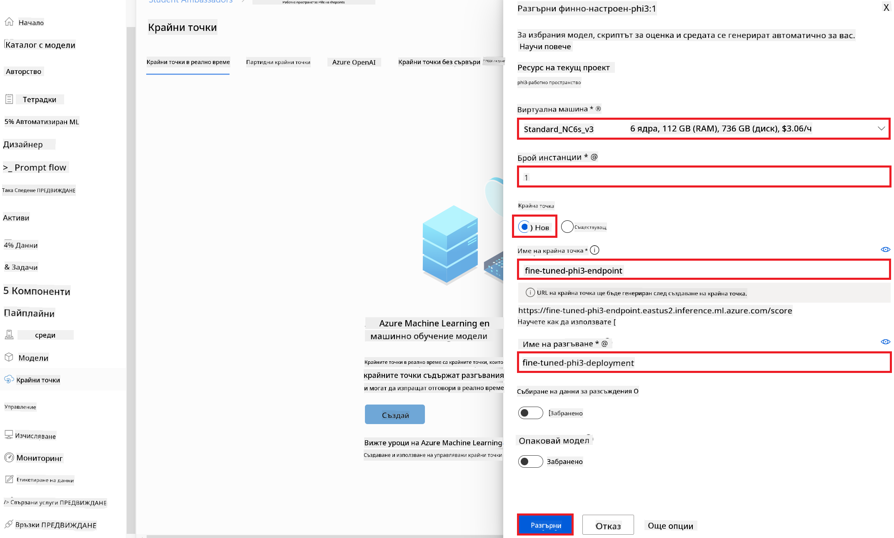

1. Изберете **Deploy**.

> [!WARNING]
> За да избегнете допълнителни такси, не забравяйте да изтриете създадената крайна точка в Azure Machine Learning работното пространство.
>

#### Проверка на статуса на разполагането в Azure Machine Learning Workspace

1. Отидете в създаденото Azure Machine Learning работно пространство.

1. Изберете **Endpoints** от таба вляво.

1. Изберете създадената крайна точка.

    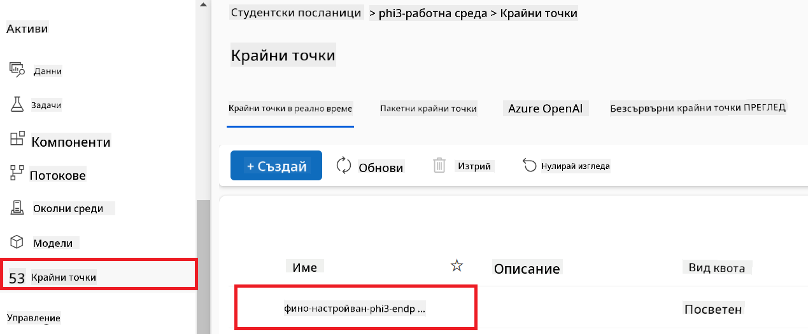

1. На тази страница можете да управлявате крайните точки по време на процеса на разполагане.

> [!NOTE]
> След като разполагането приключи, уверете се, че **Live traffic** е настроен на **100%**. Ако не е, изберете **Update traffic**, за да коригирате настройките за трафик. Имайте предвид, че не можете да тествате модела, ако трафикът е зададен на 0%.
>
> 
>

## Сценарий 3: Интегриране с Prompt flow и чат с вашия персонализиран модел в Azure AI Foundry

### Интегриране на персонализирания модел Phi-3 с Prompt flow

След успешното разполагане на финно настроения модел, вече можете да го интегрирате с Prompt Flow, за да използвате модела в реални приложения, позволявайки разнообразни интерактивни задачи с вашия персонализиран Phi-3 модел.

В това упражнение ще:

- Създадете Azure AI Foundry Hub.
- Създадете Azure AI Foundry Project.
- Създадете Prompt flow.
- Добавите персонализирана връзка за финно настроения модел Phi-3.
- Настроите Prompt flow за чат с вашия персонализиран модел Phi-3.

> [!NOTE]
> Можете също да интегрирате с Promptflow чрез Azure ML Studio. Същият процес на интеграция важи и за Azure ML Studio.

#### Създаване на Azure AI Foundry Hub

Трябва да създадете Hub преди да създадете Project. Hub действа като Resource Group, позволявайки ви да организирате и управлявате няколко проекта в Azure AI Foundry.

1. Посетете [Azure AI Foundry](https://ai.azure.com/?WT.mc_id=aiml-137032-kinfeylo).

1. Изберете **All hubs** от таба вляво.

1. Изберете **+ New hub** от навигационното меню.

    

1. Изпълнете следните задачи:

    - Въведете **Hub name**. Трябва да е уникално име.
    - Изберете вашия Azure **Subscription**.
    - Изберете **Resource group**, която искате да използвате (създайте нова, ако е необходимо).
    - Изберете **Location**, която искате да използвате.
    - Изберете **Connect Azure AI Services**, която искате да използвате (създайте нова, ако е необходимо).
    - Изберете **Connect Azure AI Search** на **Skip connecting**.

    

1. Изберете **Next**.

#### Създаване на Azure AI Foundry Project

1. В създадения от вас Hub изберете **All projects** от таба вляво.

1. Изберете **+ New project** от навигационното меню.

    

1. Въведете **Project name**. Трябва да е уникално име.

    

1. Изберете **Create a project**.

#### Добавяне на персонализирана връзка за финно настроения модел Phi-3

За да интегрирате персонализирания модел Phi-3 с Prompt flow, трябва да запишете крайна точка и ключ на модела в персонализирана връзка. Това осигурява достъп до вашия персонализиран Phi-3 модел в Prompt flow.

#### Настройка на api ключ и endpoint uri на финно настроения модел Phi-3

1. Посетете [Azure ML Studio](https://ml.azure.com/home?WT.mc_id=aiml-137032-kinfeylo).

1. Отидете в създаденото Azure Machine Learning работно пространство.

1. Изберете **Endpoints** от таба вляво.

    

1. Изберете създадената крайна точка.

    

1. Изберете **Consume** от навигационното меню.

1. Копирайте вашия **REST endpoint** и **Primary key**.


#### Добавяне на персонализирана връзка

1. Посетете [Azure AI Foundry](https://ai.azure.com/?WT.mc_id=aiml-137032-kinfeylo).

1. Отидете в проекта в Azure AI Foundry, който сте създали.

1. В проекта, който сте създали, изберете **Settings** от таба вляво.

1. Изберете **+ New connection**.

    

1. Изберете **Custom keys** от навигационното меню.

    

1. Изпълнете следните задачи:

    - Изберете **+ Add key value pairs**.
    - За името на ключа въведете **endpoint** и поставете endpoint-а, който копирахте от Azure ML Studio, в полето за стойност.
    - Отново изберете **+ Add key value pairs**.
    - За името на ключа въведете **key** и поставете ключа, който копирахте от Azure ML Studio, в полето за стойност.
    - След като добавите ключовете, изберете **is secret**, за да предотвратите излагането на ключа.

    

1. Изберете **Add connection**.

#### Създаване на Prompt flow

Вече добавихте персонализирана връзка в Azure AI Foundry. Сега нека създадем Prompt flow, като следвате стъпките по-долу. След това ще свържете този Prompt flow с персонализираната връзка, за да можете да използвате финно настроения модел в Prompt flow.

1. Отидете в проекта в Azure AI Foundry, който сте създали.

1. Изберете **Prompt flow** от таба вляво.

1. Изберете **+ Create** от навигационното меню.

    

1. Изберете **Chat flow** от навигационното меню.

    

1. Въведете **Folder name**, който искате да използвате.

    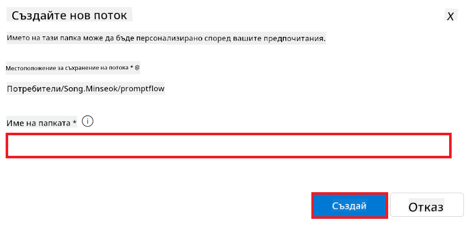

2. Изберете **Create**.

#### Настройване на Prompt flow за чат с вашия персонализиран Phi-3 модел

Трябва да интегрирате финно настроения Phi-3 модел в Prompt flow. Въпреки това, съществуващият Prompt flow не е предназначен за тази цел. Затова трябва да преработите Prompt flow, за да позволите интеграцията на персонализирания модел.

1. В Prompt flow изпълнете следните задачи, за да изградите наново съществуващия flow:

    - Изберете **Raw file mode**.
    - Изтрийте целия съществуващ код във файла *flow.dag.yml*.
    - Добавете следния код във файла *flow.dag.yml*.

        ```yml
        inputs:
          input_data:
            type: string
            default: "Who founded Microsoft?"

        outputs:
          answer:
            type: string
            reference: ${integrate_with_promptflow.output}

        nodes:
        - name: integrate_with_promptflow
          type: python
          source:
            type: code
            path: integrate_with_promptflow.py
          inputs:
            input_data: ${inputs.input_data}
        ```

    - Изберете **Save**.

    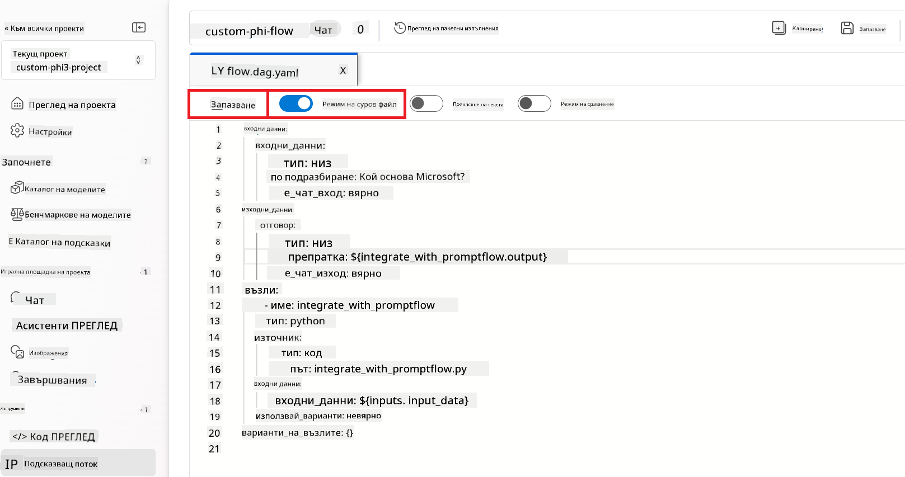

1. Добавете следния код във файла *integrate_with_promptflow.py*, за да използвате персонализирания Phi-3 модел в Prompt flow.

    ```python
    import logging
    import requests
    from promptflow import tool
    from promptflow.connections import CustomConnection

    # Logging setup
    logging.basicConfig(
        format="%(asctime)s - %(levelname)s - %(name)s - %(message)s",
        datefmt="%Y-%m-%d %H:%M:%S",
        level=logging.DEBUG
    )
    logger = logging.getLogger(__name__)

    def query_phi3_model(input_data: str, connection: CustomConnection) -> str:
        """
        Send a request to the Phi-3 model endpoint with the given input data using Custom Connection.
        """

        # "connection" is the name of the Custom Connection, "endpoint", "key" are the keys in the Custom Connection
        endpoint_url = connection.endpoint
        api_key = connection.key

        headers = {
            "Content-Type": "application/json",
            "Authorization": f"Bearer {api_key}"
        }
        data = {
            "input_data": {
                "input_string": [
                    {"role": "user", "content": input_data}
                ],
                "parameters": {
                    "temperature": 0.7,
                    "max_new_tokens": 128
                }
            }
        }
        try:
            response = requests.post(endpoint_url, json=data, headers=headers)
            response.raise_for_status()
            
            # Log the full JSON response
            logger.debug(f"Full JSON response: {response.json()}")

            result = response.json()["output"]
            logger.info("Successfully received response from Azure ML Endpoint.")
            return result
        except requests.exceptions.RequestException as e:
            logger.error(f"Error querying Azure ML Endpoint: {e}")
            raise

    @tool
    def my_python_tool(input_data: str, connection: CustomConnection) -> str:
        """
        Tool function to process input data and query the Phi-3 model.
        """
        return query_phi3_model(input_data, connection)

    ```

    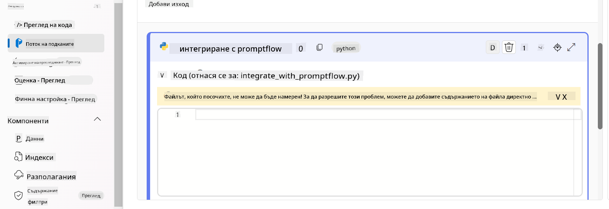

> [!NOTE]
> За по-подробна информация относно използването на Prompt flow в Azure AI Foundry, може да се обърнете към [Prompt flow в Azure AI Foundry](https://learn.microsoft.com/azure/ai-studio/how-to/prompt-flow).

1. Изберете **Chat input**, **Chat output**, за да активирате чата с вашия модел.

    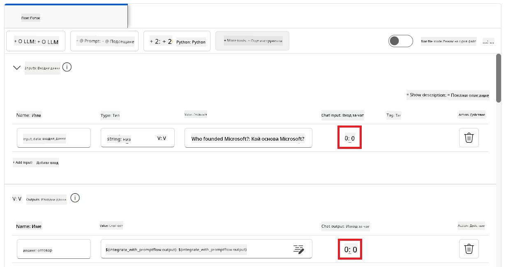

1. Сега сте готови да чатите с вашия персонализиран Phi-3 модел. В следващото упражнение ще научите как да стартирате Prompt flow и да го използвате за чат с вашия финно настроен Phi-3 модел.

> [!NOTE]
>
> Преработеният flow трябва да изглежда като на следващата снимка:
>
> 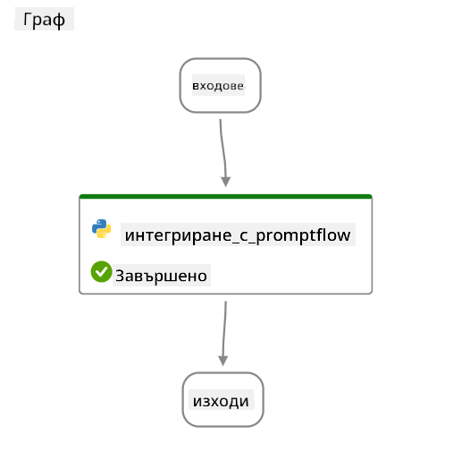
>

### Чат с вашия персонализиран Phi-3 модел

След като сте финно настроили и интегрирали вашия персонализиран Phi-3 модел с Prompt flow, вече сте готови да започнете взаимодействие с него. Това упражнение ще ви преведе през процеса на настройка и стартиране на чат с вашия модел чрез Prompt flow. Следвайки тези стъпки, ще можете пълноценно да използвате възможностите на финно настроения Phi-3 модел за различни задачи и разговори.

- Чат с вашия персонализиран Phi-3 модел чрез Prompt flow.

#### Стартиране на Prompt flow

1. Изберете **Start compute sessions**, за да стартирате Prompt flow.

    

1. Изберете **Validate and parse input**, за да обновите параметрите.

    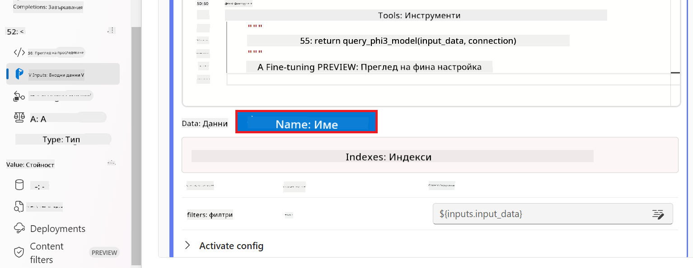

1. Изберете стойността на **connection** към персонализираната връзка, която сте създали. Например, *connection*.

    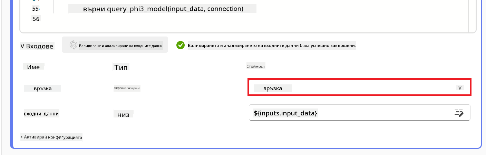

#### Чат с вашия персонализиран модел

1. Изберете **Chat**.

    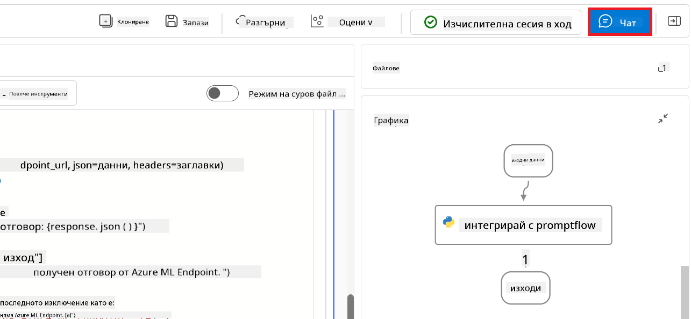

1. Ето пример за резултатите: Сега можете да чатите с вашия персонализиран Phi-3 модел. Препоръчително е да задавате въпроси, базирани на данните, използвани за финно настройване.

    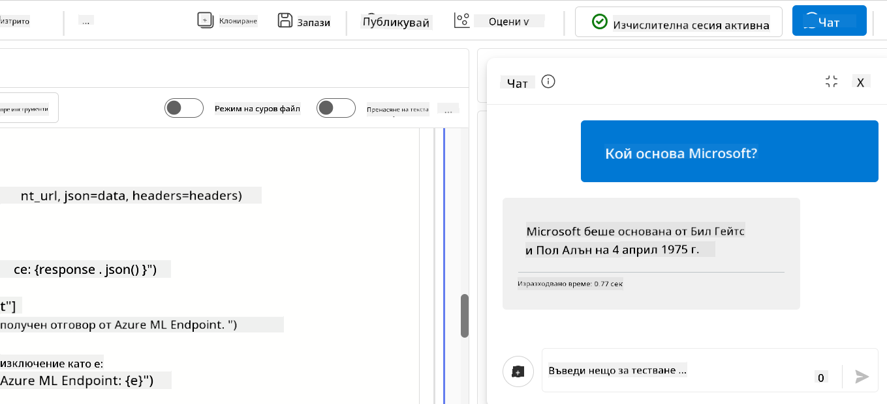

**Отказ от отговорност**:  
Този документ е преведен с помощта на AI преводаческа услуга [Co-op Translator](https://github.com/Azure/co-op-translator). Въпреки че се стремим към точност, моля, имайте предвид, че автоматизираните преводи могат да съдържат грешки или неточности. Оригиналният документ на неговия език трябва да се счита за авторитетен източник. За критична информация се препоръчва професионален човешки превод. Ние не носим отговорност за никакви недоразумения или неправилни тълкувания, произтичащи от използването на този превод.