# Фина настройка и интеграция на персонализирани Phi-3 модели с Prompt flow в Azure AI Foundry

Този краен до краен (E2E) пример е базиран на ръководството "[Фина настройка и интегриране на персонализирани Phi-3 модели с Prompt Flow в Azure AI Foundry](https://techcommunity.microsoft.com/t5/educator-developer-blog/fine-tune-and-integrate-custom-phi-3-models-with-prompt-flow-in/ba-p/4191726?WT.mc_id=aiml-137032-kinfeylo)" от Microsoft Tech Community. Той въвежда процесите на фина настройка, внедряване и интегриране на персонализирани Phi-3 модели с Prompt flow в Azure AI Foundry. За разлика от E2E примера, "[Фина настройка и интегриране на персонализирани Phi-3 модели с Prompt Flow](./E2E_Phi-3-FineTuning_PromptFlow_Integration.md)", който включваше изпълнение на код локално, това ръководство се фокусира изцяло върху фината настройка и интегрирането на вашия модел в рамките на Azure AI / ML Studio.

## Преглед

В този E2E пример ще научите как да фино настроите модела Phi-3 и да го интегрирате с Prompt flow в Azure AI Foundry. Използвайки Azure AI / ML Studio, вие ще установите работен процес за внедряване и използване на персонализирани AI модели. Този E2E пример е разделен на три сценария:

**Сценарий 1: Настройка на Azure ресурси и подготовка за фина настройка**

**Сценарий 2: Фина настройка на модела Phi-3 и внедряване в Azure Machine Learning Studio**

**Сценарий 3: Интеграция с Prompt flow и чат с персонализирания ви модел в Azure AI Foundry**

Ето преглед на този E2E пример.


### Съдържание

1. **[Сценарий 1: Настройка на Azure ресурси и подготовка за фина настройка](../../../../../../md/02.Application/01.TextAndChat/Phi3)**
    - [Създаване на Azure Machine Learning работна област](../../../../../../md/02.Application/01.TextAndChat/Phi3)
    - [Заявка за GPU квоти в Azure Абонамент](../../../../../../md/02.Application/01.TextAndChat/Phi3)
    - [Добавяне на ролево назначение](../../../../../../md/02.Application/01.TextAndChat/Phi3)
    - [Настройка на проект](../../../../../../md/02.Application/01.TextAndChat/Phi3)
    - [Подготовка на набор от данни за фина настройка](../../../../../../md/02.Application/01.TextAndChat/Phi3)

1. **[Сценарий 2: Фина настройка на модел Phi-3 и внедряване в Azure Machine Learning Studio](../../../../../../md/02.Application/01.TextAndChat/Phi3)**
    - [Фина настройка на модела Phi-3](../../../../../../md/02.Application/01.TextAndChat/Phi3)
    - [Внедряване на финно настроения модел Phi-3](../../../../../../md/02.Application/01.TextAndChat/Phi3)

1. **[Сценарий 3: Интеграция с Prompt flow и чат с персонализирания ви модел в Azure AI Foundry](../../../../../../md/02.Application/01.TextAndChat/Phi3)**
    - [Интегриране на персонализирания модел Phi-3 с Prompt flow](../../../../../../md/02.Application/01.TextAndChat/Phi3)
    - [Чат с вашия персонализиран модел Phi-3](../../../../../../md/02.Application/01.TextAndChat/Phi3)

## Сценарий 1: Настройка на Azure ресурси и подготовка за фина настройка

### Създаване на Azure Machine Learning работна област

1. Въведете *azure machine learning* в **лентата за търсене** в горната част на портала и изберете **Azure Machine Learning** от появилите се опции.

    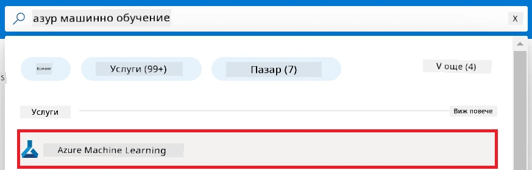

2. Изберете **+ Create** от навигационното меню.

3. Изберете **New workspace** от навигационното меню.

    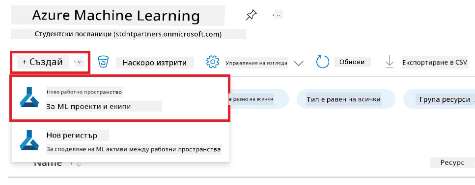

4. Изпълнете следните действия:

    - Изберете вашия Azure **Абонамент**.
    - Изберете **Ресурсна група**, която да използвате (създайте нова, ако е необходимо).
    - Въведете **Име на работната област**. То трябва да е уникално.
    - Изберете **Регион**, който желаете да използвате.
    - Изберете **Сметка за съхранение**, която да използвате (създайте нова, ако е необходимо).
    - Изберете **Key vault**, който да използвате (създайте нов, ако е необходимо).
    - Изберете **Application insights**, който да използвате (създайте нов, ако е необходимо).
    - Изберете **Регистър на контейнери**, който да използвате (създайте нов, ако е необходимо).

    

5. Изберете **Review + Create**.

6. Изберете **Create**.

### Заявка за GPU квоти в Azure Абонамент

В това ръководство ще научите как да фино настроите и внедрите модел Phi-3, използвайки GPU. За фината настройка ще използвате GPU *Standard_NC24ads_A100_v4*, който изисква заявка за квота. За внедряването ще използвате GPU *Standard_NC6s_v3*, който също изисква заявка за квота.

> [!NOTE]
>
> GPU разпределението е достъпно само за абонаменти Pay-As-You-Go (стандартен тип абонамент); абонаментите с ползи не се поддържат в момента.
>

1. Посетете [Azure ML Studio](https://ml.azure.com/home?wt.mc_id=studentamb_279723).

1. Изпълнете следните действия, за да заявите квота за *Standard NCADSA100v4 Family*:

    - Изберете **Quota** от лявата странична лента.
    - Изберете семейство **Виртуални машини**, което да използвате. Например, изберете **Standard NCADSA100v4 Family Cluster Dedicated vCPUs**, което включва GPU *Standard_NC24ads_A100_v4*.
    - Изберете **Request quota** от навигационното меню.

        

    - В страницата за заявка въведете **Нов лимит на ядра**, който искате да използвате. Например, 24.
    - Натиснете **Submit**, за да заявите квотата за GPU.

1. Изпълнете следните действия, за да заявите квота за *Standard NCSv3 Family*:

    - Изберете **Quota** от лявата странична лента.
    - Изберете семейство **Виртуални машини**, което да използвате. Например, изберете **Standard NCSv3 Family Cluster Dedicated vCPUs**, което включва GPU *Standard_NC6s_v3*.
    - Изберете **Request quota** от навигационното меню.
    - В страницата за заявка въведете **Нов лимит на ядра**, който искате да използвате. Например, 24.
    - Натиснете **Submit**, за да заявите квотата за GPU.

### Добавяне на ролево назначение

За да фино настроите и внедрите моделите си, първо трябва да създадете Управлявана идентичност, присвоена на потребител (User Assigned Managed Identity — UAI) и да ѝ присвоите съответните разрешения. Тази UAI ще се използва за удостоверение по време на внедряване.

#### Създаване на Управлявана идентичност, присвоена на потребител (UAI)

1. Въведете *managed identities* в **лентата за търсене** в горната част на портала и изберете **Managed Identities** от появилите се опции.

    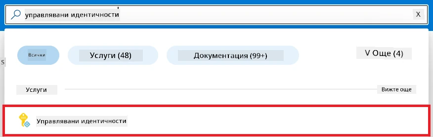

1. Изберете **+ Create**.

    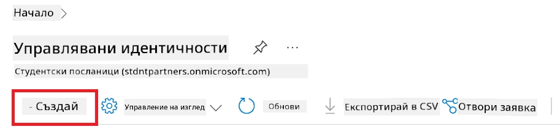

1. Изпълнете следните действия:

    - Изберете вашия Azure **Абонамент**.
    - Изберете **Ресурсна група**, която да използвате (създайте нова, ако е необходимо).
    - Изберете **Регион**, който желаете да използвате.
    - Въведете **Име**. То трябва да е уникално.

    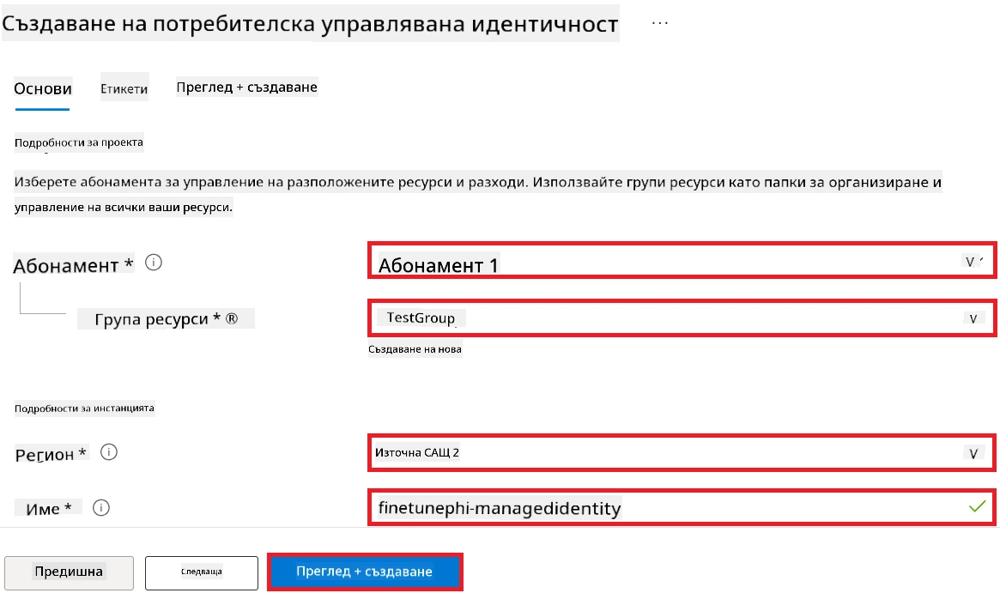

1. Изберете **Review + create**.

1. Изберете **+ Create**.

#### Добавяне на роля Contributor към Управлявана идентичност

1. Отидете в ресурса Управлявана идентичност, който сте създали.

1. Изберете **Azure role assignments** от лявата странична лента.

1. Изберете **+Add role assignment** от навигационното меню.

1. В страницата за добавяне на роля изпълнете следните действия:
    - Изберете **Обхват** (Scope) да бъде **Ресурсна група**.
    - Изберете вашия Azure **Абонамент**.
    - Изберете **Ресурсна група**, която да използвате.
    - Изберете **Ролята** (Role) да бъде **Contributor**.

    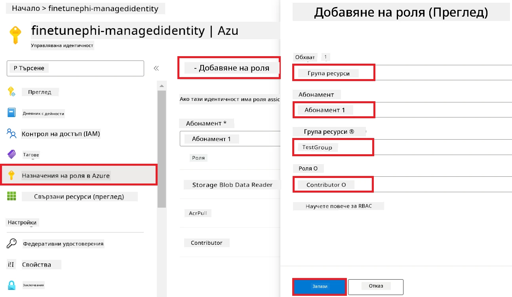

2. Изберете **Save**.

#### Добавяне на роля Storage Blob Data Reader към Управлявана идентичност

1. Въведете *storage accounts* в **лентата за търсене** в горната част на портала и изберете **Storage accounts** от появилите се опции.

    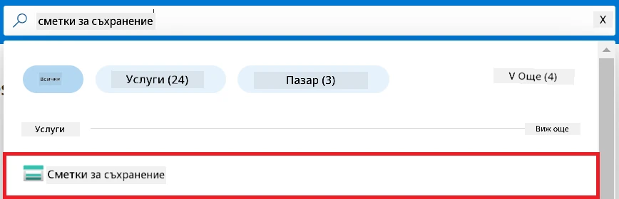

1. Изберете сметката за съхранение, асоциирана с работната област Azure Machine Learning, която създадохте. Например, *finetunephistorage*.

1. Изпълнете следните действия, за да достигнете до страницата за добавяне на роля:

    - Отидете до сметката за съхранение, която сте създали.
    - Изберете **Access Control (IAM)** от лявата странична лента.
    - Изберете **+ Add** от навигационното меню.
    - Изберете **Add role assignment** от навигационното меню.

    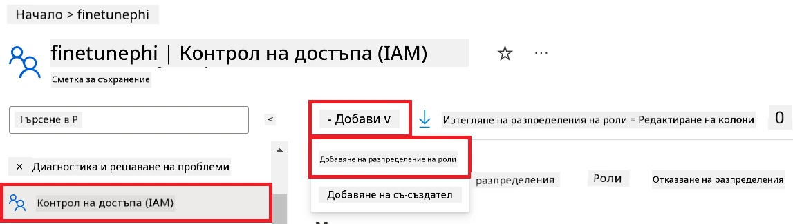

1. В страницата за добавяне на роля изпълнете следните действия:

    - В полето за роля въведете *Storage Blob Data Reader* в **лентата за търсене** и изберете **Storage Blob Data Reader** от появилите се опции.
    - Изберете **Next**.
    - В страницата за членове изберете **Assign access to** **Managed identity**.
    - Изберете **+ Select members**.
    - Изберете вашия Azure **Абонамент**.
    - Изберете **Managed identity** за **Manage Identity**.
    - Изберете Управляваната идентичност, която създадохте. Например, *finetunephi-managedidentity*.
    - Изберете **Select**.

    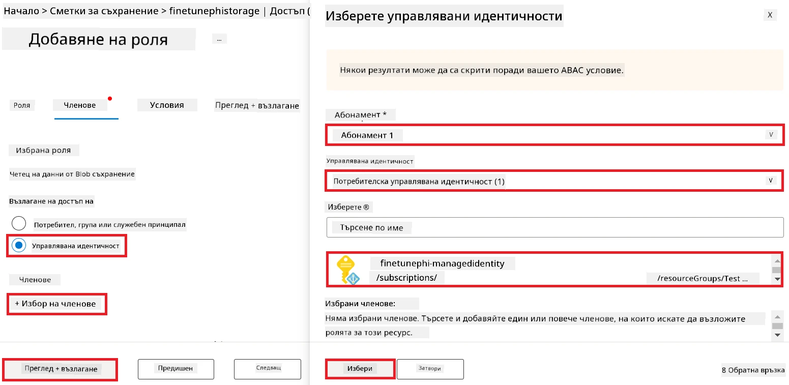

1. Изберете **Review + assign**.

#### Добавяне на роля AcrPull към Управлявана идентичност

1. Въведете *container registries* в **лентата за търсене** в горната част на портала и изберете **Container registries** от появилите се опции.

    

1. Изберете регистъра на контейнери, асоцииран с работната област Azure Machine Learning. Например, *finetunephicontainerregistry*

1. Изпълнете следните действия, за да достигнете до страницата за добавяне на роля:

    - Изберете **Access Control (IAM)** от лявата странична лента.
    - Изберете **+ Add** от навигационното меню.
    - Изберете **Add role assignment** от навигационното меню.

1. В страницата за добавяне на роля изпълнете следните действия:

    - В полето за роля въведете *AcrPull* в **лентата за търсене** и изберете **AcrPull** от появилите се опции.
    - Изберете **Next**.
    - В страницата за членове изберете **Assign access to** **Managed identity**.
    - Изберете **+ Select members**.
    - Изберете вашия Azure **Абонамент**.
    - Изберете **Managed identity** за **Manage Identity**.
    - Изберете Управляваната идентичност, която създадохте. Например, *finetunephi-managedidentity*.
    - Изберете **Select**.
    - Изберете **Review + assign**.

### Настройка на проект

За да изтеглите наборите от данни, необходими за фина настройка, ще настроите локална среда.

В това упражнение ще

- Създадете папка за работа в нея.
- Създадете виртуална среда.
- Инсталирате необходимите пакети.
- Създадете файл *download_dataset.py*, за да изтеглите набора от данни.

#### Създаване на папка за работа в нея

1. Отворете терминален прозорец и въведете следната команда, за да създадете папка с име *finetune-phi* в подразбиращата се пътека.

    ```console
    mkdir finetune-phi
    ```

2. Въведете следната команда във вашия терминал, за да преминете към папката *finetune-phi*, която сте създали.

    ```console
    cd finetune-phi
    ```

#### Създаване на виртуална среда

1. Въведете следната команда във вашия терминал, за да създадете виртуална среда с името *.venv*.

    ```console
    python -m venv .venv
    ```

2. Въведете следната команда във вашия терминал, за да активирате виртуалната среда.

    ```console
    .venv\Scripts\activate.bat
    ```

> [!NOTE]
> Ако всичко е успешно, трябва да видите *(.venv)* преди командния ред.

#### Инсталиране на необходимите пакети

1. Въведете следните команди във вашия терминал, за да инсталирате необходимите пакети.

    ```console
    pip install datasets==2.19.1
    ```

#### Създаване на `donload_dataset.py`

> [!NOTE]
> Пълна структура на папките:
>
> ```text
> └── YourUserName
> .    └── finetune-phi
> .        └── download_dataset.py
> ```

1. Отворете **Visual Studio Code**.

1. Изберете **File** от лентата с менюта.

1. Изберете **Open Folder**.

1. Изберете папката *finetune-phi*, която сте създали, намираща се в *C:\Users\yourUserName\finetune-phi*.

    

1. В лявата част на Visual Studio Code, кликнете с десен бутон и изберете **New File**, за да създадете нов файл с име *download_dataset.py*.

    

### Подготовка на датасет за фино нагласяне

В това упражнение ще стартирате файла *download_dataset.py*, за да изтеглите датасетите *ultrachat_200k* във вашата локална среда. След това ще използвате тези данни, за да фино настроите модела Phi-3 в Azure Machine Learning.

В това упражнение ще:

- Добавите код във файла *download_dataset.py* за изтегляне на датасетите.
- Стартирате файла *download_dataset.py*, за да изтеглите датасетите локално.

#### Изтегляне на вашия датасет с *download_dataset.py*

1. Отворете файла *download_dataset.py* в Visual Studio Code.

1. Добавете следния код във файла *download_dataset.py*.

    ```python
    import json
    import os
    from datasets import load_dataset

    def load_and_split_dataset(dataset_name, config_name, split_ratio):
        """
        Load and split a dataset.
        """
        # Заредете набора от данни със зададеното име, конфигурация и съотношение на разпределение
        dataset = load_dataset(dataset_name, config_name, split=split_ratio)
        print(f"Original dataset size: {len(dataset)}")
        
        # Разделете набора от данни на тренировъчен и тестови набор (80% тренировка, 20% тест)
        split_dataset = dataset.train_test_split(test_size=0.2)
        print(f"Train dataset size: {len(split_dataset['train'])}")
        print(f"Test dataset size: {len(split_dataset['test'])}")
        
        return split_dataset

    def save_dataset_to_jsonl(dataset, filepath):
        """
        Save a dataset to a JSONL file.
        """
        # Създайте директорията, ако не съществува
        os.makedirs(os.path.dirname(filepath), exist_ok=True)
        
        # Отворете файла в режим на запис
        with open(filepath, 'w', encoding='utf-8') as f:
            # Итерация върху всеки запис в набора от данни
            for record in dataset:
                # Запишете записа като JSON обект и го напишете във файла
                json.dump(record, f)
                # Запишете нов ред, за да отделите записите
                f.write('\n')
        
        print(f"Dataset saved to {filepath}")

    def main():
        """
        Main function to load, split, and save the dataset.
        """
        # Заредете и разделете набора ULTRACHAT_200k с конкретна конфигурация и съотношение на разпределение
        dataset = load_and_split_dataset("HuggingFaceH4/ultrachat_200k", 'default', 'train_sft[:1%]')
        
        # Извлечете тренировъчния и тестовия набор от разделението
        train_dataset = dataset['train']
        test_dataset = dataset['test']

        # Запазете тренировъчния набор в JSONL файл
        save_dataset_to_jsonl(train_dataset, "data/train_data.jsonl")
        
        # Запазете тестовия набор в отделен JSONL файл
        save_dataset_to_jsonl(test_dataset, "data/test_data.jsonl")

    if __name__ == "__main__":
        main()

    ```

1. Въведете следната команда във вашия терминал, за да стартирате скрипта и да изтеглите датасета във вашата локална среда.

    ```console
    python download_dataset.py
    ```

1. Проверете дали датасетите са запазени успешно в локалната директория *finetune-phi/data*.

> [!NOTE]
>
> #### Забележка относно размера на датасета и времето за фино нагласяне
>
> В този урок използвате само 1% от датасета (`split='train[:1%]'`). Това значително намалява количеството данни, ускорявайки както качването, така и процеса на фино нагласяне. Можете да регулирате процента, за да намерите правилния баланс между времето за обучение и производителността на модела. Използването на по-малка подмножество от датасета намалява времето, необходимо за фино нагласяне, което прави процеса по-лесен за изпълнение в урок.

## Сценарий 2: Фино нагласяне на модела Phi-3 и внедряване в Azure Machine Learning Studio

### Фино нагласяне на модела Phi-3

В това упражнение ще фино настроите модела Phi-3 в Azure Machine Learning Studio.

В това упражнение ще:

- Създадете компютърен клъстер за фино нагласяне.
- Фино настроите модела Phi-3 в Azure Machine Learning Studio.

#### Създаване на компютърен клъстер за фино нагласяне

1. Посетете [Azure ML Studio](https://ml.azure.com/home?wt.mc_id=studentamb_279723).

1. Изберете **Compute** от страничната лента.

1. Изберете **Compute clusters** от навигационното меню.

1. Изберете **+ New**.

    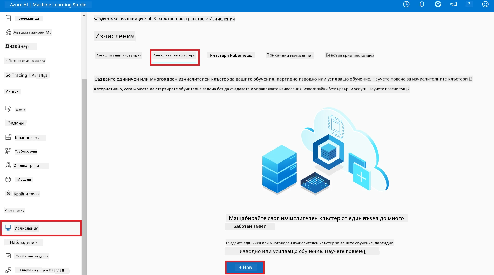

1. Изпълнете следните задачи:

    - Изберете **Регион**, който искате да използвате.
    - Изберете **Virtual machine tier** на **Dedicated**.
    - Изберете **Virtual machine type** на **GPU**.
    - Филтрирайте **Virtual machine size** към **Select from all options**.
    - Изберете **Virtual machine size** на **Standard_NC24ads_A100_v4**.

    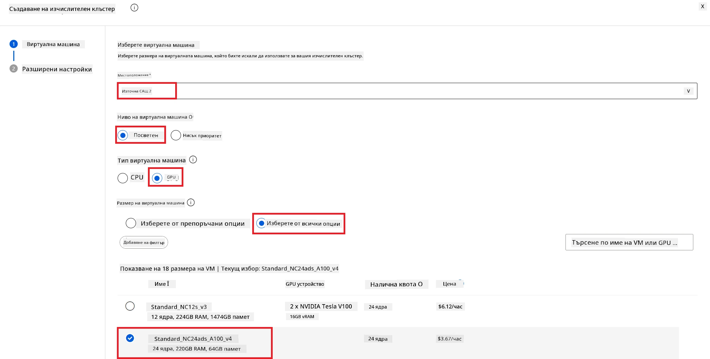

1. Изберете **Next**.

1. Изпълнете следните задачи:

    - Въведете **Име на клъстера**. Трябва да е уникална стойност.
    - Изберете **Минимален брой възли** на **0**.
    - Изберете **Максимален брой възли** на **1**.
    - Задайте **Idle seconds before scale down** на **120**.

    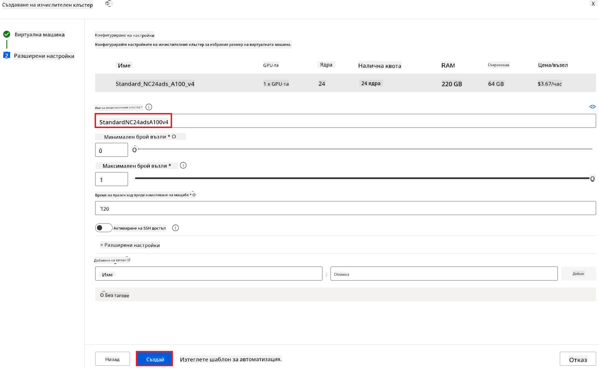

1. Изберете **Create**.

#### Фино нагласяне на модела Phi-3

1. Посетете [Azure ML Studio](https://ml.azure.com/home?wt.mc_id=studentamb_279723).

1. Изберете работното пространство на Azure Machine Learning, което сте създали.

    

1. Извършете следните стъпки:

    - Изберете **Model catalog** от страничната лента.
    - Въведете *phi-3-mini-4k* в полето за търсене и изберете **Phi-3-mini-4k-instruct** от показаните опции.

    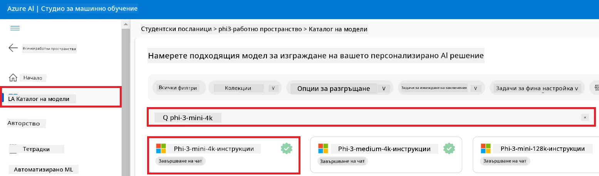

1. Изберете **Fine-tune** от навигационното меню.

    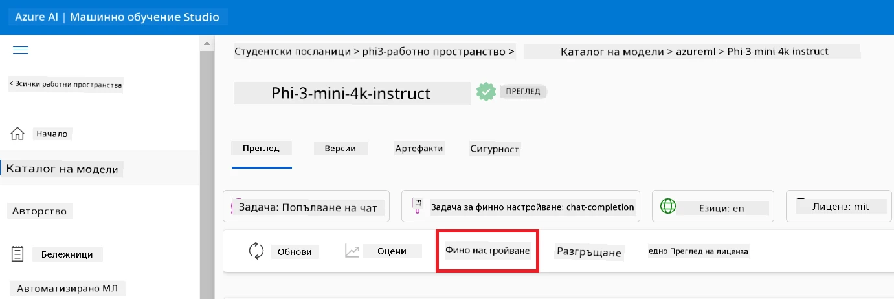

1. Извършете следните стъпки:

    - Изберете **Select task type** на **Chat completion**.
    - Изберете **+ Select data** за качване на **Traning data**.
    - Изберете типа валидиращи данни на **Provide different validation data**.
    - Изберете **+ Select data** за качване на **Validation data**.

    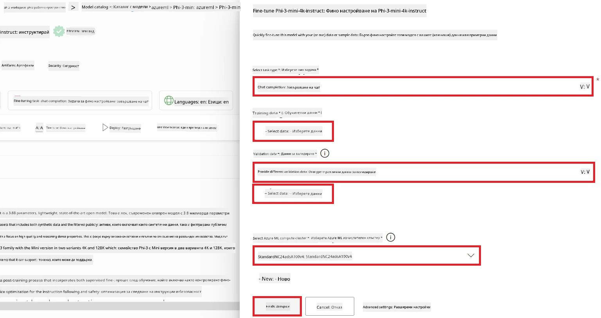

> [!TIP]
>
> Можете да изберете **Advanced settings** за персонализиране на конфигурациите като **learning_rate** и **lr_scheduler_type**, за да оптимизирате процеса на фино нагласяне според вашите нужди.

1. Изберете **Finish**.

1. В това упражнение успешно фино настроихте модела Phi-3 с помощта на Azure Machine Learning. Моля, обърнете внимание, че процесът на фино нагласяне може да отнеме значително време. След стартиране на задачата за фино нагласяне трябва да изчакате тя да завърши. Можете да наблюдавате статуса на задачата чрез навигация до раздела Jobs в лявата страна на вашето работно пространство в Azure Machine Learning. В следващата серия ще внедрите фино нагласения модел и ще го интегрирате с Prompt flow.

    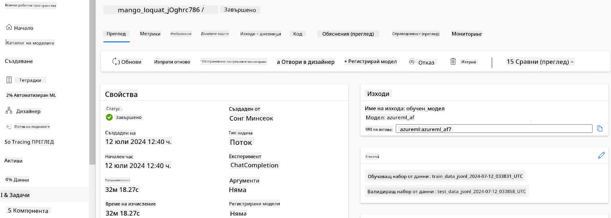

### Внедряване на фино нагласения модел Phi-3

За да интегрирате фино нагласения модел Phi-3 с Prompt flow, трябва да внедрите модела, за да го направите достъпен за извършване на реално време. Този процес включва регистрирането на модела, създаване на онлайн крайна точка (endpoint) и внедряването на модела.

В това упражнение ще:

- Регистрирате фино нагласения модел в работното пространство на Azure Machine Learning.
- Създадете онлайн крайна точка.
- Внедрите регистрирания фино нагласен модел Phi-3.

#### Регистриране на фино нагласения модел

1. Посетете [Azure ML Studio](https://ml.azure.com/home?wt.mc_id=studentamb_279723).

1. Изберете работното пространство на Azure Machine Learning, което сте създали.

    

1. Изберете **Models** от страничната лента.
1. Изберете **+ Register**.
1. Изберете **From a job output**.

    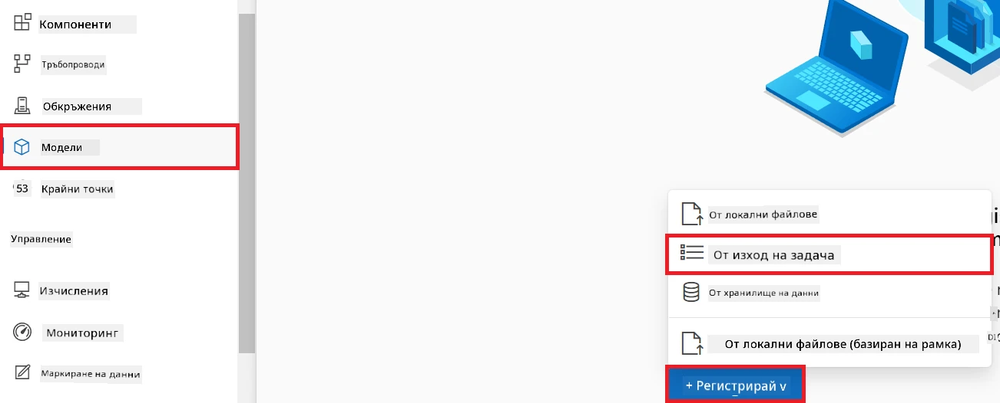

1. Изберете задачата, която сте създали.

    

1. Изберете **Next**.

1. Изберете **Model type** на **MLflow**.

1. Уверете се, че е избран **Job output**; той трябва да е избран автоматично.

    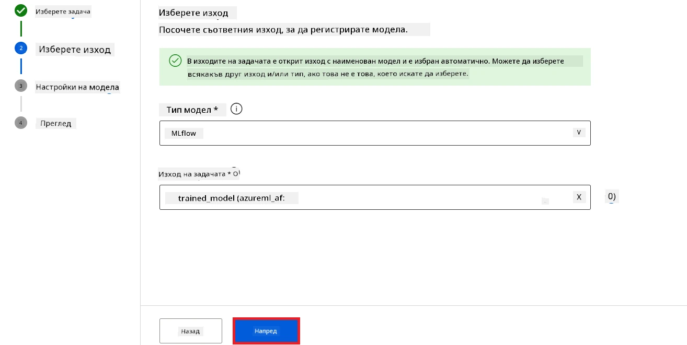

2. Изберете **Next**.

3. Изберете **Register**.

    

4. Можете да видите регистрирания си модел, като навигирате до менюто **Models** в страничната лента.

    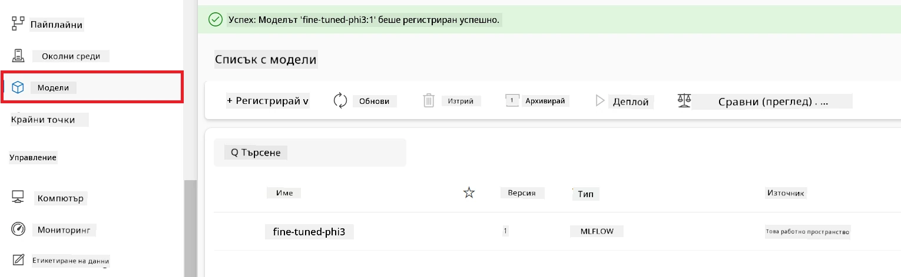

#### Внедряване на фино нагласения модел

1. Навигирайте до работното пространство на Azure Machine Learning, което сте създали.

1. Изберете **Endpoints** от страничната лента.

1. Изберете **Real-time endpoints** от навигационното меню.

    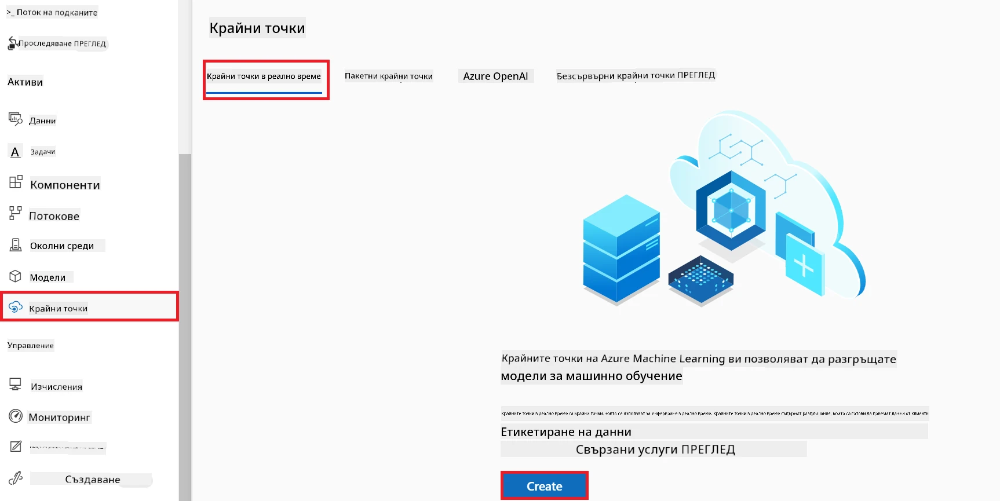

1. Изберете **Create**.

1. Изберете регистрирания модел, който сте създали.

    

1. Изберете **Select**.

1. Изпълнете следните стъпки:

    - Изберете **Virtual machine** на *Standard_NC6s_v3*.
    - Изберете броя на инстанциите, които искате да използвате. Например, *1*.
    - Изберете **Endpoint** на **New**, за да създадете крайна точка.
    - Въведете **Endpoint name**. Трябва да е уникална стойност.
    - Въведете **Deployment name**. Трябва да е уникална стойност.

    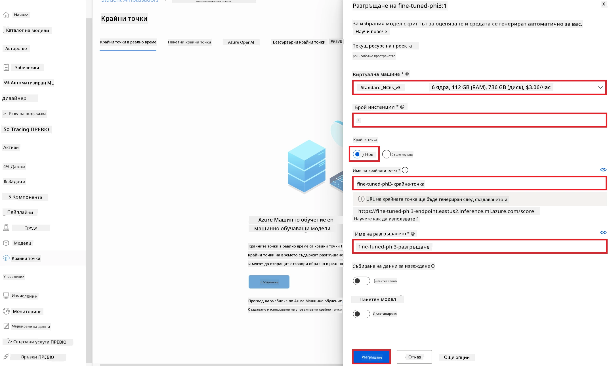

1. Изберете **Deploy**.

> [!WARNING]
> За да избегнете допълнителни такси по акаунта си, уверете се, че изтривате създадената крайна точка в работното пространство на Azure Machine Learning.
>

#### Проверка на състоянието на внедряване в Azure Machine Learning Workspace

1. Навигирайте до работното пространство на Azure Machine Learning, което сте създали.

1. Изберете **Endpoints** от страничната лента.

1. Изберете крайната точка, която сте създали.

    

1. На тази страница можете да управлявате крайните точки по време на процеса на внедряване.

> [!NOTE]
> След като внедряването приключи, уверете се, че **Live traffic** е настроен на **100%**. Ако не е, изберете **Update traffic**, за да коригирате настройките на трафика. Обърнете внимание, че не можете да тествате модела, ако трафикът е зададен на 0%.
>
> 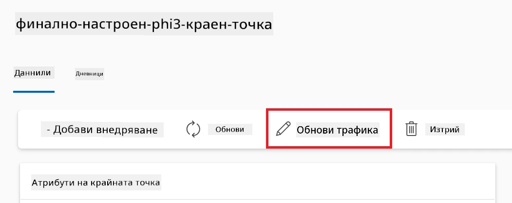
>

## Сценарий 3: Интеграция с Prompt flow и чат с вашия персонализиран модел в Azure AI Foundry

### Интегриране на персонализирания модел Phi-3 с Prompt flow

След като успешно внедрихте вашия фино нагласен модел, вече можете да го интегрирате с Prompt Flow, за да използвате модела си в приложения в реално време, което позволява разнообразни интерактивни задачи с персонализирания ви модел Phi-3.

В това упражнение ще:

- Създадете Azure AI Foundry Hub.
- Създадете Azure AI Foundry Project.
- Създадете Prompt flow.
- Добавите персонализирана връзка за фино нагласения модел Phi-3.
- Настроите Prompt flow за чат с вашия персонализиран модел Phi-3.

> [!NOTE]
> Можете също да интегрирате с Promptflow чрез Azure ML Studio. Същият процес на интеграция може да бъде приложен и в Azure ML Studio.

#### Създаване на Azure AI Foundry Hub

Трябва да създадете Hub, преди да създадете Project. Hub действа като Resource Group, позволявайки ви да организирате и управлявате множество проекти в Azure AI Foundry.

1. Посетете [Azure AI Foundry](https://ai.azure.com/?WT.mc_id=aiml-137032-kinfeylo).

1. Изберете **All hubs** от страничната лента.

1. Изберете **+ New hub** от навигационното меню.
    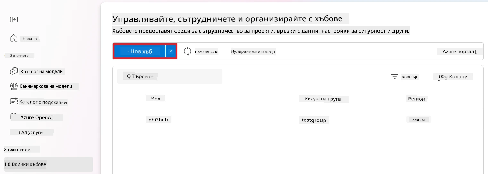

1. Изпълнете следните задачи:

    - Въведете **Име на Hub**. То трябва да е уникална стойност.
    - Изберете вашия Azure **Абонамент**.
    - Изберете **Група ресурси**, която ще използвате (създайте нова, ако е необходимо).
    - Изберете **Местоположение**, което искате да използвате.
    - Изберете **Свързване с Azure AI Services** за използване (създайте нов, ако е необходимо).
    - Изберете **Свързване с Azure AI Search** и задайте **Пропусни свързването**.

    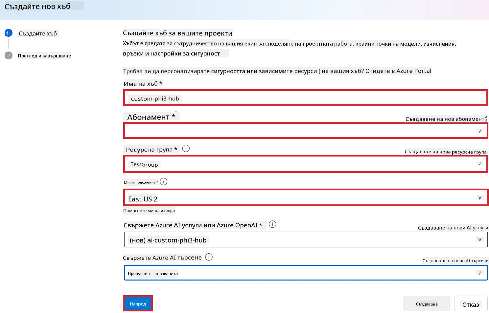

1. Изберете **Напред**.

#### Създаване на проект в Azure AI Foundry

1. В създадения от вас Hub изберете **Всички проекти** от страничната лента.

1. Изберете **+ Нов проект** от навигационното меню.

    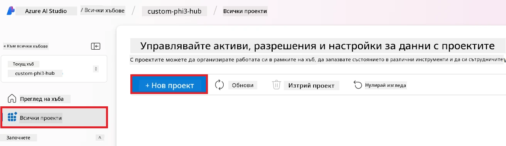

1. Въведете **Име на проект**. То трябва да е уникална стойност.

    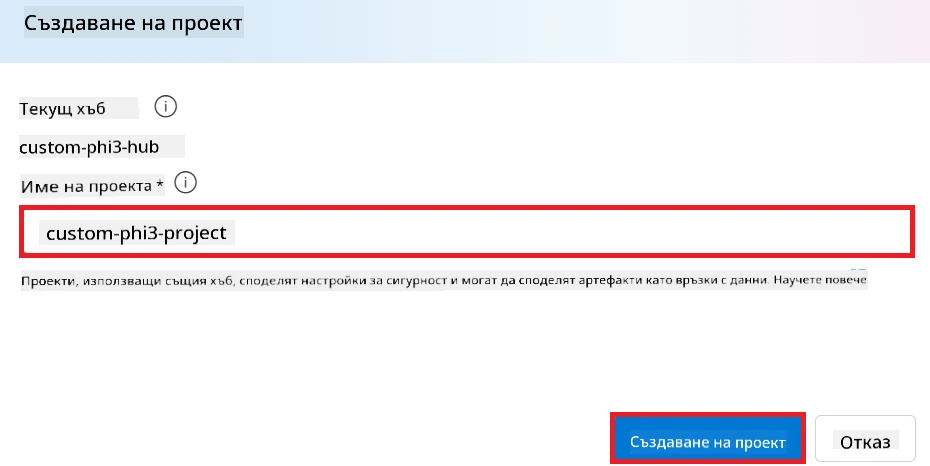

1. Изберете **Създаване на проект**.

#### Добавяне на потребителска връзка за модела Phi-3 с фина настройка

За да интегрирате вашия потребителски модел Phi-3 с Prompt flow, трябва да запазите крайна точка и ключ на модела в потребителска връзка. Тази настройка осигурява достъп до вашия потребителски модел Phi-3 в Prompt flow.

#### Настройване на api ключ и endpoint uri на фино настроения модел Phi-3

1. Посетете [Azure ML Studio](https://ml.azure.com/home?WT.mc_id=aiml-137032-kinfeylo).

1. Навигирайте до работното пространство Azure Machine learning, което сте създали.

1. Изберете **Endpoints** от страничната лента.

    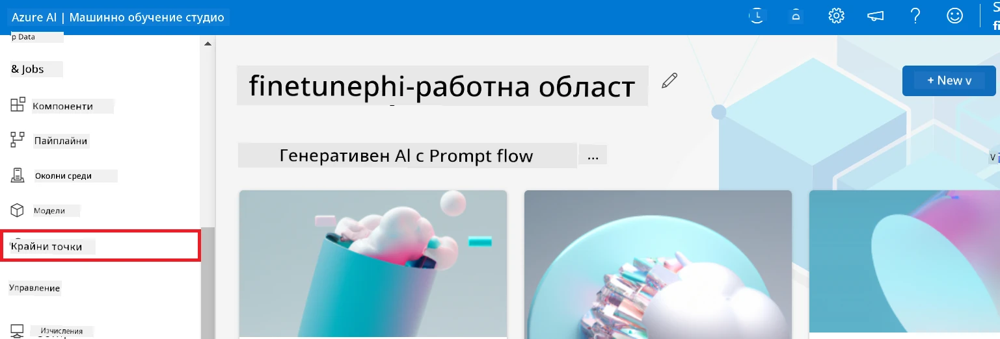

1. Изберете края точка, която сте създали.

    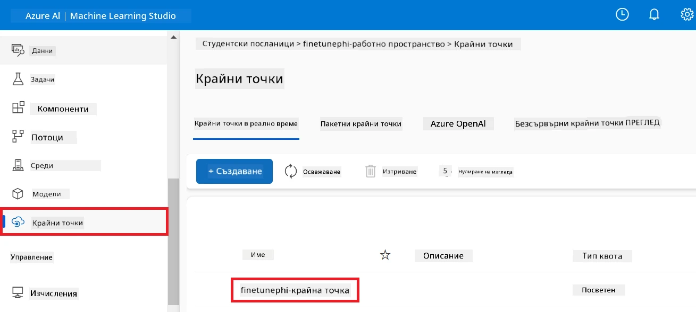

1. Изберете **Consume** от навигационното меню.

1. Копирайте вашия **REST endpoint** и **Основен ключ**.

    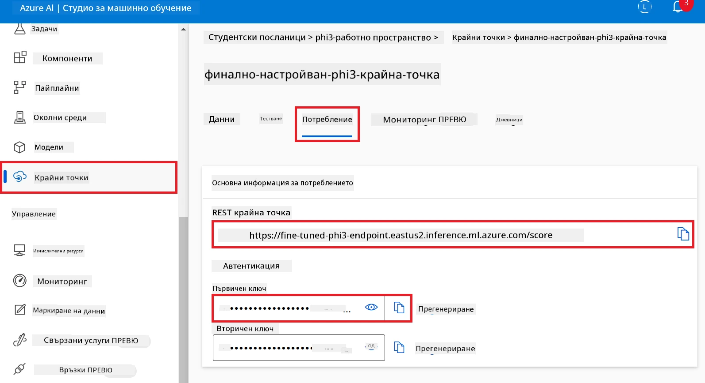

#### Добавяне на персонализираната връзка

1. Посетете [Azure AI Foundry](https://ai.azure.com/?WT.mc_id=aiml-137032-kinfeylo).

1. Навигирайте до проекта в Azure AI Foundry, който сте създали.

1. В проекта, който сте създали, изберете **Настройки** от страничната лента.

1. Изберете **+ Нова връзка**.

    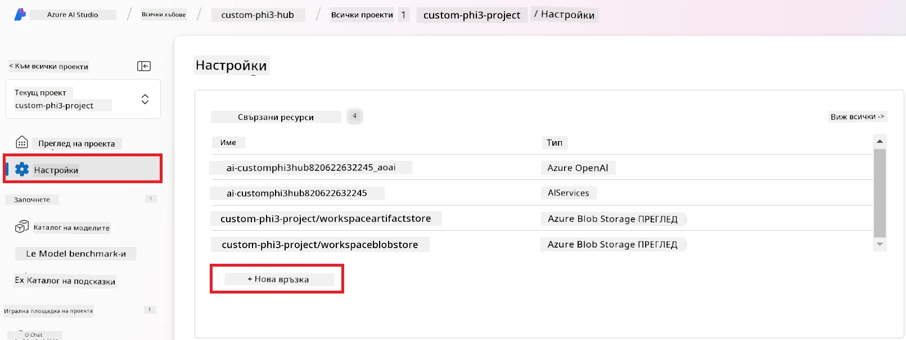

1. Изберете **Персонализирани ключове** от навигационното меню.

    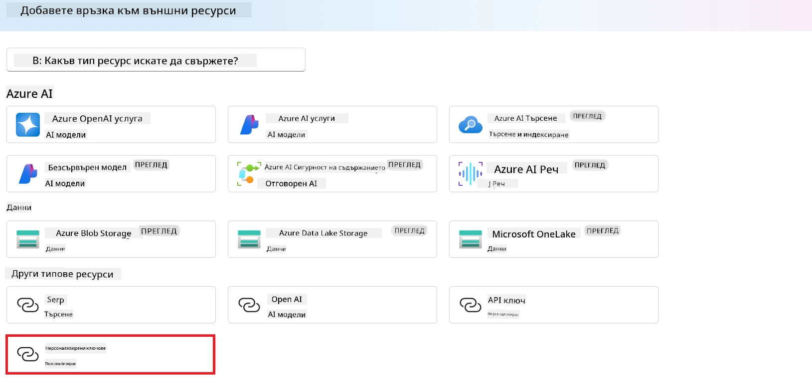

1. Изпълнете следните задачи:

    - Изберете **+ Добави двойки ключ-стойност**.
    - За името на ключ въведете **endpoint** и поставете крайна точка, която копирахте от Azure ML Studio, в полето за стойност.
    - Отново изберете **+ Добави двойки ключ-стойност**.
    - За името на ключ въведете **key** и поставете ключа, който копирахте от Azure ML Studio, в полето за стойност.
    - След добавянето на ключовете изберете **е секретен**, за да предотвратите излагане на ключа.

    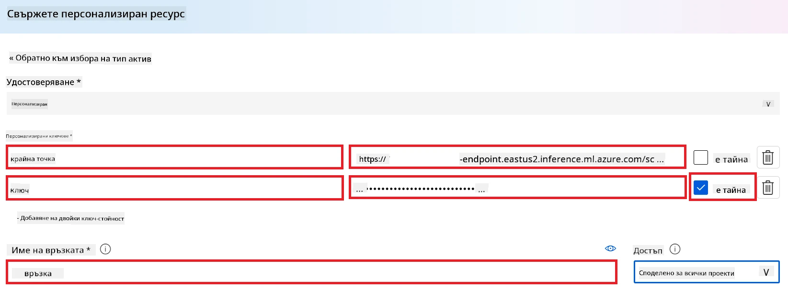

1. Изберете **Добави връзка**.

#### Създаване на Prompt flow

Вече сте добавили потребителска връзка в Azure AI Foundry. Сега нека създадем Prompt flow, като използваме следните стъпки. След това ще свържете този Prompt flow с потребителската връзка, за да можете да използвате фино настроения модел в Prompt flow.

1. Навигирайте до проекта в Azure AI Foundry, който сте създали.

1. Изберете **Prompt flow** от страничната лента.

1. Изберете **+ Създай** от навигационното меню.

    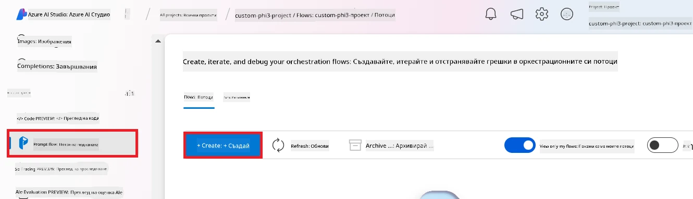

1. Изберете **Chat flow** от навигационното меню.

    

1. Въведете **Име на папка** за използване.

    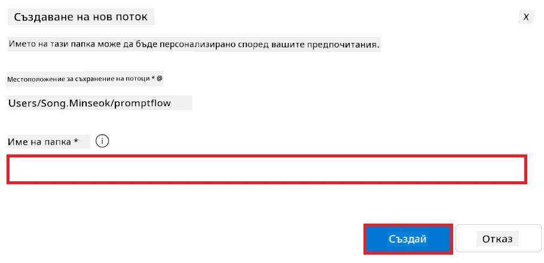

2. Изберете **Създай**.

#### Конфигуриране на Prompt flow за чат с вашия потребителски модел Phi-3

Трябва да интегрирате фино настроения модел Phi-3 в Prompt flow. Въпреки това, съществуващият предоставен Prompt flow не е предназначен за тази цел. Следователно трябва да преработите Prompt flow, за да позволите интегрирането на потребителския модел.

1. В Prompt flow изпълнете следните задачи, за да реконструирате съществуващия поток:

    - Изберете **Режим на суров файл**.
    - Изтрийте целия съществуващ код в файла *flow.dag.yml*.
    - Добавете следния код в файла *flow.dag.yml*.

        ```yml
        inputs:
          input_data:
            type: string
            default: "Who founded Microsoft?"

        outputs:
          answer:
            type: string
            reference: ${integrate_with_promptflow.output}

        nodes:
        - name: integrate_with_promptflow
          type: python
          source:
            type: code
            path: integrate_with_promptflow.py
          inputs:
            input_data: ${inputs.input_data}
        ```

    - Изберете **Запази**.

    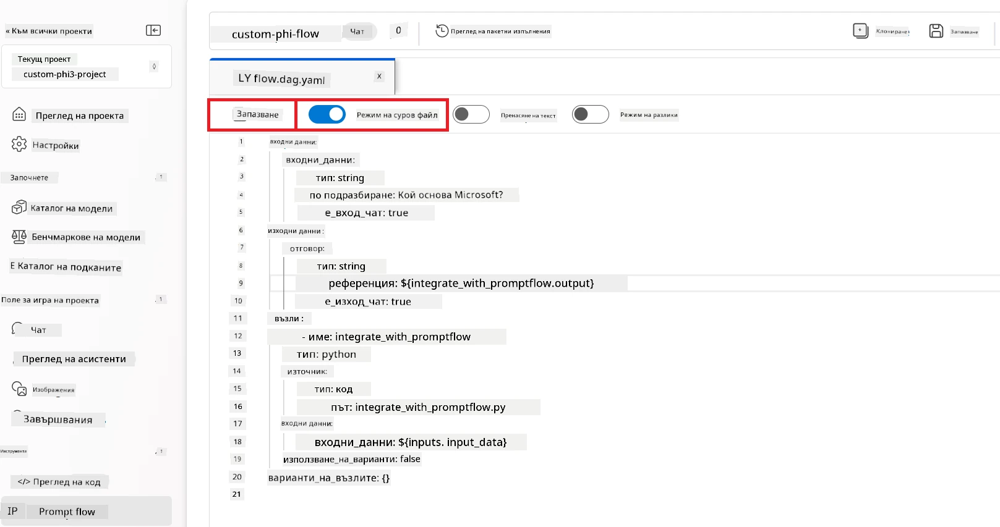

1. Добавете следния код във файла *integrate_with_promptflow.py*, за да използвате потребителския модел Phi-3 в Prompt flow.

    ```python
    import logging
    import requests
    from promptflow import tool
    from promptflow.connections import CustomConnection

    # Настройка на логването
    logging.basicConfig(
        format="%(asctime)s - %(levelname)s - %(name)s - %(message)s",
        datefmt="%Y-%m-%d %H:%M:%S",
        level=logging.DEBUG
    )
    logger = logging.getLogger(__name__)

    def query_phi3_model(input_data: str, connection: CustomConnection) -> str:
        """
        Send a request to the Phi-3 model endpoint with the given input data using Custom Connection.
        """

        # "connection" е името на Персонализираното свързване, "endpoint", "key" са ключовете в Персонализираното свързване
        endpoint_url = connection.endpoint
        api_key = connection.key

        headers = {
            "Content-Type": "application/json",
            "Authorization": f"Bearer {api_key}"
        }
        data = {
            "input_data": {
                "input_string": [
                    {"role": "user", "content": input_data}
                ],
                "parameters": {
                    "temperature": 0.7,
                    "max_new_tokens": 128
                }
            }
        }
        try:
            response = requests.post(endpoint_url, json=data, headers=headers)
            response.raise_for_status()
            
            # Запишете целия JSON отговор
            logger.debug(f"Full JSON response: {response.json()}")

            result = response.json()["output"]
            logger.info("Successfully received response from Azure ML Endpoint.")
            return result
        except requests.exceptions.RequestException as e:
            logger.error(f"Error querying Azure ML Endpoint: {e}")
            raise

    @tool
    def my_python_tool(input_data: str, connection: CustomConnection) -> str:
        """
        Tool function to process input data and query the Phi-3 model.
        """
        return query_phi3_model(input_data, connection)

    ```

    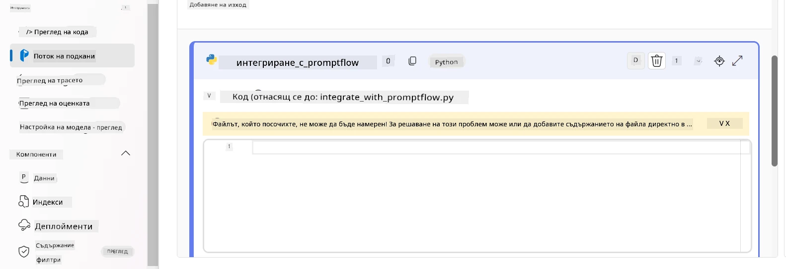

> [!NOTE]
> За по-подробна информация за използването на Prompt flow в Azure AI Foundry, можете да се обърнете към [Prompt flow в Azure AI Foundry](https://learn.microsoft.com/azure/ai-studio/how-to/prompt-flow).

1. Изберете **Вход за чат**, **Изход за чат**, за да разрешите чат с вашия модел.

    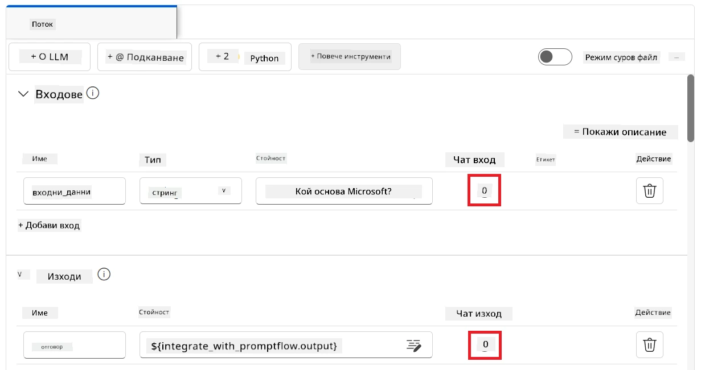

1. Сега сте готови да общувате с вашия потребителски модел Phi-3. В следващото упражнение ще научите как да стартирате Prompt flow и да го използвате за чат с вашия фино настроен модел Phi-3.

> [!NOTE]
>
> Реконструираният поток трябва да изглежда като изображението по-долу:
>
> 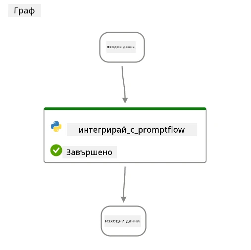
>

### Чат с вашия потребителски модел Phi-3

Сега, когато сте фино настроили и интегрирали вашия потребителски модел Phi-3 с Prompt flow, сте готови да започнете взаимодействие с него. Това упражнение ще ви преведе през процеса на настройване и иницииране на чат с вашия модел, използвайки Prompt flow. Следвайки тези стъпки, ще можете да използвате пълноценно възможностите на вашия фино настроен модел Phi-3 за различни задачи и разговори.

- Чат с вашия потребителски модел Phi-3, използвайки Prompt flow.

#### Стартиране на Prompt flow

1. Изберете **Стартирай изчислителни сесии**, за да стартирате Prompt flow.

    

1. Изберете **Потвърдете и анализирайте входа**, за да обновите параметрите.

    

1. Изберете **Стойност** на **връзката** към потребителската връзка, която сте създали. Например *connection*.

    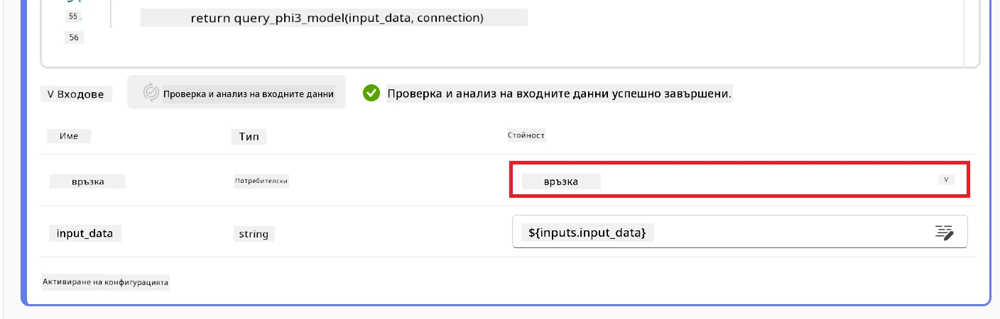

#### Чат с вашия потребителски модел

1. Изберете **Чат**.

    

1. Ето пример за резултатите: Сега можете да чатите с вашия персонализиран модел Phi-3. Препоръчва се да задавате въпроси, базирани на данните, използвани за фина настройка.

    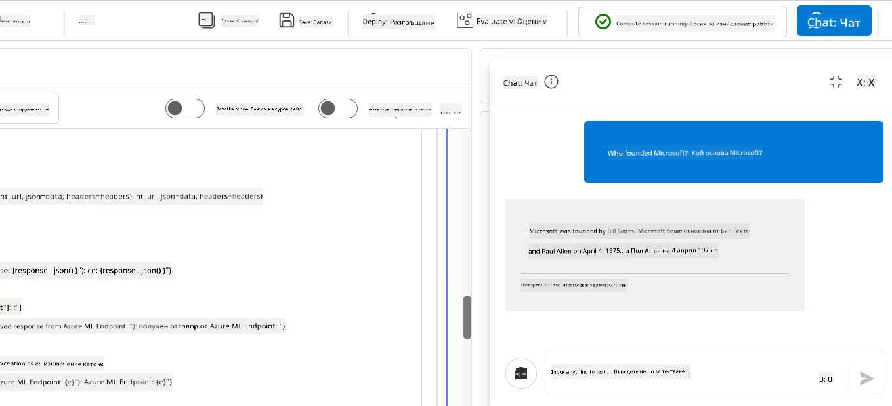

---

<!-- CO-OP TRANSLATOR DISCLAIMER START -->
**Отказ от отговорност**:  
Този документ е преведен с помощта на AI преводаческа услуга [Co-op Translator](https://github.com/Azure/co-op-translator). Въпреки че се стремим към точност, моля, имайте предвид, че автоматизираните преводи могат да съдържат грешки или неточности. Оригиналният документ на неговия роден език трябва да се счита за авторитетен източник. За критична информация се препоръчва професионален човешки превод. Ние не носим отговорност за каквито и да било недоразумения или неправилни тълкувания, произтичащи от използването на този превод.
<!-- CO-OP TRANSLATOR DISCLAIMER END -->