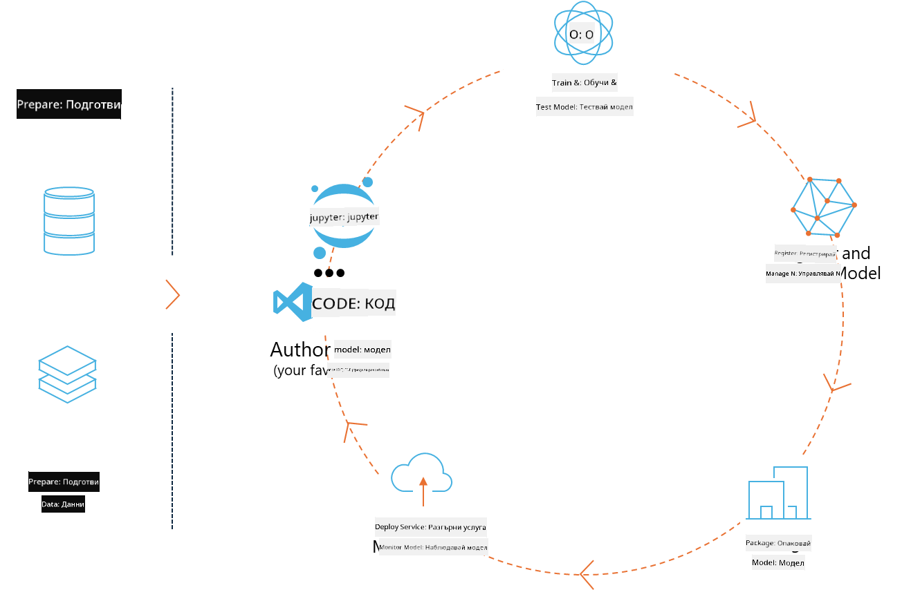
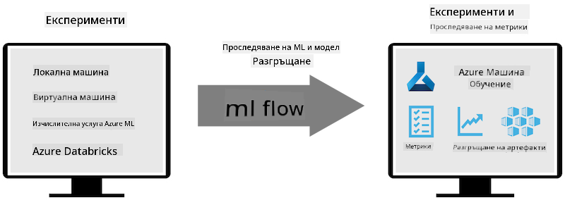
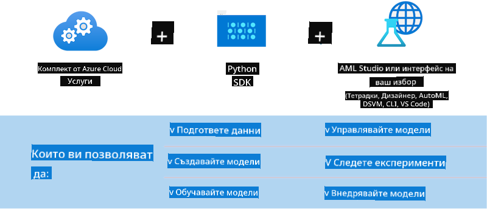

<!--
CO_OP_TRANSLATOR_METADATA:
{
  "original_hash": "f61c383bbf0c3dac97e43f833c258731",
  "translation_date": "2025-05-09T18:40:53+00:00",
  "source_file": "md/02.Application/01.TextAndChat/Phi3/E2E_Phi-3-MLflow.md",
  "language_code": "bg"
}
-->
# MLflow

[MLflow](https://mlflow.org/) е платформа с отворен код, създадена за управление на целия жизнен цикъл на машинното обучение.



MLFlow се използва за управление на жизнения цикъл на ML, включително експериментиране, възпроизводимост, внедряване и централен регистър на модели. В момента MLflow предлага четири компонента.

- **MLflow Tracking:** Записва и извлича експерименти, код, конфигурация на данни и резултати.
- **MLflow Projects:** Опакова кода за наука с данни във формат, който позволява възпроизводимост на изпълненията на всяка платформа.
- **Mlflow Models:** Внедрява модели за машинно обучение в различни среди за обслужване.
- **Model Registry:** Съхранява, анотира и управлява модели в централен хранилище.

Той включва възможности за проследяване на експерименти, опаковане на код в изпълними и възпроизводими форми, както и споделяне и внедряване на модели. MLFlow е интегриран в Databricks и поддържа различни ML библиотеки, като е независим от конкретна библиотека. Може да се използва с всяка библиотека за машинно обучение и на всеки програмен език, тъй като предоставя REST API и CLI за удобство.



Основните характеристики на MLFlow включват:

- **Проследяване на експерименти:** Записване и сравняване на параметри и резултати.
- **Управление на модели:** Внедряване на модели в различни платформи за обслужване и извеждане на изводи.
- **Model Registry:** Съвместно управление на жизнения цикъл на MLflow модели, включително версии и анотации.
- **Проекти:** Опаковане на ML код за споделяне или използване в продукция.
MLFlow също така поддържа MLOps цикъл, който включва подготовка на данни, регистриране и управление на модели, опаковане на модели за изпълнение, внедряване на услуги и наблюдение на модели. Целта е да се улесни преминаването от прототип към продукционен работен процес, особено в облачни и edge среди.

## E2E сценарий - Създаване на обвивка и използване на Phi-3 като MLFlow модел

В този E2E пример ще демонстрираме два различни подхода за създаване на обвивка около малкия езиков модел Phi-3 (SLM) и след това изпълнението му като MLFlow модел локално или в облака, например в Azure Machine Learning workspace.



| Проект | Описание | Местоположение |
| ------------ | ----------- | -------- |
| Transformer Pipeline | Transformer Pipeline е най-лесният вариант за създаване на обвивка, ако искате да използвате HuggingFace модел с експерименталния transformers flavour на MLFlow. | [**TransformerPipeline.ipynb**](../../../../../../code/06.E2E/E2E_Phi-3-MLflow_TransformerPipeline.ipynb) |
| Custom Python Wrapper | Към момента на писане, transformer pipeline не поддържа генериране на MLFlow обвивка за HuggingFace модели в ONNX формат, дори с експерименталния пакет optimum за Python. В такива случаи може да създадете собствен Python wrapper за MLFlow модел. | [**CustomPythonWrapper.ipynb**](../../../../../../code/06.E2E/E2E_Phi-3-MLflow_CustomPythonWrapper.ipynb) |

## Проект: Transformer Pipeline

1. Ще са ви необходими съответните Python пакети от MLFlow и HuggingFace:

    ``` Python
    import mlflow
    import transformers
    ```

2. След това трябва да инициализирате transformer pipeline, като посочите целевия модел Phi-3 в HuggingFace регистъра. Както се вижда от картата на модела _Phi-3-mini-4k-instruct_, задачата му е от тип „Генериране на текст“:

    ``` Python
    pipeline = transformers.pipeline(
        task = "text-generation",
        model = "microsoft/Phi-3-mini-4k-instruct"
    )
    ```

3. Сега можете да запазите transformer pipeline на Phi-3 модела в MLFlow формат и да предоставите допълнителни детайли като път до артефакти, специфични настройки на модела и тип inference API:

    ``` Python
    model_info = mlflow.transformers.log_model(
        transformers_model = pipeline,
        artifact_path = "phi3-mlflow-model",
        model_config = model_config,
        task = "llm/v1/chat"
    )
    ```

## Проект: Custom Python Wrapper

1. Тук можем да използваме [ONNX Runtime generate() API](https://github.com/microsoft/onnxruntime-genai) на Microsoft за извеждане на изводи и кодиране/декодиране на токени за ONNX модела. Трябва да изберете пакета _onnxruntime_genai_ за целевата изчислителна среда, като примерът по-долу е за CPU:

    ``` Python
    import mlflow
    from mlflow.models import infer_signature
    import onnxruntime_genai as og
    ```

1. Нашият персонализиран клас имплементира два метода: _load_context()_ за инициализиране на **ONNX модела** Phi-3 Mini 4K Instruct, **параметрите на генератора** и **tokenizer**; и _predict()_ за генериране на изходни токени за подадения prompt:

    ``` Python
    class Phi3Model(mlflow.pyfunc.PythonModel):
        def load_context(self, context):
            # Retrieving model from the artifacts
            model_path = context.artifacts["phi3-mini-onnx"]
            model_options = {
                 "max_length": 300,
                 "temperature": 0.2,         
            }
        
            # Defining the model
            self.phi3_model = og.Model(model_path)
            self.params = og.GeneratorParams(self.phi3_model)
            self.params.set_search_options(**model_options)
            
            # Defining the tokenizer
            self.tokenizer = og.Tokenizer(self.phi3_model)
    
        def predict(self, context, model_input):
            # Retrieving prompt from the input
            prompt = model_input["prompt"][0]
            self.params.input_ids = self.tokenizer.encode(prompt)
    
            # Generating the model's response
            response = self.phi3_model.generate(self.params)
    
            return self.tokenizer.decode(response[0][len(self.params.input_ids):])
    ```

1. Сега можете да използвате функцията _mlflow.pyfunc.log_model()_ за създаване на персонализиран Python wrapper (в pickle формат) за модела Phi-3, заедно с оригиналния ONNX модел и необходимите зависимости:

    ``` Python
    model_info = mlflow.pyfunc.log_model(
        artifact_path = artifact_path,
        python_model = Phi3Model(),
        artifacts = {
            "phi3-mini-onnx": "cpu_and_mobile/cpu-int4-rtn-block-32-acc-level-4",
        },
        input_example = input_example,
        signature = infer_signature(input_example, ["Run"]),
        extra_pip_requirements = ["torch", "onnxruntime_genai", "numpy"],
    )
    ```

## Подписи на генерираните MLFlow модели

1. В стъпка 3 от проекта Transformer Pipeline по-горе, зададохме задачата на MLFlow модела като „_llm/v1/chat_“. Тази инструкция генерира API обвивка на модела, съвместима с OpenAI Chat API, както е показано по-долу:

    ``` Python
    {inputs: 
      ['messages': Array({content: string (required), name: string (optional), role: string (required)}) (required), 'temperature': double (optional), 'max_tokens': long (optional), 'stop': Array(string) (optional), 'n': long (optional), 'stream': boolean (optional)],
    outputs: 
      ['id': string (required), 'object': string (required), 'created': long (required), 'model': string (required), 'choices': Array({finish_reason: string (required), index: long (required), message: {content: string (required), name: string (optional), role: string (required)} (required)}) (required), 'usage': {completion_tokens: long (required), prompt_tokens: long (required), total_tokens: long (required)} (required)],
    params: 
      None}
    ```

1. В резултат можете да изпратите своя prompt в следния формат:

    ``` Python
    messages = [{"role": "user", "content": "What is the capital of Spain?"}]
    ```

1. След това използвайте post-processing съвместим с OpenAI API, например _response[0][‘choices’][0][‘message’][‘content’]_, за да форматирате изхода си по следния начин:

    ``` JSON
    Question: What is the capital of Spain?
    
    Answer: The capital of Spain is Madrid. It is the largest city in Spain and serves as the political, economic, and cultural center of the country. Madrid is located in the center of the Iberian Peninsula and is known for its rich history, art, and architecture, including the Royal Palace, the Prado Museum, and the Plaza Mayor.
    
    Usage: {'prompt_tokens': 11, 'completion_tokens': 73, 'total_tokens': 84}
    ```

1. В стъпка 3 от проекта Custom Python Wrapper по-горе, позволяваме на MLFlow пакета да генерира подписа на модела от даден примерен вход. Подписът на нашия MLFlow wrapper ще изглежда така:

    ``` Python
    {inputs: 
      ['prompt': string (required)],
    outputs: 
      [string (required)],
    params: 
      None}
    ```

1. Следователно, нашият prompt трябва да съдържа ключ „prompt“ в речника, подобно на това:

    ``` Python
    {"prompt": "<|system|>You are a stand-up comedian.<|end|><|user|>Tell me a joke about atom<|end|><|assistant|>",}
    ```

1. Изходът на модела ще бъде предоставен след това като низ:

    ``` JSON
    Alright, here's a little atom-related joke for you!
    
    Why don't electrons ever play hide and seek with protons?
    
    Because good luck finding them when they're always "sharing" their electrons!
    
    Remember, this is all in good fun, and we're just having a little atomic-level humor!
    ```

**Отказ от отговорност**:  
Този документ е преведен с помощта на AI преводаческа услуга [Co-op Translator](https://github.com/Azure/co-op-translator). Въпреки че се стремим към точност, моля, имайте предвид, че автоматизираните преводи могат да съдържат грешки или неточности. Оригиналният документ на неговия роден език трябва да се счита за авторитетен източник. За критична информация се препоръчва професионален човешки превод. Ние не носим отговорност за каквито и да е недоразумения или неправилни тълкувания, произтичащи от използването на този превод.