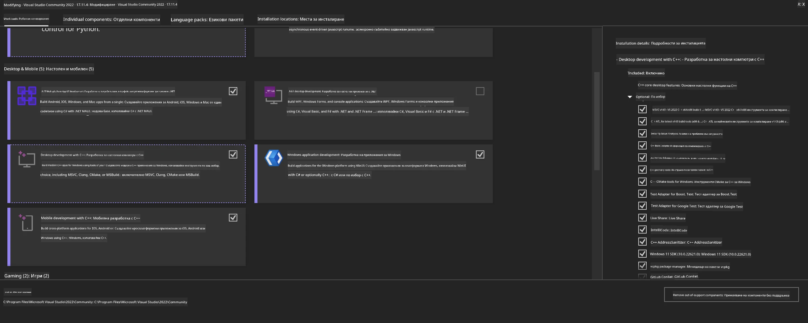
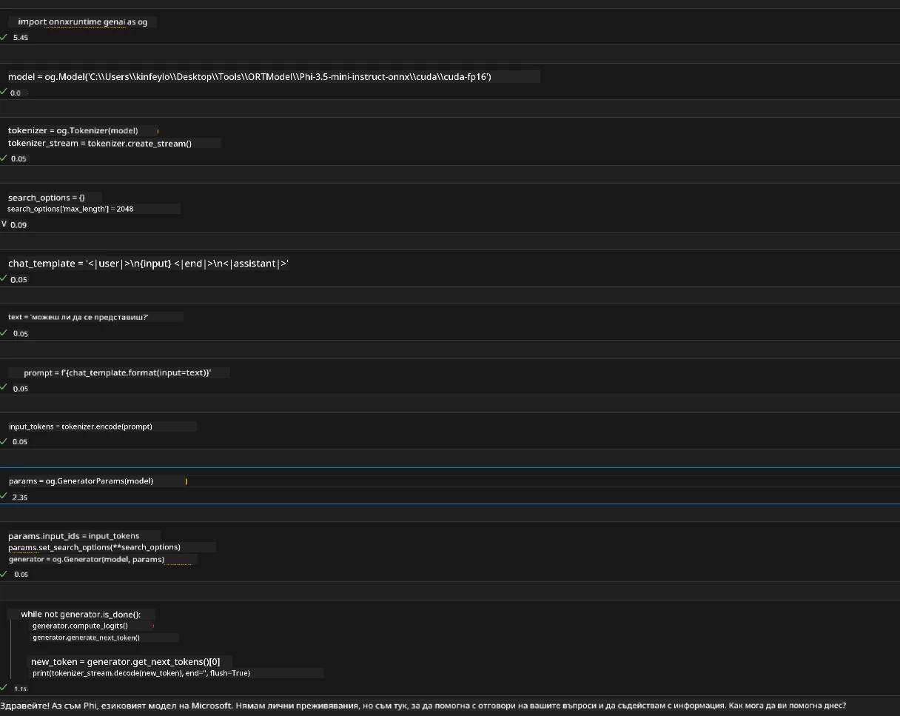
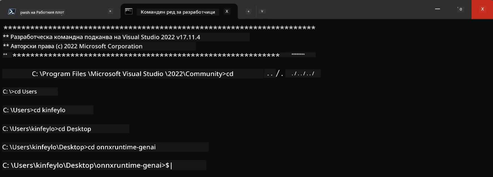

# **Ръководство за OnnxRuntime GenAI Windows GPU**

Това ръководство предоставя стъпки за настройка и използване на ONNX Runtime (ORT) с GPU на Windows. То е създадено, за да ви помогне да използвате ускорение с GPU за вашите модели, подобрявайки производителността и ефективността.

Документът предоставя насоки относно:

- Настройка на средата: Инструкции за инсталиране на необходими зависимости като CUDA, cuDNN и ONNX Runtime.
- Конфигурация: Как да конфигурирате средата и ONNX Runtime за ефективно използване на GPU ресурсите.
- Съвети за оптимизация: Съвети за настройка на GPU за оптимална производителност.

### **1. Python 3.10.x /3.11.8**

   ***Бележка*** Препоръчва се използването на [miniforge](https://github.com/conda-forge/miniforge/releases/latest/download/Miniforge3-Windows-x86_64.exe) като вашата Python среда

   ```bash

   conda create -n pydev python==3.11.8

   conda activate pydev

   ```

   ***Напомняне*** Ако имате инсталирани каквито и да е Python ONNX библиотеки, моля деинсталирайте ги

### **2. Инсталиране на CMake с winget**


   ```bash

   winget install -e --id Kitware.CMake

   ```

### **3. Инсталиране на Visual Studio 2022 - Desktop Development with C++**

   ***Бележка*** Ако не искате да компилирате, можете да пропуснете тази стъпка




### **4. Инсталиране на NVIDIA драйвер**

1. **NVIDIA GPU драйвер**  [https://www.nvidia.com/en-us/drivers/](https://www.nvidia.com/en-us/drivers/)

2. **NVIDIA CUDA 12.4** [https://developer.nvidia.com/cuda-12-4-0-download-archive](https://developer.nvidia.com/cuda-12-4-0-download-archive)

3. **NVIDIA CUDNN 9.4**  [https://developer.nvidia.com/cudnn-downloads](https://developer.nvidia.com/cudnn-downloads)

***Напомняне*** Моля използвайте подразбиращите се настройки при инсталационния процес

### **5. Настройка на NVIDIA среда**

Копирайте NVIDIA CUDNN 9.4 lib, bin, include в папките на NVIDIA CUDA 12.4 lib, bin, include

- копирайте файловете от *'C:\Program Files\NVIDIA\CUDNN\v9.4\bin\12.6'* в *'C:\Program Files\NVIDIA GPU Computing Toolkit\CUDA\v12.4\bin'*

- копирайте файловете от *'C:\Program Files\NVIDIA\CUDNN\v9.4\include\12.6'* в *'C:\Program Files\NVIDIA GPU Computing Toolkit\CUDA\v12.4\include'*

- копирайте файловете от *'C:\Program Files\NVIDIA\CUDNN\v9.4\lib\12.6'* в *'C:\Program Files\NVIDIA GPU Computing Toolkit\CUDA\v12.4\lib\x64'*


### **6. Изтегляне на Phi-3.5-mini-instruct-onnx**


   ```bash

   winget install -e --id Git.Git

   winget install -e --id GitHub.GitLFS

   git lfs install

   git clone https://huggingface.co/microsoft/Phi-3.5-mini-instruct-onnx

   ```

### **7. Стартиране на InferencePhi35Instruct.ipynb**

   Отворете [Notebook](../../../../code/09.UpdateSamples/Aug/ortgpu-phi35-instruct.ipynb) и изпълнете 





### **8. Компилиране на ORT GenAI GPU**


   ***Бележка*** 
   
   1. Моля първо деинсталирайте всички onnx, onnxruntime и onnxruntime-genai библиотеки

   
   ```bash

   pip list 
   
   ```

   След това деинсталирайте всички onnxruntime библиотеки, т.е. 


   ```bash

   pip uninstall onnxruntime

   pip uninstall onnxruntime-genai

   pip uninstall onnxruntume-genai-cuda
   
   ```

   2. Проверете поддръжката на Visual Studio Extension

   Проверете в C:\Program Files\NVIDIA GPU Computing Toolkit\CUDA\v12.4\extras дали съществува папка C:\Program Files\NVIDIA GPU Computing Toolkit\CUDA\v12.4\extras\visual_studio_integration.
   
   Ако не е намерена, проверете в другите папки на CUDA toolkit драйвера и копирайте папката visual_studio_integration с цялото ѝ съдържание в C:\Program Files\NVIDIA GPU Computing Toolkit\CUDA\v12.4\extras\visual_studio_integration


   - Ако не искате да компилирате, можете да пропуснете тази стъпка


   ```bash

   git clone https://github.com/microsoft/onnxruntime-genai

   ```

   - Изтеглете [https://github.com/microsoft/onnxruntime/releases/download/v1.19.2/onnxruntime-win-x64-gpu-1.19.2.zip](https://github.com/microsoft/onnxruntime/releases/download/v1.19.2/onnxruntime-win-x64-gpu-1.19.2.zip)

   - Разархивирайте onnxruntime-win-x64-gpu-1.19.2.zip и го преименувайте на **ort**, копирайте папката ort в onnxruntime-genai

   - С помощта на Windows Terminal отидете в Developer Command Prompt за VS 2022 и навигирайте до onnxruntime-genai 



   - Компилирайте го с вашата Python среда

   
   ```bash

   cd onnxruntime-genai

   python build.py --use_cuda  --cuda_home "C:\Program Files\NVIDIA GPU Computing Toolkit\CUDA\v12.4" --config Release
 

   cd build/Windows/Release/Wheel

   pip install .whl

   ```

---

<!-- CO-OP TRANSLATOR DISCLAIMER START -->
**Отказ от отговорност**:
Този документ е преведен с помощта на AI преводачески услуга [Co-op Translator](https://github.com/Azure/co-op-translator). Въпреки че се стремим към точност, моля имайте предвид, че автоматизираните преводи могат да съдържат грешки или неточности. Оригиналният документ на неговия роден език трябва да се счита за авторитетен източник. За критична информация се препоръчва професионален човешки превод. Ние не носим отговорност за каквито и да е недоразумения или неправилни тълкувания, произтичащи от използването на този превод.
<!-- CO-OP TRANSLATOR DISCLAIMER END -->