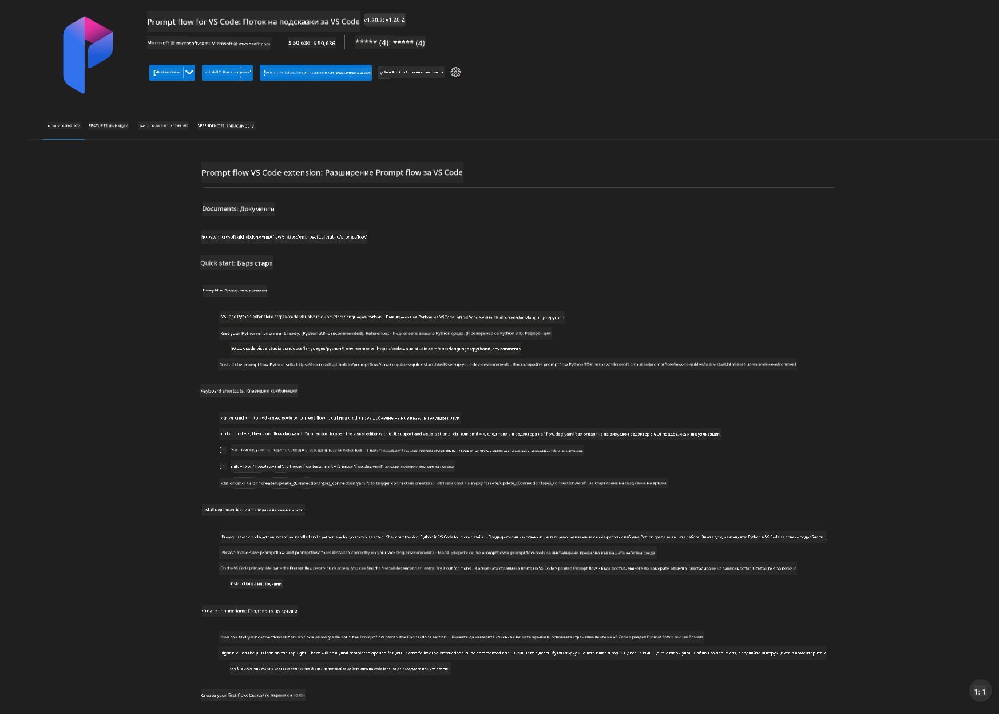
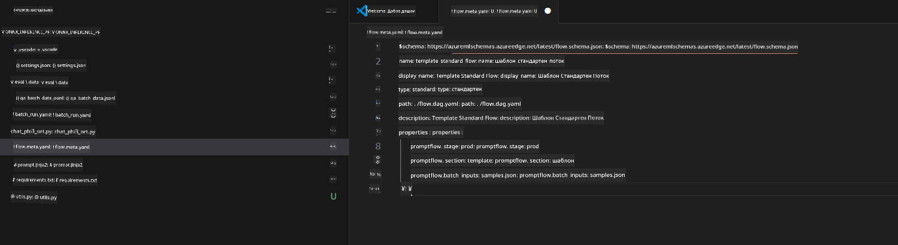
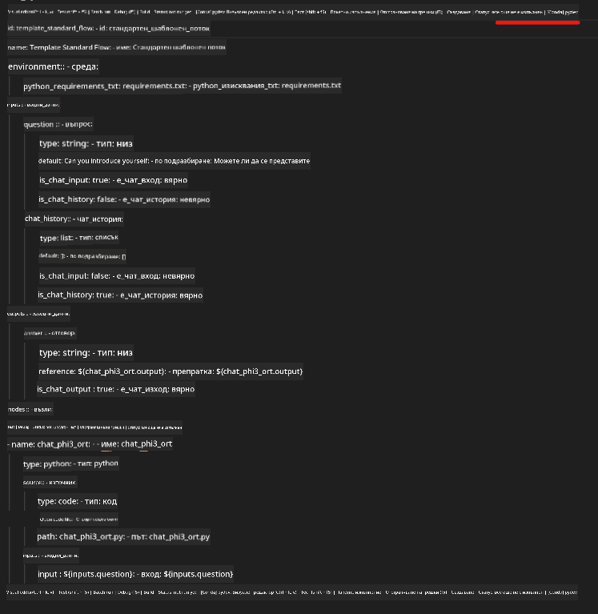
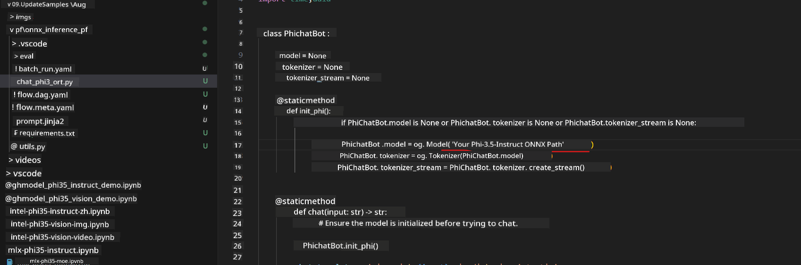
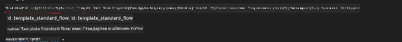
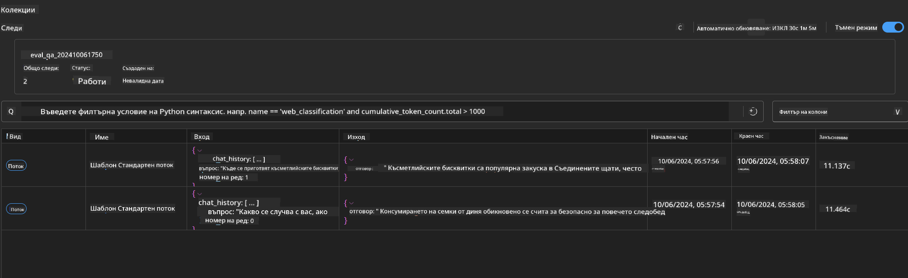

<!--
CO_OP_TRANSLATOR_METADATA:
{
  "original_hash": "92e7dac1e5af0dd7c94170fdaf6860fe",
  "translation_date": "2025-07-17T03:03:48+00:00",
  "source_file": "md/02.Application/01.TextAndChat/Phi3/UsingPromptFlowWithONNX.md",
  "language_code": "bg"
}
-->
# Използване на Windows GPU за създаване на Prompt flow решение с Phi-3.5-Instruct ONNX

Следният документ е пример за това как да използвате PromptFlow с ONNX (Open Neural Network Exchange) за разработка на AI приложения, базирани на Phi-3 модели.

PromptFlow е набор от инструменти за разработка, предназначени да улеснят целия цикъл на разработка на AI приложения, базирани на LLM (Large Language Model), от идеята и прототипирането до тестването и оценката.

Чрез интегриране на PromptFlow с ONNX, разработчиците могат да:

- Оптимизират производителността на модела: Използвайте ONNX за ефективно изпълнение и внедряване на модела.
- Опростят разработката: Използвайте PromptFlow за управление на работния процес и автоматизиране на повтарящи се задачи.
- Подобрят сътрудничеството: Улесняват по-добрата комуникация между членовете на екипа чрез предоставяне на единна среда за разработка.

**Prompt flow** е набор от инструменти за разработка, създаден да улесни целия цикъл на разработка на AI приложения, базирани на LLM, от идеята, прототипирането, тестването, оценката до внедряване в продукция и мониторинг. Той прави инженерството на prompt-ове много по-лесно и ви позволява да създавате LLM приложения с качество за продукция.

Prompt flow може да се свърже с OpenAI, Azure OpenAI Service и персонализирани модели (Huggingface, локални LLM/SLM). Надяваме се да внедрим квантования ONNX модел на Phi-3.5 в локални приложения. Prompt flow може да ни помогне по-добре да планираме бизнеса си и да завършим локални решения, базирани на Phi-3.5. В този пример ще комбинираме ONNX Runtime GenAI Library, за да завършим Prompt flow решение, базирано на Windows GPU.

## **Инсталация**

### **ONNX Runtime GenAI за Windows GPU**

Прочетете това ръководство за настройка на ONNX Runtime GenAI за Windows GPU [кликнете тук](./ORTWindowGPUGuideline.md)

### **Настройка на Prompt flow във VSCode**

1. Инсталирайте Prompt flow разширението за VS Code



2. След инсталиране на Prompt flow разширението за VS Code, кликнете върху разширението и изберете **Installation dependencies**, следвайте това ръководство, за да инсталирате Prompt flow SDK във вашата среда


3. Изтеглете [примерния код](../../../../../../code/09.UpdateSamples/Aug/pf/onnx_inference_pf) и го отворете с VS Code



4. Отворете **flow.dag.yaml**, за да изберете вашата Python среда



   Отворете **chat_phi3_ort.py**, за да промените местоположението на вашия Phi-3.5-instruct ONNX модел



5. Стартирайте вашия prompt flow за тестване

Отворете **flow.dag.yaml** и кликнете върху визуалния редактор



след това кликнете и го стартирайте за тест


1. Можете да стартирате batch в терминала, за да проверите повече резултати


```bash

pf run create --file batch_run.yaml --stream --name 'Your eval qa name'    

```

Можете да видите резултатите в браузъра по подразбиране




**Отказ от отговорност**:  
Този документ е преведен с помощта на AI преводаческа услуга [Co-op Translator](https://github.com/Azure/co-op-translator). Въпреки че се стремим към точност, моля, имайте предвид, че автоматизираните преводи могат да съдържат грешки или неточности. Оригиналният документ на неговия роден език трябва да се счита за авторитетен източник. За критична информация се препоръчва професионален човешки превод. Ние не носим отговорност за каквито и да е недоразумения или неправилни тълкувания, произтичащи от използването на този превод.