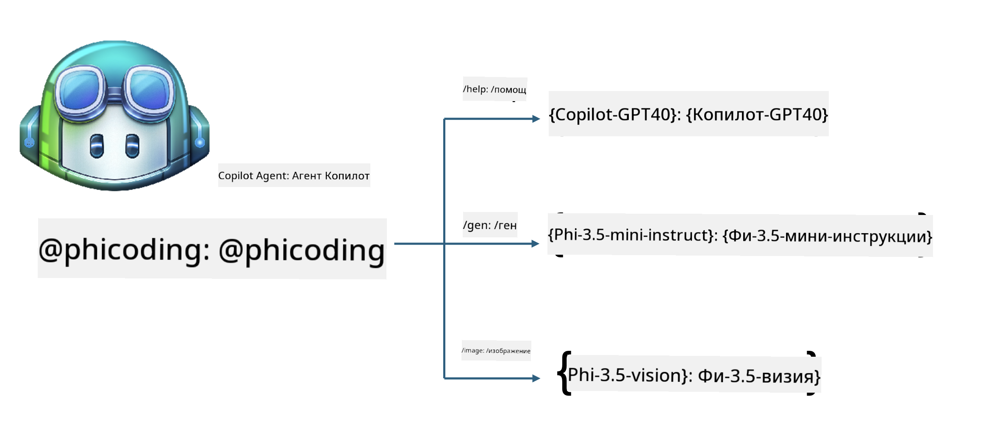
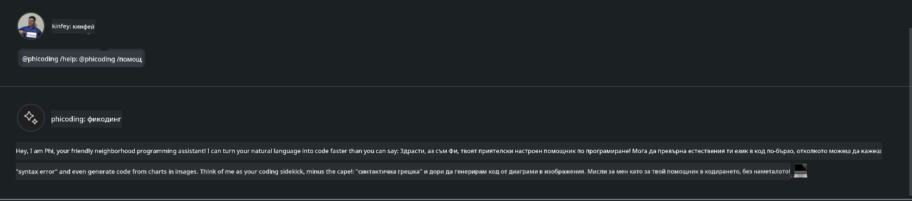
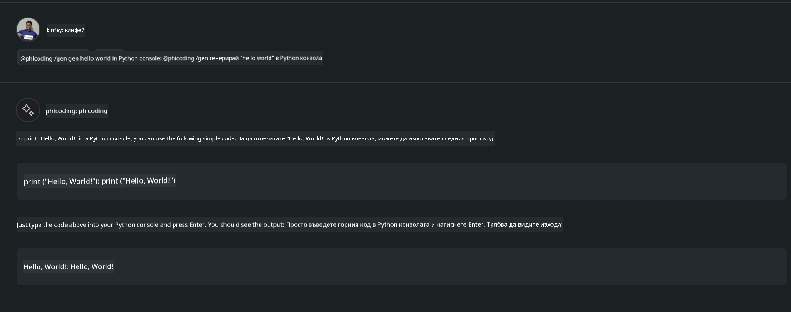

<!--
CO_OP_TRANSLATOR_METADATA:
{
  "original_hash": "35bf81388ac6917277b8d9a0c39bdc70",
  "translation_date": "2025-07-17T03:30:27+00:00",
  "source_file": "md/02.Application/02.Code/Phi3/CreateVSCodeChatAgentWithGitHubModels.md",
  "language_code": "bg"
}
-->
# **Създайте свой собствен Visual Studio Code Chat Copilot агент с Phi-3.5 от GitHub Models**

Използвате ли Visual Studio Code Copilot? Особено в Chat, можете да използвате различни агенти, за да подобрите възможностите за създаване, писане и поддръжка на проекти във Visual Studio Code. Visual Studio Code предоставя API, който позволява на компании и индивидуални разработчици да създават различни агенти, базирани на техния бизнес, за да разширят възможностите си в различни специализирани области. В тази статия ще се фокусираме върху **Phi-3.5-mini-instruct (128k)** и **Phi-3.5-vision-instruct (128k)** от GitHub Models, за да създадем собствен Visual Studio Code агент.

## **За Phi-3.5 в GitHub Models**

Знаем, че Phi-3/3.5-mini-instruct от семейството Phi-3/3.5 има силни възможности за разбиране и генериране на код и превъзхожда Gemma-2-9b и Mistral-Nemo-12B-instruct-2407.


Последните GitHub Models вече предоставят достъп до моделите Phi-3.5-mini-instruct (128k) и Phi-3.5-vision-instruct (128k). Разработчиците могат да ги използват чрез OpenAI SDK, Azure AI Inference SDK и REST API.


***Note: *** Препоръчително е да използвате Azure AI Inference SDK тук, тъй като той по-добре се интегрира с Azure Model Catalog в продукционна среда.

По-долу са резултатите от **Phi-3.5-mini-instruct (128k)** и **Phi-3.5-vision-instruct (128k)** в сценарий за генериране на код след интеграция с GitHub Models, както и подготовка за следващите примери.

**Демо: GitHub Models Phi-3.5-mini-instruct (128k) генерира код от Prompt** ([кликнете тук](../../../../../../code/09.UpdateSamples/Aug/ghmodel_phi35_instruct_demo.ipynb))

**Демо: GitHub Models Phi-3.5-vision-instruct (128k) генерира код от изображение** ([кликнете тук](../../../../../../code/09.UpdateSamples/Aug/ghmodel_phi35_vision_demo.ipynb))


## **За GitHub Copilot Chat Agent**

GitHub Copilot Chat Agent може да изпълнява различни задачи в различни проектни сценарии, базирани на кода. Системата разполага с четири агента: workspace, github, terminal, vscode


Като добавите името на агента с ‘@’, можете бързо да изпълните съответната задача. За предприятия, ако добавите бизнес-свързано съдържание като изисквания, кодиране, тестови спецификации и релийзи, можете да имате по-мощни частни функции, базирани на GitHub Copilot.

Visual Studio Code Chat Agent вече официално пусна своя API, позволяващ на предприятия или разработчици да създават агенти, базирани на различни софтуерни бизнес екосистеми. Въз основа на метода за разработка на Visual Studio Code Extension Development, лесно можете да достъпите интерфейса на Visual Studio Code Chat Agent API. Можем да разработваме, следвайки този процес.


Сценарият за разработка поддържа достъп до API-та на трети страни (като GitHub Models, Azure Model Catalog и самостоятелно изградени услуги, базирани на open source модели) и може да използва моделите gpt-35-turbo, gpt-4 и gpt-4o, предоставени от GitHub Copilot.

## **Добавяне на агент @phicoding, базиран на Phi-3.5**

Опитваме се да интегрираме програмните възможности на Phi-3.5 за изпълнение на задачи като писане на код, генериране на код от изображения и други. Създаваме агент, базиран на Phi-3.5 - @PHI, с някои от функциите:

1. Генерира самопрезентация, базирана на GPT-4o, предоставен от GitHub Copilot чрез командата **@phicoding /help**

2. Генерира код за различни програмни езици, базиран на **Phi-3.5-mini-instruct (128k)** чрез командата **@phicoding /gen**

3. Генерира код, базиран на **Phi-3.5-vision-instruct (128k)** и завършва код от изображение чрез командата **@phicoding /image**



## **Свързани стъпки**

1. Инсталирайте поддръжка за разработка на Visual Studio Code Extension с помощта на npm

```bash

npm install --global yo generator-code 

```
2. Създайте Visual Studio Code Extension плъгин (използвайки Typescript режим на разработка, с име phiext)

```bash

yo code 

```

3. Отворете създадения проект и модифицирайте package.json. Тук са свързаните инструкции и конфигурации, както и конфигурацията за GitHub Models. Обърнете внимание, че трябва да добавите своя GitHub Models токен тук.

```json

{
  "name": "phiext",
  "displayName": "phiext",
  "description": "",
  "version": "0.0.1",
  "engines": {
    "vscode": "^1.93.0"
  },
  "categories": [
    "AI",
    "Chat"
  ],
  "activationEvents": [],
  "enabledApiProposals": [
      "chatVariableResolver"
  ],
  "main": "./dist/extension.js",
  "contributes": {
    "chatParticipants": [
        {
            "id": "chat.phicoding",
            "name": "phicoding",
            "description": "Hey! I am Microsoft Phi-3.5, She can help me with coding problems, such as generation code with your natural language, or even generation code about chart from images. Just ask me anything!",
            "isSticky": true,
            "commands": [
                {
                    "name": "help",
                    "description": "Introduce myself to you"
                },
                {
                    "name": "gen",
                    "description": "Generate code for you with Microsoft Phi-3.5-mini-instruct"
                },
                {
                    "name": "image",
                    "description": "Generate code for chart from image(png or jpg) with Microsoft Phi-3.5-vision-instruct, please add image url like this : https://ajaytech.co/wp-content/uploads/2019/09/index.png"
                }
            ]
        }
    ],
    "commands": [
        {
            "command": "phicoding.namesInEditor",
            "title": "Use Microsoft Phi 3.5 in Editor"
        }
    ],
    "configuration": {
      "type": "object",
      "title": "githubmodels",
      "properties": {
        "githubmodels.endpoint": {
          "type": "string",
          "default": "https://models.inference.ai.azure.com",
          "description": "Your GitHub Models Endpoint",
          "order": 0
        },
        "githubmodels.api_key": {
          "type": "string",
          "default": "Your GitHub Models Token",
          "description": "Your GitHub Models Token",
          "order": 1
        },
        "githubmodels.phi35instruct": {
          "type": "string",
          "default": "Phi-3.5-mini-instruct",
          "description": "Your Phi-35-Instruct Model",
          "order": 2
        },
        "githubmodels.phi35vision": {
          "type": "string",
          "default": "Phi-3.5-vision-instruct",
          "description": "Your Phi-35-Vision Model",
          "order": 3
        }
      }
    }
  },
  "scripts": {
    "vscode:prepublish": "npm run package",
    "compile": "webpack",
    "watch": "webpack --watch",
    "package": "webpack --mode production --devtool hidden-source-map",
    "compile-tests": "tsc -p . --outDir out",
    "watch-tests": "tsc -p . -w --outDir out",
    "pretest": "npm run compile-tests && npm run compile && npm run lint",
    "lint": "eslint src",
    "test": "vscode-test"
  },
  "devDependencies": {
    "@types/vscode": "^1.93.0",
    "@types/mocha": "^10.0.7",
    "@types/node": "20.x",
    "@typescript-eslint/eslint-plugin": "^8.3.0",
    "@typescript-eslint/parser": "^8.3.0",
    "eslint": "^9.9.1",
    "typescript": "^5.5.4",
    "ts-loader": "^9.5.1",
    "webpack": "^5.94.0",
    "webpack-cli": "^5.1.4",
    "@vscode/test-cli": "^0.0.10",
    "@vscode/test-electron": "^2.4.1"
  },
  "dependencies": {
    "@types/node-fetch": "^2.6.11",
    "node-fetch": "^3.3.2",
    "@azure-rest/ai-inference": "latest",
    "@azure/core-auth": "latest",
    "@azure/core-sse": "latest"
  }
}


```

4. Модифицирайте src/extension.ts

```typescript

// The module 'vscode' contains the VS Code extensibility API
// Import the module and reference it with the alias vscode in your code below
import * as vscode from 'vscode';
import ModelClient from "@azure-rest/ai-inference";
import { AzureKeyCredential } from "@azure/core-auth";


interface IPhiChatResult extends vscode.ChatResult {
    metadata: {
        command: string;
    };
}


const MODEL_SELECTOR: vscode.LanguageModelChatSelector = { vendor: 'copilot', family: 'gpt-4o' };

function isValidImageUrl(url: string): boolean {
    const regex = /^(https?:\/\/.*\.(?:png|jpg))$/i;
    return regex.test(url);
}
  

// This method is called when your extension is activated
// Your extension is activated the very first time the command is executed
export function activate(context: vscode.ExtensionContext) {

    const codinghandler: vscode.ChatRequestHandler = async (request: vscode.ChatRequest, context: vscode.ChatContext, stream: vscode.ChatResponseStream, token: vscode.CancellationToken): Promise<IPhiChatResult> => {


        const config : any = vscode.workspace.getConfiguration('githubmodels');
        const endPoint: string = config.get('endpoint');
        const apiKey: string = config.get('api_key');
        const phi35instruct: string = config.get('phi35instruct');
        const phi35vision: string = config.get('phi35vision');
        
        if (request.command === 'help') {

            const content = "Welcome to Coding assistant with Microsoft Phi-3.5"; 
            stream.progress(content);


            try {
                const [model] = await vscode.lm.selectChatModels(MODEL_SELECTOR);
                if (model) {
                    const messages = [
                        vscode.LanguageModelChatMessage.User("Please help me express this content in a humorous way: I am a programming assistant who can help you convert natural language into code and generate code based on the charts in the images. output format like this : Hey I am Phi ......")
                    ];
                    const chatResponse = await model.sendRequest(messages, {}, token);
                    for await (const fragment of chatResponse.text) {
                        stream.markdown(fragment);
                    }
                }
            } catch(err) {
                console.log(err);
            }


            return { metadata: { command: 'help' } };

        }

        
        if (request.command === 'gen') {

            const content = "Welcome to use phi-3.5 to generate code";

            stream.progress(content);

            const client = new ModelClient(endPoint, new AzureKeyCredential(apiKey));

            const response = await client.path("/chat/completions").post({
              body: {
                messages: [
                  { role:"system", content: "You are a coding assistant.Help answer all code generation questions." },
                  { role:"user", content: request.prompt }
                ],
                model: phi35instruct,
                temperature: 0.4,
                max_tokens: 1000,
                top_p: 1.
              }
            });

            stream.markdown(response.body.choices[0].message.content);

            return { metadata: { command: 'gen' } };

        }


        
        if (request.command === 'image') {


            const content = "Welcome to use phi-3.5 to generate code from image(png or jpg),image url like this:https://ajaytech.co/wp-content/uploads/2019/09/index.png";

            stream.progress(content);

            if (!isValidImageUrl(request.prompt)) {
                stream.markdown('Please provide a valid image URL');
                return { metadata: { command: 'image' } };
            }
            else
            {

                const client = new ModelClient(endPoint, new AzureKeyCredential(apiKey));
    
                const response = await client.path("/chat/completions").post({
                    body: {
                      messages: [
                        { role: "system", content: "You are a helpful assistant that describes images in details." },
                        { role: "user", content: [
                            { type: "text", text: "Please generate code according to the chart in the picture according to the following requirements\n1. Keep all information in the chart, including data and text\n2. Do not generate additional information that is not included in the chart\n3. Please extract data from the picture, do not generate it from csv\n4. Please save the regenerated chart as a chart and save it to ./output/demo.png"},
                            { type: "image_url", image_url: {url: request.prompt}
                            }
                          ]
                        }
                      ],
                      model: phi35vision,
                      temperature: 0.4,
                      max_tokens: 2048,
                      top_p: 1.
                    }
                  });
    
                
                stream.markdown(response.body.choices[0].message.content);
    
                return { metadata: { command: 'image' } };
            }


        }


        return { metadata: { command: '' } };
    };


    const phi_ext = vscode.chat.createChatParticipant("chat.phicoding", codinghandler);

    phi_ext.iconPath = new vscode.ThemeIcon('sparkle');


    phi_ext.followupProvider = {
        provideFollowups(result: IPhiChatResult, context: vscode.ChatContext, token: vscode.CancellationToken) {
            return [{
                prompt: 'Let us coding with Phi-3.5 😋😋😋😋',
                label: vscode.l10n.t('Enjoy coding with Phi-3.5'),
                command: 'help'
            } satisfies vscode.ChatFollowup];
        }
    };

    context.subscriptions.push(phi_ext);
}

// This method is called when your extension is deactivated
export function deactivate() {}


```

6. Стартиране

***/help***


***@phicoding /help***



***@phicoding /gen***



***@phicoding /image***


Можете да изтеглите примерен код: [кликнете тук](../../../../../../code/09.UpdateSamples/Aug/vscode)

## **Ресурси**

1. Регистрация в GitHub Models [https://gh.io/models](https://gh.io/models)

2. Научете как да разработвате Visual Studio Code Extension [https://code.visualstudio.com/api/get-started/your-first-extension](https://code.visualstudio.com/api/get-started/your-first-extension)

3. Научете за Visual Studio Code Copilot Chat API [https://code.visualstudio.com/api/extension-guides/chat](https://code.visualstudio.com/api/extension-guides/chat)

**Отказ от отговорност**:  
Този документ е преведен с помощта на AI преводаческа услуга [Co-op Translator](https://github.com/Azure/co-op-translator). Въпреки че се стремим към точност, моля, имайте предвид, че автоматизираните преводи могат да съдържат грешки или неточности. Оригиналният документ на неговия роден език трябва да се счита за авторитетен източник. За критична информация се препоръчва професионален човешки превод. Ние не носим отговорност за каквито и да е недоразумения или неправилни тълкувания, произтичащи от използването на този превод.